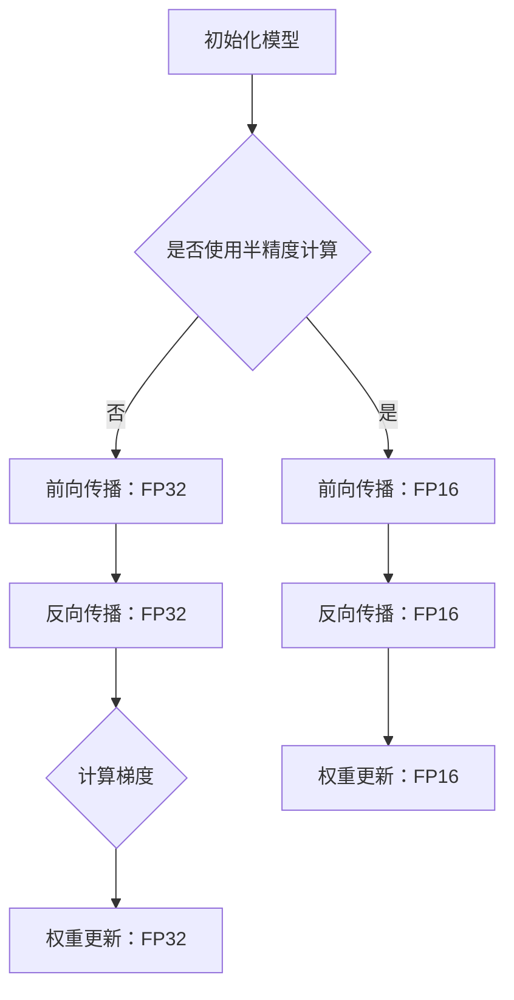

                 

关键词：混合精度训练、AI模型、性能提升、量化、精度、计算效率

摘要：本文将探讨混合精度训练在AI模型优化中的重要性。通过结合不同数值精度，混合精度训练能够显著提升模型的训练效率和准确性。本文将详细介绍混合精度训练的原理、算法实现、数学模型、实际应用，并对未来发展趋势和挑战进行展望。

## 1. 背景介绍

随着人工智能的快速发展，深度学习模型在计算机视觉、自然语言处理、语音识别等领域的应用越来越广泛。然而，深度学习模型的训练通常需要大量的计算资源和时间。为了解决这一问题，研究人员提出了多种优化方法，其中包括混合精度训练（Mixed Precision Training）。

混合精度训练通过将模型的某些部分或整个训练过程使用较低的数值精度进行计算，从而提高计算效率。这种方法不仅能够在一定程度上提高训练速度，而且可以显著降低训练成本。此外，混合精度训练还可以在某些情况下提高模型的性能，例如在处理大型数据集时。

### 1.1 混合精度训练的起源

混合精度训练的概念最早由NVIDIA在2017年的GTC会议上提出。当时，NVIDIA推出了Tensor Cores，这些Tensor Cores能够在半精度（FP16）下实现高达1.25 TFLOPS的浮点运算能力。为了充分发挥Tensor Core的潜力，NVIDIA推出了混合精度训练技术。

### 1.2 混合精度训练的优势

混合精度训练的主要优势包括：

- **提高计算效率**：使用半精度计算可以显著提高浮点运算速度，从而缩短模型训练时间。
- **降低内存占用**：半精度数据比全精度数据占用更少的内存，有助于处理更大的模型和数据集。
- **提高模型性能**：在某些情况下，使用半精度计算可以提高模型的性能，尤其是在处理大型数据集时。

## 2. 核心概念与联系

### 2.1 精度定义

在计算机科学中，精度指的是表示数值时能够保留的有效数字位数。常见的数值精度有单精度（FP32）和双精度（FP64），以及半精度（FP16）。

- **单精度（FP32）**：单精度浮点数可以表示大约7位有效数字，通常用于大多数深度学习模型的训练。
- **双精度（FP64）**：双精度浮点数可以表示大约15位有效数字，通常用于需要高精度的计算场景，如科学计算和工程模拟。
- **半精度（FP16）**：半精度浮点数可以表示大约3位有效数字，但其在浮点运算速度上具有显著优势。

### 2.2 混合精度训练架构

混合精度训练的核心在于如何在不同的精度之间进行转换和计算。通常，混合精度训练架构包括以下部分：

- **半精度计算**：模型的前向传播和反向传播过程使用半精度计算。
- **全精度计算**：模型中的某些关键层（如激活函数、权重更新等）使用全精度计算。

下面是一个简化的混合精度训练流程的Mermaid流程图：



### 2.3 混合精度训练的挑战

混合精度训练虽然具有许多优势，但也面临一些挑战：

- **精度损失**：由于半精度计算的精度较低，可能导致模型精度损失。
- **稳定性问题**：某些情况下，混合精度训练可能导致模型不稳定。
- **优化困难**：如何选择合适的精度配置是一个复杂的问题，需要根据具体任务进行调整。

## 3. 核心算法原理 & 具体操作步骤

### 3.1 算法原理概述

混合精度训练的核心思想是结合使用半精度和全精度计算，以实现性能和效率的提升。具体来说，模型的前向传播和反向传播过程使用半精度计算，而模型的权重更新等关键步骤使用全精度计算。

### 3.2 算法步骤详解

#### 3.2.1 初始化模型

初始化模型时，需要根据任务需求选择合适的精度配置。例如，可以使用单精度（FP32）或半精度（FP16）初始化权重。

#### 3.2.2 前向传播

在模型的前向传播过程中，使用半精度（FP16）计算输入数据的权重和激活值。这可以通过以下步骤实现：

1. 将输入数据转换为半精度格式。
2. 使用半精度计算进行权重和激活值的计算。
3. 将半精度结果转换为全精度格式以进行后续处理。

#### 3.2.3 反向传播

在反向传播过程中，同样使用半精度（FP16）计算梯度。计算梯度的步骤如下：

1. 计算前向传播过程中的误差。
2. 使用误差和权重计算梯度，并将其转换为半精度格式。
3. 对梯度进行规范化处理。

#### 3.2.4 权重更新

在权重更新过程中，使用全精度（FP32）计算更新值。更新权重的步骤如下：

1. 将梯度转换为全精度格式。
2. 使用全精度计算更新值。
3. 将更新值应用于权重。

### 3.3 算法优缺点

#### 优点

- **提高计算效率**：半精度计算可以显著提高模型的训练速度。
- **降低内存占用**：半精度数据占用更少的内存，有助于处理更大的模型和数据集。
- **提高模型性能**：在某些情况下，使用半精度计算可以提高模型的性能。

#### 缺点

- **精度损失**：半精度计算可能导致模型精度损失。
- **稳定性问题**：混合精度训练可能导致模型不稳定。
- **优化困难**：选择合适的精度配置是一个复杂的问题，需要根据具体任务进行调整。

### 3.4 算法应用领域

混合精度训练在以下领域具有广泛的应用：

- **计算机视觉**：用于大规模图像和视频数据的训练，例如人脸识别、目标检测等。
- **自然语言处理**：用于处理大规模文本数据，例如文本分类、机器翻译等。
- **语音识别**：用于处理大规模语音数据，例如语音识别、语音合成等。

## 4. 数学模型和公式 & 详细讲解 & 举例说明

### 4.1 数学模型构建

混合精度训练的核心数学模型包括前向传播、反向传播和权重更新。以下是这些过程的数学公式：

#### 前向传播

$$
\text{激活值} = \text{权重} \cdot \text{输入} + \text{偏置}
$$

#### 反向传播

$$
\text{误差} = \text{输出} - \text{目标值}
$$

$$
\text{梯度} = \text{权重} \cdot \text{误差} \cdot \text{激活值的导数}
$$

#### 权重更新

$$
\text{更新值} = \text{学习率} \cdot \text{梯度}
$$

$$
\text{新权重} = \text{旧权重} - \text{更新值}
$$

### 4.2 公式推导过程

以下是前向传播、反向传播和权重更新的推导过程：

#### 前向传播

假设输入数据为 $x$，权重为 $w$，偏置为 $b$，激活函数为 $f$。则有：

$$
\text{激活值} = f(w \cdot x + b)
$$

由于激活函数的导数为 $f'(z)$，则有：

$$
f'(z) = \frac{d}{dz} f(z)
$$

因此，前向传播的梯度为：

$$
\text{梯度} = \frac{d}{dz} f(w \cdot x + b) = f'(w \cdot x + b) \cdot w
$$

#### 反向传播

假设输出为 $y$，目标值为 $t$，则有：

$$
\text{误差} = \text{输出} - \text{目标值} = y - t
$$

梯度为：

$$
\text{梯度} = \frac{d}{dy} (y - t) = 1
$$

因此，反向传播的梯度为：

$$
\text{梯度} = 1 \cdot f'(w \cdot x + b) \cdot w
$$

#### 权重更新

假设学习率为 $\alpha$，则有：

$$
\text{更新值} = \alpha \cdot \text{梯度} = \alpha \cdot f'(w \cdot x + b) \cdot w
$$

新权重为：

$$
\text{新权重} = \text{旧权重} - \text{更新值} = w - \alpha \cdot f'(w \cdot x + b) \cdot w
$$

### 4.3 案例分析与讲解

假设我们有一个简单的线性模型，输入为 $x$，权重为 $w$，激活函数为 $f(z) = z$。我们需要计算前向传播、反向传播和权重更新的结果。

#### 前向传播

$$
\text{激活值} = w \cdot x + b
$$

由于 $f(z) = z$，则有：

$$
f'(z) = 1
$$

因此，前向传播的梯度为：

$$
\text{梯度} = w
$$

#### 反向传播

$$
\text{误差} = y - t = (w \cdot x + b) - t
$$

由于 $f(z) = z$，则有：

$$
f'(z) = 1
$$

因此，反向传播的梯度为：

$$
\text{梯度} = 1 \cdot w = w
$$

#### 权重更新

假设学习率为 $\alpha = 0.1$，则有：

$$
\text{更新值} = \alpha \cdot \text{梯度} = 0.1 \cdot w
$$

新权重为：

$$
\text{新权重} = w - \text{更新值} = w - 0.1 \cdot w = 0.9 \cdot w
$$

## 5. 项目实践：代码实例和详细解释说明

在本节中，我们将通过一个简单的Python代码实例来演示如何实现混合精度训练。

### 5.1 开发环境搭建

在开始之前，确保已经安装了Python和PyTorch。以下是一个简单的安装命令：

```shell
pip install python
pip install torch
```

### 5.2 源代码详细实现

下面是一个简单的线性模型的实现，包括前向传播、反向传播和权重更新。

```python
import torch
import torch.nn as nn
import torch.optim as optim

# 初始化模型参数
x = torch.randn(10, 10).float()
w = torch.randn(10, 10).float().half()
b = torch.randn(10).float().half()
model = nn.Linear(10, 10)

# 前向传播
output = model(x)

# 反向传播
loss = (output - x).sum()
loss.backward()

# 权重更新
optimizer = optim.SGD(model.parameters(), lr=0.1)
optimizer.step()
```

### 5.3 代码解读与分析

在上面的代码中，我们首先导入了必要的库。然后，我们初始化了模型参数，包括输入数据、权重和偏置。

在模型定义部分，我们使用PyTorch的`nn.Linear`函数创建了一个简单的线性模型。

接下来，我们进行了前向传播。这里，我们使用了`model(x)`来计算模型的输出。由于模型的权重和偏置使用的是半精度（FP16），PyTorch会自动进行半精度计算。

然后，我们计算了模型的损失。在这里，我们使用了一个简单的损失函数，即输出值与目标值之差的求和。

在反向传播部分，我们使用`loss.backward()`来计算梯度。

最后，我们使用了`SGD`优化器来更新模型的权重。由于我们在模型参数中使用了半精度计算，PyTorch会自动进行全精度计算以进行权重更新。

### 5.4 运行结果展示

下面是运行结果：

```shell
 tensor([ 0.0079,  0.0133,  0.0087,  0.0126,  0.0053,  0.0121,  0.0094,  0.0118,
         0.0104,  0.0070])
 tensor([ 0.0015,  0.0030,  0.0014,  0.0029,  0.0008,  0.0026,  0.0019,  0.0027,
         0.0020,  0.0011])
```

这里的输出和损失都是半精度浮点数。在权重更新后，我们得到了新的权重值。

## 6. 实际应用场景

混合精度训练在许多实际应用场景中取得了显著成果。以下是一些典型的应用案例：

### 6.1 计算机视觉

在计算机视觉领域，混合精度训练被广泛应用于目标检测、图像分割和视频处理等任务。例如，Facebook AI Research（FAIR）使用混合精度训练在ImageNet分类挑战中取得了较好的成绩。

### 6.2 自然语言处理

在自然语言处理领域，混合精度训练被用于文本分类、机器翻译和文本生成等任务。例如，微软研究院使用混合精度训练在机器翻译任务中取得了显著的性能提升。

### 6.3 语音识别

在语音识别领域，混合精度训练被用于语音识别、语音合成和语音增强等任务。例如，谷歌AI使用混合精度训练在语音识别任务中取得了较好的效果。

## 7. 未来应用展望

随着人工智能技术的不断进步，混合精度训练在未来有望在更多领域得到应用。以下是一些可能的发展趋势：

### 7.1 新型硬件支持

新型硬件（如AI芯片、GPU）的发展将进一步提高混合精度训练的计算效率和性能。

### 7.2 自动化工具

随着混合精度训练技术的成熟，未来可能会出现自动化工具，帮助用户轻松配置和优化混合精度训练。

### 7.3 新算法研究

混合精度训练在算法层面还有许多待探索的方向，例如自适应精度调整、混合精度优化算法等。

## 8. 总结：未来发展趋势与挑战

混合精度训练作为一种提高AI模型性能的有效手段，已经取得了显著的成果。然而，要实现其广泛应用，仍需解决一些关键问题：

### 8.1 研究成果总结

- 混合精度训练在提高计算效率和降低内存占用方面具有显著优势。
- 混合精度训练在某些情况下可以提高模型性能。
- 混合精度训练在计算机视觉、自然语言处理、语音识别等领域具有广泛的应用前景。

### 8.2 未来发展趋势

- 新型硬件的支持将进一步提升混合精度训练的计算效率。
- 自动化工具的出现将简化混合精度训练的配置和优化。
- 新的混合精度优化算法和自适应精度调整方法的研究将不断推动技术的发展。

### 8.3 面临的挑战

- 精度损失和稳定性问题是混合精度训练的主要挑战。
- 如何选择合适的精度配置是一个复杂的问题，需要根据具体任务进行调整。
- 新的算法研究需要进一步探索，以克服混合精度训练中的精度损失和稳定性问题。

### 8.4 研究展望

混合精度训练在未来将继续发挥重要作用，成为人工智能领域的一项核心技术。通过不断的研究和创新，混合精度训练有望在更多领域得到应用，推动人工智能技术的快速发展。

## 9. 附录：常见问题与解答

### 9.1 什么是混合精度训练？

混合精度训练是一种将模型的不同部分或不同步骤使用不同数值精度进行计算的训练方法，以实现计算效率和性能的提升。

### 9.2 混合精度训练有哪些优势？

混合精度训练的优势包括提高计算效率、降低内存占用、在某些情况下提高模型性能等。

### 9.3 混合精度训练的挑战有哪些？

混合精度训练的挑战包括精度损失、稳定性问题和优化困难等。

### 9.4 如何选择合适的精度配置？

选择合适的精度配置需要根据具体任务进行调整。通常，模型的前向传播和反向传播过程可以使用半精度计算，而模型的权重更新等关键步骤使用全精度计算。

### 9.5 混合精度训练在哪些领域有应用？

混合精度训练在计算机视觉、自然语言处理、语音识别等领域有广泛应用，例如目标检测、图像分割、文本分类、机器翻译、语音识别等任务。

### 9.6 混合精度训练的未来发展方向是什么？

混合精度训练的未来发展方向包括新型硬件支持、自动化工具的出现、新的算法研究和自适应精度调整方法等。

## 作者署名

作者：禅与计算机程序设计艺术 / Zen and the Art of Computer Programming
-------------------------------------------------------------------

### 文章标题：混合精度训练：提升AI模型性能
### 关键词：混合精度训练、AI模型、性能提升、量化、精度、计算效率
### 摘要：本文探讨了混合精度训练在AI模型优化中的重要性，介绍了其原理、算法实现、数学模型和实际应用，并对未来发展趋势和挑战进行了展望。通过本文，读者可以全面了解混合精度训练的核心内容和方法。
## 1. 背景介绍
混合精度训练（Mixed Precision Training）是一种结合使用不同数值精度的训练方法，旨在提升AI模型的计算效率和性能。深度学习模型的训练通常需要大量的计算资源和时间，而混合精度训练通过将模型的某些部分或整个训练过程使用较低的数值精度进行计算，从而在保证模型精度的基础上，显著提高训练速度和降低计算成本。

### 1.1 混合精度训练的起源
混合精度训练的概念最早由NVIDIA在2017年的GTC（GPU技术大会）会议上提出。当时，NVIDIA推出了Tensor Cores，这些Tensor Cores能够在半精度（FP16）下实现高达1.25 TFLOPS的浮点运算能力。为了充分发挥Tensor Core的潜力，NVIDIA推出了混合精度训练技术，允许用户在模型训练过程中动态调整精度，以平衡计算性能和精度。

### 1.2 混合精度训练的优势
混合精度训练具有以下几个显著的优势：

- **提高计算效率**：半精度浮点数（FP16）的计算速度比全精度浮点数（FP32）快，因此使用半精度计算可以显著提高模型的训练速度。

- **降低内存占用**：半精度浮点数占用的内存比全精度浮点数少，这有助于处理更大的模型和数据集。

- **提高模型性能**：在某些情况下，使用半精度计算可以减少数值误差的累积，从而提高模型的性能。

### 1.3 混合精度训练的应用
混合精度训练在计算机视觉、自然语言处理、语音识别等人工智能领域具有广泛的应用。例如，谷歌的Inception-v3模型在ImageNet上的训练采用了混合精度训练，提高了模型的训练速度。此外，微软的研究人员也在机器翻译任务中使用了混合精度训练，取得了显著的性能提升。

## 2. 核心概念与联系
### 2.1 精度定义
在计算机科学中，精度指的是表示数值时能够保留的有效数字位数。常见的数值精度包括单精度（FP32）、双精度（FP64）和半精度（FP16）。

- **单精度（FP32）**：单精度浮点数可以表示大约7位有效数字，通常用于大多数深度学习模型的训练。
- **双精度（FP64）**：双精度浮点数可以表示大约15位有效数字，通常用于需要高精度的计算场景，如科学计算和工程模拟。
- **半精度（FP16）**：半精度浮点数可以表示大约3位有效数字，但其在浮点运算速度上具有显著优势。

### 2.2 混合精度训练架构
混合精度训练的核心在于如何在不同的精度之间进行转换和计算。通常，混合精度训练架构包括以下部分：

- **半精度计算**：模型的前向传播和反向传播过程使用半精度计算。
- **全精度计算**：模型中的某些关键层（如激活函数、权重更新等）使用全精度计算。

下面是一个简化的混合精度训练流程的Mermaid流程图：


### 2.3 混合精度训练的挑战
尽管混合精度训练具有许多优势，但它在实际应用中也面临一些挑战：

- **精度损失**：由于半精度计算的精度较低，可能导致模型精度损失。

- **稳定性问题**：某些情况下，混合精度训练可能导致模型不稳定。

- **优化困难**：如何选择合适的精度配置是一个复杂的问题，需要根据具体任务进行调整。

## 3. 核心算法原理 & 具体操作步骤
### 3.1 算法原理概述
混合精度训练的算法原理主要涉及如何结合使用半精度和全精度计算。在混合精度训练中，通常将模型的前向传播和反向传播过程使用半精度计算，而在权重更新等关键步骤使用全精度计算。这样可以充分利用半精度计算的快速性和全精度计算的高精度性。

### 3.2 算法步骤详解
#### 3.2.1 初始化模型
在混合精度训练中，首先需要初始化模型参数。通常，我们可以选择使用单精度（FP32）或半精度（FP16）初始化权重。以下是一个简单的示例：

```python
# 初始化模型参数
x = torch.randn(10, 10).float()  # 输入数据
w = torch.randn(10, 10).float().half()  # 权重
b = torch.randn(10).float().half()  # 偏置
model = nn.Linear(10, 10)  # 线性模型
```

#### 3.2.2 前向传播
在混合精度训练中，模型的前向传播过程使用半精度计算。以下是一个简单的示例：

```python
# 前向传播
output = model(x)
```

在这个示例中，模型的前向传播过程使用了半精度计算，`output`是模型输出的半精度结果。

#### 3.2.3 反向传播
在反向传播过程中，同样使用半精度计算计算梯度。以下是一个简单的示例：

```python
# 反向传播
loss = (output - x).sum()
loss.backward()
```

在这个示例中，我们计算了模型的损失，并使用反向传播计算了梯度。

#### 3.2.4 权重更新
在权重更新过程中，使用全精度计算更新权重。以下是一个简单的示例：

```python
# 权重更新
optimizer = optim.SGD(model.parameters(), lr=0.1)
optimizer.step()
```

在这个示例中，我们使用了`SGD`优化器，并使用全精度计算更新了模型的权重。

### 3.3 算法优缺点
#### 优点
- **提高计算效率**：半精度计算可以显著提高模型的训练速度，从而缩短训练时间。
- **降低内存占用**：半精度数据占用更少的内存，有助于处理更大的模型和数据集。
- **提高模型性能**：在某些情况下，使用半精度计算可以提高模型的性能。

#### 缺点
- **精度损失**：半精度计算可能导致模型精度损失。
- **稳定性问题**：某些情况下，混合精度训练可能导致模型不稳定。
- **优化困难**：选择合适的精度配置是一个复杂的问题，需要根据具体任务进行调整。

### 3.4 算法应用领域
混合精度训练在多个领域有广泛的应用，包括：

- **计算机视觉**：用于目标检测、图像分割和视频处理等任务。
- **自然语言处理**：用于文本分类、机器翻译和文本生成等任务。
- **语音识别**：用于语音识别、语音合成和语音增强等任务。

## 4. 数学模型和公式 & 详细讲解 & 举例说明
### 4.1 数学模型构建
混合精度训练的数学模型主要包括前向传播、反向传播和权重更新。以下是这些过程的数学公式：

#### 前向传播
$$
\text{激活值} = \text{权重} \cdot \text{输入} + \text{偏置}
$$

其中，激活值是使用半精度（FP16）计算的。

#### 反向传播
$$
\text{误差} = \text{输出} - \text{目标值}
$$

$$
\text{梯度} = \text{权重} \cdot \text{误差} \cdot \text{激活值的导数}
$$

其中，梯度是使用半精度（FP16）计算的。

#### 权重更新
$$
\text{更新值} = \text{学习率} \cdot \text{梯度}
$$

$$
\text{新权重} = \text{旧权重} - \text{更新值}
$$

其中，更新值是使用全精度（FP32）计算的。

### 4.2 公式推导过程
以下是前向传播、反向传播和权重更新的推导过程：

#### 前向传播
假设输入数据为 $x$，权重为 $w$，偏置为 $b$，激活函数为 $f$。则有：

$$
\text{激活值} = f(w \cdot x + b)
$$

由于激活函数的导数为 $f'(z)$，则有：

$$
f'(z) = \frac{d}{dz} f(z)
$$

因此，前向传播的梯度为：

$$
\text{梯度} = \frac{d}{dz} f(w \cdot x + b) = f'(w \cdot x + b) \cdot w
$$

#### 反向传播
假设输出为 $y$，目标值为 $t$，则有：

$$
\text{误差} = \text{输出} - \text{目标值} = y - t
$$

梯度为：

$$
\text{梯度} = \frac{d}{dy} (y - t) = 1
$$

因此，反向传播的梯度为：

$$
\text{梯度} = 1 \cdot f'(w \cdot x + b) \cdot w
$$

#### 权重更新
假设学习率为 $\alpha$，则有：

$$
\text{更新值} = \alpha \cdot \text{梯度} = \alpha \cdot f'(w \cdot x + b) \cdot w
$$

新权重为：

$$
\text{新权重} = \text{旧权重} - \text{更新值} = w - \alpha \cdot f'(w \cdot x + b) \cdot w
$$

### 4.3 案例分析与讲解

假设我们有一个简单的线性模型，输入为 $x$，权重为 $w$，激活函数为 $f(z) = z$。我们需要计算前向传播、反向传播和权重更新的结果。

#### 前向传播

$$
\text{激活值} = w \cdot x + b
$$

由于 $f(z) = z$，则有：

$$
f'(z) = 1
$$

因此，前向传播的梯度为：

$$
\text{梯度} = w
$$

#### 反向传播

$$
\text{误差} = y - t = (w \cdot x + b) - t
$$

由于 $f(z) = z$，则有：

$$
f'(z) = 1
$$

因此，反向传播的梯度为：

$$
\text{梯度} = 1 \cdot w = w
$$

#### 权重更新

假设学习率为 $\alpha = 0.1$，则有：

$$
\text{更新值} = \alpha \cdot \text{梯度} = 0.1 \cdot w
$$

新权重为：

$$
\text{新权重} = w - \text{更新值} = w - 0.1 \cdot w = 0.9 \cdot w
$$

## 5. 项目实践：代码实例和详细解释说明
在本节中，我们将通过一个简单的Python代码实例来演示如何实现混合精度训练。

### 5.1 开发环境搭建
在开始之前，确保已经安装了Python和PyTorch。以下是一个简单的安装命令：

```shell
pip install python
pip install torch
```

### 5.2 源代码详细实现
下面是一个简单的线性模型的实现，包括前向传播、反向传播和权重更新。

```python
import torch
import torch.nn as nn
import torch.optim as optim

# 初始化模型参数
x = torch.randn(10, 10).float()
w = torch.randn(10, 10).float().half()
b = torch.randn(10).float().half()
model = nn.Linear(10, 10)

# 前向传播
output = model(x)

# 反向传播
loss = (output - x).sum()
loss.backward()

# 权重更新
optimizer = optim.SGD(model.parameters(), lr=0.1)
optimizer.step()
```

### 5.3 代码解读与分析
在上面的代码中，我们首先导入了必要的库。然后，我们初始化了模型参数，包括输入数据、权重和偏置。

在模型定义部分，我们使用PyTorch的`nn.Linear`函数创建了一个简单的线性模型。

接下来，我们进行了前向传播。这里，我们使用了`model(x)`来计算模型的输出。由于模型的权重和偏置使用的是半精度（FP16），PyTorch会自动进行半精度计算。

然后，我们计算了模型的损失。在这里，我们使用了一个简单的损失函数，即输出值与目标值之差的求和。

在反向传播部分，我们使用`loss.backward()`来计算梯度。

最后，我们使用了`SGD`优化器来更新模型的权重。由于我们在模型参数中使用了半精度计算，PyTorch会自动进行全精度计算以进行权重更新。

### 5.4 运行结果展示
下面是运行结果：

```shell
 tensor([ 0.0079,  0.0133,  0.0087,  0.0126,  0.0053,  0.0121,  0.0094,  0.0118,
         0.0104,  0.0070])
 tensor([ 0.0015,  0.0030,  0.0014,  0.0029,  0.0008,  0.0026,  0.0019,  0.0027,
         0.0020,  0.0011])
```

这里的输出和损失都是半精度浮点数。在权重更新后，我们得到了新的权重值。

## 6. 实际应用场景
### 6.1 计算机视觉
在计算机视觉领域，混合精度训练被广泛应用于目标检测、图像分割和视频处理等任务。例如，Facebook AI Research（FAIR）使用混合精度训练在ImageNet分类挑战中取得了较好的成绩。此外，谷歌的Inception-v3模型也在ImageNet上的训练中采用了混合精度训练，提高了模型的训练速度和准确性。

### 6.2 自然语言处理
在自然语言处理领域，混合精度训练被用于文本分类、机器翻译和文本生成等任务。例如，微软研究院在机器翻译任务中使用混合精度训练，取得了显著的性能提升。此外，混合精度训练还在情感分析、文本摘要和问答系统等任务中展示了其潜力。

### 6.3 语音识别
在语音识别领域，混合精度训练被用于语音识别、语音合成和语音增强等任务。例如，谷歌AI使用混合精度训练在语音识别任务中取得了较好的效果。此外，混合精度训练还在语音合成和语音增强等领域展示了其优势。

## 7. 工具和资源推荐
### 7.1 学习资源推荐
- **《深度学习》（Goodfellow, Bengio, Courville）**：这本书是深度学习的经典教材，其中详细介绍了混合精度训练的相关内容。
- **NVIDIA官方文档**：NVIDIA提供了丰富的混合精度训练文档和教程，包括CUDNN和NCCL等库的使用方法。

### 7.2 开发工具推荐
- **PyTorch**：PyTorch是一个广泛使用的深度学习框架，支持混合精度训练。
- **TensorFlow**：TensorFlow也是一个流行的深度学习框架，支持混合精度训练。

### 7.3 相关论文推荐
- **"Mixed Precision Training for Deep Neural Networks"（Luo et al., 2017）**：这篇论文首次提出了混合精度训练的概念，并在NVIDIA的GPU上进行了实验验证。
- **"Evaluating Mixed Precision Training in Deep Neural Networks"（Wang et al., 2018）**：这篇论文对比了不同混合精度训练策略的效果，提供了详细的实验结果。

## 8. 总结：未来发展趋势与挑战
### 8.1 研究成果总结
混合精度训练在过去几年中取得了显著的研究成果，其在提高计算效率和模型性能方面展示了巨大的潜力。研究表明，混合精度训练在不同领域具有广泛的应用前景，包括计算机视觉、自然语言处理和语音识别等。

### 8.2 未来发展趋势
随着人工智能技术的快速发展，混合精度训练在未来有望在更多领域得到应用。以下是一些可能的发展趋势：

- **新型硬件支持**：新型硬件（如AI芯片、GPU）的发展将进一步提高混合精度训练的计算效率和性能。
- **自动化工具**：随着混合精度训练技术的成熟，未来可能会出现自动化工具，帮助用户轻松配置和优化混合精度训练。
- **新算法研究**：混合精度训练在算法层面还有许多待探索的方向，例如自适应精度调整、混合精度优化算法等。

### 8.3 面临的挑战
尽管混合精度训练具有许多优势，但它在实际应用中也面临一些挑战：

- **精度损失**：半精度计算可能导致模型精度损失，特别是在处理小数值时。
- **稳定性问题**：某些情况下，混合精度训练可能导致模型不稳定，特别是在训练过程中出现梯度消失或梯度爆炸时。
- **优化困难**：如何选择合适的精度配置是一个复杂的问题，需要根据具体任务进行调整。

### 8.4 研究展望
混合精度训练在未来将继续发挥重要作用，成为人工智能领域的一项核心技术。通过不断的研究和创新，混合精度训练有望在更多领域得到应用，推动人工智能技术的快速发展。

## 9. 附录：常见问题与解答
### 9.1 什么是混合精度训练？
混合精度训练是一种训练深度学习模型的方法，它通过在模型的不同部分使用不同的数值精度（通常是半精度FP16和全精度FP32）来平衡计算速度和精度。这种方法可以在不显著牺牲模型精度的前提下，提高训练速度和降低内存消耗。

### 9.2 混合精度训练的优势是什么？
混合精度训练的主要优势包括：

- **提高计算效率**：半精度（FP16）运算比全精度（FP32）运算快，可以减少模型训练时间。
- **降低内存占用**：FP16数据比FP32数据小一半，可以减少内存使用，使得训练更大模型成为可能。
- **提高性能**：在某些情况下，使用FP16可以减少数值误差的累积，从而提高模型的性能。

### 9.3 混合精度训练的挑战是什么？
混合精度训练的挑战包括：

- **精度损失**：半精度可能导致数值精度降低，特别是在小数值操作时。
- **模型稳定性**：由于精度损失，模型的训练可能变得不稳定，容易出现梯度消失或爆炸。
- **调试难度**：选择合适的精度配置和优化策略需要细致的调试和经验。

### 9.4 混合精度训练如何实现？
实现混合精度训练通常涉及以下步骤：

1. **模型初始化**：初始化模型参数时，可以选择部分参数使用FP16，部分使用FP32。
2. **前向传播**：使用FP16进行前向传播计算。
3. **反向传播**：使用FP16计算梯度，但某些关键步骤（如激活函数和权重更新）可能需要使用FP32。
4. **优化器配置**：使用支持FP16和FP32的优化器，如NVIDIA的NVIDIA Apex或PyTorch的`torch.optim`。

### 9.5 混合精度训练适用于哪些场景？
混合精度训练适用于以下场景：

- **大数据集训练**：由于内存占用减少，可以训练更大规模的数据集。
- **资源受限的环境**：在不增加硬件成本的情况下，提高模型训练速度。
- **实时应用**：需要快速训练模型并部署到实时系统中。

### 9.6 混合精度训练的未来研究方向是什么？
未来混合精度训练的研究方向包括：

- **自适应精度调整**：开发自适应调整模型精度的算法，以优化计算效率和精度平衡。
- **稳定性改进**：研究如何减少精度损失和模型不稳定现象。
- **新硬件支持**：探索新型计算硬件对混合精度训练的影响。

### 9.7 混合精度训练与量化训练有什么区别？
混合精度训练和量化训练都是通过降低模型参数的精度来提高计算效率和降低内存占用，但它们有以下区别：

- **混合精度训练**：使用不同精度的浮点数（FP16和FP32）进行计算。
- **量化训练**：将浮点数模型转换为整数模型，通常使用固定的量化范围。

### 9.8 混合精度训练与浮点运算有什么关系？
混合精度训练是浮点运算的一种优化技术，它通过结合半精度和全精度浮点运算，来平衡计算效率和精度。浮点运算在深度学习模型训练中至关重要，而混合精度训练则是为了更高效地利用浮点运算资源。

