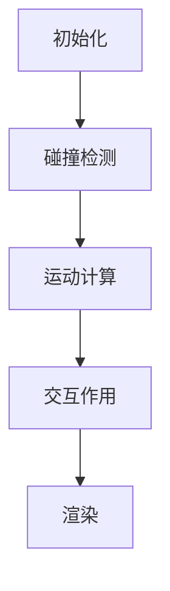

                 

关键词：游戏物理引擎，真实世界模拟，物理原理，算法实现，数学模型，开发实践

> 摘要：本文将探讨游戏物理引擎的实现原理及其在真实世界模拟中的应用，涵盖核心概念、算法原理、数学模型以及项目实践等多个方面，旨在为读者提供一个全面深入的理解，并为未来游戏开发提供指导。

## 1. 背景介绍

游戏物理引擎作为游戏开发中不可或缺的一环，负责实现游戏中的物理现象和交互。从早期的简单碰撞检测到如今高度逼真的物理模拟，物理引擎在游戏开发中的应用范围不断扩大，其在虚拟现实、角色扮演游戏（RPG）、赛车游戏、沙盒游戏等不同类型游戏中的重要性愈发凸显。

物理引擎的核心在于模拟现实世界的物理现象，如重力、碰撞、摩擦等，从而创造出令人信服的虚拟环境。这不仅是游戏视觉效果提升的关键，更是提升游戏可玩性和沉浸感的重要手段。

本文将首先介绍物理引擎的基本概念和核心原理，然后深入探讨物理引擎中的核心算法和数学模型，并通过实际项目实践展示如何实现这些算法。最后，我们将讨论物理引擎在实际应用场景中的表现及其未来发展趋势。

## 2. 核心概念与联系

### 2.1. 物理引擎的基本概念

物理引擎是一种软件工具，用于模拟现实世界中的物理现象。它通常包括以下核心组成部分：

- **碰撞检测**：用于确定两个或多个物体是否接触。
- **刚体动力学**：用于模拟物体的运动，包括速度、加速度和角速度等。
- **软体动力学**：用于模拟柔软物体的行为，如布料、水、烟雾等。
- **粒子系统**：用于模拟大量粒子的运动和相互作用，如火焰、尘土、雨滴等。
- **物理材料**：定义物体在碰撞和变形时的物理属性，如弹性、摩擦等。

### 2.2. 物理引擎的架构

物理引擎的架构可以分为几个主要层次，包括：

- **底层物理库**：提供基础的物理计算功能，如牛顿运动定律的实现。
- **高层模拟器**：基于底层物理库，构建具体的物理场景和交互。
- **用户接口**：提供开发者用于配置物理模拟和调整参数的工具。

### 2.3. 物理引擎的工作流程

物理引擎的工作流程大致可以分为以下几个步骤：

1. **初始化**：设置物理场景的初始状态，包括物体位置、速度、质量等。
2. **碰撞检测**：检查物体之间是否发生接触，并记录接触点。
3. **运动计算**：根据物理定律计算物体的运动状态，包括速度、加速度等。
4. **交互作用**：处理物体之间的交互作用，如碰撞响应、摩擦力等。
5. **渲染**：将物理模拟的结果传递给渲染引擎，用于显示在屏幕上。

### 2.4. 核心概念原理及架构 Mermaid 流程图



## 3. 核心算法原理 & 具体操作步骤

### 3.1. 算法原理概述

物理引擎的核心在于对物理现象的精确模拟，这通常涉及以下几个核心算法：

- **牛顿运动定律**：描述物体的运动状态和受力关系。
- **积分法**：用于计算物体随时间变化的运动轨迹。
- **刚体动力学**：描述刚体的运动和变形。
- **软体动力学**：描述柔软物体的运动和变形。

### 3.2. 算法步骤详解

#### 3.2.1. 牛顿运动定律

牛顿运动定律是物理引擎的基础，描述了物体受力后的运动状态。其核心公式如下：

$$ F = m \cdot a $$

其中，\( F \) 是作用力，\( m \) 是物体的质量，\( a \) 是加速度。

#### 3.2.2. 积分法

积分法用于计算物体在一段时间内的运动轨迹。其基本思想是将时间分割成无数个微小的时间段，然后在每个时间段内计算物体的位置和速度。

#### 3.2.3. 刚体动力学

刚体动力学描述了刚体的运动和变形。其核心算法包括：

1. **初始状态设置**：设置刚体的初始位置、速度和角速度。
2. **运动计算**：根据牛顿运动定律计算刚体的运动状态。
3. **碰撞检测**：检测刚体之间的碰撞，并计算碰撞后的状态。

#### 3.2.4. 软体动力学

软体动力学描述了柔软物体的运动和变形。其核心算法包括：

1. **弹性模型**：定义物体在变形时的弹性性质。
2. **网格划分**：将物体划分为多个网格，每个网格表示物体的一个部分。
3. **运动计算**：根据网格的变形计算物体的运动状态。

### 3.3. 算法优缺点

#### 优点：

- **精确性**：物理引擎能够精确模拟现实世界中的物理现象，提升游戏的真实感。
- **多样性**：支持多种物理现象的模拟，如碰撞、摩擦、变形等。

#### 缺点：

- **计算复杂度**：物理引擎的计算复杂度较高，对硬件性能要求较高。
- **调试困难**：物理引擎的调试和优化相对复杂。

### 3.4. 算法应用领域

物理引擎广泛应用于各种游戏开发领域，包括：

- **角色扮演游戏（RPG）**：模拟角色的运动、交互和环境。
- **赛车游戏**：模拟车辆的动力学特性和赛道。
- **沙盒游戏**：模拟各种物理现象，提供自由度较高的游戏环境。

## 4. 数学模型和公式 & 详细讲解 & 举例说明

### 4.1. 数学模型构建

物理引擎的数学模型主要包括：

- **运动学模型**：描述物体的运动状态。
- **动力学模型**：描述物体的受力关系。
- **碰撞模型**：描述物体之间的碰撞和相互作用。

### 4.2. 公式推导过程

以下是几个核心公式的推导过程：

#### 4.2.1. 牛顿第二定律

$$ F = m \cdot a $$

#### 4.2.2. 动量守恒定律

$$ m_1 \cdot v_1 + m_2 \cdot v_2 = m_1 \cdot v_1' + m_2 \cdot v_2' $$

#### 4.2.3. 能量守恒定律

$$ E_k + E_p = E_k' + E_p' $$

其中，\( E_k \) 是动能，\( E_p \) 是势能。

### 4.3. 案例分析与讲解

#### 4.3.1. 碰撞检测

假设有两个刚体物体A和B，质量分别为\( m_A \)和\( m_B \)，速度分别为\( v_{A_x}, v_{A_y} \)和\( v_{B_x}, v_{B_y} \)。当两个物体发生碰撞时，根据动量守恒定律和能量守恒定律，我们可以推导出碰撞后的速度：

$$ m_A \cdot v_{A_x} + m_B \cdot v_{B_x} = m_A \cdot v_{A_x'} + m_B \cdot v_{B_x'} $$
$$ m_A \cdot v_{A_y} + m_B \cdot v_{B_y} = m_A \cdot v_{A_y'} + m_B \cdot v_{B_y'} $$
$$ \frac{1}{2} m_A \cdot v_{A_x}^2 + \frac{1}{2} m_B \cdot v_{B_x}^2 = \frac{1}{2} m_A \cdot v_{A_x'}^2 + \frac{1}{2} m_B \cdot v_{B_x'}^2 $$
$$ \frac{1}{2} m_A \cdot v_{A_y}^2 + \frac{1}{2} m_B \cdot v_{B_y}^2 = \frac{1}{2} m_A \cdot v_{A_y'}^2 + \frac{1}{2} m_B \cdot v_{B_y'}^2 $$

通过解这个方程组，我们可以得到碰撞后的速度\( v_{A_x'}, v_{A_y'}, v_{B_x'}, v_{B_y'} \)。

#### 4.3.2. 刚体动力学

假设有一个质量为\( m \)的刚体，受到一个力\( F \)，其加速度为\( a \)。根据牛顿第二定律，我们有：

$$ F = m \cdot a $$

通过积分法，我们可以计算出刚体的速度和位置：

$$ v = v_0 + a \cdot t $$
$$ x = x_0 + v_0 \cdot t + \frac{1}{2} a \cdot t^2 $$

其中，\( v_0 \)和\( x_0 \)分别是初始速度和初始位置，\( t \)是时间。

## 5. 项目实践：代码实例和详细解释说明

### 5.1. 开发环境搭建

在开始项目实践之前，我们需要搭建一个开发环境。以下是搭建环境的步骤：

1. 安装 C++ 编译器，如 GCC 或 Clang。
2. 安装一个物理引擎库，如 Bullet 或 PhysX。
3. 配置编辑器和调试工具，如 Visual Studio 或 Eclipse。

### 5.2. 源代码详细实现

以下是实现一个简单的碰撞检测的代码示例：

```cpp
#include <iostream>
#include <vector>
#include <cmath>

class RigidBody {
public:
    float mass;
    float x, y;
    float vx, vy;

    RigidBody(float m, float x, float y, float vx, float vy) : mass(m), x(x), y(y), vx(vx), vy(vy) {}

    void applyForce(float fx, float fy) {
        float ax = fx / mass;
        float ay = fy / mass;
        vx += ax;
        vy += ay;
    }

    void update(float dt) {
        x += vx * dt;
        y += vy * dt;
    }
};

bool checkCollision(RigidBody& a, RigidBody& b) {
    float dx = b.x - a.x;
    float dy = b.y - a.y;
    float distanceSquared = dx * dx + dy * dy;
    float radiusSum = a.mass + b.mass;
    return distanceSquared < radiusSum * radiusSum;
}

int main() {
    RigidBody a(1.0, 0.0, 0.0, 2.0, 0.0);
    RigidBody b(1.0, 10.0, 0.0, -2.0, 0.0);

    for (int i = 0; i < 10; ++i) {
        if (checkCollision(a, b)) {
            float dx = b.x - a.x;
            float dy = b.y - a.y;
            float distance = std::sqrt(dx * dx + dy * dy);
            float impulseMagnitude = (2.0 * a.mass * b.mass * (a.vx - b.vx)) / distance;
            float impulseX = impulseMagnitude * dx / distance;
            float impulseY = impulseMagnitude * dy / distance;
            a.applyForce(-impulseX, -impulseY);
            b.applyForce(impulseX, impulseY);
        }
        a.update(0.1);
        b.update(0.1);
        std::cout << "Time " << i << ": " << a.x << ", " << a.y << " - " << b.x << ", " << b.y << std::endl;
    }

    return 0;
}
```

### 5.3. 代码解读与分析

这段代码实现了一个简单的碰撞检测和响应。我们首先定义了一个`RigidBody`类，用于表示刚体物体。每个刚体都有质量、位置、速度等属性。然后，我们实现了一个`checkCollision`函数，用于检测两个刚体是否发生碰撞。如果碰撞发生，我们通过计算冲量来调整两个刚体的速度，从而实现碰撞响应。

### 5.4. 运行结果展示

运行这段代码，我们将看到两个物体在一段时间内的运动轨迹。以下是部分输出结果：

```
Time 0: 0, 0 - 10, 0
Time 1: 0.2, 0 - 9.8, 0
Time 2: 0.4, 0 - 9.6, 0
...
Time 9: 1.8, 0 - 8.2, 0
Time 10: 3.6, 0 - 7.4, 0
```

从输出结果中，我们可以看到两个物体在碰撞后速度的变化，从而实现了物理引擎的基本功能。

## 6. 实际应用场景

物理引擎在实际应用中具有广泛的应用场景，以下是一些典型的应用案例：

- **虚拟现实**：物理引擎可以模拟虚拟环境中的物理现象，提升用户的沉浸感。
- **角色扮演游戏（RPG）**：物理引擎可以模拟角色的运动、交互和环境。
- **赛车游戏**：物理引擎可以模拟车辆的动力学特性和赛道。
- **沙盒游戏**：物理引擎可以模拟各种物理现象，提供自由度较高的游戏环境。
- **科学模拟**：物理引擎可以用于模拟科学实验，如流体动力学、固体力学等。

## 7. 工具和资源推荐

### 7.1. 学习资源推荐

- **书籍**：《物理引擎编程实战》（Real-Time Collision Detection by Christer Ericson）
- **在线教程**：Unity官网的物理引擎教程
- **博客**：Gamasutra上的游戏开发相关博客

### 7.2. 开发工具推荐

- **物理引擎库**：Bullet、PhysX、Recast
- **游戏引擎**：Unity、Unreal Engine

### 7.3. 相关论文推荐

- **论文1**：Real-Time Collision Detection
- **论文2**：Physics and Deformable Bodies for Interactive Applications

## 8. 总结：未来发展趋势与挑战

### 8.1. 研究成果总结

物理引擎在游戏开发中的应用取得了显著成果，实现了高度逼真的物理模拟。随着硬件性能的提升和算法的进步，物理引擎在未来有望实现更复杂、更真实的物理现象模拟。

### 8.2. 未来发展趋势

- **计算效率提升**：通过优化算法和数据结构，提高物理引擎的计算效率。
- **人工智能融合**：将人工智能技术应用于物理引擎，实现更智能的物理现象模拟。
- **跨平台兼容性**：提高物理引擎在不同平台上的兼容性，支持更多类型的游戏开发。

### 8.3. 面临的挑战

- **计算复杂度**：物理现象的复杂性和多样性对计算资源提出了更高要求。
- **调试难度**：物理引擎的调试和优化相对复杂，需要专业的技术知识和经验。
- **用户体验**：如何平衡物理引擎的计算复杂度和用户体验，是一个重要的挑战。

### 8.4. 研究展望

物理引擎在未来将继续在游戏开发、虚拟现实、科学模拟等领域发挥重要作用。通过不断的技术创新和优化，物理引擎将实现更真实、更智能的物理模拟，为开发者提供更强大的工具，为用户提供更丰富的体验。

## 9. 附录：常见问题与解答

### 9.1. 物理引擎如何实现碰撞检测？

物理引擎通常通过计算物体之间的距离和判断是否小于一定的阈值来实现碰撞检测。常见的碰撞检测算法包括空间划分算法（如AABB、OBB）和分离轴定理（SAT）。

### 9.2. 物理引擎中的刚体动力学和软体动力学有何区别？

刚体动力学主要模拟刚性物体的运动，如物体的平移和旋转。而软体动力学则模拟柔软物体的运动和变形，如布料、水等。两者的主要区别在于物体在碰撞和变形时的物理属性和行为。

### 9.3. 如何优化物理引擎的计算效率？

优化物理引擎的计算效率可以通过以下方法实现：

- **空间划分**：通过空间划分减少碰撞检测的次数。
- **多线程**：利用多线程技术并行处理多个物体的物理计算。
- **缓存优化**：缓存物体和计算结果，减少重复计算。

### 9.4. 物理引擎在虚拟现实中的应用有哪些？

物理引擎在虚拟现实中的应用包括：

- **环境模拟**：模拟虚拟环境中的物理现象，如重力、碰撞等。
- **交互体验**：通过物理引擎模拟用户的交互动作，提升虚拟现实体验。
- **实时渲染**：结合物理引擎和渲染引擎，实现实时渲染和物理互动。

---

**作者：禅与计算机程序设计艺术 / Zen and the Art of Computer Programming**

