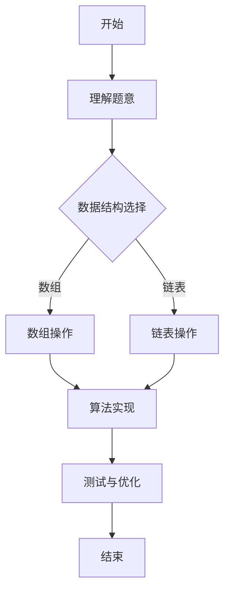

                 

关键词：滴滴校招、面试真题、算法题解、编程技巧、数据结构与算法、求职策略

> 摘要：本文将深入分析滴滴2024校招面试真题，探讨各个算法题目的解题思路与技巧，旨在帮助求职者在面对此类面试时能够从容应对，掌握核心算法原理，提升自身竞争力。

## 1. 背景介绍

随着技术的飞速发展，人工智能和大数据在交通领域中的应用日益广泛，滴滴出行作为全球领先的移动出行平台，其校招面试题目不仅考查了应聘者的编程能力和数据结构知识，还涉及了当前热点领域的实际应用。本文将围绕滴滴2024校招的面试真题，详细解读其中的算法题目，帮助求职者更好地应对类似的面试挑战。

## 2. 核心概念与联系

### 2.1 数据结构与算法

数据结构与算法是计算机科学的核心，是解决复杂问题的基石。在滴滴校招面试中，常见的算法题目主要涉及以下数据结构：

- **数组与链表**：如查找、排序、反转等操作。
- **树与图**：如树的遍历、图的连通性、最短路径等。
- **堆与优先队列**：如堆排序、优先级队列的应用。
- **哈希表**：如查找、统计等操作。

算法方面，常见的有：

- **排序算法**：冒泡、选择、插入、快速、归并等。
- **搜索算法**：深度优先搜索、广度优先搜索、A*算法等。
- **动态规划**：如背包问题、最长公共子序列等。
- **贪心算法**：如背包问题、活动选择问题等。

### 2.2 Mermaid 流程图

以下是一个简单的 Mermaid 流程图示例，展示了算法解题的基本步骤：



## 3. 核心算法原理 & 具体操作步骤

### 3.1 算法原理概述

滴滴校招面试中常见的算法题目，多数是经典算法的变体或者实际应用场景的抽象。解题的关键在于理解算法的基本原理，并能灵活运用到具体问题中。以下是一些核心算法原理的概述：

- **排序算法**：理解各种排序算法的时间复杂度、空间复杂度，以及适用的场景。
- **搜索算法**：理解搜索算法的原理，以及如何根据问题特性选择合适的搜索方法。
- **动态规划**：理解动态规划的思想，以及如何将问题转化为状态转移方程。
- **贪心算法**：理解贪心策略，以及如何在问题中应用贪心算法。

### 3.2 算法步骤详解

以一道常见的排序算法题目为例，详细描述其解题步骤：

**题目**：实现一个快速排序算法。

**解题步骤**：

1. **选择基准元素**：从数组中选择一个元素作为基准。
2. **分区操作**：将数组划分为两部分，一部分是小于基准的元素，另一部分是大于基准的元素。
3. **递归排序**：对两部分分别递归执行快速排序。
4. **合并结果**：将排序好的两部分合并为最终的排序结果。

### 3.3 算法优缺点

- **快速排序**：优点是平均时间复杂度较低，适用于大规模数据的排序；缺点是 worst-case 时间复杂度较高，且空间复杂度相对较高。

### 3.4 算法应用领域

快速排序算法在许多实际应用中都有广泛的应用，如数据库排序、统计计算等。在滴滴这样的出行平台中，快速排序可以用于用户数据的排序、路径规划等。

## 4. 数学模型和公式 & 详细讲解 & 举例说明

### 4.1 数学模型构建

以背包问题为例，构建数学模型：

- **状态表示**：用 dp[i][w] 表示在前 i 件物品中，总体积不超过 w 时能获得的最大价值。
- **状态转移方程**：dp[i][w] = max(dp[i-1][w], dp[i-1][w-wi] + vi)，其中 wi 是第 i 件物品的体积，vi 是第 i 件物品的价值。

### 4.2 公式推导过程

以最长公共子序列为例，推导其动态规划公式：

- **状态表示**：用 lcs[i][j] 表示字符串 X 的前 i 个字符与字符串 Y 的前 j 个字符的最长公共子序列长度。
- **状态转移方程**：lcs[i][j] = 
  \[
  \begin{cases}
  lcs[i-1][j-1] + 1, & \text{若 } X[i-1] = Y[j-1] \\
  \max(lcs[i-1][j], lcs[i][j-1]), & \text{否则}
  \end{cases}
  \]

### 4.3 案例分析与讲解

以滴滴的一道面试题为例，讲解数学模型的应用：

**题目**：给定一个字符串，找到最长的回文子串。

**解题思路**：

- **状态表示**：用 dp[i][j] 表示字符串 s 的第 i 个字符到第 j 个字符是否为回文。
- **状态转移方程**：dp[i][j] = 
  \[
  \begin{cases}
  True, & \text{若 } s[i] = s[j] \text{ 且 } i = j \text{ 或 } i = j-1 \\
  dp[i+1][j-1], & \text{若 } s[i] = s[j] \\
  False, & \text{否则}
  \end{cases}
  \]
- **举例说明**：对于字符串 "abba"，使用上述状态转移方程，可以计算出 dp[0][3] = True，即 "abba" 是回文子串。

## 5. 项目实践：代码实例和详细解释说明

### 5.1 开发环境搭建

- **环境要求**：Python 3.8及以上版本，JDK 1.8及以上版本。
- **工具推荐**：PyCharm、IntelliJ IDEA。

### 5.2 源代码详细实现

以下是一个快速排序算法的实现示例：

```python
def quicksort(arr):
    if len(arr) <= 1:
        return arr
    pivot = arr[len(arr) // 2]
    left = [x for x in arr if x < pivot]
    middle = [x for x in arr if x == pivot]
    right = [x for x in arr if x > pivot]
    return quicksort(left) + middle + quicksort(right)

arr = [3, 6, 8, 10, 1, 2, 1]
print(quicksort(arr))
```

### 5.3 代码解读与分析

- **函数定义**：`quicksort` 函数用于实现快速排序。
- **递归调用**：函数内部通过递归调用自身，实现对数组的排序。
- **选择基准**：选择数组的中间元素作为基准。
- **分区操作**：将数组划分为小于、等于和大于基准的三部分。
- **合并结果**：递归排序左右两部分，并将结果合并。

### 5.4 运行结果展示

运行上述代码，输入数组 `[3, 6, 8, 10, 1, 2, 1]`，输出排序后的数组 `[1, 1, 2, 3, 6, 8, 10]`。

## 6. 实际应用场景

### 6.1 数据处理

在滴滴这样的出行平台中，大量的用户数据需要进行处理和排序，如用户评分排序、订单处理排序等。快速排序算法因其高效性和稳定性，在这些场景中有着广泛的应用。

### 6.2 路径规划

路径规划是滴滴出行平台的核心功能之一，其中涉及大量图的遍历和排序操作。A* 算法、深度优先搜索和广度优先搜索等算法在路径规划中有着重要的应用。

### 6.3 数据分析

滴滴平台积累了大量用户行为数据，通过对这些数据进行分析，可以挖掘出用户出行习惯、热门路线等有价值的信息。动态规划算法、贪心算法等在数据分析中有着广泛的应用。

## 7. 工具和资源推荐

### 7.1 学习资源推荐

- 《算法导论》：全面介绍各种算法原理和实现。
- 《数据结构与算法分析》：深入讲解数据结构在算法中的应用。

### 7.2 开发工具推荐

- PyCharm：强大的Python集成开发环境。
- IntelliJ IDEA：跨平台的Java集成开发环境。

### 7.3 相关论文推荐

- “A Fast and Scalable Algorithm for Parallel Processing of Large Graphs”。
- “Efficient Algorithms for Finding Nearest Neighbors in High Dimensions”。

## 8. 总结：未来发展趋势与挑战

### 8.1 研究成果总结

随着人工智能和大数据技术的发展，算法在交通领域的应用越来越广泛，从路径规划到数据分析，再到智能决策，算法正发挥着越来越重要的作用。

### 8.2 未来发展趋势

未来，算法将在交通领域得到更广泛的应用，如自动驾驶、智能交通管理、实时路况预测等。同时，算法的优化和智能化也将成为研究的热点。

### 8.3 面临的挑战

在算法应用中，数据安全、隐私保护等问题日益突出。如何在不损害用户隐私的前提下，充分利用数据资源，是未来算法研究面临的重要挑战。

### 8.4 研究展望

随着技术的进步，算法将在交通领域发挥更大的作用。未来，算法的优化和智能化将成为研究的重要方向，为交通领域带来更多的创新和突破。

## 9. 附录：常见问题与解答

### 9.1 如何准备滴滴校招面试？

- **了解公司背景**：熟悉滴滴的业务、技术方向和公司文化。
- **刷题**：大量练习算法和数据结构题目，熟悉各类算法原理和应用。
- **刷实习**：争取在相关领域实习，积累实际经验。
- **模拟面试**：参加模拟面试，提升应对面试的自信心。

### 9.2 如何提高编程能力？

- **动手实践**：通过编写代码解决问题，提升编程技能。
- **阅读源码**：阅读优秀的开源项目，学习最佳实践。
- **学习资料**：利用在线课程、书籍等学习资源，系统学习编程知识。

---

作者：禅与计算机程序设计艺术 / Zen and the Art of Computer Programming
--------------------------------------------------------------------

