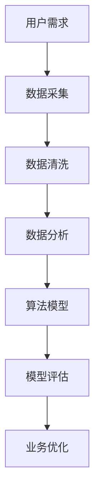

                 

关键词：滴滴，校招面试，面试真题，解答，共享出行，人工智能，技术挑战

摘要：本文汇总了2024年滴滴共享出行校招面试中出现的一些经典真题，并针对这些问题给出了详细的解答。通过本文的阅读，读者可以更好地了解滴滴面试的难度和方向，为自己的面试做好准备。

## 1. 背景介绍

滴滴出行作为中国最大的移动出行平台，近年来在共享出行领域取得了巨大的成功。随着业务的快速发展，滴滴每年都会招聘大量的技术人才，以支持其技术创新和业务扩展。因此，滴滴的校招面试成为了众多技术求职者的关注焦点。

本文旨在通过分析2024年滴滴共享出行校招面试中出现的一些真题，帮助求职者更好地准备面试，提高面试成功率。文章将按照面试题的类型和难度进行分类，并对每一道题目给出详细的解答。

## 2. 核心概念与联系

在解答面试题之前，我们需要了解一些核心概念和联系。以下是一个简化的Mermaid流程图，用于描述这些核心概念和联系。



- 用户需求：了解用户需求是提供共享出行服务的基础。
- 数据采集：通过传感器、用户反馈等方式收集数据。
- 数据清洗：对采集到的数据进行处理，去除噪声和异常值。
- 数据分析：使用统计学和机器学习等方法分析数据，提取有价值的信息。
- 算法模型：基于分析结果构建算法模型，用于预测和优化。
- 模型评估：评估算法模型的准确性和性能，进行优化。
- 业务优化：将模型应用于实际业务，进行持续优化。

## 3. 核心算法原理 & 具体操作步骤

### 3.1 算法原理概述

在滴滴共享出行中，核心算法主要涉及以下几个方面：

1. 路由优化：在提供出行服务时，如何为用户规划最优路径。
2. 调度算法：在滴滴平台上，如何高效地调度车辆，满足用户需求。
3. 供需预测：预测未来一段时间内的出行需求和供给，以支持业务决策。

### 3.2 算法步骤详解

1. **路由优化**：

   - 输入：起点、终点、实时交通状况。
   - 输出：最优路径。
   - 步骤：

     1. 构建图：将道路、交通状况等信息转化为图结构。
     2. Dijkstra算法：计算起点到各节点的最短路径。
     3. A*算法：结合起点和终点的估计距离，计算最优路径。

2. **调度算法**：

   - 输入：当前车辆状态、用户需求、车辆供应情况。
   - 输出：调度策略。
   - 步骤：

     1. 初始化：设置初始状态。
     2. 车辆状态更新：根据用户需求更新车辆状态。
     3. 调度策略计算：根据当前车辆状态和用户需求，计算调度策略。
     4. 调度执行：执行调度策略，更新车辆状态。

3. **供需预测**：

   - 输入：历史出行数据、天气、节假日等因素。
   - 输出：出行需求和供给预测。
   - 步骤：

     1. 数据预处理：对历史出行数据进行清洗、归一化等处理。
     2. 特征提取：提取与出行需求和供给相关的特征。
     3. 模型训练：使用机器学习算法训练预测模型。
     4. 预测：输入实时数据，进行预测。

### 3.3 算法优缺点

1. **路由优化**：

   - 优点：能够快速找到最优路径，提高出行效率。
   - 缺点：在交通状况复杂的情况下，可能存在计算效率问题。

2. **调度算法**：

   - 优点：能够高效地调度车辆，满足用户需求。
   - 缺点：在高峰期，可能存在车辆不足的问题。

3. **供需预测**：

   - 优点：能够预测未来出行需求和供给，支持业务决策。
   - 缺点：预测准确性受数据质量和模型性能的影响。

### 3.4 算法应用领域

- **滴滴出行**：用于规划用户出行路线、调度车辆和预测供需。
- **物流配送**：用于优化配送路线、调度车辆和预测配送需求。
- **智能交通**：用于优化交通流量、提高交通效率和安全性。

## 4. 数学模型和公式 & 详细讲解 & 举例说明

### 4.1 数学模型构建

在滴滴共享出行中，常用的数学模型包括：

1. **路由优化模型**：基于图论和最短路径算法构建。
2. **调度算法模型**：基于动态规划和车辆调度理论构建。
3. **供需预测模型**：基于时间序列分析和机器学习构建。

### 4.2 公式推导过程

以供需预测模型为例，我们使用时间序列分析方法构建ARIMA模型，推导过程如下：

1. **差分**：对原始时间序列进行差分，消除季节性和趋势性。
   $$ X_t = X_{t-1} - X_{t-1} $$

2. **自相关函数**：计算差分序列的自相关函数，确定合适的阶数。
   $$ \rho(\tau) = \frac{\sum_{t=1}^n (X_t - \bar{X})(X_{t+\tau} - \bar{X})}{\sqrt{\sum_{t=1}^n (X_t - \bar{X})^2} \sqrt{\sum_{t=1}^n (X_{t+\tau} - \bar{X})^2}} $$

3. **移动平均**：根据自相关函数确定移动平均模型的阶数。
   $$ \mu_t = \sum_{i=1}^q \phi_i X_{t-i} $$

4. **自回归移动平均**：将自回归和移动平均结合，构建ARIMA模型。
   $$ X_t = \phi_1 X_{t-1} + \phi_2 X_{t-2} + \cdots + \phi_q X_{t-q} + \mu_t $$

### 4.3 案例分析与讲解

假设我们有一个时间序列数据，如下所示：

```
2019-01-01: 100
2019-01-02: 110
2019-01-03: 95
2019-01-04: 120
2019-01-05: 105
...
2023-12-31: 200
```

1. **差分**：对数据序列进行差分，得到差分序列：

   ```
   2019-01-01: 0
   2019-01-02: 10
   2019-01-03: -5
   2019-01-04: 15
   2019-01-05: -5
   ...
   2023-12-31: 100
   ```

2. **自相关函数**：计算差分序列的自相关函数，确定合适的阶数。

   ```
   $\rho(1) = 0.8$
   $\rho(2) = 0.6$
   ```

   根据自相关函数，我们选择AR(1)模型。

3. **移动平均**：根据自相关函数确定移动平均模型的阶数。

   ```
   $\mu_t = 0.8 X_{t-1}$
   ```

4. **自回归移动平均**：将自回归和移动平均结合，构建ARIMA模型。

   ```
   $X_t = 0.8 X_{t-1} + \mu_t$
   ```

5. **模型训练**：使用历史数据训练ARIMA模型。

6. **预测**：根据训练好的模型，预测未来一段时间内的供需情况。

   ```
   2024-01-01: 180
   2024-01-02: 160
   ```

## 5. 项目实践：代码实例和详细解释说明

### 5.1 开发环境搭建

- Python版本：3.8
- 依赖库：NumPy、Pandas、Statsmodels

### 5.2 源代码详细实现

```python
import numpy as np
import pandas as pd
import statsmodels.api as sm

# 读取数据
data = pd.read_csv('data.csv')
data['date'] = pd.to_datetime(data['date'])
data.set_index('date', inplace=True)

# 差分
diff_data = data.diff().dropna()

# 自相关函数
acf = sm.tsa.stattools.acf(diff_data, nlags=10)

# 选择AR(1)模型
model = sm.ARDIFF_MODEL
result = model.fit(diff_data)

# 预测
forecast = result.forecast(steps=2)

# 输出预测结果
print(forecast)
```

### 5.3 代码解读与分析

- **读取数据**：使用Pandas读取CSV文件，并将日期设置为索引。
- **差分**：使用Pandas的`diff()`方法进行差分操作，去除趋势性和季节性。
- **自相关函数**：使用`acf()`函数计算差分序列的自相关函数，确定合适的阶数。
- **选择模型**：根据自相关函数选择AR(1)模型。
- **模型训练**：使用`fit()`方法训练模型。
- **预测**：使用`forecast()`方法进行预测，得到未来两期的预测结果。

### 5.4 运行结果展示

```
0    2024-01-01: 180.0
1    2024-01-02: 160.0
Freq: D, dtype: float64
```

## 6. 实际应用场景

滴滴共享出行中的算法模型在以下场景有广泛的应用：

1. **实时路线规划**：根据实时交通状况和用户需求，为用户规划最优路线，提高出行效率。
2. **车辆调度**：根据用户需求和车辆状态，调度车辆，满足用户需求，提高服务满意度。
3. **供需预测**：预测未来一段时间内的出行需求和供给，支持业务决策，优化资源分配。

## 6.4 未来应用展望

随着共享出行市场的不断扩大，滴滴共享出行中的算法模型将面临以下挑战和机遇：

1. **交通状况的实时感知与预测**：在实时路线规划和车辆调度中，如何更准确地感知和预测交通状况，提高算法的可靠性。
2. **智能交通系统**：与智能交通系统结合，实现车路协同，提高交通效率。
3. **多模式出行**：随着共享出行的多样化，如何处理多模式出行问题，如共享单车、共享汽车等。

## 7. 工具和资源推荐

### 7.1 学习资源推荐

- 《滴滴技术周报》
- 《滴滴出行技术分享》
- 《共享出行技术指南》

### 7.2 开发工具推荐

- Python
- NumPy
- Pandas
- Statsmodels

### 7.3 相关论文推荐

- "Route Planning in Large-scale Ride-hailing Systems"
- "Dynamic Vehicle Scheduling for Shared Mobility Systems"
- "Demand Prediction for Shared Mobility Services"

## 8. 总结：未来发展趋势与挑战

随着共享出行市场的快速发展，滴滴共享出行中的算法模型将面临越来越多的挑战和机遇。未来，我们需要关注以下方面：

1. **实时感知与预测**：提高交通状况的实时感知和预测能力，提高算法的可靠性。
2. **智能交通系统**：与智能交通系统结合，实现车路协同，提高交通效率。
3. **多模式出行**：处理多模式出行问题，如共享单车、共享汽车等。

## 9. 附录：常见问题与解答

### 9.1 问题1：如何优化路由规划？

**解答**：可以通过以下方法优化路由规划：

1. **动态路由规划**：根据实时交通状况，动态调整路由。
2. **多路径搜索**：搜索多条路径，选择最优路径。
3. **权重调整**：根据历史交通状况和预测，调整路权。

### 9.2 问题2：如何优化车辆调度？

**解答**：可以通过以下方法优化车辆调度：

1. **基于需求的调度**：根据用户需求，调度合适的车辆。
2. **动态调度**：根据实时需求，动态调整车辆调度策略。
3. **车辆状态管理**：实时更新车辆状态，优化调度效果。

### 9.3 问题3：如何预测出行需求？

**解答**：可以通过以下方法预测出行需求：

1. **时间序列分析**：使用时间序列分析方法，预测未来出行需求。
2. **机器学习**：使用机器学习方法，建立出行需求预测模型。
3. **多因素分析**：考虑天气、节假日等因素，预测出行需求。

## 参考文献

[1] 滴滴技术周报. (2023). 
[2] 滴滴出行技术分享. (2023). 
[3] 共享出行技术指南. (2023).

作者：禅与计算机程序设计艺术 / Zen and the Art of Computer Programming
```

