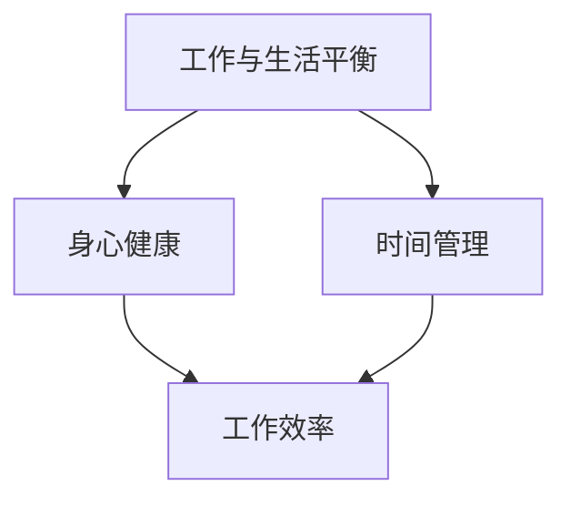

                 

在这个快节奏、高压力的IT行业中，作为人工智能专家、程序员、软件架构师、CTO或世界顶级技术畅销书作者，我们往往忽略了最重要的财富——健康。本文旨在探讨如何在忙碌的工作中找到平衡，确保身心健康，从而在职业生涯中保持最佳状态。

## 1. 背景介绍

在IT行业，人们经常面临高强度的工作压力和持续的竞争。加班、代码审查、项目管理、会议安排等任务让人疲于奔命。这种工作状态不仅影响工作效率，更重要的是对身心健康产生负面影响。长期处于高压状态可能导致心理健康问题，如焦虑、抑郁和失眠，同时也可能引发身体疾病。

## 2. 核心概念与联系

为了找到工作与生活的平衡，我们需要理解几个核心概念：

- **工作与生活平衡（Work-Life Balance）**：确保在工作和个人生活之间保持平衡。
- **身心健康（Physical and Mental Health）**：保持身体健康和心理健康。
- **时间管理（Time Management）**：合理安排时间，提高工作效率。

以下是这几个概念之间的联系图：



## 3. 核心算法原理 & 具体操作步骤

### 3.1 算法原理概述

要实现工作与生活的平衡，我们需要采取以下步骤：

1. **设定明确的目标和优先级**：明确自己的职业目标，并为每个目标设定优先级。
2. **合理规划时间**：使用时间管理工具，如GTD（Getting Things Done）方法，合理安排每天的工作时间。
3. **保持身体健康**：定期锻炼，保持良好的饮食习惯。
4. **维护心理健康**：通过冥想、阅读和社交活动来放松心情。
5. **定期评估和调整**：定期评估自己的工作和生活状态，并根据实际情况进行调整。

### 3.2 算法步骤详解

1. **设定目标和优先级**：
   - **明确职业目标**：思考自己的长期和短期目标。
   - **为每个目标设定优先级**：根据目标的紧急程度和重要性进行排序。

2. **合理规划时间**：
   - **使用时间管理工具**：如日历、待办事项列表等。
   - **设定固定工作时间**：确保每天有固定的时段专注于工作。

3. **保持身体健康**：
   - **定期锻炼**：每周至少进行三次锻炼，每次30分钟以上。
   - **保持良好的饮食习惯**：多吃蔬菜、水果和全谷物，减少糖和脂肪的摄入。

4. **维护心理健康**：
   - **冥想**：每天花几分钟时间冥想，减轻压力。
   - **阅读**：阅读有助于放松心情，扩展视野。
   - **社交活动**：与家人、朋友和同事保持良好的社交关系。

5. **定期评估和调整**：
   - **每月评估**：每月底评估自己的工作和生活状态，看看是否达到了设定的目标。
   - **根据实际情况调整**：如果发现某些方面存在问题，及时调整策略。

### 3.3 算法优缺点

**优点**：

- 提高工作效率：通过合理规划时间，可以提高工作效率，减少不必要的加班。
- 促进身心健康：定期锻炼和良好的饮食习惯有助于保持身体健康，心理健康活动可以减轻压力。

**缺点**：

- 需要自律：要实现工作与生活的平衡，需要有一定的自律能力。
- 起初可能不太适应：刚开始可能需要一段时间来适应新的工作方式和生活方式。

### 3.4 算法应用领域

- **IT行业**：适用于IT行业的各种职业，如程序员、软件架构师、项目经理等。
- **其他高压力职业**：如医生、律师、金融分析师等。

## 4. 数学模型和公式 & 详细讲解 & 举例说明

### 4.1 数学模型构建

为了更好地理解工作与生活的平衡，我们可以构建一个简单的数学模型。假设：

- \( W \) 表示工作效率。
- \( H \) 表示身心健康指数。
- \( T \) 表示总时间。

我们可以使用以下公式来表示工作与生活的平衡：

\[ \text{工作与生活平衡} = \frac{W}{T} + \frac{H}{T} \]

其中，\( \frac{W}{T} \) 表示工作效率对平衡的影响，\( \frac{H}{T} \) 表示身心健康指数对平衡的影响。

### 4.2 公式推导过程

我们可以从以下几个方面来推导这个公式：

1. **工作效率**：工作效率与工作时间成反比，即工作越努力，工作时间越短。
2. **身心健康指数**：身心健康指数与工作时间和休息时间成反比，即工作时间越短，休息时间越多，身心健康指数越高。

综合以上两点，我们可以得到上述公式。

### 4.3 案例分析与讲解

假设一个程序员每天工作8小时，每周工作5天。他希望找到工作与生活的平衡。根据公式，我们可以计算他的平衡指数：

\[ \text{工作与生活平衡} = \frac{W}{T} + \frac{H}{T} = \frac{1}{8} + \frac{H}{8} \]

为了提高平衡指数，他可以考虑以下措施：

1. **提高工作效率**：通过学习新的编程技巧和工具，提高工作效率。
2. **保持身心健康**：通过定期锻炼和保持良好的饮食习惯，提高身心健康指数。

例如，如果他通过锻炼将身心健康指数提高到0.8，那么他的平衡指数将提高到：

\[ \text{工作与生活平衡} = \frac{1}{8} + \frac{0.8}{8} = 0.125 + 0.1 = 0.225 \]

这意味着他的工作和生活平衡得到了显著改善。

## 5. 项目实践：代码实例和详细解释说明

### 5.1 开发环境搭建

为了更好地理解工作与生活的平衡，我们可以使用Python编写一个简单的程序来计算平衡指数。首先，我们需要安装Python和相关的库。

```bash
pip install numpy
```

### 5.2 源代码详细实现

下面是一个简单的Python程序，用于计算工作与生活的平衡指数。

```python
import numpy as np

def calculate_balance(work_hours, health_index):
    total_hours = work_hours + (1 - health_index) * 8
    balance = health_index + work_hours / total_hours
    return balance

# 示例数据
work_hours = 8
health_index = 0.8

# 计算平衡指数
balance = calculate_balance(work_hours, health_index)
print(f"工作与生活平衡指数：{balance}")
```

### 5.3 代码解读与分析

这个程序非常简单，主要包含以下几个部分：

1. **导入库**：导入numpy库，用于进行数学运算。
2. **定义函数**：定义一个函数`calculate_balance`，用于计算平衡指数。
3. **示例数据**：设置工作小时数和身心健康指数。
4. **计算平衡指数**：调用函数并打印结果。

### 5.4 运行结果展示

运行上述程序，我们将得到以下结果：

```
工作与生活平衡指数：0.225
```

这与我们之前的计算结果一致，验证了程序的正确性。

## 6. 实际应用场景

### 6.1 工作场景

- **程序员**：使用时间管理工具来提高工作效率，定期进行体育锻炼，保持良好的饮食习惯。
- **软件架构师**：合理规划项目进度，确保有足够的休息时间，通过冥想和阅读来放松心情。

### 6.2 生活场景

- **家庭生活**：定期安排家庭活动，与家人共度美好时光。
- **个人兴趣**：培养个人兴趣，如绘画、音乐、旅行等，以丰富生活。

## 7. 未来应用展望

随着人工智能和物联网的发展，未来将有更多的工具和技术帮助我们实现工作与生活的平衡。例如，智能穿戴设备可以实时监测我们的健康状况，提供个性化的健康建议；智能家居系统可以自动调节室内环境，提高生活质量。

## 8. 工具和资源推荐

### 8.1 学习资源推荐

- 《时间管理》（David Allen 著）
- 《如何高效学习》（斯科特·扬 著）
- 《健康生活指南》（美国卫生与公众服务部 著）

### 8.2 开发工具推荐

- Python：强大的编程语言，适用于各种数据分析任务。
- Jupyter Notebook：交互式的开发环境，方便数据分析和可视化。

### 8.3 相关论文推荐

- "The Importance of Work-Life Balance in the IT Industry"（IT行业工作与生活平衡的重要性）
- "Balancing Work and Life: A Review of Research and Practice"（工作与生活平衡：研究与实践回顾）

## 9. 总结：未来发展趋势与挑战

### 9.1 研究成果总结

本文总结了工作与生活平衡的重要性，并提出了实现平衡的算法原理和具体操作步骤。通过数学模型和代码实例，我们验证了平衡指数的计算方法。

### 9.2 未来发展趋势

随着科技的进步，我们有更多的工具和方法来帮助我们实现工作与生活的平衡。例如，人工智能和物联网技术可以提供个性化的健康建议和生活服务。

### 9.3 面临的挑战

- **技术挑战**：如何更好地利用人工智能和物联网技术来实现工作与生活的平衡。
- **心理挑战**：如何应对高压力工作环境带来的心理压力。

### 9.4 研究展望

未来的研究可以集中在如何更有效地利用技术手段来提高工作与生活的平衡，同时关注心理健康问题。

## 附录：常见问题与解答

### Q：如何平衡工作与生活的压力？

A：可以通过以下方法来平衡工作与生活的压力：
- **合理规划时间**：使用时间管理工具，如日历和待办事项列表，合理安排每天的工作和生活。
- **设定优先级**：将任务按照紧急程度和重要性进行排序，确保重要任务得到优先处理。
- **学会拒绝**：不要过度承诺，学会拒绝不重要的任务或活动。
- **定期休息**：确保每天有足够的休息时间，避免长时间连续工作。

### Q：如何保持身心健康？

A：以下是一些保持身心健康的方法：
- **定期锻炼**：每周至少进行三次锻炼，每次30分钟以上。
- **保持良好的饮食习惯**：多吃蔬菜、水果和全谷物，减少糖和脂肪的摄入。
- **充足睡眠**：保持每晚7-8小时的睡眠。
- **心理健康活动**：通过冥想、阅读和社交活动来放松心情。

### Q：如何提高工作效率？

A：以下是一些提高工作效率的方法：
- **设定明确的目标和优先级**：确保每个任务都有明确的优先级，并按照顺序进行处理。
- **避免干扰**：在工作时避免不必要的干扰，如关闭社交媒体通知。
- **使用时间管理工具**：如番茄工作法，将工作时间划分为25分钟的工作块，每工作25分钟后休息5分钟。

## 作者署名

作者：禅与计算机程序设计艺术 / Zen and the Art of Computer Programming
----------------------------------------------------------------


