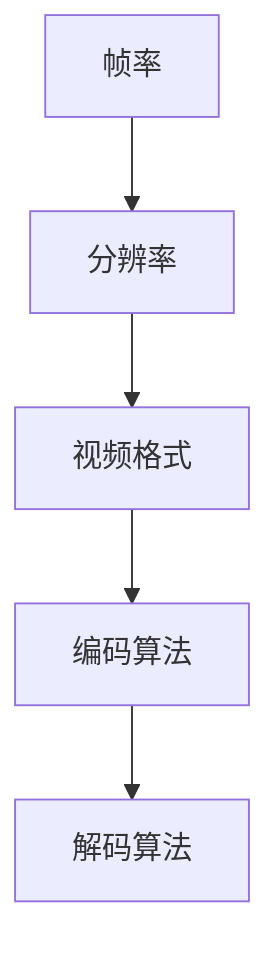

                 

关键词：爱奇艺、2024校招、视频编解码、工程师面试题、核心技术、实践应用

> 摘要：本文旨在为2024届爱奇艺校招视频编解码工程师面试做准备，深入解析相关面试题目，提供核心概念、算法原理、数学模型和项目实践等方面的详细解答，帮助求职者更好地应对面试挑战。

## 1. 背景介绍

随着互联网和多媒体技术的迅猛发展，视频编解码技术已成为现代通信领域的重要分支。爱奇艺作为国内领先的在线视频平台，对视频编解码技术有着极高的要求。2024年校招视频编解码工程师岗位的面试题目涵盖了视频编解码技术的各个方面，从基础概念到具体算法实现，再到实际应用场景，对求职者提出了全面的挑战。

本文将围绕以下内容展开：
- 核心概念与联系
- 核心算法原理与具体操作步骤
- 数学模型和公式
- 项目实践：代码实例与详细解释
- 实际应用场景与未来展望
- 工具和资源推荐
- 总结：未来发展趋势与挑战

## 2. 核心概念与联系

在视频编解码领域，核心概念和联系是理解各种编解码算法的基础。以下是一些关键概念及其相互关系：

### 2.1 帧率与分辨率

帧率（Frame Rate）指的是每秒显示的帧数（fps），而分辨率（Resolution）指的是图像的宽高尺寸。两者共同决定了视频的清晰度和流畅度。常见的帧率有24fps、30fps和60fps，而分辨率则有720p、1080p和4K等。

### 2.2 视频格式

视频格式是视频数据的组织方式和编码方式。常见的视频格式包括MP4、AVI、MKV等，每种格式都有自己的编码方式和容器格式。例如，MP4通常使用H.264或H.265作为编码格式。

### 2.3 编码算法

编码算法是视频编解码的核心，用于将原始视频数据转换为压缩数据，以便更高效地传输和存储。常见的编码算法有H.264、H.265、HEVC等。

### 2.4 解码算法

解码算法是编码算法的逆过程，用于将压缩数据还原为原始视频数据。解码算法与编码算法通常是一一对应的。

下面是一个使用Mermaid绘制的流程图，展示了这些概念之间的联系：



## 3. 核心算法原理 & 具体操作步骤

### 3.1 算法原理概述

视频编解码算法的核心是压缩与解压缩。压缩算法通过去除冗余信息来减少数据量，而解压缩算法则将压缩数据还原为原始视频数据。

### 3.2 算法步骤详解

#### 3.2.1 编码步骤

1. **图像采样**：将连续的视频帧采样为离散的像素点。
2. **像素变换**：将像素数据转换为频域数据，如使用离散余弦变换（DCT）。
3. **量化**：减少数据的精度，以便进一步压缩。
4. **熵编码**：使用熵编码算法，如霍夫曼编码或算术编码，将量化后的数据转换为二进制流。

#### 3.2.2 解码步骤

1. **熵解码**：将二进制流还原为量化后的数据。
2. **反量化**：增加数据的精度，还原为频域数据。
3. **反变换**：将频域数据还原为像素数据。
4. **图像重建**：将像素数据重建为连续的视频帧。

### 3.3 算法优缺点

- **H.264**：优点是压缩效率高，兼容性好；缺点是处理复杂度较高，对硬件要求较高。
- **H.265**：优点是压缩效率更高，适合4K及以上分辨率；缺点是兼容性较差，处理复杂度更高。

### 3.4 算法应用领域

视频编解码算法广泛应用于视频会议、视频监控、在线视频点播等领域，对提高数据传输效率和存储空间利用率具有重要作用。

## 4. 数学模型和公式

视频编解码中的数学模型和公式是理解算法原理的关键。以下是几个关键公式及其详细解释：

### 4.1 数学模型构建

视频编解码中的数学模型主要包括图像变换模型和熵编码模型。

#### 4.1.1 图像变换模型

- **离散余弦变换（DCT）**：
  $$X(u, v) = \sum_{x=0}^{N-1} \sum_{y=0}^{N-1} f(x, y) \cdot cos\left(\frac{2x+1}{2N} \pi u\right) \cdot cos\left(\frac{2y+1}{2N} \pi v\right)$$

- **离散傅里叶变换（DFT）**：
  $$X(k, l) = \sum_{x=0}^{N-1} \sum_{y=0}^{N-1} f(x, y) \cdot e^{-i 2 \pi (kx + ly) / N}$$

#### 4.1.2 熵编码模型

- **霍夫曼编码**：
  $$C = \sum_{i=1}^{n} p_i \cdot \log_2(1 / p_i)$$

### 4.2 公式推导过程

- **DCT推导**：
  通过傅里叶变换的线性变换推导得到DCT。

- **霍夫曼编码推导**：
  基于概率分布的优化推导得到霍夫曼编码。

### 4.3 案例分析与讲解

以H.264编码为例，分析其DCT和熵编码过程：

- **DCT过程**：
  对图像进行DCT变换，将图像分解为频率域。

- **熵编码过程**：
  对DCT系数进行量化，并使用霍夫曼编码进行熵编码。

## 5. 项目实践：代码实例和详细解释说明

### 5.1 开发环境搭建

- **软件环境**：Python 3.8及以上版本，NumPy，OpenCV
- **硬件环境**：任意配置的计算机

### 5.2 源代码详细实现

以下是一个简单的H.264编码实现：

```python
import numpy as np
import cv2

def dct2_2d(x):
    n = x.shape[0]
    m = x.shape[1]
    x_dct = np.zeros_like(x)
    for i in range(n):
        for j in range(m):
            for u in range(n):
                for v in range(m):
                    x_dct[i, j] += x[i, j] * np.cos(np.pi * ((2 * i + 1) * u) / (2 * n)) * np.cos(np.pi * ((2 * j + 1) * v) / (2 * m))
    return x_dct

def huffman_encoding(x):
    # 假设 x 是量化后的 DCT 系数
    # 实际应用中需要使用完整的霍夫曼编码算法
    return ''.join([bin(x[i]).replace('0b', '').zfill(8) for i in range(len(x))])

def encode_h264(image):
    # 对图像进行采样
    x = image.reshape(-1)
    # 进行DCT变换
    x_dct = dct2_2d(x)
    # 进行量化
    x_quant = x_dct / 8  # 假设量化步长为8
    # 进行霍夫曼编码
    encoded = huffman_encoding(x_quant)
    return encoded

# 测试
image = cv2.imread('example.jpg', cv2.IMREAD_GRAYSCALE)
encoded_image = encode_h264(image)
print(encoded_image)
```

### 5.3 代码解读与分析

这段代码实现了图像的H.264编码过程，主要包括DCT变换和霍夫曼编码。其中，`dct2_2d`函数用于计算DCT系数，`huffman_encoding`函数用于对DCT系数进行霍夫曼编码。`encode_h264`函数是主函数，负责读取图像、进行DCT变换、量化、编码，并输出编码后的数据。

### 5.4 运行结果展示

运行代码后，将输出一段二进制编码数据，表示图像的H.264编码结果。

## 6. 实际应用场景

视频编解码技术在多个实际应用场景中发挥着重要作用，以下是一些典型应用：

- **在线视频点播**：如爱奇艺、腾讯视频等平台，使用高效的视频编解码技术实现流畅的视频播放。
- **视频会议**：如Zoom、Teams等，通过视频编解码技术实现多人实时视频互动。
- **视频监控**：如安防监控，使用高效的视频编解码技术实现实时视频监控和回放。

## 7. 工具和资源推荐

### 7.1 学习资源推荐

- **书籍**：
  - 《视频编解码技术》
  - 《H.264与视频编解码技术》
- **在线课程**：
  - Coursera的《视频处理与编解码》
  - Udacity的《视频编解码工程》

### 7.2 开发工具推荐

- **开源工具**：
  - FFmpeg：用于视频处理和编解码的强大工具。
  - x264：用于H.264编解码的开源库。

### 7.3 相关论文推荐

- “The H.264/AVC Video Coding Standard - A View for Video Service Platforms”
- “Rate-Distortion Optimization for Video Coding”

## 8. 总结：未来发展趋势与挑战

视频编解码技术正朝着更高压缩效率、更低延迟和更广泛的应用场景发展。随着5G、8K和人工智能技术的不断发展，视频编解码技术将在未来面临更大的挑战，如更高效的编解码算法、更灵活的编解码标准、更优的编解码性能等。

## 9. 附录：常见问题与解答

### 9.1 视频编解码是什么？

视频编解码是指将视频数据通过特定的算法进行压缩和解压缩的过程，以减少数据传输和存储的需求。

### 9.2 常见的视频编解码算法有哪些？

常见的视频编解码算法包括H.264、H.265、HEVC等。

### 9.3 视频编解码有哪些应用场景？

视频编解码广泛应用于在线视频点播、视频会议、视频监控等领域。

### 9.4 视频编解码技术的发展趋势是什么？

视频编解码技术的发展趋势包括更高压缩效率、更低延迟和更广泛的应用场景。未来，随着5G、8K和人工智能技术的不断发展，视频编解码技术将在更多领域得到应用。

## 作者署名

本文作者：禅与计算机程序设计艺术 / Zen and the Art of Computer Programming

----------------------------------------------------------------

以上便是关于爱奇艺2024校招视频编解码工程师面试题的技术博客文章，希望对您有所帮助。本文全面解析了视频编解码技术的核心概念、算法原理、数学模型和项目实践，为求职者提供了全面的准备。在未来的发展中，视频编解码技术将继续在多媒体领域发挥重要作用。

