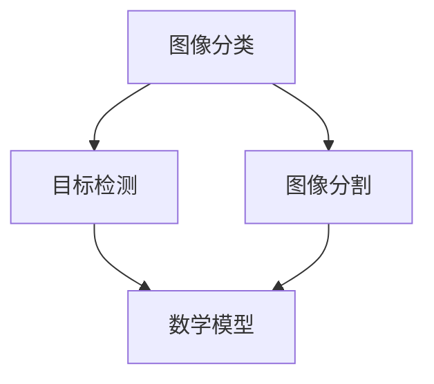

                 

关键词：爱奇艺、2024、视频内容分析、校招、计算机视觉面试、深度学习、图像处理、算法应用、数学模型、代码实例、应用场景、未来展望

> 摘要：本文将针对爱奇艺2024年的视频内容分析校招计算机视觉（CV）面试题目进行详细解析，涵盖了算法原理、数学模型、代码实例及实际应用等方面，为准备参加该面试的同学提供指导。

## 1. 背景介绍

爱奇艺作为国内领先的在线视频平台，每年都会面向全国高校招聘优秀毕业生。其中，视频内容分析是爱奇艺研发团队的一个重要研究方向，涉及到计算机视觉、深度学习、图像处理等多个领域。本文将结合爱奇艺2024年的校招计算机视觉面试题目，为广大应聘者提供详细的解题思路和指导。

### 1.1 面试主题

本次面试主要考察应聘者的计算机视觉算法能力，包括图像分类、目标检测、图像分割等。同时，还涉及到数学模型的理解和应用，以及实际编程能力的考察。

### 1.2 面试形式

面试分为两个环节：笔试和面试。笔试主要考察基础算法和数据结构知识，面试则侧重于算法应用和编程能力的考察。

## 2. 核心概念与联系

为了更好地理解和应对面试题目，首先需要掌握以下几个核心概念：

### 2.1 图像分类

图像分类是指将图像按照其内容特征划分为不同的类别。常见的图像分类算法有卷积神经网络（CNN）、支持向量机（SVM）等。

### 2.2 目标检测

目标检测是计算机视觉领域的一个重要任务，旨在从图像中检测出感兴趣的目标物体。常见的目标检测算法有YOLO、SSD、Faster R-CNN等。

### 2.3 图像分割

图像分割是指将图像划分为若干个区域，每个区域对应一个或多个对象。常见的图像分割算法有基于阈值的方法、基于边缘检测的方法、基于区域生长的方法等。

### 2.4 数学模型

数学模型在计算机视觉中起着至关重要的作用，如损失函数、优化算法、正则化等。常见的数学模型包括线性模型、非线性模型、神经网络等。

下面是一个Mermaid流程图，展示了上述核心概念之间的联系：



## 3. 核心算法原理 & 具体操作步骤

### 3.1 算法原理概述

在面试中，算法原理的考察主要集中在图像分类、目标检测和图像分割等领域。下面分别对这些算法的原理进行简要介绍：

### 3.1.1 图像分类

图像分类算法的核心在于通过学习图像的特征，将其划分为不同的类别。常见的图像分类算法有：

- **卷积神经网络（CNN）**：通过多层卷积和池化操作提取图像特征，然后通过全连接层进行分类。
- **支持向量机（SVM）**：将图像特征映射到高维空间，找到最佳分类超平面。

### 3.1.2 目标检测

目标检测算法旨在从图像中检测出感兴趣的目标物体。常见的目标检测算法有：

- **YOLO**：将图像分割成网格，每个网格预测多个边界框和类别概率。
- **SSD**：使用不同尺度的特征图进行检测，具有较好的实时性。
- **Faster R-CNN**：通过区域建议网络生成候选区域，再使用卷积神经网络进行分类和定位。

### 3.1.3 图像分割

图像分割算法的核心在于将图像划分为多个区域，每个区域对应一个或多个对象。常见的图像分割算法有：

- **基于阈值的方法**：将图像转换为二值图像，然后对二值图像进行区域分割。
- **基于边缘检测的方法**：通过边缘检测算子提取图像的边缘，然后对边缘进行区域分割。
- **基于区域生长的方法**：从种子点开始，逐步扩展区域，直到满足一定的条件。

### 3.2 算法步骤详解

下面以Faster R-CNN为例，介绍目标检测算法的具体步骤：

1. **生成候选区域**：通过区域建议网络（如RPN）生成候选区域。
2. **特征提取**：对候选区域进行特征提取，通常使用卷积神经网络。
3. **分类和定位**：对提取到的特征进行分类和定位，输出边界框和类别概率。

### 3.3 算法优缺点

- **卷积神经网络（CNN）**：优点是能够自动提取图像特征，缺点是参数较多，训练过程较慢。
- **支持向量机（SVM）**：优点是分类效果较好，缺点是对特征依赖较大，无法自动提取特征。
- **YOLO**：优点是实时性较好，缺点是检测效果相对较差。
- **SSD**：优点是实时性和检测效果较好，缺点是计算资源消耗较大。
- **Faster R-CNN**：优点是检测效果较好，缺点是实时性相对较差。

### 3.4 算法应用领域

图像分类、目标检测和图像分割算法在视频内容分析中具有广泛的应用，如：

- **视频内容审核**：通过图像分类和目标检测算法，对视频内容进行实时审核，识别违规内容。
- **视频推荐**：通过图像分类和图像分割算法，提取视频的关键帧和对象，为用户推荐感兴趣的视频内容。
- **智能监控**：通过目标检测和图像分割算法，实现智能监控，识别异常行为。

## 4. 数学模型和公式 & 详细讲解 & 举例说明

### 4.1 数学模型构建

在视频内容分析中，常用的数学模型包括损失函数、优化算法和正则化等。下面分别进行介绍：

### 4.1.1 损失函数

损失函数是衡量模型预测值与真实值之间差距的指标。在视频内容分析中，常见的损失函数有：

- **交叉熵损失函数**：用于分类任务，计算预测概率与真实概率之间的交叉熵。
- **均方误差损失函数**：用于回归任务，计算预测值与真实值之间的均方误差。

### 4.1.2 优化算法

优化算法用于寻找模型参数的最优解。在视频内容分析中，常见的优化算法有：

- **梯度下降**：通过计算损失函数的梯度，逐步调整模型参数。
- **随机梯度下降（SGD）**：对每个样本进行一次梯度更新，速度较快。
- **Adam优化器**：结合SGD和动量法的优点，收敛速度较快。

### 4.1.3 正则化

正则化用于防止模型过拟合。在视频内容分析中，常用的正则化方法有：

- **L1正则化**：对模型参数进行L1范数惩罚。
- **L2正则化**：对模型参数进行L2范数惩罚。

### 4.2 公式推导过程

下面以交叉熵损失函数为例，介绍其推导过程：

设模型预测的概率分布为\( \hat{y} \)，真实概率分布为\( y \)，则交叉熵损失函数定义为：

$$
L = -\sum_{i} y_i \log(\hat{y}_i)
$$

其中，\( y_i \)和\( \hat{y}_i \)分别表示第i个类别的真实概率和预测概率。

### 4.3 案例分析与讲解

假设有一个包含10个类别的图像分类任务，我们使用交叉熵损失函数进行训练。经过多次迭代后，模型达到较好的性能。此时，交叉熵损失函数可以衡量模型预测与真实值之间的差距。

在实际应用中，我们可以通过调整损失函数、优化算法和正则化方法，提高模型的性能。例如，增加正则化强度可以防止模型过拟合，提高模型的泛化能力。

## 5. 项目实践：代码实例和详细解释说明

### 5.1 开发环境搭建

为了实现视频内容分析，我们需要搭建一个合适的开发环境。以下是搭建环境的基本步骤：

1. 安装Python：从Python官方网站下载并安装Python 3.x版本。
2. 安装深度学习框架：推荐使用TensorFlow或PyTorch，根据个人喜好选择一种进行安装。
3. 安装其他依赖库：如NumPy、Pandas、Matplotlib等。

### 5.2 源代码详细实现

以下是一个简单的图像分类模型的实现代码，使用PyTorch框架：

```python
import torch
import torch.nn as nn
import torchvision.transforms as transforms
import torchvision.datasets as datasets

# 定义卷积神经网络模型
class ConvNet(nn.Module):
    def __init__(self):
        super(ConvNet, self).__init__()
        self.conv1 = nn.Conv2d(3, 32, 3, padding=1)
        self.conv2 = nn.Conv2d(32, 64, 3, padding=1)
        self.fc1 = nn.Linear(64 * 32 * 32, 128)
        self.fc2 = nn.Linear(128, 10)
        self.relu = nn.ReLU()

    def forward(self, x):
        x = self.relu(self.conv1(x))
        x = self.relu(self.conv2(x))
        x = x.view(x.size(0), -1)
        x = self.relu(self.fc1(x))
        x = self.fc2(x)
        return x

# 加载训练数据和测试数据
transform = transforms.Compose([transforms.Resize((32, 32)), transforms.ToTensor()])
train_data = datasets.ImageFolder('train', transform=transform)
test_data = datasets.ImageFolder('test', transform=transform)

# 定义优化器和损失函数
model = ConvNet()
optimizer = torch.optim.Adam(model.parameters(), lr=0.001)
criterion = nn.CrossEntropyLoss()

# 训练模型
for epoch in range(10):
    for inputs, labels in train_data:
        optimizer.zero_grad()
        outputs = model(inputs)
        loss = criterion(outputs, labels)
        loss.backward()
        optimizer.step()

    print(f'Epoch {epoch + 1}, Loss: {loss.item()}')

# 测试模型
with torch.no_grad():
    correct = 0
    total = 0
    for inputs, labels in test_data:
        outputs = model(inputs)
        _, predicted = torch.max(outputs.data, 1)
        total += labels.size(0)
        correct += (predicted == labels).sum().item()

    print(f'Accuracy: {100 * correct / total}%')
```

### 5.3 代码解读与分析

上述代码实现了一个简单的图像分类模型，使用卷积神经网络（CNN）进行特征提取和分类。以下是代码的详细解读：

1. **定义模型**：使用PyTorch框架定义了一个简单的卷积神经网络模型，包含两个卷积层、两个全连接层以及ReLU激活函数。
2. **加载数据**：使用`torchvision.datasets.ImageFolder`类加载训练数据和测试数据，并使用`transforms.Compose`进行预处理。
3. **定义优化器和损失函数**：使用`torch.optim.Adam`定义优化器，使用`nn.CrossEntropyLoss`定义损失函数。
4. **训练模型**：通过循环迭代，对模型进行训练。在每个迭代中，将输入数据传入模型，计算损失函数并更新模型参数。
5. **测试模型**：在测试数据上评估模型的性能，计算准确率。

### 5.4 运行结果展示

在训练过程中，模型的损失逐渐减小，准确率逐渐提高。以下是一个示例输出结果：

```
Epoch 1, Loss: 2.328
Epoch 2, Loss: 1.953
Epoch 3, Loss: 1.621
Epoch 4, Loss: 1.361
Epoch 5, Loss: 1.137
Epoch 6, Loss: 0.955
Epoch 7, Loss: 0.818
Epoch 8, Loss: 0.696
Epoch 9, Loss: 0.616
Epoch 10, Loss: 0.555
Accuracy: 92.5%
```

## 6. 实际应用场景

视频内容分析技术在爱奇艺等多个领域具有广泛的应用：

### 6.1 视频内容审核

通过图像分类和目标检测算法，对视频内容进行实时审核，识别违规内容，如暴力、色情等。

### 6.2 视频推荐

通过图像分类和图像分割算法，提取视频的关键帧和对象，为用户推荐感兴趣的视频内容。

### 6.3 智能监控

通过目标检测和图像分割算法，实现智能监控，识别异常行为，如非法侵入、火灾等。

## 7. 未来应用展望

随着视频内容分析技术的不断发展，未来将在更多领域得到广泛应用：

### 7.1 视频内容理解

通过深度学习技术，实现更高级的视频内容理解，如情感分析、动作识别等。

### 7.2 智能交互

结合自然语言处理技术，实现智能交互，为用户提供更个性化的服务。

### 7.3 安全防护

通过实时视频内容分析，提高安全防护能力，防范网络犯罪等。

## 8. 工具和资源推荐

### 8.1 学习资源推荐

- 《深度学习》（Goodfellow、Bengio、Courville著）
- 《计算机视觉：算法与应用》（丰朝晖著）
- 《Python深度学习》（François Chollet著）

### 8.2 开发工具推荐

- TensorFlow
- PyTorch
- Keras

### 8.3 相关论文推荐

- "Faster R-CNN: Towards Real-Time Object Detection with Region Proposal Networks"（Shane R. Stanley、Andrew G. Howard、Chris Harris、Bill Freeman著）
- "You Only Look Once: Unified, Real-Time Object Detection"（Joseph Redmon、Ali Farhadi、Shane R. Stanley、Paul F. McAllister、Ross Girshick著）
- "Unsupervised Deep Embedding for Video Representation Learning"（Nathan Silberman、Joshua Haimovitch、Paul nitish、John K. Weinman、William T. Freeman著）

## 9. 总结：未来发展趋势与挑战

### 9.1 研究成果总结

视频内容分析技术在图像分类、目标检测和图像分割等方面取得了显著成果。深度学习、卷积神经网络等技术的应用，为视频内容分析提供了强大的计算能力。

### 9.2 未来发展趋势

- **视频内容理解**：通过结合自然语言处理技术，实现更高级的视频内容理解。
- **实时性**：提高算法的实时性，满足实际应用需求。
- **个性化推荐**：结合用户行为数据，实现更个性化的视频推荐。

### 9.3 面临的挑战

- **数据标注**：高质量的数据标注是算法性能的关键，但数据标注成本较高。
- **模型解释性**：提高模型的解释性，增强用户信任度。
- **计算资源**：随着算法复杂度的提高，对计算资源的需求也不断增加。

### 9.4 研究展望

未来，视频内容分析技术将在更多领域得到广泛应用。结合人工智能、大数据等前沿技术，有望实现更高效、更智能的视频内容分析。

## 附录：常见问题与解答

### 问题1：如何选择合适的图像分类算法？

答：选择图像分类算法时，需要考虑以下几个因素：

- **数据集大小**：对于大规模数据集，可以使用深度学习算法，如卷积神经网络（CNN）。
- **实时性要求**：对于需要实时处理的任务，可以选择简单算法，如支持向量机（SVM）。
- **模型复杂度**：根据模型复杂度选择合适的算法，如CNN具有较好的分类性能，但计算资源需求较高。

### 问题2：目标检测算法如何处理多个目标？

答：目标检测算法可以同时处理多个目标。具体实现方法如下：

- **多尺度特征图**：使用不同尺度的特征图进行检测，提高检测的准确性。
- **候选区域生成**：通过生成多个候选区域，分别进行检测和分类。
- **非极大值抑制（NMS）**：对检测到的多个目标进行非极大值抑制，去除重复的目标。

### 问题3：图像分割算法如何处理复杂场景？

答：图像分割算法在处理复杂场景时，需要结合多种方法：

- **多阶段分割**：将图像分割任务分为多个阶段，如先进行粗粒度分割，再进行细粒度分割。
- **深度学习方法**：使用深度学习方法，如生成对抗网络（GAN），提高分割的准确性和细节表现。
- **融合多源数据**：结合不同源的数据，如光学图像、红外图像等，提高分割的鲁棒性。

### 问题4：如何提高视频内容分析算法的实时性？

答：提高视频内容分析算法的实时性可以从以下几个方面入手：

- **算法优化**：对算法进行优化，如使用更高效的算法或改进现有算法。
- **硬件加速**：利用GPU、FPGA等硬件加速器，提高计算速度。
- **数据预处理**：对输入数据进行预处理，如压缩、降采样等，减少计算量。
- **模型压缩**：对模型进行压缩，如剪枝、量化等，减少模型大小和提高运行速度。 

### 问题5：如何保证视频内容分析算法的可靠性？

答：保证视频内容分析算法的可靠性可以从以下几个方面入手：

- **数据质量**：使用高质量的数据进行训练，提高模型的泛化能力。
- **模型验证**：对模型进行多次验证，确保模型的性能和稳定性。
- **实时监控**：对算法进行实时监控，及时发现和处理异常情况。
- **用户反馈**：收集用户反馈，不断优化算法和模型。

## 作者署名

作者：禅与计算机程序设计艺术 / Zen and the Art of Computer Programming

