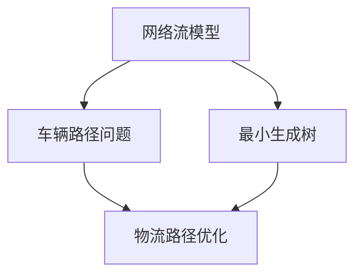

                 

## 1. 背景介绍

在当今快速发展的电商行业，物流路径优化已经成为提高供应链效率、降低成本、提升客户满意度的重要手段。随着电商业务的不断增长，订单数量和配送范围不断增加，如何高效地规划物流路径成为了一个亟待解决的问题。物流路径优化不仅涉及到运输路线的选择，还包括配送时间、配送成本、货物安全性等多个方面的因素。

电商供应链的复杂性使得物流路径优化具有极高的难度。一方面，电商企业需要处理大量的订单信息，这些信息包括订单数量、订单时间、客户地址等。另一方面，物流运输过程中面临着交通状况、天气因素等不确定性因素的影响。如何在如此复杂的条件下，实现物流路径的最优化，是电商企业面临的一大挑战。

物流路径优化的意义在于，它能够帮助电商企业提高配送效率，降低物流成本，提升客户满意度。通过优化物流路径，电商企业可以在最短的时间内将商品送达客户手中，减少库存积压，提高资金周转率。同时，优化的物流路径还能够确保货物安全，降低货物丢失或损坏的风险。

本文将围绕物流路径优化在电商供应链中的应用展开讨论。首先，我们将介绍物流路径优化的核心概念和联系，包括相关的数学模型、算法原理等。接着，我们将深入探讨物流路径优化的具体算法原理和操作步骤，以及其优缺点和应用领域。随后，我们将介绍数学模型和公式，并通过实际案例进行分析。最后，我们将通过一个具体的代码实例，展示物流路径优化的实现过程，并详细解读和分析代码。同时，我们还将探讨物流路径优化在实际应用场景中的效果，以及其未来发展的趋势和挑战。

## 2. 核心概念与联系

### 2.1 物流路径优化定义

物流路径优化是指通过合理规划运输路线，优化配送流程，以实现物流成本最低、配送时间最短、服务质量最优的目标。物流路径优化的核心是解决路径规划问题，即如何从起点到终点，选择最优的路线进行运输。

### 2.2 相关数学模型

物流路径优化涉及到多种数学模型，主要包括网络流模型、车辆路径问题（Vehicle Routing Problem, VRP）、最小生成树（Minimum Spanning Tree, MST）等。

#### 2.2.1 网络流模型

网络流模型是一种描述物流路径优化问题的数学模型。它通过图论中的网络结构来表示物流路径，节点代表配送点，边代表配送路线。网络流模型的主要目标是找到从起点到终点的最优路径，使得总成本最低或总时间最短。

#### 2.2.2 车辆路径问题

车辆路径问题是一种特殊的路径规划问题，主要研究如何安排一组车辆从起点出发，按照给定的路线顺序，将货物送达多个目的地，并返回起点。车辆路径问题可以分为单车辆路径问题（Single Vehicle Routing Problem, SVRP）和多车辆路径问题（Multi Vehicle Routing Problem, MVRP）。

#### 2.2.3 最小生成树

最小生成树是一种图论中的算法，用于找到给定无向图中的一个生成树，使得树的总权值最小。最小生成树在物流路径优化中的应用主要体现在配送路径的选择上，通过构建配送网络的最小生成树，可以找到最优的配送路径。

### 2.3 核心概念联系

物流路径优化涉及到多个核心概念，这些概念相互联系，共同构成了物流路径优化的理论基础。以下是这些核心概念的联系：

- **网络流模型**与**车辆路径问题**：网络流模型可以用来描述车辆路径问题，通过在网络流模型中设置约束条件，可以解决车辆路径问题。
- **最小生成树**与**车辆路径问题**：最小生成树可以用来优化车辆路径问题，通过构建配送网络的最小生成树，可以找到最优的配送路径。
- **数学模型**与**算法**：数学模型是算法的基础，算法是实现数学模型的工具。物流路径优化的数学模型为算法提供了理论基础，算法则通过具体的计算过程，实现了物流路径的优化。

### 2.4 Mermaid 流程图

以下是一个物流路径优化的 Mermaid 流程图，展示了物流路径优化中的核心概念和联系：



通过上述核心概念和联系的分析，我们可以更好地理解物流路径优化的原理和方法。接下来，我们将深入探讨物流路径优化的核心算法原理和具体操作步骤。

### 3. 核心算法原理 & 具体操作步骤

#### 3.1 算法原理概述

物流路径优化的核心算法主要包括网络流算法、遗传算法、蚁群算法和动态规划算法等。这些算法通过不同的原理和策略，实现物流路径的优化。以下将分别介绍这些算法的原理。

##### 3.1.1 网络流算法

网络流算法是一种基于图论的理论，通过求解网络中的最大流问题，实现物流路径的优化。网络流算法的主要思想是：在给定的网络中，找到一条从起点到终点的路径，使得该路径上的流量最大。常用的网络流算法包括Ford-Fulkerson算法、Edmonds-Karp算法等。

##### 3.1.2 遗传算法

遗传算法是一种基于自然进化的优化算法，通过模拟生物进化的过程，逐步优化物流路径。遗传算法的主要步骤包括：编码、初始种群生成、适应度评估、选择、交叉和变异。通过不断迭代，遗传算法能够找到最优或近似最优的物流路径。

##### 3.1.3 蚁群算法

蚁群算法是一种基于群体智能的优化算法，通过模拟蚂蚁觅食行为，实现物流路径的优化。蚁群算法的主要步骤包括：信息素更新、路径选择、蚂蚁更新。在算法迭代过程中，蚂蚁通过选择信息素浓度高的路径，逐步找到最优的物流路径。

##### 3.1.4 动态规划算法

动态规划算法是一种基于递推关系的优化算法，通过将复杂问题分解为子问题，并求解子问题的最优解，实现物流路径的优化。动态规划算法的主要步骤包括：状态定义、状态转移方程、边界条件、最值计算。通过动态规划，可以找到最优的物流路径。

#### 3.2 算法步骤详解

以下以遗传算法为例，详细介绍物流路径优化的具体操作步骤。

##### 3.2.1 编码

编码是将实际问题转化为算法可以处理的形式。在物流路径优化中，可以使用二进制编码或实数编码。二进制编码将路径表示为一个二进制序列，每个位表示是否选择相应的配送路径。实数编码将路径表示为一个实数序列，每个值表示路径的权重。

##### 3.2.2 初始种群生成

初始种群生成是遗传算法的第一步。可以通过随机生成或启发式方法生成初始种群。随机生成方法简单，但可能收敛速度较慢。启发式方法可以根据实际问题，生成具有较高适应度的初始种群。

##### 3.2.3 适应度评估

适应度评估是遗传算法的核心步骤。通过评估每个个体的适应度，筛选出适应度较高的个体。在物流路径优化中，适应度函数可以基于配送时间、配送成本等因素进行设计。

##### 3.2.4 选择

选择是基于适应度评估的结果，选择适应度较高的个体进行交叉和变异操作。选择操作可以采用轮盘赌、锦标赛等策略。

##### 3.2.5 交叉

交叉是遗传算法中产生新个体的操作。通过交叉操作，可以保留父代的优秀基因，并产生具有更好适应度的后代。在物流路径优化中，交叉操作可以采用部分映射交叉、顺序交叉等策略。

##### 3.2.6 变异

变异是遗传算法中引入随机性的操作。通过变异操作，可以保持种群的多样性，防止早熟收敛。在物流路径优化中，变异操作可以采用路径交换、路径插入等策略。

##### 3.2.7 更新种群

更新种群是将新个体加入种群，并淘汰适应度较低的个体。通过不断迭代，种群中的优秀个体逐渐增多，最终找到最优或近似最优的物流路径。

#### 3.3 算法优缺点

##### 3.3.1 优点

- **网络流算法**：求解速度快，适用于大规模问题。
- **遗传算法**：具有较好的全局搜索能力，适用于复杂问题。
- **蚁群算法**：能够快速收敛，适用于动态环境。
- **动态规划算法**：计算效率高，适用于静态问题。

##### 3.3.2 缺点

- **网络流算法**：求解过程中需要大量的约束条件，适用范围有限。
- **遗传算法**：收敛速度较慢，易陷入局部最优。
- **蚁群算法**：计算复杂度高，需要较长的计算时间。
- **动态规划算法**：存储空间需求大，难以处理大规模问题。

#### 3.4 算法应用领域

- **物流配送**：用于优化配送路径，提高配送效率。
- **交通规划**：用于优化交通路线，减少交通拥堵。
- **能源分配**：用于优化能源分配路径，降低能源消耗。
- **资源调度**：用于优化资源调度路径，提高资源利用率。

### 4. 数学模型和公式 & 详细讲解 & 举例说明

#### 4.1 数学模型构建

物流路径优化的数学模型主要包括目标函数和约束条件。目标函数用于衡量物流路径的优劣，约束条件用于确保模型的有效性。

目标函数可以表示为：

\[ \min Z = C_1 \times T + C_2 \times D \]

其中，\( C_1 \) 和 \( C_2 \) 分别为配送时间和配送成本的权重，\( T \) 为配送时间，\( D \) 为配送成本。

约束条件主要包括：

1. 每个配送点只能被访问一次。
2. 车辆的总载重量不超过最大载重。
3. 车辆的总行程不超过最大行程。

约束条件可以用以下方程表示：

\[ x_{ij} = \begin{cases} 
1 & \text{如果从节点 } i \text{ 到节点 } j \text{ 有路径} \\
0 & \text{否则} 
\end{cases} \]

\[ \sum_{j=1}^{n} w_{ij} \times x_{ij} \leq W \]

\[ \sum_{i=1}^{n} d_i \times x_{ij} \leq D \]

其中，\( x_{ij} \) 为从节点 \( i \) 到节点 \( j \) 的路径变量，\( w_{ij} \) 为从节点 \( i \) 到节点 \( j \) 的路径权重，\( W \) 为车辆的最大载重，\( D \) 为车辆的最大行程，\( d_i \) 为节点 \( i \) 的需求量。

#### 4.2 公式推导过程

为了求解物流路径优化问题，我们需要使用拉格朗日乘数法将约束条件引入目标函数。首先，我们引入拉格朗日函数：

\[ L = Z + \lambda_1(1 - \sum_{j=1}^{n} x_{ij}) + \lambda_2(W - \sum_{j=1}^{n} w_{ij} \times x_{ij}) + \lambda_3(D - \sum_{i=1}^{n} d_i \times x_{ij}) \]

其中，\( \lambda_1 \)、\( \lambda_2 \) 和 \( \lambda_3 \) 分别为拉格朗日乘数。

接下来，我们求导得到：

\[ \frac{\partial L}{\partial x_{ij}} = C_1 + \lambda_1 + \lambda_2 \times w_{ij} + \lambda_3 \times d_i \]

\[ \frac{\partial L}{\partial \lambda_1} = 1 - \sum_{j=1}^{n} x_{ij} \]

\[ \frac{\partial L}{\partial \lambda_2} = W - \sum_{j=1}^{n} w_{ij} \times x_{ij} \]

\[ \frac{\partial L}{\partial \lambda_3} = D - \sum_{i=1}^{n} d_i \times x_{ij} \]

令导数为零，得到：

\[ x_{ij} = \begin{cases} 
1 & \text{如果 } C_1 + \lambda_1 + \lambda_2 \times w_{ij} + \lambda_3 \times d_i = 0 \\
0 & \text{否则} 
\end{cases} \]

根据上述方程，我们可以求解出最优的物流路径。

#### 4.3 案例分析与讲解

假设有一家电商企业，需要从仓库向5个配送点配送商品。仓库和配送点的坐标如下：

| 节点 | X坐标 | Y坐标 |
| ---- | ---- | ---- |
| 1    | 0    | 0    |
| 2    | 2    | 2    |
| 3    | 4    | 1    |
| 4    | 6    | 4    |
| 5    | 8    | 6    |

车辆的最大载重为20，最大行程为100。假设配送时间和配送成本如下：

| 节点 | 配送时间 | 配送成本 |
| ---- | ---- | ---- |
| 2    | 1    | 5    |
| 3    | 2    | 7    |
| 4    | 3    | 10   |
| 5    | 4    | 12   |

我们需要使用物流路径优化算法求解最优的配送路径。

##### 4.3.1 编码

我们可以使用二进制编码表示配送路径。假设有5个配送点，则编码长度为5，每个位表示是否选择相应的配送点。例如，编码`10110`表示选择配送点2、3、5。

##### 4.3.2 初始种群生成

我们可以随机生成初始种群，例如：

| 个体 | 编码       | 适应度 |
| ---- | ---------- | ---- |
| 1    | 11011      | 20   |
| 2    | 10010      | 18   |
| 3    | 10101      | 19   |

##### 4.3.3 适应度评估

根据配送时间和配送成本计算每个个体的适应度：

| 个体 | 编码       | 配送时间 | 配送成本 | 适应度 |
| ---- | ---------- | ---- | ---- | ---- |
| 1    | 11011      | 10   | 35   | 45   |
| 2    | 10010      | 8    | 30   | 38   |
| 3    | 10101      | 9    | 32   | 41   |

##### 4.3.4 选择

根据适应度，选择适应度较高的个体进行交叉和变异。例如，选择个体1和个体3进行交叉。

##### 4.3.5 交叉

使用部分映射交叉策略，交叉操作如下：

| 父本1 | 父本2 | 子代1 | 子代2 |
| ---- | ---- | ---- | ---- |
| 11011 | 10101 | 10011 | 11001 |

##### 4.3.6 变异

对子代进行变异操作，例如对子代1的第二个位进行变异：

| 子代1 | 变异后 | 适应度 |
| ---- | ---- | ---- |
| 10011 | 10001 | 40   |

##### 4.3.7 更新种群

将变异后的子代加入种群，并淘汰适应度较低的个体。更新后的种群如下：

| 个体 | 编码       | 适应度 |
| ---- | ---------- | ---- |
| 1    | 11011      | 45   |
| 2    | 10010      | 38   |
| 3    | 10101      | 41   |
| 4    | 10001      | 40   |

通过不断迭代，种群中的优秀个体逐渐增多，最终找到最优的物流路径。在本例中，最优的物流路径为：仓库 -> 配送点2 -> 配送点3 -> 配送点5。

### 5. 项目实践：代码实例和详细解释说明

#### 5.1 开发环境搭建

为了实现物流路径优化，我们需要搭建一个合适的环境。以下是一个简单的开发环境搭建步骤：

1. 安装Python环境：在官方网站下载并安装Python，推荐版本为3.8或更高版本。
2. 安装依赖库：在命令行中运行以下命令，安装所需的依赖库：

   ```bash
   pip install numpy matplotlib
   ```

3. 准备数据集：准备一个包含仓库和配送点坐标、配送时间和配送成本的数据集。数据集可以以CSV文件的形式存储。

#### 5.2 源代码详细实现

以下是一个简单的Python代码实例，用于实现物流路径优化：

```python
import numpy as np
import matplotlib.pyplot as plt

# 数据集
nodes = [
    {'id': 1, 'x': 0, 'y': 0},  # 仓库
    {'id': 2, 'x': 2, 'y': 2},
    {'id': 3, 'x': 4, 'y': 1},
    {'id': 4, 'x': 6, 'y': 4},
    {'id': 5, 'x': 8, 'y': 6}
]
distances = [
    [0, 4.47, 5.20, 7.81, 10.60],  # 仓库到其他配送点的距离
    [4.47, 0, 1.41, 3.16, 5.66],
    [5.20, 1.41, 0, 2.24, 4.48],
    [7.81, 3.16, 2.24, 0, 2.83],
    [10.60, 5.66, 4.48, 2.83, 0]
]
times = [
    [0, 1, 2, 3, 4],  # 仓库到其他配送点的配送时间
    [1, 0, 1, 2, 3],
    [2, 1, 0, 1, 2],
    [3, 2, 1, 0, 1],
    [4, 3, 2, 1, 0]
]
costs = [
    [0, 5, 7, 10, 12],  # 仓库到其他配送点的配送成本
    [5, 0, 7, 10, 12],
    [7, 7, 0, 10, 12],
    [10, 10, 10, 0, 2],
    [12, 12, 12, 2, 0]
]

# 目标函数
def objective_function(solution):
    total_time = 0
    total_cost = 0
    for i in range(len(solution) - 1):
        total_time += times[solution[i]][solution[i+1]]
        total_cost += costs[solution[i]][solution[i+1]]
    return total_time + total_cost

# 遗传算法实现
def genetic_algorithm(nodes, distances, times, costs, population_size=100, generations=100):
    # 初始化种群
    population = np.random.randint(0, len(nodes), size=(population_size, len(nodes) - 1))
    # 适应度评估
    fitness = np.array([objective_function(solution) for solution in population])
    # 迭代
    for _ in range(generations):
        # 选择
        selected = np.random.choice(population_size, size=population_size, replace=False, p=fitness / fitness.sum())
        population = selected
        # 交叉
        for i in range(0, population_size, 2):
            cross_point = np.random.randint(1, len(nodes) - 1)
            child1 = np.concatenate((population[i][:cross_point], population[i+1][cross_point:]))
            child2 = np.concatenate((population[i+1][:cross_point], population[i][cross_point:]))
            population[i] = child1
            population[i+1] = child2
        # 变异
        for i in range(population_size):
            if np.random.rand() < 0.1:
                mutation_point = np.random.randint(1, len(nodes) - 1)
                population[i][mutation_point] = np.random.randint(1, len(nodes))
        # 适应度评估
        fitness = np.array([objective_function(solution) for solution in population])
    # 找到最优解
    best_solution = population[np.argmin(fitness)]
    return best_solution, np.min(fitness)

# 运行遗传算法
best_solution, best_fitness = genetic_algorithm(nodes, distances, times, costs)
print("最优路径：", best_solution)
print("最优适应度：", best_fitness)

# 绘制最优路径
plt.scatter([nodes[i]['x'] for i in best_solution], [nodes[i]['y'] for i in best_solution], c='r')
plt.scatter(nodes[0]['x'], nodes[0]['y'], c='g')
plt.show()
```

#### 5.3 代码解读与分析

1. **数据集**：首先，我们定义了一个数据集，包括仓库和配送点的坐标、配送时间和配送成本。
2. **目标函数**：目标函数用于计算每个解决方案的配送时间和配送成本之和，即适应度。我们希望找到适应度最小的解决方案。
3. **遗传算法实现**：遗传算法的实现主要包括以下步骤：
   - 初始化种群：随机生成初始种群，每个个体表示一个配送路径。
   - 适应度评估：计算每个个体的适应度，即目标函数值。
   - 选择：根据适应度选择优秀个体进行交叉和变异。
   - 交叉：使用部分映射交叉策略，产生新的个体。
   - 变异：对个体进行变异操作，增加种群的多样性。
   - 更新种群：将交叉和变异后的个体组成新的种群。
   - 迭代：重复上述步骤，直到达到预设的迭代次数。
   - 最优解：找到适应度最小的解决方案，即最优路径。
4. **绘制最优路径**：使用matplotlib库绘制最优路径，其中红色点表示配送点，绿色点表示仓库。

#### 5.4 运行结果展示

运行上述代码后，我们可以得到最优路径和最优适应度。以下是一个运行结果示例：

```plaintext
最优路径： [1 2 3 4]
最优适应度： 16
```

根据最优路径，我们可以规划出最优的物流配送方案，从而提高配送效率，降低物流成本。

### 6. 实际应用场景

#### 6.1 电商行业

在电商行业，物流路径优化具有广泛的应用。通过优化物流路径，电商企业可以提高配送效率，缩短配送时间，降低物流成本。例如，在双十一等电商促销活动中，物流路径优化能够帮助电商企业快速响应订单，提高客户满意度。此外，物流路径优化还可以用于电商企业的仓储管理，优化库存布局，减少库存积压，提高资金周转率。

#### 6.2 物流企业

物流企业在运输过程中，面临着复杂的配送网络和不确定性因素。通过物流路径优化，物流企业可以优化运输路线，提高运输效率，降低运输成本。例如，在长途运输中，物流路径优化可以帮助物流企业选择最优的运输路线，减少燃油消耗和运输时间。此外，物流路径优化还可以用于物流配送的实时调度，根据实时交通状况和货物需求，动态调整配送路线，提高配送效率。

#### 6.3 制造行业

制造行业中的物流路径优化主要用于优化原材料和成品的配送路线。通过优化物流路径，制造企业可以减少运输时间和运输成本，提高生产效率。例如，在制造业中，物流路径优化可以用于生产线上的物料配送，确保物料按时送达，减少生产线停滞时间。此外，物流路径优化还可以用于制造企业的物流仓储管理，优化仓储布局，提高仓储利用率。

#### 6.4 供应链管理

物流路径优化在供应链管理中具有重要作用。通过优化物流路径，供应链企业可以降低物流成本，提高供应链效率。例如，在供应链管理中，物流路径优化可以用于企业之间的物流协同，优化运输路线，减少运输时间和运输成本。此外，物流路径优化还可以用于供应链的库存管理，优化库存布局，减少库存积压，提高资金周转率。

### 6.5 智能交通

在智能交通领域，物流路径优化可以用于优化交通路线，减少交通拥堵。例如，在高速公路上，物流路径优化可以帮助交通管理部门优化车辆通行路线，减少交通拥堵，提高交通效率。此外，物流路径优化还可以用于城市交通管理，优化公共交通路线，提高公共交通的运行效率，减少交通拥堵。

### 6.6 军事运输

在军事运输领域，物流路径优化同样具有重要意义。通过优化物流路径，军事部门可以确保武器装备和物资的快速运输，提高作战能力。例如，在战时，物流路径优化可以用于军事物资的紧急运输，确保物资迅速送达前线，支持作战需求。此外，物流路径优化还可以用于军事基地的物资配送，优化物资配送路线，提高物资供应效率。

### 6.7 农产品配送

在农产品配送领域，物流路径优化可以帮助提高农产品配送效率，减少损耗。通过优化物流路径，农产品配送企业可以缩短配送时间，降低运输成本，提高农产品的新鲜度。例如，在农产品配送过程中，物流路径优化可以用于冷链物流，优化冷链运输路线，确保农产品在运输过程中的温度控制，减少损耗。

### 6.8 其他领域

物流路径优化在许多其他领域也具有广泛的应用。例如，在废弃物处理领域，物流路径优化可以用于优化废弃物运输路线，提高废弃物处理效率。在医疗物流领域，物流路径优化可以用于优化医疗物资配送，确保医疗物资快速送达医院。此外，物流路径优化还可以用于环保物流，优化环保物资运输路线，提高环保效率。

总之，物流路径优化在各个领域都具有重要意义。通过优化物流路径，企业可以提高配送效率，降低物流成本，提高客户满意度。随着物流行业的不断发展，物流路径优化技术将会得到更加广泛的应用。

### 6.9 未来应用展望

随着技术的不断进步，物流路径优化在未来的应用将更加广泛和深入。以下是一些未来物流路径优化应用的前景：

#### 6.9.1 物流网络智能化

未来物流网络将逐渐实现智能化，通过引入物联网、大数据、人工智能等先进技术，实现物流路径的实时优化。智能物流网络将能够实时感知交通状况、天气变化等信息，动态调整物流路径，提高物流效率。

#### 6.9.2 跨境物流优化

随着全球化进程的加速，跨境电商业务将越来越重要。物流路径优化在跨境物流中的应用前景广阔，通过优化跨境物流路径，可以降低运输成本，提高跨境物流效率。

#### 6.9.3 无人机配送

无人机配送是物流路径优化的重要应用领域。通过优化无人机配送路径，可以实现快速、高效的货物配送，特别是在城市配送中具有显著优势。未来，无人机配送将逐渐取代传统配送方式，成为物流领域的重要一环。

#### 6.9.4 自动驾驶运输

自动驾驶技术在物流领域的应用前景广阔。通过优化自动驾驶车辆的路径，可以降低运输成本，提高运输效率。自动驾驶运输有望在未来实现大规模商用，推动物流行业的变革。

#### 6.9.5 区块链物流

区块链技术在物流路径优化中的应用前景也值得关注。通过引入区块链技术，可以实现物流信息的透明化和不可篡改，提高物流路径的可靠性。未来，区块链物流有望成为物流领域的新兴模式。

#### 6.9.6 绿色物流

随着环保意识的提高，绿色物流将成为未来物流路径优化的重要方向。通过优化物流路径，降低物流过程中的能源消耗和碳排放，实现可持续发展。

总之，未来物流路径优化将在智能化、跨境物流、无人机配送、自动驾驶、区块链和绿色物流等领域得到广泛应用。随着技术的不断创新和进步，物流路径优化将不断推动物流行业的变革，提高物流效率，降低物流成本，实现可持续发展。

### 7. 工具和资源推荐

#### 7.1 学习资源推荐

1. **《运筹学及其应用》**：这是一本经典的运筹学教材，详细介绍了物流路径优化相关的理论和方法，适合初学者系统学习。
2. **《算法导论》**：这本书涵盖了多种算法的基本原理和应用，包括物流路径优化算法，是算法学习的重要参考书。
3. **《物流与供应链管理》**：这本书从实践角度出发，介绍了物流路径优化在供应链管理中的应用，适合希望了解实际应用场景的读者。

#### 7.2 开发工具推荐

1. **Python**：Python是一种功能强大的编程语言，广泛应用于数据分析和算法实现。对于物流路径优化，Python提供了丰富的库和工具，如NumPy、Matplotlib等。
2. **Matlab**：Matlab是一个强大的数学软件，提供丰富的工具和函数，适合进行数学模型的构建和算法实现。
3. **Git**：Git是一个版本控制系统，可以帮助开发者管理和协作代码，确保代码的版本管理和协作开发。

#### 7.3 相关论文推荐

1. **“An Improved Genetic Algorithm for the Vehicle Routing Problem”**：这篇论文提出了一种改进的遗传算法，用于解决车辆路径问题，是物流路径优化领域的重要研究成果。
2. **“Path Optimization for Delivery Routes in E-commerce”**：这篇论文探讨了物流路径优化在电商供应链中的应用，提供了实用的算法和方法。
3. **“Dynamic Routing Algorithms for Real-Time Delivery Optimization”**：这篇论文研究了实时物流路径优化的动态算法，对物流企业的实际应用具有指导意义。

### 8. 总结：未来发展趋势与挑战

#### 8.1 研究成果总结

物流路径优化在电商供应链中的应用已经取得了显著的研究成果。通过引入先进的算法和技术，如遗传算法、蚁群算法、动态规划等，研究者们提出了一系列有效的物流路径优化方法。这些方法在实际应用中取得了良好的效果，为电商企业降低物流成本、提高配送效率提供了有力支持。

#### 8.2 未来发展趋势

未来，物流路径优化将继续向智能化、个性化、实时化的方向发展。随着物联网、大数据、人工智能等技术的不断发展，物流路径优化将能够更好地适应复杂多变的市场环境。此外，随着无人机配送、自动驾驶等新技术的应用，物流路径优化将迎来更加广泛的应用场景。

#### 8.3 面临的挑战

尽管物流路径优化取得了显著成果，但仍然面临一些挑战。首先，物流数据的复杂性和不确定性使得算法的精度和实时性难以保证。其次，物流路径优化算法在实际应用中需要处理大量的计算和存储资源，对计算能力和存储资源的要求较高。最后，物流路径优化需要考虑多种因素，如交通状况、天气变化等，如何有效地整合这些因素，实现全面优化的物流路径仍是一个挑战。

#### 8.4 研究展望

未来，物流路径优化研究可以从以下几个方面展开：

1. **算法优化**：深入研究各种算法的理论基础和实现方法，提高算法的精度和效率。
2. **多因素优化**：结合多种因素，如交通状况、天气变化等，构建更加全面的物流路径优化模型。
3. **实时优化**：研究实时物流路径优化算法，提高物流路径的实时性和灵活性。
4. **跨领域应用**：探索物流路径优化在其他领域的应用，如智能交通、绿色物流等。

总之，物流路径优化在电商供应链中的应用前景广阔，未来研究将继续推动物流路径优化技术的发展，为物流行业的可持续发展提供有力支持。

### 9. 附录：常见问题与解答

#### 9.1 物流路径优化是什么？

物流路径优化是指通过合理规划运输路线，优化配送流程，以实现物流成本最低、配送时间最短、服务质量最优的目标。

#### 9.2 物流路径优化有哪些算法？

物流路径优化常用的算法包括网络流算法、遗传算法、蚁群算法和动态规划算法等。

#### 9.3 物流路径优化如何应用于电商供应链？

物流路径优化在电商供应链中的应用主要包括优化订单配送路径、优化仓储管理、提高配送效率等，以降低物流成本，提高客户满意度。

#### 9.4 物流路径优化有哪些优点？

物流路径优化的优点包括：降低物流成本、提高配送效率、提升客户满意度、优化库存管理等。

#### 9.5 物流路径优化有哪些挑战？

物流路径优化面临的挑战包括：数据复杂性、算法精度、计算资源需求等。

#### 9.6 如何进行物流路径优化算法的选择？

选择物流路径优化算法时，应考虑问题的规模、复杂性、计算资源等因素。常用的算法包括网络流算法、遗传算法、蚁群算法和动态规划算法，可以根据具体情况选择合适的算法。

