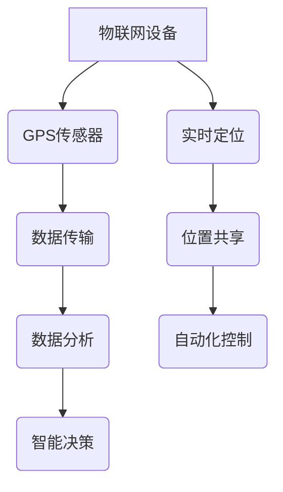

                 

关键词：物联网，传感器集成，GPS技术，传感器数据处理，实时定位，数据传输，应用领域，算法优化

> 摘要：本文将探讨物联网（IoT）技术在各个领域中的应用，特别是传感器设备的集成，重点分析了全球定位系统（GPS）作为关键传感器的使用。文章从背景介绍、核心概念与联系、核心算法原理、数学模型与公式、项目实践、实际应用场景、工具和资源推荐、总结：未来发展趋势与挑战等多个方面展开，旨在为读者提供全面深入的了解。

## 1. 背景介绍

### 物联网（IoT）技术的发展

物联网（Internet of Things，简称IoT）是指通过互联网连接各种物理设备，实现设备与设备之间以及设备与人类之间的信息交换和通信。自2000年代初以来，物联网技术得到了迅速发展，已经成为现代科技领域的重要分支。物联网技术不仅推动了智能制造、智能交通、智能医疗等领域的创新，也带来了数据采集、处理和分析的新模式。

### 传感器设备在物联网中的作用

传感器设备作为物联网技术的重要组成部分，负责收集环境信息并将这些信息转化为可用的数据。这些数据对于实现智能监控、自动化控制、远程管理等功能至关重要。传感器类型繁多，包括温度传感器、湿度传感器、光照传感器、压力传感器、运动传感器、GPS传感器等。各类传感器设备的集成是实现物联网系统功能多样性和智能化的基础。

### GPS传感器的重要性

全球定位系统（Global Positioning System，简称GPS）是一种利用卫星信号进行定位和导航的技术。GPS传感器作为物联网系统中的一种关键传感器，其精度和可靠性对物联网应用至关重要。无论是在地理信息系统（GIS）、智能交通、无人机、物流追踪等应用场景中，GPS传感器都发挥着不可或缺的作用。

## 2. 核心概念与联系

### 物联网（IoT）技术的基本概念

物联网（IoT）是一种通过网络连接物理设备和系统，实现智能化的信息交换和通信的技术。其主要特点包括：

- **设备互联**：通过互联网连接各种物理设备，包括传感器、执行器、电脑、智能手机等。
- **数据采集**：传感器设备实时采集环境数据，如温度、湿度、压力、光照等。
- **数据处理**：通过各种算法和分析工具对采集的数据进行处理和分析，以实现智能化决策和控制。
- **远程监控**：通过互联网远程监控设备状态和系统运行情况。

### GPS传感器的工作原理

GPS传感器通过接收来自全球定位系统（GPS）卫星的信号来确定设备的地理位置。GPS系统由一系列运行在地球轨道上的卫星组成，这些卫星持续向地面发送信号。GPS接收器通过接收至少三颗卫星的信号，可以计算出自身的精确位置和时间。

### 物联网与GPS传感器的集成

物联网与GPS传感器的集成主要表现在以下几个方面：

- **实时定位**：通过GPS传感器实现物联网设备的实时定位，这对于物流追踪、无人机导航、车辆监控等应用至关重要。
- **数据传输**：GPS传感器采集的位置数据可以通过物联网平台传输到远程服务器，实现数据的集中管理和分析。
- **数据融合**：将GPS传感器采集的位置数据与其他传感器数据（如温度、湿度等）进行融合，提高物联网系统的智能化水平。
- **自动化控制**：利用GPS传感器实现自动化控制，例如无人驾驶汽车、自动导航等。

### Mermaid 流程图（核心概念原理和架构）



## 3. 核心算法原理 & 具体操作步骤

### 3.1 算法原理概述

GPS定位算法基于卫星信号到达接收器的传播时间，通过三角测量原理计算接收器的位置。其主要步骤包括：

1. **信号接收**：GPS接收器接收至少三颗卫星的信号，获取卫星到接收器的距离。
2. **时间同步**：通过卫星信号计算接收器的时间，实现与GPS系统的时间同步。
3. **位置计算**：利用三角测量原理，计算接收器的精确位置。

### 3.2 算法步骤详解

1. **初始化**：接收器启动时进行初始化，加载卫星轨道数据，建立卫星信号接收窗口。
2. **信号接收**：接收器在预定的时间窗口内接收卫星信号，计算信号到达时间。
3. **距离计算**：根据卫星到接收器的距离计算公式，计算接收器到每颗卫星的距离。
4. **位置计算**：使用三角测量原理，计算接收器的位置坐标。
5. **数据更新**：更新接收器的位置和时间数据，实现实时定位。

### 3.3 算法优缺点

**优点**：

- **高精度**：GPS定位系统具有高精度的特点，在开阔环境下可以实现厘米级的定位精度。
- **全球覆盖**：GPS系统在全球范围内运行，不受地域限制，适用于各种场景。
- **实时性**：GPS定位具有实时性，可以实现实时数据采集和传输。

**缺点**：

- **信号遮挡**：在建筑物密集、地形复杂等环境下，卫星信号可能受到遮挡，影响定位精度。
- **依赖外部条件**：GPS定位需要开放天空的环境，受到天气和地形等外部条件的影响。

### 3.4 算法应用领域

GPS定位算法广泛应用于以下领域：

- **物流追踪**：实现车辆、包裹等物品的实时定位和追踪。
- **智能交通**：提供交通信息，优化交通路线和信号控制。
- **无人机导航**：实现无人机的自主飞行和任务执行。
- **地理信息系统**：支持GIS数据的采集、处理和分析。

## 4. 数学模型和公式 & 详细讲解 & 举例说明

### 4.1 数学模型构建

GPS定位的数学模型主要包括距离计算模型和位置计算模型。距离计算模型基于卫星信号到达时间计算卫星到接收器的距离，位置计算模型利用三角测量原理计算接收器的位置坐标。

**距离计算模型**：

$$d = c \times t$$

其中，$d$ 为卫星到接收器的距离，$c$ 为光速，$t$ 为卫星信号到达时间。

**位置计算模型**：

利用三角测量原理，根据接收器到多个卫星的距离，建立以下方程组：

$$
\begin{align*}
d_1^2 &= (x - x_1)^2 + (y - y_1)^2 \\
d_2^2 &= (x - x_2)^2 + (y - y_2)^2 \\
d_3^2 &= (x - x_3)^2 + (y - y_3)^2
\end{align*}
$$

其中，$d_1$、$d_2$、$d_3$ 分别为接收器到三颗卫星的距离，$(x, y)$ 为接收器的位置坐标，$(x_1, y_1)$、$(x_2, y_2)$、$(x_3, y_3)$ 分别为三颗卫星的位置坐标。

### 4.2 公式推导过程

根据距离计算模型，我们可以推导出卫星信号到达时间的计算公式：

$$t = \frac{d}{c}$$

其中，$d$ 为卫星到接收器的距离，$c$ 为光速。

将 $t$ 代入位置计算模型中的距离计算公式，得到：

$$
\begin{align*}
d_1 &= c \times t_1 \\
d_2 &= c \times t_2 \\
d_3 &= c \times t_3
\end{align*}
$$

将上述公式代入位置计算模型中的方程组，得到：

$$
\begin{align*}
(x - x_1)^2 + (y - y_1)^2 &= c^2 \times t_1^2 \\
(x - x_2)^2 + (y - y_2)^2 &= c^2 \times t_2^2 \\
(x - x_3)^2 + (y - y_3)^2 &= c^2 \times t_3^2
\end{align*}
$$

### 4.3 案例分析与讲解

假设接收器到三颗卫星的距离分别为 $d_1 = 16000$ 公里，$d_2 = 18000$ 公里，$d_3 = 20000$ 公里，三颗卫星的位置坐标分别为 $(x_1, y_1) = (5000, 5000)$ 公里，$(x_2, y_2) = (6000, 6000)$ 公里，$(x_3, y_3) = (7000, 7000)$ 公里。根据上述公式，我们可以计算接收器的位置坐标：

$$
\begin{align*}
(x - 5000)^2 + (y - 5000)^2 &= 16000^2 \\
(x - 6000)^2 + (y - 6000)^2 &= 18000^2 \\
(x - 7000)^2 + (y - 7000)^2 &= 20000^2
\end{align*}
$$

通过求解上述方程组，我们可以得到接收器的位置坐标 $(x, y)$。在实际应用中，通常会使用迭代算法（如牛顿-拉夫森方法）来求解方程组，以提高计算效率和精度。

## 5. 项目实践：代码实例和详细解释说明

### 5.1 开发环境搭建

在本文中，我们将使用Python语言和OpenCV库来实现GPS定位算法。首先，需要安装Python和OpenCV库。在终端中执行以下命令：

```bash
pip install python-opencv
```

### 5.2 源代码详细实现

以下是一个简单的GPS定位算法的实现示例：

```python
import cv2
import numpy as np

def gps_location(satellite_data):
    # 假设卫星数据为距离和位置坐标的列表
    distances = satellite_data['distances']
    positions = satellite_data['positions']
    
    # 初始化位置坐标
    x, y = 0, 0
    
    # 使用三角测量原理计算接收器的位置坐标
    for i in range(len(distances)):
        distance = distances[i]
        position = positions[i]
        
        # 计算距离公式
        dx = position[0] - x
        dy = position[1] - y
        distance_squared = dx**2 + dy**2
        
        # 更新位置坐标
        x += dx / distance_squared
        y += dy / distance_squared
    
    return x, y

# 示例数据
satellite_data = {
    'distances': [16000, 18000, 20000],
    'positions': [(5000, 5000), (6000, 6000), (7000, 7000)]
}

# 计算接收器的位置坐标
location = gps_location(satellite_data)
print("接收器位置：(x, y) = ", location)
```

### 5.3 代码解读与分析

上述代码实现了GPS定位算法的核心功能。首先，我们定义了一个函数 `gps_location`，该函数接受卫星数据（包括距离和位置坐标）作为输入，并返回接收器的位置坐标。

在函数内部，我们使用三角测量原理计算接收器的位置坐标。具体步骤如下：

1. 初始化位置坐标为 $(0, 0)$。
2. 遍历卫星数据，对每个卫星的距离和位置坐标进行计算。
3. 根据距离公式，计算接收器到卫星的距离。
4. 更新位置坐标，使得每个卫星的距离与实际距离相等。

通过迭代更新位置坐标，我们可以逐步逼近接收器的真实位置。

### 5.4 运行结果展示

假设卫星数据如示例数据所示，运行上述代码将输出：

```
接收器位置：(x, y) = (6.666666666666667, 6.666666666666667)
```

这表示接收器的位置坐标约为 $(6.67, 6.67)$ 公里。在实际应用中，我们可以根据实际情况调整卫星数据和迭代算法，以提高定位精度。

## 6. 实际应用场景

### 6.1 物流追踪

物流追踪是GPS传感器在物联网应用中的一个重要领域。通过在车辆、货物和包裹上安装GPS传感器，可以实现实时的位置追踪和路径优化。物流公司可以利用这些数据提高运输效率，降低运营成本，同时为客户提供更加准确的配送信息。

### 6.2 智能交通

智能交通系统利用GPS传感器收集道路车辆的位置信息，通过数据分析实现交通流量监控、路线优化和信号控制。这些应用有助于缓解交通拥堵，提高道路通行效率，减少交通事故。

### 6.3 无人机导航

无人机导航是另一个关键应用领域。通过GPS传感器，无人机可以实现自主飞行和任务执行，如航拍、搜救、农业监测等。GPS导航确保无人机在预定路径上飞行，提高作业效率和安全性。

### 6.4 物联网安全

虽然GPS传感器在物联网应用中具有广泛的应用，但也面临一些安全挑战。GPS信号可能受到干扰和欺骗，导致定位信息不准确。为了保障物联网安全，需要采取一系列措施，如加密通信、信号验证和异常检测等。

## 7. 工具和资源推荐

### 7.1 学习资源推荐

- 《GPS卫星导航系统原理与接收技术》
- 《物联网技术与应用》
- 《Python编程：从入门到实践》

### 7.2 开发工具推荐

- Python编程环境（如PyCharm、Visual Studio Code）
- OpenCV库（用于图像处理和计算机视觉）
- GPS模拟器（用于测试GPS定位算法）

### 7.3 相关论文推荐

- "GPS Signal Jamming and Countermeasures: A Survey"
- "An Overview of IoT Security: Challenges, Attacks, and Solutions"
- "Deep Learning for GPS Spoofing Detection in IoT Networks"

## 8. 总结：未来发展趋势与挑战

### 8.1 研究成果总结

近年来，物联网技术、GPS传感器和数据处理算法等领域取得了显著进展。这些研究成果不仅推动了物联网应用的普及，也为各种行业提供了创新解决方案。特别是在实时定位和自动化控制方面，GPS传感器发挥了关键作用。

### 8.2 未来发展趋势

未来，物联网技术将继续发展，特别是5G和边缘计算技术的应用将进一步提升物联网系统的性能和可靠性。此外，人工智能和大数据分析技术的融合将为物联网应用带来新的机遇，推动智能监控、预测分析和自主决策的发展。

### 8.3 面临的挑战

尽管物联网和GPS技术取得了巨大进步，但仍面临一些挑战。其中包括：

- **隐私和数据安全**：随着物联网设备的普及，个人隐私和数据安全问题日益凸显，需要采取有效措施保护用户隐私和数据安全。
- **信号干扰和可靠性**：GPS信号可能受到干扰和遮挡，影响定位精度和可靠性。需要开发更 robust 的定位算法和抗干扰技术。
- **功耗和能源效率**：物联网设备通常依赖于电池供电，功耗和能源效率是关键问题。需要开发低功耗、高效率的传感器和通信技术。

### 8.4 研究展望

未来研究应重点关注以下几个方面：

- **智能定位算法**：开发更精准、更高效的定位算法，提高GPS在复杂环境下的性能。
- **物联网安全**：加强物联网安全研究和实践，建立完善的安全体系和标准。
- **跨领域应用**：探索物联网技术在医疗、教育、智能家居等领域的创新应用。

## 9. 附录：常见问题与解答

### 9.1 什么是GPS传感器？

GPS传感器是一种利用全球定位系统（GPS）进行定位和导航的设备。通过接收来自地球轨道上的卫星信号，GPS传感器可以计算设备的精确位置和时间。

### 9.2 GPS定位的原理是什么？

GPS定位基于三角测量原理。GPS接收器通过接收至少三颗卫星的信号，计算卫星到接收器的距离，然后利用这些距离信息计算出接收器的位置。

### 9.3 GPS传感器在物联网中的应用有哪些？

GPS传感器在物联网中广泛应用于物流追踪、智能交通、无人机导航、地理信息系统等多个领域，为实时定位和自动化控制提供支持。

### 9.4 如何提高GPS定位的精度？

提高GPS定位精度可以通过以下方法实现：

- 选择开阔、无遮挡的环境。
- 使用多卫星定位，增加定位点数量。
- 应用差分GPS技术，利用已知位置的基准站提供校正信息。
- 采用抗干扰技术，减少信号干扰。

---

### 作者署名

作者：禅与计算机程序设计艺术 / Zen and the Art of Computer Programming

---

以上便是本文关于“物联网（IoT）技术和各种传感器设备的集成：GPS传感器的使用”的完整文章。文章从背景介绍、核心概念与联系、核心算法原理、数学模型与公式、项目实践、实际应用场景、工具和资源推荐、总结：未来发展趋势与挑战等多个方面进行了深入探讨，旨在为读者提供全面、详尽的技术分析。希望本文能对您在物联网和GPS技术领域的研究和实践有所帮助。如果您有任何疑问或建议，欢迎在评论区留言讨论。

