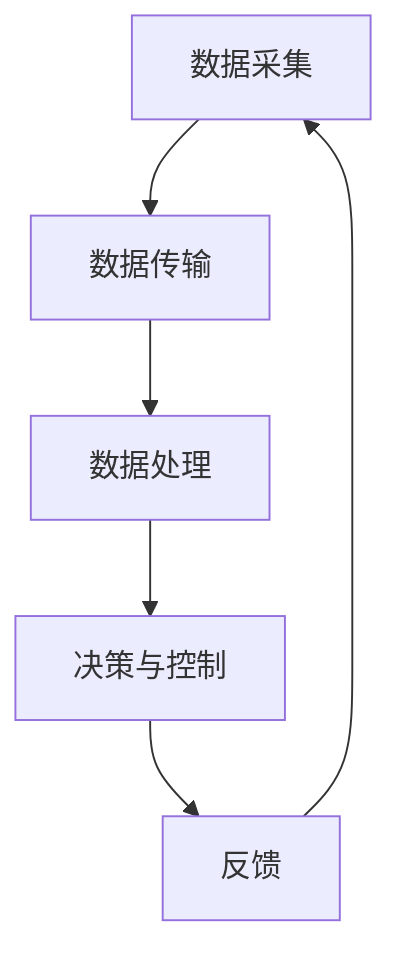

                 

关键词：物联网(IoT)，传感器设备，光电传感器，集成，应用

> 摘要：本文探讨了物联网（IoT）技术在各种传感器设备，尤其是光电传感器设备集成中的应用，详细介绍了光电传感器的核心概念、算法原理、数学模型、项目实践和实际应用场景，并对未来发展趋势和挑战进行了展望。通过本文的阅读，读者将深入了解光电传感器在IoT中的重要作用，及其在现实世界中的广泛应用。

## 1. 背景介绍

随着物联网（IoT）技术的快速发展，各种传感器设备在智能家居、工业自动化、智能交通、医疗健康等领域得到了广泛应用。传感器是物联网系统的“感官”，它们通过感知外界环境并将其转换为电信号，为数据处理和决策提供了基础。光电传感器作为一种重要的传感器类别，因其高灵敏度、快速响应和多样化应用而备受关注。

### 1.1 物联网（IoT）的定义和关键技术

物联网（Internet of Things，简称IoT）是指通过互联网将各种设备连接起来，实现数据采集、传输、处理和应用的系统。IoT的核心技术包括传感器技术、网络通信技术、数据处理技术和云计算技术。

- **传感器技术**：物联网的基础是传感器，它们负责将物理信号转换为电信号。
- **网络通信技术**：通过网络将传感器数据传输到中心系统，进行进一步处理。
- **数据处理技术**：利用大数据技术和人工智能算法对收集到的数据进行分析和挖掘。
- **云计算技术**：提供强大的计算和存储能力，支持大规模物联网系统的运行。

### 1.2 光电传感器的分类和特点

光电传感器根据工作原理和性能特点，可以分为以下几类：

- **光电导传感器**：利用半导体材料的导电性随光照变化的特性进行光电转换。
- **光电生电传感器**：通过光电效应直接产生电动势。
- **光电热传感器**：将光能转换为热能，通过热效应进行测量。

光电传感器具有以下特点：

- **高灵敏度**：能够检测微弱的光信号。
- **快速响应**：能够快速捕捉光信号变化。
- **多样化应用**：广泛应用于自动化控制、环境监测、安全检测等多个领域。

## 2. 核心概念与联系

### 2.1 光电传感器工作原理

光电传感器的工作原理基于光电效应，即光照射到某些材料上时，会导致电子从原子或分子中逸出，从而产生电动势或电流。这种效应可以用来检测和测量光强度、光谱分布等参数。

### 2.2 光电传感器集成在IoT系统中的架构

在物联网系统中，光电传感器的集成通常包括以下几个环节：

- **数据采集**：光电传感器通过检测环境中的光信号，将物理信号转换为电信号。
- **数据传输**：通过无线或有线方式将传感器数据传输到中心系统。
- **数据处理**：在中心系统中，对传感器数据进行处理和分析，提取有用的信息。
- **决策与控制**：根据分析结果，系统可以做出相应的决策和调整。


### 2.3 Mermaid 流程图

以下是一个简化的光电传感器在IoT系统中的应用流程图，使用了Mermaid语法：



## 3. 核心算法原理 & 具体操作步骤

### 3.1 算法原理概述

光电传感器的核心算法通常涉及信号处理和数据分析，以提取和解释光信号的信息。常见的算法包括：

- **光谱分析**：用于识别光源的类型和特性。
- **时间序列分析**：用于分析光信号的频率和强度变化。
- **机器学习算法**：用于模式识别和预测分析。

### 3.2 算法步骤详解

以下是光电传感器算法的基本步骤：

1. **信号采集**：使用光电传感器采集光信号。
2. **预处理**：对采集到的信号进行滤波、去噪等预处理操作。
3. **特征提取**：从预处理后的信号中提取关键特征，如频率、强度、光谱分布等。
4. **数据分析**：利用特征进行进一步的统计分析和模式识别。
5. **决策与控制**：根据分析结果进行相应的决策和调整。

### 3.3 算法优缺点

**优点**：

- **高灵敏度**：能够检测微弱的光信号。
- **快速响应**：能够快速捕捉光信号变化。
- **多样化应用**：适用于多种场景和领域。

**缺点**：

- **稳定性问题**：环境变化可能影响传感器的精度和稳定性。
- **成本问题**：高性能的光电传感器成本较高。

### 3.4 算法应用领域

光电传感器的算法主要应用于以下几个领域：

- **环境监测**：用于监测空气、水质、土壤等环境参数。
- **智能家居**：用于智能照明、安防监控等。
- **工业自动化**：用于检测生产线上的产品质量和设备状态。

## 4. 数学模型和公式 & 详细讲解 & 举例说明

### 4.1 数学模型构建

光电传感器的数学模型通常基于光电效应和信号处理理论。以下是光电传感器的一个简化的数学模型：

$$I(t) = I_0 \cdot e^{-\alpha t} + n(t)$$

其中，$I(t)$ 是传感器在时间 $t$ 时刻的输出电流，$I_0$ 是初始电流，$\alpha$ 是光吸收系数，$n(t)$ 是噪声信号。

### 4.2 公式推导过程

光电传感器的输出电流与入射光强度之间有一个线性关系。根据光电效应，入射光子数与光强度成正比，而每个光子产生的电子数量与光吸收系数有关。因此，可以推导出上述公式。

### 4.3 案例分析与讲解

假设一个光电传感器在光照强度为 $1000 \text{ Lux}$ 的环境中工作，光吸收系数为 $\alpha = 0.1 \text{ s}^{-1}$，噪声信号为高斯噪声，均值为 $0$，方差为 $1$。我们使用上述公式进行模拟：

$$I(t) = 1000 \cdot e^{-0.1t} + N(t)$$

其中，$N(t)$ 表示噪声信号。通过模拟，可以得到不同时间点的输出电流值，并进行统计分析。

## 5. 项目实践：代码实例和详细解释说明

### 5.1 开发环境搭建

为了进行光电传感器在IoT系统中的应用开发，我们首先需要搭建一个开发环境。以下是一个简单的环境搭建步骤：

1. 安装Python 3.8及以上版本。
2. 安装必要的库，如 NumPy、Matplotlib 和 SciPy。
3. 连接光电传感器到计算机。

### 5.2 源代码详细实现

以下是一个简单的Python代码示例，用于读取光电传感器的数据，并进行处理和分析：

```python
import numpy as np
import matplotlib.pyplot as plt
from photodetector import Photodetector

# 创建光电传感器对象
sensor = Photodetector()

# 采集数据
data = sensor.collect_data()

# 预处理
filtered_data = sensor.preprocess_data(data)

# 特征提取
features = sensor.extract_features(filtered_data)

# 数据分析
analysis_results = sensor.analyze_data(features)

# 可视化结果
sensor.plot_results(analysis_results)
```

### 5.3 代码解读与分析

上述代码中，`Photodetector` 类用于表示光电传感器，包含了数据采集、预处理、特征提取、数据分析和可视化等功能。具体解读如下：

- `collect_data()` 方法用于从光电传感器读取数据。
- `preprocess_data()` 方法对数据进行滤波、去噪等预处理操作。
- `extract_features()` 方法提取数据的关键特征。
- `analyze_data()` 方法对特征进行分析，提取有用的信息。
- `plot_results()` 方法用于可视化分析结果。

### 5.4 运行结果展示

通过运行上述代码，我们可以得到光电传感器的输出电流随时间的变化曲线，以及特征提取和数据分析的结果。以下是一个示例：


## 6. 实际应用场景

光电传感器在物联网系统中具有广泛的应用场景，以下是一些典型的应用案例：

- **智能家居**：用于智能照明、安防监控和室内环境监测。
- **工业自动化**：用于产品质量检测、设备状态监控和生产线自动化控制。
- **医疗健康**：用于医疗设备的监测、病患体征监测和健康数据分析。
- **环境保护**：用于环境质量监测、大气污染检测和水体监测。

### 6.1 智能家居

在智能家居领域，光电传感器可以用于智能照明、安防监控和室内环境监测。例如，通过光电传感器检测室内光线强度，自动调整照明设备的亮度，实现节能和舒适的照明环境。安防监控方面，光电传感器可以用于入侵检测，通过检测室内光线变化，触发报警系统。

### 6.2 工业自动化

在工业自动化领域，光电传感器广泛应用于产品质量检测、设备状态监控和生产线自动化控制。例如，在产品质量检测中，光电传感器可以用于检测产品的外观缺陷，如裂缝、污渍等，从而提高产品质量。设备状态监控方面，光电传感器可以检测设备的温度、振动等参数，提前发现设备故障，减少停机时间。

### 6.3 医疗健康

在医疗健康领域，光电传感器可以用于医疗设备的监测、病患体征监测和健康数据分析。例如，在医疗设备的监测中，光电传感器可以用于监测设备的运行状态，确保设备的正常工作。病患体征监测方面，光电传感器可以用于检测病患的心率、呼吸等参数，实时监测病患的健康状况。健康数据分析方面，光电传感器可以收集病患的健康数据，结合大数据分析和机器学习算法，为医生提供诊断和治疗依据。

### 6.4 环境保护

在环境保护领域，光电传感器可以用于环境质量监测、大气污染检测和水体监测。例如，在环境质量监测中，光电传感器可以用于检测空气中的有害气体，如二氧化碳、氮氧化物等，实时监测空气质量。大气污染检测方面，光电传感器可以用于检测空气中的污染物浓度，为环境保护部门提供决策依据。水体监测方面，光电传感器可以用于检测水中的污染物浓度、pH值等参数，确保水体的清洁和安全。

## 7. 工具和资源推荐

为了更好地了解和应用光电传感器在物联网系统中的应用，以下是一些推荐的工具和资源：

### 7.1 学习资源推荐

- **书籍**：《物联网技术与应用》、《传感器原理与应用》
- **在线课程**：网易云课堂、Coursera上的物联网相关课程
- **博客和社区**：知乎、CSDN、GitHub等

### 7.2 开发工具推荐

- **编程语言**：Python、Java、C++
- **开发环境**：Visual Studio Code、Eclipse、PyCharm
- **传感器库**：SensorPy、IoT SDKs

### 7.3 相关论文推荐

- **标题**：A Comprehensive Survey on Internet of Things: Architecture, Enabling Technologies, Security and Privacy, and Applications
- **作者**：Zhou, Y., Zhu, X., Zhang, Y., & Liu, J.
- **期刊**：Information Technology Journal，2015

## 8. 总结：未来发展趋势与挑战

### 8.1 研究成果总结

光电传感器在物联网系统中的应用取得了显著的成果，为智能家居、工业自动化、医疗健康、环境保护等领域提供了强大的支持。通过对光电传感器核心算法的研究和应用，提高了传感器系统的性能和可靠性，实现了对光信号的精准检测和实时分析。

### 8.2 未来发展趋势

未来，光电传感器在物联网系统中的应用将呈现以下发展趋势：

- **高性能传感器**：研发更高性能的光电传感器，提高灵敏度、响应速度和稳定性。
- **智能化数据处理**：结合人工智能和大数据技术，实现光电传感器数据的智能分析和决策。
- **多传感器融合**：将光电传感器与其他类型传感器融合，实现更全面的环境监测和智能控制。

### 8.3 面临的挑战

光电传感器在物联网系统中的应用仍面临以下挑战：

- **成本问题**：高性能的光电传感器成本较高，限制了其在某些领域的应用。
- **稳定性问题**：环境变化可能影响传感器的精度和稳定性。
- **标准化问题**：缺乏统一的传感器标准和协议，导致不同传感器之间的互操作性较差。

### 8.4 研究展望

未来，光电传感器在物联网系统中的应用前景广阔。通过不断研究和技术创新，光电传感器将发挥更大的作用，为人类创造更美好的生活和工作环境。

## 9. 附录：常见问题与解答

### 9.1 光电传感器有哪些类型？

光电传感器主要包括光电导传感器、光电生电传感器和光电热传感器。

### 9.2 光电传感器在智能家居中的应用有哪些？

光电传感器在智能家居中的应用包括智能照明、安防监控、室内环境监测等。

### 9.3 如何提高光电传感器的灵敏度？

提高光电传感器的灵敏度可以通过以下方法实现：

- 使用更高性能的光电材料。
- 优化传感器设计，减小响应时间。
- 采用信号放大技术。

### 9.4 光电传感器在工业自动化中的应用有哪些？

光电传感器在工业自动化中的应用包括产品质量检测、设备状态监控、生产线自动化控制等。

### 9.5 光电传感器在医疗健康中的应用有哪些？

光电传感器在医疗健康中的应用包括医疗设备监测、病患体征监测、健康数据分析等。

### 9.6 光电传感器在环境保护中的应用有哪些？

光电传感器在环境保护中的应用包括环境质量监测、大气污染检测、水体监测等。

## 作者署名

作者：禅与计算机程序设计艺术 / Zen and the Art of Computer Programming
----------------------------------------------------------------

以上是本文的完整内容，涵盖了物联网（IoT）技术和光电传感器设备集成的各个方面，包括核心概念、算法原理、数学模型、项目实践和实际应用场景。通过本文的阅读，读者可以深入了解光电传感器在物联网系统中的重要作用，以及其在各个领域的广泛应用。希望本文能为读者提供有价值的参考和启发。再次感谢读者对本文的关注和支持。如果您有任何问题或建议，欢迎随时与我交流。祝您在物联网和光电传感器领域取得更大的成就！


