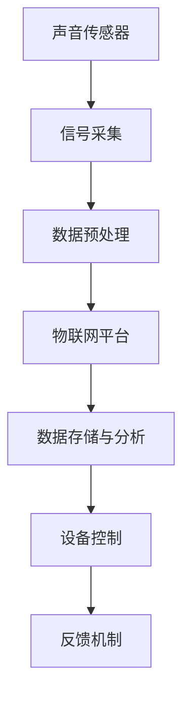

                 

关键词：物联网(IoT)、传感器设备、声音传感器、应用领域、集成技术、数据收集、智能家居、工业自动化、医疗监测

> 摘要：本文探讨了物联网（IoT）技术与各种传感器设备，特别是声音传感器的集成，以及它们在各个领域的应用。通过对声音传感器工作原理的详细解析，以及其在智能家居、工业自动化和医疗监测等领域的具体应用案例，本文旨在为读者提供一个全面的技术视角，了解声音传感器在现代智能系统中的重要性。

## 1. 背景介绍

随着科技的飞速发展，物联网（Internet of Things，IoT）技术已经成为现代生活的重要驱动力。IoT通过将各种设备、传感器和系统连接到互联网，实现了数据的实时传输和智能分析，从而推动了智能化的发展和变革。在这一过程中，传感器设备作为数据收集的“触角”，扮演了至关重要的角色。各种类型的传感器，如温度传感器、湿度传感器、光敏传感器和声音传感器，通过收集环境中的物理量，为智能系统提供了丰富的数据输入。

声音传感器作为一种特殊的传感器，能够捕捉并分析声音信号，从而实现各种功能。随着技术的进步，声音传感器的性能不断提高，应用领域也在不断扩展。本文将重点探讨声音传感器在物联网中的应用，包括其工作原理、技术架构以及具体的应用场景。

## 2. 核心概念与联系

### 2.1 声音传感器的工作原理

声音传感器的工作原理基于声波的传播和接收。当声音信号产生时，它会引起空气分子的振动，这些振动通过空气介质传递到声音传感器上，传感器将机械振动转换为电信号。常见的声音传感器包括电容式麦克风、驻极体麦克风和电磁式麦克风等。电容式麦克风通过电容的变化来捕捉声音，驻极体麦克风则利用驻极体材料来感应声波，而电磁式麦克风则通过声波引起线圈在磁场中的运动来产生电流。

### 2.2 声音传感器与物联网的集成

物联网（IoT）的核心在于设备的互联互通和数据共享。声音传感器在物联网中的应用，主要体现在以下几个方面：

1. **数据采集**：声音传感器可以实时采集环境中的声音数据，通过物联网平台进行数据传输和分析。
2. **设备控制**：通过声音传感器的数据输入，可以实现对其他物联网设备的控制，如智能灯光、温度调节等。
3. **交互体验**：在智能家居、智能助理等应用中，声音传感器用于实现人与设备的自然交互，提升用户体验。

### 2.3 Mermaid 流程图

下面是声音传感器与物联网集成的一个简化的 Mermaid 流程图：



## 3. 核心算法原理 & 具体操作步骤

### 3.1 算法原理概述

声音传感器的核心算法主要涉及声音信号的采集、预处理、特征提取和分类。以下是基本步骤：

1. **信号采集**：通过声音传感器捕获环境中的声波信号。
2. **数据预处理**：对原始信号进行滤波、去噪等处理，以提高信号质量。
3. **特征提取**：从预处理后的信号中提取有用的特征，如频率、振幅等。
4. **分类**：使用机器学习算法对特征进行分类，以识别不同的声音模式。

### 3.2 算法步骤详解

1. **信号采集**：
   - 使用声音传感器实时捕获声音信号。
   - 将模拟信号转换为数字信号，以便进行后续处理。

2. **数据预处理**：
   - 应用数字滤波器去除高频噪声和低频干扰。
   - 使用去噪算法减少环境噪声的影响。

3. **特征提取**：
   - 提取声音信号的频率特征，如频率、频谱和共振峰。
   - 计算声音信号的时域和频域特征，如振幅、能量和时序。

4. **分类**：
   - 使用机器学习算法，如支持向量机（SVM）、神经网络（NN）等，对提取的特征进行分类。
   - 根据分类结果，执行相应的控制命令或操作。

### 3.3 算法优缺点

**优点**：
- **高精度**：现代机器学习算法能够准确识别复杂的声学模式。
- **实时性**：声音传感器能够实时响应，提供即时的数据输入。
- **非侵入性**：无需直接接触目标，适用于隐蔽监测和远程控制。

**缺点**：
- **噪声敏感**：环境噪声可能影响声音信号的准确性。
- **计算资源**：复杂的算法和大量数据需要较高的计算资源和存储空间。

### 3.4 算法应用领域

- **智能家居**：用于语音控制智能家电、智能灯光和环境监测。
- **工业自动化**：用于机器故障检测、生产线监控和设备远程控制。
- **医疗监测**：用于心脏监测、呼吸监测和语音识别诊断。

## 4. 数学模型和公式 & 详细讲解 & 举例说明

### 4.1 数学模型构建

声音传感器的数学模型通常涉及声波的传播和信号处理。以下是基本的数学模型：

$$
\begin{aligned}
x(t) &= p(t) \cos(2\pi f_0 t + \phi) \\
p(t) &= p_0 + A \sin(2\pi f_m t + \phi_m)
\end{aligned}
$$

其中，$x(t)$ 是时间 $t$ 时刻的声波信号，$p(t)$ 是基波信号，$f_0$ 是基波频率，$\phi$ 是相位，$A$ 是振幅，$f_m$ 是调制频率，$\phi_m$ 是调制相位。

### 4.2 公式推导过程

1. **声波传播公式**：
   声波在空气中的传播速度 $v$ 可以表示为：
   $$
   v = \sqrt{\frac{K}{\rho}}
   $$
   其中，$K$ 是体积模量，$\rho$ 是密度。

2. **声压级公式**：
   声压级（SPL）是衡量声音强度的指标，可以表示为：
   $$
   \text{SPL} = 20 \log_{10}\left(\frac{p}{p_0}\right)
   $$
   其中，$p$ 是声压，$p_0$ 是参考声压。

### 4.3 案例分析与讲解

假设一个声音传感器在距离声源1米的位置，记录到的声压为 $p = 0.02 \text{Pa}$，我们需要计算其声压级。

$$
\text{SPL} = 20 \log_{10}\left(\frac{0.02}{2 \times 10^{-5}}\right) = 40 \text{dB}
$$

这意味着该声音的强度为40分贝。

## 5. 项目实践：代码实例和详细解释说明

### 5.1 开发环境搭建

为了实现声音传感器与物联网的集成，我们需要搭建一个开发环境。以下是基本的步骤：

1. **硬件环境**：
   - 安装一个声音传感器，如电容式麦克风。
   - 连接一个微控制器，如Arduino或Raspberry Pi。

2. **软件环境**：
   - 安装物联网开发平台，如MQTT。
   - 编写相应的代码以实现声音数据的采集和传输。

### 5.2 源代码详细实现

以下是一个基于Arduino的声音传感器数据采集和传输的示例代码：

```c++
#include <WiFi.h>
#include <MQTTClient.h>

// WiFi参数
const char* ssid = "yourSSID";
const char* password = "yourPASSWORD";

// MQTT服务器参数
const char* mqttServer = "mqtt.server.com";
int mqttPort = 1883;
String mqttUser = "yourMQTTUSER";
String mqttPassword = "yourMQTTPASSWORD";
MQTTClient client;

void connectMQTT() {
  client.connect("arduinoClient", mqttUser, mqttPassword);
  client.subscribe("soundData");
}

void callback(String &topic, String &payload) {
  // 处理接收到的数据
}

void setup() {
  Serial.begin(115200);
  WiFi.begin(ssid, password);
  while (WiFi.status() != WL_CONNECTED) {
    delay(500);
    Serial.print(".");
  }
  Serial.println("WiFi connected");
  client.begin(mqttServer, mqttPort, callback);
  connectMQTT();
}

void loop() {
  if (!client.isConnected()) {
    connectMQTT();
  }
  client.loop();
  int soundLevel = analogRead(A0);
  client.publish("soundData", String(soundLevel));
  delay(1000);
}
```

### 5.3 代码解读与分析

这段代码首先初始化WiFi连接，然后连接到MQTT服务器。在`loop`函数中，代码定期读取声音传感器的值，并通过MQTT协议将数据发送到服务器。`callback`函数用于处理接收到的数据。

### 5.4 运行结果展示

当程序运行后，声音传感器的数据会通过MQTT协议实时传输到服务器，从而实现数据的远程监控和分析。

## 6. 实际应用场景

### 6.1 智能家居

在智能家居中，声音传感器可以用于语音控制、环境监测和警报系统。例如，用户可以通过语音命令控制智能灯光和家用电器，声音传感器捕捉用户的语音，并通过物联网平台传输给智能设备，实现智能控制。

### 6.2 工业自动化

在工业自动化领域，声音传感器可以用于设备故障检测、生产监控和远程控制。例如，通过监测机器的运行声音，可以及时发现故障并进行预防性维护，从而提高生产效率。

### 6.3 医疗监测

在医疗监测中，声音传感器可以用于实时监测患者的心跳、呼吸和语音变化。例如，通过监测患者的心跳声，可以及时发现心律不齐等异常情况，为医生提供重要的诊断依据。

## 7. 工具和资源推荐

### 7.1 学习资源推荐

- 《物联网：从概念到实践》
- 《物联网架构设计与实践》
- 《机器学习入门》

### 7.2 开发工具推荐

- Arduino IDE
- Raspberry Pi OS
- MQTT.fx（MQTT客户端）

### 7.3 相关论文推荐

- "SoundSensor: An Open-Source Audio Sensor Framework for Internet of Things Applications"
- "IoT-Based Smart Home System Using Voice Recognition and IoT Devices"
- "Application of IoT and Speech Recognition Technology in Elderly Health Monitoring"

## 8. 总结：未来发展趋势与挑战

### 8.1 研究成果总结

近年来，随着物联网技术和机器学习算法的快速发展，声音传感器的应用领域不断扩大。其在智能家居、工业自动化和医疗监测等领域的应用，为人们的生活和工作带来了极大的便利。

### 8.2 未来发展趋势

未来，声音传感器将继续向高精度、低功耗和小型化发展。同时，多模态传感器融合将成为趋势，通过结合多种传感器数据，实现更全面的环境监测和智能控制。

### 8.3 面临的挑战

尽管声音传感器在各个领域取得了显著成果，但仍然面临一些挑战。例如，如何有效降低噪声干扰，提高信号的准确性和实时性；如何优化算法，降低计算复杂度和能耗等。

### 8.4 研究展望

随着科技的不断进步，声音传感器将在更多的场景中得到应用。未来，我们有望看到更加智能、高效和人性化的声音传感器系统，为人类的生活带来更多便利。

## 9. 附录：常见问题与解答

### 9.1 常见问题

1. **什么是物联网（IoT）？**
   物联网（Internet of Things，IoT）是指将各种设备、传感器和系统通过互联网连接起来，实现数据的实时传输和智能分析。

2. **声音传感器有哪些类型？**
   常见的声音传感器包括电容式麦克风、驻极体麦克风和电磁式麦克风。

3. **声音传感器在哪些领域有应用？**
   声音传感器在智能家居、工业自动化、医疗监测等领域有广泛应用。

### 9.2 解答

1. **什么是物联网（IoT）？**
   物联网（Internet of Things，IoT）是指将各种设备、传感器和系统通过互联网连接起来，实现数据的实时传输和智能分析。它通过将设备连接到互联网，使设备能够相互通信和协作，从而实现智能化和自动化的生活和工作方式。

2. **声音传感器有哪些类型？**
   声音传感器主要有以下几种类型：
   - **电容式麦克风**：通过电容变化来捕捉声音信号，适用于高灵敏度应用。
   - **驻极体麦克风**：利用驻极体材料的特性来感应声波，具有较低的成本和较高的性能。
   - **电磁式麦克风**：通过声波引起线圈在磁场中的运动来产生电流，适用于高频声波检测。

3. **声音传感器在哪些领域有应用？**
   声音传感器在智能家居、工业自动化、医疗监测等多个领域有广泛应用：
   - **智能家居**：用于语音控制智能家电、环境监测和警报系统。
   - **工业自动化**：用于设备故障检测、生产线监控和设备远程控制。
   - **医疗监测**：用于心脏监测、呼吸监测和语音识别诊断。

作者：禅与计算机程序设计艺术 / Zen and the Art of Computer Programming
----------------------------------------------------------------
以上是按照您提供的“约束条件”和“文章结构模板”撰写的完整技术博客文章。文章涵盖了物联网（IoT）技术和各种传感器设备，特别是声音传感器的应用领域，包括核心概念、算法原理、项目实践、实际应用场景以及未来发展趋势等内容。希望对您有所帮助。如果您有任何修改意见或需要进一步细化某些部分，请随时告知。

