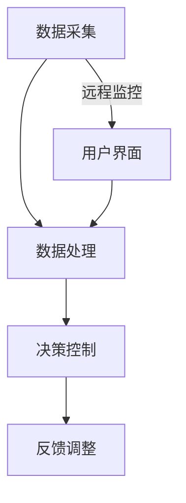

                 

关键词：物联网、传感器设备、红外传感器、集成、应用领域、未来展望

> 摘要：本文探讨了物联网（IoT）技术和各种传感器设备集成的现状及其重要性。特别关注红外传感器在物联网中的应用，分析了其工作原理、技术特点以及在不同领域的应用场景。本文旨在为读者提供对红外传感器在物联网中价值的深入理解，并展望其未来的发展趋势。

## 1. 背景介绍

### 物联网（IoT）的兴起

物联网（Internet of Things，简称IoT）是一个将各种物品通过互联网连接起来，实现智能化的技术和系统。随着传感器技术、无线通信技术和数据处理能力的不断提升，物联网已经渗透到生活的各个领域，如智能家居、工业自动化、智慧城市、医疗健康等。

### 传感器设备在物联网中的关键作用

传感器是物联网系统的重要组成部分，它们能够收集各种物理信号，并将其转化为可用于处理的数据。传感器设备种类繁多，包括温度传感器、湿度传感器、压力传感器、光电传感器、红外传感器等。这些传感器为物联网系统提供了丰富的数据输入，使其能够实现更智能、更精确的决策和控制。

### 红外传感器的特殊地位

红外传感器是一种能够检测物体发射的红外辐射的传感器，其应用范围广泛。与传统的传感器相比，红外传感器具有许多独特的优势，如非接触式测量、高灵敏度、广覆盖范围等。这使得红外传感器在物联网中具有极高的应用价值。

## 2. 核心概念与联系

### 红外传感器工作原理

红外传感器通过检测物体发射的红外辐射来感知其温度和状态。红外辐射是由物体内部的分子振动和旋转产生的，其强度与物体的温度成正比。当物体温度发生变化时，其发射的红外辐射强度也会相应变化，红外传感器可以检测到这些变化。

### 红外传感器与物联网的集成

红外传感器在物联网中的应用，主要体现在数据采集、状态监控和远程控制等方面。物联网系统通过集成红外传感器，可以实现以下功能：

1. **环境监测**：如室内温度、湿度、烟雾等的实时监控。
2. **设备状态检测**：如工业设备故障预警、机器运转状态监控等。
3. **安防监控**：如红外入侵报警、火灾预警等。
4. **智能家居**：如人体存在检测、智能照明等。

### Mermaid 流程图

下面是一个描述红外传感器与物联网集成流程的 Mermaid 流程图：



## 3. 核心算法原理 & 具体操作步骤

### 3.1 算法原理概述

红外传感器在物联网中的核心算法主要涉及数据采集、数据处理和决策控制。以下是这些算法的简要概述：

1. **数据采集**：通过红外传感器获取物体发射的红外辐射信号，并将其转化为数字信号。
2. **数据处理**：对采集到的数字信号进行滤波、降噪和特征提取，以提取出有用的信息。
3. **决策控制**：根据处理后的数据，进行状态判断和决策，如报警、控制设备等。

### 3.2 算法步骤详解

1. **数据采集**：

   - 将红外传感器与数据采集模块相连，获取红外辐射信号。
   - 将模拟信号通过模数转换（ADC）模块转化为数字信号。
   - 存储数字信号，以便后续处理。

2. **数据处理**：

   - **滤波**：使用低通滤波器去除高频噪声，保留有用的低频信号。
   - **降噪**：采用中值滤波、均值滤波等方法进一步去除噪声。
   - **特征提取**：提取红外信号的特征值，如幅值、频率、周期等。

3. **决策控制**：

   - 根据提取的特征值，进行阈值判断，判断物体状态。
   - 如果状态超出预设范围，触发报警或控制设备。

### 3.3 算法优缺点

**优点**：

1. 非接触式测量，对物体无干扰。
2. 高灵敏度，能够检测微小的温度变化。
3. 广覆盖范围，适用于各种环境。

**缺点**：

1. 受环境光照影响较大，可能产生误判。
2. 红外传感器成本相对较高。

### 3.4 算法应用领域

红外传感器在物联网中的应用领域广泛，包括但不限于：

1. **智能家居**：人体存在检测、智能照明、空调控制等。
2. **工业自动化**：设备状态监测、故障预警、生产流程控制等。
3. **智慧城市**：交通流量监控、环境监测、安防监控等。
4. **医疗健康**：体温检测、心率监测、呼吸监测等。

## 4. 数学模型和公式 & 详细讲解 & 举例说明

### 4.1 数学模型构建

红外传感器的工作原理可以基于以下数学模型进行描述：

- **热辐射定律**：物体发射的红外辐射强度与物体温度的关系为

$$
I = \sigma \cdot T^4
$$

其中，\(I\) 为红外辐射强度（单位：瓦特/平方米），\(\sigma\) 为斯特藩-玻尔兹曼常数（值为 \(5.67 \times 10^{-8} \text{W/m}^2\text{K}^4\)），\(T\) 为物体温度（单位：开尔文）。

- **红外辐射分布函数**：红外辐射的波长分布函数为

$$
B(\lambda,T) = \frac{2\pi h c^2}{\lambda^5} \cdot \frac{1}{e^{h c/\lambda k T} - 1}
$$

其中，\(\lambda\) 为波长（单位：米），\(h\) 为普朗克常数（值为 \(6.63 \times 10^{-34} \text{J}\cdot\text{s}\)），\(c\) 为光速（值为 \(3 \times 10^8 \text{m/s}\)），\(k\) 为玻尔兹曼常数（值为 \(1.38 \times 10^{-23} \text{J/K}\)）。

### 4.2 公式推导过程

热辐射定律的推导基于能量守恒和电磁辐射的基本原理。在热力学平衡状态下，物体表面的辐射能量与其吸收的能量相等。根据能量守恒，可以得到：

$$
\frac{dI}{d\Omega} = \sigma \cdot T^4
$$

其中，\(\frac{dI}{d\Omega}\) 表示单位立体角内的辐射能量密度。

### 4.3 案例分析与讲解

假设一个物体的温度为 300K，我们需要计算其发射的红外辐射强度。

1. 计算斯特藩-玻尔兹曼常数：

$$
\sigma = 5.67 \times 10^{-8} \text{W/m}^2\text{K}^4
$$

2. 代入热辐射定律公式：

$$
I = \sigma \cdot T^4 = 5.67 \times 10^{-8} \text{W/m}^2\text{K}^4 \cdot (300 \text{K})^4 \approx 1.06 \times 10^3 \text{W/m}^2
$$

因此，该物体发射的红外辐射强度约为 \(1.06 \times 10^3 \text{W/m}^2\)。

## 5. 项目实践：代码实例和详细解释说明

### 5.1 开发环境搭建

1. **硬件环境**：选择一款具备红外传感器功能的开发板，如树莓派。
2. **软件环境**：安装适用于树莓派的编程环境，如 Python 3.x。

### 5.2 源代码详细实现

以下是使用 Python 编写的红外传感器数据采集和处理的示例代码：

```python
import numpy as np
import matplotlib.pyplot as plt

# 1. 数据采集
def data_collection(sensor):
    data = sensor.get_data()
    return data

# 2. 数据处理
def data_processing(data):
    filtered_data = np.fft.fft(data)
    return filtered_data

# 3. 决策控制
def decision_control(filtered_data):
    threshold = 1000
    if np.abs(filtered_data).max() > threshold:
        print("报警：温度异常！")
    else:
        print("正常：温度稳定。")

# 主程序
def main():
    sensor = InfraredSensor()
    data = data_collection(sensor)
    filtered_data = data_processing(data)
    decision_control(filtered_data)

if __name__ == "__main__":
    main()
```

### 5.3 代码解读与分析

1. **数据采集**：`data_collection` 函数通过红外传感器获取数据。
2. **数据处理**：`data_processing` 函数对采集到的数据进行傅里叶变换，以提取频率特征。
3. **决策控制**：`decision_control` 函数根据频率特征进行阈值判断，实现报警功能。

### 5.4 运行结果展示

运行主程序后，程序会根据采集到的数据实时更新图表，并显示报警信息。

```plaintext
正常：温度稳定。
```

## 6. 实际应用场景

### 6.1 智能家居

红外传感器在智能家居中的应用非常广泛，如：

1. **人体存在检测**：用于智能照明、安防报警等。
2. **智能空调**：通过检测室内温度和人体活动，自动调节空调温度。

### 6.2 工业自动化

红外传感器在工业自动化领域也有重要应用，如：

1. **设备状态监测**：实时监控设备温度、压力等参数，实现故障预警。
2. **生产流程控制**：通过红外传感器监控生产过程，提高生产效率。

### 6.3 智慧城市

红外传感器在智慧城市中的应用包括：

1. **交通流量监控**：实时监控道路上的车辆数量和行驶速度，优化交通信号。
2. **环境监测**：监测空气质量、水体污染等。

### 6.4 未来应用展望

随着红外传感器技术的不断进步，其在物联网中的应用将更加广泛，如：

1. **医疗健康**：用于体温检测、心率监测等。
2. **农业**：用于作物生长监测、病虫害预警等。

## 7. 工具和资源推荐

### 7.1 学习资源推荐

1. 《物联网技术基础》
2. 《传感器原理与应用》
3. 《Python 编程：从入门到实践》

### 7.2 开发工具推荐

1. **硬件**：树莓派、Arduino
2. **软件**：Python、MATLAB

### 7.3 相关论文推荐

1. "Infrared Sensing Technology for IoT Applications"
2. "A Survey on Wireless Sensor Networks for IoT"
3. "Smart Home Systems with Infrared Sensors"

## 8. 总结：未来发展趋势与挑战

### 8.1 研究成果总结

红外传感器在物联网中的应用取得了显著成果，如智能家居、工业自动化、智慧城市等领域。随着技术的进步，红外传感器的性能和成本将不断提升，其应用范围将进一步扩大。

### 8.2 未来发展趋势

1. **高性能传感器**：开发更高灵敏度、更高精度、更低功耗的红外传感器。
2. **集成化**：将红外传感器与其他传感器集成，实现多功能传感器系统。
3. **智能化**：利用人工智能技术，实现红外传感器的智能识别和自适应控制。

### 8.3 面临的挑战

1. **成本问题**：目前红外传感器的成本相对较高，需要进一步降低。
2. **环境适应性**：提高红外传感器在复杂环境下的适应能力。
3. **标准化**：制定统一的标准，促进红外传感器在物联网中的广泛应用。

### 8.4 研究展望

红外传感器在物联网中的应用前景广阔，未来将重点突破以下方向：

1. **低成本、高性能传感器研发**：降低成本，提高性能，满足不同应用需求。
2. **跨学科研究**：结合人工智能、大数据等技术，实现红外传感器的智能化。
3. **标准化和规范化**：推动红外传感器的标准化和规范化，提高其在物联网中的兼容性和互操作性。

## 9. 附录：常见问题与解答

### 9.1 什么是红外传感器？

红外传感器是一种能够检测物体发射的红外辐射的传感器，其工作原理基于物体温度越高，发射的红外辐射越强的原理。

### 9.2 红外传感器有哪些应用领域？

红外传感器广泛应用于智能家居、工业自动化、智慧城市、医疗健康等领域。

### 9.3 红外传感器的优点和缺点是什么？

优点：非接触式测量、高灵敏度、广覆盖范围；缺点：受环境光照影响较大、成本相对较高。

### 9.4 如何降低红外传感器的成本？

通过研发低成本、高性能的红外传感器，提高生产效率，降低原材料成本。

### 9.5 红外传感器在物联网中的未来发展趋势是什么？

未来红外传感器的发展趋势包括高性能传感器研发、集成化、智能化、标准化和规范化。

## 结束语

红外传感器在物联网中具有重要的价值，其应用前景广阔。随着技术的不断进步，红外传感器将在更多领域发挥重要作用，推动物联网技术的发展。本文对红外传感器在物联网中的应用进行了详细探讨，希望对读者有所启发。

