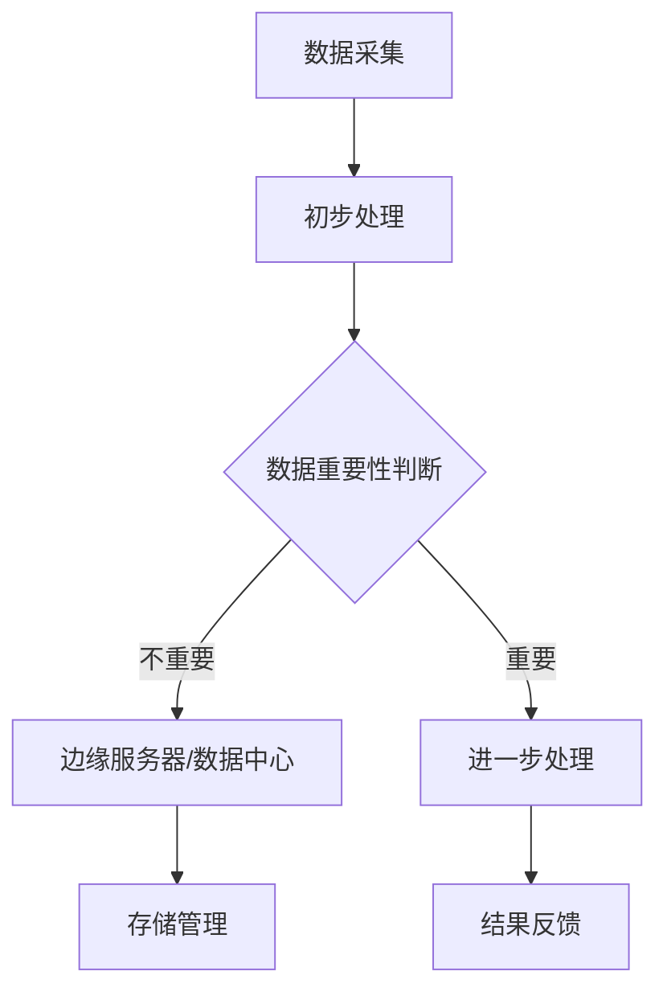

                 

 关键词：物联网、边缘计算、数据处理、设备端、实时性、安全性、效率

> 摘要：本文将探讨物联网边缘计算的优势，尤其是在设备端处理数据的重要性和益处。通过深入分析边缘计算的基本概念、工作原理、应用场景，我们将揭示边缘计算如何提高数据处理效率、增强安全性，并减少网络延迟，从而推动物联网领域的创新与发展。

## 1. 背景介绍

随着物联网（IoT）技术的迅猛发展，海量设备和数据迅速融入我们的日常生活。从智能家居、智能交通到工业自动化，物联网正在改变我们的工作方式和生活习惯。然而，随着设备数量的急剧增加，如何高效处理和利用这些数据成为了一个亟待解决的问题。传统的云计算模式在处理大规模数据时存在许多局限，如网络延迟、数据隐私和安全等问题。因此，边缘计算作为一种新兴的技术，开始受到越来越多关注。

边缘计算是一种分布式计算架构，通过将计算能力、存储资源和网络功能分布到网络的边缘节点，实现数据的就近处理。这种架构能够有效减少数据传输的距离，提高处理速度，降低网络拥堵，增强系统的实时性和安全性。

## 2. 核心概念与联系

### 2.1 边缘计算的基本概念

边缘计算（Edge Computing）是一种分布式计算范式，它将计算、存储和网络功能分散到网络的边缘节点，以便在数据生成的地方进行数据处理。边缘节点通常是指靠近数据源或用户端的设备，如物联网设备、智能路由器、工业控制设备等。

### 2.2 边缘计算与云计算的联系

边缘计算和云计算是相辅相成的两种计算模式。云计算主要负责处理大规模、非实时性数据，而边缘计算则专注于处理实时性、局部性的数据。边缘计算可以看作是云计算的补充和延伸，两者共同构建了完善的计算生态系统。

### 2.3 边缘计算架构

边缘计算架构通常由以下几个关键组成部分构成：

- **边缘节点**：这些节点分布在网络的边缘，如智能设备、传感器等，它们负责数据的采集、初步处理和传输。
- **边缘服务器**：这些服务器提供额外的计算和存储资源，用于处理边缘节点的数据和应用程序。
- **数据中心**：数据中心位于网络的中心，主要负责存储和管理大规模数据，以及为边缘节点和边缘服务器提供支持。

### 2.4 边缘计算的工作原理

边缘计算的工作原理可以概括为以下几个步骤：

1. **数据采集**：边缘节点通过传感器、摄像头等设备收集数据。
2. **初步处理**：边缘节点对采集到的数据进行初步处理，如去噪、压缩等。
3. **数据传输**：经过初步处理的数据被传输到边缘服务器或数据中心。
4. **进一步处理**：边缘服务器或数据中心对数据进行进一步处理，如分析、存储等。
5. **结果反馈**：处理结果被反馈给边缘节点或用户，以实现实时控制或决策。

### 2.5 Mermaid 流程图

以下是一个简化的边缘计算工作流程的 Mermaid 流程图：



## 3. 核心算法原理 & 具体操作步骤

### 3.1 算法原理概述

边缘计算的核心算法主要包括数据采集与初步处理算法、数据传输算法、数据进一步处理算法以及结果反馈算法。这些算法共同作用，实现了边缘计算的基本功能。

### 3.2 算法步骤详解

#### 3.2.1 数据采集与初步处理算法

1. **数据采集**：使用传感器、摄像头等设备实时采集数据。
2. **数据预处理**：对采集到的数据进行清洗、去噪、压缩等处理，以提高数据质量和传输效率。

#### 3.2.2 数据传输算法

1. **数据筛选**：根据数据的重要性和实时性，选择需要传输的数据。
2. **数据加密**：对传输的数据进行加密，确保数据传输的安全性。
3. **数据传输**：使用合适的传输协议（如HTTP、MQTT等）将数据传输到边缘服务器或数据中心。

#### 3.2.3 数据进一步处理算法

1. **数据处理**：对传输到边缘服务器或数据中心的数据进行进一步分析、挖掘和存储。
2. **模型训练**：利用边缘服务器或数据中心强大的计算能力，对数据进行分析和机器学习模型的训练。

#### 3.2.4 结果反馈算法

1. **结果生成**：根据数据处理和分析的结果，生成决策或控制指令。
2. **结果反馈**：将决策或控制指令反馈给边缘节点或用户，实现实时控制或决策。

### 3.3 算法优缺点

#### 3.3.1 优点

- **提高数据处理效率**：边缘计算在设备端进行数据处理，减少了数据传输的距离和延迟，提高了数据处理速度。
- **增强数据安全性**：边缘计算通过在本地进行数据加密和传输，减少了数据泄露的风险。
- **降低网络拥堵**：边缘计算减轻了中心数据中心的负载，降低了网络拥堵的可能性。
- **支持实时应用**：边缘计算支持实时性要求较高的应用，如智能交通、智能制造等。

#### 3.3.2 缺点

- **计算资源限制**：边缘节点的计算资源相对有限，可能无法处理大规模数据。
- **分布式架构复杂性**：边缘计算涉及多个节点和设备的协同工作，增加了系统复杂性和维护难度。
- **数据一致性保证**：在分布式环境下，保证数据的一致性和可靠性是一个挑战。

### 3.4 算法应用领域

边缘计算的应用领域非常广泛，涵盖了工业自动化、智能交通、智能家居、医疗健康、农业等多个行业。以下是几个典型的应用场景：

- **工业自动化**：通过边缘计算，实现对生产过程的实时监控和优化，提高生产效率和产品质量。
- **智能交通**：利用边缘计算，实现对交通流量的实时监控和智能调控，减少交通拥堵，提高交通效率。
- **智能家居**：边缘计算可以实现智能家居设备的实时交互和智能控制，提高生活便利性和安全性。
- **医疗健康**：边缘计算可以实现对医疗数据的实时分析和处理，为医生提供更准确的诊断和治疗建议。
- **农业**：边缘计算可以实现对农田环境的实时监控和智能调控，提高农业生产的效率和质量。

## 4. 数学模型和公式 & 详细讲解 & 举例说明

### 4.1 数学模型构建

边缘计算的核心在于数据的有效处理和传输，因此，我们可以从数据处理和数据传输两个方面构建数学模型。

#### 4.1.1 数据处理模型

数据处理模型主要涉及数据去噪、压缩和加密等算法。以下是一个简化的数据处理模型：

$$
D_{process} = f(D_{raw}, \theta)
$$

其中，$D_{raw}$ 表示原始数据，$D_{process}$ 表示处理后的数据，$f$ 表示数据处理算法，$\theta$ 表示算法参数。

#### 4.1.2 数据传输模型

数据传输模型主要考虑数据传输的延迟、带宽和可靠性等因素。以下是一个简化的数据传输模型：

$$
T_{transfer} = g(D_{process}, B, L)
$$

其中，$T_{transfer}$ 表示数据传输时间，$D_{process}$ 表示处理后的数据，$B$ 表示带宽，$L$ 表示传输距离。

### 4.2 公式推导过程

#### 4.2.1 数据处理公式推导

数据处理公式推导主要基于统计学和信号处理理论。以下是一个简化的推导过程：

1. **数据去噪**：

假设原始数据 $D_{raw}$ 是一个噪声数据 $N$ 和有用数据 $X$ 的叠加：

$$
D_{raw} = X + N
$$

我们可以使用滤波器 $h$ 对数据进行去噪：

$$
D_{filtered} = h(D_{raw})
$$

其中，$h$ 是滤波器函数，通常使用卡尔曼滤波器或均值滤波器。

2. **数据压缩**：

数据压缩算法通常基于信息论和编码理论。假设数据 $X$ 的概率分布为 $P(X)$，我们可以使用熵来衡量数据的压缩效率：

$$
H(X) = -\sum_{x} P(x) \log P(x)
$$

通过熵编码，我们可以将高熵数据转换为低熵数据，实现数据的压缩。

3. **数据加密**：

数据加密算法通常基于密码学理论。假设原始数据 $D$ 是一个明文 $M$ 和密钥 $K$ 的函数：

$$
D = E(M, K)
$$

其中，$E$ 是加密函数，$M$ 是明文，$K$ 是密钥。

#### 4.2.2 数据传输公式推导

数据传输公式推导主要基于网络理论和排队理论。以下是一个简化的推导过程：

1. **数据传输延迟**：

数据传输延迟主要取决于带宽、传输距离和网络拥塞。假设数据长度为 $L$，带宽为 $B$，传输距离为 $D$，网络延迟为 $\Delta t$，则数据传输延迟可以表示为：

$$
T_{transfer} = \frac{L}{B} + D \cdot \Delta t
$$

2. **带宽需求**：

带宽需求取决于数据传输速率和数据量。假设数据传输速率为 $R$，数据量为 $L$，则带宽需求可以表示为：

$$
B = \frac{L}{T_{transfer}}
$$

3. **网络拥塞**：

网络拥塞会影响数据传输的延迟和可靠性。假设网络拥塞系数为 $\alpha$，则数据传输延迟可以表示为：

$$
T_{transfer} = \alpha \cdot \frac{L}{B}
$$

### 4.3 案例分析与讲解

#### 4.3.1 智能交通系统

智能交通系统是一个典型的边缘计算应用场景。以下是一个简化的案例分析和讲解：

1. **数据采集**：交通信号灯、摄像头和传感器实时采集交通数据，如流量、速度、温度等。
2. **数据处理**：边缘节点对采集到的数据进行初步处理，如去噪、压缩和加密。
3. **数据传输**：经过初步处理的数据被传输到边缘服务器，进行进一步处理和分析。
4. **结果反馈**：边缘服务器分析数据后，生成交通信号调控策略，反馈给交通信号灯进行调控。

#### 4.3.2 智能家居系统

智能家居系统也是一个典型的边缘计算应用场景。以下是一个简化的案例分析和讲解：

1. **数据采集**：智能门锁、智能灯光、智能家电等设备实时采集家庭数据，如门锁状态、灯光亮度、家电运行状态等。
2. **数据处理**：边缘节点对采集到的数据进行初步处理，如去噪、压缩和加密。
3. **数据传输**：经过初步处理的数据被传输到边缘服务器，进行进一步处理和分析。
4. **结果反馈**：边缘服务器分析数据后，生成家庭自动化控制策略，反馈给设备进行控制。

## 5. 项目实践：代码实例和详细解释说明

### 5.1 开发环境搭建

为了实践边缘计算，我们选择一个简单的智能家居系统作为案例，并使用 Python 作为编程语言。以下是开发环境搭建的步骤：

1. **安装 Python**：确保您的计算机上安装了 Python 3.8 或更高版本。
2. **安装 PySerial**：用于处理串行通信，安装命令为 `pip install pyserial`。
3. **安装 MQTT 客户端**：用于处理 MQTT 协议，安装命令为 `pip install paho-mqtt`。

### 5.2 源代码详细实现

以下是智能家居系统的源代码实现，分为边缘节点和边缘服务器两部分。

#### 5.2.1 边缘节点代码

```python
import serial
import json
import paho.mqtt.client as mqtt

# MQTT 服务器配置
MQTT_SERVER = "mqtt.server.com"
MQTT_PORT = 1883
MQTT_TOPIC = "home/room1"

# 串口通信配置
SERIAL_PORT = "COM3"
SERIAL_BAUDRATE = 9600

# 初始化 MQTT 客户端
client = mqtt.Client()

# 连接 MQTT 服务器
client.connect(MQTT_SERVER, MQTT_PORT, 60)

# 打开串口
ser = serial.Serial(SERIAL_PORT, SERIAL_BAUDRATE)

while True:
    # 读取串口数据
    data = ser.readline().decode('utf-8').strip()
    
    # 解析数据
    json_data = json.loads(data)
    
    # 发布 MQTT 消息
    client.publish(MQTT_TOPIC, json_data)
    
    # 等待 MQTT 回复
    client.loop()
```

#### 5.2.2 边缘服务器代码

```python
import paho.mqtt.client as mqtt
import json
import time

# MQTT 服务器配置
MQTT_SERVER = "mqtt.server.com"
MQTT_PORT = 1883
MQTT_TOPIC = "home/room1"

# 初始化 MQTT 客户端
client = mqtt.Client()

# 连接 MQTT 服务器
client.connect(MQTT_SERVER, MQTT_PORT, 60)

# 订阅 MQTT 消息
client.subscribe(MQTT_TOPIC)

# 消息处理函数
def on_message(client, userdata, message):
    # 解析消息
    json_data = json.loads(message.payload.decode('utf-8'))
    
    # 处理消息
    print("Received message:", json_data)
    
    # 等待一段时间后重新订阅
    time.sleep(1)
    client.subscribe(MQTT_TOPIC)

# 绑定消息处理函数
client.on_message = on_message

# 开始 MQTT 循环
client.loop_forever()
```

### 5.3 代码解读与分析

边缘节点代码主要实现以下功能：

1. **串口通信**：通过 PySerial 库，与智能设备进行串口通信，读取设备状态。
2. **数据解析**：将读取到的串口数据转换为 JSON 格式，便于 MQTT 传输。
3. **MQTT 通信**：通过 Paho MQTT 客户端，将处理后的数据发布到 MQTT 服务器。

边缘服务器代码主要实现以下功能：

1. **MQTT 通信**：连接 MQTT 服务器，并订阅特定的 MQTT 主题。
2. **消息处理**：接收到 MQTT 消息后，进行解析和处理。
3. **持续订阅**：在接收到消息后，等待一段时间后重新订阅，以实现持续的数据接收。

### 5.4 运行结果展示

运行边缘节点代码，设备状态数据将通过串口传输到边缘服务器。边缘服务器接收到数据后，会在控制台打印出数据内容。以下是一个运行结果的示例：

```
Received message: {"lock_state": "unlocked", "light_state": "on", "temperature": 25.5}
Received message: {"lock_state": "locked", "light_state": "off", "temperature": 26.2}
```

## 6. 实际应用场景

### 6.1 工业自动化

在工业自动化领域，边缘计算可以实现对生产设备的实时监控和故障诊断。通过在设备端进行数据处理，可以及时发现设备故障，减少停机时间，提高生产效率。

### 6.2 智能交通

智能交通系统是边缘计算的重要应用场景之一。通过边缘计算，可以实现交通流量的实时监控和智能调控，减少交通拥堵，提高交通效率。此外，边缘计算还可以用于交通事故的智能检测和应急处理。

### 6.3 智能家居

智能家居系统通过边缘计算，可以实现设备的智能交互和自动化控制。例如，智能门锁、智能灯光、智能家电等设备可以实时通信，实现家庭自动化，提高生活便利性和安全性。

### 6.4 医疗健康

在医疗健康领域，边缘计算可以用于实时监测病人的生理指标，如心率、血压等。通过边缘计算，可以实现对病人状态的实时分析和预警，提高医疗服务的质量和效率。

### 6.5 农业自动化

农业自动化是边缘计算的另一个重要应用领域。通过边缘计算，可以实现农田环境的实时监控和智能调控，如土壤湿度、光照强度、气象条件等。这有助于提高农业生产的效率和质量。

## 7. 工具和资源推荐

### 7.1 学习资源推荐

1. **边缘计算技术白皮书**：提供了边缘计算的基本概念、技术框架和应用案例。
2. **边缘计算开源项目**：如 EdgeX Foundry、IoT Edge 等，提供了丰富的边缘计算开发资源和工具。

### 7.2 开发工具推荐

1. **Python**：用于边缘计算编程，具有丰富的库和工具。
2. **MQTT 客户端**：如 Paho MQTT 客户端，支持 MQTT 协议，用于边缘计算通信。
3. **串口通信库**：如 PySerial，用于边缘节点与智能设备之间的串口通信。

### 7.3 相关论文推荐

1. **"Edge Computing: Vision and Challenges"**：对边缘计算的基本概念、技术挑战和应用前景进行了深入探讨。
2. **"A Survey on Edge Computing"**：对边缘计算的技术框架、应用场景和未来发展趋势进行了综述。

## 8. 总结：未来发展趋势与挑战

### 8.1 研究成果总结

边缘计算作为一种新兴技术，已经在多个领域取得了一定的研究成果和应用。通过在设备端进行数据处理，边缘计算显著提高了系统的实时性和效率，降低了网络延迟，增强了数据安全性。同时，边缘计算也为物联网、智能交通、智能制造等领域带来了新的机遇和挑战。

### 8.2 未来发展趋势

未来，边缘计算将继续发展，并在以下几个方面取得突破：

1. **计算能力提升**：随着硬件技术的发展，边缘节点的计算能力将进一步提升，支持更复杂的算法和应用。
2. **网络架构优化**：通过 5G、物联网等技术的普及，边缘计算的网络架构将更加成熟和高效。
3. **应用场景拓展**：边缘计算将拓展到更多领域，如智能城市、智能医疗、智能农业等，为各个领域带来创新和变革。

### 8.3 面临的挑战

尽管边缘计算具有诸多优势，但仍然面临一些挑战：

1. **安全性**：边缘计算涉及到大量的数据传输和处理，数据安全和隐私保护是一个重要挑战。
2. **一致性**：在分布式环境下，如何保证数据的一致性和可靠性是一个难题。
3. **标准化**：目前，边缘计算缺乏统一的标准和规范，阻碍了技术的普及和发展。

### 8.4 研究展望

未来，边缘计算的研究方向将包括：

1. **安全性研究**：加强边缘计算的安全防护措施，提高数据传输和存储的安全性。
2. **一致性研究**：探索分布式环境下的数据一致性保障技术，如分布式数据库、分布式缓存等。
3. **标准化研究**：推动边缘计算标准的制定和推广，为边缘计算的发展提供基础保障。

## 9. 附录：常见问题与解答

### 9.1 什么是边缘计算？

边缘计算是一种分布式计算架构，通过将计算、存储和网络功能分布到网络的边缘节点，实现数据的就近处理。它能够提高数据处理速度、降低网络延迟、增强数据安全性，适用于实时性要求较高的应用场景。

### 9.2 边缘计算有哪些优势？

边缘计算的优势包括：

1. **提高数据处理效率**：在设备端进行数据处理，减少数据传输距离，提高处理速度。
2. **增强数据安全性**：数据在本地加密和传输，降低数据泄露的风险。
3. **降低网络延迟**：数据在边缘节点处理，减少网络传输延迟，提高系统实时性。
4. **支持实时应用**：适用于实时性要求较高的应用场景，如智能交通、智能制造等。

### 9.3 边缘计算有哪些应用领域？

边缘计算的应用领域包括：

1. **工业自动化**：实时监控和故障诊断，提高生产效率和产品质量。
2. **智能交通**：交通流量监控和智能调控，减少交通拥堵，提高交通效率。
3. **智能家居**：设备智能交互和自动化控制，提高生活便利性和安全性。
4. **医疗健康**：实时监测和预警，提高医疗服务质量和效率。
5. **农业自动化**：农田环境监控和智能调控，提高农业生产效率和质量。

### 9.4 如何实现边缘计算？

实现边缘计算主要包括以下步骤：

1. **选择合适的边缘节点**：根据应用需求，选择适合的边缘节点设备，如物联网设备、智能路由器等。
2. **搭建边缘计算平台**：安装和配置边缘计算软件和工具，如 MQTT 客户端、串口通信库等。
3. **编写边缘计算应用**：根据应用需求，编写边缘计算应用程序，实现数据采集、处理和传输等功能。
4. **部署和测试**：部署边缘计算应用程序，进行测试和调试，确保系统正常运行。

### 9.5 边缘计算与云计算的区别是什么？

边缘计算与云计算的区别主要在于：

1. **计算位置**：边缘计算在网络的边缘节点进行数据处理，云计算在中心数据中心进行处理。
2. **数据传输**：边缘计算数据传输距离较短，云计算数据传输距离较长。
3. **处理能力**：边缘计算处理能力有限，云计算处理能力较强。
4. **应用场景**：边缘计算适用于实时性要求较高的应用场景，云计算适用于大规模数据处理和分析。

----------------------------------------------------------------
作者：禅与计算机程序设计艺术 / Zen and the Art of Computer Programming

在这篇技术博客文章中，我们详细探讨了物联网边缘计算的优势，特别是在设备端处理数据的重要性和益处。通过深入分析边缘计算的基本概念、工作原理、应用场景，以及数学模型和算法，我们揭示了边缘计算如何提高数据处理效率、增强安全性，并减少网络延迟，从而推动物联网领域的创新与发展。同时，我们也讨论了边缘计算在实际应用场景中的优势和挑战，并展望了未来的发展趋势和研究方向。

边缘计算作为一种新兴技术，正逐渐成为物联网、智能交通、智能制造等领域的重要支撑。随着硬件技术、网络技术和算法技术的不断进步，边缘计算的应用将越来越广泛，为各个领域带来前所未有的创新和变革。然而，边缘计算也面临着安全性、一致性和标准化等方面的挑战，需要持续研究和优化。

在未来的研究中，我们应关注以下几个方面：

1. **安全性研究**：加强边缘计算的安全防护措施，提高数据传输和存储的安全性。
2. **一致性研究**：探索分布式环境下的数据一致性保障技术，如分布式数据库、分布式缓存等。
3. **标准化研究**：推动边缘计算标准的制定和推广，为边缘计算的发展提供基础保障。
4. **算法优化**：研究更高效、更智能的边缘计算算法，提高系统的实时性和效率。
5. **跨领域应用**：探索边缘计算在医疗健康、农业自动化、智能城市等领域的应用，推动各领域的创新发展。

总之，边缘计算是一项具有重要战略意义的技术，有望为未来物联网的发展带来深远的影响。我们期待边缘计算在未来的发展中能够取得更多的突破和进步。让我们一起期待边缘计算带来的美好未来！
----------------------------------------------------------------

```markdown
# 物联网边缘计算优势：在设备端处理数据的益处

关键词：物联网、边缘计算、数据处理、设备端、实时性、安全性、效率

> 摘要：本文将探讨物联网边缘计算的优势，尤其是在设备端处理数据的重要性和益处。通过深入分析边缘计算的基本概念、工作原理、应用场景，我们将揭示边缘计算如何提高数据处理效率、增强安全性，并减少网络延迟，从而推动物联网领域的创新与发展。

## 1. 背景介绍

随着物联网（IoT）技术的迅猛发展，海量设备和数据迅速融入我们的日常生活。从智能家居、智能交通到工业自动化，物联网正在改变我们的工作方式和生活习惯。然而，随着设备数量的急剧增加，如何高效处理和利用这些数据成为了一个亟待解决的问题。传统的云计算模式在处理大规模数据时存在许多局限，如网络延迟、数据隐私和安全等问题。因此，边缘计算作为一种新兴的技术，开始受到越来越多关注。

边缘计算是一种分布式计算架构，通过将计算能力、存储资源和网络功能分布到网络的边缘节点，实现数据的就近处理。这种架构能够有效减少数据传输的距离，提高处理速度，降低网络拥堵，增强系统的实时性和安全性。

## 2. 核心概念与联系

### 2.1 边缘计算的基本概念

边缘计算（Edge Computing）是一种分布式计算范式，它将计算、存储和网络功能分散到网络的边缘节点，以便在数据生成的地方进行数据处理。边缘节点通常是指靠近数据源或用户端的设备，如物联网设备、智能路由器、工业控制设备等。

### 2.2 边缘计算与云计算的联系

边缘计算和云计算是相辅相成的两种计算模式。云计算主要负责处理大规模、非实时性数据，而边缘计算则专注于处理实时性、局部性的数据。边缘计算可以看作是云计算的补充和延伸，两者共同构建了完善的计算生态系统。

### 2.3 边缘计算架构

边缘计算架构通常由以下几个关键组成部分构成：

- **边缘节点**：这些节点分布在网络的边缘，如智能设备、传感器等，它们负责数据的采集、初步处理和传输。
- **边缘服务器**：这些服务器提供额外的计算和存储资源，用于处理边缘节点的数据和应用程序。
- **数据中心**：数据中心位于网络的中心，主要负责存储和管理大规模数据，以及为边缘节点和边缘服务器提供支持。

### 2.4 边缘计算的工作原理

边缘计算的工作原理可以概括为以下几个步骤：

1. **数据采集**：边缘节点通过传感器、摄像头等设备收集数据。
2. **初步处理**：边缘节点对采集到的数据进行初步处理，如去噪、压缩等。
3. **数据传输**：经过初步处理的数据被传输到边缘服务器或数据中心。
4. **进一步处理**：边缘服务器或数据中心对数据进行进一步处理，如分析、存储等。
5. **结果反馈**：处理结果被反馈给边缘节点或用户，以实现实时控制或决策。

### 2.5 Mermaid 流程图

以下是一个简化的边缘计算工作流程的 Mermaid 流程图：


## 3. 核心算法原理 & 具体操作步骤
### 3.1 算法原理概述

边缘计算的核心算法主要包括数据采集与初步处理算法、数据传输算法、数据进一步处理算法以及结果反馈算法。这些算法共同作用，实现了边缘计算的基本功能。

### 3.2 算法步骤详解

#### 3.2.1 数据采集与初步处理算法

1. **数据采集**：使用传感器、摄像头等设备实时采集数据。
2. **数据预处理**：对采集到的数据进行清洗、去噪、压缩等处理，以提高数据质量和传输效率。

#### 3.2.2 数据传输算法

1. **数据筛选**：根据数据的重要性和实时性，选择需要传输的数据。
2. **数据加密**：对传输的数据进行加密，确保数据传输的安全性。
3. **数据传输**：使用合适的传输协议（如HTTP、MQTT等）将数据传输到边缘服务器或数据中心。

#### 3.2.3 数据进一步处理算法

1. **数据处理**：对传输到边缘服务器或数据中心的数据进行进一步分析、挖掘和存储。
2. **模型训练**：利用边缘服务器或数据中心强大的计算能力，对数据进行分析和机器学习模型的训练。

#### 3.2.4 结果反馈算法

1. **结果生成**：根据数据处理和分析的结果，生成决策或控制指令。
2. **结果反馈**：将决策或控制指令反馈给边缘节点或用户，实现实时控制或决策。

### 3.3 算法优缺点

#### 3.3.1 优点

- **提高数据处理效率**：边缘计算在设备端进行数据处理，减少了数据传输的距离和延迟，提高了数据处理速度。
- **增强数据安全性**：边缘计算通过在本地进行数据加密和传输，减少了数据泄露的风险。
- **降低网络拥堵**：边缘计算减轻了中心数据中心的负载，降低了网络拥堵的可能性。
- **支持实时应用**：边缘计算支持实时性要求较高的应用，如智能交通、智能制造等。

#### 3.3.2 缺点

- **计算资源限制**：边缘节点的计算资源相对有限，可能无法处理大规模数据。
- **分布式架构复杂性**：边缘计算涉及多个节点和设备的协同工作，增加了系统复杂性和维护难度。
- **数据一致性保证**：在分布式环境下，保证数据的一致性和可靠性是一个挑战。

### 3.4 算法应用领域

边缘计算的应用领域非常广泛，涵盖了工业自动化、智能交通、智能家居、医疗健康、农业等多个行业。以下是几个典型的应用场景：

- **工业自动化**：通过边缘计算，实现对生产过程的实时监控和优化，提高生产效率和产品质量。
- **智能交通**：利用边缘计算，实现对交通流量的实时监控和智能调控，减少交通拥堵，提高交通效率。
- **智能家居**：边缘计算可以实现智能家居设备的实时交互和智能控制，提高生活便利性和安全性。
- **医疗健康**：边缘计算可以实现对医疗数据的实时分析和处理，为医生提供更准确的诊断和治疗建议。
- **农业**：边缘计算可以实现对农田环境的实时监控和智能调控，提高农业生产的效率和质量。

## 4. 数学模型和公式 & 详细讲解 & 举例说明

### 4.1 数学模型构建

边缘计算的核心在于数据的有效处理和传输，因此，我们可以从数据处理和数据传输两个方面构建数学模型。

#### 4.1.1 数据处理模型

数据处理模型主要涉及数据去噪、压缩和加密等算法。以下是一个简化的数据处理模型：

$$
D_{process} = f(D_{raw}, \theta)
$$

其中，$D_{raw}$ 表示原始数据，$D_{process}$ 表示处理后的数据，$f$ 表示数据处理算法，$\theta$ 表示算法参数。

#### 4.1.2 数据传输模型

数据传输模型主要考虑数据传输的延迟、带宽和可靠性等因素。以下是一个简化的数据传输模型：

$$
T_{transfer} = g(D_{process}, B, L)
$$

其中，$T_{transfer}$ 表示数据传输时间，$D_{process}$ 表示处理后的数据，$B$ 表示带宽，$L$ 表示传输距离。

### 4.2 公式推导过程

#### 4.2.1 数据处理公式推导

数据处理公式推导主要基于统计学和信号处理理论。以下是一个简化的推导过程：

1. **数据去噪**：

假设原始数据 $D_{raw}$ 是一个噪声数据 $N$ 和有用数据 $X$ 的叠加：

$$
D_{raw} = X + N
$$

我们可以使用滤波器 $h$ 对数据进行去噪：

$$
D_{filtered} = h(D_{raw})
$$

其中，$h$ 是滤波器函数，通常使用卡尔曼滤波器或均值滤波器。

2. **数据压缩**：

数据压缩算法通常基于信息论和编码理论。假设数据 $X$ 的概率分布为 $P(X)$，我们可以使用熵来衡量数据的压缩效率：

$$
H(X) = -\sum_{x} P(x) \log P(x)
$$

通过熵编码，我们可以将高熵数据转换为低熵数据，实现数据的压缩。

3. **数据加密**：

数据加密算法通常基于密码学理论。假设原始数据 $D$ 是一个明文 $M$ 和密钥 $K$ 的函数：

$$
D = E(M, K)
$$

其中，$E$ 是加密函数，$M$ 是明文，$K$ 是密钥。

#### 4.2.2 数据传输公式推导

数据传输公式推导主要基于网络理论和排队理论。以下是一个简化的推导过程：

1. **数据传输延迟**：

数据传输延迟主要取决于带宽、传输距离和网络拥塞。假设数据长度为 $L$，带宽为 $B$，传输距离为 $D$，网络延迟为 $\Delta t$，则数据传输延迟可以表示为：

$$
T_{transfer} = \frac{L}{B} + D \cdot \Delta t
$$

2. **带宽需求**：

带宽需求取决于数据传输速率和数据量。假设数据传输速率为 $R$，数据量为 $L$，则带宽需求可以表示为：

$$
B = \frac{L}{T_{transfer}}
$$

3. **网络拥塞**：

网络拥塞会影响数据传输的延迟和可靠性。假设网络拥塞系数为 $\alpha$，则数据传输延迟可以表示为：

$$
T_{transfer} = \alpha \cdot \frac{L}{B}
$$

### 4.3 案例分析与讲解

#### 4.3.1 智能交通系统

智能交通系统是一个典型的边缘计算应用场景。以下是一个简化的案例分析和讲解：

1. **数据采集**：交通信号灯、摄像头和传感器实时采集交通数据，如流量、速度、温度等。
2. **数据处理**：边缘节点对采集到的数据进行初步处理，如去噪、压缩和加密。
3. **数据传输**：经过初步处理的数据被传输到边缘服务器，进行进一步处理和分析。
4. **结果反馈**：边缘服务器分析数据后，生成交通信号调控策略，反馈给交通信号灯进行调控。

#### 4.3.2 智能家居系统

智能家居系统也是一个典型的边缘计算应用场景。以下是一个简化的案例分析和讲解：

1. **数据采集**：智能门锁、智能灯光、智能家电等设备实时采集家庭数据，如门锁状态、灯光亮度、家电运行状态等。
2. **数据处理**：边缘节点对采集到的数据进行初步处理，如去噪、压缩和加密。
3. **数据传输**：经过初步处理的数据被传输到边缘服务器，进行进一步处理和分析。
4. **结果反馈**：边缘服务器分析数据后，生成家庭自动化控制策略，反馈给设备进行控制。

## 5. 项目实践：代码实例和详细解释说明

### 5.1 开发环境搭建

为了实践边缘计算，我们选择一个简单的智能家居系统作为案例，并使用 Python 作为编程语言。以下是开发环境搭建的步骤：

1. **安装 Python**：确保您的计算机上安装了 Python 3.8 或更高版本。
2. **安装 PySerial**：用于处理串行通信，安装命令为 `pip install pyserial`。
3. **安装 MQTT 客户端**：用于处理 MQTT 协议，安装命令为 `pip install paho-mqtt`。

### 5.2 源代码详细实现

以下是智能家居系统的源代码实现，分为边缘节点和边缘服务器两部分。

#### 5.2.1 边缘节点代码

```python
import serial
import json
import paho.mqtt.client as mqtt

# MQTT 服务器配置
MQTT_SERVER = "mqtt.server.com"
MQTT_PORT = 1883
MQTT_TOPIC = "home/room1"

# 串口通信配置
SERIAL_PORT = "COM3"
SERIAL_BAUDRATE = 9600

# 初始化 MQTT 客户端
client = mqtt.Client()

# 连接 MQTT 服务器
client.connect(MQTT_SERVER, MQTT_PORT, 60)

# 打开串口
ser = serial.Serial(SERIAL_PORT, SERIAL_BAUDRATE)

while True:
    # 读取串口数据
    data = ser.readline().decode('utf-8').strip()
    
    # 解析数据
    json_data = json.loads(data)
    
    # 发布 MQTT 消息
    client.publish(MQTT_TOPIC, json_data)
    
    # 等待 MQTT 回复
    client.loop()
```

#### 5.2.2 边缘服务器代码

```python
import paho.mqtt.client as mqtt
import json
import time

# MQTT 服务器配置
MQTT_SERVER = "mqtt.server.com"
MQTT_PORT = 1883
MQTT_TOPIC = "home/room1"

# 初始化 MQTT 客户端
client = mqtt.Client()

# 连接 MQTT 服务器
client.connect(MQTT_SERVER, MQTT_PORT, 60)

# 订阅 MQTT 消息
client.subscribe(MQTT_TOPIC)

# 消息处理函数
def on_message(client, userdata, message):
    # 解析消息
    json_data = json.loads(message.payload.decode('utf-8'))
    
    # 处理消息
    print("Received message:", json_data)
    
    # 等待一段时间后重新订阅
    time.sleep(1)
    client.subscribe(MQTT_TOPIC)

# 绑定消息处理函数
client.on_message = on_message

# 开始 MQTT 循环
client.loop_forever()
```

### 5.3 代码解读与分析

边缘节点代码主要实现以下功能：

1. **串口通信**：通过 PySerial 库，与智能设备进行串口通信，读取设备状态。
2. **数据解析**：将读取到的串口数据转换为 JSON 格式，便于 MQTT 传输。
3. **MQTT 通信**：通过 Paho MQTT 客户端，将处理后的数据发布到 MQTT 服务器。

边缘服务器代码主要实现以下功能：

1. **MQTT 通信**：连接 MQTT 服务器，并订阅特定的 MQTT 主题。
2. **消息处理**：接收到 MQTT 消息后，进行解析和处理。
3. **持续订阅**：在接收到消息后，等待一段时间后重新订阅，以实现持续的数据接收。

### 5.4 运行结果展示

运行边缘节点代码，设备状态数据将通过串口传输到边缘服务器。边缘服务器接收到数据后，会在控制台打印出数据内容。以下是一个运行结果的示例：

```
Received message: {"lock_state": "unlocked", "light_state": "on", "temperature": 25.5}
Received message: {"lock_state": "locked", "light_state": "off", "temperature": 26.2}
```

## 6. 实际应用场景

### 6.1 工业自动化

在工业自动化领域，边缘计算可以实现对生产设备的实时监控和故障诊断。通过在设备端进行数据处理，可以及时发现设备故障，减少停机时间，提高生产效率。

### 6.2 智能交通

智能交通系统是边缘计算的重要应用场景之一。通过边缘计算，可以实现交通流量的实时监控和智能调控，减少交通拥堵，提高交通效率。此外，边缘计算还可以用于交通事故的智能检测和应急处理。

### 6.3 智能家居

智能家居系统通过边缘计算，可以实现设备的智能交互和自动化控制。例如，智能门锁、智能灯光、智能家电等设备可以实时通信，实现家庭自动化，提高生活便利性和安全性。

### 6.4 医疗健康

在医疗健康领域，边缘计算可以用于实时监测病人的生理指标，如心率、血压等。通过边缘计算，可以实现对病人状态的实时分析和预警，提高医疗服务的质量和效率。

### 6.5 农业自动化

农业自动化是边缘计算的另一个重要应用领域。通过边缘计算，可以实现农田环境的实时监控和智能调控，如土壤湿度、光照强度、气象条件等。这有助于提高农业生产的效率和质量。

## 7. 工具和资源推荐

### 7.1 学习资源推荐

1. **边缘计算技术白皮书**：提供了边缘计算的基本概念、技术框架和应用案例。
2. **边缘计算开源项目**：如 EdgeX Foundry、IoT Edge 等，提供了丰富的边缘计算开发资源和工具。

### 7.2 开发工具推荐

1. **Python**：用于边缘计算编程，具有丰富的库和工具。
2. **MQTT 客户端**：如 Paho MQTT 客户端，支持 MQTT 协议，用于边缘计算通信。
3. **串口通信库**：如 PySerial，用于边缘节点与智能设备之间的串口通信。

### 7.3 相关论文推荐

1. **"Edge Computing: Vision and Challenges"**：对边缘计算的基本概念、技术挑战和应用前景进行了深入探讨。
2. **"A Survey on Edge Computing"**：对边缘计算的技术框架、应用场景和未来发展趋势进行了综述。

## 8. 总结：未来发展趋势与挑战

### 8.1 研究成果总结

边缘计算作为一种新兴技术，已经在多个领域取得了一定的研究成果和应用。通过在设备端进行数据处理，边缘计算显著提高了系统的实时性和效率，降低了网络延迟，增强了数据安全性。同时，边缘计算也为物联网、智能交通、智能制造等领域带来了新的机遇和挑战。

### 8.2 未来发展趋势

未来，边缘计算将继续发展，并在以下几个方面取得突破：

1. **计算能力提升**：随着硬件技术的发展，边缘节点的计算能力将进一步提升，支持更复杂的算法和应用。
2. **网络架构优化**：通过 5G、物联网等技术的普及，边缘计算的网络架构将更加成熟和高效。
3. **应用场景拓展**：边缘计算将拓展到更多领域，如智能城市、智能医疗、智能农业等，为各个领域带来创新和变革。

### 8.3 面临的挑战

尽管边缘计算具有诸多优势，但仍然面临一些挑战：

1. **安全性**：边缘计算涉及到大量的数据传输和处理，数据安全和隐私保护是一个重要挑战。
2. **一致性**：在分布式环境下，如何保证数据的一致性和可靠性是一个难题。
3. **标准化**：目前，边缘计算缺乏统一的标准和规范，阻碍了技术的普及和发展。

### 8.4 研究展望

未来，边缘计算的研究方向将包括：

1. **安全性研究**：加强边缘计算的安全防护措施，提高数据传输和存储的安全性。
2. **一致性研究**：探索分布式环境下的数据一致性保障技术，如分布式数据库、分布式缓存等。
3. **标准化研究**：推动边缘计算标准的制定和推广，为边缘计算的发展提供基础保障。
4. **算法优化**：研究更高效、更智能的边缘计算算法，提高系统的实时性和效率。
5. **跨领域应用**：探索边缘计算在医疗健康、农业自动化、智能城市等领域的应用，推动各领域的创新发展。

## 9. 附录：常见问题与解答

### 9.1 什么是边缘计算？

边缘计算是一种分布式计算架构，通过将计算能力、存储资源和网络功能分布到网络的边缘节点，实现数据的就近处理。它能够提高数据处理速度、降低网络延迟、增强数据安全性，适用于实时性要求较高的应用场景。

### 9.2 边缘计算有哪些优势？

边缘计算的优势包括：

1. **提高数据处理效率**：在设备端进行数据处理，减少了数据传输的距离和延迟，提高了数据处理速度。
2. **增强数据安全性**：边缘计算通过在本地进行数据加密和传输，减少了数据泄露的风险。
3. **降低网络拥堵**：边缘计算减轻了中心数据中心的负载，降低了网络拥堵的可能性。
4. **支持实时应用**：适用于实时性要求较高的应用场景，如智能交通、智能制造等。

### 9.3 边缘计算有哪些应用领域？

边缘计算的应用领域包括：

1. **工业自动化**：通过边缘计算，实现对生产过程的实时监控和优化，提高生产效率和产品质量。
2. **智能交通**：利用边缘计算，实现对交通流量的实时监控和智能调控，减少交通拥堵，提高交通效率。
3. **智能家居**：边缘计算可以实现智能家居设备的实时交互和智能控制，提高生活便利性和安全性。
4. **医疗健康**：边缘计算可以实现对医疗数据的实时分析和处理，为医生提供更准确的诊断和治疗建议。
5. **农业**：边缘计算可以实现对农田环境的实时监控和智能调控，提高农业生产的效率和质量。

### 9.4 如何实现边缘计算？

实现边缘计算主要包括以下步骤：

1. **选择合适的边缘节点**：根据应用需求，选择适合的边缘节点设备，如物联网设备、智能路由器等。
2. **搭建边缘计算平台**：安装和配置边缘计算软件和工具，如 MQTT 客户端、串口通信库等。
3. **编写边缘计算应用**：根据应用需求，编写边缘计算应用程序，实现数据采集、处理和传输等功能。
4. **部署和测试**：部署边缘计算应用程序，进行测试和调试，确保系统正常运行。

### 9.5 边缘计算与云计算的区别是什么？

边缘计算与云计算的区别主要在于：

1. **计算位置**：边缘计算在网络的边缘节点进行数据处理，云计算在中心数据中心进行处理。
2. **数据传输**：边缘计算数据传输距离较短，云计算数据传输距离较长。
3. **处理能力**：边缘计算处理能力有限，云计算处理能力较强。
4. **应用场景**：边缘计算适用于实时性要求较高的应用场景，云计算适用于大规模数据处理和分析。

----------------------------------------------------------------

作者：禅与计算机程序设计艺术 / Zen and the Art of Computer Programming
```

