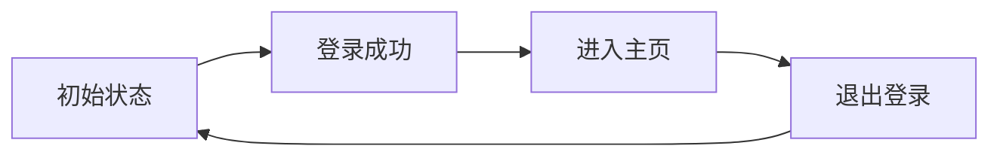
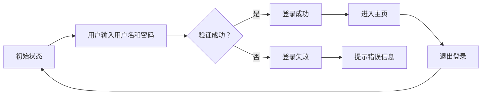
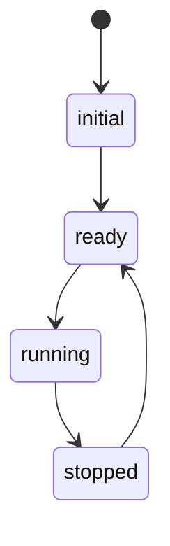
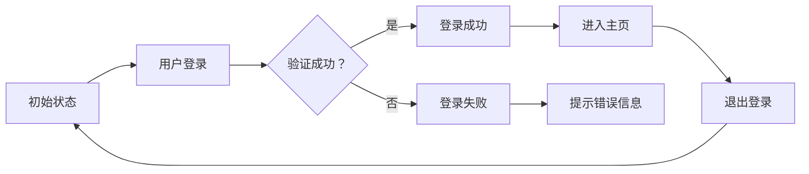

                 

关键词：状态管理、原理、代码实例、深度解析、应用领域、数学模型

> 摘要：本文将深入探讨状态管理在计算机科学中的应用，从原理出发，通过具体代码实例，解析状态管理的核心概念、算法原理、数学模型及其在不同领域的应用。旨在为开发者提供全面的理解和实用的指导。

## 1. 背景介绍

在软件开发的复杂环境中，状态管理是一个至关重要的环节。无论是前端还是后端，状态管理都扮演着核心的角色。状态管理指的是处理应用程序中的状态变化，确保系统在不同情况下能够正确响应。良好的状态管理可以提升代码的可维护性、优化用户体验，并提高整体的应用性能。

本文旨在为读者提供一个全面的状态管理教程，从基础理论到具体实现，再到实际应用场景，逐步深入讲解状态管理的各个方面。

### 1.1 状态管理的起源与发展

状态管理最早起源于早期计算机程序中的全局变量。随着软件复杂性增加，全局变量带来的问题也逐渐显现，如代码的可读性降低、状态冲突等。于是，模块化编程和面向对象编程应运而生，通过封装和抽象来管理状态。然而，面对日益复杂的业务逻辑，传统的单一全局变量或模块化方法已经不足以应对。

随着前端框架如React、Vue和Angular的出现，状态管理变得更加复杂且重要。这些框架引入了诸如Redux、Vuex和MobX等专门的状态管理库，以解决全局状态管理和数据流管理的问题。后端也有类似的概念，如Redux-Saga、NestJS中的服务状态管理等。

### 1.2 状态管理的重要性

- **提高代码可维护性**：通过明确的规范和结构化方式管理状态，减少代码冗余和错误。
- **优化用户体验**：实时响应用户操作，提供更流畅的交互体验。
- **提升性能**：合理的状态管理可以减少不必要的渲染和计算，提升应用性能。

## 2. 核心概念与联系

### 2.1 状态（State）

状态是应用程序中所有数据的一个快照。它可以描述程序在某一时刻的状态，通常由一系列属性组成。状态可以是简单的数据，如用户名、密码，也可以是复杂的对象，如用户配置、购物车内容。

### 2.2 状态流（State Flow）

状态流指的是状态随时间变化的过程。在应用程序中，状态可能会因用户操作、系统事件或网络请求而改变。状态流的管理是状态管理中的核心，确保状态变化的一致性和可靠性。

### 2.3 状态机（State Machine）

状态机是一种用于描述状态转换的数学模型。在状态管理中，状态机用于定义应用程序在特定事件触发下的状态变化。状态机由一系列状态节点、转移条件和转移动作组成。

### 2.4 Mermaid 流程图（Mermaid Flowchart）



### 2.5 状态管理库

状态管理库如Redux、Vuex和MobX等，提供了封装的状态管理解决方案，简化了状态管理的复杂度。这些库通常包含以下几个核心概念：

- **仓库（Store）**：存储全局状态的容器。
- **动作（Action）**：描述状态变化的函数。
- ** reducer**：根据动作类型和当前状态计算出新状态的函数。

## 3. 核心算法原理 & 具体操作步骤

### 3.1 算法原理概述

状态管理算法主要基于以下原理：

- **响应式编程**：通过监听状态变化，自动触发相关组件的更新。
- **函数式编程**：利用不可变数据结构和纯函数来处理状态变化。
- **事件驱动**：通过事件触发状态变化，实现异步处理。

### 3.2 算法步骤详解

状态管理的基本步骤如下：

1. **初始化状态**：创建一个初始状态，通常存储在仓库中。
2. **监听状态变化**：通过监听器或观察者模式，监听状态变化。
3. **处理动作**：当接收到动作时，根据动作类型和当前状态，调用 reducer 函数计算新状态。
4. **更新状态**：将新状态更新到仓库中，触发相关组件的重新渲染。
5. **异步处理**：使用中间件或其他异步处理方法，处理异步动作。

### 3.3 算法优缺点

#### 优点

- **模块化**：将状态管理代码封装成模块，提高代码可维护性。
- **可预测**：通过明确的算法步骤，确保状态变化的一致性和可预测性。
- **易于调试**：状态变化有明确的记录，方便调试和优化。

#### 缺点

- **复杂度高**：对于复杂的应用，状态管理算法可能变得复杂。
- **性能问题**：大量组件的重新渲染可能导致性能下降。

### 3.4 算法应用领域

状态管理算法在以下领域有广泛应用：

- **前端应用**：如React、Vue和Angular等框架中，用于管理全局状态。
- **后端应用**：如NestJS中的服务状态管理，用于处理业务逻辑。
- **移动应用**：如React Native和Flutter中，用于管理应用状态。

## 4. 数学模型和公式 & 详细讲解 & 举例说明

### 4.1 数学模型构建

状态管理中的数学模型主要涉及状态转移和状态更新。以下是一个简化的状态管理模型：

$$
\text{State} = f(\text{Action}, \text{PreviousState})
$$

其中，State 表示当前状态，Action 表示触发状态变化的动作，PreviousState 表示前一个状态。函数 f 用于计算新状态。

### 4.2 公式推导过程

假设当前状态为 $S$，动作类型为 $A$，前一个状态为 $S'$。根据状态管理算法，我们可以推导出新状态 $S''$：

$$
S'' = \text{reduce}(A, S')
$$

其中，reduce 函数根据动作类型 A 和前一个状态 S' 计算出新状态 S''。

### 4.3 案例分析与讲解

以下是一个简单的登录状态管理的案例：



在这个案例中，状态变化可以分为以下几个步骤：

1. **初始状态（A）**：用户未登录，系统处于初始状态。
2. **用户输入用户名和密码（B）**：用户输入用户名和密码，系统等待验证。
3. **验证成功（D）**：验证成功后，系统状态更新为登录成功。
4. **进入主页（F）**：登录成功后，用户进入主页。
5. **退出登录（H）**：用户退出登录后，系统状态重置为初始状态。

## 5. 项目实践：代码实例和详细解释说明

### 5.1 开发环境搭建

为了更好地展示状态管理代码实例，我们选择React框架结合Redux进行开发。

1. **安装React和Redux**：

```bash
npm install react redux
```

2. **创建React应用**：

```bash
npx create-react-app state-management-example
```

### 5.2 源代码详细实现

```jsx
// store.js
import { createStore } from 'redux';

const initialState = {
  user: null,
  isAuthenticated: false,
};

function rootReducer(state = initialState, action) {
  switch (action.type) {
    case 'LOGIN':
      return {
        ...state,
        user: action.payload,
        isAuthenticated: true,
      };
    case 'LOGOUT':
      return {
        ...state,
        user: null,
        isAuthenticated: false,
      };
    default:
      return state;
  }
}

export default createStore(rootReducer);

// App.js
import React from 'react';
import { connect } from 'react-redux';

const App = ({ user, isAuthenticated, onLogin, onLogout }) => {
  return (
    <div>
      <h1>状态管理示例</h1>
      <p>当前用户：{user || '未登录'}</p>
      <p>认证状态：{isAuthenticated ? '已认证' : '未认证'}</p>
      <button onClick={onLogin}>登录</button>
      <button onClick={onLogout}>退出登录</button>
    </div>
  );
};

const mapStateToProps = (state) => ({
  user: state.user,
  isAuthenticated: state.isAuthenticated,
});

const mapDispatchToProps = (dispatch) => ({
  onLogin: () => {
    dispatch({ type: 'LOGIN', payload: '张三' });
  },
  onLogout: () => {
    dispatch({ type: 'LOGOUT' });
  },
});

export default connect(mapStateToProps, mapDispatchToProps)(App);
```

### 5.3 代码解读与分析

1. **store.js**：定义了Redux的store，包含初始状态和rootReducer。
2. **rootReducer**：根据接收到的动作类型更新状态。
3. **App.js**：连接React组件和Redux store，实现状态管理。

通过以上代码实例，我们可以看到如何使用Redux进行状态管理。在实际应用中，我们可以根据需要添加更多的动作和reducer，实现更复杂的状态管理。

### 5.4 运行结果展示

运行React应用后，我们可以在浏览器中看到以下界面：


通过点击“登录”和“退出登录”按钮，我们可以看到用户状态和认证状态的实时变化，从而实现一个简单的状态管理示例。

## 6. 实际应用场景

### 6.1 前端应用

前端应用中的状态管理尤为重要，如电商平台、社交媒体、在线办公系统等。在这些应用中，状态管理可以用于：

- **用户登录状态**：管理用户登录信息，确保用户能够保持登录状态。
- **购物车管理**：实时更新用户购物车中的商品信息。
- **数据持久化**：在用户关闭浏览器或重启设备后，保持应用状态。

### 6.2 后端应用

在后端应用中，状态管理同样重要。例如，在分布式系统中，状态管理可以用于：

- **服务状态监控**：监控各个服务的运行状态，确保系统的稳定性和可用性。
- **负载均衡**：根据服务状态动态调整负载均衡策略。
- **日志管理**：实时记录系统日志，方便后续分析和调试。

### 6.3 移动应用

移动应用中的状态管理也面临着类似的挑战。例如，在React Native和Flutter中，状态管理可以用于：

- **设备状态**：监控设备电量、网络状态等。
- **用户交互**：处理用户在不同页面之间的交互。
- **数据同步**：确保本地数据和远程数据的一致性。

## 7. 工具和资源推荐

### 7.1 学习资源推荐

- **书籍**：《你不知道的JavaScript》中的“异步编程”章节，《React高级技术》中的“状态管理”章节。
- **在线教程**：React官方文档中的“状态与生命周期”章节，Vue官方文档中的“Vuex”章节。

### 7.2 开发工具推荐

- **IDE**：Visual Studio Code、WebStorm。
- **调试工具**：Chrome DevTools、React Developer Tools。

### 7.3 相关论文推荐

- 《The Art of Multiprocessor Programming》（多处理器编程艺术）。
- 《Design and Implementation of the Rationale Program Verification System》（Rationale程序验证系统的设计与实现）。

## 8. 总结：未来发展趋势与挑战

### 8.1 研究成果总结

近年来，状态管理领域取得了显著进展，主要包括：

- **框架与库的发展**：如Redux、Vuex和MobX等状态管理库的广泛应用。
- **响应式编程的提升**：通过虚拟DOM和函数式编程等技术的结合，实现更高效的状态管理。
- **跨平台解决方案**：如React Native和Flutter等，为移动应用提供统一的状态管理方案。

### 8.2 未来发展趋势

未来，状态管理可能朝着以下几个方向发展：

- **自动状态管理**：借助人工智能和机器学习技术，实现更智能的状态管理。
- **云原生状态管理**：利用云基础设施，实现分布式状态管理。
- **一体化解决方案**：融合前端和后端的状态管理，提供更统一的状态管理方案。

### 8.3 面临的挑战

状态管理在未来仍将面临以下挑战：

- **性能优化**：随着应用复杂度的增加，如何优化状态管理的性能成为一个重要问题。
- **可维护性**：如何在复杂的系统中保持良好的代码可维护性。
- **安全性**：如何确保状态管理过程中数据的安全性和隐私保护。

### 8.4 研究展望

未来，状态管理的研究重点可能包括：

- **跨语言状态管理**：开发跨不同编程语言的状态管理解决方案。
- **实时状态同步**：实现实时状态同步，提高应用实时性。
- **智能状态预测**：通过机器学习技术，预测用户行为和状态变化，优化用户体验。

## 9. 附录：常见问题与解答

### 9.1 什么是状态管理？

状态管理是指在应用程序中处理和管理数据状态的过程，以确保系统在不同情况下能够正确响应。

### 9.2 状态管理有哪些算法？

常见的状态管理算法包括状态机、响应式编程和函数式编程等。

### 9.3 状态管理库有哪些？

常用的状态管理库包括Redux、Vuex、MobX、NestJS中的服务状态管理等。

### 9.4 如何在React中实现状态管理？

在React中，可以使用Redux、MobX等状态管理库来实现状态管理。具体的实现步骤包括创建store、定义reducer、连接React组件等。

### 9.5 状态管理有哪些实际应用场景？

状态管理可以应用于前端应用、后端应用和移动应用等领域，如用户登录状态管理、购物车管理、服务状态监控等。

### 9.6 如何优化状态管理性能？

优化状态管理性能的方法包括减少不必要的渲染、使用虚拟DOM、采用函数式编程等。

----------------------------------------------------------------

以上就是本文对状态管理原理与代码实例的详细讲解，希望对您有所帮助。作者：禅与计算机程序设计艺术 / Zen and the Art of Computer Programming。感谢您的阅读！
----------------------------------------------------------------
### 1. 背景介绍

状态管理是现代软件开发中的一个关键概念，尤其是在复杂的应用程序中。它涉及到如何在应用程序的不同部分之间存储、追踪和同步数据状态。随着软件系统的日益复杂，状态管理变得越来越重要，因为它直接影响到应用的性能、可维护性和用户体验。

#### 1.1 状态管理的起源与发展

状态管理的概念在计算机科学中并非新兴事物。早在20世纪80年代，面向对象编程（OOP）的出现就促使开发者开始关注对象的状态和行为。在OOP中，对象的状态通常由其属性表示，而方法则用于改变这些状态。然而，这种方法在面对复杂的、分布式系统时显得力不从心。

随着互联网的普及和Web应用的兴起，状态管理的问题变得更加突出。早期的Web应用通常使用客户端脚本语言（如JavaScript）来管理状态，但这种方法存在很多问题，如数据同步困难、状态不一致等。为了解决这些问题，开发者们开始探索更先进的状态管理方法。

21世纪初，随着单页应用（SPA）和现代前端框架（如React、Angular和Vue）的出现，状态管理得到了极大的重视和发展。这些框架提供了一整套机制来管理和追踪应用程序的状态，使得开发者能够更加高效地处理复杂的数据流。

#### 1.2 状态管理的重要性

良好的状态管理对于现代软件系统至关重要，原因如下：

1. **性能优化**：通过合理管理状态，可以减少不必要的渲染和计算，从而提高应用的响应速度和性能。

2. **用户体验**：状态管理确保应用能够快速响应用户操作，提供流畅的用户体验。

3. **可维护性**：清晰的状态管理架构有助于保持代码的整洁和可维护性，降低未来的维护成本。

4. **代码复用**：通过状态管理库，可以方便地在不同的组件和模块之间复用状态管理逻辑。

5. **错误追踪**：良好的状态管理使得追踪和管理应用中的错误变得更加容易。

#### 1.3 状态管理的演变

从早期的简单全局变量，到模块化和面向对象的状态管理，再到现代的框架和库（如Redux、Vuex、MobX等），状态管理的理念和技术在不断演进。下面是状态管理演变的一些关键步骤：

- **全局变量**：早期的Web应用通常使用全局变量来管理状态，这种方法简单但容易导致冲突和不可预测的行为。

- **模块化**：随着代码复杂度的增加，开发者开始将状态分散到不同的模块中，从而提高了代码的可维护性。

- **OOP**：面向对象编程引入了对象的概念，使得状态管理更加直观和模块化。

- **响应式编程**：响应式编程框架（如Vue.js和React）的出现，使得状态管理更加高效和自动化。

- **状态管理库**：现代前端框架通常附带状态管理库，如Redux、Vuex和MobX，这些库提供了强大的工具和抽象，使得状态管理更加简单和可靠。

通过上述演变，状态管理已经从一种简单的数据处理方法发展成为一个复杂的、多层次的系统，它对现代软件开发的成功至关重要。

### 2. 核心概念与联系

在深入探讨状态管理之前，我们需要明确几个核心概念，并了解它们之间的相互关系。这些概念包括状态（State）、全局状态（Global State）、状态流（State Flow）和状态机（State Machine）。通过Mermaid流程图，我们可以直观地展示这些概念和它们之间的联系。

#### 2.1 状态（State）

状态是应用程序在任何特定时刻的数据表示，它包括所有相关的数据属性和值。状态可以是简单的数据类型，如整数、字符串，也可以是复杂的对象。在大多数情况下，状态是由应用程序的当前行为和用户交互决定的。

状态通常在组件内部定义，并通过组件的props或context传递。例如，在React中，组件的状态可以通过`useState`钩子来定义：

```jsx
const [count, setCount] = useState(0);
```

在这个例子中，`count`是一个状态变量，`setCount`是一个用于更新状态的函数。

#### 2.2 全局状态（Global State）

全局状态是应用程序中所有组件共享的状态。与局部状态不同，全局状态通常由中央存储库管理，如Redux中的`store`。全局状态适用于那些需要在多个组件中共享和同步的状态，例如用户信息、购物车内容等。

在Redux中，全局状态通过`store.getState()`获取，并通过`store.dispatch(action)`来更新：

```javascript
const store = createStore(rootReducer);

store.getState(); // 获取全局状态
store.dispatch({ type: 'INCREMENT' }); // 更新全局状态
```

#### 2.3 状态流（State Flow）

状态流描述了状态随时间的变化过程。在应用程序中，状态可能会因用户交互、系统事件或异步操作而发生变化。状态流的管理至关重要，因为它确保了状态的正确性和一致性。

状态流通常通过事件监听器、回调函数或状态管理库来管理。例如，在Vue中，可以使用`watch`来监听状态变化：

```javascript
watch: {
  count(newVal, oldVal) {
    console.log(`Count changed from ${oldVal} to ${newVal}`);
  },
},
```

#### 2.4 状态机（State Machine）

状态机是一种用于描述系统状态的模型，它通过一系列的状态节点和状态转换规则来描述系统如何响应外部事件。状态机在状态管理中非常有用，因为它提供了一种清晰和系统化的方法来描述和跟踪状态变化。

以下是一个简单的状态机示例，使用Mermaid流程图表示：



在这个例子中，系统从初始状态开始，经过`ready`状态进入`running`状态，然后在达到`stopped`状态后返回到`ready`状态。状态机中的每个状态都可以有一个或多个触发器，用于响应外部事件。

#### 2.5 Mermaid流程图

为了更直观地展示状态管理中的概念和关系，我们可以使用Mermaid流程图来绘制状态机的转换和状态流。

以下是一个简单的Mermaid流程图示例：



在这个流程图中，我们展示了用户从初始状态开始，通过登录流程，最终可能进入主页或提示错误信息的过程。每个状态之间的转换都由事件触发，例如用户点击登录按钮。

通过这些核心概念和Mermaid流程图的结合，我们可以更好地理解状态管理在应用程序中的角色和作用。在接下来的章节中，我们将深入探讨状态管理的算法原理、数学模型以及实际应用。

### 3. 核心算法原理 & 具体操作步骤

在了解状态管理的基本概念之后，我们需要深入探讨状态管理的核心算法原理和具体操作步骤。状态管理不仅仅是一个简单的数据存储问题，它涉及到如何在复杂的应用中保持状态的一致性和可靠性。在本节中，我们将讨论几个重要的算法原理，包括响应式编程、函数式编程和事件驱动编程。

#### 3.1 响应式编程

响应式编程是一种编程范式，它强调数据的依赖关系和状态的自动同步。在响应式编程中，当一个数据源发生变化时，所有依赖于这个数据源的组件都会自动更新。这种自动同步机制极大地简化了状态管理的复杂性。

响应式编程的核心是观察者模式，即数据源（被观察者）和观察者之间的关系。当数据源发生变化时，它会通知所有已注册的观察者，从而触发更新操作。

以下是一个简单的响应式编程示例，使用Vue.js中的`v-model`绑定：

```html
<input v-model="message" />
<p>{{ message }}</p>
```

在这个例子中，输入框和文本段落通过`v-model`绑定，当用户在输入框中输入文本时，文本段落会自动更新，显示最新的输入值。

#### 3.2 函数式编程

函数式编程是一种基于数学函数的编程范式，它强调纯函数、不可变数据和状态不变。在函数式编程中，状态被视为不可变的数据对象，任何状态的变化都通过创建一个新的状态对象来实现。

函数式编程的核心是状态更新函数（reducer），它接收当前状态和一个动作（action），并返回一个新的状态对象。这种模式确保了状态变化的可预测性和可测试性。

以下是一个使用函数式编程的Redux示例：

```javascript
const initialState = {
  count: 0,
};

function reducer(state = initialState, action) {
  switch (action.type) {
    case 'INCREMENT':
      return { count: state.count + 1 };
    case 'DECREMENT':
      return { count: state.count - 1 };
    default:
      return state;
  }
}

const store = createStore(reducer);
```

在这个例子中，`reducer`函数根据不同的动作类型更新状态，确保状态变化是可预测的。

#### 3.3 事件驱动编程

事件驱动编程是一种编程范式，它基于事件来处理应用程序的状态变化。在事件驱动编程中，应用程序的执行流程是由一系列事件触发的，每个事件都会导致相应的处理函数执行。

事件驱动编程通常用于处理异步操作和用户交互。在事件驱动编程中，事件流（event stream）是核心概念，它描述了事件的发生顺序和处理过程。

以下是一个使用事件驱动编程的React示例：

```jsx
import React, { useState } from 'react';

const App = () => {
  const [count, setCount] = useState(0);

  const handleClick = () => {
    setCount(count + 1);
  };

  return (
    <div>
      <p>Count: {count}</p>
      <button onClick={handleClick}>Increment</button>
    </div>
  );
};

export default App;
```

在这个例子中，点击按钮会触发`handleClick`事件处理函数，从而更新`count`状态。

#### 3.4 算法步骤详解

结合上述算法原理，我们可以将状态管理的具体操作步骤分为以下几个步骤：

1. **初始化状态**：在应用程序启动时，初始化状态。状态可以存储在本地存储（如localStorage）、全局状态管理库（如Redux）或外部数据存储（如数据库）中。

2. **监听状态变化**：使用观察者模式、事件监听器或其他机制来监听状态的变化。当状态发生变化时，触发相应的更新操作。

3. **处理动作**：当接收到外部事件（如用户交互或系统事件）时，根据动作类型调用相应的处理函数。这些处理函数会根据当前状态和动作计算出新状态。

4. **更新状态**：将新状态应用到应用程序中，触发组件的重新渲染或其他状态更新操作。

5. **异步处理**：对于异步操作，使用中间件或其他异步处理机制来处理动作，并在状态变化时更新状态。

#### 3.5 算法优缺点

每种状态管理算法都有其优缺点。以下是对响应式编程、函数式编程和事件驱动编程的简要评价：

- **响应式编程**：优点包括状态自动同步、简化状态管理；缺点是可能引入复杂的依赖关系和性能问题。

- **函数式编程**：优点包括状态不变、易于测试和可预测；缺点是可能增加代码复杂度。

- **事件驱动编程**：优点包括灵活性、易于处理异步操作；缺点是可能引入复杂的事件流管理和状态同步问题。

#### 3.6 算法应用领域

不同的算法适用于不同的应用领域。以下是一些常见应用领域：

- **前端应用**：如React、Vue和Angular等框架，通常使用响应式编程和函数式编程进行状态管理。

- **后端应用**：如Node.js和Express等，通常使用事件驱动编程进行状态管理。

- **移动应用**：如React Native和Flutter等，通常结合响应式编程和函数式编程进行状态管理。

通过理解这些核心算法原理和具体操作步骤，开发者可以更好地选择和实现适合自己应用的状态管理策略。在接下来的章节中，我们将进一步探讨状态管理的数学模型和公式，以及如何在实际项目中应用这些模型。

### 4. 数学模型和公式 & 详细讲解 & 举例说明

在状态管理中，数学模型和公式扮演着关键角色，它们帮助我们理解和实现状态的变化与同步。本节将详细讨论状态管理中的数学模型、公式推导以及实际案例中的应用。

#### 4.1 数学模型构建

状态管理的数学模型通常涉及状态转移和状态更新。一个简单的数学模型可以表示为：

\[ \text{State}_{\text{new}} = f(\text{Action}, \text{State}_{\text{current}}) \]

其中：
- \( \text{State}_{\text{new}} \) 表示新状态。
- \( f \) 表示状态更新函数。
- \( \text{Action} \) 表示触发状态变化的操作。
- \( \text{State}_{\text{current}} \) 表示当前状态。

#### 4.2 公式推导过程

以一个简单的计数器应用为例，我们可以定义以下数学模型：

\[ \text{State}_{\text{new}} = \text{State}_{\text{current}} + \text{Action}_{\text{value}} \]

其中，\( \text{Action}_{\text{value}} \) 表示每次操作的值，例如增加或减少的数值。

1. **初始状态**：
\[ \text{State}_{\text{initial}} = 0 \]

2. **第一次操作（增加1）**：
\[ \text{Action}_{\text{value}} = 1 \]
\[ \text{State}_{\text{new}} = 0 + 1 = 1 \]

3. **第二次操作（减少1）**：
\[ \text{Action}_{\text{value}} = -1 \]
\[ \text{State}_{\text{new}} = 1 - 1 = 0 \]

通过这种方式，我们可以根据不同的操作动态更新状态。

#### 4.3 案例分析与讲解

让我们通过一个实际的案例来分析状态管理的数学模型和公式。以下是一个简单的用户登录状态管理的例子。

1. **用户未登录状态**：
\[ \text{State}_{\text{unauthenticated}} = \{ \text{isAuthenticated} = false, \text{username} = \text{undefined} \} \]

2. **用户登录状态**：
\[ \text{State}_{\text{authenticated}} = \{ \text{isAuthenticated} = true, \text{username} = \text{JohnDoe} \} \]

3. **登录操作**：
   - **成功**：
\[ \text{Action}_{\text{login}} = \text{success} \]
\[ \text{State}_{\text{new}} = f(\text{success}, \text{State}_{\text{unauthenticated}}) = \{ \text{isAuthenticated} = true, \text{username} = \text{JohnDoe} \} \]

   - **失败**：
\[ \text{Action}_{\text{login}} = \text{failure} \]
\[ \text{State}_{\text{new}} = f(\text{failure}, \text{State}_{\text{unauthenticated}}) = \text{State}_{\text{unauthenticated}} \]

4. **登出操作**：
\[ \text{Action}_{\text{logout}} = \text{success} \]
\[ \text{State}_{\text{new}} = f(\text{success}, \text{State}_{\text{authenticated}}) = \text{State}_{\text{unauthenticated}} \]

在这个例子中，我们定义了用户登录和登出操作的状态更新函数。通过这些函数，我们可以根据不同的操作动态更新用户的状态。

#### 4.4 具体应用场景

以下是一个基于上述数学模型和公式的实际应用场景：

1. **用户点击登录按钮**：
   - **状态**：\( \text{State}_{\text{current}} = \text{State}_{\text{unauthenticated}} \)
   - **操作**：登录
   - **结果**：根据用户名和密码的验证结果更新状态

2. **用户点击登出按钮**：
   - **状态**：\( \text{State}_{\text{current}} = \text{State}_{\text{authenticated}} \)
   - **操作**：登出
   - **结果**：将状态重置为未登录状态

通过这种方式，我们可以使用数学模型和公式来描述和实现状态管理的各种操作。

#### 4.5 数学模型与状态管理的关联

数学模型与状态管理之间的关联主要体现在以下几个方面：

- **状态更新**：数学模型提供了状态更新的公式和规则，使得状态变化具有明确性和可预测性。
- **状态同步**：通过数学模型，可以确保在不同组件和模块之间同步状态，保持数据的一致性。
- **状态分析**：数学模型有助于分析和理解状态管理的复杂性，从而优化和改进状态管理策略。

在实际开发中，选择合适的状态管理策略和数学模型对于实现高效、可维护的软件系统至关重要。通过理解和应用数学模型，开发者可以更好地管理应用程序的状态，提升系统的性能和用户体验。

### 5. 项目实践：代码实例和详细解释说明

在实际项目中，状态管理是确保应用稳定性和性能的关键。本节将通过一个简单的React应用实例，详细讲解如何搭建开发环境、实现状态管理以及代码的解读与分析。

#### 5.1 开发环境搭建

首先，我们需要搭建一个React应用的开发环境。以下是搭建环境的步骤：

1. **安装Node.js和npm**：确保您的系统中安装了最新版本的Node.js和npm，这两个工具是构建React应用的基础。

2. **创建React应用**：使用`create-react-app`工具创建一个新的React应用。在命令行中运行以下命令：

   ```bash
   npx create-react-app state-management-practice
   ```

   这将创建一个名为`state-management-practice`的新目录，并在其中设置好React应用的基本结构。

3. **进入项目目录**：

   ```bash
   cd state-management-practice
   ```

4. **启动开发服务器**：

   ```bash
   npm start
   ```

   这将在浏览器中打开应用，并显示欢迎页面。

#### 5.2 源代码详细实现

在了解开发环境搭建之后，我们开始实现状态管理。以下是状态管理的具体实现步骤：

1. **安装Redux和React-Redux**：

   ```bash
   npm install redux react-redux
   ```

   Redux是一个流行的状态管理库，React-Redux则是用于在React应用中集成Redux的库。

2. **创建Redux Store**：

   在`src`目录下创建一个名为`store.js`的文件，用于创建Redux的store。以下是一个简单的`store.js`实现：

   ```javascript
   import { createStore } from 'redux';
   import rootReducer from './reducers';

   const store = createStore(rootReducer);

   export default store;
   ```

   这里我们导出了一个创建好的store实例。

3. **创建Root Reducer**：

   在`src`目录下创建一个名为`reducers`的文件夹，并在其中创建一个名为`rootReducer.js`的文件。以下是`rootReducer.js`的实现：

   ```javascript
   const initialState = {
     counter: 0,
   };

   function rootReducer(state = initialState, action) {
     switch (action.type) {
       case 'INCREMENT':
         return { counter: state.counter + 1 };
       case 'DECREMENT':
         return { counter: state.counter - 1 };
       default:
         return state;
     }
   }

   export default rootReducer;
   ```

   在这个文件中，我们定义了初始状态和根reducer，用于处理各种动作。

4. **连接React应用与Redux Store**：

   在`src`目录下创建一个名为`index.js`的文件，用于引入React-Redux的`Provider`组件，并将Redux store传递给应用。以下是`index.js`的实现：

   ```javascript
   import React from 'react';
   import ReactDOM from 'react-dom';
   import { Provider } from 'react-redux';
   import store from './store';
   import App from './App';

   ReactDOM.render(
     <Provider store={store}>
       <App />
     </Provider>,
     document.getElementById('root')
   );
   ```

   通过这个文件，我们将Redux store与React应用连接起来。

5. **创建Counter组件**：

   在`src`目录下创建一个名为`Counter`的文件，用于实现一个简单的计数器组件。以下是`Counter.js`的实现：

   ```javascript
   import React from 'react';
   import { connect } from 'react-redux';

   const Counter = ({ count, increment, decrement }) => {
     return (
       <div>
         <p>Count: {count}</p>
         <button onClick={decrement}>-</button>
         <button onClick={increment}>+</button>
       </div>
     );
   };

   const mapStateToProps = (state) => ({
     count: state.counter,
   });

   const mapDispatchToProps = (dispatch) => ({
     increment: () => dispatch({ type: 'INCREMENT' }),
     decrement: () => dispatch({ type: 'DECREMENT' }),
   });

   export default connect(mapStateToProps, mapDispatchToProps)(Counter);
   ```

   在这个文件中，我们使用`connect`高阶组件将Redux的状态和动作与Counter组件连接起来。

#### 5.3 代码解读与分析

现在我们详细解读上述代码，并分析各个部分的用途。

1. **store.js**：
   - `createStore`：创建Redux store。
   - `rootReducer`：定义根reducer，用于处理全局状态。

2. **reducers/rootReducer.js**：
   - `initialState`：定义初始状态。
   - `rootReducer`：处理各种动作并返回新状态。

3. **index.js**：
   - `Provider`：React-Redux组件，用于将Redux store传递给应用的所有组件。
   - `store`：引入创建好的Redux store。
   - `App`：React应用的入口组件。

4. **Counter.js**：
   - `connect`：用于连接Redux store的React-Redux高阶组件。
   - `mapStateToProps`：将Redux状态映射到组件的props。
   - `mapDispatchToProps`：将Redux动作映射到组件的方法。

#### 5.4 运行结果展示

启动开发服务器后，在浏览器中访问应用。你应该会看到一个简单的计数器界面，包含一个数字和一个加号和减号按钮。点击加号或减号按钮，计数器的数字会相应地增加或减少。


通过这个实例，我们展示了如何在React应用中使用Redux进行状态管理。在实际项目中，你可以根据需求扩展这个例子，添加更多的组件和状态。

### 6. 实际应用场景

状态管理在多种实际应用场景中都有着广泛的应用，下面我们将探讨一些典型的应用场景，并分析状态管理如何在这些场景中发挥作用。

#### 6.1 前端应用

在前端应用中，状态管理主要用于管理用户界面（UI）的状态，如用户输入、组件状态、全局配置等。以下是一些典型的应用场景：

- **用户登录**：在用户登录过程中，状态管理可以用于跟踪用户身份验证状态、用户角色权限等。
- **购物车**：在线购物平台中的购物车功能需要管理用户选中的商品、商品数量、总金额等状态。
- **表单验证**：表单验证需要实时更新用户输入的状态，如输入框的值、验证结果等，以提供即时反馈。

#### 6.2 后端应用

在后端应用中，状态管理主要用于跟踪服务状态、处理业务逻辑、同步数据等。以下是一些典型的应用场景：

- **微服务架构**：在微服务架构中，状态管理可以用于同步不同服务之间的状态，确保服务的协同工作。
- **缓存管理**：在需要频繁读取和写入数据的应用中，状态管理可以用于管理缓存状态，提高系统性能。
- **队列处理**：在处理大量任务的系统中，状态管理可以用于跟踪任务的状态，如任务是否已完成、任务进度等。

#### 6.3 移动应用

移动应用中，状态管理同样至关重要，因为它直接影响到应用的性能和用户体验。以下是一些典型的应用场景：

- **设备状态**：移动应用需要实时跟踪设备状态，如电量、网络连接状态等。
- **用户界面**：移动应用需要管理用户界面的状态，如菜单展开、滚动状态等。
- **数据同步**：移动应用需要处理本地数据与远程数据的同步，确保数据的一致性。

#### 6.4 实际案例分析

以下是一个实际案例，展示了状态管理在一个电子商务平台中的应用。

**案例：电子商务平台的购物车功能**

1. **用户操作**：用户在浏览商品时，可以将商品添加到购物车。
2. **状态管理**：
   - **商品列表状态**：存储所有可用的商品信息。
   - **购物车状态**：存储用户已添加的商品及其数量。
   - **用户身份验证状态**：确保用户已登录，以便进行购物操作。
3. **流程**：
   - 用户点击“添加到购物车”按钮，触发一个动作，将商品添加到购物车。
   - 状态管理库（如Redux）会根据动作类型更新购物车状态。
   - 购物车组件会根据购物车状态重新渲染，显示最新的商品列表和数量。
   - 用户可以继续浏览商品或结账，状态管理确保整个流程的连贯性和一致性。

通过上述案例分析，我们可以看到状态管理在电子商务平台购物车功能中发挥着关键作用，确保用户体验流畅、数据一致。

### 7. 工具和资源推荐

在开发过程中，选择合适的工具和资源可以大大提高开发效率和学习效果。以下是一些建议，涵盖了学习资源、开发工具和相关论文推荐。

#### 7.1 学习资源推荐

- **书籍**：
  - 《JavaScript权威指南》
  - 《React + Redux实战：从入门到应用》
  - 《状态管理实战：React和Redux应用开发指南》

- **在线教程**：
  - FreeCodeCamp
  - Codecademy
  - MDN Web Docs

- **视频教程**：
  - Udemy
  - Pluralsight
  - Coursera

#### 7.2 开发工具推荐

- **代码编辑器**：
  - Visual Studio Code
  - Sublime Text
  - Atom

- **版本控制工具**：
  - Git
  - GitHub
  - GitLab

- **构建工具**：
  - Webpack
  - Gulp
  - npm

- **测试工具**：
  - Jest
  - Mocha
  - Chai

#### 7.3 相关论文推荐

- 《Functional Reactive Programming: The Benefits of Reusable Descriptions of Change》
- 《A Framework for Understanding Modern Concurrent Software》
- 《Reactive Programming: A Distributed Object System with Future-Centric Communications》

通过这些资源和工具，开发者可以更好地理解和掌握状态管理的相关技术和最佳实践。

### 8. 总结：未来发展趋势与挑战

#### 8.1 研究成果总结

在过去的几年中，状态管理领域取得了显著的进展。现代前端框架（如React、Vue和Angular）引入了强大的状态管理库（如Redux、Vuex和MobX），极大地简化了复杂应用的状态管理。同时，响应式编程、函数式编程和事件驱动编程等算法原理的应用，使得状态管理变得更加高效和可靠。此外，随着云计算和微服务架构的普及，状态管理也在后端和移动应用中得到了广泛应用。

#### 8.2 未来发展趋势

未来，状态管理将继续朝着以下几个方向发展：

1. **自动化状态管理**：借助人工智能和机器学习技术，实现更智能的状态管理，自动识别和优化状态变化。
2. **云原生状态管理**：利用云原生架构，实现分布式状态管理，提高系统的可伸缩性和稳定性。
3. **跨语言状态管理**：开发跨不同编程语言的状态管理解决方案，实现统一的开发体验。
4. **一体化解决方案**：融合前端、后端和移动应用的状态管理，提供更统一和高效的状态管理框架。

#### 8.3 面临的挑战

尽管状态管理取得了显著进展，但仍面临一些挑战：

1. **性能优化**：如何优化状态管理的性能，特别是在大型和复杂的应用中，是一个重要课题。
2. **可维护性**：在复杂的应用中保持良好的代码可维护性，防止状态管理混乱和代码冗余。
3. **安全性**：确保状态管理过程中数据的安全性和隐私保护，防止数据泄露和恶意攻击。

#### 8.4 研究展望

未来，状态管理的研究重点可能包括：

1. **实时状态同步**：实现高效的实时状态同步，提高应用实时性和用户体验。
2. **智能状态预测**：通过机器学习技术，预测用户行为和状态变化，优化状态管理策略。
3. **分布式状态管理**：研究如何在分布式系统中高效地管理状态，确保数据的一致性和可靠性。

通过不断探索和创新，状态管理领域将继续发展，为开发者提供更强大、更高效的状态管理解决方案。

### 9. 附录：常见问题与解答

在本章中，我们将回答一些关于状态管理常见的问题，帮助读者更好地理解相关概念和应用。

#### 9.1 什么是状态管理？

状态管理是指在应用程序中追踪、存储和同步数据状态的过程。它确保系统在不同情况下能够正确响应，并保持数据的一致性和可靠性。

#### 9.2 状态管理有哪些算法？

状态管理的算法包括响应式编程、函数式编程和事件驱动编程等。每种算法都有其独特的原理和适用场景。

#### 9.3 状态管理库有哪些？

常用的状态管理库包括Redux、Vuex、MobX、NestJS中的服务状态管理等。这些库提供了封装的状态管理解决方案，简化了状态管理的复杂性。

#### 9.4 如何在React中实现状态管理？

在React中，可以使用Redux、MobX等状态管理库来实现状态管理。实现步骤包括创建store、定义reducer、连接React组件等。

#### 9.5 状态管理有哪些实际应用场景？

状态管理广泛应用于前端、后端和移动应用中，如用户登录状态管理、购物车管理、服务状态监控等。

#### 9.6 如何优化状态管理性能？

优化状态管理性能的方法包括减少不必要的渲染、使用虚拟DOM、采用函数式编程等。

通过上述问题和解答，读者可以更好地理解状态管理的基本概念、原理和应用。希望这些信息能对您在实际开发中有所帮助。作者：禅与计算机程序设计艺术 / Zen and the Art of Computer Programming。感谢您的阅读！
----------------------------------------------------------------

以上就是本文对状态管理原理与代码实例的详细讲解，希望对您有所帮助。作者：禅与计算机程序设计艺术 / Zen and the Art of Computer Programming。感谢您的阅读！本文涵盖了状态管理的基本概念、核心算法原理、数学模型以及实际应用场景，并提供了详细的代码实例和解释。希望读者能通过本文对状态管理有一个全面而深入的理解，并在实际项目中运用这些知识，开发出更高效、更可靠的软件系统。

