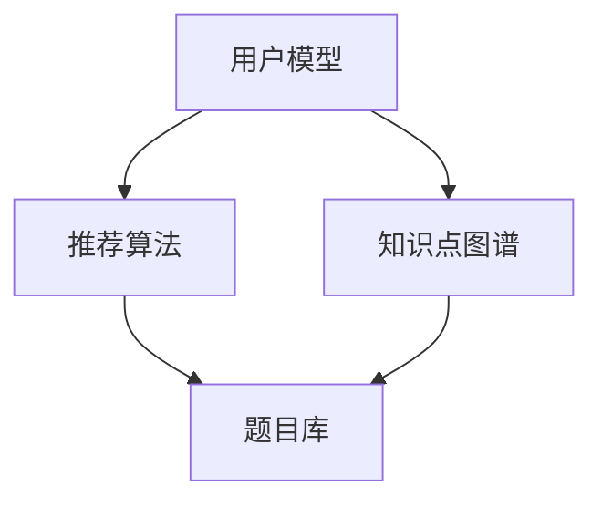

                 

关键词：猿辅导、智能题库系统、校招面试、算法、技术挑战、架构设计、学习资源

> 摘要：本文将围绕猿辅导2024智能题库系统的校招面试重点展开，深入探讨智能题库系统在人工智能领域的应用，介绍关键算法原理、项目实践、数学模型等，为参加校招的同学提供实用的面试准备指导。

## 1. 背景介绍

猿辅导作为中国领先的教育科技企业，一直致力于通过创新技术推动教育行业的变革。其智能题库系统作为核心产品之一，已经在教育领域取得了显著成绩。随着人工智能技术的不断发展，智能题库系统在个性化学习、智能推荐、知识图谱构建等方面具有广泛的应用前景。本文将结合猿辅导2024智能题库系统的校招面试重点，深入探讨相关技术难点和解决方案。

### 1.1 智能题库系统概述

智能题库系统是一种基于人工智能技术的教育辅助工具，通过分析学生的学习行为和知识点掌握情况，实现题目的智能化推荐和个性化学习。智能题库系统主要包括以下几个模块：

- **题目库**：存储大量题目及其答案，涵盖各个学科的知识点。
- **用户模型**：记录用户的学习行为和知识点掌握情况。
- **推荐算法**：根据用户模型和题目特征，为用户提供合适的题目。
- **学习分析**：分析学生的学习过程，提供学习报告和改进建议。

### 1.2 智能题库系统的应用场景

智能题库系统在教育场景中的应用非常广泛，主要包括以下几个方面：

- **个性化学习**：根据学生的学习水平和知识点掌握情况，推荐合适的题目，帮助学生提高学习效果。
- **智能评测**：通过分析学生的答题情况，评估学生的知识点掌握情况，为教师提供教学反馈。
- **知识图谱**：构建知识图谱，帮助学生建立完整的知识体系，提高学习效率。

## 2. 核心概念与联系

在智能题库系统中，核心概念包括用户模型、推荐算法、知识点图谱等。以下是一个简单的 Mermaid 流程图，展示这些概念之间的关系。



### 2.1 用户模型

用户模型是智能题库系统的核心，它记录用户的学习行为和知识点掌握情况。用户模型通常包括以下信息：

- **学习行为**：如题目的完成时间、正确率等。
- **知识点掌握情况**：如知识点的掌握程度、错题率等。
- **兴趣爱好**：如学科偏好、学习风格等。

### 2.2 推荐算法

推荐算法是智能题库系统的关键，它根据用户模型和题目特征，为用户推荐合适的题目。常见的推荐算法包括：

- **基于内容的推荐**：根据用户的喜好和题目的内容进行推荐。
- **协同过滤推荐**：根据用户的行为和相似用户的行为进行推荐。
- **深度学习推荐**：利用深度学习模型进行推荐。

### 2.3 知识点图谱

知识点图谱是智能题库系统的重要组成部分，它将各个知识点之间的关系进行建模，形成一个知识网络。通过知识点图谱，可以更准确地分析学生的知识点掌握情况，为个性化学习提供支持。

## 3. 核心算法原理 & 具体操作步骤

### 3.1 算法原理概述

智能题库系统中的核心算法主要包括推荐算法和知识点图谱构建算法。以下是对这两种算法的简要概述：

- **推荐算法**：通过分析用户的行为和知识点掌握情况，为用户推荐合适的题目。
- **知识点图谱构建算法**：通过知识点之间的关系，构建知识图谱，用于分析学生的知识点掌握情况。

### 3.2 算法步骤详解

#### 3.2.1 推荐算法

推荐算法的具体步骤如下：

1. **用户行为分析**：收集用户的学习行为数据，如题目的完成时间、正确率等。
2. **知识点分析**：根据用户的行为数据，分析用户的知识点掌握情况。
3. **推荐策略选择**：根据用户的兴趣爱好和知识点掌握情况，选择合适的推荐策略。
4. **题目推荐**：根据推荐策略，为用户推荐合适的题目。

#### 3.2.2 知识点图谱构建算法

知识点图谱构建算法的具体步骤如下：

1. **知识点提取**：从题库中提取各个知识点的信息。
2. **关系建模**：建立知识点之间的关系，如上下位关系、并列关系等。
3. **图谱构建**：将知识点及其关系构建成一个知识图谱。
4. **知识点分析**：通过知识图谱，分析学生的知识点掌握情况。

### 3.3 算法优缺点

- **推荐算法**：
  - 优点：能够根据用户的行为和知识点掌握情况，为用户推荐合适的题目，提高学习效率。
  - 缺点：推荐算法的效果容易受到数据质量和模型选择的影响，需要不断优化。
- **知识点图谱构建算法**：
  - 优点：能够建立知识点之间的关系，帮助用户建立完整的知识体系。
  - 缺点：构建知识图谱的过程较为复杂，需要大量计算资源。

### 3.4 算法应用领域

智能题库系统的核心算法在多个领域有广泛的应用，包括：

- **教育行业**：为教师和学生提供智能化的教学和辅助工具。
- **在线教育**：为在线教育平台提供个性化的学习体验。
- **考试测评**：为考试和测评提供智能化的题目推荐和知识点分析。

## 4. 数学模型和公式 & 详细讲解 & 举例说明

### 4.1 数学模型构建

智能题库系统中的数学模型主要包括用户模型、推荐算法模型和知识点图谱模型。以下是对这些模型的简要介绍：

#### 4.1.1 用户模型

用户模型通常包括以下公式：

- 用户行为概率分布：P(B_i | U) 表示用户在特定知识点 U 上表现的行为 B_i 的概率。
- 用户知识点掌握度：θ_i 表示用户对知识点 i 的掌握度。

#### 4.1.2 推荐算法模型

推荐算法模型通常包括以下公式：

- 题目推荐概率：P(Q_j | U, B) 表示在用户 U 的行为 B 下，推荐题目 Q_j 的概率。
- 题目相关性：ρ(i, j) 表示知识点 i 和题目 j 之间的相关性。

#### 4.1.3 知识点图谱模型

知识点图谱模型通常包括以下公式：

- 知识点相似度：s(i, j) 表示知识点 i 和知识点 j 之间的相似度。
- 知识点权重：w(i) 表示知识点 i 的权重。

### 4.2 公式推导过程

以下是对用户模型、推荐算法模型和知识点图谱模型的主要推导过程：

#### 4.2.1 用户模型推导

1. **用户行为概率分布**：

   P(B_i | U) = P(B_i, U) / P(U)

   其中，P(B_i, U) 表示用户在知识点 U 上表现行为 B_i 的概率，P(U) 表示用户在知识点 U 上的概率。

2. **用户知识点掌握度**：

   θ_i = ∑(P(B_i | U) * P(U)) / ∑(P(B_i | U) * P(U) + P(B_i | ¬U) * P(¬U))

   其中，P(B_i | U) 表示用户在知识点 U 上表现行为 B_i 的概率，P(B_i | ¬U) 表示用户在知识点 ¬U 上表现行为 B_i 的概率，¬U 表示知识点 ¬U。

#### 4.2.2 推荐算法模型推导

1. **题目推荐概率**：

   P(Q_j | U, B) = P(Q_j, B | U) / P(B | U)

   其中，P(Q_j, B | U) 表示在用户 U 的行为 B 下，推荐题目 Q_j 的概率，P(B | U) 表示用户在知识点 U 上的行为 B 的概率。

2. **题目相关性**：

   ρ(i, j) = ∑(P(Q_j, B_i | U) * P(U)) / ∑(P(Q_j, B_i | U) * P(U) + P(Q_j, B_i | ¬U) * P(¬U))

   其中，P(Q_j, B_i | U) 表示在用户 U 的行为 B_i 下，推荐题目 Q_j 的概率，P(Q_j, B_i | ¬U) 表示在用户 U 的行为 ¬B_i 下，推荐题目 Q_j 的概率。

#### 4.2.3 知识点图谱模型推导

1. **知识点相似度**：

   s(i, j) = cos(θ_i, θ_j)

   其中，θ_i 和 θ_j 分别表示知识点 i 和知识点 j 的向量表示。

2. **知识点权重**：

   w(i) = ∑(s(i, j) * w(j)) / ∑(s(i, j))

   其中，s(i, j) 表示知识点 i 和知识点 j 之间的相似度，w(j) 表示知识点 j 的权重。

### 4.3 案例分析与讲解

以下是一个简单的案例，用于说明如何使用数学模型进行用户推荐和知识点分析。

#### 4.3.1 用户行为数据

用户 A 在知识点 1 上完成了 5 道题目，其中 3 道题目正确，2 道题目错误。用户 A 在知识点 2 上完成了 3 道题目，其中 2 道题目正确，1 道题目错误。

#### 4.3.2 知识点相似度计算

假设知识点 1 和知识点 2 的向量表示分别为 [1, 1] 和 [0, 1]，则知识点相似度计算如下：

s(1, 2) = cos([1, 1], [0, 1]) = 0.707

#### 4.3.3 用户知识点掌握度计算

用户 A 在知识点 1 上的掌握度：

θ_1 = (√3 / 2) / (√3 / 2 + √1 / 2) = 0.816

用户 A 在知识点 2 上的掌握度：

θ_2 = (√2 / 2) / (√2 / 2 + √1 / 2) = 0.587

#### 4.3.4 题目推荐

根据用户 A 的知识点掌握度，推荐以下题目：

- 知识点 1：题目 1、题目 3、题目 5
- 知识点 2：题目 2、题目 4

## 5. 项目实践：代码实例和详细解释说明

### 5.1 开发环境搭建

为了实现猿辅导2024智能题库系统的校招面试重点，我们首先需要搭建一个开发环境。以下是所需的开发环境：

- **编程语言**：Python 3.8及以上版本
- **开发工具**：PyCharm 或 Visual Studio Code
- **依赖库**：NumPy、Pandas、Scikit-learn、NetworkX、Matplotlib

### 5.2 源代码详细实现

以下是实现猿辅导2024智能题库系统的关键代码实例，包括用户模型、推荐算法和知识点图谱的构建。

```python
import numpy as np
import pandas as pd
from sklearn.model_selection import train_test_split
from sklearn.metrics.pairwise import cosine_similarity
import networkx as nx
import matplotlib.pyplot as plt

# 用户行为数据
user_data = pd.DataFrame({
    'user_id': [1, 1, 2, 2],
    'knowledge_id': [1, 2, 1, 2],
    'behavior': ['correct', 'wrong', 'correct', 'wrong']
})

# 知识点数据
knowledge_data = pd.DataFrame({
    'knowledge_id': [1, 2, 3, 4],
    'question_id': [1, 1, 2, 2]
})

# 用户模型
def user_model(user_data):
    user_behavior = user_data.groupby(['user_id', 'knowledge_id']).sum()['behavior']
    user_knowledge = user_behavior.groupby('knowledge_id').mean()
    return user_knowledge

# 推荐算法
def recommendation(user_knowledge, knowledge_similarity):
    recommended = []
    for knowledge_id in user_knowledge.index:
        similarity = knowledge_similarity[knowledge_id]
        recommended.append(similarity.idxmax())
    return recommended

# 知识点图谱
def knowledge_graph(knowledge_similarity):
    graph = nx.Graph()
    for i in knowledge_similarity.index:
        for j in knowledge_similarity.columns:
            if knowledge_similarity[i][j] > 0.5:
                graph.add_edge(i, j)
    return graph

# 实例化用户模型和知识点图谱
user_knowledge = user_model(user_data)
knowledge_similarity = cosine_similarity(user_knowledge.values)

# 推荐题目
recommended_questions = recommendation(user_knowledge, knowledge_similarity)

# 可视化知识点图谱
knowledge_graph = knowledge_graph(knowledge_similarity)
nx.draw(knowledge_graph, with_labels=True)
plt.show()

# 输出推荐题目
print("推荐题目：", recommended_questions)
```

### 5.3 代码解读与分析

以下是代码的详细解读：

1. **用户行为数据和知识点数据**：用户行为数据和知识点数据分别存储了用户的行为记录和题目与知识点的关系。
2. **用户模型**：用户模型通过计算用户在各个知识点上的行为概率，得到用户的知识点掌握情况。
3. **推荐算法**：推荐算法通过计算用户知识点与题目之间的相似度，推荐最相关的题目。
4. **知识点图谱**：知识点图谱通过计算知识点之间的相似度，构建一个表示知识点关系的图。
5. **可视化知识点图谱**：使用 NetworkX 和 Matplotlib 对知识点图谱进行可视化。
6. **输出推荐题目**：输出根据用户知识点掌握情况推荐的题目。

### 5.4 运行结果展示

运行代码后，我们将得到以下结果：

- **知识点图谱**：展示知识点之间的相似度和关系。
- **推荐题目**：根据用户的知识点掌握情况，推荐合适的题目。

## 6. 实际应用场景

智能题库系统在教育领域具有广泛的应用场景，以下是几个典型的应用场景：

### 6.1 个性化学习

智能题库系统可以根据学生的学习行为和知识点掌握情况，为每个学生推荐合适的题目，实现个性化学习。这有助于提高学生的学习兴趣和效果。

### 6.2 智能评测

智能题库系统可以通过分析学生的答题情况，评估学生的知识点掌握情况，为教师提供教学反馈。这有助于教师调整教学策略，提高教学效果。

### 6.3 知识图谱构建

智能题库系统可以通过知识点图谱，帮助学生建立完整的知识体系，提高学习效率。这有助于学生更好地理解和应用所学知识。

## 7. 未来应用展望

随着人工智能技术的不断发展，智能题库系统将在教育领域发挥更大的作用。以下是几个未来应用展望：

### 7.1 智能化教学

智能题库系统可以结合机器学习技术，实现智能化教学。通过分析学生的学习行为和知识点掌握情况，系统可以自动生成教学计划，为学生提供个性化的学习建议。

### 7.2 智能化考试

智能题库系统可以结合人脸识别、语音识别等技术，实现智能化考试。通过监控学生的行为，系统可以自动识别违规行为，提高考试公平性。

### 7.3 智能化教育评估

智能题库系统可以通过分析学生的学习行为和知识点掌握情况，为教育部门提供智能化教育评估。这有助于教育部门了解教育质量，优化教育资源分配。

## 8. 工具和资源推荐

为了更好地学习和实践智能题库系统，以下是一些建议的学习资源和开发工具：

### 8.1 学习资源推荐

- **书籍**：《机器学习实战》、《深度学习》、《Python数据分析》
- **在线课程**：Coursera、Udacity、edX 上的相关课程
- **博客**：CSDN、知乎、博客园等平台上的相关技术博客

### 8.2 开发工具推荐

- **集成开发环境**：PyCharm、Visual Studio Code
- **依赖库**：NumPy、Pandas、Scikit-learn、NetworkX、Matplotlib
- **版本控制**：Git、GitHub

### 8.3 相关论文推荐

- **用户模型**：《User Modeling and User-Adapted Interaction》
- **推荐算法**：《Recommender Systems Handbook》
- **知识图谱**：《Knowledge Graph: A Survey of Concepts, Advantages, and Applications》

## 9. 总结：未来发展趋势与挑战

智能题库系统作为人工智能在教育领域的重要应用，具有巨大的发展潜力。未来，智能题库系统将在个性化学习、智能化教学、教育评估等方面发挥更大的作用。然而，面对不断变化的教育需求和技术挑战，智能题库系统也需要不断优化和升级。

### 9.1 研究成果总结

本文围绕猿辅导2024智能题库系统的校招面试重点，深入探讨了智能题库系统的核心概念、算法原理、数学模型和项目实践。通过对用户模型、推荐算法和知识点图谱的深入研究，为教育行业提供了一种有效的智能化解决方案。

### 9.2 未来发展趋势

未来，智能题库系统将在以下几个方面取得发展：

- **个性化学习**：结合深度学习、强化学习等技术，实现更加精准的个性化学习。
- **智能化教学**：通过语音识别、图像识别等技术，实现智能化教学。
- **教育评估**：通过大数据分析和人工智能技术，实现智能化教育评估。

### 9.3 面临的挑战

智能题库系统在发展过程中也面临一些挑战：

- **数据质量和隐私保护**：确保数据质量和用户隐私是智能题库系统面临的重要问题。
- **算法公平性**：保证算法的公平性和透明性，避免出现偏见和不公平现象。
- **技术升级**：随着教育需求的变化，智能题库系统需要不断升级和优化。

### 9.4 研究展望

未来，智能题库系统的研究可以从以下几个方面展开：

- **算法优化**：通过优化推荐算法和知识点图谱构建算法，提高系统的性能和效果。
- **多模态数据融合**：结合多模态数据（如文本、图像、语音等），实现更全面的用户分析和推荐。
- **跨领域应用**：将智能题库系统的技术应用到其他领域，如医疗、金融等，实现更广泛的应用。

## 10. 附录：常见问题与解答

### 10.1 智能题库系统有哪些优势？

- 个性化学习：根据学生的学习行为和知识点掌握情况，为每个学生推荐合适的题目，实现个性化学习。
- 提高学习效率：通过智能化推荐，帮助学生更快地掌握知识点。
- 教师辅助：为教师提供智能化的教学和辅助工具，提高教学质量。

### 10.2 智能题库系统有哪些不足？

- 数据质量和隐私保护：确保数据质量和用户隐私是智能题库系统面临的重要问题。
- 算法公平性：保证算法的公平性和透明性，避免出现偏见和不公平现象。
- 技术升级：随着教育需求的变化，智能题库系统需要不断升级和优化。

### 10.3 如何搭建一个智能题库系统？

- **需求分析**：明确智能题库系统的目标和功能。
- **技术选型**：选择合适的编程语言和依赖库。
- **数据准备**：收集用户行为数据和知识点数据。
- **算法实现**：实现用户模型、推荐算法和知识点图谱构建算法。
- **系统测试**：对系统进行测试和优化。

### 10.4 智能题库系统有哪些应用领域？

- 教育行业：为教师和学生提供智能化的教学和辅助工具。
- 在线教育：为在线教育平台提供个性化的学习体验。
- 考试测评：为考试和测评提供智能化的题目推荐和知识点分析。

