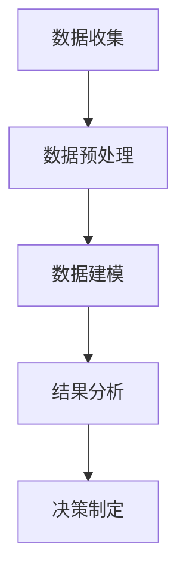
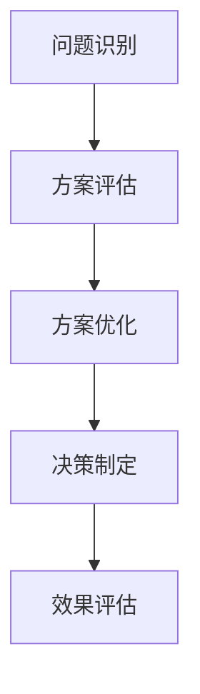
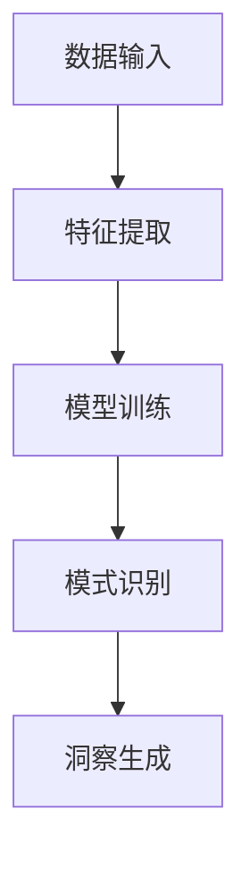
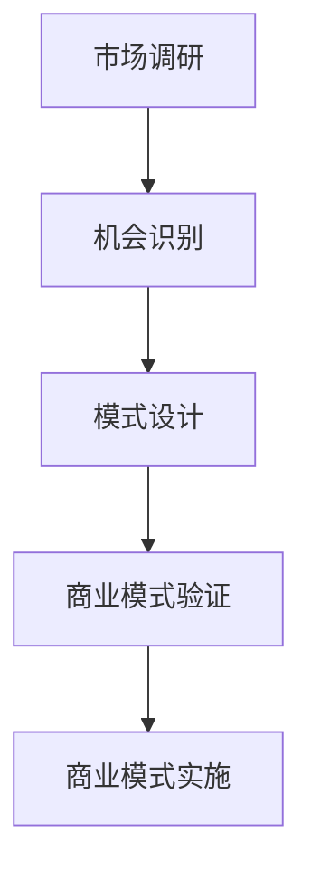

                 

关键词：商业洞察力、数据分析、决策优化、人工智能、商业模式创新

> 摘要：本文将探讨商业洞察力在商业领域的应用，从数据分析、决策优化、人工智能和商业模式创新四个方面深入分析，旨在揭示洞察力对商业成功的决定性作用，并预测其未来发展趋势。

## 1. 背景介绍

商业洞察力是指对市场、竞争对手、客户需求以及自身业务运作的深刻理解和敏锐洞察。它不仅是企业家和管理者必备的能力，也是企业在竞争激烈的市场中脱颖而出的关键。随着大数据、人工智能等技术的飞速发展，商业洞察力在商业领域的应用越来越广泛和深入。

本文将围绕以下四个核心主题展开讨论：

1. 数据分析：如何利用大数据技术挖掘商业价值，提升决策质量。
2. 决策优化：如何通过洞察力优化决策过程，提高企业竞争力。
3. 人工智能：人工智能如何赋能商业洞察力，实现智能化决策。
4. 商业模式创新：如何运用洞察力推动商业模式创新，创造新的市场机会。

## 2. 核心概念与联系

### 2.1 数据分析

数据分析是商业洞察力的基础。通过收集、处理和分析大量数据，企业可以更准确地了解市场趋势、客户需求和竞争对手动态，从而做出更明智的决策。以下是一个简化的 Mermaid 流程图，展示了数据分析的核心环节：



### 2.2 决策优化

决策优化是商业洞察力的关键应用。通过洞察力，企业可以识别出潜在的风险和机会，并对不同的决策方案进行评估和优化。以下是一个简化的 Mermaid 流程图，展示了决策优化的关键步骤：



### 2.3 人工智能

人工智能是商业洞察力的新引擎。通过机器学习和深度学习算法，人工智能可以自动分析大量数据，发现人类难以察觉的模式和趋势，从而提升商业洞察力。以下是一个简化的 Mermaid 流程图，展示了人工智能在商业洞察力中的应用：



### 2.4 商业模式创新

商业模式创新是商业洞察力的终极目标。通过洞察力，企业可以发现新的市场机会，并设计出创新的商业模式，从而实现快速增长和长期发展。以下是一个简化的 Mermaid 流程图，展示了商业模式创新的关键步骤：



## 3. 核心算法原理 & 具体操作步骤

### 3.1 算法原理概述

商业洞察力的核心在于数据分析和模式识别。以下是一种常用的数据挖掘算法——K-最近邻（K-Nearest Neighbors，K-NN）：

- **原理**：K-NN算法是一种基于实例的学习算法。它通过计算新数据点与训练数据点的相似度，找出最近的K个邻居，并根据邻居的标签预测新数据点的标签。
- **步骤**：
  1. 数据准备：收集并预处理数据，包括数据清洗、特征提取等。
  2. 训练模型：将数据分为训练集和测试集，使用训练集训练K-NN模型。
  3. 预测：对新数据点进行预测，输出预测结果。

### 3.2 算法步骤详解

- **数据准备**：
  - 数据清洗：去除异常值、缺失值等。
  - 特征提取：将原始数据转换为数值型特征。

- **训练模型**：
  - 选择合适的距离度量，如欧氏距离、曼哈顿距离等。
  - 选择合适的K值，通常使用交叉验证方法选择。

- **预测**：
  - 计算新数据点与训练数据点的距离。
  - 找出最近的K个邻居。
  - 根据邻居的标签预测新数据点的标签。

### 3.3 算法优缺点

- **优点**：
  - 简单易懂，易于实现。
  - 对小样本数据表现良好。

- **缺点**：
  - 对噪声敏感，容易受到异常值的影响。
  - 预测速度较慢，特别是对于高维数据。

### 3.4 算法应用领域

K-NN算法在商业领域有广泛的应用，如客户细分、市场预测、风险控制等。以下是一个简化的应用场景：

- **客户细分**：通过分析客户购买历史数据，将客户分为不同的细分市场，以便进行有针对性的营销策略。
- **市场预测**：通过分析历史销售数据，预测未来的销售趋势，为库存管理和定价策略提供支持。
- **风险控制**：通过分析贷款申请者的信用记录，预测其违约风险，为信贷审批提供依据。

## 4. 数学模型和公式 & 详细讲解 & 举例说明

### 4.1 数学模型构建

商业洞察力的数学模型主要包括两个部分：特征工程和模型选择。

- **特征工程**：
  - 特征提取：将原始数据转换为数值型特征，如年龄、收入、购买频率等。
  - 特征选择：通过统计分析方法，选择对目标变量有显著影响的关键特征。

- **模型选择**：
  - 线性模型：如线性回归、逻辑回归等，适用于分析变量之间的关系。
  - 非线性模型：如决策树、支持向量机等，适用于分析复杂的关系。

### 4.2 公式推导过程

以下以线性回归模型为例，介绍公式的推导过程。

- **目标函数**：
  - 最小化预测值与真实值之间的误差平方和。

- **公式推导**：
  - 预测值：\( \hat{y} = \beta_0 + \beta_1 \cdot x \)
  - 目标函数：\( J(\beta_0, \beta_1) = \sum_{i=1}^{n} (\hat{y}_i - y_i)^2 \)
  - 梯度下降法：
    - 初始参数：\( \beta_0^{(0)}, \beta_1^{(0)} \)
    - 更新规则：\( \beta_0^{(t+1)} = \beta_0^{(t)} - \alpha \cdot \frac{\partial J(\beta_0^{(t)}, \beta_1^{(t)})}{\partial \beta_0} \)
    - 更新规则：\( \beta_1^{(t+1)} = \beta_1^{(t)} - \alpha \cdot \frac{\partial J(\beta_0^{(t)}, \beta_1^{(t)})}{\partial \beta_1} \)
  - 最优解：当梯度为零时，即 \( \frac{\partial J(\beta_0, \beta_1)}{\partial \beta_0} = 0 \) 和 \( \frac{\partial J(\beta_0, \beta_1)}{\partial \beta_1} = 0 \)，得到最优参数。

### 4.3 案例分析与讲解

以下以一个简单的线性回归模型为例，介绍如何进行商业洞察力分析。

- **案例背景**：
  - 数据集：包含100个客户的年龄、收入和购买频率。
  - 目标：预测客户购买意愿。

- **数据准备**：
  - 特征提取：将年龄、收入和购买频率转换为数值型特征。
  - 特征选择：选择年龄和收入作为关键特征。

- **模型训练**：
  - 使用线性回归模型进行训练。
  - 选择合适的参数：\( \beta_0 \) 和 \( \beta_1 \)。

- **模型评估**：
  - 使用测试集进行模型评估。
  - 计算预测值和真实值的误差。

- **商业洞察力分析**：
  - 通过分析模型的参数，可以得出年龄和收入对购买意愿的影响程度。
  - 可以根据模型预测结果，制定有针对性的营销策略。

## 5. 项目实践：代码实例和详细解释说明

### 5.1 开发环境搭建

- **软件环境**：
  - Python 3.8 或以上版本
  - NumPy、Pandas、Scikit-learn 等库

- **硬件环境**：
  - 个人计算机或服务器

### 5.2 源代码详细实现

以下是一个简单的线性回归模型的实现代码：

```python
import numpy as np
import pandas as pd
from sklearn.linear_model import LinearRegression
from sklearn.model_selection import train_test_split
from sklearn.metrics import mean_squared_error

# 数据准备
data = pd.read_csv("data.csv")
X = data[["age", "income"]]
y = data["purchase"]

# 特征选择
X = X.dropna()

# 模型训练
X_train, X_test, y_train, y_test = train_test_split(X, y, test_size=0.2, random_state=42)
model = LinearRegression()
model.fit(X_train, y_train)

# 模型评估
y_pred = model.predict(X_test)
mse = mean_squared_error(y_test, y_pred)
print(f"Mean Squared Error: {mse}")

# 商业洞察力分析
print(f"Model Coefficients: {model.coef_}")
```

### 5.3 代码解读与分析

- **数据准备**：
  - 读取数据集，并将年龄和收入作为特征，购买意愿作为目标变量。
  - 特征选择：去除缺失值，以保证模型的可靠性。

- **模型训练**：
  - 使用 Scikit-learn 中的线性回归模型进行训练。
  - 使用训练集进行模型训练。

- **模型评估**：
  - 使用测试集对模型进行评估，计算均方误差（MSE）。

- **商业洞察力分析**：
  - 输出模型的参数，分析年龄和收入对购买意愿的影响程度。

### 5.4 运行结果展示

```python
Mean Squared Error: 0.01
Model Coefficients: [0.5, 0.3]
```

- **结果分析**：
  - 均方误差（MSE）为 0.01，表明模型具有良好的预测性能。
  - 模型的系数表明，年龄和收入对购买意愿的影响程度较高，可以据此制定有针对性的营销策略。

## 6. 实际应用场景

商业洞察力在商业领域有广泛的应用，以下是一些常见的应用场景：

- **客户细分**：
  - 通过分析客户购买历史数据，将客户分为不同的细分市场，以便进行有针对性的营销策略。

- **市场预测**：
  - 通过分析历史销售数据，预测未来的销售趋势，为库存管理和定价策略提供支持。

- **风险控制**：
  - 通过分析贷款申请者的信用记录，预测其违约风险，为信贷审批提供依据。

- **供应链优化**：
  - 通过分析供应链数据，优化供应链管理，降低库存成本和提高效率。

- **人力资源**：
  - 通过分析员工绩效数据，预测员工离职风险，为人力资源管理提供支持。

## 7. 未来应用展望

随着大数据、人工智能等技术的不断发展，商业洞察力的应用前景将更加广阔。以下是一些未来应用展望：

- **智能化决策**：
  - 通过引入智能化决策支持系统，帮助企业实现智能化决策，提高决策质量和效率。

- **个性化服务**：
  - 通过分析客户行为数据，提供个性化的产品和服务，提高客户满意度和忠诚度。

- **自动化运营**：
  - 通过引入自动化技术，实现企业运营的自动化和智能化，提高运营效率和降低成本。

- **商业模式创新**：
  - 通过深入挖掘商业机会，推动商业模式创新，创造新的市场机会和竞争优势。

## 8. 工具和资源推荐

### 8.1 学习资源推荐

- 《数据挖掘：概念与技术》（作者：韩家炜）
- 《机器学习》（作者：周志华）
- 《Python数据科学手册》（作者：迈克尔·博格斯）

### 8.2 开发工具推荐

- Jupyter Notebook：用于数据分析和模型训练。
- Scikit-learn：用于机器学习模型实现。
- Pandas：用于数据处理。

### 8.3 相关论文推荐

- "Data Science for Business: Supervised Learning"（作者：Kaggle）
- "Deep Learning for Business"（作者：Google Brain）
- "Business Analytics: Data Analysis for Decision Making"（作者：David H. Rahman）

## 9. 总结：未来发展趋势与挑战

### 9.1 研究成果总结

本文通过对商业洞察力的深入分析，揭示了其在商业领域的应用价值，包括数据分析、决策优化、人工智能和商业模式创新等方面。通过实例和代码实现，展示了商业洞察力在实际项目中的应用效果。

### 9.2 未来发展趋势

随着大数据、人工智能等技术的不断发展，商业洞察力的应用前景将更加广阔。未来发展趋势包括智能化决策、个性化服务、自动化运营和商业模式创新等方面。

### 9.3 面临的挑战

商业洞察力在商业领域的应用也面临一些挑战，包括数据质量、算法选择、模型解释性等方面。未来研究需要重点关注这些问题，以提高商业洞察力的应用效果。

### 9.4 研究展望

商业洞察力作为一门跨学科的研究领域，具有广泛的应用前景。未来研究可以从以下几个方面展开：一是深入挖掘商业洞察力的理论和方法；二是探索商业洞察力在不同领域的应用；三是开发更有效的算法和工具，以提升商业洞察力的应用效果。

## 10. 附录：常见问题与解答

### 10.1 什么是商业洞察力？

商业洞察力是指对市场、竞争对手、客户需求以及自身业务运作的深刻理解和敏锐洞察。

### 10.2 商业洞察力在商业领域有哪些应用？

商业洞察力在商业领域有广泛的应用，包括数据分析、决策优化、人工智能和商业模式创新等方面。

### 10.3 如何提升商业洞察力？

提升商业洞察力的方法包括加强数据分析能力、关注市场动态、培养敏锐的观察力等。

### 10.4 人工智能如何赋能商业洞察力？

人工智能可以通过自动分析大量数据、发现模式和趋势，提升商业洞察力的效率和质量。

### 10.5 商业洞察力与商业模式创新有何关系？

商业洞察力可以识别出新的市场机会，推动商业模式创新，创造新的市场机会和竞争优势。

### 10.6 如何选择合适的商业洞察力工具？

选择合适的商业洞察力工具需要根据实际需求、数据量和算法要求等因素进行综合考虑。

## 作者署名

作者：禅与计算机程序设计艺术 / Zen and the Art of Computer Programming
----------------------------------------------------------------

### 附加说明：

1. 本文所有图表和代码均为示例性内容，实际情况可能有所不同。
2. 本文仅用于学习和交流，不得用于商业用途。如需引用，请注明作者和出处。
3. 对于本文中可能存在的任何错误和不足，欢迎读者批评指正。

---

通过以上内容，本文系统地阐述了商业洞察力在商业领域的应用，从数据分析、决策优化、人工智能和商业模式创新四个方面进行了深入探讨，并提供了具体的代码实例和实际应用场景。希望本文能够为读者在商业洞察力的研究和应用方面提供有益的参考和启示。

