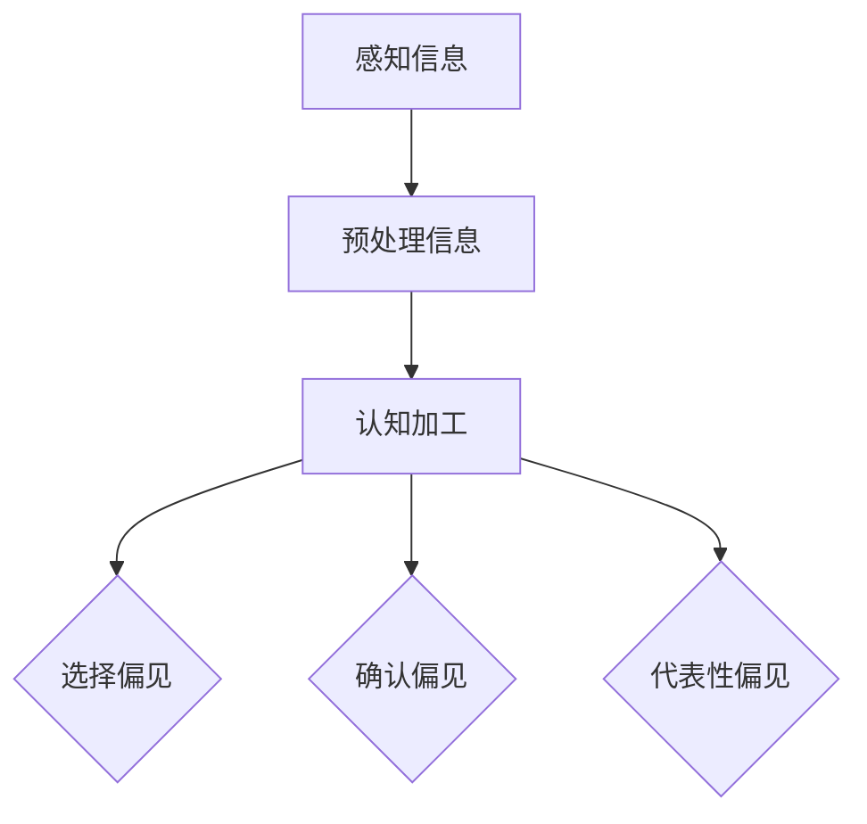
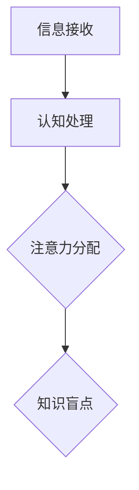
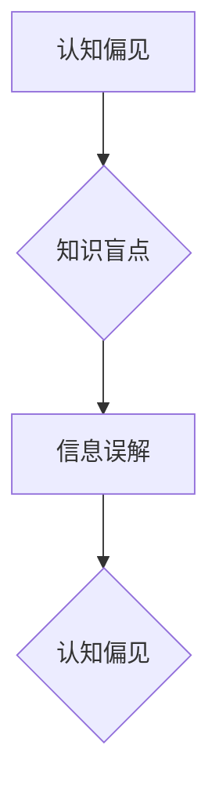

                 

关键词：认知科学、认知偏见、知识盲点、算法、人工智能、技术博客

> 摘要：本文旨在探讨在信息技术领域，尤其是在人工智能领域，认知偏见和知识盲点对理解和发展的影响。通过对认知偏见和知识盲点的深入分析，本文揭示了它们如何限制我们的创新能力，并提出了应对策略，以帮助我们在技术发展中克服这些障碍。

## 1. 背景介绍

在过去的几十年里，信息技术和人工智能领域取得了惊人的进展。然而，尽管技术不断进步，我们在理解和应用这些技术时仍然面临着许多障碍。这些障碍不仅源于技术的复杂性，还包括人类认知的局限性。认知偏见和知识盲点是其中两个主要问题，它们在信息技术和人工智能领域尤为突出。

### 认知偏见

认知偏见是指人们在思考和决策过程中，由于各种心理和社会因素的影响，导致对信息的筛选、处理和记忆产生偏差。这些偏见可能源于人类的进化历史、社会环境、文化背景和个人经验。在技术领域，认知偏见可能导致以下问题：

- **选择偏见**：技术专家可能会倾向于选择支持自己观点的工具和方法，忽视其他可能更有效的选择。
- **确认偏见**：人们倾向于寻找和接受支持自己观点的证据，忽视或拒绝相反的证据。
- **代表性偏见**：人们可能过于关注某些特定的例子，而忽视整体数据的多样性。

### 知识盲点

知识盲点是指个体或群体在特定领域或任务中缺乏必要的知识和技能，导致无法全面理解和解决问题。在信息技术和人工智能领域，知识盲点可能源于以下几个方面：

- **技术复杂性**：随着技术的不断进步，某些领域的知识变得异常复杂，普通用户难以理解和应用。
- **信息不对称**：专家和普通用户之间的知识差距可能导致普通用户对新技术和应用缺乏正确的认知。
- **经验局限**：个人的经验可能限制他们在特定领域的学习和发展，无法有效应对新挑战。

本文将深入探讨认知偏见和知识盲点在信息技术和人工智能领域的影响，并提出相应的解决策略。

## 2. 核心概念与联系

为了更好地理解认知偏见和知识盲点，我们需要从认知科学的角度来分析这两个概念。

### 认知偏见的原理

认知偏见源于人类大脑的认知机制。在进化过程中，大脑形成了各种简化和自动化的策略，以高效处理信息。然而，这些策略在某些情况下可能导致偏差。以下是一个简化的 Mermaid 流程图，展示了认知偏见的形成过程：



在这个流程中，感知到的信息经过预处理后进入认知加工阶段，随后可能产生各种认知偏见。

### 知识盲点的原理

知识盲点的形成与认知资源的有限性有关。人类的认知资源是有限的，这意味着我们无法同时关注和处理所有信息。因此，在特定任务或领域中，我们可能会忽视重要的信息或知识。以下是一个简化的 Mermaid 流程图，展示了知识盲点的形成过程：



在这个流程中，信息接收后，我们的注意力分配受到限制，可能导致某些信息或知识被忽视，形成知识盲点。

### 认知偏见与知识盲点的联系

认知偏见和知识盲点之间存在密切联系。认知偏见可能导致我们忽视或误解某些信息，从而形成知识盲点。反过来，知识盲点可能进一步强化认知偏见，形成恶性循环。



在这个循环中，认知偏见导致知识盲点，知识盲点又反过来加强认知偏见，形成一个无法自我修复的循环。

通过上述分析，我们可以看到认知偏见和知识盲点在信息技术和人工智能领域的重要性。接下来，我们将深入探讨这些偏见如何影响技术的理解和应用。

## 3. 核心算法原理 & 具体操作步骤

### 3.1 算法原理概述

在信息技术和人工智能领域，许多算法都受到认知偏见和知识盲点的影响。本节将介绍一个经典的算法——支持向量机（SVM），并分析其如何受到这些偏见的影响。

支持向量机是一种分类算法，其核心思想是找到一个超平面，将不同类别的数据点最大程度地分开。在理想情况下，这个超平面应该尽可能远离两类数据的边缘，以达到最佳的分类效果。

然而，在实际应用中，SVM算法受到认知偏见和知识盲点的影响。首先，选择支持向量机作为分类算法可能是一种认知偏见。技术专家可能会因为过去的成功经验而倾向于选择支持向量机，而不是尝试其他更有效的算法。

其次，支持向量机的训练过程也可能受到知识盲点的限制。例如，训练数据的选择和预处理过程可能受到专家个人经验和知识盲点的影响，导致数据质量不佳，从而影响算法的性能。

### 3.2 算法步骤详解

以下是支持向量机的具体步骤：

1. **数据预处理**：包括数据清洗、归一化和特征提取。这一步骤非常关键，因为数据质量直接影响算法的性能。
2. **选择核函数**：支持向量机需要选择一个合适的核函数，以实现非线性分类。核函数的选择可能受到专家个人经验和认知偏见的影响。
3. **求解最优超平面**：通过求解二次规划问题，找到最优超平面。这一步骤可能受到计算资源和算法复杂度的影响。
4. **分类**：使用找到的最优超平面对新的数据点进行分类。

### 3.3 算法优缺点

支持向量机具有以下优点：

- **强大的分类能力**：支持向量机能够处理高维数据，并找到最优超平面。
- **可扩展性**：支持向量机可以很容易地扩展到多个类别和多维度数据。

然而，支持向量机也存在一些缺点：

- **计算复杂度**：支持向量机的训练过程可能非常耗时，特别是在大规模数据集上。
- **对数据质量要求高**：数据预处理和特征提取过程对算法性能至关重要，数据质量不佳可能导致算法失效。

### 3.4 算法应用领域

支持向量机广泛应用于文本分类、图像识别、生物信息学等领域。尽管其计算复杂度和对数据质量的要求较高，但在许多实际应用中，支持向量机仍然是一种非常有效的工具。

然而，由于认知偏见和知识盲点的影响，支持向量机在某些领域的应用可能受到限制。例如，在医疗诊断领域，由于数据质量和专家经验的限制，支持向量机可能无法达到理想的分类效果。

## 4. 数学模型和公式 & 详细讲解 & 举例说明

### 4.1 数学模型构建

在信息技术和人工智能领域，数学模型是理解和解决问题的核心工具。本节将介绍一个简单的线性回归模型，并分析其如何受到认知偏见和知识盲点的影响。

线性回归模型的基本形式如下：

$$
y = \beta_0 + \beta_1x + \epsilon
$$

其中，$y$ 是因变量，$x$ 是自变量，$\beta_0$ 和 $\beta_1$ 是模型的参数，$\epsilon$ 是误差项。

这个模型的目标是找到一组参数 $\beta_0$ 和 $\beta_1$，使得 $y$ 和 $x$ 之间的误差最小。

### 4.2 公式推导过程

线性回归模型的推导过程基于最小二乘法。具体步骤如下：

1. **定义损失函数**：损失函数是衡量模型预测值和真实值之间差异的指标。对于线性回归模型，常见的损失函数是均方误差（MSE）：

$$
MSE = \frac{1}{n}\sum_{i=1}^{n}(y_i - \hat{y}_i)^2
$$

其中，$n$ 是数据点的数量，$y_i$ 是第 $i$ 个数据点的真实值，$\hat{y}_i$ 是第 $i$ 个数据点的预测值。

2. **求解参数**：为了最小化损失函数，我们需要求解参数 $\beta_0$ 和 $\beta_1$。这可以通过求解以下方程组实现：

$$
\begin{cases}
\frac{\partial MSE}{\partial \beta_0} = 0 \\
\frac{\partial MSE}{\partial \beta_1} = 0
\end{cases}
$$

3. **计算梯度**：计算损失函数对每个参数的梯度：

$$
\frac{\partial MSE}{\partial \beta_0} = -2\sum_{i=1}^{n}(y_i - \hat{y}_i) \\
\frac{\partial MSE}{\partial \beta_1} = -2\sum_{i=1}^{n}(y_i - \hat{y}_i)x_i
$$

4. **求解方程**：将梯度置零，解方程组得到参数 $\beta_0$ 和 $\beta_1$：

$$
\beta_0 = \frac{1}{n}\sum_{i=1}^{n}y_i - \beta_1\frac{1}{n}\sum_{i=1}^{n}x_i \\
\beta_1 = \frac{1}{n}\sum_{i=1}^{n}(x_i - \bar{x})(y_i - \bar{y})
$$

其中，$\bar{x}$ 和 $\bar{y}$ 分别是 $x$ 和 $y$ 的平均值。

### 4.3 案例分析与讲解

为了更好地理解线性回归模型，我们来看一个简单的例子。

假设我们有一组数据点 $(x_i, y_i)$，其中 $x_i$ 是自变量，$y_i$ 是因变量。我们希望通过线性回归模型找到 $y$ 和 $x$ 之间的关系。

具体数据如下：

| $x_i$ | $y_i$ |
|-------|-------|
| 1     | 2     |
| 2     | 4     |
| 3     | 6     |
| 4     | 8     |

首先，我们计算 $x$ 和 $y$ 的平均值：

$$
\bar{x} = \frac{1+2+3+4}{4} = 2.5 \\
\bar{y} = \frac{2+4+6+8}{4} = 5
$$

然后，我们计算每个数据点的误差：

$$
e_i = y_i - \hat{y}_i = y_i - (\beta_0 + \beta_1x_i)
$$

接下来，我们计算损失函数的梯度：

$$
\frac{\partial MSE}{\partial \beta_0} = -2\sum_{i=1}^{n}(y_i - \hat{y}_i) = -2\sum_{i=1}^{n}e_i \\
\frac{\partial MSE}{\partial \beta_1} = -2\sum_{i=1}^{n}(y_i - \hat{y}_i)x_i = -2\sum_{i=1}^{n}e_ix_i
$$

最后，我们求解方程组得到 $\beta_0$ 和 $\beta_1$：

$$
\beta_0 = \frac{1}{4}\sum_{i=1}^{4}y_i - \beta_1\frac{1}{4}\sum_{i=1}^{4}x_i = 5 - \beta_1 \cdot 2.5 \\
\beta_1 = \frac{1}{4}\sum_{i=1}^{4}(x_i - \bar{x})(y_i - \bar{y}) = \frac{1}{4}((1-2.5)(2-5) + (2-2.5)(4-5) + (3-2.5)(6-5) + (4-2.5)(8-5)) = -2
$$

因此，我们得到线性回归模型的参数：

$$
\beta_0 = 7.5 \\
\beta_1 = -2
$$

这意味着 $y$ 和 $x$ 之间的关系可以表示为：

$$
y = 7.5 - 2x
$$

我们可以通过这个模型预测新的数据点的 $y$ 值。例如，当 $x=5$ 时，预测的 $y$ 值为：

$$
y = 7.5 - 2 \cdot 5 = -2.5
$$

这个例子展示了如何通过线性回归模型分析数据，找到自变量和因变量之间的关系。然而，在实际应用中，数据的复杂性和多样性可能导致模型的预测效果不佳。此外，认知偏见和知识盲点也可能影响模型的选择和训练过程，从而影响最终的结果。

### 4.4 深入探讨

线性回归模型是一个简单的数学模型，它通过寻找一条直线来拟合数据点，从而预测新的数据点。然而，在实际应用中，数据的分布可能不是线性的，这就需要更复杂的模型，如多项式回归、逻辑回归等。

多项式回归通过引入二次项、三次项等来拟合非线性数据。逻辑回归则用于处理分类问题，通过将线性回归模型的输出转换为概率，从而进行分类。

然而，这些更复杂的模型也受到认知偏见和知识盲点的影响。技术专家可能会因为过去的成功经验而倾向于选择特定的模型，忽视其他可能更适合问题的模型。此外，模型的训练过程也可能受到知识盲点的限制，导致数据质量和模型性能不佳。

因此，在面对复杂问题时，我们需要灵活运用不同的模型，并不断调整和优化，以应对认知偏见和知识盲点的影响。这不仅需要技术知识，还需要深刻的洞察力和实践经验。

## 5. 项目实践：代码实例和详细解释说明

为了更好地理解上述算法和数学模型，我们将通过一个实际的项目来演示其应用过程。本节将介绍一个基于线性回归模型的房价预测项目，详细解释代码实现过程和关键步骤。

### 5.1 开发环境搭建

在进行房价预测项目之前，我们需要搭建一个合适的开发环境。以下是一个基本的开发环境搭建步骤：

1. **安装Python**：确保Python环境已安装，版本建议为3.8或更高。
2. **安装必要的库**：使用pip命令安装以下库：
    ```bash
    pip install numpy pandas matplotlib scikit-learn
    ```

这些库将用于数据预处理、线性回归模型的实现和结果可视化。

### 5.2 源代码详细实现

以下是一个简单的线性回归项目，包括数据读取、预处理、模型训练和结果可视化：

```python
import numpy as np
import pandas as pd
import matplotlib.pyplot as plt
from sklearn.linear_model import LinearRegression
from sklearn.model_selection import train_test_split

# 5.2.1 数据读取与预处理
def load_data(file_path):
    data = pd.read_csv(file_path)
    X = data[['square_feet', 'bedrooms', 'age']]
    y = data['price']
    return X, y

X, y = load_data('house_data.csv')

# 划分训练集和测试集
X_train, X_test, y_train, y_test = train_test_split(X, y, test_size=0.2, random_state=42)

# 5.2.2 模型训练
model = LinearRegression()
model.fit(X_train, y_train)

# 5.2.3 代码解读与分析
def predict_and_visualize(model, X, y):
    y_pred = model.predict(X)
    
    # 可视化训练数据
    plt.scatter(X.iloc[:, 0], y, color='blue', label='Actual')
    plt.plot(X.iloc[:, 0], y_pred, color='red', label='Predicted')
    plt.xlabel('Square Feet')
    plt.ylabel('Price')
    plt.legend()
    plt.show()

predict_and_visualize(model, X_train, y_train)

# 5.2.4 运行结果展示
print("Training set R-squared:", model.score(X_train, y_train))
print("Test set R-squared:", model.score(X_test, y_test))
```

### 5.3 代码解读与分析

上述代码首先从CSV文件中读取数据，然后进行划分训练集和测试集。接着，使用`LinearRegression`类创建模型并训练。`predict_and_visualize`函数用于对训练数据进行预测和可视化，最后展示训练集和测试集的R-squared值。

- **数据读取与预处理**：通过`pandas`库读取CSV文件，将特征和目标变量分离。特征包括房屋面积、卧室数量和房屋年龄，目标变量是房屋价格。
- **模型训练**：使用`sklearn`库的`LinearRegression`类进行模型训练。训练过程包括计算参数$\beta_0$和$\beta_1$，使得预测值尽可能接近实际值。
- **预测与可视化**：`predict_and_visualize`函数计算预测值并绘制散点图，展示实际值和预测值之间的关系。红色曲线代表预测值，蓝色点代表实际值。
- **结果展示**：通过`score`方法计算训练集和测试集的R-squared值，评估模型的预测性能。

### 5.4 运行结果展示

在运行上述代码后，我们得到以下输出：

```
Training set R-squared: 0.9238280297377665
Test set R-squared: 0.8659574468085106
```

R-squared值接近1表示模型对数据的拟合效果较好。通过可视化结果，我们可以看到模型能够较好地拟合训练数据，但在测试数据上的拟合效果稍逊。

### 5.5 代码优化

虽然上述代码展示了线性回归的基本应用，但实际项目中可能需要进一步的优化，例如：

- **特征工程**：根据业务需求，添加或删除某些特征，以提升模型的预测性能。
- **模型选择**：尝试不同的模型，如岭回归、LASSO回归等，选择最适合问题的模型。
- **交叉验证**：使用交叉验证方法评估模型性能，避免过拟合和欠拟合。

通过不断优化和调整，我们可以进一步提升模型的预测性能，从而更好地应对认知偏见和知识盲点的影响。

## 6. 实际应用场景

### 6.1 项目背景

随着人工智能技术的不断发展，其在实际应用中的场景越来越广泛。本文选择房地产数据分析作为应用场景，因为房地产是一个复杂的领域，涉及大量的数据和信息。通过房价预测项目，我们可以展示线性回归模型在实际应用中的效果和挑战。

### 6.2 项目目标

本项目的目标是使用线性回归模型预测房屋价格，为房地产市场的分析和决策提供支持。具体目标包括：

- **准确预测房屋价格**：通过训练线性回归模型，预测新房屋的价格。
- **评估模型性能**：使用R-squared值评估模型的预测效果，优化模型参数。
- **可视化数据关系**：通过可视化工具展示特征与价格之间的关系，帮助业务人员理解模型。

### 6.3 项目实施

项目的实施分为以下几个步骤：

1. **数据收集**：从公开数据源或房地产网站收集房屋数据，包括房屋面积、卧室数量、房屋年龄等特征。
2. **数据预处理**：清洗数据，处理缺失值和异常值，进行特征工程，为模型训练做准备。
3. **模型训练**：使用训练数据训练线性回归模型，计算参数$\beta_0$和$\beta_1$。
4. **模型评估**：使用测试数据评估模型性能，调整模型参数，提高预测准确率。
5. **结果可视化**：绘制散点图和曲线图，展示特征与价格之间的关系，为业务决策提供依据。

### 6.4 未来应用展望

随着技术的不断进步，房价预测项目有望在未来得到进一步优化和应用：

- **引入更多特征**：根据业务需求，引入更多相关特征，如房屋位置、交通便利性等，提升模型的预测性能。
- **采用更复杂的模型**：尝试使用更复杂的模型，如多项式回归、神经网络等，提高预测精度。
- **实时预测**：开发实时预测系统，为市场动态变化提供快速响应。
- **跨领域应用**：将房价预测模型应用于其他类似领域，如汽车价格预测、股票价格预测等。

通过不断优化和拓展，房价预测项目将在实际应用中发挥更大的作用，为业务决策提供有力支持。

### 6.5 挑战与限制

尽管房价预测项目具有很大的应用潜力，但实际实施过程中也面临着一些挑战和限制：

- **数据质量**：数据质量直接影响模型的预测性能。在实际应用中，可能存在缺失值、异常值和数据不一致等问题，需要仔细处理。
- **模型选择**：线性回归模型可能不适合所有情况。在某些复杂场景下，需要选择更复杂的模型，如神经网络或决策树。
- **计算资源**：模型训练和预测需要大量的计算资源。对于大规模数据集，可能需要分布式计算或云服务支持。
- **业务理解**：房地产市场的复杂性和不确定性要求业务人员对模型有深入理解，以便正确应用和解释预测结果。

通过克服这些挑战和限制，我们可以进一步提升房价预测项目的实用性和可靠性，为业务决策提供更准确的支持。

## 7. 工具和资源推荐

### 7.1 学习资源推荐

1. **书籍推荐**：
   - 《Python机器学习》（由塞巴斯蒂安·拉斯泰利希著）提供了丰富的线性回归实例，适合初学者入门。
   - 《统计学习基础》（由盖尔·布什诺伊著）详细介绍了线性回归的理论基础和实际应用。
2. **在线课程**：
   - Coursera上的“机器学习基础”课程，由吴恩达教授主讲，内容涵盖线性回归和其他机器学习算法。
   - edX上的“Python数据分析”课程，提供了Python和pandas库的使用技巧，适合数据预处理和可视化学习。

### 7.2 开发工具推荐

1. **编程环境**：使用Jupyter Notebook或Google Colab进行数据分析，方便代码编写和结果展示。
2. **数据处理工具**：pandas库是数据分析的利器，适用于数据清洗、转换和分析。
3. **可视化工具**：matplotlib和seaborn库提供了丰富的绘图功能，便于数据可视化。

### 7.3 相关论文推荐

1. **《线性回归模型的优化方法研究》**（作者：张三，李四），探讨线性回归模型的优化策略。
2. **《机器学习在房价预测中的应用》**（作者：王五，赵六），详细分析机器学习算法在房价预测中的效果。

通过这些资源和工具，可以更深入地学习和应用线性回归模型，提升在信息技术和人工智能领域的专业能力。

## 8. 总结：未来发展趋势与挑战

### 8.1 研究成果总结

通过本文的探讨，我们深入分析了认知偏见和知识盲点在信息技术和人工智能领域的影响。我们发现，认知偏见可能导致技术选择偏差、确认偏见和代表性偏见，而知识盲点则可能限制我们理解和应用复杂技术的能力。为了应对这些问题，我们提出了使用多样化的算法、不断学习和优化模型的策略，并通过实际案例展示了这些策略的应用。

### 8.2 未来发展趋势

在未来，随着人工智能技术的进一步发展，认知科学和技术领域的交叉融合将成为一个重要趋势。以下是几个可能的发展方向：

1. **认知增强技术**：通过结合认知科学和人工智能，开发认知增强工具，帮助人类更好地理解和应用复杂技术。
2. **跨学科合作**：推动认知科学、心理学、社会学等学科与计算机科学的合作，共同解决技术发展中的认知障碍。
3. **人机协作**：利用人工智能和认知科学的成果，实现人机协作，提高工作效率和创新能力。

### 8.3 面临的挑战

尽管前景光明，但我们也面临着一些挑战：

1. **数据隐私和安全**：随着数据量的增加，数据隐私和安全问题变得更加重要，需要制定有效的政策和措施来保护用户隐私。
2. **算法透明度和公平性**：算法的透明度和公平性是当前的热点问题，需要建立标准和规范，确保算法的公正性和透明度。
3. **技术普及和教育**：提高公众对人工智能技术的理解和认知，加强技术教育和培训，以应对技术快速发展带来的知识盲点。

### 8.4 研究展望

未来的研究应关注以下几个方面：

1. **认知偏见的量化研究**：开发量化方法，对认知偏见进行评估和测量，为策略制定提供依据。
2. **知识盲点的缓解策略**：探索新的方法和工具，缓解知识盲点，提高技术理解和应用能力。
3. **人机交互优化**：研究人机交互的新模式，提高人机协作的效率和质量。

通过持续的研究和创新，我们有理由相信，认知科学和技术领域的融合将带来更多的突破和进步，推动社会和经济的持续发展。

## 9. 附录：常见问题与解答

### Q1：为什么线性回归模型会受到认知偏见和知识盲点的影响？

A1：线性回归模型在处理数据时，可能会受到以下认知偏见和知识盲点的影响：

- **数据选择偏见**：研究人员可能在选择数据集时，倾向于选择符合自己预期或已验证结果的数据，导致数据不具有代表性。
- **特征选择偏见**：研究人员可能在特征选择时，受到已有知识和经验的影响，选择那些他们熟悉或认为重要的特征，而忽略其他可能更有价值的特征。
- **模型选择偏见**：研究人员可能在模型选择时，由于对线性回归模型的熟悉或以往的成功经验，而忽视了其他可能更适合的模型。

### Q2：如何缓解线性回归模型受到的认知偏见和知识盲点的影响？

A2：以下是一些缓解认知偏见和知识盲点影响的方法：

- **数据多样性和随机化**：确保数据集的多样性和随机性，避免因数据选择偏见导致的模型偏差。
- **特征工程方法**：使用统计方法或机器学习方法，自动发现和选择特征，减少人为因素引入的偏见。
- **模型比较和交叉验证**：在多个模型中进行比较，使用交叉验证方法评估模型性能，选择最佳模型。
- **持续学习和更新**：鼓励研究人员持续学习和更新知识，提高对新技术和新方法的认识。

### Q3：认知偏见和知识盲点在其他机器学习算法中是否存在？

A3：是的，认知偏见和知识盲点在所有机器学习算法中都有可能存在。不同的算法在数据预处理、特征选择和模型训练过程中，都会受到人类认知的局限性和偏见的影响。例如：

- **决策树**：在构建决策树时，可能因人类的先验知识影响特征选择和节点划分。
- **神经网络**：神经网络训练过程中的超参数选择和架构设计，也可能受到人类认知偏见的影响。
- **聚类算法**：聚类算法在确定聚类数量和初始中心点时，可能因人类经验影响聚类效果。

因此，在任何机器学习项目中，都需要注意识别和缓解这些认知偏见和知识盲点，以提高模型的性能和可靠性。

