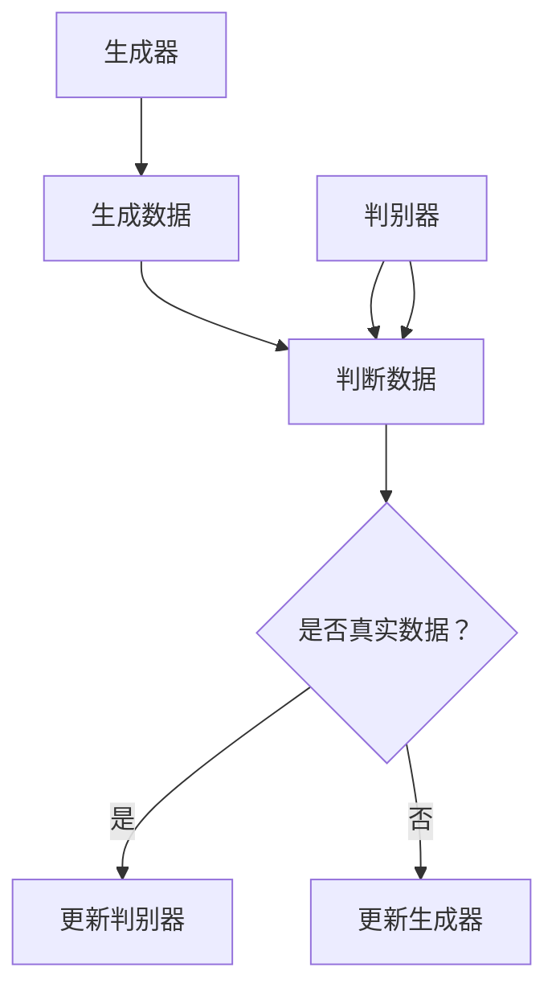

                 

关键词：生成对抗网络、GAN、深度学习、图像生成、算法原理、数学模型、应用领域、未来展望

摘要：生成对抗网络（Generative Adversarial Network，GAN）是一种先进的深度学习模型，它在图像生成、数据增强、风格迁移等领域展现出了卓越的性能。本文将对GAN的核心概念、算法原理、数学模型及其应用进行详细探讨，并展望其在未来的发展趋势与挑战。

## 1. 背景介绍

生成对抗网络（GAN）是由Ian Goodfellow等人在2014年首次提出的。GAN作为一种深度学习模型，基于生成模型和判别模型的对抗训练，旨在通过学习生成逼真的数据分布来生成高质量的数据。GAN的出现，为人工智能领域带来了新的思路和突破，尤其在实际应用中展示出了强大的潜力。

GAN的出现解决了传统生成模型面临的挑战。传统的生成模型，如变分自编码器（Variational Autoencoder，VAE）等，往往需要显式的建模数据分布，这对模型的设计和训练提出了很高的要求。而GAN通过引入对抗训练机制，利用生成模型和判别模型的对抗关系，自动学习数据分布，大大降低了模型设计的复杂性。

## 2. 核心概念与联系

### 2.1. 定义

生成对抗网络（GAN）由两部分组成：生成器（Generator）和判别器（Discriminator）。生成器旨在生成与真实数据分布相似的数据，而判别器则负责判断输入数据是真实数据还是生成数据。通过这种对抗训练机制，生成器和判别器不断优化自身，最终生成器能够生成接近真实数据的高质量数据。

### 2.2. 架构

生成对抗网络的架构如Mermaid流程图所示：



### 2.3. 工作原理

GAN的工作原理可以简单概括为以下几个步骤：

1. 判别器初始化，通过真实数据训练。
2. 生成器初始化，随机生成数据。
3. 判别器判断输入数据是真实数据还是生成数据，更新自身权重。
4. 生成器根据判别器的反馈，生成更真实的数据。
5. 重复步骤3和4，直到生成器能够生成高质量的数据。

## 3. 核心算法原理 & 具体操作步骤

### 3.1. 算法原理概述

生成对抗网络的核心在于生成器（Generator）和判别器（Discriminator）的对抗训练。生成器旨在生成与真实数据分布相似的数据，而判别器则负责判断输入数据是真实数据还是生成数据。通过这种对抗关系，生成器和判别器不断优化自身，最终生成器能够生成高质量的数据。

### 3.2. 算法步骤详解

1. **初始化模型：** 判别器初始化，通过真实数据训练；生成器初始化，随机生成数据。

2. **生成数据：** 生成器生成数据，判别器对生成的数据和真实数据进行判断。

3. **更新权重：** 根据判别器的判断结果，更新生成器和判别器的权重。

4. **迭代训练：** 重复步骤2和3，直到生成器能够生成高质量的数据。

### 3.3. 算法优缺点

**优点：**

- **自适应学习：** GAN通过对抗训练机制，自动学习数据分布，不需要显式建模。
- **生成数据质量高：** GAN能够生成高质量、多样性的数据。

**缺点：**

- **训练不稳定：** GAN的训练过程容易陷入模式崩溃（mode collapse）或梯度消失问题。
- **调参复杂：** GAN的参数较多，需要精细调参。

### 3.4. 算法应用领域

GAN的应用领域非常广泛，包括但不限于：

- **图像生成：** GAN能够生成逼真的图像，应用于虚拟现实、娱乐等领域。
- **数据增强：** GAN能够生成大量训练样本，应用于深度学习模型的训练。
- **风格迁移：** GAN能够将一种图像风格应用到另一张图像上，应用于艺术创作、广告设计等领域。

## 4. 数学模型和公式 & 详细讲解 & 举例说明

### 4.1. 数学模型构建

生成对抗网络的数学模型主要包括两部分：生成器G和判别器D。生成器G的目的是生成与真实数据分布相似的数据，判别器D的目的是判断输入数据是真实数据还是生成数据。

- **生成器G：** G是一个随机函数，它将随机噪声z映射到数据空间X，即G(z; θ_G)。

- **判别器D：** D是一个确定性函数，它对输入数据进行判断，输出是一个介于0和1之间的概率值，表示输入数据是真实数据还是生成数据的概率。

### 4.2. 公式推导过程

GAN的训练目标是最小化生成器G和判别器D的损失函数。具体来说，生成器的损失函数是最大化判别器D对生成数据的判断概率，而判别器的损失函数是最小化判别器D对生成数据和真实数据的判断误差。

- **生成器G的损失函数：**

  $$L_G = -\log(D(G(z)))$$

  其中，G(z)表示生成器生成的数据，D(G(z))表示判别器对生成数据的判断概率。

- **判别器D的损失函数：**

  $$L_D = -[\log(D(x)) + \log(1 - D(G(z)))]$$

  其中，x表示真实数据，G(z)表示生成器生成的数据。

### 4.3. 案例分析与讲解

为了更好地理解GAN的数学模型，我们来看一个简单的例子。假设我们有一个生成器和判别器，生成器G将噪声z映射到图像空间，判别器D判断图像是真实图像还是生成图像。

- **生成器G：** G(z; θ_G) = f(GEN)(z; θ_G)

  其中，z是随机噪声，θ_G是生成器的参数。

- **判别器D：** D(x; θ_D) = f(DISC)(x; θ_D)

  其中，x是图像，θ_D是判别器的参数。

- **损失函数：**

  生成器G的损失函数：

  $$L_G = -\log(D(G(z)))$$

  判别器D的损失函数：

  $$L_D = -[\log(D(x)) + \log(1 - D(G(z)))]$$

  在训练过程中，我们通过梯度下降法分别对生成器和判别器进行优化。具体来说，对于生成器，我们希望最大化判别器对生成数据的判断概率，即：

  $$\nabla_{θ_G}L_G = \nabla_{θ_G}[-\log(D(G(z)))] = \nabla_{θ_G}[D(G(z))]$$

  对于判别器，我们希望最小化判别器对生成数据和真实数据的判断误差，即：

  $$\nabla_{θ_D}L_D = \nabla_{θ_D}[-\log(D(x)) - \log(1 - D(G(z)))] = \nabla_{θ_D}[D(x) - D(G(z))]$$

  通过梯度下降法，我们分别更新生成器和判别器的参数，使得生成器生成的数据越来越真实，判别器对真实数据和生成数据的判断越来越准确。

## 5. 项目实践：代码实例和详细解释说明

### 5.1. 开发环境搭建

为了实践生成对抗网络（GAN），我们需要搭建一个Python开发环境。以下是搭建步骤：

1. 安装Python（建议使用3.7及以上版本）。
2. 安装依赖库，如TensorFlow、Keras等。

```shell
pip install tensorflow
pip install keras
```

### 5.2. 源代码详细实现

以下是一个简单的GAN示例代码，用于生成手写数字图像。

```python
import numpy as np
import tensorflow as tf
from tensorflow.keras.layers import Dense, Flatten, Reshape
from tensorflow.keras.models import Sequential
from tensorflow.keras.optimizers import Adam

# 生成器模型
def build_generator(z_dim):
    model = Sequential()
    model.add(Dense(128, input_dim=z_dim))
    model.add(LeakyReLU(alpha=0.01))
    model.add(Dense(28*28*1, activation='tanh'))
    model.add(Reshape((28, 28, 1)))
    return model

# 判别器模型
def build_discriminator(img_shape):
    model = Sequential()
    model.add(Flatten(input_shape=img_shape))
    model.add(Dense(128))
    model.add(LeakyReLU(alpha=0.01))
    model.add(Dense(1, activation='sigmoid'))
    return model

# GAN模型
def build_gan(generator, discriminator):
    model = Sequential()
    model.add(generator)
    model.add(discriminator)
    return model

# 训练GAN模型
def train_gan(dataset, z_dim, batch_size, epochs):
    generator = build_generator(z_dim)
    discriminator = build_discriminator((28, 28, 1))
    gan = build_gan(generator, discriminator)
    
    gan.compile(loss='binary_crossentropy', optimizer=Adam(0.0002, 0.5))
    
    for epoch in range(epochs):
        print(f"Epoch: {epoch}/{epochs}")
        for _ in range(len(dataset) // batch_size):
            x_batch, _ = next(dataset)
            noise = np.random.uniform(-1, 1, size=(batch_size, z_dim))
            g_samples = generator.predict(noise)
            x Batch = np.concatenate((x_batch, g_samples), axis=0)
            labels = np.concatenate([np.ones((batch_size, 1)), np.zeros((batch_size, 1))], axis=0)
            gan.train_on_batch(x_batch, labels)

# 载入MNIST数据集
(x_train, _), (_, _) = tf.keras.datasets.mnist.load_data()
x_train = x_train / 127.5 - 1.0
x_train = np.expand_dims(x_train, axis=3)

z_dim = 100
batch_size = 64
epochs = 20

train_gan(x_train, z_dim, batch_size, epochs)
```

### 5.3. 代码解读与分析

上述代码实现了一个简单的生成对抗网络（GAN），用于生成手写数字图像。下面是对代码的详细解读：

1. **生成器模型（build_generator）：** 生成器模型采用全连接层，输入噪声维度为100，输出维度为28x28x1（即一个28x28的手写数字图像）。

2. **判别器模型（build_discriminator）：** 判别器模型采用全连接层，输入维度为28x28x1（即一个28x28的手写数字图像），输出维度为1（表示图像是真实图像还是生成图像的概率）。

3. **GAN模型（build_gan）：** GAN模型将生成器和判别器连接在一起，用于训练生成器和判别器。

4. **训练GAN模型（train_gan）：** 训练GAN模型主要通过以下步骤：
   - 初始化生成器和判别器。
   - 编译GAN模型，使用二进制交叉熵损失函数和Adam优化器。
   - 对于每个epoch，从训练数据集中随机抽取一批数据，生成一批噪声，并使用生成器生成对应的生成图像。
   - 将真实图像和生成图像拼接在一起，生成对应的标签（真实图像标签为1，生成图像标签为0）。
   - 使用GAN模型对数据进行训练。

5. **载入MNIST数据集：** 代码使用TensorFlow的MNIST数据集进行训练，对图像进行预处理，并将图像维度扩展为28x28x1。

### 5.4. 运行结果展示

训练完成后，我们可以使用生成器生成一些手写数字图像。以下是一些生成图像的示例：

```python
import matplotlib.pyplot as plt

# 生成一些手写数字图像
noise = np.random.uniform(-1, 1, size=(100, 100))
g_samples = generator.predict(noise)

# 展示生成图像
plt.figure(figsize=(10, 10))
for i in range(100):
    plt.subplot(10, 10, i+1)
    plt.imshow(g_samples[i, :, :, 0], cmap='gray')
    plt.xticks([])
    plt.yticks([])
plt.show()
```

## 6. 实际应用场景

生成对抗网络（GAN）在实际应用中展示出了强大的潜力，以下是一些典型的应用场景：

- **图像生成：** GAN能够生成高质量、多样化的图像，应用于虚拟现实、游戏开发、艺术创作等领域。

- **数据增强：** GAN能够生成大量训练样本，应用于深度学习模型的训练，提高模型的泛化能力。

- **风格迁移：** GAN能够将一种图像风格应用到另一张图像上，应用于广告设计、艺术创作等领域。

- **医学图像处理：** GAN能够生成医学图像，用于辅助医生诊断、训练深度学习模型等。

## 7. 未来应用展望

随着深度学习和生成对抗网络（GAN）技术的发展，GAN的应用前景将越来越广泛。以下是一些未来应用展望：

- **自动驾驶：** GAN可以用于生成大量真实的道路场景数据，辅助自动驾驶系统的训练。

- **人机交互：** GAN可以生成逼真的虚拟角色，提高人机交互的体验。

- **个性化推荐：** GAN可以用于生成用户兴趣相关的个性化内容，提高推荐系统的效果。

- **金融风控：** GAN可以用于生成虚假交易数据，辅助金融风控模型的训练。

## 8. 总结：未来发展趋势与挑战

生成对抗网络（GAN）作为一种先进的深度学习模型，其在图像生成、数据增强、风格迁移等领域展现出了强大的潜力。未来，GAN有望在自动驾驶、人机交互、个性化推荐、金融风控等领域发挥重要作用。

然而，GAN在训练过程中存在一些挑战，如训练不稳定、模式崩溃等问题。为了解决这些问题，研究人员可以尝试以下方法：

- **改进训练技巧：** 如梯度惩罚、谱归一化、权重共享等。
- **设计更有效的模型：** 如条件GAN（cGAN）、周期性GAN（cGAN）、深度卷积GAN（DCGAN）等。
- **引入多模态数据：** 结合不同模态的数据，提高生成数据的质量和多样性。

总之，生成对抗网络（GAN）作为一种强大的深度学习模型，其在未来的发展前景十分广阔。

## 9. 附录：常见问题与解答

### 9.1. Q：什么是生成对抗网络（GAN）？

A：生成对抗网络（Generative Adversarial Network，GAN）是由生成器（Generator）和判别器（Discriminator）组成的深度学习模型。生成器的目标是生成与真实数据分布相似的数据，而判别器的目标是区分输入数据是真实数据还是生成数据。通过这种对抗训练机制，生成器和判别器不断优化自身，最终生成器能够生成高质量的数据。

### 9.2. Q：GAN的训练过程是怎样的？

A：GAN的训练过程主要包括以下几个步骤：

1. 初始化生成器和判别器的权重。
2. 判别器使用真实数据训练，判断输入数据是真实数据还是生成数据。
3. 生成器生成数据，判别器对生成数据进行判断。
4. 根据判别器的判断结果，更新生成器和判别器的权重。
5. 重复步骤2-4，直到生成器能够生成高质量的数据。

### 9.3. Q：GAN存在哪些挑战？

A：GAN在训练过程中存在以下挑战：

1. **训练不稳定：** GAN的训练过程容易陷入模式崩溃（mode collapse）或梯度消失问题。
2. **调参复杂：** GAN的参数较多，需要精细调参。
3. **梯度惩罚：** 为了防止判别器过度强化生成器，引入梯度惩罚机制。

### 9.4. Q：如何改进GAN的训练过程？

A：为了改进GAN的训练过程，可以尝试以下方法：

1. **改进训练技巧：** 如梯度惩罚、谱归一化、权重共享等。
2. **设计更有效的模型：** 如条件GAN（cGAN）、周期性GAN（cGAN）、深度卷积GAN（DCGAN）等。
3. **引入多模态数据：** 结合不同模态的数据，提高生成数据的质量和多样性。

## 作者署名

作者：禅与计算机程序设计艺术 / Zen and the Art of Computer Programming

