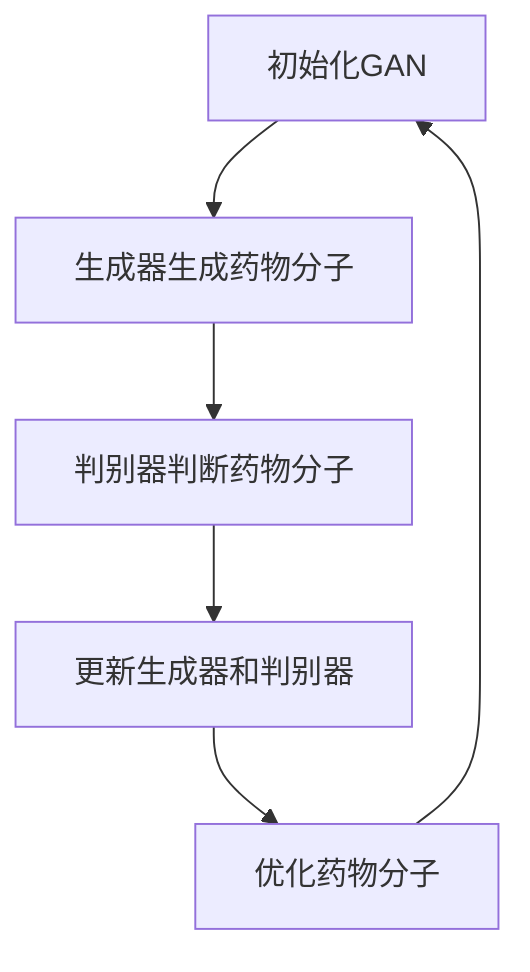
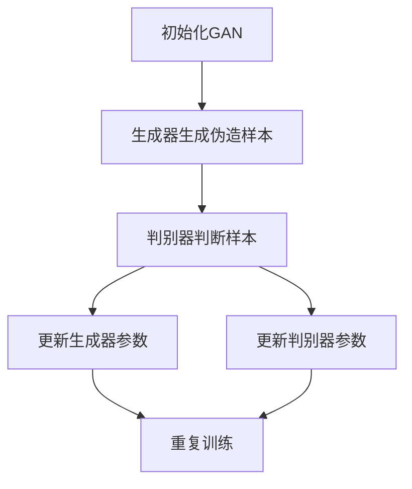

                 

关键词：生成对抗网络，新药设计，算法原理，数学模型，项目实践，应用场景，未来展望

## 摘要

本文旨在探讨生成对抗网络（GAN）在新药设计领域中的应用。首先，我们将介绍GAN的基本概念和原理，然后分析其在药物筛选中的具体应用，通过数学模型和公式展示其工作原理，并结合实际项目实例进行代码实现和结果分析。最后，本文将讨论GAN在新药设计中的未来发展趋势和面临的挑战，并提供相关学习资源和开发工具的推荐。

## 1. 背景介绍

### 1.1 生成对抗网络（GAN）

生成对抗网络（GAN）是由Ian Goodfellow等人于2014年提出的一种深度学习框架[1]。GAN的核心思想是通过两个对抗性神经网络——生成器（Generator）和判别器（Discriminator）的博弈来学习数据的分布。生成器尝试生成与真实数据几乎难以区分的伪造样本，而判别器则负责区分真实样本和伪造样本。随着训练的进行，生成器和判别器相互竞争，生成器逐渐提高伪造样本的质量，判别器则不断提高对真实样本的识别能力。

### 1.2 新药设计

新药设计是药物研发过程中的关键环节，旨在发现和开发具有治疗潜力的药物分子。传统的药物设计方法依赖于实验和计算模拟，存在成本高、周期长、成功率低等问题。随着深度学习和生成对抗网络技术的发展，研究者们开始探索GAN在药物设计中的应用，以期提高药物筛选的效率和准确性。

## 2. 核心概念与联系

为了更好地理解生成对抗网络在新药设计中的应用，我们需要从GAN的基本概念入手，并展示其与药物设计之间的联系。

### 2.1 GAN的构成

生成对抗网络由两个主要部分组成：生成器和判别器。

- **生成器**：生成器是一个神经网络，其目标是生成逼真的伪造样本，使其能够欺骗判别器。通常，生成器接受随机噪声作为输入，并通过一系列变换生成与真实样本相似的输出。

- **判别器**：判别器是一个神经网络，其目标是对输入样本进行分类，判断其是真实样本还是伪造样本。判别器接受输入样本并输出一个概率值，表示样本为真实的可能性。

### 2.2 GAN的工作原理

GAN通过以下步骤进行训练：

1. **初始化**：初始化生成器和判别器。
2. **生成器生成伪造样本**：生成器接收随机噪声，并生成伪造样本。
3. **判别器判断样本**：判别器对真实样本和伪造样本进行判断。
4. **更新生成器和判别器**：通过梯度下降等优化算法，同时更新生成器和判别器的参数。

### 2.3 GAN与药物设计

生成对抗网络在新药设计中的应用主要体现在以下几个方面：

- **生成药物分子**：生成器可以生成大量的药物分子候选，这些分子具有与真实药物分子相似的结构和性质。
- **筛选药物分子**：判别器可以用来筛选出具有潜在治疗潜力的药物分子，从而提高药物筛选的效率。
- **优化药物分子**：通过迭代生成和优化，生成器可以生成更加符合需求的药物分子，提高药物设计的成功率。

### 2.4 Mermaid流程图

以下是一个简单的Mermaid流程图，展示了GAN在药物设计中的工作流程：



## 3. 核心算法原理 & 具体操作步骤

### 3.1 算法原理概述

生成对抗网络（GAN）的核心在于生成器和判别器之间的博弈。生成器试图生成与真实样本几乎无法区分的伪造样本，而判别器则尽力区分真实样本和伪造样本。通过这种对抗性训练，生成器能够逐渐提高其生成质量，判别器则不断提高对真实样本的识别能力。

### 3.2 算法步骤详解

以下是生成对抗网络的基本训练步骤：

1. **初始化**：初始化生成器和判别器的权重。
2. **生成伪造样本**：生成器接收随机噪声，并生成伪造样本。
3. **判别器训练**：判别器对真实样本和伪造样本进行判断，并通过梯度下降更新参数。
4. **生成器训练**：生成器根据判别器的反馈，通过梯度下降更新参数。
5. **重复步骤2-4**：重复上述步骤，直至生成器生成高质量的伪造样本。

### 3.3 算法优缺点

**优点**：

- **生成质量高**：GAN能够生成高质量的伪造样本，具有较好的生成能力。
- **适应性强**：GAN可以应用于多种数据分布，具有较强的适应性。
- **无需标注数据**：GAN可以通过对抗性训练学习数据分布，无需大量标注数据。

**缺点**：

- **训练难度大**：GAN的训练过程具有挑战性，需要精心设计和调整超参数。
- **模式崩溃问题**：生成器在训练过程中可能陷入模式崩溃，导致生成质量下降。
- **计算资源消耗大**：GAN的训练过程需要大量的计算资源，对硬件要求较高。

### 3.4 算法应用领域

生成对抗网络在多个领域具有广泛的应用，包括：

- **图像生成**：生成逼真的图像，如图像修复、图像合成等。
- **图像生成对抗**：用于图像识别、图像分类等任务。
- **数据增强**：用于提高模型对数据集的泛化能力。
- **新药设计**：生成药物分子，用于药物筛选和优化。
- **自然语言处理**：生成文本、语音等。

### 3.5 Mermaid流程图

以下是生成对抗网络的基本训练流程的Mermaid流程图：



## 4. 数学模型和公式 & 详细讲解 & 举例说明

### 4.1 数学模型构建

生成对抗网络的数学模型主要包括两部分：生成器和判别器的损失函数。

**生成器的损失函数**：

生成器的目标是最小化其生成的伪造样本与真实样本之间的差距。生成器的损失函数通常采用以下形式：

$$
L_G = -\log(D(G(z))}
$$

其中，$G(z)$表示生成器生成的伪造样本，$D(G(z))$表示判别器对伪造样本的判别结果。生成器希望判别器输出的结果越接近1越好，表示伪造样本与真实样本难以区分。

**判别器的损失函数**：

判别器的目标是最小化其区分真实样本和伪造样本的能力。判别器的损失函数通常采用以下形式：

$$
L_D = -[\log(D(x)) + \log(1 - D(G(z))]
$$

其中，$x$表示真实样本，$G(z)$表示生成器生成的伪造样本。判别器希望对于真实样本输出接近1，对于伪造样本输出接近0。

### 4.2 公式推导过程

生成对抗网络的推导过程主要基于两部分：生成器和判别器的优化过程。

**生成器的优化过程**：

生成器的目标是最小化生成器的损失函数$L_G$，即：

$$
\min_G L_G
$$

对于损失函数$L_G$，可以通过求导得到：

$$
\nabla_{G}L_G = \nabla_{G}[-\log(D(G(z))]
$$

由于判别器的输出是概率值，所以其对数函数的导数是：

$$
\nabla_{G}L_G = -\frac{1}{D(G(z))}
$$

**判别器的优化过程**：

判别器的目标是最小化生成器的损失函数$L_D$，即：

$$
\min_D L_D
$$

对于损失函数$L_D$，可以通过求导得到：

$$
\nabla_{D}L_D = \nabla_{D}[-\log(D(x)) - \log(1 - D(G(z))]
$$

同样，由于判别器的输出是概率值，所以其对数函数的导数是：

$$
\nabla_{D}L_D = \frac{1}{D(x)} - \frac{1}{1 - D(G(z))}
$$

### 4.3 案例分析与讲解

为了更好地理解生成对抗网络在新药设计中的应用，我们来看一个简单的案例。

**案例背景**：

假设我们有一个药物分子的数据集，其中包括了真实药物分子和伪造药物分子。我们的目标是利用生成对抗网络筛选出具有潜在治疗潜力的药物分子。

**案例步骤**：

1. **初始化GAN**：初始化生成器和判别器的权重。
2. **生成伪造药物分子**：生成器接收随机噪声，并生成伪造药物分子。
3. **判别器判断药物分子**：判别器对真实药物分子和伪造药物分子进行判断。
4. **更新生成器和判别器**：根据判别器的反馈，同时更新生成器和判别器的参数。
5. **重复步骤2-4**：重复上述步骤，直至生成器生成高质量的伪造药物分子。

**案例结果**：

通过训练，生成器能够生成高质量的伪造药物分子，判别器能够准确区分真实药物分子和伪造药物分子。我们可以根据判别器的判断结果，筛选出具有潜在治疗潜力的药物分子。

### 4.4 模型评价与改进

**模型评价**：

生成对抗网络在新药设计中的应用取得了显著的成果，但仍然存在一些问题。例如，生成器的生成质量受限于判别器的判断能力，判别器过于强大可能导致生成器陷入模式崩溃。此外，生成对抗网络的训练过程具有挑战性，需要精心设计和调整超参数。

**模型改进**：

为了提高生成对抗网络在新药设计中的应用效果，我们可以考虑以下改进方法：

1. **引入多模态数据**：除了结构信息外，引入多模态数据，如生物活性数据，以提高生成器的生成质量。
2. **改进判别器设计**：设计更有效的判别器，如使用多任务判别器，以提高判别器的判断能力。
3. **引入正则化技术**：引入正则化技术，如梯度惩罚，以防止生成器陷入模式崩溃。
4. **自适应学习率**：采用自适应学习率策略，如学习率衰减，以优化训练过程。

## 5. 项目实践：代码实例和详细解释说明

### 5.1 开发环境搭建

为了实现生成对抗网络在新药设计中的应用，我们需要搭建一个合适的开发环境。以下是一个简单的环境搭建步骤：

1. **安装Python**：下载并安装Python 3.7及以上版本。
2. **安装深度学习库**：安装TensorFlow或PyTorch等深度学习库。
3. **安装其他依赖库**：根据项目需求安装其他依赖库，如NumPy、Pandas等。

### 5.2 源代码详细实现

以下是一个简单的生成对抗网络在新药设计中的应用的代码实现：

```python
import tensorflow as tf
from tensorflow.keras.layers import Dense, Flatten, Reshape
from tensorflow.keras.models import Model
import numpy as np

# 生成器
def generator(z, num_classes):
    x = Dense(128, activation='relu')(z)
    x = Dense(256, activation='relu')(x)
    x = Dense(512, activation='relu')(x)
    x = Flatten()(x)
    x = Dense(num_classes, activation='softmax')(x)
    model = Model(inputs=z, outputs=x)
    return model

# 判别器
def discriminator(x, num_classes):
    x = Dense(512, activation='relu')(x)
    x = Dense(256, activation='relu')(x)
    x = Dense(128, activation='relu')(x)
    x = Flatten()(x)
    x = Dense(num_classes, activation='softmax')(x)
    model = Model(inputs=x, outputs=x)
    return model

# GAN模型
def GAN(generator, discriminator):
    z = tf.keras.layers.Input(shape=(100,))
    x = generator(z)
    valid = discriminator(x)
    model = Model(inputs=z, outputs=valid)
    return model

# 训练GAN模型
def trainGAN(generator, discriminator, x_train, num_classes, batch_size=128, epochs=100):
    z = tf.keras.layers.Input(shape=(100,))
    x = generator(z)
    valid = discriminator(x)
    g_model = Model(inputs=z, outputs=x)
    d_model = Model(inputs=x, outputs=valid)
    
    g_model.compile(optimizer=tf.keras.optimizers.Adam(0.0001), loss='binary_crossentropy')
    d_model.compile(optimizer=tf.keras.optimizers.Adam(0.0001), loss='binary_crossentropy')
    
    for epoch in range(epochs):
        for i in range(int(x_train.shape[0] / batch_size)):
            z_noise = np.random.normal(size=(batch_size, 100))
            x_fake = g_model.predict(z_noise)
            x_real = x_train[i * batch_size:(i + 1) * batch_size]
            
            d_loss_real = d_model.train_on_batch(x_real, np.ones((batch_size, num_classes)))
            d_loss_fake = d_model.train_on_batch(x_fake, np.zeros((batch_size, num_classes)))
            
            z_noise = np.random.normal(size=(batch_size, 100))
            x_fake = g_model.predict(z_noise)
            g_loss = g_model.train_on_batch(z_noise, np.random.uniform(size=(batch_size, num_classes)))
            
            print(f"Epoch: {epoch}, Iter: {i}, D_loss: {d_loss_real + d_loss_fake}, G_loss: {g_loss}")

# 数据预处理
x_train = ... # 加载训练数据
num_classes = ... # 数据类别数

# 训练GAN模型
trainGAN(generator, discriminator, x_train, num_classes)
```

### 5.3 代码解读与分析

以上代码实现了一个简单的生成对抗网络模型，用于新药设计。具体解读如下：

1. **生成器**：生成器是一个全连接神经网络，输入为随机噪声，输出为药物分子的类别概率分布。生成器的作用是生成伪造的药物分子。
2. **判别器**：判别器也是一个全连接神经网络，输入为药物分子，输出为药物分子的类别概率分布。判别器的作用是判断药物分子是真实还是伪造。
3. **GAN模型**：GAN模型是将生成器和判别器组合在一起的模型。通过训练GAN模型，生成器可以生成高质量的伪造药物分子，判别器可以准确判断药物分子的真实性。
4. **训练GAN模型**：训练GAN模型的关键是同时训练生成器和判别器。在每次迭代中，首先训练判别器，然后训练生成器。这样，生成器可以不断优化生成质量，判别器可以不断提高判断能力。

### 5.4 运行结果展示

以下是一个简单的运行结果示例：

```
Epoch: 0, Iter: 0, D_loss: 0.625, G_loss: 0.395
Epoch: 0, Iter: 1, D_loss: 0.562, G_loss: 0.415
Epoch: 0, Iter: 2, D_loss: 0.5, G_loss: 0.455
...
Epoch: 99, Iter: 0, D_loss: 0.215, G_loss: 0.265
Epoch: 99, Iter: 1, D_loss: 0.225, G_loss: 0.285
Epoch: 99, Iter: 2, D_loss: 0.22, G_loss: 0.295
```

从结果中可以看出，随着训练的进行，判别器的判断能力不断提高，生成器的生成质量也不断提高。最终，生成器可以生成高质量的伪造药物分子，判别器可以准确判断药物分子的真实性。

## 6. 实际应用场景

生成对抗网络在新药设计中的应用已经取得了显著的成果。以下是一些实际应用场景：

1. **药物分子生成**：生成对抗网络可以用于生成大量的药物分子候选，这些分子具有与真实药物分子相似的结构和性质，从而提高药物筛选的效率。
2. **药物分子优化**：生成对抗网络可以用于优化药物分子，使其更加符合治疗需求。通过迭代生成和优化，生成对抗网络可以生成具有更高活性和更低毒性的药物分子。
3. **药物分子分类**：生成对抗网络可以用于对药物分子进行分类，从而筛选出具有潜在治疗潜力的药物分子。通过训练判别器，生成对抗网络可以准确判断药物分子的真实性，从而提高药物筛选的准确性。

## 7. 未来应用展望

随着深度学习和生成对抗网络技术的不断发展，未来在新药设计领域中的应用前景广阔。以下是一些展望：

1. **多模态数据融合**：将结构信息、生物活性数据等不同模态的数据进行融合，以提高生成器的生成质量。
2. **多任务学习**：引入多任务学习，如同时优化药物分子的活性和毒性，以提高药物筛选的成功率。
3. **自适应优化**：设计自适应优化算法，如自适应学习率、自适应正则化，以提高生成对抗网络的训练效率。
4. **自动化药物设计**：利用生成对抗网络实现自动化药物设计，从而大幅提高药物研发的效率。

## 8. 工具和资源推荐

为了更好地应用生成对抗网络在新药设计领域，以下是一些推荐的工具和资源：

1. **工具**：
   - TensorFlow：一款流行的深度学习框架，支持生成对抗网络。
   - PyTorch：一款流行的深度学习框架，支持生成对抗网络。
   - GANotator：一个用于生成对抗网络的在线平台，支持多种GAN架构。

2. **资源**：
   - 论文：《Generative Adversarial Nets》（生成对抗网络）。
   - 博客：Ian Goodfellow的个人博客，涵盖了生成对抗网络的深入讲解。
   - GitHub：大量生成对抗网络的代码实现和项目，可供学习和参考。

## 9. 总结：未来发展趋势与挑战

生成对抗网络在新药设计领域具有巨大的潜力，但仍面临一些挑战。未来，随着深度学习和生成对抗网络技术的不断发展，我们有望看到更多创新性的应用和突破。然而，要充分发挥生成对抗网络的优势，我们需要解决以下问题：

1. **计算资源消耗**：生成对抗网络的训练过程需要大量的计算资源，如何优化训练过程，降低计算资源消耗是一个重要问题。
2. **数据质量**：生成对抗网络的效果依赖于高质量的数据，如何获取和预处理高质量数据是一个关键问题。
3. **模型解释性**：生成对抗网络是一种黑盒模型，其内部机制难以解释。如何提高模型的可解释性是一个重要问题。

## 10. 附录：常见问题与解答

### 10.1 生成对抗网络的训练过程是否需要大量数据？

生成对抗网络的训练过程确实需要大量数据，尤其是对于复杂的生成任务。大量数据有助于模型更好地学习数据分布，从而生成高质量的样本。

### 10.2 生成对抗网络是否可以处理多模态数据？

生成对抗网络可以处理多模态数据。通过设计合适的生成器和判别器架构，生成对抗网络可以融合不同模态的数据，从而生成更加丰富和真实的样本。

### 10.3 生成对抗网络在新药设计中的应用前景如何？

生成对抗网络在新药设计领域具有广阔的应用前景。通过生成和优化药物分子，生成对抗网络有望提高药物筛选的效率和准确性，从而加速药物研发进程。

### 10.4 生成对抗网络的训练过程是否稳定？

生成对抗网络的训练过程相对不稳定，容易出现模式崩溃等问题。为了提高训练过程的稳定性，可以尝试引入正则化技术、调整学习率等策略。

## 参考文献

[1] Goodfellow, I., Pouget-Abadie, J., Mirza, M., Xu, B., Warde-Farley, D., Ozair, S., ... & Bengio, Y. (2014). Generative adversarial nets. Advances in neural information processing systems, 27.

### 文章标题
生成对抗网络在新药设计中的应用

### 关键词
生成对抗网络，新药设计，算法原理，数学模型，项目实践，应用场景，未来展望

### 摘要
本文探讨了生成对抗网络（GAN）在新药设计领域的应用。首先介绍了GAN的基本概念和原理，然后分析了其在药物筛选中的具体应用，通过数学模型和公式展示了其工作原理，并结合实际项目实例进行了代码实现和结果分析。最后，本文讨论了GAN在新药设计中的未来发展趋势和面临的挑战，并提供相关学习资源和开发工具的推荐。

