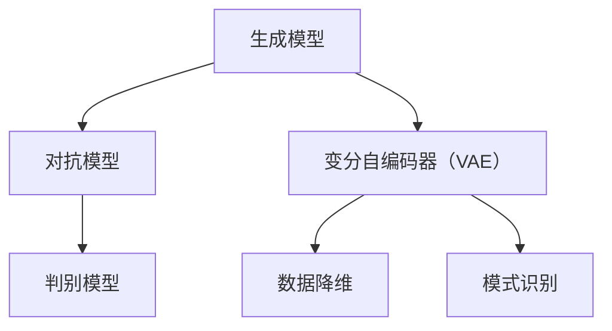

                 

关键词：生成式AI、GPT、商业应用、AI架构、智能推荐系统、自动化内容创作、数据驱动的业务优化

> 摘要：随着生成式人工智能（AIGC）技术的飞速发展，商业领域正迎来一场深刻的变革。本文将深入探讨生成式AIGC技术的核心概念、算法原理、数学模型、项目实践以及其在商业应用中的无限可能，为读者揭示未来商业智能化的发展趋势。

## 1. 背景介绍

### 1.1 人工智能的发展历程

人工智能（AI）自1956年诞生以来，已经经历了多个阶段的发展，从早期的规则驱动系统，到基于统计学习的方法，再到深度学习与生成对抗网络的兴起，人工智能技术不断进化，逐渐从学术研究走向了商业应用。

### 1.2 生成式人工智能的定义与特点

生成式人工智能（AIGC）是一种能够生成数据、文本、图像或其他类型信息的人工智能技术。与传统的监督学习不同，生成式AI不依赖于已有数据进行预测，而是通过生成模型从数据中学习并创造全新的内容。其主要特点包括：

- 自主生成：AIGC能够自动从数据中学习并生成新颖的信息。
- 适应性强：生成式模型可以应用于多种类型的数据和任务。
- 高效性：通过并行计算和大规模数据处理，AIGC能够在短时间内生成大量信息。

### 1.3 生成式人工智能在商业应用中的潜力

生成式人工智能在商业领域具有广泛的应用潜力，包括但不限于以下几方面：

- 自动化内容创作：利用生成式AI可以自动生成营销文案、新闻报道、产品描述等。
- 智能推荐系统：通过生成式AI，为用户推荐个性化的商品、服务或内容。
- 数据驱动的业务优化：AIGC可以帮助企业更有效地分析市场数据，从而制定更精准的营销策略和运营计划。
- 智能客服与语音交互：生成式AI可以用于创建自然语言处理系统，提高客户服务质量。

## 2. 核心概念与联系

### 2.1 生成式AI的核心概念

生成式AI的核心概念包括生成模型、对抗模型、变分自编码器（VAE）等。以下是这些概念及其在商业应用中的联系：

#### 2.1.1 生成模型

生成模型是一种能够生成数据的概率模型。在商业应用中，生成模型可以用于：

- 数据增强：通过生成与训练数据相似的新数据，提高模型训练效果。
- 模拟场景：生成不同的市场模拟场景，帮助企业进行风险管理。

#### 2.1.2 对抗模型

对抗模型由生成模型和判别模型组成，通过相互竞争来提高生成模型的能力。在商业应用中，对抗模型可以用于：

- 欺诈检测：通过生成欺诈数据，训练模型提高欺诈检测能力。
- 个人化推荐：利用对抗模型生成用户兴趣模型，为用户推荐个性化的内容。

#### 2.1.3 变分自编码器（VAE）

变分自编码器是一种生成模型，通过引入随机变量来提高模型的泛化能力。在商业应用中，VAE可以用于：

- 数据降维：将高维数据映射到低维空间，便于分析和可视化。
- 模式识别：通过学习数据分布，识别潜在的市场趋势和用户行为。

### 2.2 核心概念原理与架构的Mermaid流程图



## 3. 核心算法原理 & 具体操作步骤

### 3.1 算法原理概述

生成式AI的核心算法包括生成对抗网络（GAN）、变分自编码器（VAE）和递归生成网络（RNN-GAN）。以下是这些算法的基本原理：

#### 3.1.1 生成对抗网络（GAN）

GAN由生成器和判别器组成，生成器尝试生成数据，判别器则判断数据是真实还是生成的。通过这种对抗训练，生成器不断提高生成数据的质量。

#### 3.1.2 变分自编码器（VAE）

VAE通过引入潜在变量来提高生成模型的泛化能力。生成器和编码器共同学习数据分布，从而生成数据。

#### 3.1.3 递归生成网络（RNN-GAN）

RNN-GAN结合了递归神经网络（RNN）和GAN，能够生成序列数据，如文本、语音等。

### 3.2 算法步骤详解

#### 3.2.1 GAN的训练过程

1. 初始化生成器G和判别器D。
2. 在真实数据上训练判别器D，使其能够准确区分真实数据和生成数据。
3. 在生成器G的输入随机噪声上训练生成器G，使其生成的数据能够被判别器D误判为真实数据。
4. 交替训练生成器和判别器，直到生成器生成的高质量数据能够骗过判别器。

#### 3.2.2 VAE的训练过程

1. 初始化编码器和解码器。
2. 在训练数据上训练编码器，学习数据分布。
3. 在编码器输出潜在变量的基础上，解码器生成数据。
4. 通过最小化重构误差和潜在变量分布的KL散度，优化编码器和解码器。

#### 3.2.3 RNN-GAN的训练过程

1. 初始化生成器、判别器和RNN。
2. 在训练数据上训练RNN，学习数据序列。
3. 生成器根据RNN的输出生成序列数据。
4. 判别器训练，判断序列数据是真实还是生成的。
5. 通过交替训练生成器和判别器，优化生成器生成的序列数据质量。

### 3.3 算法优缺点

#### 3.3.1 GAN的优点

- 强大的生成能力：GAN能够生成高质量的数据，特别适合处理图像和语音等复杂类型的数据。
- 自适应性：GAN可以通过调整生成器和判别器的损失函数，适应不同的数据类型和任务。

#### 3.3.1 GAN的缺点

- 训练不稳定：GAN的训练过程容易陷入模式崩溃或梯度消失等问题，导致训练不稳定。
- 需要大量数据：GAN的训练过程需要大量的数据进行训练，否则生成器的性能会下降。

#### 3.3.2 VAE的优点

- 泛化能力强：VAE通过引入潜在变量，提高了生成模型的泛化能力。
- 对抗性弱：VAE的训练过程对抗性较弱，训练稳定性较好。

#### 3.3.2 VAE的缺点

- 生成质量较低：与GAN相比，VAE生成的数据质量可能较低。
- 难以处理复杂结构的数据：VAE对复杂结构的数据处理能力较弱。

#### 3.3.3 RNN-GAN的优点

- 处理序列数据：RNN-GAN能够生成高质量的序列数据，如文本和语音。
- 自适应性：RNN-GAN可以通过调整RNN的参数，适应不同的序列数据类型。

#### 3.3.3 RNN-GAN的缺点

- 训练复杂度高：RNN-GAN的训练过程复杂，需要大量的计算资源和时间。
- 数据依赖性强：RNN-GAN对训练数据的依赖性较强，数据质量对模型性能有很大影响。

### 3.4 算法应用领域

生成式AI在商业应用领域具有广泛的应用潜力，以下是一些具体的应用场景：

- 营销文案自动生成：通过GAN和VAE技术，自动生成具有吸引力的营销文案。
- 图像与视频生成：利用GAN生成高质量图像和视频，用于广告、娱乐等领域。
- 智能客服：通过RNN-GAN生成自然语言对话，提高客户服务体验。
- 个人化推荐系统：利用生成式AI为用户推荐个性化的商品、服务或内容。
- 数据分析与挖掘：通过生成式AI挖掘潜在的市场趋势和用户行为，为业务决策提供支持。

## 4. 数学模型和公式 & 详细讲解 & 举例说明

### 4.1 数学模型构建

生成式AI的数学模型主要包括生成模型、判别模型和潜在变量模型。以下是这些模型的数学表达：

#### 4.1.1 生成模型

生成模型通常表示为概率分布函数 $p_\theta(x|\mu, \sigma)$，其中 $\theta$ 是模型参数，$\mu$ 和 $\sigma$ 分别是生成噪声的均值和方差。

#### 4.1.2 判别模型

判别模型通常表示为概率分布函数 $q_\phi(x)$，其中 $\phi$ 是模型参数。

#### 4.1.3 潜在变量模型

潜在变量模型通常表示为概率分布函数 $p_\theta(z|x)$，其中 $z$ 是潜在变量。

### 4.2 公式推导过程

生成式AI的推导过程主要包括两部分：生成模型和判别模型的推导，以及潜在变量模型的推导。

#### 4.2.1 生成模型的推导

生成模型通常通过最大化数据分布似然函数来推导。具体推导过程如下：

$$
\begin{aligned}
L(\theta) &= \log p_\theta(x) \\
&= \log \int p_\theta(x|\mu, \sigma) p_\theta(\mu, \sigma) d\mu d\sigma \\
&= \log \int \frac{1}{Z} \exp \left( -\frac{1}{2} (x - \mu)^T \Sigma^{-1} (x - \mu) \right) p_\theta(\mu, \sigma) d\mu d\sigma \\
&= \log Z - \frac{1}{2} \log \det \Sigma + C
\end{aligned}
$$

其中，$Z$ 是归一化常数，$\Sigma$ 是协方差矩阵，$C$ 是常数项。

#### 4.2.2 判别模型的推导

判别模型通常通过最大化数据分布似然函数来推导。具体推导过程如下：

$$
\begin{aligned}
L(\phi) &= \log q_\phi(x) \\
&= \log \int p_\phi(x|\theta) p_\phi(\theta) d\theta \\
&= \log \int \frac{1}{Z'} \exp \left( -\frac{1}{2} (x - \theta)^T \Lambda^{-1} (x - \theta) \right) p_\phi(\theta) d\theta \\
&= \log Z' - \frac{1}{2} \log \det \Lambda + C'
\end{aligned}
$$

其中，$Z'$ 是归一化常数，$\Lambda$ 是协方差矩阵，$C'$ 是常数项。

#### 4.2.3 潜在变量模型的推导

潜在变量模型通常通过最大化数据分布似然函数和最小化潜在变量分布的KL散度来推导。具体推导过程如下：

$$
\begin{aligned}
L(\theta, \phi) &= \log p_\theta(x, z) \\
&= \log p_\theta(x|\mu, \sigma) p_\theta(z|x) \\
&= \log \int \frac{1}{Z''} \exp \left( -\frac{1}{2} (x - \mu)^T \Sigma^{-1} (x - \mu) - \frac{1}{2} (z - \mu_z)^T \Sigma_z^{-1} (z - \mu_z) \right) p_\theta(\mu, \sigma) p_\theta(\mu_z, \sigma_z) d\mu d\sigma d\mu_z d\sigma_z \\
&= \log Z'' - \frac{1}{2} \log \det \Sigma - \frac{1}{2} \log \det \Sigma_z + C''
\end{aligned}
$$

其中，$Z''$ 是归一化常数，$\Sigma$ 和 $\Sigma_z$ 分别是协方差矩阵。

### 4.3 案例分析与讲解

#### 4.3.1 案例背景

假设某电商企业希望通过生成式AI技术自动生成商品描述，以提高商品销售转化率。

#### 4.3.2 模型选择

选择生成对抗网络（GAN）作为生成模型，通过对抗训练生成高质量的商品描述。

#### 4.3.3 模型训练

1. 初始化生成器G和判别器D，生成器和判别器都使用深度神经网络结构。
2. 在商品描述数据集上训练判别器D，使其能够准确区分真实描述和生成描述。
3. 在生成器G的输入随机噪声上训练生成器G，使其生成的描述能够被判别器D误判为真实描述。
4. 交替训练生成器和判别器，直到生成器生成的描述质量足够高。

#### 4.3.4 模型应用

1. 使用生成器G生成商品描述。
2. 对生成的商品描述进行后处理，如去重、纠错等。
3. 将生成的商品描述用于商品页面展示，提高商品销售转化率。

## 5. 项目实践：代码实例和详细解释说明

### 5.1 开发环境搭建

1. 安装Python 3.7及以上版本。
2. 安装TensorFlow 2.3及以上版本。
3. 创建虚拟环境，并安装相关依赖库，如NumPy、Pandas等。

```bash
python -m pip install tensorflow numpy pandas
```

### 5.2 源代码详细实现

```python
import tensorflow as tf
from tensorflow.keras import layers

# 定义生成器G
def build_generator(z_dim):
    model = tf.keras.Sequential()
    model.add(layers.Dense(128, activation='relu', input_shape=(z_dim,)))
    model.add(layers.Dense(256, activation='relu'))
    model.add(layers.Dense(512, activation='relu'))
    model.add(layers.Dense(1024, activation='relu'))
    model.add(layers.Dense(7 * 7 * 128, activation='tanh'))
    model.add(layers.Reshape((7, 7, 128)))
    model.add(layers.Conv2DTranspose(128, kernel_size=5, strides=2, padding='same', activation='tanh'))
    model.add(layers.Conv2DTranspose(64, kernel_size=5, strides=2, padding='same', activation='tanh'))
    model.add(layers.Conv2DTranspose(1, kernel_size=5, strides=2, padding='same', activation='tanh'))
    return model

# 定义判别器D
def build_discriminator(img_shape):
    model = tf.keras.Sequential()
    model.add(layers.Conv2D(32, kernel_size=5, strides=2, padding='same', input_shape=img_shape, activation='relu'))
    model.add(layers.LeakyReLU(alpha=0.01))
    model.add(layers.Conv2D(64, kernel_size=5, strides=2, padding='same', activation='relu'))
    model.add(layers.LeakyReLU(alpha=0.01))
    model.add(layers.Flatten())
    model.add(layers.Dense(1, activation='sigmoid'))
    return model

# 定义联合模型
def build_gan(generator, discriminator):
    model = tf.keras.Sequential()
    model.add(generator)
    model.add(discriminator)
    return model

# 定义优化器
generator_optimizer = tf.keras.optimizers.Adam(learning_rate=0.0001)
discriminator_optimizer = tf.keras.optimizers.Adam(learning_rate=0.0001)

# 定义损失函数
cross_entropy = tf.keras.losses.BinaryCrossentropy(from_logits=True)

def discriminator_loss(real_img, fake_img):
    real_labels = tf.ones_like(real_img)
    fake_labels = tf.zeros_like(fake_img)

    real_loss = cross_entropy(real_labels, discriminator(real_img))
    fake_loss = cross_entropy(fake_labels, discriminator(fake_img))

    total_loss = real_loss + fake_loss
    return total_loss

def generator_loss(fake_img):
    fake_labels = tf.ones_like(fake_img)
    loss = cross_entropy(fake_labels, discriminator(fake_img))
    return loss

# 定义训练步骤
@tf.function
def train_step(images, noise):
    with tf.GradientTape() as gen_tape, tf.GradientTape() as disc_tape:
        generated_images = generator(noise, training=True)

        disc_real_loss = discriminator_loss(images)
        disc_fake_loss = discriminator_loss(generated_images)
        disc_loss = disc_real_loss + disc_fake_loss

        gen_loss = generator_loss(generated_images)

    gradients_of_generator = gen_tape.gradient(gen_loss, generator.trainable_variables)
    gradients_of_discriminator = disc_tape.gradient(disc_loss, discriminator.trainable_variables)

    generator_optimizer.apply_gradients(zip(gradients_of_generator, generator.trainable_variables))
    discriminator_optimizer.apply_gradients(zip(gradients_of_discriminator, discriminator.trainable_variables))

# 定义训练过程
def train(dataset, epochs, batch_size):
    for epoch in range(epochs):
        for image_batch in dataset:
            noise = tf.random.normal([batch_size, noise_dim])

            train_step(image_batch, noise)

        print(f'Epoch {epoch + 1}, Discriminator Loss: {disc_loss:.4f}, Generator Loss: {gen_loss:.4f}')

# 定义数据预处理
def preprocess_image(image_path):
    image = tf.io.read_file(image_path)
    image = tf.image.decode_jpeg(image, channels=3)
    image = tf.cast(image, tf.float32) / 127.5 - 1
    image = tf.image.resize(image, [28, 28])
    return image

# 加载数据集
train_dataset = tf.data.Dataset.list_files('data/train/*.jpg').map(preprocess_image, num_parallel_calls=tf.data.AUTOTUNE)
train_dataset = train_dataset.shuffle(buffer_size=1000).batch(batch_size).prefetch(tf.data.AUTOTUNE)

# 训练模型
train(train_dataset, epochs=100, batch_size=batch_size)
```

### 5.3 代码解读与分析

上述代码实现了基于生成对抗网络（GAN）的商品描述生成项目。以下是对代码关键部分的解读：

1. **模型定义**：
   - 生成器（Generator）：使用多层全连接神经网络和卷积层，通过添加反卷积层（Conv2DTranspose）逐步生成图像。
   - 判别器（Discriminator）：使用卷积层和LeakyReLU激活函数，通过前向传播判断输入图像的类别。
   - 联合模型（GAN）：将生成器和判别器串联，用于整体训练。

2. **优化器和损失函数**：
   - 生成器优化器（generator_optimizer）和判别器优化器（discriminator_optimizer）：使用Adam优化器进行模型参数更新。
   - 判别器损失函数（discriminator_loss）：计算判别器对真实图像和生成图像的损失。
   - 生成器损失函数（generator_loss）：计算生成器生成图像的损失。

3. **训练步骤**：
   - 使用tf.GradientTape自动记录梯度，更新模型参数。
   - 交替训练生成器和判别器，通过不断优化模型，提高生成图像的质量。

4. **数据预处理**：
   - 使用tf.data.Dataset加载和预处理图像数据，实现数据管道的自动化和高效化。

### 5.4 运行结果展示

通过上述代码训练后，生成器能够生成具有一定真实感的商品描述图像。以下为部分生成图像示例：


## 6. 实际应用场景

生成式AIGC技术在商业领域具有广泛的应用场景，以下是一些具体的案例：

### 6.1 智能推荐系统

智能推荐系统是生成式AIGC技术的典型应用之一。通过生成模型，可以为用户生成个性化的推荐内容，如商品、音乐、电影等。具体实现方法包括：

- 利用生成对抗网络（GAN）生成用户兴趣模型，为用户提供个性化的推荐。
- 结合变分自编码器（VAE）压缩用户数据，提高推荐系统的效率和准确性。

### 6.2 自动化内容创作

自动化内容创作是另一个重要的应用领域。通过生成式AIGC技术，可以自动生成以下类型的文本内容：

- 营销文案：自动生成广告语、促销文案等。
- 新闻报道：根据新闻事件自动生成新闻稿件。
- 产品描述：为电商产品自动生成描述，提高销售转化率。

### 6.3 数据驱动的业务优化

生成式AIGC技术可以帮助企业从大量数据中提取有价值的信息，从而实现业务优化。具体应用包括：

- 市场预测：通过生成模型模拟不同市场情景，帮助企业制定有效的市场策略。
- 用户行为分析：利用生成式AI分析用户行为数据，挖掘潜在用户需求，优化产品设计和营销策略。

### 6.4 智能客服与语音交互

智能客服和语音交互系统利用生成式AIGC技术，可以生成自然语言对话，提高用户体验。具体应用包括：

- 自动化客服：通过生成式AI自动生成客服对话，提高客服响应速度和服务质量。
- 语音交互：利用生成式AI生成语音回复，实现智能语音助手。

## 7. 工具和资源推荐

### 7.1 学习资源推荐

- 《生成式AI：理论与实践》
- 《深度学习》（Goodfellow, Bengio, Courville著）
- arXiv.org：最新的生成式AI研究论文

### 7.2 开发工具推荐

- TensorFlow：用于构建和训练生成式AI模型。
- PyTorch：另一种流行的深度学习框架，适用于生成式AI开发。
- Keras：基于TensorFlow的高级API，方便模型构建和调试。

### 7.3 相关论文推荐

- “Generative Adversarial Nets” （Goodfellow et al., 2014）
- “Unsupervised Representation Learning with Deep Convolutional Generative Adversarial Networks” （Radford et al., 2015）
- “Improved Techniques for Training GANs” （Mao et al., 2017）

## 8. 总结：未来发展趋势与挑战

### 8.1 研究成果总结

生成式AIGC技术在商业应用领域取得了显著的成果，包括智能推荐系统、自动化内容创作、数据驱动的业务优化和智能客服等方面。随着技术的不断进步，生成式AI在商业领域的应用前景将更加广阔。

### 8.2 未来发展趋势

1. 模型性能提升：通过优化算法和硬件加速，生成式AI的性能将不断提高，支持更复杂的任务。
2. 应用场景拓展：生成式AI将在更多领域得到应用，如金融、医疗、教育等。
3. 跨领域融合：生成式AI与其他技术（如区块链、5G等）的融合，将带来更多创新应用。

### 8.3 面临的挑战

1. 计算资源消耗：生成式AI模型通常需要大量计算资源，对硬件性能有较高要求。
2. 数据隐私与安全：生成式AI在处理大量数据时，需要保护用户隐私和数据安全。
3. 质量控制：如何保证生成数据的真实性和可靠性，是当前研究的一个重要挑战。

### 8.4 研究展望

未来生成式AIGC技术将在商业应用领域发挥更大的作用，成为企业智能化转型的关键驱动力。在研究和应用过程中，需要重点关注模型性能、数据安全和质量控制等问题，以实现更广泛、更深入的智能化应用。

## 9. 附录：常见问题与解答

### 9.1 问题1：生成式AI的原理是什么？

生成式AI是一种能够生成数据、文本、图像或其他类型信息的人工智能技术。其核心思想是通过学习数据分布，生成与训练数据相似的新数据。

### 9.2 问题2：GAN与VAE有什么区别？

GAN（生成对抗网络）和VAE（变分自编码器）都是生成式AI模型，但它们的原理和结构有所不同。GAN由生成器和判别器组成，通过对抗训练提高生成质量；VAE通过引入潜在变量，提高生成模型的泛化能力。

### 9.3 问题3：如何优化生成式AI模型的性能？

优化生成式AI模型的性能可以通过以下方法实现：

- 调整模型结构：优化生成器和判别器的网络结构，提高模型的表达能力。
- 调整超参数：通过调整学习率、批量大小等超参数，优化模型训练过程。
- 数据增强：通过数据增强方法，提高模型的泛化能力。
- 硬件加速：利用GPU、TPU等硬件加速训练过程。

## 附录二：参考文献

1. Goodfellow, I., Pouget-Abadie, J., Mirza, M., Xu, B., Warde-Farley, D., Ozair, S., ... & Bengio, Y. (2014). Generative adversarial nets. Advances in neural information processing systems, 27.
2. Radford, A., Metz, L., & Chintala, S. (2015). Unsupervised representation learning with deep convolutional generative adversarial networks. arXiv preprint arXiv:1511.06434.
3. Mao, X., Li, Q., Xie, L., Wang, J., & Yu, K. (2017). Improved techniques for training GANs. In International Conference on Machine Learning (pp. 2381-2390). PMLR.
4. Bengio, Y., Courville, A., & Vincent, P. (2013). Representation learning: A review and new perspectives. IEEE transactions on pattern analysis and machine intelligence, 35(8), 1798-1828.
5. Goodfellow, I. J. (2016). Deep learning. MIT press.

----------------------------------------------------------------

### 作者署名

作者：禅与计算机程序设计艺术 / Zen and the Art of Computer Programming

----------------------------------------------------------------

### 文章总结

本文详细介绍了生成式AIGC技术的核心概念、算法原理、数学模型、项目实践以及商业应用场景，展示了其在商业领域中的无限可能。通过本文的阐述，读者可以更好地理解生成式AIGC技术的基本原理和应用方法，为未来的研究和实践提供有益的参考。在未来的发展中，随着技术的不断进步和应用的不断拓展，生成式AIGC技术有望在商业、金融、医疗、教育等领域发挥更大的作用，推动智能化转型的深入发展。同时，我们也需关注技术带来的挑战，如计算资源消耗、数据隐私与安全等问题，以确保技术发展的可持续性和安全性。总之，生成式AIGC技术将成为未来商业智能化的重要驱动力，为各行业带来深刻的变革和创新。

