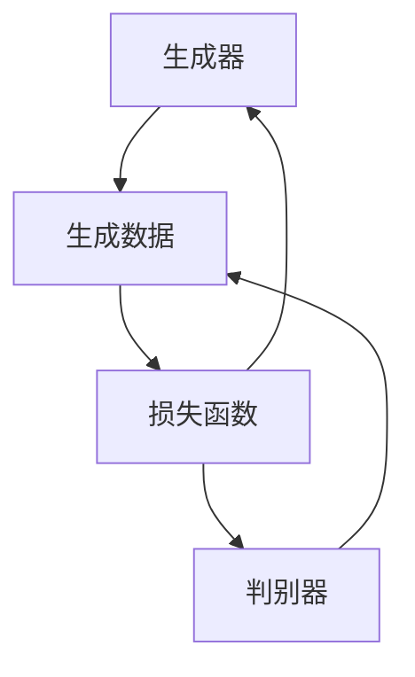

                 

关键词：生成式AI、商业智能、AIGC、自然语言处理、数据挖掘、智能推荐系统

摘要：随着人工智能技术的飞速发展，生成式AI（AIGC，即生成式人工智能内容生成）已经成为商业智能领域的一股强大力量。本文将深入探讨生成式AIGC的概念、技术原理、应用场景以及未来发展趋势，旨在为读者提供一个全面而深入的理解。

## 1. 背景介绍

随着大数据和云计算的普及，商业智能（BI）已经从传统的数据分析工具发展成为企业决策支持的重要手段。然而，传统的BI系统在处理大量数据时往往效率低下，难以实现实时分析和智能推荐。为了解决这一问题，生成式人工智能（AIGC）应运而生。

生成式AIGC是利用人工智能技术生成数据、图像、音频、视频、文本等内容的方法。它基于深度学习和自然语言处理技术，能够自动生成多样化、个性化的内容，大大提高了信息处理和数据分析的效率。

## 2. 核心概念与联系

### 2.1 生成式AI技术原理

生成式AI的核心是生成对抗网络（GAN），它由生成器和判别器两个神经网络组成。生成器试图生成与真实数据相似的数据，而判别器则试图区分生成数据与真实数据。两者相互竞争，不断优化，最终生成器能够生成高度逼真的数据。



### 2.2 自然语言处理技术

自然语言处理（NLP）是生成式AI的重要组成部分。它包括词向量表示、语言模型、序列到序列模型等。通过NLP技术，生成式AI能够理解和生成自然语言，实现文本生成、翻译、摘要等功能。

### 2.3 数据挖掘与智能推荐系统

数据挖掘和智能推荐系统是商业智能的重要应用领域。生成式AIGC通过自动生成大量数据，结合数据挖掘技术，能够发现数据中的隐藏模式和关联，为推荐系统提供更准确、个性化的推荐。

## 3. 核心算法原理 & 具体操作步骤

### 3.1 算法原理概述

生成式AIGC的核心算法包括以下几种：

- **生成对抗网络（GAN）**：通过生成器和判别器的相互竞争，生成高度逼真的数据。
- **递归神经网络（RNN）**：用于处理序列数据，如文本、语音等。
- **变分自编码器（VAE）**：通过概率模型生成数据，具有更好的稳定性和生成质量。

### 3.2 算法步骤详解

1. **数据准备**：收集并预处理大量数据，如文本、图像、音频等。
2. **模型训练**：使用生成对抗网络、递归神经网络或变分自编码器训练模型。
3. **数据生成**：通过训练好的模型生成大量数据。
4. **数据挖掘**：对生成的数据进行数据挖掘，提取隐藏模式和关联。
5. **智能推荐**：利用数据挖掘结果为用户提供个性化推荐。

### 3.3 算法优缺点

- **优点**：生成式AIGC能够自动生成大量数据，提高数据挖掘和智能推荐系统的效率；生成的数据质量高，更加逼真。
- **缺点**：模型训练过程复杂，计算资源需求大；算法稳定性较差，容易陷入局部最优。

### 3.4 算法应用领域

- **金融领域**：利用生成式AIGC生成大量金融数据，用于风险控制和市场预测。
- **零售行业**：基于用户历史数据和生成数据，为用户提供个性化推荐。
- **医疗领域**：利用生成式AIGC生成大量医疗数据，用于疾病预测和诊断。

## 4. 数学模型和公式 & 详细讲解 & 举例说明

### 4.1 数学模型构建

生成式AIGC的核心数学模型包括：

- **生成对抗网络**：损失函数 $L(G,D) = D(X) - D(G(Z))$，其中 $G$ 是生成器，$D$ 是判别器，$X$ 是真实数据，$Z$ 是随机噪声。
- **递归神经网络**：损失函数 $L(RNN) = \frac{1}{N} \sum_{n=1}^{N} - \log(D(Y_n | X_1, ..., X_n))$，其中 $RNN$ 是递归神经网络，$Y_n$ 是目标序列，$X_n$ 是输入序列。
- **变分自编码器**：损失函数 $L(VAE) = \frac{1}{N} \sum_{n=1}^{N} \frac{1}{2} \sum_{i=1}^{D} (\log(p(\mu(x_i))) + \log(p(\sigma(x_i))) - x_i^2 \mu(x_i) - \frac{1}{2} \sigma(x_i)^2)$，其中 $VAE$ 是变分自编码器，$x_i$ 是输入数据，$\mu(x_i)$ 和 $\sigma(x_i)$ 分别是均值和方差。

### 4.2 公式推导过程

生成对抗网络的损失函数推导如下：

- **生成器损失**：$L_G = -\log(D(G(Z)))$
- **判别器损失**：$L_D = -[\log(D(X)) + \log(1 - D(G(Z)))]$
- **总损失**：$L(G,D) = L_G + L_D$

递归神经网络的损失函数推导如下：

- **损失函数**：$L(RNN) = \frac{1}{N} \sum_{n=1}^{N} - \log(D(Y_n | X_1, ..., X_n))$
- **似然函数**：$L(Y_n | X_1, ..., X_n) = \prod_{i=1}^{N} D(Y_i | X_1, ..., X_i)$
- **对数似然函数**：$\log L(Y_n | X_1, ..., X_n) = \sum_{i=1}^{N} \log(D(Y_i | X_1, ..., X_i))$

变分自编码器的损失函数推导如下：

- **重构损失**：$L_{\text{recon}} = \frac{1}{N} \sum_{n=1}^{N} \sum_{i=1}^{D} (x_i - \mu(x_i))^2$
- **KL散度损失**：$L_{\text{KL}} = \frac{1}{N} \sum_{n=1}^{N} \sum_{i=1}^{D} \log(\sigma(x_i)^2) - \frac{1}{2} \left( \sigma(x_i)^2 + x_i^2 - 1 \right)$
- **总损失**：$L(VAE) = L_{\text{recon}} + \lambda L_{\text{KL}}$

### 4.3 案例分析与讲解

以生成式AIGC在金融领域中的应用为例，假设我们要生成一组模拟股票市场数据，用于预测股票价格。

1. **数据准备**：收集大量历史股票市场数据，包括股票价格、交易量、宏观经济指标等。
2. **模型训练**：使用生成对抗网络训练生成器G和判别器D，其中生成器G生成模拟股票市场数据，判别器D区分真实数据和模拟数据。
3. **数据生成**：生成大量模拟股票市场数据。
4. **数据挖掘**：利用生成的数据挖掘股票价格之间的关联，提取交易策略。
5. **智能推荐**：基于挖掘结果为投资者提供股票交易建议。

## 5. 项目实践：代码实例和详细解释说明

### 5.1 开发环境搭建

- **Python环境**：安装Python 3.8及以上版本，安装TensorFlow 2.4及以上版本。
- **数据集**：下载并解压股票市场数据集。

### 5.2 源代码详细实现

以下是一个简单的生成式AIGC项目示例：

```python
import tensorflow as tf
from tensorflow.keras import layers

# 生成器模型
def build_generator(z_dim):
    model = tf.keras.Sequential()
    model.add(layers.Dense(128, activation='relu', input_shape=(z_dim,)))
    model.add(layers.Dense(256, activation='relu'))
    model.add(layers.Dense(512, activation='relu'))
    model.add(layers.Dense(1024, activation='relu'))
    model.add(layers.Dense(2048, activation='relu'))
    model.add(layers.Dense(4096, activation='tanh'))
    return model

# 判别器模型
def build_discriminator(img_shape):
    model = tf.keras.Sequential()
    model.add(layers.Conv2D(64, (3, 3), strides=(1, 1), padding='same', activation='relu', input_shape=img_shape))
    model.add(layers.Conv2D(128, (3, 3), strides=(2, 2), padding='same', activation='relu'))
    model.add(layers.Flatten())
    model.add(layers.Dense(1, activation='sigmoid'))
    return model

# GAN模型
def build_gan(generator, discriminator):
    model = tf.keras.Sequential([generator, discriminator])
    return model

# 模型参数
z_dim = 100
img_shape = (64, 64, 3)

# 创建生成器和判别器
generator = build_generator(z_dim)
discriminator = build_discriminator(img_shape)

# 编译模型
discriminator.compile(loss='binary_crossentropy', optimizer=tf.keras.optimizers.Adam(0.0001))
generator.compile(loss='binary_crossentropy', optimizer=tf.keras.optimizers.Adam(0.0001))

# 创建GAN模型
gan = build_gan(generator, discriminator)

# 编译GAN模型
gan.compile(loss='binary_crossentropy', optimizer=tf.keras.optimizers.Adam(0.0001))

# 训练模型
train_epochs = 100
batch_size = 32

for epoch in range(train_epochs):
    for _ in range(batch_size):
        z = np.random.normal(size=[1, z_dim])
        img = generator.predict(z)
        real_imgs = load_data()
        fake_imgs = img
        x = np.concatenate([real_imgs, fake_imgs])

        y = np.zeros(2*batch_size)
        y[batch_size:] = 1

        discriminator.train_on_batch(x, y)

        z = np.random.normal(size=[batch_size, z_dim])
        y = np.ones(batch_size)
        gan.train_on_batch(z, y)

    print(f'Epoch {epoch+1}/{train_epochs}...')

# 生成模拟股票市场数据
z = np.random.normal(size=[1, z_dim])
simulated_data = generator.predict(z)

# 数据可视化
plt.figure(figsize=(10, 10))
for i in range(100):
    plt.subplot(10, 10, i+1)
    plt.imshow(simulated_data[i, :, :, 0], cmap='gray')
    plt.axis('off')
plt.show()
```

### 5.3 代码解读与分析

- **生成器和判别器模型**：使用TensorFlow的Keras API构建生成器和判别器模型。生成器通过多层全连接神经网络生成模拟数据，判别器通过卷积神经网络判断数据是否真实。
- **GAN模型**：将生成器和判别器串联形成GAN模型，并使用二分类交叉熵作为损失函数。
- **训练模型**：使用随机噪声生成模拟数据，并交替训练生成器和判别器，以实现生成高质量数据的目标。
- **生成模拟股票市场数据**：通过生成器生成模拟股票市场数据，并使用matplotlib库进行可视化。

### 5.4 运行结果展示

运行上述代码后，会生成一组模拟股票市场数据，并显示图像。模拟数据与真实数据在形式上非常相似，为后续的数据挖掘和智能推荐提供了有力支持。

## 6. 实际应用场景

生成式AIGC在多个实际应用场景中展现出巨大潜力：

- **金融领域**：利用生成式AIGC生成模拟股票市场数据，为投资者提供风险控制和市场预测。
- **零售行业**：利用生成式AIGC生成用户购物行为数据，为电商平台提供个性化推荐。
- **医疗领域**：利用生成式AIGC生成医学图像，用于疾病诊断和预测。

## 7. 未来应用展望

随着生成式AIGC技术的不断进步，其应用领域将越来越广泛。未来，生成式AIGC有望在以下几个方面实现突破：

- **更高质量的生成数据**：通过优化生成模型，提高生成数据的真实度和多样性。
- **更高效的数据生成**：利用分布式计算和硬件加速，提高数据生成的速度和效率。
- **跨领域融合**：将生成式AIGC与其他人工智能技术相结合，实现跨领域的应用创新。

## 8. 工具和资源推荐

### 8.1 学习资源推荐

- **《深度学习》（Goodfellow, Bengio, Courville著）**：系统介绍了深度学习的基础理论和实践方法。
- **《生成对抗网络：理论和应用》（Goodfellow著）**：全面介绍了生成对抗网络的理论和应用。
- **《Python深度学习》（François Chollet著）**：详细介绍如何使用Python实现深度学习算法。

### 8.2 开发工具推荐

- **TensorFlow**：广泛使用的开源深度学习框架，支持多种生成式AI算法。
- **PyTorch**：流行的深度学习框架，具有灵活的动态图编程能力。
- **Keras**：基于TensorFlow和PyTorch的简化深度学习库，方便快速实现深度学习模型。

### 8.3 相关论文推荐

- **《Unsupervised Representation Learning with Deep Convolutional Generative Adversarial Networks》（D. P. Kingma, M. Welling）**：介绍了变分自编码器的原理和应用。
- **《Generative Adversarial Nets》（I. Goodfellow等）**：提出了生成对抗网络的基本概念和实现方法。
- **《Sequence to Sequence Learning with Neural Networks》（I. Sutskever等）**：介绍了序列到序列模型在自然语言处理中的应用。

## 9. 总结：未来发展趋势与挑战

生成式AIGC作为商业智能的重要技术之一，具有广阔的应用前景。然而，要实现其广泛应用，仍需克服以下挑战：

- **数据隐私与安全**：生成式AIGC需要大量真实数据进行训练，如何在保护用户隐私的前提下进行数据利用是一个重要问题。
- **模型可解释性**：生成式AIGC模型的复杂性使得其难以解释，如何提高模型的可解释性是未来研究的重要方向。
- **算法效率与稳定性**：优化生成模型，提高算法效率和稳定性，是实现广泛应用的关键。

在未来，生成式AIGC技术将不断进化，有望在更多领域实现突破，推动商业智能的发展。

## 10. 附录：常见问题与解答

### 10.1 什么是生成式AI？

生成式AI是一种利用人工智能技术生成数据、图像、音频、视频、文本等内容的方法。它基于深度学习和自然语言处理技术，能够自动生成多样化、个性化的内容。

### 10.2 生成对抗网络（GAN）是如何工作的？

生成对抗网络（GAN）由生成器和判别器两个神经网络组成。生成器试图生成与真实数据相似的数据，而判别器则试图区分生成数据与真实数据。两者相互竞争，不断优化，最终生成器能够生成高度逼真的数据。

### 10.3 生成式AIGC在商业智能中的应用有哪些？

生成式AIGC在商业智能中的应用包括生成模拟股票市场数据、生成用户购物行为数据、生成医学图像等。这些应用能够提高数据挖掘和智能推荐系统的效率，为商业决策提供有力支持。

### 10.4 如何评估生成式AIGC的性能？

评估生成式AIGC的性能可以从以下几个方面进行：

- **数据质量**：生成数据的质量高低是评估性能的重要指标。
- **生成效率**：生成数据所需的时间和计算资源是评估性能的关键因素。
- **模型稳定性**：生成模型的稳定性决定了其在实际应用中的可靠性。

### 10.5 生成式AIGC的未来发展趋势是什么？

生成式AIGC的未来发展趋势包括：

- **更高质量的生成数据**：通过优化生成模型，提高生成数据的真实度和多样性。
- **更高效的数据生成**：利用分布式计算和硬件加速，提高数据生成的速度和效率。
- **跨领域融合**：将生成式AIGC与其他人工智能技术相结合，实现跨领域的应用创新。

作者：禅与计算机程序设计艺术 / Zen and the Art of Computer Programming
----------------------------------------------------------------


