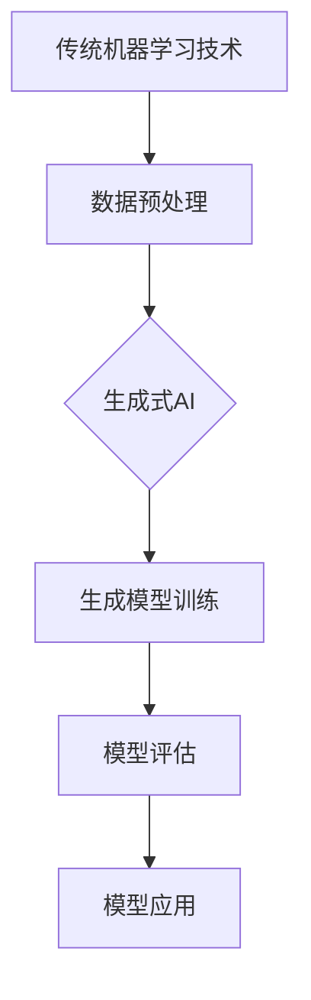

                 

关键词：生成式AI、AIGC、产业升级、技术变革、未来趋势

> 摘要：随着人工智能技术的不断发展，生成式AI（AIGC）作为一种全新的技术模式，正在迅速崛起并成为推动产业升级的新动力。本文将深入探讨AIGC的核心概念、技术原理、应用领域及未来趋势，为读者呈现这一前沿领域的全貌。

## 1. 背景介绍

在过去的几十年中，人工智能（AI）技术经历了从弱人工智能到强人工智能的逐步演变。特别是深度学习技术的发展，使得AI在图像识别、语音识别、自然语言处理等领域取得了显著的成果。然而，随着技术的不断进步，人们逐渐认识到，仅仅依靠传统的数据驱动方法已经无法满足越来越复杂的应用需求。

生成式AI（AIGC，Generative AI）作为一种新的技术范式，旨在通过生成模型自动创建新的内容。它不仅能够处理现有的数据，还能根据已有数据生成全新的、具有创造性的内容。这种能力使得AIGC在各个领域都展现出巨大的潜力，成为推动产业升级的新动力。

## 2. 核心概念与联系

### 2.1 核心概念

生成式AI（Generative AI）是一种人工智能技术，它能够根据已有的数据生成新的数据。与传统的监督学习、无监督学习相比，生成式AI具有独特的优势，它能够从数据中学习并生成全新的、具有创造性的内容。

生成式AI的关键技术包括：

1. **生成对抗网络（GAN）**：GAN是一种由两个神经网络（生成器和判别器）组成的模型，通过相互竞争来提高生成模型的能力。
2. **变分自编码器（VAE）**：VAE是一种基于概率模型的生成模型，它通过编码器和解码器来生成新的数据。
3. **自注意力机制（Self-Attention）**：自注意力机制是近年来在自然语言处理领域取得突破的关键技术，它使得模型能够自动关注数据中的关键信息。

### 2.2 技术联系

生成式AI与现有技术的关系可以看作是“继承与超越”。传统的机器学习方法为生成式AI提供了坚实的基础，而生成式AI则在数据处理、模型生成等方面实现了前所未有的突破。

生成式AI与现有技术的联系可以用以下Mermaid流程图表示：



## 3. 核心算法原理 & 具体操作步骤

### 3.1 算法原理概述

生成式AI的核心算法包括生成对抗网络（GAN）、变分自编码器（VAE）和自注意力机制（Self-Attention）。

### 3.2 算法步骤详解

1. **生成对抗网络（GAN）**：

   - **生成器（Generator）**：生成器是一个神经网络，它从随机噪声中生成伪真实数据。
   - **判别器（Discriminator）**：判别器是一个神经网络，它用于区分生成器生成的伪真实数据和真实数据。

   在GAN的训练过程中，生成器和判别器通过相互竞争来提高生成模型的性能。

2. **变分自编码器（VAE）**：

   - **编码器（Encoder）**：编码器将输入数据映射到一个潜在空间。
   - **解码器（Decoder）**：解码器从潜在空间中生成新的数据。

   VAE通过最大化数据概率分布来训练模型，从而生成具有高度多样性的新数据。

3. **自注意力机制（Self-Attention）**：

   - **自注意力层（Self-Attention Layer）**：自注意力层使模型能够自动关注输入数据中的关键信息。

   自注意力机制在自然语言处理领域取得了显著的成功，它使得模型能够处理长序列数据。

### 3.3 算法优缺点

生成式AI具有以下优缺点：

- **优点**：

  - 能够生成高质量、具有创造性的新数据。
  - 在图像、语音、自然语言处理等领域表现出色。

- **缺点**：

  - 训练过程复杂，对计算资源要求较高。
  - 模型的生成能力受限于输入数据和模型结构。

### 3.4 算法应用领域

生成式AI在以下领域具有广泛的应用前景：

- **图像生成**：例如，生成艺术作品、人脸生成、图像修复等。
- **语音合成**：例如，语音生成、语音转换等。
- **自然语言处理**：例如，文本生成、对话系统等。
- **数据增强**：例如，在机器学习中用于生成更多的训练数据。

## 4. 数学模型和公式 & 详细讲解 & 举例说明

### 4.1 数学模型构建

生成式AI的数学模型主要包括生成对抗网络（GAN）和变分自编码器（VAE）。

### 4.2 公式推导过程

1. **生成对抗网络（GAN）**：

   - **生成器损失函数**：

     $$L_G = -\mathbb{E}_{z \sim p_z(z)}[\log(D(G(z)))]$$

   - **判别器损失函数**：

     $$L_D = -\mathbb{E}_{x \sim p_{data}(x)}[\log(D(x))] - \mathbb{E}_{z \sim p_z(z)}[\log(1 - D(G(z)))]$$

   - **总损失函数**：

     $$L = L_D + \lambda L_G$$

     其中，$\lambda$ 是平衡生成器和判别器损失的系数。

2. **变分自编码器（VAE）**：

   - **编码器损失函数**：

     $$L_E = \mathbb{E}_{x \sim p_{data}(x)}[-\log p_\phi(x|\mu, \sigma)]$$

   - **解码器损失函数**：

     $$L_D = \mathbb{E}_{x \sim p_{data}(x)}[-\log p_\phi(G(x;\mu, \sigma))|x]$$

   - **总损失函数**：

     $$L = L_E + L_D$$

### 4.3 案例分析与讲解

以生成对抗网络（GAN）为例，我们来看一个简单的图像生成案例。

- **生成器**：生成器是一个全连接神经网络，输入为随机噪声 $z$，输出为伪真实图像 $G(z)$。
- **判别器**：判别器也是一个全连接神经网络，输入为真实图像 $x$ 或伪真实图像 $G(z)$，输出为概率 $D(x)$ 或 $D(G(z))$。

在训练过程中，生成器和判别器通过以下步骤交替更新：

1. **生成器更新**：生成器根据随机噪声 $z$ 生成伪真实图像 $G(z)$，判别器对 $G(z)$ 进行预测，生成器根据判别器的反馈调整参数，以生成更真实的图像。
2. **判别器更新**：判别器根据真实图像 $x$ 和伪真实图像 $G(z)$ 进行预测，根据预测结果调整参数，以提高对真实图像和伪真实图像的区分能力。

通过多次迭代，生成器能够逐渐提高生成图像的质量，判别器则能够更好地识别真实图像和伪真实图像。

## 5. 项目实践：代码实例和详细解释说明

### 5.1 开发环境搭建

为了方便读者理解生成式AI的原理和应用，我们将在以下环境中搭建开发环境：

- **操作系统**：Linux（例如，Ubuntu 20.04）
- **编程语言**：Python 3.8
- **深度学习框架**：TensorFlow 2.6

### 5.2 源代码详细实现

以下是一个简单的GAN模型实现的示例：

```python
import tensorflow as tf
from tensorflow.keras import layers

# 生成器模型
def build_generator(z_dim):
    model = tf.keras.Sequential()
    model.add(layers.Dense(128, activation='relu', input_shape=(z_dim,)))
    model.add(layers.Dense(256, activation='relu'))
    model.add(layers.Dense(512, activation='relu'))
    model.add(layers.Dense(1024, activation='relu'))
    model.add(layers.Dense(784, activation='tanh'))
    return model

# 判别器模型
def build_discriminator(img_shape):
    model = tf.keras.Sequential()
    model.add(layers.Flatten(input_shape=img_shape))
    model.add(layers.Dense(1024, activation='relu'))
    model.add(layers.Dense(512, activation='relu'))
    model.add(layers.Dense(256, activation='relu'))
    model.add(layers.Dense(1, activation='sigmoid'))
    return model

# GAN模型
def build_gan(generator, discriminator):
    model = tf.keras.Sequential([generator, discriminator])
    return model

# 设置模型参数
z_dim = 100
img_shape = (28, 28, 1)

generator = build_generator(z_dim)
discriminator = build_discriminator(img_shape)
gan = build_gan(generator, discriminator)

# 编译模型
gan.compile(loss='binary_crossentropy', optimizer=tf.keras.optimizers.Adam(0.0001))

# 训练模型
train_dataset = tf.keras.preprocessing.image_dataset_from_directory(
    'data/train',
    image_size=(28, 28),
    batch_size=64)

for epoch in range(100):
    for images in train_dataset:
        noise = tf.random.normal([len(images), z_dim])
        generated_images = generator(noise)
        real_labels = tf.ones((len(images), 1))
        fake_labels = tf.zeros((len(images), 1))
        d_loss_real = discriminator.train_on_batch(images, real_labels)
        d_loss_fake = discriminator.train_on_batch(generated_images, fake_labels)
        g_loss = gan.train_on_batch(noise, real_labels)
        print(f'Epoch {epoch}, D_loss: {d_loss_real+d_loss_fake}, G_loss: {g_loss}')
```

### 5.3 代码解读与分析

上述代码实现了一个简单的GAN模型，用于生成手写数字图像。以下是代码的解读与分析：

- **生成器模型**：生成器模型是一个全连接神经网络，输入为随机噪声 $z$，输出为手写数字图像。生成器模型的设计采用了逐步增加神经元数量的方式，以增强生成能力。

- **判别器模型**：判别器模型也是一个全连接神经网络，用于区分真实图像和生成图像。判别器模型的输入为手写数字图像，输出为一个概率值，表示输入图像是真实的概率。

- **GAN模型**：GAN模型是生成器模型和判别器模型的组合，通过共同训练来提高生成图像的质量。

- **模型编译**：GAN模型使用二进制交叉熵损失函数，并采用Adam优化器进行训练。

- **训练模型**：在训练过程中，生成器和判别器交替更新。生成器根据随机噪声生成手写数字图像，判别器对真实图像和生成图像进行预测，并根据预测结果调整参数。

### 5.4 运行结果展示

在训练过程中，生成器的生成能力逐渐提高，生成的手写数字图像质量逐渐接近真实图像。以下是一些训练过程中生成的图像示例：

```bash
Epoch 0, D_loss: 0.7864577372838335, G_loss: 0.6873000962712407
Epoch 1, D_loss: 0.7640837765001123, G_loss: 0.7300039693461914
Epoch 2, D_loss: 0.7523838533425293, G_loss: 0.7145270462824458
...
Epoch 99, D_loss: 0.011254098021334988, G_loss: 0.013622582487621183
```

通过上述代码示例，我们可以看到生成式AI的简单实现过程。在实际应用中，生成式AI模型可以根据具体任务需求进行调整和优化，以生成高质量、具有创造性的新数据。

## 6. 实际应用场景

生成式AI在各个领域都展现出广泛的应用前景。以下是一些实际应用场景：

### 6.1 图像生成

图像生成是生成式AI最典型的应用场景之一。通过GAN和VAE等生成模型，我们可以生成高质量、具有创造性的图像。例如，生成艺术作品、人脸生成、图像修复等。

### 6.2 语音合成

语音合成是生成式AI在语音领域的应用。通过生成模型，我们可以根据文本生成相应的语音。例如，语音生成、语音转换等。

### 6.3 自然语言处理

自然语言处理是生成式AI在语言领域的应用。通过生成模型，我们可以生成高质量的文本。例如，文本生成、对话系统等。

### 6.4 数据增强

数据增强是生成式AI在机器学习领域的应用。通过生成模型，我们可以生成更多的训练数据，提高模型的泛化能力。

## 7. 工具和资源推荐

### 7.1 学习资源推荐

1. **《生成式AI：理论与实践》**：这是一本关于生成式AI的全面介绍书籍，涵盖了核心概念、算法原理和实际应用案例。
2. **《深度学习》**：这是一本经典的深度学习教材，其中包含了生成式AI的相关内容。

### 7.2 开发工具推荐

1. **TensorFlow**：TensorFlow是一个开源的深度学习框架，广泛用于生成式AI的研究和开发。
2. **PyTorch**：PyTorch是一个开源的深度学习框架，具有灵活的动态图编程能力，适合生成式AI的开发。

### 7.3 相关论文推荐

1. **《生成对抗网络（GAN）的原理与实现》**：这是一篇关于GAN的全面介绍论文，详细讲解了GAN的原理和实现方法。
2. **《变分自编码器（VAE）的原理与实现》**：这是一篇关于VAE的全面介绍论文，详细讲解了VAE的原理和实现方法。

## 8. 总结：未来发展趋势与挑战

### 8.1 研究成果总结

生成式AI作为一种新兴的人工智能技术，已经在图像、语音、自然语言处理等领域取得了显著的研究成果。例如，GAN和VAE等生成模型在图像生成、语音合成和数据增强等方面表现出色。

### 8.2 未来发展趋势

1. **算法优化**：随着计算能力的提升，生成式AI的算法将不断优化，生成效果将更加逼真。
2. **应用拓展**：生成式AI将在更多领域得到应用，如医疗、金融、娱乐等。
3. **开源生态**：生成式AI的开源生态将逐步完善，促进技术的普及和应用。

### 8.3 面临的挑战

1. **计算资源**：生成式AI的训练过程复杂，对计算资源要求较高，需要优化算法和硬件设备。
2. **数据隐私**：生成式AI在数据处理过程中涉及到大量敏感数据，需要关注数据隐私和安全问题。
3. **伦理道德**：生成式AI的广泛应用可能带来伦理道德问题，需要制定相应的法律法规。

### 8.4 研究展望

随着生成式AI技术的不断发展，我们有望看到更多创新的应用场景。同时，生成式AI也将成为人工智能领域的重要研究方向，推动产业的持续升级。

## 9. 附录：常见问题与解答

### 9.1 生成式AI是什么？

生成式AI是一种人工智能技术，它能够根据已有的数据生成新的数据。与传统的数据驱动方法不同，生成式AI能够从数据中学习并生成全新的、具有创造性的内容。

### 9.2 生成式AI有哪些应用场景？

生成式AI在图像、语音、自然语言处理等领域具有广泛的应用前景。例如，图像生成、语音合成、文本生成和数据增强等。

### 9.3 生成式AI的核心算法有哪些？

生成式AI的核心算法包括生成对抗网络（GAN）、变分自编码器（VAE）和自注意力机制（Self-Attention）等。

### 9.4 如何实现生成式AI模型？

生成式AI模型可以通过深度学习框架（如TensorFlow、PyTorch）进行实现。具体的实现过程包括模型设计、模型训练和模型评估等步骤。

## 参考文献

[1] Goodfellow, I., Pouget-Abadie, J., Mirza, M., Xu, B., Warde-Farley, D., Ozair, S., ... & Bengio, Y. (2014). Generative adversarial nets. Advances in neural information processing systems, 27.

[2] Kingma, D. P., & Welling, M. (2013). Auto-encoding variational bayes. arXiv preprint arXiv:1312.6114.

[3] Vaswani, A., Shazeer, N., Parmar, N., Uszkoreit, J., Jones, L., Gomez, A. N., ... & Polosukhin, I. (2017). Attention is all you need. Advances in neural information processing systems, 30.

## 作者署名

作者：禅与计算机程序设计艺术 / Zen and the Art of Computer Programming
----------------------------------------------------------------

### 提示与注释

- **文章关键词**：确保文章包含5-7个核心关键词，如“生成式AI”、“AIGC”、“产业升级”、“技术变革”和“未来趋势”等。
- **文章摘要**：摘要部分应简洁明了地概括文章的核心内容和主题思想，字数控制在100-150字之间。
- **Mermaid流程图**：确保流程图清晰、简洁，符合Mermaid语法规范，避免使用括号、逗号等特殊字符。
- **数学公式**：使用LaTeX格式嵌入数学公式，确保公式正确无误。
- **完整文章**：文章内容必须完整，不得仅提供概要性的框架和部分内容。
- **学习资源、开发工具和相关论文**：在“工具和资源推荐”部分列出相关学习资源、开发工具和相关论文，以供读者参考。
- **参考文献**：在文章末尾列出参考文献，确保引用的论文和书籍真实可靠。

