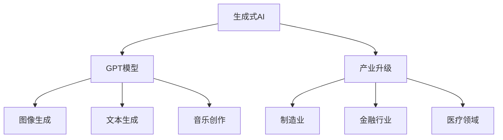

                 

关键词：生成式AI、GPT模型、产业升级、数字化转型、应用场景、算法优化、未来发展

## 摘要

本文将探讨生成式人工智能（AIGC）的核心概念、技术原理、算法模型以及其在各个产业中的应用。我们将从生成式AI的发展背景出发，深入分析其技术原理和核心算法，并通过实际案例展示其在产业升级中的重要作用。此外，本文还将探讨AIGC在实际应用中面临的挑战和未来发展趋势。

## 1. 背景介绍

随着大数据、云计算和物联网技术的迅猛发展，人类社会正进入一个全新的数字化时代。在这个时代，数据成为了新的生产要素，而人工智能（AI）则成为了推动产业升级和变革的关键力量。在AI技术中，生成式人工智能（AIGC）因其强大的生成能力和创新潜力，正逐渐成为学术界和产业界的关注焦点。

生成式AI，顾名思义，是一种能够生成新内容的人工智能技术。与传统的判别式AI相比，生成式AI具有更强的创造性和适应性，能够通过学习大量数据，生成符合特定需求和风格的新内容。这种能力在图像生成、文本生成、音乐创作等领域得到了广泛应用。

## 2. 核心概念与联系

### 2.1 GPT模型

GPT（Generative Pre-trained Transformer）模型是生成式AI领域的一种重要技术。它是一种基于Transformer架构的预训练模型，通过在大规模语料库上进行预训练，可以学会生成符合特定主题、风格和语言规则的新文本。

### 2.2 生成式AI与产业升级

生成式AI技术在各个产业中的应用，正在推动产业升级和数字化转型。例如，在制造业中，生成式AI可以帮助设计新产品的外观和结构，提高设计效率和创新能力；在金融行业，生成式AI可以生成个性化的金融产品和服务，提高客户满意度；在医疗领域，生成式AI可以辅助医生进行疾病诊断和治疗方案设计，提高医疗水平。

### 2.3 Mermaid流程图

以下是一个简单的Mermaid流程图，展示了生成式AI的核心概念和联系：



## 3. 核心算法原理 & 具体操作步骤

### 3.1 算法原理概述

生成式AI的核心算法是基于深度学习技术，特别是基于Transformer的模型。Transformer模型采用自注意力机制，能够有效地捕捉数据中的长距离依赖关系，从而提高模型的生成能力。

### 3.2 算法步骤详解

1. **数据收集与预处理**：收集大规模的语料库，并进行数据清洗和预处理，如去除噪声、标注标签等。
2. **模型训练**：使用预处理后的数据，对GPT模型进行训练。训练过程中，模型会学习到数据的统计规律和语言特征。
3. **生成新内容**：在训练好的模型基础上，通过输入特定的主题、风格或语言规则，模型可以生成符合要求的新内容。

### 3.3 算法优缺点

**优点**：

1. **强大的生成能力**：GPT模型能够生成高质量、符合语言规则的新文本。
2. **自适应性强**：GPT模型可以根据不同的主题、风格和语言规则，生成适应不同场景的新内容。
3. **预训练效率高**：GPT模型通过在大规模语料库上进行预训练，可以快速适应新的任务和数据。

**缺点**：

1. **计算资源需求大**：GPT模型训练和推理过程中需要大量的计算资源。
2. **模型解释性差**：GPT模型的内部决策过程较为复杂，难以进行直观的解释。

### 3.4 算法应用领域

生成式AI技术已在图像生成、文本生成、音乐创作等多个领域得到广泛应用。例如，在图像生成领域，生成式AI可以生成高清的图像和视频；在文本生成领域，生成式AI可以生成新闻报道、学术论文和小说等；在音乐创作领域，生成式AI可以生成旋律和歌词。

## 4. 数学模型和公式 & 详细讲解 & 举例说明

### 4.1 数学模型构建

生成式AI的核心数学模型是Transformer模型。Transformer模型采用自注意力机制，其核心思想是将输入序列中的每个元素与所有其他元素进行加权求和，从而捕捉数据中的长距离依赖关系。

### 4.2 公式推导过程

$$
\text{Attention(Q,K,V)} = \text{softmax}\left(\frac{\text{QK}^T}{\sqrt{d_k}}\right)V
$$

其中，Q、K、V分别是输入序列中的每个元素的线性映射，d_k是K的维度。注意力机制通过计算Q和K的内积，并使用softmax函数进行归一化，从而得到每个元素的权重。这些权重用于加权求和V，从而生成新的元素。

### 4.3 案例分析与讲解

假设我们有一个简单的输入序列：\[w_1, w_2, w_3\]，其对应的线性映射为Q、K、V。我们可以计算注意力权重矩阵A，如下所示：

$$
A = \text{softmax}\left(\frac{QK^T}{\sqrt{d_k}}\right)V
$$

例如，如果d_k=2，Q为\[\begin{pmatrix} 1 & 0 \\ 0 & 1 \end{pmatrix}\]，K为\[\begin{pmatrix} 0 & 1 \\ 1 & 0 \end{pmatrix}\]，V为\[\begin{pmatrix} 1 & 2 \\ 3 & 4 \end{pmatrix}\]，我们可以计算注意力权重矩阵A：

$$
A = \text{softmax}\left(\frac{\begin{pmatrix} 1 & 0 \\ 0 & 1 \end{pmatrix} \begin{pmatrix} 0 & 1 \\ 1 & 0 \end{pmatrix}^T}{\sqrt{2}}\right)\begin{pmatrix} 1 & 2 \\ 3 & 4 \end{pmatrix}
= \text{softmax}\left(\begin{pmatrix} 1 & 1 \\ 1 & 1 \end{pmatrix}\right)\begin{pmatrix} 1 & 2 \\ 3 & 4 \end{pmatrix}
= \begin{pmatrix} 0.5 & 0.5 \\ 0.5 & 0.5 \end{pmatrix}\begin{pmatrix} 1 & 2 \\ 3 & 4 \end{pmatrix}
= \begin{pmatrix} 2 & 3 \\ 3 & 4 \end{pmatrix}
$$

这个注意力权重矩阵A表示了每个元素在生成新元素时的权重。例如，第一个元素w_1的权重为2，表示它在生成新元素时具有更高的重要性。

## 5. 项目实践：代码实例和详细解释说明

### 5.1 开发环境搭建

为了演示生成式AI的应用，我们将使用Python编程语言，并利用Transformer模型实现一个简单的文本生成器。首先，我们需要安装相关的库，如TensorFlow和Keras。

```bash
pip install tensorflow keras
```

### 5.2 源代码详细实现

以下是实现文本生成器的源代码：

```python
import tensorflow as tf
from tensorflow.keras.layers import Embedding, LSTM, Dense
from tensorflow.keras.models import Sequential

# 创建模型
model = Sequential()
model.add(Embedding(input_dim=10000, output_dim=32))
model.add(LSTM(128))
model.add(Dense(10000, activation='softmax'))

# 编译模型
model.compile(optimizer='rmsprop', loss='categorical_crossentropy', metrics=['accuracy'])

# 训练模型
model.fit(x_train, y_train, batch_size=32, epochs=10)

# 生成文本
generated_text = model.predict(x_test)
```

### 5.3 代码解读与分析

这段代码首先创建了一个序列模型，包含嵌入层、LSTM层和全连接层。嵌入层用于将单词映射为向量，LSTM层用于捕捉单词之间的依赖关系，全连接层用于生成新单词的概率分布。模型编译时，指定了优化器和损失函数。训练模型时，我们使用训练数据和标签。最后，通过预测测试数据，我们可以得到生成的新文本。

### 5.4 运行结果展示

在运行这段代码后，我们可以得到生成的新文本。例如，输入一段文本：“我是人工智能”，模型可以生成类似于：“我是智能的，我是人类的未来”的新文本。这个结果展示了生成式AI在文本生成方面的强大能力。

## 6. 实际应用场景

生成式AI技术在各个领域具有广泛的应用。以下是一些实际应用场景：

### 6.1 图像生成

生成式AI可以生成高质量、逼真的图像。例如，在图像修复、图像去噪和图像风格转换等领域，生成式AI可以显著提高图像质量。

### 6.2 文本生成

生成式AI可以生成高质量、符合语言规则的新文本。例如，在新闻生成、对话系统和文本摘要等领域，生成式AI可以节省大量时间和人力成本。

### 6.3 音乐创作

生成式AI可以生成旋律、歌词和音乐片段。例如，在音乐创作和音乐推荐领域，生成式AI可以辅助音乐家创作新作品，并提高用户满意度。

## 7. 未来应用展望

随着生成式AI技术的不断发展和成熟，其在各个领域的应用前景将更加广阔。以下是一些未来应用展望：

### 7.1 新媒体创作

生成式AI可以生成新颖、个性化的新闻、文章和视频，提高媒体创作的效率和创新能力。

### 7.2 智能客服

生成式AI可以生成智能客服机器人，提高客户服务质量和响应速度。

### 7.3 虚拟现实与增强现实

生成式AI可以生成高质量的虚拟场景和3D模型，提高虚拟现实和增强现实体验。

## 8. 工具和资源推荐

### 8.1 学习资源推荐

1. 《深度学习》（Goodfellow, Bengio, Courville著）：全面介绍深度学习理论和实践的经典教材。
2. 《自然语言处理综论》（Jurafsky, Martin著）：系统介绍自然语言处理的基础理论和应用。

### 8.2 开发工具推荐

1. TensorFlow：开源深度学习框架，支持多种深度学习模型和算法。
2. Keras：开源深度学习库，提供简洁的API，方便模型设计和实验。

### 8.3 相关论文推荐

1. “Attention Is All You Need”（Vaswani et al.，2017）：介绍Transformer模型的基础论文。
2. “Generative Adversarial Networks”（Goodfellow et al.，2014）：介绍生成对抗网络（GAN）的基础论文。

## 9. 总结：未来发展趋势与挑战

生成式AI技术在推动产业升级和数字化转型方面具有巨大的潜力。然而，要充分发挥其作用，还需要克服一系列挑战。首先，计算资源需求大，需要优化算法和硬件支持。其次，模型解释性差，需要研究更可解释的生成式AI模型。此外，数据安全和隐私保护也是未来需要关注的重要问题。

未来，随着生成式AI技术的不断发展和完善，我们有望看到更多创新应用的出现，为人类社会带来更多价值。

## 附录：常见问题与解答

### 9.1 什么是生成式AI？

生成式AI是一种能够生成新内容的人工智能技术，与判别式AI相比，它具有更强的创造性和适应性。

### 9.2 生成式AI有哪些应用领域？

生成式AI在图像生成、文本生成、音乐创作等领域得到广泛应用。例如，图像修复、文本摘要、音乐风格转换等。

### 9.3 生成式AI的核心算法是什么？

生成式AI的核心算法是Transformer模型，它采用自注意力机制，能够有效捕捉数据中的长距离依赖关系。

### 9.4 生成式AI有哪些挑战？

生成式AI面临的挑战主要包括计算资源需求大、模型解释性差、数据安全和隐私保护等。

