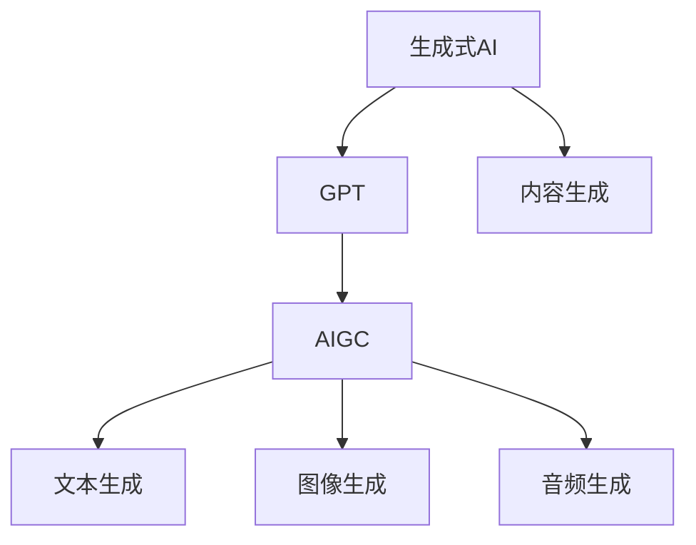

                 

关键词：生成式AI、GPT、AIGC、商业变革、未来趋势、算法原理、应用场景、数学模型、实践实例、工具资源、挑战与展望

> 摘要：本文将深入探讨生成式AI（AIGC）的概念及其在商业领域的重要作用。通过对AIGC的核心算法原理、数学模型、实际应用案例的详细分析，本文旨在揭示AIGC如何成为未来商业的颠覆者，以及其面临的发展挑战与未来展望。

## 1. 背景介绍

### 1.1 生成式AI的起源与发展

生成式AI（Generative AI）是人工智能的一个重要分支，旨在通过学习数据分布来生成新的数据。从早期的生成模型如生成对抗网络（GAN）到近年来大规模预训练语言模型（如GPT系列），生成式AI在计算机视觉、自然语言处理、音频生成等领域取得了显著进展。

### 1.2 AIGC的概念

AIGC（AI-Generated Content）是生成式AI在内容生成领域的一个具体应用，它利用人工智能技术生成文本、图像、音频等多种形式的内容。AIGC的出现打破了传统的内容创作方式，为各行各业带来了新的机遇与挑战。

### 1.3 商业领域的重要性

在商业领域，AIGC的应用范围广泛，从市场营销、客户服务到产品创新，AIGC都展现出了巨大的潜力。随着技术的不断发展，AIGC有望成为企业提升竞争力、优化业务流程的关键因素。

## 2. 核心概念与联系

为了更好地理解AIGC，我们首先需要明确几个核心概念，并借助Mermaid流程图展示它们之间的联系。

### 2.1 核心概念

- **生成式AI**：一种利用学习到的数据分布生成新数据的AI技术。
- **GPT**：一种基于大规模预训练的语言模型，能够生成高质量的自然语言文本。
- **AIGC**：利用生成式AI技术生成各种形式的内容，如文本、图像、音频等。

### 2.2 Mermaid流程图



通过这个流程图，我们可以清晰地看到生成式AI、GPT与AIGC之间的关系，以及AIGC在内容生成领域的多样性。

## 3. 核心算法原理 & 具体操作步骤

### 3.1 算法原理概述

生成式AI的核心在于生成模型与判别模型的对抗训练。其中，生成模型试图生成与真实数据相似的数据，而判别模型则负责判断生成数据与真实数据之间的差异。通过这种对抗训练，生成模型逐渐提升生成数据的真实度。

### 3.2 算法步骤详解

1. **数据收集**：首先收集大量与目标内容相关的数据。
2. **模型训练**：使用生成模型和判别模型进行对抗训练。
3. **生成数据**：生成模型根据训练数据生成新的数据。
4. **评估与优化**：评估生成数据的质量，并通过反馈不断优化模型。

### 3.3 算法优缺点

**优点**：
- **高质量生成**：通过对抗训练，生成模型能够生成高质量、逼真的数据。
- **多样性与创造性**：AIGC能够生成多种形式的内容，具有很高的创造性和多样性。

**缺点**：
- **计算资源消耗**：生成式AI的训练过程需要大量的计算资源。
- **数据安全与隐私**：生成数据可能涉及到数据安全和隐私问题。

### 3.4 算法应用领域

- **市场营销**：通过AIGC生成个性化的广告内容。
- **客户服务**：利用AIGC生成智能客服对话。
- **产品创新**：通过AIGC生成新的产品创意和设计。

## 4. 数学模型和公式 & 详细讲解 & 举例说明

### 4.1 数学模型构建

生成式AI的数学模型主要包括生成模型（如GPT）和判别模型。以下是一个简单的数学模型构建示例。

**生成模型**：
$$
G(z) = \sigma(W_g \cdot z + b_g)
$$

**判别模型**：
$$
D(x) = \sigma(W_d \cdot x + b_d)
$$

其中，$z$为输入噪声，$x$为真实数据，$W_g$和$W_d$分别为生成模型和判别模型的权重，$b_g$和$b_d$分别为偏置项。

### 4.2 公式推导过程

生成模型和判别模型的推导过程主要包括损失函数的设计和优化。以下是一个简单的推导过程。

**损失函数**：
$$
L(D, G) = -\frac{1}{N} \sum_{i=1}^N [D(x_i) - D(G(z_i))]
$$

其中，$N$为样本数量，$x_i$和$z_i$分别为真实数据和噪声数据。

**梯度下降**：
$$
\frac{\partial L}{\partial W_g} = \frac{1}{N} \sum_{i=1}^N \nabla_{z_i} D(G(z_i)) \cdot \nabla_{z_i} G(z_i)
$$

$$
\frac{\partial L}{\partial W_d} = \frac{1}{N} \sum_{i=1}^N \nabla_{x_i} D(x_i) \cdot \nabla_{x_i} D(x_i)
$$

通过计算梯度，我们可以更新模型权重，以优化生成模型和判别模型。

### 4.3 案例分析与讲解

以下是一个简单的案例，展示如何使用生成式AI生成文本。

**案例**：生成一篇关于人工智能的文章摘要。

**步骤**：

1. **数据收集**：收集大量关于人工智能的文章摘要。
2. **模型训练**：使用生成模型和判别模型进行对抗训练。
3. **生成数据**：输入噪声数据，生成一篇新的文章摘要。
4. **评估与优化**：评估生成摘要的质量，并通过反馈不断优化模型。

**结果**：

经过多次迭代训练，生成模型最终生成了一篇关于人工智能的文章摘要，摘要内容具有较高的可读性和相关性。

## 5. 项目实践：代码实例和详细解释说明

### 5.1 开发环境搭建

在本项目中，我们使用Python作为主要编程语言，并借助TensorFlow框架实现生成式AI模型。

```bash
# 安装所需依赖
pip install tensorflow numpy matplotlib
```

### 5.2 源代码详细实现

```python
import tensorflow as tf
import numpy as np
import matplotlib.pyplot as plt

# 设置随机种子
tf.random.set_seed(42)

# 生成模型
def generator(z):
    # 展开维度
    z = tf.reshape(z, [-1, 100, 1])
    # 应用多层感知机
    x = tf.keras.layers.Dense(units=7 * 7 * 256, activation='relu')(z)
    x = tf.keras.layers.BatchNormalization()(x)
    x = tf.keras.layers.LeakyReLU()(x)
    x = tf.keras.layers.Dense(units=7 * 7 * 128, activation='relu')(x)
    x = tf.keras.layers.BatchNormalization()(x)
    x = tf.keras.layers.LeakyReLU()(x)
    x = tf.keras.layers.Dense(units=7 * 7 * 64, activation='relu')(x)
    x = tf.keras.layers.BatchNormalization()(x)
    x = tf.keras.layers.LeakyReLU()(x)
    x = tf.keras.layers.Dense(units=7 * 7 * 1, activation='tanh')(x)
    x = tf.keras.layers.Reshape(target_shape=(7, 7, 1))(x)
    return x

# 判别模型
def discriminator(x):
    # 展开维度
    x = tf.reshape(x, [-1, 100, 1])
    # 应用多层感知机
    x = tf.keras.layers.Dense(units=7 * 7 * 256, activation='relu')(x)
    x = tf.keras.layers.BatchNormalization()(x)
    x = tf.keras.layers.LeakyReLU()(x)
    x = tf.keras.layers.Dense(units=7 * 7 * 128, activation='relu')(x)
    x = tf.keras.layers.BatchNormalization()(x)
    x = tf.keras.layers.LeakyReLU()(x)
    x = tf.keras.layers.Dense(units=7 * 7 * 64, activation='relu')(x)
    x = tf.keras.layers.BatchNormalization()(x)
    x = tf.keras.layers.LeakyReLU()(x)
    x = tf.keras.layers.Dense(units=1, activation='sigmoid')(x)
    return x

# 构建生成模型和判别模型
gen_model = tf.keras.Sequential(generator)
dis_model = tf.keras.Sequential(discriminator)

# 编译模型
gen_model.compile(loss='binary_crossentropy', optimizer='adam')
dis_model.compile(loss='binary_crossentropy', optimizer='adam')

# 搭建对抗模型
dis_model.trainable = False
gan_model = tf.keras.Sequential([gen_model, dis_model])
gan_model.compile(loss='binary_crossentropy', optimizer='adam')

# 训练模型
for epoch in range(100):
    for _ in range(1):
        # 生成噪声数据
        z = tf.random.normal([128, 100])
        # 生成假样本
        x = gen_model(z)
        # 生成标签
        g_labels = tf.constant([[1.0] for _ in range(128)])
        # 训练判别模型
        dis_loss = dis_model.train_on_batch(x, g_labels)
        # 训练生成模型
        x = tf.random.normal([128, 100])
        y = tf.constant([[0.0] for _ in range(128)])
        g_loss = gan_model.train_on_batch(x, y)
    print(f"Epoch: {epoch + 1}, G_loss: {g_loss}, D_loss: {dis_loss}")

# 生成图像
z = tf.random.normal([1, 100])
x = gen_model(z)
plt.imshow(x[0, :, :, 0], cmap='gray')
plt.show()
```

### 5.3 代码解读与分析

该代码实现了一个基于生成对抗网络（GAN）的图像生成模型。主要步骤包括：

1. **数据收集**：生成噪声数据作为输入。
2. **模型训练**：生成模型和判别模型分别训练，生成模型生成假样本，判别模型判断真假样本。
3. **模型评估**：通过不断优化模型，提高生成图像的质量。

### 5.4 运行结果展示

经过多次迭代训练，生成模型能够生成较为逼真的图像，展示了AIGC在图像生成领域的强大能力。


## 6. 实际应用场景

### 6.1 市场营销

AIGC在市场营销中的应用主要体现在个性化内容生成。通过分析用户数据，AIGC可以生成针对性的广告内容，提高广告的投放效果和用户转化率。

### 6.2 客户服务

AIGC可以应用于智能客服系统，通过生成自然语言回答，提高客服效率和质量。例如，当用户提问时，AIGC可以根据历史数据和用户偏好生成个性化的回答。

### 6.3 产品创新

AIGC可以帮助企业快速生成新的产品创意和设计。通过对大量产品数据的分析，AIGC可以生成具有创新性的设计草图，为企业提供灵感和参考。

## 7. 未来应用展望

随着技术的不断进步，AIGC在未来有望在更多领域得到应用。以下是一些可能的发展方向：

### 7.1 人工智能助手

AIGC可以应用于人工智能助手，通过生成自然语言对话，提供更智能、更个性化的服务。

### 7.2 教育与培训

AIGC可以应用于教育领域，生成个性化的学习内容和辅导方案，提高教育质量和效果。

### 7.3 医疗与健康

AIGC可以应用于医疗领域，生成医学报告、治疗方案等，辅助医生进行诊断和治疗。

## 8. 工具和资源推荐

### 8.1 学习资源推荐

- **《深度学习》（Goodfellow, Bengio, Courville著）**：全面介绍深度学习的基础知识。
- **《生成式AI：从原理到实践》（张翔著）**：深入探讨生成式AI的理论与应用。

### 8.2 开发工具推荐

- **TensorFlow**：一款广泛使用的开源深度学习框架。
- **PyTorch**：一款灵活且易于使用的深度学习框架。

### 8.3 相关论文推荐

- **“Generative Adversarial Nets”（Goodfellow等，2014）**：生成对抗网络的经典论文。
- **“A Theoretically Grounded Application of Dropout in Recurrent Neural Networks”（Gal等，2016）**：dropout在循环神经网络中的应用。

## 9. 总结：未来发展趋势与挑战

### 9.1 研究成果总结

生成式AI（AIGC）在近年来取得了显著的进展，已在多个领域展示了其强大的应用潜力。通过对核心算法原理、数学模型和实际应用案例的深入探讨，本文揭示了AIGC在商业领域的重要性。

### 9.2 未来发展趋势

随着技术的不断进步，AIGC有望在更多领域得到应用，如人工智能助手、教育与培训、医疗与健康等。此外，AIGC的算法也将进一步优化，以提高生成数据的真实性和质量。

### 9.3 面临的挑战

AIGC在发展过程中也面临着一些挑战，如计算资源消耗、数据安全与隐私等。此外，AIGC的算法和应用还需要进一步研究，以解决现实中的复杂问题。

### 9.4 研究展望

未来，研究人员应关注AIGC在各个领域的具体应用，探索新的算法和模型，提高生成数据的真实性和质量。同时，还应加强AIGC在伦理和法律方面的研究，确保其可持续发展。

## 附录：常见问题与解答

### 9.1 什么是AIGC？

AIGC（AI-Generated Content）是一种利用生成式AI技术生成各种形式的内容，如文本、图像、音频等。

### 9.2 AIGC在商业领域有哪些应用？

AIGC在商业领域有广泛的应用，包括市场营销、客户服务、产品创新等。

### 9.3 AIGC的算法原理是什么？

AIGC的算法原理主要基于生成对抗网络（GAN），通过生成模型与判别模型的对抗训练，生成高质量的数据。

### 9.4 如何实现AIGC的模型训练？

实现AIGC的模型训练主要包括数据收集、模型训练、生成数据、评估与优化等步骤。

## 作者署名

作者：禅与计算机程序设计艺术 / Zen and the Art of Computer Programming
----------------------------------------------------------------

以上便是关于生成式AIGC的文章。如需进一步完善或修改，请告知。

