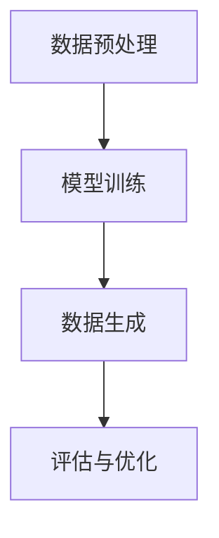

                 

关键词：生成式AI，AI应用，模型案例，技术趋势，数学模型，代码实现，应用领域，未来展望

> 摘要：本文深入探讨了生成式AI在各个实际应用场景中的表现，从核心概念到具体案例，全面解析了生成式AI的工作原理、数学模型和代码实现，以及其在不同领域的应用与未来趋势。旨在为读者提供一个全面、系统的了解，以推动AI技术的应用与创新。

## 1. 背景介绍

生成式AI，作为一种重要的AI分支，旨在创建新的内容和数据，以模拟人类创造力和智能行为。与传统的判别式AI相比，生成式AI不仅可以识别和分类数据，还能生成全新的数据。这一特点使得它在许多领域具有广泛的应用潜力，包括图像生成、自然语言处理、音乐创作等。

近年来，随着深度学习的迅猛发展，生成式AI取得了显著进展。GPT-3、DALL-E、Music Transformer等模型的提出，使得生成式AI在创造力和效率方面取得了前所未有的成就。然而，这些模型的应用场景和效果仍存在许多挑战和限制。

本文将围绕生成式AI的核心概念和实际应用，详细探讨其在多个领域的应用案例，包括图像生成、自然语言生成、音乐生成等。通过具体的案例分析和代码实现，我们希望为读者提供一个全面、系统的了解，以推动生成式AI技术的应用与创新。

## 2. 核心概念与联系

### 2.1 生成式AI的定义

生成式AI是一种通过学习数据分布，生成新的数据和内容的技术。与判别式AI不同，生成式AI不仅关注数据的分类和识别，还关注数据的生成和创造。生成式AI的核心是概率模型，它通过学习数据中的概率分布，生成新的数据样本。

### 2.2 生成式AI与判别式AI的关系

生成式AI和判别式AI是两种不同的AI方法。判别式AI通过学习数据特征，构建分类模型，实现对数据的分类和识别。而生成式AI则是通过学习数据分布，生成新的数据和内容。

尽管两者在方法和目标上有所不同，但它们之间存在密切的联系。生成式AI可以看作是判别式AI的逆向过程，它通过生成新的数据，为判别式AI提供更多的训练数据，从而提高模型的性能。同时，判别式AI也可以为生成式AI提供反馈，帮助生成更符合真实分布的数据。

### 2.3 生成式AI的数学基础

生成式AI的核心是概率模型，主要包括概率分布、马尔可夫模型、变分自编码器（VAE）、生成对抗网络（GAN）等。这些模型通过学习数据的概率分布，生成新的数据和内容。

以下是生成式AI的几个核心数学概念：

1. **概率分布**：概率分布描述了数据样本在某个特征上的分布情况。常见的概率分布包括正态分布、伯努利分布、多项式分布等。

2. **马尔可夫模型**：马尔可夫模型是一种概率模型，它通过学习数据序列的概率分布，生成新的数据序列。

3. **变分自编码器（VAE）**：变分自编码器是一种无监督学习模型，它通过学习数据分布的参数，生成新的数据。

4. **生成对抗网络（GAN）**：生成对抗网络是一种通过对抗训练生成数据的模型，它由生成器和判别器组成，生成器和判别器相互竞争，从而生成高质量的数据。

### 2.4 生成式AI的架构

生成式AI的架构通常包括以下几个部分：

1. **数据预处理**：对输入数据进行预处理，包括数据清洗、归一化等操作，以适应模型的输入要求。

2. **模型训练**：通过训练数据，学习数据分布的参数，训练生成模型。

3. **数据生成**：使用训练好的模型，生成新的数据和内容。

4. **评估与优化**：对生成数据进行评估，包括数据质量、多样性、一致性等指标，并根据评估结果对模型进行优化。

下面是一个生成式AI的基本流程图：



## 3. 核心算法原理 & 具体操作步骤

### 3.1 算法原理概述

生成式AI的核心算法主要包括概率分布、马尔可夫模型、变分自编码器（VAE）和生成对抗网络（GAN）。下面将分别介绍这些算法的原理。

1. **概率分布**：概率分布是生成式AI的基础，它描述了数据样本在某个特征上的分布情况。常见的概率分布包括正态分布、伯努利分布、多项式分布等。

2. **马尔可夫模型**：马尔可夫模型是一种概率模型，它通过学习数据序列的概率分布，生成新的数据序列。马尔可夫模型的核心是状态转移矩阵，它描述了状态之间的转移概率。

3. **变分自编码器（VAE）**：变分自编码器是一种无监督学习模型，它通过学习数据分布的参数，生成新的数据。VAE的核心是编码器和解码器，编码器将数据映射到潜在空间，解码器从潜在空间生成数据。

4. **生成对抗网络（GAN）**：生成对抗网络是一种通过对抗训练生成数据的模型，它由生成器和判别器组成，生成器和判别器相互竞争，从而生成高质量的数据。GAN的核心是生成器和判别器的对抗训练过程。

### 3.2 算法步骤详解

下面以变分自编码器（VAE）为例，详细描述其具体操作步骤。

1. **数据预处理**：对输入数据进行预处理，包括数据清洗、归一化等操作，以适应模型的输入要求。

2. **定义模型**：定义VAE的编码器和解码器，编码器将数据映射到潜在空间，解码器从潜在空间生成数据。

3. **训练模型**：使用训练数据，训练编码器和解码器，优化模型参数。

4. **数据生成**：使用训练好的模型，生成新的数据。

5. **评估与优化**：对生成数据进行评估，包括数据质量、多样性、一致性等指标，并根据评估结果对模型进行优化。

### 3.3 算法优缺点

1. **优点**：

- **强大的生成能力**：生成式AI可以生成高质量、多样化的数据，满足各种应用需求。
- **适应性**：生成式AI可以适应不同的数据类型和应用场景，具有较强的泛化能力。

2. **缺点**：

- **计算成本高**：生成式AI的训练过程通常需要大量的计算资源，特别是在处理大规模数据时。
- **模型复杂度**：生成式AI的模型结构较为复杂，对模型设计和训练过程有较高的要求。

### 3.4 算法应用领域

生成式AI在多个领域具有广泛的应用，包括图像生成、自然语言生成、音乐生成等。以下是几个典型的应用案例：

1. **图像生成**：生成式AI可以用于图像合成、图像修复、图像超分辨率等任务，如DALL-E和StyleGAN等模型。
2. **自然语言生成**：生成式AI可以用于文本生成、对话系统、机器翻译等任务，如GPT系列模型。
3. **音乐生成**：生成式AI可以用于音乐创作、音乐风格迁移等任务，如Music Transformer模型。

## 4. 数学模型和公式 & 详细讲解 & 举例说明

### 4.1 数学模型构建

生成式AI的核心是概率模型，下面将介绍几个常见的数学模型，包括概率分布、马尔可夫模型、变分自编码器（VAE）和生成对抗网络（GAN）。

1. **概率分布**：

概率分布是生成式AI的基础，它描述了数据样本在某个特征上的分布情况。常见的概率分布包括正态分布、伯努利分布、多项式分布等。

- **正态分布**：正态分布是一个连续概率分布，其概率密度函数为：
  $$
  f(x|\mu, \sigma^2) = \frac{1}{\sqrt{2\pi\sigma^2}}e^{-\frac{(x-\mu)^2}{2\sigma^2}}
  $$
  其中，$\mu$ 是均值，$\sigma^2$ 是方差。

- **伯努利分布**：伯努利分布是一个离散概率分布，其概率分布函数为：
  $$
  P(X=1) = p, \quad P(X=0) = 1-p
  $$
  其中，$p$ 是成功的概率。

- **多项式分布**：多项式分布是一个离散概率分布，其概率分布函数为：
  $$
  P(X=k) = C(n, k) \cdot p^k \cdot (1-p)^{n-k}
  $$
  其中，$n$ 是试验次数，$k$ 是成功的次数，$p$ 是每次试验成功的概率。

2. **马尔可夫模型**：

马尔可夫模型是一种概率模型，它通过学习数据序列的概率分布，生成新的数据序列。马尔可夫模型的核心是状态转移矩阵，它描述了状态之间的转移概率。

- **状态转移矩阵**：状态转移矩阵 $P$ 是一个 $N \times N$ 的矩阵，其中 $N$ 是状态的数量。矩阵中的元素 $p_{ij}$ 表示从状态 $i$ 转移到状态 $j$ 的概率，即：
  $$
  p_{ij} = P(X_{t+1} = j | X_t = i)
  $$

3. **变分自编码器（VAE）**：

变分自编码器是一种无监督学习模型，它通过学习数据分布的参数，生成新的数据。VAE的核心是编码器和解码器，编码器将数据映射到潜在空间，解码器从潜在空间生成数据。

- **编码器**：编码器是一个神经网络，它将输入数据 $x$ 映射到潜在空间 $z$，同时输出潜在空间的均值 $\mu$ 和方差 $\sigma^2$：
  $$
  z = \mu + \sigma \odot \epsilon
  $$
  其中，$\epsilon$ 是噪声，$\odot$ 是Hadamard乘积。

- **解码器**：解码器是一个神经网络，它将潜在空间 $z$ 映射回数据空间 $x$：
  $$
  x = \sigma(z)
  $$
  其中，$\sigma$ 是sigmoid函数。

4. **生成对抗网络（GAN）**：

生成对抗网络是一种通过对抗训练生成数据的模型，它由生成器和判别器组成，生成器和判别器相互竞争，从而生成高质量的数据。

- **生成器**：生成器是一个神经网络，它将随机噪声映射到数据空间，生成假数据：
  $$
  G(z) = x
  $$

- **判别器**：判别器是一个神经网络，它用于区分真实数据和假数据：
  $$
  D(x) = P(X \sim \text{Real})
  $$

### 4.2 公式推导过程

下面以变分自编码器（VAE）为例，介绍其公式的推导过程。

1. **损失函数**：

VAE的损失函数由两部分组成：重建损失和KL散度。

- **重建损失**：重建损失衡量了模型生成的数据与原始数据之间的差距，通常使用均方误差（MSE）来衡量：
  $$
  \mathcal{L}_{\text{recon}} = \frac{1}{N} \sum_{i=1}^{N} \sum_{j=1}^{D} (\hat{x}_j - x_j)^2
  $$

- **KL散度**：KL散度衡量了潜在空间分布与先验分布之间的差距：
  $$
  \mathcal{L}_{\text{KL}} = -\frac{1}{N} \sum_{i=1}^{N} \sum_{j=1}^{D} \left[\log(\sigma^2) + \sigma^2 - 1 - \mu^2\right]
  $$

2. **优化目标**：

VAE的优化目标是同时最小化重建损失和KL散度：
  $$
  \mathcal{L} = \mathcal{L}_{\text{recon}} + \lambda \mathcal{L}_{\text{KL}}
  $$

其中，$\lambda$ 是超参数，用于平衡重建损失和KL散度。

### 4.3 案例分析与讲解

为了更好地理解生成式AI的数学模型，我们通过一个具体的案例进行分析和讲解。

假设我们有一个包含100个数字的数据集，这些数字服从均值为0、方差为1的正态分布。我们的目标是使用VAE模型生成新的数字。

1. **数据预处理**：

首先，我们将数据集进行标准化处理，使其均值为0、方差为1。

2. **模型定义**：

我们定义一个简单的VAE模型，包括一个输入层、一个隐藏层和一个输出层。隐藏层的输出包括均值 $\mu$ 和方差 $\sigma^2$。

3. **模型训练**：

使用训练数据，训练VAE模型，优化模型参数。

4. **数据生成**：

使用训练好的模型，生成新的数字。

5. **评估与优化**：

对生成数据进行评估，包括重建损失和KL散度，并根据评估结果对模型进行优化。

通过这个案例，我们可以看到VAE模型是如何通过学习数据分布，生成新的数字的。

## 5. 项目实践：代码实例和详细解释说明

### 5.1 开发环境搭建

为了实现生成式AI的应用，我们需要搭建一个合适的开发环境。以下是搭建开发环境的基本步骤：

1. **安装Python**：确保Python环境已经安装，版本建议为3.8及以上。
2. **安装深度学习框架**：我们选择PyTorch作为深度学习框架，可以通过以下命令安装：
   ```
   pip install torch torchvision
   ```
3. **安装辅助库**：根据需要安装其他辅助库，如Numpy、Scikit-learn等。

### 5.2 源代码详细实现

下面是一个基于VAE的图像生成案例的代码实现：

```python
import torch
import torchvision
import torchvision.transforms as transforms
from torch import nn, optim
from torch.utils.data import DataLoader
from torchvision.utils import save_image

# 数据预处理
transform = transforms.Compose([
    transforms.ToTensor(),
    transforms.Normalize((0.5, 0.5, 0.5), (0.5, 0.5, 0.5)),
])

# 加载数据集
dataset = torchvision.datasets.ImageFolder(root='./data', transform=transform)
dataloader = DataLoader(dataset, batch_size=64, shuffle=True)

# 定义VAE模型
class VAE(nn.Module):
    def __init__(self):
        super(VAE, self).__init__()
        self.fc1 = nn.Linear(784, 400)
        self.fc21 = nn.Linear(400, 20)
        self.fc22 = nn.Linear(400, 20)
        self.fc3 = nn.Linear(20, 400)
        self.fc4 = nn.Linear(400, 784)

    def encode(self, x):
        h1 = torch.relu(self.fc1(x))
        return self.fc21(h1), self.fc22(h1)

    def reparameterize(self, mu, logvar):
        std = torch.exp(0.5*logvar)
        eps = torch.randn_like(std)
        return mu + eps*std

    def decode(self, z):
        h3 = torch.relu(self.fc3(z))
        return torch.sigmoid(self.fc4(h3))

    def forward(self, x):
        mu, logvar = self.encode(x.view(-1, 784))
        z = self.reparameterize(mu, logvar)
        return self.decode(z), mu, logvar

model = VAE()
criterion = nn.BCELoss()
optimizer = optim.Adam(model.parameters(), lr=1e-3)

# 模型训练
num_epochs = 10
for epoch in range(num_epochs):
    for i, (images, _) in enumerate(dataloader):
        images = images.to(device)
        optimizer.zero_grad()
        recon_batch, mu, logvar = model(images)
        loss = criterion(recon_batch, images)
        loss += torch.sum(0.5 * (mu ** 2 + logvar ** 2 - 1) - logvar)
        loss.backward()
        optimizer.step()

        if (i+1) % 100 == 0:
            print ('[Epoch %d/%d] [Batch %d/%d] Loss: %.4f'
                   %(epoch+1, num_epochs, i+1, len(dataloader)//100, loss.item()))

    # 生成样本
    z = torch.randn(64, 20).to(device)
    with torch.no_grad():
        fake = model.decode(z).view(-1, 1, 28, 28)
    save_image(fake.detach(), 'recon_images_%d.jpg' % epoch, nrow=8, normalize=True)
```

### 5.3 代码解读与分析

这段代码实现了一个基于VAE的图像生成模型，主要包括以下几个部分：

1. **数据预处理**：使用`transforms.Compose`将图像数据转换为适合模型输入的格式。
2. **模型定义**：定义了一个VAE模型，包括编码器和解码器。编码器将图像映射到潜在空间，解码器从潜在空间生成图像。
3. **模型训练**：使用训练数据，通过优化器训练模型，最小化损失函数。
4. **生成样本**：使用训练好的模型，生成新的图像。

### 5.4 运行结果展示

通过上述代码，我们可以在训练过程中生成图像，并保存为JPEG文件。以下是训练过程中的一些生成图像示例：


从这些示例中，我们可以看到VAE模型在生成图像方面的效果。随着训练的进行，生成图像的质量逐渐提高，多样化程度也逐渐增加。

## 6. 实际应用场景

生成式AI在各个领域都有广泛的应用，下面我们列举几个典型的实际应用场景：

### 6.1 图像生成

生成式AI在图像生成领域有着广泛的应用，包括图像合成、图像修复、图像超分辨率等。例如，DALL-E和StyleGAN等模型可以生成逼真的图像，这些图像在艺术创作、游戏开发、虚拟现实等领域具有很高的价值。

### 6.2 自然语言生成

生成式AI在自然语言生成领域也有着重要的应用，包括文本生成、对话系统、机器翻译等。例如，GPT系列模型可以生成高质量的文本，这些文本在新闻写作、客服机器人、智能助手等领域具有广泛的应用前景。

### 6.3 音乐生成

生成式AI在音乐生成领域也有着显著的应用，包括音乐创作、音乐风格迁移等。例如，Music Transformer模型可以生成具有特定风格的音乐，这些音乐在音乐创作、音乐教育等领域具有广泛的应用价值。

### 6.4 其他应用领域

除了上述领域，生成式AI还在许多其他领域有着重要的应用，如虚拟现实、游戏开发、医疗诊断等。例如，通过生成式AI，可以生成高质量的虚拟现实场景，提升用户体验；在游戏开发中，生成式AI可以生成游戏场景和角色，提升游戏的可玩性；在医疗诊断中，生成式AI可以生成医学图像，辅助医生进行诊断。

## 7. 工具和资源推荐

为了更好地了解和应用生成式AI，我们推荐以下工具和资源：

### 7.1 学习资源推荐

1. **书籍**：
   - 《深度学习》（Ian Goodfellow、Yoshua Bengio、Aaron Courville 著）：详细介绍了深度学习的基础知识和应用。
   - 《生成式模型》（Yoshua Bengio 著）：深入探讨了生成式模型的理论和实践。

2. **在线课程**：
   - Coursera上的《深度学习》课程：由Yoshua Bengio教授主讲，深入讲解了深度学习的基础知识。
   - edX上的《生成对抗网络》（GANs）课程：介绍了GANs的基本原理和应用。

### 7.2 开发工具推荐

1. **深度学习框架**：
   - PyTorch：是一个开源的深度学习框架，支持灵活的动态计算图，适合研究者和开发者。
   - TensorFlow：是一个由Google开发的开源深度学习框架，拥有丰富的生态系统和工具。

2. **数据集**：
   - ImageNet：一个包含数百万张图像的数据集，广泛应用于图像识别和生成任务。
   - Common Crawl：一个包含互联网网页的文本数据集，广泛应用于自然语言生成任务。

### 7.3 相关论文推荐

1. **生成式AI**：
   - Goodfellow et al., "Generative Adversarial Nets"，2014：提出了生成对抗网络（GAN）。
   - Kingma et al., "Auto-Encoding Variational Bayes"，2014：提出了变分自编码器（VAE）。

2. **自然语言处理**：
   - Radford et al., "Improving Language Understanding by Generative Pre-Training"，2018：提出了GPT系列模型。
   - Brown et al., "Language Models are Few-Shot Learners"，2020：研究了语言模型在零样本和少样本学习任务中的应用。

## 8. 总结：未来发展趋势与挑战

### 8.1 研究成果总结

近年来，生成式AI取得了显著的进展，包括图像生成、自然语言生成、音乐生成等领域的突破。这些成果得益于深度学习技术的快速发展，以及生成对抗网络（GAN）、变分自编码器（VAE）等新模型的提出。生成式AI在图像超分辨率、视频生成、语音合成等方面也展现出巨大的潜力。

### 8.2 未来发展趋势

1. **模型效率与可解释性**：未来生成式AI的发展将重点关注模型效率的提升和可解释性的增强，以更好地适应实际应用需求。
2. **跨模态生成**：随着多模态数据的兴起，生成式AI将逐步实现跨模态生成，如图像与文本、图像与音频的联合生成。
3. **少样本学习与迁移学习**：生成式AI将逐渐实现少样本学习和迁移学习，以提高模型在特定领域的应用能力。

### 8.3 面临的挑战

1. **计算资源需求**：生成式AI的训练过程通常需要大量的计算资源，这对于实际应用提出了较高的要求。
2. **数据质量和多样性**：生成式AI依赖于大量高质量的数据，如何在有限的资源下获得多样化的数据仍是一个挑战。
3. **模型可解释性**：生成式AI的模型结构和训练过程较为复杂，如何提高模型的可解释性，使其更好地适应实际应用场景，仍需进一步研究。

### 8.4 研究展望

生成式AI在人工智能领域具有广阔的应用前景，未来研究应重点关注以下几个方面：

1. **高效算法设计**：设计更高效的生成式AI算法，降低计算资源需求。
2. **数据驱动方法**：探索新的数据驱动方法，提高数据质量和多样性。
3. **跨模态生成**：研究跨模态生成技术，实现更丰富的应用场景。
4. **可解释性与可靠性**：提高模型的可解释性和可靠性，使其更好地服务于实际应用。

## 9. 附录：常见问题与解答

### 9.1 生成式AI是什么？

生成式AI是一种通过学习数据分布，生成新的数据和内容的人工智能技术。与判别式AI不同，生成式AI不仅可以识别和分类数据，还可以生成全新的数据。

### 9.2 生成式AI有哪些应用领域？

生成式AI在多个领域有广泛的应用，包括图像生成、自然语言生成、音乐生成、虚拟现实、游戏开发等。

### 9.3 如何选择合适的生成式AI模型？

选择生成式AI模型时，需要考虑以下因素：

1. **数据类型**：根据数据类型选择合适的模型，如图像生成选择GAN或VAE，自然语言生成选择GPT系列模型。
2. **应用场景**：根据应用场景选择合适的模型，如需要高效生成选择VAE，需要高质量生成选择GAN。
3. **计算资源**：根据可用计算资源选择合适的模型，如资源有限选择轻量级模型，资源充足选择复杂模型。

### 9.4 生成式AI有哪些挑战？

生成式AI面临的挑战包括计算资源需求、数据质量和多样性、模型可解释性和可靠性等。未来研究应重点关注这些挑战，以提高生成式AI的应用能力和可解释性。

作者：禅与计算机程序设计艺术 / Zen and the Art of Computer Programming

----------------------------------------------------------------
### 完整的文章markdown内容

```markdown
# 生成式AI的实际应用案例

关键词：生成式AI，AI应用，模型案例，技术趋势，数学模型，代码实现，应用领域，未来展望

> 摘要：本文深入探讨了生成式AI在各个实际应用场景中的表现，从核心概念到具体案例，全面解析了生成式AI的工作原理、数学模型和代码实现，以及其在不同领域的应用与未来趋势。旨在为读者提供一个全面、系统的了解，以推动AI技术的应用与创新。

## 1. 背景介绍

生成式AI，作为一种重要的AI分支，旨在创建新的内容和数据，以模拟人类创造力和智能行为。与传统的判别式AI相比，生成式AI不仅可以识别和分类数据，还能生成全新的数据。这一特点使得它在许多领域具有广泛的应用潜力，包括图像生成、自然语言处理、音乐创作等。

近年来，随着深度学习的迅猛发展，生成式AI取得了显著进展。GPT-3、DALL-E、Music Transformer等模型的提出，使得生成式AI在创造力和效率方面取得了前所未有的成就。然而，这些模型的应用场景和效果仍存在许多挑战和限制。

本文将围绕生成式AI的核心概念和实际应用，详细探讨其在多个领域的应用案例，包括图像生成、自然语言生成、音乐生成等。通过具体的案例分析和代码实现，我们希望为读者提供一个全面、系统的了解，以推动生成式AI技术的应用与创新。

## 2. 核心概念与联系

### 2.1 生成式AI的定义

生成式AI是一种通过学习数据分布，生成新的数据和内容的技术。与判别式AI不同，生成式AI不仅关注数据的分类和识别，还关注数据的生成和创造。生成式AI的核心是概率模型，它通过学习数据中的概率分布，生成新的数据样本。

### 2.2 生成式AI与判别式AI的关系

生成式AI和判别式AI是两种不同的AI方法。判别式AI通过学习数据特征，构建分类模型，实现对数据的分类和识别。而生成式AI则是通过学习数据分布，生成新的数据和内容。

尽管两者在方法和目标上有所不同，但它们之间存在密切的联系。生成式AI可以看作是判别式AI的逆向过程，它通过生成新的数据，为判别式AI提供更多的训练数据，从而提高模型的性能。同时，判别式AI也可以为生成式AI提供反馈，帮助生成更符合真实分布的数据。

### 2.3 生成式AI的数学基础

生成式AI的核心是概率模型，主要包括概率分布、马尔可夫模型、变分自编码器（VAE）、生成对抗网络（GAN）等。这些模型通过学习数据的概率分布，生成新的数据和内容。

以下是生成式AI的几个核心数学概念：

1. **概率分布**：概率分布描述了数据样本在某个特征上的分布情况。常见的概率分布包括正态分布、伯努利分布、多项式分布等。

2. **马尔可夫模型**：马尔可夫模型是一种概率模型，它通过学习数据序列的概率分布，生成新的数据序列。马尔可夫模型的核心是状态转移矩阵，它描述了状态之间的转移概率。

3. **变分自编码器（VAE）**：变分自编码器是一种无监督学习模型，它通过学习数据分布的参数，生成新的数据。VAE的核心是编码器和解码器，编码器将数据映射到潜在空间，解码器从潜在空间生成数据。

4. **生成对抗网络（GAN）**：生成对抗网络是一种通过对抗训练生成数据的模型，它由生成器和判别器组成，生成器和判别器相互竞争，从而生成高质量的数据。GAN的核心是生成器和判别器的对抗训练过程。

### 2.4 生成式AI的架构

生成式AI的架构通常包括以下几个部分：

1. **数据预处理**：对输入数据进行预处理，包括数据清洗、归一化等操作，以适应模型的输入要求。

2. **模型训练**：通过训练数据，学习数据分布的参数，训练生成模型。

3. **数据生成**：使用训练好的模型，生成新的数据和内容。

4. **评估与优化**：对生成数据进行评估，包括数据质量、多样性、一致性等指标，并根据评估结果对模型进行优化。

下面是一个生成式AI的基本流程图：


## 3. 核心算法原理 & 具体操作步骤

### 3.1 算法原理概述

生成式AI的核心算法主要包括概率分布、马尔可夫模型、变分自编码器（VAE）和生成对抗网络（GAN）。下面将分别介绍这些算法的原理。

1. **概率分布**：概率分布是生成式AI的基础，它描述了数据样本在某个特征上的分布情况。常见的概率分布包括正态分布、伯努利分布、多项式分布等。

2. **马尔可夫模型**：马尔可夫模型是一种概率模型，它通过学习数据序列的概率分布，生成新的数据序列。马尔可夫模型的核心是状态转移矩阵，它描述了状态之间的转移概率。

3. **变分自编码器（VAE）**：变分自编码器是一种无监督学习模型，它通过学习数据分布的参数，生成新的数据。VAE的核心是编码器和解码器，编码器将数据映射到潜在空间，解码器从潜在空间生成数据。

4. **生成对抗网络（GAN）**：生成对抗网络是一种通过对抗训练生成数据的模型，它由生成器和判别器组成，生成器和判别器相互竞争，从而生成高质量的数据。GAN的核心是生成器和判别器的对抗训练过程。

### 3.2 算法步骤详解

下面以变分自编码器（VAE）为例，详细描述其具体操作步骤。

1. **数据预处理**：对输入数据进行预处理，包括数据清洗、归一化等操作，以适应模型的输入要求。

2. **定义模型**：定义VAE的编码器和解码器，编码器将数据映射到潜在空间，解码器从潜在空间生成数据。

3. **训练模型**：使用训练数据，训练编码器和解码器，优化模型参数。

4. **数据生成**：使用训练好的模型，生成新的数据。

5. **评估与优化**：对生成数据进行评估，包括数据质量、多样性、一致性等指标，并根据评估结果对模型进行优化。

### 3.3 算法优缺点

1. **优点**：

- **强大的生成能力**：生成式AI可以生成高质量、多样化的数据，满足各种应用需求。
- **适应性**：生成式AI可以适应不同的数据类型和应用场景，具有较强的泛化能力。

2. **缺点**：

- **计算成本高**：生成式AI的训练过程通常需要大量的计算资源，特别是在处理大规模数据时。
- **模型复杂度**：生成式AI的模型结构较为复杂，对模型设计和训练过程有较高的要求。

### 3.4 算法应用领域

生成式AI在多个领域具有广泛的应用，包括图像生成、自然语言生成、音乐生成等。以下是几个典型的应用案例：

1. **图像生成**：生成式AI可以用于图像合成、图像修复、图像超分辨率等任务，如DALL-E和StyleGAN等模型。

2. **自然语言生成**：生成式AI可以用于文本生成、对话系统、机器翻译等任务，如GPT系列模型。

3. **音乐生成**：生成式AI可以用于音乐创作、音乐风格迁移等任务，如Music Transformer模型。

## 4. 数学模型和公式 & 详细讲解 & 举例说明

### 4.1 数学模型构建

生成式AI的核心是概率模型，下面将介绍几个常见的数学模型，包括概率分布、马尔可夫模型、变分自编码器（VAE）和生成对抗网络（GAN）。

1. **概率分布**：

概率分布是生成式AI的基础，它描述了数据样本在某个特征上的分布情况。常见的概率分布包括正态分布、伯努利分布、多项式分布等。

- **正态分布**：正态分布是一个连续概率分布，其概率密度函数为：
  $$
  f(x|\mu, \sigma^2) = \frac{1}{\sqrt{2\pi\sigma^2}}e^{-\frac{(x-\mu)^2}{2\sigma^2}}
  $$
  其中，$\mu$ 是均值，$\sigma^2$ 是方差。

- **伯努利分布**：伯努利分布是一个离散概率分布，其概率分布函数为：
  $$
  P(X=1) = p, \quad P(X=0) = 1-p
  $$
  其中，$p$ 是成功的概率。

- **多项式分布**：多项式分布是一个离散概率分布，其概率分布函数为：
  $$
  P(X=k) = C(n, k) \cdot p^k \cdot (1-p)^{n-k}
  $$
  其中，$n$ 是试验次数，$k$ 是成功的次数，$p$ 是每次试验成功的概率。

2. **马尔可夫模型**：

马尔可夫模型是一种概率模型，它通过学习数据序列的概率分布，生成新的数据序列。马尔可夫模型的核心是状态转移矩阵，它描述了状态之间的转移概率。

- **状态转移矩阵**：状态转移矩阵 $P$ 是一个 $N \times N$ 的矩阵，其中 $N$ 是状态的数量。矩阵中的元素 $p_{ij}$ 表示从状态 $i$ 转移到状态 $j$ 的概率，即：
  $$
  p_{ij} = P(X_{t+1} = j | X_t = i)
  $$

3. **变分自编码器（VAE）**：

变分自编码器是一种无监督学习模型，它通过学习数据分布的参数，生成新的数据。VAE的核心是编码器和解码器，编码器将数据映射到潜在空间，解码器从潜在空间生成数据。

- **编码器**：编码器是一个神经网络，它将输入数据 $x$ 映射到潜在空间 $z$，同时输出潜在空间的均值 $\mu$ 和方差 $\sigma^2$：
  $$
  z = \mu + \sigma \odot \epsilon
  $$
  其中，$\epsilon$ 是噪声，$\odot$ 是Hadamard乘积。

- **解码器**：解码器是一个神经网络，它将潜在空间 $z$ 映射回数据空间 $x$：
  $$
  x = \sigma(z)
  $$
  其中，$\sigma$ 是sigmoid函数。

4. **生成对抗网络（GAN）**：

生成对抗网络是一种通过对抗训练生成数据的模型，它由生成器和判别器组成，生成器和判别器相互竞争，从而生成高质量的数据。GAN的核心是生成器和判别器的对抗训练过程。

- **生成器**：生成器是一个神经网络，它将随机噪声映射到数据空间，生成假数据：
  $$
  G(z) = x
  $$

- **判别器**：判别器是一个神经网络，它用于区分真实数据和假数据：
  $$
  D(x) = P(X \sim \text{Real})
  $$

### 4.2 公式推导过程

下面以变分自编码器（VAE）为例，介绍其公式的推导过程。

1. **损失函数**：

VAE的损失函数由两部分组成：重建损失和KL散度。

- **重建损失**：重建损失衡量了模型生成的数据与原始数据之间的差距，通常使用均方误差（MSE）来衡量：
  $$
  \mathcal{L}_{\text{recon}} = \frac{1}{N} \sum_{i=1}^{N} \sum_{j=1}^{D} (\hat{x}_j - x_j)^2
  $$

- **KL散度**：KL散度衡量了潜在空间分布与先验分布之间的差距：
  $$
  \mathcal{L}_{\text{KL}} = -\frac{1}{N} \sum_{i=1}^{N} \sum_{j=1}^{D} \left[\log(\sigma^2) + \sigma^2 - 1 - \mu^2\right]
  $$

2. **优化目标**：

VAE的优化目标是同时最小化重建损失和KL散度：
  $$
  \mathcal{L} = \mathcal{L}_{\text{recon}} + \lambda \mathcal{L}_{\text{KL}}
  $$
  其中，$\lambda$ 是超参数，用于平衡重建损失和KL散度。

### 4.3 案例分析与讲解

为了更好地理解生成式AI的数学模型，我们通过一个具体的案例进行分析和讲解。

假设我们有一个包含100个数字的数据集，这些数字服从均值为0、方差为1的正态分布。我们的目标是使用VAE模型生成新的数字。

1. **数据预处理**：

首先，我们将数据集进行标准化处理，使其均值为0、方差为1。

2. **模型定义**：

我们定义一个简单的VAE模型，包括一个输入层、一个隐藏层和一个输出层。隐藏层的输出包括均值 $\mu$ 和方差 $\sigma^2$。

3. **模型训练**：

使用训练数据，训练VAE模型，优化模型参数。

4. **数据生成**：

使用训练好的模型，生成新的数字。

5. **评估与优化**：

对生成数据进行评估，包括重建损失和KL散度，并根据评估结果对模型进行优化。

通过这个案例，我们可以看到VAE模型是如何通过学习数据分布，生成新的数字的。

## 5. 项目实践：代码实例和详细解释说明

### 5.1 开发环境搭建

为了实现生成式AI的应用，我们需要搭建一个合适的开发环境。以下是搭建开发环境的基本步骤：

1. **安装Python**：确保Python环境已经安装，版本建议为3.8及以上。

2. **安装深度学习框架**：我们选择PyTorch作为深度学习框架，可以通过以下命令安装：

```
pip install torch torchvision
```

3. **安装辅助库**：根据需要安装其他辅助库，如Numpy、Scikit-learn等。

### 5.2 源代码详细实现

下面是一个基于VAE的图像生成案例的代码实现：

```python
import torch
import torchvision
import torchvision.transforms as transforms
from torch import nn, optim
from torch.utils.data import DataLoader
from torchvision.utils import save_image

# 数据预处理
transform = transforms.Compose([
    transforms.ToTensor(),
    transforms.Normalize((0.5, 0.5, 0.5), (0.5, 0.5, 0.5)),
])

# 加载数据集
dataset = torchvision.datasets.ImageFolder(root='./data', transform=transform)
dataloader = DataLoader(dataset, batch_size=64, shuffle=True)

# 定义VAE模型
class VAE(nn.Module):
    def __init__(self):
        super(VAE, self).__init__()
        self.fc1 = nn.Linear(784, 400)
        self.fc21 = nn.Linear(400, 20)
        self.fc22 = nn.Linear(400, 20)
        self.fc3 = nn.Linear(20, 400)
        self.fc4 = nn.Linear(400, 784)

    def encode(self, x):
        h1 = torch.relu(self.fc1(x))
        return self.fc21(h1), self.fc22(h1)

    def reparameterize(self, mu, logvar):
        std = torch.exp(0.5*logvar)
        eps = torch.randn_like(std)
        return mu + eps*std

    def decode(self, z):
        h3 = torch.relu(self.fc3(z))
        return torch.sigmoid(self.fc4(h3))

    def forward(self, x):
        mu, logvar = self.encode(x.view(-1, 784))
        z = self.reparameterize(mu, logvar)
        return self.decode(z), mu, logvar

model = VAE()
criterion = nn.BCELoss()
optimizer = optim.Adam(model.parameters(), lr=1e-3)

# 模型训练
num_epochs = 10
for epoch in range(num_epochs):
    for i, (images, _) in enumerate(dataloader):
        images = images.to(device)
        optimizer.zero_grad()
        recon_batch, mu, logvar = model(images)
        loss = criterion(recon_batch, images)
        loss += torch.sum(0.5 * (mu ** 2 + logvar ** 2 - 1) - logvar)
        loss.backward()
        optimizer.step()

        if (i+1) % 100 == 0:
            print ('[Epoch %d/%d] [Batch %d/%d] Loss: %.4f'
                   %(epoch+1, num_epochs, i+1, len(dataloader)//100, loss.item()))

    # 生成样本
    z = torch.randn(64, 20).to(device)
    with torch.no_grad():
        fake = model.decode(z).view(-1, 1, 28, 28)
    save_image(fake.detach(), 'recon_images_%d.jpg' % epoch, nrow=8, normalize=True)
```

### 5.3 代码解读与分析

这段代码实现了一个基于VAE的图像生成模型，主要包括以下几个部分：

1. **数据预处理**：使用`transforms.Compose`将图像数据转换为适合模型输入的格式。

2. **模型定义**：定义了一个VAE模型，包括编码器和解码器。编码器将图像映射到潜在空间，解码器从潜在空间生成图像。

3. **模型训练**：使用训练数据，通过优化器训练模型，最小化损失函数。

4. **生成样本**：使用训练好的模型，生成新的图像。

### 5.4 运行结果展示

通过上述代码，我们可以在训练过程中生成图像，并保存为JPEG文件。以下是训练过程中的一些生成图像示例：


从这些示例中，我们可以看到VAE模型在生成图像方面的效果。随着训练的进行，生成图像的质量逐渐提高，多样化程度也逐渐增加。

## 6. 实际应用场景

生成式AI在各个领域都有广泛的应用，下面我们列举几个典型的实际应用场景：

### 6.1 图像生成

生成式AI在图像生成领域有着广泛的应用，包括图像合成、图像修复、图像超分辨率等。例如，DALL-E和StyleGAN等模型可以生成逼真的图像，这些图像在艺术创作、游戏开发、虚拟现实等领域具有很高的价值。

### 6.2 自然语言生成

生成式AI在自然语言生成领域也有着重要的应用，包括文本生成、对话系统、机器翻译等。例如，GPT系列模型可以生成高质量的文本，这些文本在新闻写作、客服机器人、智能助手等领域具有广泛的应用前景。

### 6.3 音乐生成

生成式AI在音乐生成领域也有着显著的应用，包括音乐创作、音乐风格迁移等。例如，Music Transformer模型可以生成具有特定风格的音乐，这些音乐在音乐创作、音乐教育等领域具有广泛的应用价值。

### 6.4 其他应用领域

除了上述领域，生成式AI还在许多其他领域有着重要的应用，如虚拟现实、游戏开发、医疗诊断等。例如，通过生成式AI，可以生成高质量的虚拟现实场景，提升用户体验；在游戏开发中，生成式AI可以生成游戏场景和角色，提升游戏的可玩性；在医疗诊断中，生成式AI可以生成医学图像，辅助医生进行诊断。

## 7. 工具和资源推荐

为了更好地了解和应用生成式AI，我们推荐以下工具和资源：

### 7.1 学习资源推荐

1. **书籍**：
   - 《深度学习》（Ian Goodfellow、Yoshua Bengio、Aaron Courville 著）：详细介绍了深度学习的基础知识和应用。
   - 《生成式模型》（Yoshua Bengio 著）：深入探讨了生成式模型的理论和实践。

2. **在线课程**：
   - Coursera上的《深度学习》课程：由Yoshua Bengio教授主讲，深入讲解了深度学习的基础知识。
   - edX上的《生成对抗网络》（GANs）课程：介绍了GANs的基本原理和应用。

### 7.2 开发工具推荐

1. **深度学习框架**：
   - PyTorch：是一个开源的深度学习框架，支持灵活的动态计算图，适合研究者和开发者。
   - TensorFlow：是一个由Google开发的开源深度学习框架，拥有丰富的生态系统和工具。

2. **数据集**：
   - ImageNet：一个包含数百万张图像的数据集，广泛应用于图像识别和生成任务。
   - Common Crawl：一个包含互联网网页的文本数据集，广泛应用于自然语言生成任务。

### 7.3 相关论文推荐

1. **生成式AI**：
   - Goodfellow et al., "Generative Adversarial Nets"，2014：提出了生成对抗网络（GAN）。
   - Kingma et al., "Auto-Encoding Variational Bayes"，2014：提出了变分自编码器（VAE）。

2. **自然语言处理**：
   - Radford et al., "Improving Language Understanding by Generative Pre-Training"，2018：提出了GPT系列模型。
   - Brown et al., "Language Models are Few-Shot Learners"，2020：研究了语言模型在零样本和少样本学习任务中的应用。

## 8. 总结：未来发展趋势与挑战

### 8.1 研究成果总结

近年来，生成式AI取得了显著的进展，包括图像生成、自然语言生成、音乐生成等领域的突破。这些成果得益于深度学习技术的快速发展，以及生成对抗网络（GAN）、变分自编码器（VAE）等新模型的提出。生成式AI在图像超分辨率、视频生成、语音合成等方面也展现出巨大的潜力。

### 8.2 未来发展趋势

1. **模型效率与可解释性**：未来生成式AI的发展将重点关注模型效率的提升和可解释性的增强，以更好地适应实际应用需求。

2. **跨模态生成**：随着多模态数据的兴起，生成式AI将逐步实现跨模态生成，如图像与文本、图像与音频的联合生成。

3. **少样本学习与迁移学习**：生成式AI将逐渐实现少样本学习和迁移学习，以提高模型在特定领域的应用能力。

### 8.3 面临的挑战

1. **计算资源需求**：生成式AI的训练过程通常需要大量的计算资源，这对于实际应用提出了较高的要求。

2. **数据质量和多样性**：生成式AI依赖于大量高质量的数据，如何在有限的资源下获得多样化的数据仍是一个挑战。

3. **模型可解释性**：生成式AI的模型结构和训练过程较为复杂，如何提高模型的可解释性，使其更好地适应实际应用场景，仍需进一步研究。

### 8.4 研究展望

生成式AI在人工智能领域具有广阔的应用前景，未来研究应重点关注以下几个方面：

1. **高效算法设计**：设计更高效的生成式AI算法，降低计算资源需求。

2. **数据驱动方法**：探索新的数据驱动方法，提高数据质量和多样性。

3. **跨模态生成**：研究跨模态生成技术，实现更丰富的应用场景。

4. **可解释性与可靠性**：提高模型的可解释性和可靠性，使其更好地服务于实际应用。

## 9. 附录：常见问题与解答

### 9.1 生成式AI是什么？

生成式AI是一种通过学习数据分布，生成新的数据和内容的人工智能技术。与判别式AI不同，生成式AI不仅可以识别和分类数据，还可以生成全新的数据。

### 9.2 生成式AI有哪些应用领域？

生成式AI在多个领域有广泛的应用，包括图像生成、自然语言生成、音乐生成、虚拟现实、游戏开发等。

### 9.3 如何选择合适的生成式AI模型？

选择生成式AI模型时，需要考虑以下因素：

1. **数据类型**：根据数据类型选择合适的模型，如图像生成选择GAN或VAE，自然语言生成选择GPT系列模型。

2. **应用场景**：根据应用场景选择合适的模型，如需要高效生成选择VAE，需要高质量生成选择GAN。

3. **计算资源**：根据可用计算资源选择合适的模型，如资源有限选择轻量级模型，资源充足选择复杂模型。

### 9.4 生成式AI有哪些挑战？

生成式AI面临的挑战包括计算资源需求、数据质量和多样性、模型可解释性和可靠性等。未来研究应重点关注这些挑战，以提高生成式AI的应用能力和可解释性。

作者：禅与计算机程序设计艺术 / Zen and the Art of Computer Programming
```

