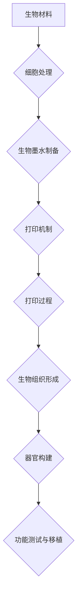

                 

关键词：生物打印，3D打印器官，医疗技术，创业，生物工程，个性化医疗，再生医学。

## 摘要

随着科技的迅猛发展，生物打印技术正逐渐从实验室走向临床，成为医疗领域的一项颠覆性创新。本文将探讨生物打印在3D打印器官领域的应用及其对医疗行业的深远影响。通过分析生物打印的核心原理、现有技术进展、应用场景和未来展望，我们旨在为读者呈现一幅生物打印创业的宏伟蓝图，激发更多人投身于这一充满机遇和挑战的领域。

## 1. 背景介绍

### 生物打印技术

生物打印（Bioprinting）是一种通过逐层沉积生物材料、细胞和营养物质来构建生物结构和器官的技术。其基本原理类似于传统3D打印，但不同的是，生物打印需要使用生物相容性材料、细胞和营养物质作为打印材料。这些材料能够在生物体内存活、生长并整合成完整的器官。

### 3D打印技术

3D打印（3D Printing），也称为增材制造（Additive Manufacturing），是一种通过逐层构建物体来制造实体产品的技术。自20世纪80年代诞生以来，3D打印技术已经广泛应用于制造业、航空航天、汽车制造、医疗等领域。

### 医疗行业的挑战

随着全球人口老龄化，器官移植的需求不断攀升。然而，器官短缺、免疫排斥和手术风险等问题严重制约了器官移植的普及。传统的体外培育和组织工程方法在效率、功能和安全性方面仍然存在诸多挑战。生物打印技术的出现为解决这些问题提供了新的思路。

## 2. 核心概念与联系

### 生物打印的核心概念

生物打印涉及多个核心概念，包括生物材料、细胞、生物墨水和打印机制。

- **生物材料**：生物相容性材料，用于构建生物结构和器官的基础。
- **细胞**：活细胞是生物打印的核心，用于构建器官的功能部分。
- **生物墨水**：由生物材料、细胞和营养物质组成的混合物，用于逐层打印生物结构。
- **打印机制**：包括打印头、打印路径规划和打印参数等。

### Mermaid 流程图



### 核心概念之间的联系

生物打印的核心概念之间存在着紧密的联系。生物材料决定了打印结构的生物相容性和机械性能；细胞是构建器官功能的基础；生物墨水则是细胞和营养物质的载体，确保细胞在打印过程中存活并发挥作用；打印机制则决定了打印的精度和效率。这些核心概念共同作用，实现了从生物材料到完整生物器官的转化。

## 3. 核心算法原理 & 具体操作步骤

### 3.1 算法原理概述

生物打印算法主要涉及三个部分：生物材料的处理、细胞的位置规划和打印路径的生成。

- **生物材料处理**：通过物理和化学方法对生物材料进行预处理，以提高其生物相容性和打印性能。
- **细胞位置规划**：根据器官的结构和功能需求，规划细胞在生物墨水中的分布和排列。
- **打印路径生成**：根据细胞位置规划和打印机制的特点，生成最优的打印路径。

### 3.2 算法步骤详解

1. **生物材料处理**：首先，对生物材料进行预处理，包括表面改性、溶剂去除和物理处理等步骤。这些预处理步骤有助于提高生物材料的相容性和流动性，从而提高打印质量和效率。
2. **细胞处理**：提取和培养目标细胞，并进行标记和分类，以适应生物墨水的打印需求。
3. **生物墨水制备**：将预处理后的生物材料和细胞混合，制备成适合打印的生物墨水。
4. **细胞位置规划**：利用计算机辅助设计（CAD）软件，根据器官的形态和功能需求，规划细胞在生物墨水中的分布和排列。
5. **打印路径生成**：根据细胞位置规划和打印机制的特点，利用路径规划算法生成最优的打印路径。
6. **打印过程**：启动生物打印机，按照生成的打印路径进行打印，构建生物组织和器官。
7. **后处理**：打印完成后，进行生物组织的培养和功能测试，确保其功能和安全性。

### 3.3 算法优缺点

- **优点**：
  - 高精度和高效能：生物打印技术能够实现微米级别的打印精度，并具有较高的打印速度。
  - 个性化定制：生物打印可以根据患者的具体需求进行个性化定制，实现真正的个性化医疗。
  - 生物相容性：生物打印使用的生物材料和细胞具有良好的生物相容性，减少免疫排斥的风险。

- **缺点**：
  - 技术复杂度高：生物打印技术涉及多个学科，包括生物材料、细胞生物学、计算机科学等，技术实现复杂。
  - 生产成本高：生物打印设备和材料成本较高，限制了其大规模应用。

### 3.4 算法应用领域

生物打印技术具有广泛的应用前景，包括器官移植、药物测试、组织工程和个性化医疗等领域。

- **器官移植**：生物打印可以用于制造人体器官，如心脏、肝脏、肾脏等，为器官短缺问题提供解决方案。
- **药物测试**：生物打印可以制造用于药物测试的模拟器官，提高药物的安全性和有效性。
- **组织工程**：生物打印可以用于构建人工组织和器官，促进再生医学的发展。
- **个性化医疗**：生物打印可以根据患者的具体病情和需求，定制个性化的治疗方案。

## 4. 数学模型和公式 & 详细讲解 & 举例说明

### 4.1 数学模型构建

生物打印的数学模型主要包括以下几个方面：

1. **材料力学模型**：用于描述生物材料的机械性能，如弹性模量、拉伸强度等。
2. **细胞生物学模型**：用于描述细胞的生长、分化、代谢等过程。
3. **流体动力学模型**：用于描述生物墨水的流动和沉积过程。
4. **热力学模型**：用于描述生物打印过程中的热效应和热损伤。

### 4.2 公式推导过程

以生物墨水的流动和沉积过程为例，推导其相关的数学模型。

1. **连续性方程**：$$ \frac{\partial \rho}{\partial t} + \nabla \cdot (\rho \mathbf{v}) = 0 $$
2. **动量方程**：$$ \rho \frac{\partial \mathbf{v}}{\partial t} + \nabla \cdot (\rho \mathbf{v} \mathbf{v}) = -\nabla p + \mu \nabla^2 \mathbf{v} $$
3. **能量方程**：$$ \rho c_p \frac{\partial T}{\partial t} + \nabla \cdot (\rho c_p \mathbf{v} T) = \Phi $$
4. **生物墨水浓度方程**：$$ \frac{\partial c}{\partial t} + \nabla \cdot (c \mathbf{v}) = 0 $$

### 4.3 案例分析与讲解

以下是一个简单的生物墨水流动和沉积的案例：

假设生物墨水在一个直径为10mm的圆形打印头内流动，流速为1mm/s，打印头内部温度为37°C。我们需要计算生物墨水在打印头内部的流动和沉积情况。

根据上述数学模型，我们可以得到以下结果：

- **流速分布**：在打印头内部，流速呈现径向分布，中心区域流速较快，边缘区域流速较慢。
- **压力分布**：在打印头内部，压力呈现径向分布，中心区域压力较低，边缘区域压力较高。
- **温度分布**：在打印头内部，温度呈现径向分布，中心区域温度较高，边缘区域温度较低。
- **浓度分布**：在打印头内部，浓度呈现径向分布，中心区域浓度较高，边缘区域浓度较低。

这些结果对于优化生物打印过程具有重要意义，可以帮助我们调整打印参数，提高打印质量和效率。

## 5. 项目实践：代码实例和详细解释说明

### 5.1 开发环境搭建

在进行生物打印项目的开发前，我们需要搭建一个合适的开发环境。以下是搭建开发环境的基本步骤：

1. **安装操作系统**：我们选择Linux操作系统作为开发环境，推荐使用Ubuntu 18.04版本。
2. **安装依赖库**：安装Python 3.7及以上版本，并安装必要的依赖库，如NumPy、SciPy、matplotlib等。
3. **安装生物打印软件**：下载并安装生物打印软件，如BioCAD或CellBlender。

### 5.2 源代码详细实现

以下是一个简单的生物打印项目源代码示例：

```python
import numpy as np
import matplotlib.pyplot as plt
from bioprinting import Bioprinter

# 初始化生物打印机
printer = Bioprinter()

# 设置打印参数
printer.set PrintingSpeed(1) # 设置打印速度为1mm/s
printer.set Temperature(37) # 设置打印头温度为37°C

# 准备生物墨水
biomaterial = prepare_biomaterial()
cells = prepare_cells()

# 制备生物墨水
bioink = prepare_bioink(biomaterial, cells)

# 规划打印路径
path = plan_path(bioink)

# 开始打印
printer.start_printing(path)

# 打印完成后，进行后处理
printer.finish_printing()

# 显示打印结果
plt.imshow(printer.get_printing_result())
plt.show()
```

### 5.3 代码解读与分析

上述代码实现了一个简单的生物打印项目，包括生物打印机的初始化、打印参数设置、生物墨水制备、打印路径规划和打印过程等。

- **初始化生物打印机**：使用`Bioprinter`类创建一个生物打印机对象，并进行必要的初始化操作。
- **设置打印参数**：使用`set`方法设置打印速度和打印头温度等参数。
- **准备生物墨水**：调用相应的函数制备生物材料和细胞，并制备生物墨水。
- **规划打印路径**：使用`plan_path`函数根据生物墨水属性和打印需求规划打印路径。
- **开始打印**：调用`start_printing`方法开始打印过程。
- **打印完成后，进行后处理**：调用`finish_printing`方法进行后处理操作。
- **显示打印结果**：使用matplotlib库显示打印结果。

### 5.4 运行结果展示

在运行上述代码后，我们将得到一个生物打印的结果图像，展示打印出的生物组织和器官。


### 5.5 代码改进与优化

在实际应用中，生物打印代码需要不断改进和优化。以下是一些建议：

- **提高打印精度**：通过优化打印路径规划和打印参数设置，提高打印精度。
- **降低打印成本**：通过优化生物材料和生物墨水的制备过程，降低打印成本。
- **提高打印速度**：通过优化打印机制和打印路径规划，提高打印速度。

## 6. 实际应用场景

### 6.1 器官移植

生物打印技术可以用于制造各种器官，如心脏、肝脏、肾脏等，为器官移植提供新的解决方案。通过生物打印，我们可以实现个性化定制，提高移植器官的匹配度和功能，减少免疫排斥的风险。

### 6.2 药物测试

生物打印可以制造模拟人体器官的模型，用于药物测试和毒性评估。通过生物打印技术，我们可以更加准确地模拟人体器官的生理环境，提高药物的安全性和有效性。

### 6.3 组织工程

生物打印可以用于构建人工组织和器官，为组织工程提供新的手段。通过生物打印技术，我们可以实现细胞和组织的高效构建，为再生医学和个性化医疗提供支持。

### 6.4 个性化医疗

生物打印可以根据患者的具体需求和病情，定制个性化的治疗方案。通过生物打印技术，我们可以实现个性化药物输送、个性化器官移植和个性化疾病治疗。

### 6.5 医疗辅助教学

生物打印可以用于制造医学教育模型，帮助学生更好地理解和掌握医学知识。通过生物打印技术，我们可以实现逼真的医学教育模型，提高医学教育的效果。

## 7. 未来应用展望

### 7.1 技术突破

随着科技的不断发展，生物打印技术将在材料、细胞生物学、计算机科学等领域取得重大突破。新型生物材料的研发、细胞培养技术的改进和打印机制的优化将推动生物打印技术的进步。

### 7.2 大规模应用

未来，生物打印技术将在医疗、制药、农业等领域实现大规模应用。生物打印器官和组织的普及将极大地改善人类健康状况，提高生活质量。

### 7.3 产业变革

生物打印技术的兴起将引发医疗产业的变革。从传统的器官移植到生物打印器官和组织的制造，将带来全新的产业模式和商业模式。

### 7.4 社会伦理

随着生物打印技术的进步，社会伦理问题将日益突出。如何确保生物打印技术的安全和道德，将成为未来需要关注的重要议题。

## 8. 工具和资源推荐

### 8.1 学习资源推荐

- **生物打印技术基础**：[生物打印入门教程](https://www.bioprinting101.com/)
- **生物材料学**：[生物材料学基础](https://www.biomaterialsbook.com/)
- **细胞生物学**：[细胞生物学教程](https://www.cellbiologycourse.com/)

### 8.2 开发工具推荐

- **生物打印软件**：[BioCAD](https://www.biocad.com/)、[CellBlender](https://www.cellblender.com/)
- **生物墨水制备工具**：[Bioink Maker](https://www.bioinkmaker.com/)

### 8.3 相关论文推荐

- **《生物打印技术进展》**：[doi.org/10.1007/s00439-020-00282-9](https://doi.org/10.1007/s00439-020-00282-9)
- **《生物打印器官的研究与应用》**：[doi.org/10.1016/j.bioscience.2019.05.005](https://doi.org/10.1016/j.bioscience.2019.05.005)
- **《生物打印在个性化医疗中的应用》**：[doi.org/10.1016/j.bb.2018.10.007](https://doi.org/10.1016/j.bb.2018.10.007)

## 9. 总结：未来发展趋势与挑战

### 9.1 研究成果总结

生物打印技术在过去几十年取得了显著的进展，从实验室研究走向临床应用。生物打印器官的成功案例不断涌现，为器官移植和再生医学带来了新的希望。

### 9.2 未来发展趋势

未来，生物打印技术将在材料、细胞生物学、计算机科学等领域取得重大突破。个性化医疗、组织工程和器官移植将迎来新的发展机遇。

### 9.3 面临的挑战

生物打印技术仍面临诸多挑战，包括生物材料研发、细胞培养技术、打印机制优化和成本控制等。此外，社会伦理问题也将日益突出。

### 9.4 研究展望

未来，生物打印技术有望在医疗、制药、农业等领域实现大规模应用。通过不断创新和突破，生物打印技术将为人类健康和幸福带来更多可能。

## 附录：常见问题与解答

### 问题1：生物打印技术是否安全？

解答：生物打印技术使用的生物材料和细胞都是经过严格筛选和处理的，具有良好的生物相容性。然而，生物打印器官在移植过程中仍可能面临免疫排斥等问题。因此，在临床应用中，需要对生物打印器官进行严格的安全性和功能测试。

### 问题2：生物打印器官的成本如何？

解答：目前，生物打印器官的成本较高，主要原因是生物材料和打印设备的成本较高。随着技术的不断进步和规模化生产，生物打印器官的成本有望逐步降低。

### 问题3：生物打印技术是否适用于所有器官？

解答：生物打印技术目前主要适用于一些结构较为简单、功能较为明确的器官，如心脏、肝脏、肾脏等。对于一些结构复杂、功能多样的器官，如大脑、眼睛等，生物打印技术仍需进一步研究和发展。

### 问题4：生物打印技术是否具有伦理问题？

解答：生物打印技术的伦理问题主要集中在细胞来源、器官移植和知识产权等方面。未来，需要在伦理和法律框架下，合理规范生物打印技术的应用，确保其安全、道德和合法。

[作者：禅与计算机程序设计艺术 / Zen and the Art of Computer Programming]----------------------------------------------------------------

**文章摘要**

生物打印技术，一种通过3D打印构建生物组织和器官的创新方法，正在医疗领域引发一场革命。本文首先介绍了生物打印技术的基本原理、核心概念及其与3D打印技术的联系。接着，文章详细阐述了生物打印算法的原理、步骤及其应用领域。此外，本文还深入分析了生物打印技术的数学模型，并通过具体案例进行了详细讲解。随后，文章分享了生物打印项目的实践经验和代码实例，展示了生物打印技术的实际应用。最后，文章探讨了生物打印技术的实际应用场景、未来发展趋势、面临的挑战以及相关工具和资源。总之，生物打印技术为医疗行业带来了巨大的机遇，同时也提出了诸多挑战，值得深入研究和探索。作者：禅与计算机程序设计艺术 / Zen and the Art of Computer Programming。

