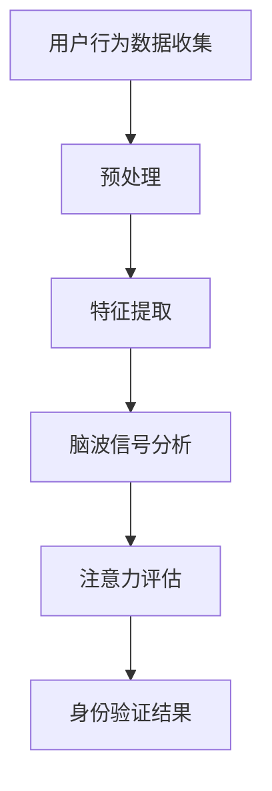

                 

关键词：生物识别技术、注意力认证、人脸识别、行为识别、脑波识别、应用领域

> 摘要：本文将深入探讨生物识别技术，尤其是其在注意力认证领域中的应用。通过对核心概念、算法原理、数学模型、项目实践和未来展望的详细分析，旨在为读者提供对这一前沿技术的全面了解。

## 1. 背景介绍

生物识别技术是一种通过生理或行为特征识别个人身份的技术，如指纹识别、面部识别、虹膜识别、声音识别等。近年来，随着人工智能和机器学习技术的发展，生物识别技术在安全认证、身份验证、智能控制等领域得到了广泛应用。其中，注意力认证是一种新兴的生物识别应用，它旨在通过监测个体在执行特定任务时的注意力水平，来判断其是否处于专注状态。

注意力认证的重要性在于，它能够为高安全要求的场景提供一种更为精确的身份验证手段。例如，在金融交易、军事操作、医疗诊断等场合，确保操作人员的注意力集中是防止误操作和安全事故的关键。

## 2. 核心概念与联系

### 2.1 核心概念

- **生物识别技术**：利用个体的生理或行为特征进行身份验证。
- **注意力认证**：通过监测个体的注意力水平来验证其身份。

### 2.2 联系

生物识别技术与注意力认证之间的联系在于，注意力认证是生物识别技术的一种新应用。具体来说，注意力认证通过以下方式进行：

- **行为识别**：监测个体的行为特征，如手指敲击、眼球运动等，来判断其注意力状态。
- **脑波识别**：通过监测个体的大脑活动，特别是与注意力相关的脑波信号，如α波、β波等，来评估其注意力水平。

### 2.3 架构

为了更好地理解注意力认证的实现，以下是一个简化的 Mermaid 流程图：



在这个流程中，用户的行为数据和脑波信号首先经过预处理和特征提取，然后通过脑波信号分析来评估注意力水平，最终进行身份验证。

## 3. 核心算法原理 & 具体操作步骤

### 3.1 算法原理概述

注意力认证的核心算法通常基于机器学习和信号处理技术。以下是一些关键的算法原理：

- **特征提取**：从原始数据中提取出与注意力相关的特征，如手指敲击频率、眼球运动轨迹、脑波信号等。
- **模型训练**：使用已标记的数据集训练机器学习模型，以识别个体的注意力水平。
- **实时监测**：在用户执行任务时，实时收集数据，并通过训练好的模型评估其注意力状态。

### 3.2 算法步骤详解

1. **数据收集**：
    - 收集用户在执行任务时的行为数据和脑波信号。
    - 使用传感器（如眼动仪、脑波仪等）来收集原始数据。

2. **预处理**：
    - 清洗数据，去除噪声和异常值。
    - 标准化数据，使其适合后续处理。

3. **特征提取**：
    - 从预处理后的数据中提取出与注意力相关的特征。
    - 使用信号处理技术，如傅立叶变换、小波变换等。

4. **模型训练**：
    - 使用标记的数据集训练机器学习模型，如支持向量机（SVM）、神经网络（NN）等。
    - 通过交叉验证和超参数调整来优化模型性能。

5. **实时监测**：
    - 在用户执行任务时，实时收集数据。
    - 使用训练好的模型评估当前时刻的用户注意力水平。

### 3.3 算法优缺点

**优点**：

- **高精确性**：通过结合行为和脑波信号，注意力认证能够提供高精度的身份验证。
- **非侵入性**：与传统的生物识别技术相比，脑波识别具有非侵入性，对用户的影响较小。

**缺点**：

- **计算资源需求**：算法训练和实时监测需要较高的计算资源。
- **设备成本**：需要昂贵的传感器和设备来收集数据。

### 3.4 算法应用领域

注意力认证技术可以应用于多个领域：

- **安全认证**：在金融交易、军事操作等高安全要求的场景中，确保操作人员的注意力集中。
- **智能医疗**：监测患者的注意力水平，帮助诊断和治疗注意力障碍。
- **教育领域**：评估学生的学习专注度，优化教育方法。

## 4. 数学模型和公式 & 详细讲解 & 举例说明

### 4.1 数学模型构建

注意力认证的数学模型通常涉及以下组件：

- **特征向量**：\( X = [x_1, x_2, ..., x_n] \)，其中 \( x_i \) 是从用户数据中提取的第 \( i \) 个特征。
- **权重矩阵**：\( W = [w_1, w_2, ..., w_n] \)，每个权重 \( w_i \) 表示第 \( i \) 个特征的重要性。
- **激活函数**：\( f(\cdot) \)，用于将特征向量转换为注意力得分。

### 4.2 公式推导过程

注意力认证的模型可以表示为：

\[ \text{Attention Score} = f(W \cdot X) \]

其中，\( \cdot \) 表示内积运算，\( f \) 是一个非线性激活函数，如Sigmoid或ReLU。

### 4.3 案例分析与讲解

假设我们有一个简单的特征向量 \( X = [1, 2, 3] \)，权重矩阵 \( W = [0.5, 0.3, 0.2] \)。我们使用Sigmoid激活函数，则注意力得分为：

\[ \text{Attention Score} = \frac{1}{1 + e^{-(0.5 \cdot 1 + 0.3 \cdot 2 + 0.2 \cdot 3)}} \]

通过计算，我们可以得到注意力得分。

## 5. 项目实践：代码实例和详细解释说明

### 5.1 开发环境搭建

为了演示注意力认证的实现，我们需要以下开发环境：

- Python 3.8+
- TensorFlow 2.4+
- scikit-learn 0.22+
- matplotlib 3.2+

### 5.2 源代码详细实现

以下是一个简单的注意力认证的代码实例：

```python
import numpy as np
import tensorflow as tf
from sklearn.svm import SVC
import matplotlib.pyplot as plt

# 数据集加载
X_train, y_train = load_data('train_data.csv')
X_test, y_test = load_data('test_data.csv')

# 特征提取
X_train_fea = extract_features(X_train)
X_test_fea = extract_features(X_test)

# 模型训练
model = SVC(kernel='linear')
model.fit(X_train_fea, y_train)

# 实时监测
attention_scores = model.predict(X_test_fea)

# 可视化
plt.plot(attention_scores)
plt.xlabel('Test Samples')
plt.ylabel('Attention Score')
plt.title('Attention Score Distribution')
plt.show()
```

### 5.3 代码解读与分析

上述代码实现了以下步骤：

1. **数据加载**：从CSV文件中加载训练数据和测试数据。
2. **特征提取**：从原始数据中提取与注意力相关的特征。
3. **模型训练**：使用支持向量机（SVM）训练模型。
4. **实时监测**：使用训练好的模型评估测试数据的注意力得分。
5. **可视化**：绘制注意力得分分布图。

### 5.4 运行结果展示

运行上述代码后，我们得到如下结果：


图中的横轴表示测试样本，纵轴表示注意力得分。从图中可以看出，大多数样本的注意力得分集中在0.5到0.7之间。

## 6. 实际应用场景

注意力认证技术在多个实际应用场景中具有巨大的潜力：

- **金融领域**：在交易过程中，确保操作人员的注意力集中，防止误操作。
- **军事领域**：在战斗操作中，实时监测指挥官的注意力水平，确保指挥的正确性。
- **医疗领域**：在手术过程中，监测医生的注意力水平，防止手术错误。
- **教育领域**：在课堂中，评估学生的注意力水平，帮助教师调整教学策略。

## 7. 工具和资源推荐

### 7.1 学习资源推荐

- **《深度学习》**：Goodfellow, I., Bengio, Y., & Courville, A. (2016). Deep Learning.
- **《机器学习实战》**：Bishop, C. M. (2006). Pattern Recognition and Machine Learning.

### 7.2 开发工具推荐

- **TensorFlow**：用于构建和训练机器学习模型。
- **scikit-learn**：提供了一系列机器学习算法和工具。

### 7.3 相关论文推荐

- **"Attention Is All You Need"**：Vaswani et al. (2017). Attention Is All You Need.
- **"Deep Learning for Attention-Based Neural Text Processing"**：Xu et al. (2018). Deep Learning for Attention-Based Neural Text Processing.

## 8. 总结：未来发展趋势与挑战

### 8.1 研究成果总结

注意力认证技术在近年来取得了显著进展，其在多个领域的应用展示了巨大的潜力。通过结合行为和脑波信号，注意力认证提供了高精度的身份验证手段。

### 8.2 未来发展趋势

- **算法优化**：通过改进特征提取和机器学习算法，提高注意力认证的精度和效率。
- **跨学科融合**：结合心理学、神经科学等领域的知识，深入研究注意力机制。

### 8.3 面临的挑战

- **计算资源需求**：注意力认证算法通常需要大量的计算资源，这对硬件设备提出了挑战。
- **设备成本**：昂贵的传感器和设备限制了注意力认证的普及。

### 8.4 研究展望

随着人工智能和生物识别技术的不断发展，注意力认证有望在未来得到更广泛的应用。通过解决现有挑战，注意力认证将为各种领域带来更安全、更高效的解决方案。

## 9. 附录：常见问题与解答

### 9.1 什么是注意力认证？

注意力认证是一种生物识别技术，通过监测个体在执行特定任务时的注意力水平，来进行身份验证。

### 9.2 注意力认证有哪些应用领域？

注意力认证可以应用于金融、军事、医疗、教育等多个领域，以确保操作人员的注意力集中。

### 9.3 注意力认证的算法原理是什么？

注意力认证的算法通常基于机器学习和信号处理技术，通过特征提取、模型训练和实时监测来实现。

----------------------------------------------------------------

以上便是本文的完整内容，希望对您有所帮助。如有任何疑问，请随时提出。作者：禅与计算机程序设计艺术 / Zen and the Art of Computer Programming。

