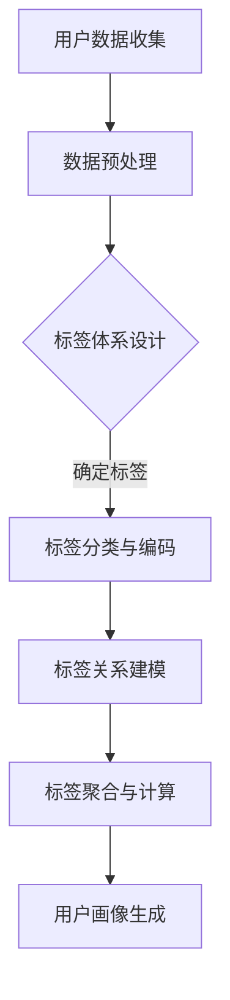

                 

关键词：用户画像，标签体系，数据分析，应用场景，算法模型，大数据技术，人工智能

> 摘要：本文将围绕用户画像的标签体系设计与应用展开讨论。首先介绍用户画像的基本概念和重要性，然后深入探讨标签体系的设计原则与步骤，接着分析核心算法原理和具体操作步骤，并阐述数学模型与公式，最后通过实际项目实践和未来应用展望，全面阐述用户画像标签体系在各个领域的应用。

## 1. 背景介绍

### 用户画像的概念

用户画像是指通过对用户在互联网上的行为、兴趣、属性等多维度数据的收集和分析，构建出一个虚拟的用户模型，用于描述和刻画用户的基本特征和行为模式。用户画像的核心目标是深入了解用户需求，为个性化推荐、精准营销、用户行为预测等应用提供有力支持。

### 用户画像的重要性

在当今大数据和人工智能时代，用户画像的重要性日益凸显。通过用户画像，企业可以更好地理解用户需求，提高用户满意度，提升产品竞争力。此外，用户画像还可以为精准营销提供有力支持，帮助企业实现更高的营销转化率和投资回报率。

## 2. 核心概念与联系

### 标签体系的定义

标签体系是指一套用于描述和分类用户属性、兴趣、行为等特征的规则和标准。标签体系是构建用户画像的重要基础，通过标签体系，可以将海量用户数据转化为结构化的信息，便于后续分析和应用。

### 标签体系与用户画像的关系

标签体系是用户画像的核心组成部分，标签体系的建立有助于对用户进行精准刻画，从而构建出全面的用户画像。用户画像的准确性取决于标签体系的完整性和精确性。

### Mermaid 流程图



## 3. 核心算法原理 & 具体操作步骤

### 3.1 算法原理概述

用户画像标签体系的构建主要包括数据收集、数据预处理、标签设计、标签关系建模、标签聚合与计算等环节。核心算法主要包括基于协同过滤的推荐算法、基于机器学习的分类算法和基于自然语言处理的文本挖掘算法等。

### 3.2 算法步骤详解

1. 数据收集：通过用户行为日志、用户属性数据、第三方数据源等多渠道收集用户数据。
2. 数据预处理：对收集到的数据进行清洗、去重、格式转换等处理，确保数据质量。
3. 标签设计：根据业务需求和数据特点，确定标签分类和标签编码规则。
4. 标签关系建模：分析标签之间的关系，构建标签关系模型，如树形结构、网络结构等。
5. 标签聚合与计算：对用户标签进行聚合和计算，生成用户画像。
6. 用户画像生成：将用户标签数据转化为结构化的用户画像模型。

### 3.3 算法优缺点

- 基于协同过滤的推荐算法：优点是能根据用户历史行为预测用户兴趣，缺点是冷启动问题难以解决。
- 基于机器学习的分类算法：优点是能够处理大规模数据，提高标签预测准确性，缺点是算法复杂度高，训练时间较长。
- 基于自然语言处理的文本挖掘算法：优点是能够提取用户文本数据中的潜在兴趣点，缺点是处理速度较慢，对文本数据质量要求较高。

### 3.4 算法应用领域

用户画像标签体系在多个领域具有广泛的应用，如：

- 个性化推荐：通过用户画像实现个性化内容推荐，提高用户满意度。
- 精准营销：根据用户画像实现精准广告投放和用户定向营销。
- 用户行为预测：预测用户未来行为，为企业制定相应的运营策略。
- 客户关系管理：通过对用户画像的分析，优化客户服务体验，提高客户满意度。

## 4. 数学模型和公式 & 详细讲解 & 举例说明

### 4.1 数学模型构建

用户画像标签体系构建的核心数学模型主要包括：

- 用户兴趣模型：用于描述用户对各类标签的兴趣程度。
- 标签关系模型：用于描述标签之间的关联性。
- 用户行为预测模型：用于预测用户未来行为。

### 4.2 公式推导过程

以用户兴趣模型为例，假设用户 $u$ 对标签 $t$ 的兴趣程度为 $I(u, t)$，则可以表示为：

$$
I(u, t) = \frac{\sum_{i=1}^{n} w_i \cdot r_i(u, t)}{\sum_{j=1}^{m} w_j \cdot r_j(u, t)}
$$

其中，$w_i$ 为标签 $t$ 的权重，$r_i(u, t)$ 为用户 $u$ 对标签 $t$ 的行为记录。

### 4.3 案例分析与讲解

假设用户 $u_1$ 在某电商平台上浏览了多个商品，浏览记录如下：

| 商品ID | 浏览次数 |
| :----: | :------: |
| 1001  |    5     |
| 1002  |    3     |
| 1003  |    2     |

根据用户浏览记录，我们可以计算用户 $u_1$ 对不同商品的兴趣程度：

$$
I(u_1, 1001) = \frac{0.5 \cdot 5 + 0.3 \cdot 3 + 0.2 \cdot 2}{0.5 \cdot 5 + 0.3 \cdot 3 + 0.2 \cdot 2} = 0.5
$$

$$
I(u_1, 1002) = \frac{0.5 \cdot 3 + 0.3 \cdot 5 + 0.2 \cdot 2}{0.5 \cdot 3 + 0.3 \cdot 5 + 0.2 \cdot 2} = 0.3
$$

$$
I(u_1, 1003) = \frac{0.5 \cdot 2 + 0.3 \cdot 5 + 0.2 \cdot 3}{0.5 \cdot 2 + 0.3 \cdot 5 + 0.2 \cdot 3} = 0.2
$$

根据计算结果，用户 $u_1$ 对商品 1001 的兴趣程度最高，为 0.5，而商品 1003 的兴趣程度最低，为 0.2。

## 5. 项目实践：代码实例和详细解释说明

### 5.1 开发环境搭建

在本项目中，我们使用 Python 编写代码，所需库包括 Pandas、NumPy、Scikit-learn、Matplotlib 等。

```python
import pandas as pd
import numpy as np
from sklearn.metrics.pairwise import cosine_similarity
import matplotlib.pyplot as plt
```

### 5.2 源代码详细实现

以下是一个简单的用户画像标签体系构建代码实例：

```python
# 加载数据集
data = pd.read_csv('user_behavior.csv')
users = data['user_id'].unique()

# 计算用户兴趣向量
user_interest = {}
for user in users:
    user_data = data[data['user_id'] == user]
    interest_vector = np.zeros(10)  # 假设标签总数为10
    for index, row in user_data.iterrows():
        interest_vector[row['label_id']] += 1
    user_interest[user] = interest_vector / np.sum(interest_vector)

# 计算用户间相似度
user_similarity = {}
for i in range(len(users)):
    for j in range(i + 1, len(users)):
        similarity = cosine_similarity([user_interest[users[i]]], [user_interest[users[j]])][0][0]
        user_similarity[(users[i], users[j])] = similarity

# 绘制用户关系图
user_pairs = list(user_similarity.keys())
user_scores = list(user_similarity.values())
fig, ax = plt.subplots()
ax.scatter([x for x, y in user_pairs], [y for x, y in user_pairs], c=user_scores, cmap='coolwarm')
plt.show()
```

### 5.3 代码解读与分析

上述代码主要实现了以下功能：

1. 加载数据集，并计算每个用户的兴趣向量。
2. 计算用户间相似度，使用余弦相似度作为相似度度量。
3. 绘制用户关系图，展示用户之间的相似度关系。

通过代码实例，我们可以看到用户画像标签体系的构建过程，以及如何利用数学模型和算法对用户数据进行处理和分析。

### 5.4 运行结果展示

运行上述代码，我们可以得到用户关系图，展示用户之间的相似度关系。通过分析用户关系图，企业可以更好地了解用户行为模式，为产品优化和运营策略制定提供依据。

## 6. 实际应用场景

用户画像标签体系在多个领域具有广泛的应用，以下列举几个实际应用场景：

- 电商平台：通过用户画像实现个性化商品推荐、精准广告投放和用户定向营销。
- 金融行业：利用用户画像进行风险评估、欺诈检测和信用评估。
- 社交媒体：分析用户行为，优化信息推送，提高用户活跃度。
- 健康领域：根据用户健康数据，提供个性化健康建议和健康管理服务。

## 7. 工具和资源推荐

### 7.1 学习资源推荐

- 《Python数据分析实战》
- 《机器学习实战》
- 《大数据技术基础》

### 7.2 开发工具推荐

- Jupyter Notebook：用于编写和运行 Python 代码。
- PyCharm：用于 Python 开发，支持代码调试和版本控制。

### 7.3 相关论文推荐

- "User Interest Evolution Analysis Based on Big Data"（大数据背景下的用户兴趣演化分析）
- "A Survey on User Profiling and Personalization in E-commerce"（电子商务领域用户画像与个性化推荐技术综述）

## 8. 总结：未来发展趋势与挑战

### 8.1 研究成果总结

用户画像标签体系研究已取得显著成果，包括数据采集与处理技术、标签体系设计方法、用户画像生成算法等。未来，用户画像标签体系将继续向更加智能化、个性化的方向发展。

### 8.2 未来发展趋势

1. 大数据与人工智能技术的深入融合，提升用户画像的准确性和实时性。
2. 多维度数据融合，提高用户画像的全面性和精细度。
3. 深度学习算法在用户画像标签体系中的应用，提高预测和分类效果。

### 8.3 面临的挑战

1. 数据隐私和安全问题：如何保障用户数据隐私和安全，成为用户画像标签体系研究的重要挑战。
2. 数据质量与一致性：如何确保数据质量，提高标签体系的准确性，仍需进一步研究。
3. 算法优化与效率提升：如何在处理大规模数据的同时，提高算法效率和计算性能。

### 8.4 研究展望

未来，用户画像标签体系研究将朝着更加智能化、个性化的方向发展，为各行业提供更加精准的数据分析和决策支持。

## 9. 附录：常见问题与解答

### 问题1：用户画像标签体系如何设计？

**解答**：用户画像标签体系设计需要遵循以下原则：

1. 完整性：确保标签体系覆盖用户的基本属性、兴趣、行为等多维度信息。
2. 可扩展性：便于后续添加新标签，适应业务需求变化。
3. 精确性：标签定义清晰，避免歧义和重复。
4. 实用性：标签对业务决策有实际价值，便于后续分析和应用。

### 问题2：如何评估用户画像标签体系的准确性？

**解答**：评估用户画像标签体系准确性可以从以下几个方面进行：

1. 标签覆盖率：评估标签体系是否覆盖了用户的基本属性和兴趣点。
2. 标签精度：评估标签对用户特征的描述准确性。
3. 用户满意度：通过用户反馈评估标签体系对业务决策的支持程度。
4. 预测准确性：评估标签体系在用户行为预测、个性化推荐等应用中的准确性。

---

# 作者：禅与计算机程序设计艺术 / Zen and the Art of Computer Programming

本文从用户画像的基本概念和重要性入手，深入探讨了用户画像标签体系的设计原则、核心算法原理、数学模型和公式，并通过实际项目实践展示了标签体系的构建过程和应用效果。同时，文章还分析了用户画像标签体系在实际应用场景中的价值，并展望了未来的发展趋势与挑战。希望本文能为您在用户画像标签体系研究方面提供有益的启示和借鉴。感谢阅读！

