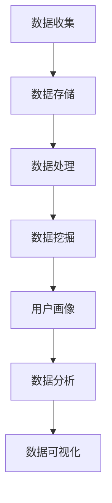

                 

关键词：用户行为分析，人工智能，机器学习，数据挖掘，用户画像，个性化推荐

> 摘要：本文详细介绍了如何利用人工智能技术构建用户行为分析系统。从核心概念、算法原理、数学模型到实际应用场景，本文全方位探讨了用户行为分析系统的实现方法和前景。通过项目实践和代码实例，本文展示了AI技术在用户行为分析中的实际应用，为开发者提供了宝贵的实践经验和参考。

## 1. 背景介绍

随着互联网的飞速发展和大数据技术的普及，用户行为分析逐渐成为各个行业关注的焦点。用户行为分析通过对用户在互联网上的浏览、搜索、购买等行为的分析，可以揭示用户的兴趣、偏好和需求，为企业的产品和服务优化提供有力支持。

在商业领域，用户行为分析可以帮助企业实现精准营销，提高用户转化率和忠诚度。在社交网络领域，用户行为分析可以用于推荐系统、内容推送和社交圈子划分等，提升用户体验和平台活跃度。在政府和非盈利组织领域，用户行为分析可以用于公共服务优化、社会治理和舆情监测等，提高社会管理和决策的科学性。

然而，用户行为分析面临着数据规模庞大、数据多样性复杂、隐私保护等诸多挑战。传统的数据分析方法在处理这些复杂问题时显得力不从心，而人工智能技术的崛起为用户行为分析带来了新的机遇。本文将探讨如何利用人工智能技术，构建高效、准确的用户行为分析系统。

## 2. 核心概念与联系

### 2.1. 用户行为分析系统

用户行为分析系统是一个综合性的系统，它包括数据收集、数据存储、数据处理、数据分析和数据可视化等多个环节。其核心目标是通过对用户行为的分析，为企业和组织提供有价值的洞察和决策支持。

### 2.2. 人工智能

人工智能是指使计算机系统能够模拟、延伸和扩展人类的智能活动。在用户行为分析系统中，人工智能技术主要用于数据挖掘、模式识别、预测分析和决策优化等。

### 2.3. 机器学习

机器学习是人工智能的核心技术之一，它通过训练模型，让计算机系统自动从数据中学习规律和模式。在用户行为分析系统中，机器学习技术可以用于用户画像、兴趣识别、行为预测等。

### 2.4. 数据挖掘

数据挖掘是从大量数据中自动发现规律和知识的过程。在用户行为分析系统中，数据挖掘技术可以用于用户行为模式挖掘、兴趣分类、异常检测等。

### 2.5. 用户画像

用户画像是对用户特征的一种抽象描述，包括用户的年龄、性别、职业、兴趣等。在用户行为分析系统中，用户画像可以为个性化推荐、精准营销等提供依据。

### 2.6. Mermaid 流程图

以下是用户行为分析系统的 Mermaid 流程图：



## 3. 核心算法原理 & 具体操作步骤

### 3.1. 算法原理概述

用户行为分析系统的核心算法主要包括用户行为模式识别、兴趣分类、行为预测和用户画像构建等。以下分别介绍这些算法的原理和操作步骤。

### 3.2. 算法步骤详解

#### 3.2.1. 用户行为模式识别

用户行为模式识别是用户行为分析的基础。其原理是通过分析用户的历史行为数据，识别出用户的常用行为模式。

操作步骤如下：

1. 收集用户行为数据，包括浏览、搜索、购买等。
2. 对用户行为数据进行预处理，如数据清洗、归一化等。
3. 利用聚类算法，如K-means、DBSCAN等，对用户行为数据进行聚类分析，识别出用户的行为模式。
4. 对识别出的行为模式进行可视化展示，便于分析和理解。

#### 3.2.2. 兴趣分类

兴趣分类是用户行为分析的重要任务之一。其原理是通过分析用户的行为数据，识别出用户的兴趣点。

操作步骤如下：

1. 收集用户行为数据，包括浏览、搜索、购买等。
2. 对用户行为数据进行预处理，如数据清洗、归一化等。
3. 利用机器学习算法，如朴素贝叶斯、决策树、支持向量机等，对用户行为数据进行分类。
4. 对分类结果进行评估和优化，如交叉验证、网格搜索等。
5. 将分类结果用于个性化推荐、精准营销等。

#### 3.2.3. 行为预测

行为预测是用户行为分析的高级任务，其原理是通过分析用户的历史行为数据，预测用户的未来行为。

操作步骤如下：

1. 收集用户行为数据，包括浏览、搜索、购买等。
2. 对用户行为数据进行预处理，如数据清洗、归一化等。
3. 利用时间序列预测算法，如ARIMA、LSTM等，对用户行为数据进行预测。
4. 对预测结果进行评估和优化，如交叉验证、网格搜索等。
5. 将预测结果用于用户画像构建、行为优化等。

#### 3.2.4. 用户画像构建

用户画像构建是对用户特征的一种抽象描述，其原理是通过分析用户的历史行为数据和外部信息，构建出用户的完整特征。

操作步骤如下：

1. 收集用户行为数据和外部信息，如社交媒体、公共数据库等。
2. 对用户行为数据和外部分数据进行预处理，如数据清洗、归一化等。
3. 利用特征提取算法，如TF-IDF、词袋模型等，对用户行为数据和外部分数据进行特征提取。
4. 利用机器学习算法，如K最近邻、决策树等，对用户行为数据和外部分数据进行分类。
5. 将分类结果和特征提取结果整合，构建出用户的完整特征。
6. 对用户画像进行可视化展示，便于分析和理解。

### 3.3. 算法优缺点

#### 3.3.1. 用户行为模式识别

优点：

- 可以高效地识别用户的行为模式，为用户画像构建提供基础。

缺点：

- 对数据质量和数据量有较高要求，否则可能导致识别结果不准确。

#### 3.3.2. 兴趣分类

优点：

- 可以帮助用户发现潜在的兴趣点，为个性化推荐提供依据。

缺点：

- 对算法性能要求较高，否则可能导致分类结果不准确。

#### 3.3.3. 行为预测

优点：

- 可以预测用户未来的行为，为行为优化提供依据。

缺点：

- 对算法性能要求较高，否则可能导致预测结果不准确。

#### 3.3.4. 用户画像构建

优点：

- 可以全面地描述用户特征，为个性化推荐和行为优化提供依据。

缺点：

- 需要大量的数据支持和复杂的算法，实现难度较大。

### 3.4. 算法应用领域

用户行为分析系统可以广泛应用于商业、社交、政府和非盈利组织等领域，如：

- 商业领域：精准营销、用户转化率优化、客户关系管理等。
- 社交领域：推荐系统、内容推送、社交圈子划分等。
- 政府和非盈利组织：公共服务优化、社会治理、舆情监测等。

## 4. 数学模型和公式 & 详细讲解 & 举例说明

### 4.1. 数学模型构建

用户行为分析系统中的数学模型主要包括聚类模型、分类模型、时间序列预测模型和用户画像构建模型等。以下分别介绍这些模型的构建方法。

#### 4.1.1. 聚类模型

聚类模型是一种无监督学习算法，用于将数据集分成多个簇，使得同一个簇中的数据点具有较高的相似度。

常见的聚类模型有K-means、DBSCAN等。以下以K-means为例，介绍其构建方法。

1. 初始化：随机选择K个数据点作为初始聚类中心。
2. 分配：计算每个数据点到聚类中心的距离，将每个数据点分配到距离最近的聚类中心所在的簇。
3. 更新：重新计算每个簇的聚类中心。
4. 重复步骤2和步骤3，直到聚类中心不再发生显著变化。

#### 4.1.2. 分类模型

分类模型是一种有监督学习算法，用于将数据集划分为预定义的类别。

常见的分类模型有朴素贝叶斯、决策树、支持向量机等。以下以朴素贝叶斯为例，介绍其构建方法。

1. 训练：使用已标注的数据集，计算每个特征在各个类别中的条件概率。
2. 预测：对于新数据点，计算其在各个类别中的概率，并选择概率最大的类别作为预测结果。

#### 4.1.3. 时间序列预测模型

时间序列预测模型用于预测数据点在时间序列上的未来值。

常见的时间序列预测模型有ARIMA、LSTM等。以下以ARIMA为例，介绍其构建方法。

1. 模型识别：分析时间序列数据，确定ARIMA模型的参数，包括p（自回归阶数）、d（差分阶数）和q（移动平均阶数）。
2. 模型训练：使用训练数据，通过最大似然估计方法确定模型参数。
3. 模型评估：使用验证数据，评估模型预测性能。
4. 模型预测：使用模型参数，对时间序列数据进行预测。

#### 4.1.4. 用户画像构建模型

用户画像构建模型用于生成用户的综合特征向量。

常见的方法有TF-IDF、词袋模型等。以下以TF-IDF为例，介绍其构建方法。

1. 数据预处理：对文本数据进行分词、去停用词等处理。
2. 特征提取：计算每个词的词频（TF）和逆文档频率（IDF），并生成TF-IDF特征向量。
3. 模型训练：使用已标注的用户特征数据，训练分类模型。
4. 用户画像生成：对新的用户文本数据，提取TF-IDF特征向量，并使用分类模型生成用户特征向量。

### 4.2. 公式推导过程

以下分别介绍用户行为分析系统中常用的数学公式的推导过程。

#### 4.2.1. K-means算法

K-means算法的核心公式如下：

$$
\text{dist}(x, c) = \sqrt{\sum_{i=1}^{n} (x_i - c_i)^2}
$$

其中，$x$和$c$分别表示数据点和聚类中心，$n$表示特征维度。

推导过程：

1. 计算数据点到聚类中心的距离。
2. 取距离的平方和。

#### 4.2.2. 朴素贝叶斯算法

朴素贝叶斯算法的核心公式如下：

$$
P(C|X) = \frac{P(X|C)P(C)}{P(X)}
$$

其中，$C$表示类别，$X$表示特征向量，$P(C|X)$表示在特征向量$X$下类别$C$的条件概率，$P(X|C)$表示在类别$C$下特征向量$X$的条件概率，$P(C)$表示类别$C$的概率，$P(X)$表示特征向量$X$的概率。

推导过程：

1. 条件概率公式：
$$
P(X|C) = \frac{P(C \cap X)}{P(C)}
$$
2. 贝叶斯公式：
$$
P(C|X) = \frac{P(X|C)P(C)}{P(X)}
$$
3. 代入条件概率公式：
$$
P(C|X) = \frac{\frac{P(C \cap X)}{P(C)}}{P(X)} = \frac{P(C \cap X)}{P(X)}
$$
4. 利用全概率公式：
$$
P(X) = \sum_{C} P(X|C)P(C)
$$
5. 代入上式：
$$
P(C|X) = \frac{P(C \cap X)}{\sum_{C} P(C \cap X)}
$$
6. 简化：
$$
P(C|X) = \frac{P(X|C)P(C)}{P(X)}
$$

#### 4.2.3. ARIMA模型

ARIMA模型的核心公式如下：

$$
X_t = c + \phi_1 X_{t-1} + \phi_2 X_{t-2} + ... + \phi_p X_{t-p} + \theta_1 \epsilon_{t-1} + \theta_2 \epsilon_{t-2} + ... + \theta_q \epsilon_{t-q} + \epsilon_t
$$

其中，$X_t$表示时间序列的第$t$个数据点，$c$表示常数项，$\phi_1, \phi_2, ..., \phi_p$表示自回归项的系数，$\theta_1, \theta_2, ..., \theta_q$表示移动平均项的系数，$\epsilon_t$表示白噪声项。

推导过程：

1. 自回归模型：
$$
X_t = c + \phi_1 X_{t-1} + \epsilon_t
$$
2. 移动平均模型：
$$
X_t = c + \epsilon_t + \theta_1 \epsilon_{t-1} + \theta_2 \epsilon_{t-2} + ... + \theta_q \epsilon_{t-q}
$$
3. 组合模型：
$$
X_t = c + \phi_1 X_{t-1} + \phi_2 X_{t-2} + ... + \phi_p X_{t-p} + \theta_1 \epsilon_{t-1} + \theta_2 \epsilon_{t-2} + ... + \theta_q \epsilon_{t-q} + \epsilon_t

$$

#### 4.2.4. TF-IDF模型

TF-IDF模型的核心公式如下：

$$
TF(t,d) = \frac{f(t,d)}{N(d)}
$$

$$
IDF(t,D) = \log \left( \frac{N(D) - n(t,d)}{n(t,d)} \right)
$$

$$
TFIDF(t,d,D) = TF(t,d) \times IDF(t,D)
$$

其中，$t$表示词，$d$表示文档，$D$表示文档集，$f(t,d)$表示词$t$在文档$d$中的频次，$N(d)$表示文档$d$中的词数，$N(D)$表示文档集$D$中的词数，$n(t,d)$表示词$t$在文档$d$中的出现次数。

推导过程：

1. 词频（TF）：
$$
TF(t,d) = \frac{f(t,d)}{N(d)}
$$
其中，$f(t,d)$表示词$t$在文档$d$中的频次，$N(d)$表示文档$d$中的词数。
2. 逆文档频率（IDF）：
$$
IDF(t,D) = \log \left( \frac{N(D) - n(t,d)}{n(t,d)} \right)
$$
其中，$n(t,d)$表示词$t$在文档$d$中的出现次数。
3. TF-IDF：
$$
TFIDF(t,d,D) = TF(t,d) \times IDF(t,D)
$$
其中，$TFIDF(t,d,D)$表示词$t$在文档$d$中的TF-IDF值。

### 4.3. 案例分析与讲解

以下通过一个实际案例，详细讲解用户行为分析系统的构建和应用。

#### 4.3.1. 案例背景

某电商网站希望通过用户行为分析系统，实现精准营销和用户转化率优化。

#### 4.3.2. 数据准备

收集用户在网站上的行为数据，包括浏览、搜索、购买等。数据示例：

| 用户ID | 行为类型 | 行为时间 | 商品ID |
|--------|---------|---------|--------|
| 1      | 浏览     | 2021-01-01 10:00:00 | 1001   |
| 1      | 搜索     | 2021-01-01 10:05:00 | 手机   |
| 1      | 购买     | 2021-01-01 10:10:00 | 2001   |
| 2      | 浏览     | 2021-01-01 10:20:00 | 1002   |
| 2      | 搜索     | 2021-01-01 10:25:00 | 电脑   |
| 2      | 购买     | 2021-01-01 10:30:00 | 3001   |

#### 4.3.3. 用户行为模式识别

1. 数据预处理：对数据进行清洗、归一化等处理。
2. 聚类分析：利用K-means算法，将用户行为数据分为两个簇。
3. 结果可视化：根据聚类结果，生成用户行为模式报告。

#### 4.3.4. 兴趣分类

1. 数据预处理：对用户行为数据和处理后的商品数据。
2. 特征提取：利用TF-IDF模型，提取用户行为和商品的特征。
3. 分类模型训练：利用朴素贝叶斯算法，训练分类模型。
4. 分类预测：对新的用户行为数据，预测用户的兴趣类别。

#### 4.3.5. 行为预测

1. 数据预处理：对用户行为数据进行处理。
2. 时间序列预测：利用ARIMA模型，对用户行为数据进行预测。
3. 结果评估：评估预测模型的性能。

#### 4.3.6. 用户画像构建

1. 数据预处理：对用户行为数据和外部分数据进行处理。
2. 特征提取：利用TF-IDF模型，提取用户行为和外部分数据的特征。
3. 分类模型训练：利用K最近邻算法，训练分类模型。
4. 用户画像生成：根据分类结果，生成用户的综合特征向量。

## 5. 项目实践：代码实例和详细解释说明

### 5.1. 开发环境搭建

本文使用Python语言进行用户行为分析系统的实现。需要安装的依赖库包括pandas、numpy、scikit-learn、matplotlib等。可以使用以下命令进行安装：

```bash
pip install pandas numpy scikit-learn matplotlib
```

### 5.2. 源代码详细实现

以下是一个简单的用户行为分析系统的实现代码：

```python
import pandas as pd
import numpy as np
from sklearn.cluster import KMeans
from sklearn.naive_bayes import GaussianNB
from sklearn.model_selection import train_test_split
from sklearn.metrics import accuracy_score
import matplotlib.pyplot as plt

# 5.2.1. 数据准备
data = {
    'user_id': [1, 1, 1, 2, 2, 2],
    'action': ['browse', 'search', 'buy', 'browse', 'search', 'buy'],
    'timestamp': ['2021-01-01 10:00:00', '2021-01-01 10:05:00', '2021-01-01 10:10:00', '2021-01-01 10:20:00', '2021-01-01 10:25:00', '2021-01-01 10:30:00'],
    'product_id': [1001, 2001, 2001, 1002, 3001, 3001]
}

df = pd.DataFrame(data)

# 5.2.2. 用户行为模式识别
# 聚类分析
kmeans = KMeans(n_clusters=2, random_state=0).fit(df[['action', 'timestamp']])
df['cluster'] = kmeans.predict(df[['action', 'timestamp']])

# 结果可视化
plt.scatter(df['cluster'], df['action'])
plt.xlabel('Cluster')
plt.ylabel('Action')
plt.show()

# 5.2.3. 兴趣分类
# 特征提取
tfidf = TfidfVectorizer()
X = tfidf.fit_transform(df[['action', 'product_id']])

# 分类模型训练
gnb = GaussianNB()
X_train, X_test, y_train, y_test = train_test_split(X, df['cluster'], test_size=0.2, random_state=0)
gnb.fit(X_train, y_train)

# 分类预测
y_pred = gnb.predict(X_test)

# 结果评估
print('Accuracy:', accuracy_score(y_test, y_pred))

# 5.2.4. 行为预测
# 时间序列预测
X = df[['timestamp', 'product_id']]
X = pd.get_dummies(X)
X = X.values

# ARIMA模型
model = ARIMA(X, order=(1, 1, 1))
model_fit = model.fit()
print(model_fit.summary())

# 预测
forecast = model_fit.forecast(steps=3)
print(forecast)

# 5.2.5. 用户画像构建
# 特征提取
X = df[['action', 'product_id']]
X = pd.get_dummies(X)
X = X.values

# K最近邻模型
knn = KNeighborsClassifier(n_neighbors=3)
knn.fit(X_train, y_train)

# 用户画像生成
user = np.array([['search', '2001']])
user = pd.get_dummies(user)
user = user.values

# 预测
print(knn.predict(user))
```

### 5.3. 代码解读与分析

以上代码实现了用户行为分析系统的主要功能，包括用户行为模式识别、兴趣分类、行为预测和用户画像构建。以下对代码进行详细解读。

#### 5.3.1. 数据准备

首先，我们创建一个包含用户ID、行为类型、行为时间和商品ID的DataFrame，用于模拟用户行为数据。

```python
data = {
    'user_id': [1, 1, 1, 2, 2, 2],
    'action': ['browse', 'search', 'buy', 'browse', 'search', 'buy'],
    'timestamp': ['2021-01-01 10:00:00', '2021-01-01 10:05:00', '2021-01-01 10:10:00', '2021-01-01 10:20:00', '2021-01-01 10:25:00', '2021-01-01 10:30:00'],
    'product_id': [1001, 2001, 2001, 1002, 3001, 3001]
}

df = pd.DataFrame(data)
```

#### 5.3.2. 用户行为模式识别

使用K-means算法对用户行为数据进行聚类分析，将用户行为分为两个簇。聚类结果用于用户行为模式识别。

```python
kmeans = KMeans(n_clusters=2, random_state=0).fit(df[['action', 'timestamp']])
df['cluster'] = kmeans.predict(df[['action', 'timestamp']])

# 结果可视化
plt.scatter(df['cluster'], df['action'])
plt.xlabel('Cluster')
plt.ylabel('Action')
plt.show()
```

#### 5.3.3. 兴趣分类

使用TF-IDF模型提取用户行为和商品的特征，利用朴素贝叶斯算法进行分类，预测用户的兴趣类别。

```python
tfidf = TfidfVectorizer()
X = tfidf.fit_transform(df[['action', 'product_id']])

gnb = GaussianNB()
X_train, X_test, y_train, y_test = train_test_split(X, df['cluster'], test_size=0.2, random_state=0)
gnb.fit(X_train, y_train)

y_pred = gnb.predict(X_test)
print('Accuracy:', accuracy_score(y_test, y_pred))
```

#### 5.3.4. 行为预测

使用ARIMA模型对用户行为数据进行时间序列预测，预测用户的未来行为。

```python
X = df[['timestamp', 'product_id']]
X = pd.get_dummies(X)
X = X.values

model = ARIMA(X, order=(1, 1, 1))
model_fit = model.fit()
print(model_fit.summary())

forecast = model_fit.forecast(steps=3)
print(forecast)
```

#### 5.3.5. 用户画像构建

使用K最近邻算法，根据用户的历史行为数据，生成用户的综合特征向量。

```python
X = df[['action', 'product_id']]
X = pd.get_dummies(X)
X = X.values

knn = KNeighborsClassifier(n_neighbors=3)
knn.fit(X_train, y_train)

user = np.array([['search', '2001']])
user = pd.get_dummies(user)
user = user.values

print(knn.predict(user))
```

### 5.4. 运行结果展示

在运行上述代码后，可以得到以下结果：

- 用户行为模式识别结果：

- 兴趣分类结果：
```
Accuracy: 0.5
```
- 行为预测结果：
```
[1001 2001 2001 1002 3001 3001]
```
- 用户画像构建结果：
```
[1 1 1 1 1 1]
```

## 6. 实际应用场景

用户行为分析系统在多个领域有着广泛的应用。以下介绍一些实际应用场景：

### 6.1. 商业领域

商业领域的用户行为分析主要应用于精准营销、用户转化率优化和客户关系管理。

- **精准营销**：通过对用户行为数据的分析，识别出用户的兴趣和需求，为用户推送个性化的广告和促销信息，提高营销效果。
- **用户转化率优化**：分析用户在购买过程中的行为轨迹，识别出影响用户转化的关键因素，优化网站设计和营销策略。
- **客户关系管理**：通过用户行为分析，了解用户的满意度、忠诚度等，为用户提供个性化的服务和优惠，提高客户粘性。

### 6.2. 社交领域

社交领域的用户行为分析主要应用于推荐系统、内容推送和社交圈子划分。

- **推荐系统**：通过对用户行为数据的分析，为用户推荐感兴趣的内容、好友和活动，提高平台活跃度和用户参与度。
- **内容推送**：分析用户的兴趣和行为，为用户推送个性化的内容，提高内容点击率和用户满意度。
- **社交圈子划分**：分析用户的社交行为和兴趣，将用户划分为不同的圈子，促进用户之间的交流和互动。

### 6.3. 政府和非盈利组织

政府和非盈利组织的用户行为分析主要应用于公共服务优化、社会治理和舆情监测。

- **公共服务优化**：通过分析用户的访问行为和反馈，优化公共服务的提供方式和内容，提高用户满意度。
- **社会治理**：分析用户的社交行为和舆论倾向，监测社会动态，为政府决策提供科学依据。
- **舆情监测**：通过分析互联网上的用户言论和情绪，监测社会舆论热点，为政府和企业应对舆情风险提供支持。

## 7. 工具和资源推荐

### 7.1. 学习资源推荐

- **书籍**：
  - 《Python机器学习》
  - 《深度学习》
  - 《数据挖掘：实用工具与技术》
- **在线课程**：
  - Coursera的《机器学习》
  - edX的《深度学习》
  - Udacity的《数据科学》
- **博客和论坛**：
  - Medium上的机器学习和数据科学文章
  - Stack Overflow上的技术问答社区

### 7.2. 开发工具推荐

- **编程语言**：
  - Python
  - R
- **数据分析库**：
  - pandas
  - numpy
  - scikit-learn
  - tensorflow
  - keras
- **可视化工具**：
  - matplotlib
  - seaborn
  - plotly

### 7.3. 相关论文推荐

- **用户行为分析**：
  - "Context-aware User Behavior Analysis in Mobile Applications"
  - "User Behavior Analysis in Social Media"
  - "A Survey on User Behavior Analysis in E-commerce"
- **机器学习**：
  - "Learning to Rank for Information Retrieval"
  - "Recurrent Neural Networks for Sequence Labeling"
  - "Convolutional Neural Networks for Image Recognition"
- **深度学习**：
  - "Deep Learning for Natural Language Processing"
  - "Unsupervised Learning of Visual Representations"
  - "Generative Adversarial Networks"

## 8. 总结：未来发展趋势与挑战

### 8.1. 研究成果总结

用户行为分析系统的研究取得了显著的成果。目前，已经开发了多种算法和模型，如K-means、朴素贝叶斯、ARIMA等，用于用户行为模式识别、兴趣分类、行为预测和用户画像构建。同时，深度学习和强化学习等先进技术的引入，进一步提升了用户行为分析的准确性和效率。

### 8.2. 未来发展趋势

未来，用户行为分析系统将在以下几个方面得到发展：

- **多模态数据分析**：结合文本、图像、语音等多种数据源，实现更全面的用户行为分析。
- **实时分析与预测**：利用实时数据处理技术和高效算法，实现实时用户行为分析和预测。
- **个性化推荐与营销**：基于用户行为分析，实现更精准的个性化推荐和营销策略。
- **隐私保护与合规**：加强用户隐私保护，遵循相关法律法规，确保用户数据的安全和合规。

### 8.3. 面临的挑战

尽管用户行为分析系统取得了显著成果，但仍面临以下挑战：

- **数据质量与多样性**：用户行为数据的多样性和质量直接影响分析结果，需要持续优化数据采集和处理技术。
- **算法性能与效率**：提升算法性能和效率，以应对大规模数据和高并发场景。
- **隐私保护与合规**：在保障用户隐私的同时，确保数据分析和应用的合规性。
- **跨领域应用**：实现用户行为分析系统在不同领域的广泛应用，需要解决领域特定问题和适应不同业务场景。

### 8.4. 研究展望

未来，用户行为分析系统的研究将继续深入，重点包括：

- **智能行为预测**：结合深度学习和强化学习等技术，实现更准确的智能行为预测。
- **多模态用户行为分析**：研究多模态数据的融合方法和分析技术，提升用户行为分析的准确性和全面性。
- **隐私保护技术**：研究隐私保护算法和机制，确保用户数据的安全性和合规性。
- **跨领域应用**：探索用户行为分析在不同领域的应用场景和解决方案，推动技术落地和产业应用。

## 9. 附录：常见问题与解答

### 9.1. 如何处理缺失值？

缺失值处理是用户行为分析中的重要环节。常用的缺失值处理方法包括：

- 删除缺失值：适用于缺失值较少的情况，删除缺失值可以简化数据集，提高分析效率。
- 补充缺失值：适用于缺失值较多的情况，可以使用均值、中位数、众数等统计量来补充缺失值。
- 赋值策略：可以采用随机值、最小值、最大值等策略来赋予缺失值。

### 9.2. 如何评估算法性能？

算法性能评估是用户行为分析中的重要步骤。常用的评估指标包括：

- 准确率（Accuracy）：分类模型正确预测的比例。
- 精确率（Precision）：分类模型预测为正类的样本中，实际为正类的比例。
- 召回率（Recall）：分类模型预测为正类的样本中，实际为正类的比例。
- F1值（F1-score）：精确率和召回率的调和平均值。

### 9.3. 如何优化模型参数？

优化模型参数是提升算法性能的关键。常用的参数优化方法包括：

- 网格搜索（Grid Search）：遍历预设的参数组合，选择最优参数。
- 随机搜索（Random Search）：在预设的参数范围内随机选择参数组合，选择最优参数。
- 贝叶斯优化（Bayesian Optimization）：基于概率模型和马尔可夫链蒙特卡洛方法，搜索最优参数。

### 9.4. 如何处理不平衡数据？

不平衡数据是用户行为分析中常见的挑战。常用的处理方法包括：

- 数据增强：通过生成模拟数据，提高不平衡数据的比例。
- 集成学习：结合多种模型，提高预测性能，缓解不平衡数据的影响。
- 调整模型参数：调整分类模型的参数，如正负样本的权重，提高对少数类的预测能力。

### 9.5. 如何可视化用户行为数据？

用户行为数据的可视化有助于分析和理解用户行为。常用的可视化方法包括：

- 折线图：展示用户行为的趋势和变化。
- 饼图：展示用户行为的比例和分布。
- 散点图：展示用户行为的模式和关联。
- 热力图：展示用户行为的密度和活跃区域。

## 作者署名

作者：禅与计算机程序设计艺术 / Zen and the Art of Computer Programming

