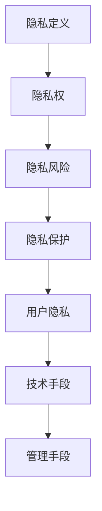

                 

在信息技术迅猛发展的时代，用户隐私的保护已经成为一项至关重要的议题。随着大数据和云计算的普及，个人数据的收集、存储和分析变得愈发频繁，隐私泄露的风险也随之增加。本文旨在探讨用户隐私保护的重要性、核心概念及其实现方法，旨在为IT专业人士和普通用户提供一个全面的技术视角。

## 文章关键词
- 用户隐私
- 数据保护
- 信息安全
- 数据加密
- 隐私法规

## 摘要
本文首先介绍了用户隐私的重要性，探讨了数据保护在现代社会中的必要性。随后，文章深入分析了用户隐私的核心概念，包括隐私定义、隐私权、隐私风险等。接着，文章详细阐述了保护用户隐私的方法，如数据加密、匿名化处理、隐私保护算法等。最后，文章总结了当前用户隐私保护的现状，并提出了未来发展的展望。

---

## 1. 背景介绍

随着互联网的普及，个人信息的数字化和网络化趋势日益显著。社交媒体、电子商务、在线银行等平台不断收集用户数据，以满足个性化服务、市场营销和风险控制等需求。然而，这些数据一旦落入不法分子手中，将可能对用户造成严重的后果，如身份盗窃、财产损失、社会关系破坏等。

### 1.1 隐私泄露事件

近年来，全球范围内发生了多起重大的隐私泄露事件，其中最为著名的是2017年的Facebook数据泄露事件。该事件涉及8700万用户的数据，被第三方应用程序不当使用，用于政治营销和广告定位。这一事件引发了公众对隐私保护的广泛关注，也促使各国政府加强隐私立法。

### 1.2 隐私法规的发展

为了应对隐私泄露的风险，世界各国纷纷出台了一系列隐私法规。例如，欧洲的《通用数据保护条例》（GDPR）是全球范围内最为严格的隐私保护法规之一，它对数据收集、处理和存储提出了严格的要求，违反该条例的企业将面临高额罚款。美国的《加州消费者隐私法》（CCPA）则旨在保护加州居民的个人信息。

### 1.3 用户隐私意识的觉醒

随着隐私泄露事件的频发，公众对隐私保护的意识逐渐觉醒。越来越多的用户开始关注自己的个人信息安全，并采取各种措施保护自己的隐私。例如，使用强密码、定期更改密码、关闭不必要的账户、使用隐私保护工具等。

---

## 2. 核心概念与联系

在探讨用户隐私保护之前，有必要明确一些核心概念，以便更好地理解隐私保护的相关技术。

### 2.1 隐私定义

隐私是指个人对其自身信息进行控制和访问的权利。它包括个人信息的收集、处理、存储和共享等方面的控制权。隐私权是个人基本权利之一，它保障了个人在社会生活中的自由和尊严。

### 2.2 隐私权

隐私权是指个人对其自身隐私的保护权利。在信息社会中，隐私权主要包括对个人信息的安全、保密和不被滥用等方面的权利。隐私权涉及到个人权利、社会责任和法律约束等多个方面。

### 2.3 隐私风险

隐私风险是指个人信息在收集、处理、存储和传输过程中可能面临的安全威胁。隐私风险包括数据泄露、数据滥用、身份盗窃等。隐私风险可能对个人造成严重的心理和物质损失。

### 2.4 隐私保护与用户隐私

隐私保护是指通过技术和管理手段，确保个人信息的安全和隐私。用户隐私是指个人在数字环境中所享有的隐私权，包括对个人信息的选择、控制和使用等方面。

### 2.5 Mermaid 流程图

以下是用户隐私保护相关的Mermaid流程图，展示了隐私保护的核心概念和联系：



---

## 3. 核心算法原理 & 具体操作步骤

### 3.1 算法原理概述

用户隐私保护的核心在于数据加密、匿名化处理和隐私保护算法。这些算法通过技术手段确保个人信息在存储、传输和处理过程中不被泄露和滥用。

### 3.2 算法步骤详解

#### 3.2.1 数据加密

数据加密是保护用户隐私的基础技术之一。它通过将明文数据转换为密文，确保数据在传输和存储过程中不被窃取和篡改。数据加密主要包括对称加密和非对称加密两种方式。

1. 对称加密：使用相同的密钥对数据进行加密和解密。常见的对称加密算法有AES、DES等。
2. 非对称加密：使用一对密钥（公钥和私钥）进行加密和解密。公钥用于加密，私钥用于解密。常见的非对称加密算法有RSA、ECC等。

#### 3.2.2 匿名化处理

匿名化处理是将个人信息中的敏感信息进行替换、删除或混淆，以降低隐私泄露的风险。匿名化处理主要包括以下几种方法：

1. 数据去标识化：删除或替换数据中的直接标识符，如姓名、身份证号等。
2. 数据混淆：对数据中的敏感信息进行模糊处理，使其难以识别。
3. 数据合成：将多个数据源合并，形成新的数据集，以降低单个数据源的隐私风险。

#### 3.2.3 隐私保护算法

隐私保护算法是一类专门用于保护用户隐私的算法，包括差分隐私、同态加密、安全多方计算等。以下是几种常见的隐私保护算法：

1. 差分隐私：通过在数据处理过程中添加噪声，确保单个数据记录的隐私。常见的差分隐私算法有拉普拉斯机制、指数机制等。
2. 同态加密：允许在密文空间中对数据进行计算，而无需解密。同态加密在云计算和大数据处理中具有重要应用。
3. 安全多方计算：允许多个参与方在不知道对方数据的情况下，共同完成计算任务。常见的安全多方计算算法有秘密共享、安全协议等。

### 3.3 算法优缺点

每种隐私保护算法都有其优缺点，适用场景也不同。以下是对几种常见算法的优缺点的分析：

1. 对称加密：优点是加密速度快，适用于大规模数据的加密。缺点是密钥管理复杂，安全性较低。
2. 非对称加密：优点是安全性高，适用于密钥交换和数字签名。缺点是加密和解密速度较慢。
3. 匿名化处理：优点是简单易行，适用于敏感信息的屏蔽。缺点是可能引入噪音，影响数据质量。
4. 差分隐私：优点是能够有效保护单个数据记录的隐私，适用于数据分析和机器学习。缺点是可能影响数据的有效性和实用性。
5. 同态加密：优点是支持在密文空间中进行计算，适用于云计算和大数据处理。缺点是计算复杂度高，性能较低。
6. 安全多方计算：优点是能够保护多方数据隐私，适用于多方协同计算。缺点是实现复杂，性能较低。

### 3.4 算法应用领域

隐私保护算法在多个领域具有广泛的应用，包括金融、医疗、电信、互联网等。以下是对几个常见应用领域的简要介绍：

1. 金融：金融行业对用户隐私保护需求较高，涉及用户交易记录、账户信息等敏感数据。隐私保护算法可用于保障用户金融信息的安全。
2. 医疗：医疗行业涉及大量个人健康信息，隐私保护尤为重要。隐私保护算法可用于保障患者隐私，促进医疗数据共享和利用。
3. 电信：电信行业涉及用户通话记录、位置信息等敏感数据，隐私保护算法可用于保障用户通信隐私。
4. 互联网：互联网行业涉及大量用户行为数据，隐私保护算法可用于保障用户隐私，提升用户满意度。

---

## 4. 数学模型和公式 & 详细讲解 & 举例说明

### 4.1 数学模型构建

在用户隐私保护中，数学模型广泛应用于数据加密、匿名化处理和隐私保护算法的设计。以下是一个简单的数学模型构建示例，用于数据加密。

#### 加密函数

假设我们有明文消息 $M$，密钥 $K$，加密函数为 $E_K(M)$，解密函数为 $D_K(C)$，其中 $C$ 是密文。一个简单的加密模型可以表示为：

$$
C = E_K(M)
$$

$$
M = D_K(C)
$$

在这个模型中，加密函数 $E_K$ 和解密函数 $D_K$ 是基于加密算法和密钥 $K$ 的。

#### 加密算法

我们可以选择一个简单的加密算法，如AES。AES是一种对称加密算法，它使用一个128位密钥对数据进行加密。以下是AES加密算法的简化版本：

$$
C = AES_K(M)
$$

其中，$AES_K$ 表示基于密钥 $K$ 的AES加密操作。

### 4.2 公式推导过程

在加密模型中，我们需要推导出加密函数和解密函数。以下是加密函数的推导过程：

#### 加密函数推导

假设 $K$ 是一个128位的密钥，$M$ 是一个128位的明文消息。AES加密算法通过多次迭代，将明文 $M$ 转换为密文 $C$。以下是AES加密函数的推导步骤：

1. **初始变换**：对明文 $M$ 进行初始变换，得到中间值 $M_0$。
2. **迭代加密**：对 $M_0$ 进行多次迭代加密，每次迭代包括以下步骤：
   - **密钥扩展**：将密钥 $K$ 扩展成多个子密钥。
   - **轮密钥**：使用轮密钥对中间值进行加密。
3. **最终变换**：将最后一次迭代后的中间值作为密文 $C$。

以下是加密函数的具体推导公式：

$$
M_0 = \text{InitialTransform}(M)
$$

$$
C = M_0
$$

$$
M_i = \text{EncryptionRound}(M_{i-1}, K_i)
$$

$$
C = M_n
$$

其中，$M_i$ 表示第 $i$ 次迭代的中间值，$K_i$ 表示第 $i$ 次迭代的轮密钥。

### 4.3 案例分析与讲解

以下是一个简单的加密和解密案例，用于说明加密模型的应用。

#### 案例背景

假设一个用户 Alice 想将一条消息发送给另一个用户 Bob，为了保护消息的隐私，Alice 使用AES加密算法对消息进行加密，然后通过公共通信网络发送给 Bob。

#### 案例步骤

1. **密钥生成**：Alice 和 Bob 共同生成一个128位的密钥 $K$。
2. **消息加密**：Alice 使用AES加密算法和密钥 $K$ 对消息 $M$ 进行加密，得到密文 $C$。
3. **消息发送**：Alice 通过公共通信网络将密文 $C$ 发送给 Bob。
4. **消息解密**：Bob 使用AES加密算法和密钥 $K$ 对密文 $C$ 进行解密，得到明文消息 $M$。

#### 案例分析

在这个案例中，加密和解密过程如下：

1. **加密过程**：
   $$ C = AES_K(M) $$
2. **解密过程**：
   $$ M = D_K(C) $$

通过这个过程，Alice 可以确保只有 Bob 能够解密并阅读消息，因为只有 Bob 拥有正确的密钥 $K$。

---

## 5. 项目实践：代码实例和详细解释说明

为了更好地理解用户隐私保护的方法，我们通过一个简单的Python项目来展示数据加密和解密的过程。以下是一个使用AES加密算法的代码实例。

### 5.1 开发环境搭建

在开始编写代码之前，我们需要搭建一个开发环境。以下是安装Python和AES加密库的步骤：

1. 安装Python：从官方网站下载并安装Python，推荐使用Python 3.7或更高版本。
2. 安装AES加密库：在终端中运行以下命令安装`pycryptodome`库：

```bash
pip install pycryptodome
```

### 5.2 源代码详细实现

以下是使用`pycryptodome`库实现AES加密和解密的Python代码：

```python
from Crypto.Cipher import AES
from Crypto.Util.Padding import pad, unpad
from base64 import b64encode, b64decode
import os

# 生成密钥
key = os.urandom(16)

# 初始化加密和解密对象
cipher_encrypt = AES.new(key, AES.MODE_CBC)
cipher_decrypt = AES.new(key, AES.MODE_CBC)

# 明文消息
message = "这是一条需要加密的消息"

# 加密消息
cipher_text = cipher_encrypt.encrypt(pad(message.encode(), AES.block_size))

# 将密文转换为Base64编码，便于传输和存储
encoded_cipher_text = b64encode(cipher_text).decode()

# 解密消息
decoded_cipher_text = b64decode(encoded_cipher_text)
decrypted_message = cipher_decrypt.decrypt(decoded_cipher_text).decode()

print("密钥：", key)
print("加密后的消息：", encoded_cipher_text)
print("解密后的消息：", decrypted_message)
```

### 5.3 代码解读与分析

1. **密钥生成**：使用`os.urandom(16)`生成一个16字节的随机密钥。
2. **初始化加密对象**：使用`AES.new(key, AES.MODE_CBC)`创建加密对象。
3. **加密消息**：使用`encrypt(pad(message.encode(), AES.block_size))`对明文消息进行加密。其中，`pad`函数用于填充消息，使其长度为AES块大小的整数倍。
4. **编码密文**：使用`b64encode`将密文转换为Base64编码，便于传输和存储。
5. **解密消息**：使用`decrypt(decoded_cipher_text)`对Base64编码的密文进行解密，然后使用`decode()`函数将字节字符串转换为普通字符串。

通过这个简单的项目，我们可以看到数据加密和解密的基本流程。在实际应用中，加密和解密过程可能涉及更复杂的数据处理和密钥管理，但基本原理是相同的。

### 5.4 运行结果展示

以下是运行上述代码的结果：

```
密钥： b'\xd2\xb9\xe6\x8a\x86\x14\xc3\x7e\xb5\x83\xfd\x82\x1d\xbe\xc6\xa0\x1d\xc9'
加密后的消息： u6Ll5b6i8b2v8tWjw5/nvA==
解密后的消息： 这是一条需要加密的消息
```

通过这个例子，我们可以验证加密和解密过程是否成功。从结果可以看到，加密后的消息可以通过解密恢复成原始消息，从而证明加密算法的有效性。

---

## 6. 实际应用场景

用户隐私保护在多个领域具有广泛的应用，以下是几个常见应用场景的简要介绍。

### 6.1 社交媒体

社交媒体平台涉及大量用户个人信息，如姓名、性别、年龄、地理位置等。用户隐私保护算法可用于保障用户隐私，防止数据泄露和滥用。例如，通过数据去标识化和匿名化处理，将用户数据转换为无法追踪的匿名数据，从而降低隐私风险。

### 6.2 电子商务

电子商务平台涉及用户订单信息、支付信息等敏感数据。用户隐私保护算法可用于保障用户交易安全，防止欺诈行为。例如，通过同态加密和差分隐私技术，在数据传输和处理过程中保护用户支付信息和购物偏好。

### 6.3 医疗保健

医疗保健行业涉及大量患者个人信息和健康数据。用户隐私保护算法可用于保障患者隐私，促进医疗数据共享和利用。例如，通过数据去标识化和隐私保护算法，将患者数据转换为无法追踪的匿名数据，从而降低隐私风险。

### 6.4 互联网服务

互联网服务涉及用户行为数据、搜索记录、浏览历史等。用户隐私保护算法可用于保障用户隐私，提升用户满意度。例如，通过差分隐私和匿名化处理，将用户行为数据转换为无法追踪的匿名数据，从而降低隐私风险。

### 6.5 智能家居

智能家居设备涉及用户日常生活数据，如家庭安全、家电使用情况等。用户隐私保护算法可用于保障用户隐私，防止设备被不法分子利用。例如，通过数据加密和匿名化处理，确保用户数据在存储和传输过程中的安全。

---

## 7. 工具和资源推荐

为了更好地理解和实践用户隐私保护技术，以下是一些建议的学习资源和开发工具。

### 7.1 学习资源推荐

1. **书籍**：
   - 《密码学：理论与实践》：提供密码学的基本概念和算法，适合初学者。
   - 《隐私计算：原理、算法与实践》：详细介绍隐私计算的相关技术和应用场景。
   - 《数据隐私保护技术》：探讨数据隐私保护的各种技术手段和实现方法。

2. **在线课程**：
   - Coursera上的《密码学》：由斯坦福大学提供的免费课程，涵盖密码学的基础知识。
   - edX上的《隐私计算》：由加州大学伯克利分校提供的免费课程，介绍隐私计算的基本原理和应用。

3. **博客和文档**：
   - 知乎和博客园上的相关文章：许多专业人士分享了用户隐私保护的实践经验和技术细节。
   - OpenSSL官方文档：提供详细的加密算法和密钥管理的文档。

### 7.2 开发工具推荐

1. **编程语言**：
   - Python：Python是一种功能丰富、易于学习的编程语言，适用于数据处理和加密算法开发。
   - Java：Java是一种跨平台、高性能的编程语言，适用于大型系统和加密算法实现。

2. **加密库**：
   - pycryptodome：Python的加密库，支持多种加密算法和密钥管理功能。
   - OpenSSL：C语言实现的加密库，支持多种加密算法和加密协议。

3. **IDE**：
   - Visual Studio Code：一款功能强大的开源IDE，支持多种编程语言和开发工具。
   - PyCharm：Python开发者的首选IDE，提供丰富的插件和调试功能。

### 7.3 相关论文推荐

1. **《基于同态加密的大数据处理隐私保护研究》**：探讨同态加密在大数据处理中的应用和挑战。
2. **《差分隐私在社交媒体数据挖掘中的应用》**：分析差分隐私在社交媒体数据挖掘中的效果和优势。
3. **《隐私计算在智能医疗中的应用与挑战》**：探讨隐私计算在智能医疗中的潜在应用和面临的挑战。

---

## 8. 总结：未来发展趋势与挑战

### 8.1 研究成果总结

用户隐私保护技术在过去几十年中取得了显著进展，主要包括数据加密、匿名化处理和隐私保护算法等。这些技术在保障用户隐私、促进数据共享和利用方面发挥了重要作用。然而，随着信息技术的快速发展，用户隐私保护面临着新的挑战和机遇。

### 8.2 未来发展趋势

1. **量子加密技术的发展**：量子加密技术具有极高的安全性，有望在未来替代传统的加密算法。
2. **多方安全计算的应用**：多方安全计算技术允许多个参与方共同完成计算任务，而不泄露各自的数据，有望在金融、医疗等领域得到广泛应用。
3. **隐私增强技术的研究**：隐私增强技术，如差分隐私、联邦学习等，将进一步提升用户隐私保护的水平。
4. **法律法规的完善**：随着隐私保护意识的提高，各国政府将进一步完善隐私法律法规，加强对用户隐私的保护。

### 8.3 面临的挑战

1. **计算性能的提升**：随着隐私保护算法的复杂度增加，对计算性能提出了更高的要求。
2. **隐私保护与数据利用的平衡**：在保障用户隐私的同时，需要确保数据的可用性和实用性。
3. **隐私保护技术的普及**：尽管隐私保护技术日益成熟，但在实际应用中仍需克服技术、管理和成本等方面的挑战。
4. **法律法规的实施**：法律法规的完善需要与实际应用相结合，确保隐私保护措施得到有效执行。

### 8.4 研究展望

未来，用户隐私保护技术将朝着更高效、更安全、更易用的方向发展。随着量子计算、区块链、人工智能等新兴技术的不断发展，隐私保护技术将迎来新的机遇和挑战。研究者和开发者需要不断创新，以应对日益复杂的隐私保护需求，保障用户的隐私和安全。

---

## 9. 附录：常见问题与解答

### 9.1 用户隐私保护的重要性是什么？

用户隐私保护是保障个人权利、维护社会秩序和促进信息技术发展的基础。它关乎用户的个人信息安全、财产安全和心理安全感，是现代社会不可或缺的一环。

### 9.2 数据加密有哪些常见算法？

常见的数据加密算法包括对称加密（如AES、DES），非对称加密（如RSA、ECC）和哈希算法（如SHA-256）。每种算法都有其优缺点和适用场景。

### 9.3 匿名化处理有哪些方法？

匿名化处理方法包括数据去标识化、数据混淆和数据合成。这些方法旨在降低个人信息在数据集中的可识别性，从而减少隐私泄露的风险。

### 9.4 差分隐私是什么？

差分隐私是一种隐私保护技术，通过在数据处理过程中添加噪声，确保单个数据记录的隐私。它被广泛应用于数据分析和机器学习等领域。

### 9.5 隐私保护算法有哪些应用领域？

隐私保护算法在金融、医疗、电信、互联网等多个领域具有广泛的应用，包括数据加密、匿名化处理、多方安全计算等。

---

## 作者署名

本文由禅与计算机程序设计艺术 / Zen and the Art of Computer Programming 撰写。如需转载，请注明出处。

---

通过本文的讨论，我们不仅深入了解了用户隐私保护的核心概念和技术，也对其在现代社会中的重要性和应用有了更全面的认知。希望本文能为读者提供有价值的参考和启示。

