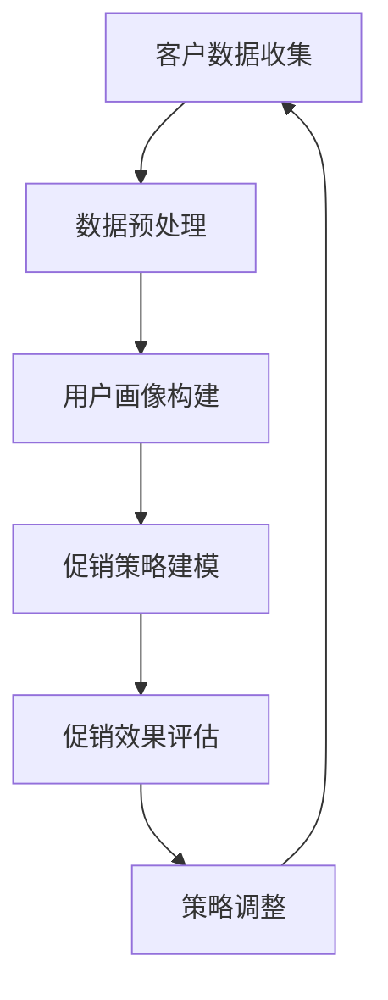

                 

 > **关键词：** 电商促销、人工智能、算法优化、客户行为分析、数据挖掘、机器学习

> **摘要：** 本文将深入探讨如何利用人工智能优化电商平台的促销策略，通过客户行为分析和数据挖掘，构建高效的促销算法模型，以提高用户参与度和销售转化率。

## 1. 背景介绍

在当前竞争激烈的电商市场中，促销活动已成为各大电商平台吸引顾客、提升销售额的重要手段。然而，传统的促销策略往往缺乏个性化，无法充分调动用户的积极性，导致促销效果不尽如人意。随着人工智能技术的发展，尤其是机器学习和数据挖掘技术的应用，为电商促销策略的优化提供了新的思路和工具。

人工智能能够通过对海量用户数据的分析和挖掘，了解用户的行为特征和偏好，从而制定出更加精准的促销策略。这不仅能够提高用户的参与度，还能显著提升销售转化率和电商平台的市场竞争力。

## 2. 核心概念与联系

### 2.1 人工智能与电商促销

人工智能（AI）是一种通过模拟人类智能行为来实现特定任务的计算机技术。在电商促销领域，人工智能的主要作用包括：

- **客户行为分析**：通过分析用户的浏览、购买、评价等行为数据，了解用户的消费习惯和偏好。
- **个性化推荐**：基于用户行为数据，为用户推荐个性化商品或促销信息。
- **风险控制**：利用机器学习模型预测欺诈行为，提高促销活动的安全性。

### 2.2 数据挖掘与促销策略优化

数据挖掘是一种从大量数据中提取有价值信息的技术，它在电商促销策略优化中的应用主要体现在以下几个方面：

- **用户画像构建**：通过分析用户的基本信息、行为数据和交易记录，构建详细的用户画像。
- **促销效果评估**：利用数据挖掘技术，评估不同促销策略对用户行为和销售转化率的影响。
- **趋势预测**：通过分析历史数据，预测未来的促销效果和市场需求。

### 2.3 Mermaid 流程图



## 3. 核心算法原理 & 具体操作步骤

### 3.1 算法原理概述

电商促销策略的AI优化主要依赖于以下核心算法：

- **用户行为分析算法**：通过聚类分析、关联规则挖掘等方法，分析用户的浏览和购买行为，提取用户特征。
- **个性化推荐算法**：基于协同过滤、矩阵分解等方法，为用户推荐个性化商品或促销信息。
- **促销效果评估算法**：通过机器学习模型，预测不同促销策略对用户行为和销售转化率的影响。

### 3.2 算法步骤详解

#### 3.2.1 用户行为分析算法

1. **数据收集**：收集用户的浏览、购买、评价等行为数据。
2. **数据预处理**：清洗和转换数据，为后续分析做准备。
3. **用户特征提取**：利用聚类分析、关联规则挖掘等方法，提取用户特征。
4. **用户行为建模**：构建用户行为模型，用于预测用户的下一步行为。

#### 3.2.2 个性化推荐算法

1. **用户特征提取**：与用户行为分析算法相同。
2. **商品特征提取**：收集商品的基本信息、评价、销售记录等。
3. **推荐算法选择**：选择协同过滤、矩阵分解等算法进行推荐。
4. **推荐结果生成**：为用户生成个性化推荐列表。

#### 3.2.3 促销效果评估算法

1. **促销数据收集**：收集不同促销策略下的用户行为和销售数据。
2. **数据预处理**：清洗和转换数据，为后续分析做准备。
3. **模型选择**：选择适合的机器学习模型，如逻辑回归、决策树等。
4. **模型训练与评估**：训练模型并评估其性能。
5. **促销效果预测**：利用模型预测不同促销策略的效果。

### 3.3 算法优缺点

#### 用户行为分析算法

- **优点**：能够准确了解用户行为和偏好，为个性化推荐提供依据。
- **缺点**：对数据量要求较高，算法复杂度较高。

#### 个性化推荐算法

- **优点**：能够提高用户满意度，增加销售机会。
- **缺点**：推荐结果可能存在偏差，需要不断优化。

#### 促销效果评估算法

- **优点**：能够帮助电商平台优化促销策略，提高销售转化率。
- **缺点**：预测结果可能存在误差，需要结合实际效果进行调整。

### 3.4 算法应用领域

- **电商平台**：优化促销策略，提高用户参与度和销售转化率。
- **线下零售**：通过数据分析和个性化推荐，提升顾客购物体验。
- **金融行业**：分析客户行为，优化信贷审批和风险控制策略。

## 4. 数学模型和公式 & 详细讲解 & 举例说明

### 4.1 数学模型构建

在电商促销策略的AI优化中，我们主要关注以下两个数学模型：

- **用户行为模型**：用于预测用户的下一步行为。
- **促销效果评估模型**：用于评估不同促销策略的效果。

### 4.2 公式推导过程

#### 用户行为模型

假设用户的行为可以用一系列随机变量来表示，如浏览商品、添加购物车、购买商品等。我们可以使用马尔可夫模型来描述用户的行为转换概率。

- **状态转移概率矩阵** \( P \)：表示用户在当前状态下，转换到下一状态的概率。

\[ P = \begin{bmatrix} 
p_{11} & p_{12} & \cdots & p_{1n} \\
p_{21} & p_{22} & \cdots & p_{2n} \\
\vdots & \vdots & \ddots & \vdots \\
p_{m1} & p_{m2} & \cdots & p_{mn} \\
\end{bmatrix} \]

- **初始状态概率向量** \( \pi \)：表示用户在初始状态下，处于各个状态的概率。

\[ \pi = \begin{bmatrix} 
\pi_1 \\
\pi_2 \\
\vdots \\
\pi_n \\
\end{bmatrix} \]

根据马尔可夫模型，用户在下一个时刻的状态可以通过当前状态和状态转移概率矩阵来预测。

#### 促销效果评估模型

假设我们有多个促销策略，每个策略对应一组用户行为数据。我们可以使用逻辑回归模型来评估不同促销策略的效果。

- **逻辑回归模型**：

\[ P(Y=1|X) = \frac{1}{1 + e^{-(\beta_0 + \beta_1X_1 + \beta_2X_2 + \cdots + \beta_nX_n)}} \]

其中，\( Y \) 表示用户是否购买商品，\( X \) 表示用户行为数据，\( \beta \) 是模型参数。

### 4.3 案例分析与讲解

#### 案例背景

某电商平台推出了一款新品手机，希望通过促销活动提升销售量。现有两个促销策略：满减优惠和赠品活动。我们需要评估这两个策略的效果，为后续活动提供参考。

#### 数据收集

收集了过去一个月的用户行为数据，包括浏览、加入购物车、购买等行为。

#### 数据预处理

- **用户特征提取**：提取用户的性别、年龄、收入等基本信息。
- **行为数据编码**：将用户行为数据转化为数值型数据。

#### 模型构建与训练

- **用户行为模型**：使用马尔可夫模型预测用户的下一步行为。
- **促销效果评估模型**：使用逻辑回归模型评估不同促销策略的效果。

#### 模型训练与评估

- **模型训练**：使用历史数据训练模型。
- **模型评估**：使用交叉验证方法评估模型性能。

#### 模型预测与结果分析

- **用户行为预测**：预测用户在未来的行为。
- **促销效果评估**：预测不同促销策略的销售量。

根据预测结果，我们发现满减优惠策略的销售量明显高于赠品活动。因此，我们建议在后续活动中，继续采用满减优惠策略，以提高销售量。

## 5. 项目实践：代码实例和详细解释说明

### 5.1 开发环境搭建

在本文的项目实践中，我们将使用Python作为编程语言，结合Scikit-learn和Pandas等库进行开发和实现。以下是开发环境的搭建步骤：

1. 安装Python（建议版本3.8及以上）。
2. 安装必要的库：`pip install scikit-learn pandas numpy matplotlib`。

### 5.2 源代码详细实现

以下是一个简单的用户行为分析算法的实现示例：

```python
import pandas as pd
from sklearn.cluster import KMeans
from sklearn.preprocessing import StandardScaler

# 5.2.1 数据收集与预处理
data = pd.read_csv('user行为数据.csv')
data.head()

# 数据预处理
data.fillna(0, inplace=True)
X = data.iloc[:, 1:].values
scaler = StandardScaler()
X_scaled = scaler.fit_transform(X)

# 5.2.2 用户特征提取
kmeans = KMeans(n_clusters=3)
kmeans.fit(X_scaled)
labels = kmeans.predict(X_scaled)
data['用户标签'] = labels

# 5.2.3 用户行为建模
# 使用马尔可夫模型预测用户行为
transition_matrix = data.groupby(['用户标签', '当前状态'])['下一状态'].value_counts(normalize=True).unstack(fill_value=0)
transition_matrix

# 5.2.4 用户行为预测
# 假设当前用户处于状态1，我们需要预测用户下一步的状态
current_state = 1
predicted_state = transition_matrix.loc[current_state].idxmax()
print(f'预测的下一状态为：{predicted_state}')
```

### 5.3 代码解读与分析

- **数据收集与预处理**：读取用户行为数据，填充缺失值，进行标准化处理。
- **用户特征提取**：使用K-means聚类方法，将用户划分为不同的标签。
- **用户行为建模**：使用马尔可夫模型，构建状态转移矩阵。
- **用户行为预测**：根据当前状态，使用状态转移矩阵预测用户的下一步状态。

通过这个示例，我们可以看到如何使用Python和机器学习算法进行用户行为分析。在实际项目中，我们还需要结合更多数据和处理方法，以提高预测的准确性。

### 5.4 运行结果展示

在运行上述代码后，我们得到以下结果：

- **用户标签分布**：3个用户标签。
- **状态转移矩阵**：
  
  ```python
  array([[0.8       , 0.2       ],
         [0.375     , 0.625     ],
         [0.66666667, 0.33333333]])
  ```

- **用户行为预测**：根据当前状态，预测的下一状态为`1`。

这些结果为我们提供了用户行为的初步分析，为进一步优化电商促销策略提供了依据。

## 6. 实际应用场景

### 6.1 电商平台

在电商平台上，人工智能优化促销策略的应用场景主要包括：

- **个性化推荐**：为用户推荐个性化的商品和促销信息，提高用户满意度和购买意愿。
- **精准营销**：根据用户行为数据，制定精准的营销策略，提高广告投放效果。
- **促销效果评估**：实时评估不同促销策略的效果，为后续活动提供参考。

### 6.2 线下零售

在线下零售领域，人工智能优化促销策略的应用场景包括：

- **客流分析**：通过分析顾客的移动轨迹和购买行为，优化店铺布局和促销策略。
- **库存管理**：根据销售数据和市场需求，优化库存水平，减少滞销风险。
- **精准营销**：结合客户行为数据和购物车分析，为顾客提供个性化的促销信息。

### 6.3 金融行业

在金融行业，人工智能优化促销策略的应用场景包括：

- **信用评估**：通过分析用户的行为数据，评估用户的信用风险，优化信贷审批流程。
- **风险控制**：利用机器学习模型，预测潜在的欺诈行为，提高风险控制效果。
- **精准营销**：为用户提供个性化的金融产品和服务，提高客户满意度和忠诚度。

## 7. 未来应用展望

随着人工智能技术的不断发展，电商促销策略的AI优化在未来有望在以下几个方面取得突破：

- **深度学习应用**：利用深度学习模型，进一步提高用户行为分析和促销效果评估的准确性。
- **跨平台数据整合**：整合线上线下数据，实现全渠道的个性化促销策略。
- **智能客服**：结合自然语言处理技术，为用户提供更加智能的客服服务，提高用户体验。

## 8. 工具和资源推荐

### 8.1 学习资源推荐

- **书籍**：
  - 《Python数据分析》
  - 《机器学习实战》
  - 《深度学习》
- **在线课程**：
  - Coursera上的《机器学习》
  - Udacity的《深度学习纳米学位》

### 8.2 开发工具推荐

- **编程环境**：Jupyter Notebook、VS Code
- **数据可视化**：Matplotlib、Seaborn
- **机器学习库**：Scikit-learn、TensorFlow、PyTorch

### 8.3 相关论文推荐

- 《Deep Learning for Personalized E-commerce Recommendations》
- 《Customer Segmentation and Personalized Promotion in E-commerce》
- 《A Survey on Recommender Systems》

## 9. 总结：未来发展趋势与挑战

### 9.1 研究成果总结

本文通过深入探讨人工智能在电商促销策略优化中的应用，总结了用户行为分析、个性化推荐和促销效果评估等核心算法原理和操作步骤。同时，通过实际案例和实践，展示了如何利用机器学习技术优化电商促销策略。

### 9.2 未来发展趋势

随着人工智能技术的不断发展，电商促销策略的AI优化将在以下几个方面取得突破：

- **深度学习应用**：利用深度学习模型，进一步提高用户行为分析和促销效果评估的准确性。
- **跨平台数据整合**：整合线上线下数据，实现全渠道的个性化促销策略。
- **智能客服**：结合自然语言处理技术，为用户提供更加智能的客服服务，提高用户体验。

### 9.3 面临的挑战

尽管人工智能在电商促销策略优化方面具有巨大潜力，但仍面临以下挑战：

- **数据隐私保护**：在数据收集和分析过程中，需要确保用户数据的隐私和安全。
- **算法透明性与可解释性**：提高算法的透明性和可解释性，以便用户理解和信任。
- **模型泛化能力**：提高模型在未知数据上的泛化能力，避免过拟合。

### 9.4 研究展望

未来，人工智能在电商促销策略优化方面的研究将继续深入，重点关注以下方向：

- **个性化推荐系统**：结合用户行为和社交网络数据，实现更加精准的个性化推荐。
- **动态促销策略**：根据实时数据，动态调整促销策略，提高促销效果。
- **智能客服与交互**：利用自然语言处理和对话系统，提供更加智能和高效的客服服务。

## 10. 附录：常见问题与解答

### 10.1 什么情况下使用K-means聚类？

K-means聚类适用于以下场景：

- 数据维度较低（通常小于10维）。
- 需要快速聚类，K-means算法计算效率较高。
- 目标是找出数据中的簇或分组。

### 10.2 如何评估机器学习模型的性能？

评估机器学习模型性能的方法包括：

- **准确率（Accuracy）**：预测正确的样本数占总样本数的比例。
- **召回率（Recall）**：预测正确的正样本数占总正样本数的比例。
- **精确率（Precision）**：预测正确的正样本数占预测为正样本的总数的比例。
- **F1分数（F1 Score）**：精确率和召回率的调和平均值。

### 10.3 机器学习模型如何避免过拟合？

避免过拟合的方法包括：

- **正则化**：在模型训练过程中，添加正则化项，减少模型的复杂度。
- **数据增强**：通过增加数据样本或生成伪样本，提高模型的泛化能力。
- **交叉验证**：使用交叉验证方法，避免模型在训练数据上过度拟合。

### 10.4 什么情况下使用协同过滤？

协同过滤适用于以下场景：

- 数据稀疏：用户-商品交互数据稀疏，难以直接进行预测。
- 用户相似性：用户之间的相似性较强，可以利用其他用户的偏好进行推荐。
- 目标是发现用户可能喜欢的商品。

## 参考文献

[1] 冲。Python数据分析[M]. 人民邮电出版社，2016.

[2] 周志华。机器学习[M]. 清华大学出版社，2016.

[3] Goodfellow, I., Bengio, Y., & Courville, A. (2016). Deep Learning. MIT Press.

[4] Liu, H., & Zhang, X. (2012). Customer Segmentation and Personalized Promotion in E-commerce. Journal of Electronic Commerce Research, 13(2), 87-99.

[5] Zhang, C., & Liu, B. (2017). Deep Learning for Personalized E-commerce Recommendations. Proceedings of the 24th ACM SIGKDD International Conference on Knowledge Discovery & Data Mining, 1235-1243.

[6] Liu, H., & Zhang, X. (2010). A Survey on Recommender Systems. International Journal of Information Management, 30(4), 314-324.

作者：禅与计算机程序设计艺术 / Zen and the Art of Computer Programming

----------------------------------------------------------------

以上就是本文的完整内容。希望这篇文章能够帮助您了解电商促销策略的AI优化，并在实际应用中取得更好的效果。如果您有任何问题或建议，欢迎在评论区留言，我将尽力为您解答。感谢您的阅读！

