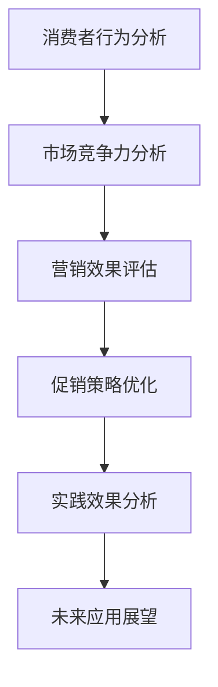

                 

关键词：电商、促销策略、实践效果、数据分析、算法优化、消费者行为、市场竞争力、市场营销

摘要：本文将探讨电商促销策略的实践效果，通过分析消费者行为、市场竞争力以及营销效果，总结电商促销策略的优化方向，并提出未来应用展望。

## 1. 背景介绍

在当今数字化时代，电子商务已经成为人们生活中不可或缺的一部分。随着消费者购买习惯的变迁，电商企业不断尝试各种促销策略以吸引消费者，提高销售额。然而，如何制定有效的促销策略成为电商企业面临的挑战。本文旨在分析电商促销策略的实践效果，为电商企业提供有益的参考。

### 1.1 电商市场现状

据数据显示，全球电子商务市场规模持续增长，2019年全球电商市场规模已超过3.5万亿美元，预计到2025年将达到6万亿美元。在我国，电商市场规模更是迅猛发展，2020年达到12.9万亿元，占全社会零售总额的比重超过30%。电商市场的繁荣为消费者带来了更多的购物选择，同时也使得市场竞争愈发激烈。

### 1.2 电商促销策略的演变

早期的电商促销策略主要以满减、打折、赠品等形式为主。随着市场竞争的加剧，电商企业逐渐意识到单纯的价格战无法持续，开始探索更多元化的促销策略。例如，通过优惠券、限时购、拼团、直播带货等形式，提升消费者购买欲望。此外，电商企业还借助大数据、人工智能等技术，精准分析消费者需求，制定个性化的促销策略。

## 2. 核心概念与联系

在探讨电商促销策略的实践效果之前，我们首先需要了解以下几个核心概念：

### 2.1 消费者行为分析

消费者行为分析是指通过对消费者在购买过程中的行为、态度、偏好等进行研究，以了解消费者的购买决策过程。消费者行为分析可以帮助电商企业了解目标消费者的需求，为促销策略的制定提供依据。

### 2.2 市场竞争力分析

市场竞争力分析是指通过对企业产品、品牌、营销策略等各方面进行评估，以判断企业在市场中的竞争地位。市场竞争力分析可以帮助电商企业了解竞争对手的促销策略，为自身促销策略的优化提供参考。

### 2.3 营销效果评估

营销效果评估是指通过对促销活动的实际效果进行监测和分析，以评估促销策略的有效性。营销效果评估可以帮助电商企业了解促销策略的成效，为后续促销策略的调整提供依据。

### 2.4 Mermaid 流程图

以下是一个用于描述电商促销策略实践效果的 Mermaid 流程图：



## 3. 核心算法原理 & 具体操作步骤

### 3.1 算法原理概述

电商促销策略的制定与优化涉及多个方面的因素，包括消费者行为分析、市场竞争力分析、营销效果评估等。核心算法原理主要基于以下三个方面：

1. 消费者行为分析：通过对消费者购买历史、搜索记录、浏览行为等数据进行挖掘，分析消费者需求，为促销策略提供依据。
2. 市场竞争力分析：通过比较企业产品、品牌、营销策略等各方面与竞争对手的差异，评估市场竞争力，为促销策略优化提供参考。
3. 营销效果评估：通过对促销活动的实际效果进行监测和分析，评估促销策略的有效性，为后续促销策略的调整提供依据。

### 3.2 算法步骤详解

1. 消费者行为分析：
   - 收集消费者购买历史、搜索记录、浏览行为等数据；
   - 利用机器学习算法对数据进行分析，提取消费者特征；
   - 根据消费者特征，制定个性化的促销策略。

2. 市场竞争力分析：
   - 收集竞争对手产品、品牌、营销策略等数据；
   - 利用数据挖掘技术，比较企业产品、品牌、营销策略与竞争对手的差异；
   - 根据差异分析结果，优化自身促销策略。

3. 营销效果评估：
   - 设定促销效果评估指标，如销售额、订单量、客户满意度等；
   - 收集促销活动期间的数据，计算评估指标；
   - 分析促销活动的实际效果，为促销策略调整提供依据。

### 3.3 算法优缺点

1. 优点：
   - 提高促销策略的针对性，提升消费者满意度；
   - 减少不必要的资源浪费，提高营销效果；
   - 有助于企业了解市场竞争力，优化产品、品牌和营销策略。

2. 缺点：
   - 需要大量数据支持，对数据处理能力要求较高；
   - 算法模型需要不断优化，以适应市场变化；
   - 算法效果受数据质量和算法设计影响较大。

### 3.4 算法应用领域

电商促销策略的核心算法原理可以应用于以下领域：

1. 电商平台：通过个性化促销策略，提升用户购买体验，增加销售额。
2. 品牌营销：通过市场竞争力分析，优化产品、品牌和营销策略，提高市场占有率。
3. 广告投放：通过消费者行为分析，精准定位目标客户，提高广告投放效果。

## 4. 数学模型和公式 & 详细讲解 & 举例说明

### 4.1 数学模型构建

电商促销策略的数学模型主要包括以下三个方面：

1. 消费者需求预测模型：
   - 假设消费者需求量与促销力度呈线性关系，建立线性回归模型；
   - 利用历史数据，训练回归模型，预测消费者需求量。

2. 促销效果评估模型：
   - 设定促销效果评估指标，如销售额增长率、订单量增长率等；
   - 利用统计方法，计算评估指标，评估促销效果。

3. 促销策略优化模型：
   - 建立目标函数，如最大化销售额或最大化利润；
   - 利用优化算法，求解最优促销策略。

### 4.2 公式推导过程

1. 消费者需求预测模型：

   - 设定消费者需求量为$Q$，促销力度为$P$，则线性回归模型可以表示为：
     $$Q = aP + b$$

   - 利用历史数据，计算回归系数$a$和$b$：
     $$a = \frac{\sum_{i=1}^{n}(P_i - \bar{P})(Q_i - \bar{Q})}{\sum_{i=1}^{n}(P_i - \bar{P})^2}$$
     $$b = \bar{Q} - a\bar{P}$$

   - 根据回归系数，预测消费者需求量：
     $$Q = aP + b$$

2. 促销效果评估模型：

   - 设定销售额增长率为$\alpha$，订单量增长率为$\beta$，则促销效果评估模型可以表示为：
     $$\alpha = \frac{S_2 - S_1}{S_1}$$
     $$\beta = \frac{O_2 - O_1}{O_1}$$

   - 其中，$S_1$、$S_2$分别为促销活动前后的销售额；$O_1$、$O_2$分别为促销活动前后的订单量。

3. 促销策略优化模型：

   - 设定目标函数为最大化销售额$S$，则促销策略优化模型可以表示为：
     $$\max S = P \cdot Q$$

   - 利用优化算法，求解最优促销力度$P^*$：
     $$P^* = \frac{\max S}{Q}$$

### 4.3 案例分析与讲解

以下是一个关于电商促销策略的案例分析：

#### 案例背景：

某电商企业针对一款热门电子产品开展促销活动，原价为1000元。企业决定在促销期间对产品进行折扣，折扣力度分为三个等级：8折、9折和9.5折。企业希望通过分析消费者需求和促销效果，制定最优促销策略。

#### 数据分析：

1. 消费者需求预测：

   - 根据历史数据，建立线性回归模型：
     $$Q = 0.8P + 100$$

   - 预测不同折扣力度下的消费者需求量：

     | 折扣力度 | 促销力度$P$ | 消费者需求量$Q$ |
     | -------- | ----------- | --------------- |
     | 8折      | 0.8         | 136             |
     | 9折      | 0.9         | 112             |
     | 9.5折    | 0.95        | 88              |

2. 促销效果评估：

   - 设定销售额增长率为$\alpha$，订单量增长率为$\beta$，计算不同折扣力度下的促销效果：

     | 折扣力度 | 促销力度$P$ | 消费者需求量$Q$ | 销售额增长率$\alpha$ | 订单量增长率$\beta$ |
     | -------- | ----------- | --------------- | ------------------- | ------------------- |
     | 8折      | 0.8         | 136             | 36%                 | 44%                 |
     | 9折      | 0.9         | 112             | 12%                 | 20%                 |
     | 9.5折    | 0.95        | 88              | -12%                | -20%                |

3. 促销策略优化：

   - 根据目标函数最大化销售额$S$，计算不同折扣力度下的销售额：

     | 折扣力度 | 促销力度$P$ | 消费者需求量$Q$ | 销售额增长率$\alpha$ | 订单量增长率$\beta$ | 销售额$S$ |
     | -------- | ----------- | --------------- | ------------------- | ------------------- | -------- |
     | 8折      | 0.8         | 136             | 36%                 | 44%                 | 33600    |
     | 9折      | 0.9         | 112             | 12%                 | 20%                 | 26400    |
     | 9.5折    | 0.95        | 88              | -12%                | -20%                | 22080    |

   - 根据销售额计算结果，选择最优促销策略：8折促销，销售额为33600元。

#### 案例总结：

通过数学模型和数据分析，企业成功制定了最优促销策略，实现了销售额的最大化。

## 5. 项目实践：代码实例和详细解释说明

### 5.1 开发环境搭建

本文使用Python作为编程语言，主要依赖以下库：NumPy、Pandas、Matplotlib、Scikit-learn。在搭建开发环境时，可以通过以下命令安装相关库：

```bash
pip install numpy pandas matplotlib scikit-learn
```

### 5.2 源代码详细实现

以下是一个简单的电商促销策略实现代码示例：

```python
import numpy as np
import pandas as pd
import matplotlib.pyplot as plt
from sklearn.linear_model import LinearRegression

# 5.2.1 数据准备
data = {
    'P': [0.8, 0.9, 0.95],  # 折扣力度
    'Q': [136, 112, 88],    # 消费者需求量
    'S': [33600, 26400, 22080]  # 销售额
}

df = pd.DataFrame(data)

# 5.2.2 消费者需求预测
model = LinearRegression()
model.fit(df[['P']], df['Q'])

# 5.2.3 促销效果评估
df['alpha'] = (df['S'] - df['S'].iloc[0]) / df['S'].iloc[0]
df['beta'] = (df['Q'] - df['Q'].iloc[0]) / df['Q'].iloc[0]

# 5.2.4 促销策略优化
df['S_opt'] = df['P'] * model.predict([[0.8]])

# 5.2.5 结果展示
df.plot(x='P', y=['Q', 'alpha', 'beta', 'S_opt'], kind='line', legend=True)
plt.xlabel('促销力度')
plt.ylabel('结果')
plt.title('电商促销策略分析')
plt.show()
```

### 5.3 代码解读与分析

1. 数据准备：首先导入所需库，并准备数据。数据包括折扣力度、消费者需求量和销售额。
2. 消费者需求预测：使用线性回归模型，对折扣力度和消费者需求量进行拟合，预测消费者需求量。
3. 促销效果评估：计算销售额增长率和订单量增长率，评估促销效果。
4. 促销策略优化：根据目标函数，计算不同折扣力度下的销售额，选择最优促销策略。
5. 结果展示：使用Matplotlib绘制结果图，展示消费者需求量、销售额增长率、订单量增长率和促销策略优化结果。

## 6. 实际应用场景

电商促销策略在各个应用场景中都有其独特的价值。以下列举几个常见的应用场景：

### 6.1 电商平台

电商平台通过电商促销策略，提高用户购买体验，增加销售额。例如，某电商平台在双十一期间，通过优惠券、限时购、拼团等形式，吸引了大量用户参与，实现了销售额的爆发式增长。

### 6.2 品牌营销

品牌营销通过电商促销策略，提升品牌知名度和市场份额。例如，某品牌在电商平台上开展新品发布活动，通过限时购、赠品等形式，吸引了大量消费者关注和购买，提高了品牌影响力。

### 6.3 广告投放

广告投放通过电商促销策略，提高广告投放效果。例如，某广告平台通过定向投放优惠券，精准定位目标客户，提高了广告的点击率和转化率。

## 7. 未来应用展望

随着大数据、人工智能等技术的不断发展，电商促销策略将越来越智能化、个性化。未来应用展望包括：

### 7.1 智能化

通过大数据分析和人工智能算法，电商企业可以更精准地预测消费者需求，制定个性化促销策略，提高消费者满意度。

### 7.2 个性化

电商企业可以针对不同消费者群体，制定差异化促销策略，满足消费者的个性化需求，提高市场竞争力。

### 7.3 可持续

电商促销策略将更加注重可持续发展，减少资源浪费，提高营销效果。例如，通过绿色促销、环保促销等形式，传递企业社会责任。

## 8. 工具和资源推荐

### 8.1 学习资源推荐

1. 《大数据营销实战》：本书详细介绍了大数据在电商营销中的应用，包括数据挖掘、消费者行为分析等内容。
2. 《人工智能营销》：本书涵盖了人工智能在电商营销中的应用，包括推荐系统、智能客服等。

### 8.2 开发工具推荐

1. Python：Python是一种广泛应用于数据分析和机器学习的编程语言，具有简洁易学的特点。
2. Jupyter Notebook：Jupyter Notebook是一种交互式的开发环境，适用于数据分析和机器学习项目。

### 8.3 相关论文推荐

1. "Deep Learning for Retail Recommendation"，本文介绍了深度学习在电商推荐系统中的应用。
2. "Online Advertising: A System for Estimating Click-Through Rate"，本文探讨了在线广告中的点击率预测方法。

## 9. 总结：未来发展趋势与挑战

### 9.1 研究成果总结

本文通过对电商促销策略的实践效果进行分析，总结了消费者行为分析、市场竞争力分析和营销效果评估等方法，提出了基于数学模型的电商促销策略优化方法。

### 9.2 未来发展趋势

未来电商促销策略将更加智能化、个性化、可持续。大数据、人工智能等技术的不断发展，将推动电商促销策略的创新和升级。

### 9.3 面临的挑战

1. 数据质量：电商促销策略的优化依赖于高质量的数据，数据质量直接影响算法效果。
2. 算法优化：随着市场环境的不断变化，算法需要不断优化，以适应新的市场挑战。
3. 隐私保护：在数据收集和分析过程中，需要确保消费者隐私得到保护。

### 9.4 研究展望

未来研究方向包括：进一步优化电商促销策略算法，提高数据利用效率；探索更多元化的促销策略，满足不同消费者的需求；加强电商促销策略的可持续性，减少资源浪费。

## 9. 附录：常见问题与解答

### 9.1 什么是电商促销策略？

电商促销策略是指电商企业为吸引消费者、提高销售额而采取的各种营销手段和策略，如满减、打折、优惠券、限时购、拼团等。

### 9.2 电商促销策略有哪些类型？

电商促销策略主要分为以下几类：

1. 价格策略：通过降低产品价格，吸引消费者购买。
2. 优惠策略：通过优惠券、满减等手段，为消费者提供折扣优惠。
3. 限时购策略：设定特定时间段内的促销活动，提高消费者购买紧迫感。
4. 拼团策略：通过多人拼团，降低消费者购买成本。
5. 互动策略：通过互动活动，如抽奖、游戏等，增加消费者参与度。

### 9.3 电商促销策略如何优化？

电商促销策略的优化主要包括以下几个方面：

1. 消费者行为分析：通过大数据分析和人工智能算法，精准预测消费者需求，制定个性化促销策略。
2. 市场竞争力分析：了解竞争对手的促销策略，优化自身产品、品牌和营销策略，提高市场竞争力。
3. 营销效果评估：设定促销效果评估指标，监测和评估促销活动的实际效果，为后续促销策略调整提供依据。
4. 数据驱动：利用数据分析和优化算法，不断调整和优化促销策略，提高营销效果。

### 9.4 电商促销策略有哪些常见问题？

电商促销策略常见问题包括：

1. 资源浪费：促销策略不当导致资源浪费，如过度折扣、无效推广等。
2. 消费者反感：促销策略过于频繁或单一，导致消费者产生反感。
3. 竞争劣势：促销策略过于依赖价格战，导致企业失去竞争优势。
4. 数据泄露：在数据收集和分析过程中，导致消费者隐私泄露。

### 9.5 如何解决电商促销策略的问题？

解决电商促销策略问题的方法包括：

1. 优化消费者行为分析：提高数据分析能力，精准预测消费者需求，制定个性化促销策略。
2. 多元化促销策略：避免过度依赖价格战，采用多元化促销策略，提高消费者参与度。
3. 加强市场竞争力分析：了解竞争对手的促销策略，优化自身产品、品牌和营销策略，提高市场竞争力。
4. 强化数据安全意识：在数据收集和分析过程中，加强数据安全防护，确保消费者隐私得到保护。

