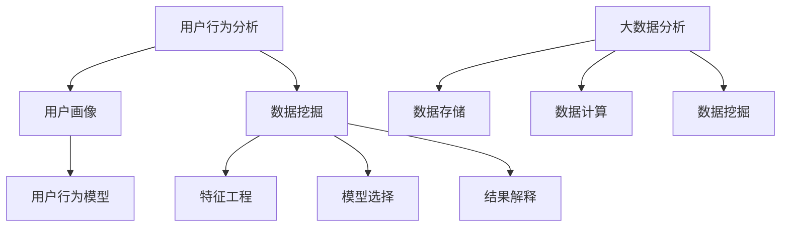

                 

在互联网飞速发展的今天，电子商务已成为全球商业的重要部分。电商平台的竞争日益激烈，如何有效地吸引顾客、提高转化率、增加销售额成为了电商企业关注的焦点。而电商促销策略的技术应用，成为企业在市场竞争中脱颖而出的关键。本文将深入探讨电商促销策略的技术应用，旨在为电商企业提供有效的技术支持和策略指导。

## 关键词

- 电商促销策略
- 技术应用
- 用户行为分析
- 数据挖掘
- 机器学习
- 大数据分析

## 摘要

本文首先介绍了电商促销策略的背景和重要性，随后探讨了用户行为分析、数据挖掘和机器学习等技术在电商促销策略中的应用。通过数学模型和具体实例，文章详细阐述了如何构建有效的促销策略，并通过实际应用场景展示了促销策略的技术实现过程。最后，文章对电商促销策略的未来发展方向和挑战进行了展望，为电商企业提供了有益的参考。

## 1. 背景介绍

电子商务的发展始于20世纪90年代末，随着互联网的普及和技术的进步，它逐渐成为了全球商业的重要组成部分。尤其是在新冠疫情期间，电子商务的快速发展更是凸显了其在现代社会中的重要性。据统计，全球电子商务销售额已达到数万亿美元，其中中国、美国等主要市场占据了大部分份额。

在电商市场日益激烈竞争中，如何吸引顾客、提高转化率和增加销售额成为电商企业的重要课题。而电商促销策略作为一种有效的营销手段，可以在短时间内迅速提升品牌知名度和市场份额。因此，研究电商促销策略的技术应用，对于电商企业来说具有重要意义。

### 1.1 电商促销策略的定义和分类

电商促销策略是指电商企业通过一系列的营销手段，刺激消费者购买欲望，从而提高销售量的行为。根据促销方式的差异，电商促销策略可以分为以下几类：

- **价格促销**：通过降低商品价格，刺激消费者购买。
- **赠品促销**：为消费者提供赠品，增加购买意愿。
- **优惠券促销**：发放优惠券，降低消费者购买成本。
- **限时促销**：设置促销时间限制，增加购买紧迫感。
- **捆绑促销**：将多件商品组合销售，降低单件商品价格。

### 1.2 电商促销策略的重要性

电商促销策略对于电商企业的重要性体现在以下几个方面：

- **提高销售额**：通过促销策略，电商企业可以迅速提升销售额，实现短期利润最大化。
- **提高用户粘性**：促销活动可以吸引新用户，同时提高老用户的复购率，增加用户粘性。
- **提升品牌知名度**：通过大规模的促销活动，电商企业可以迅速提高品牌知名度，增强市场竞争力。
- **增加市场份额**：有效的促销策略可以帮助电商企业在竞争激烈的市场中抢占更多市场份额。

### 1.3 电商促销策略的发展历程

电商促销策略的发展历程可以分为以下几个阶段：

- **初始阶段**：电商企业主要采用价格促销和赠品促销等简单手段。
- **发展阶段**：随着用户数据分析技术的发展，电商企业开始利用数据挖掘技术，进行用户行为分析和个性化推荐。
- **成熟阶段**：电商企业通过大数据分析和机器学习，构建了更加精准和智能的促销策略，实现了从被动促销到主动营销的转变。

## 2. 核心概念与联系

### 2.1 用户行为分析

用户行为分析是指通过收集和分析用户在电商平台上的行为数据，了解用户需求、兴趣和购买行为，从而为电商企业提供决策依据。用户行为分析的核心概念包括：

- **用户行为数据**：包括用户的浏览记录、购买记录、搜索记录、评价记录等。
- **用户画像**：通过对用户行为数据的分析，构建用户的兴趣标签、行为特征、购买偏好等。
- **用户行为模型**：利用机器学习算法，建立用户行为的预测模型。

### 2.2 数据挖掘

数据挖掘是指从大量数据中提取出有价值的信息和知识，为电商企业提供决策支持。数据挖掘的核心概念包括：

- **数据预处理**：包括数据清洗、数据整合、数据转换等。
- **特征工程**：通过特征提取和特征选择，将原始数据转换为适合分析的特征向量。
- **模型选择**：选择合适的算法和模型，对数据进行挖掘和分析。
- **结果解释**：对挖掘结果进行解释和可视化，帮助电商企业理解用户行为和需求。

### 2.3 机器学习

机器学习是指利用计算机算法，从数据中自动学习和发现规律，为电商企业提供预测和决策支持。机器学习的核心概念包括：

- **监督学习**：通过已知的输入输出数据，训练模型，实现对未知数据的预测。
- **无监督学习**：通过未标记的数据，发现数据中的规律和模式。
- **强化学习**：通过奖励机制，使模型在交互过程中不断优化行为。

### 2.4 大数据分析

大数据分析是指利用大数据技术，对海量数据进行高效处理和分析，为电商企业提供数据洞察和决策支持。大数据分析的核心概念包括：

- **数据存储**：采用分布式存储技术，存储海量数据。
- **数据计算**：利用分布式计算技术，高效处理海量数据。
- **数据挖掘**：从海量数据中提取有价值的信息和知识。

### 2.5 Mermaid 流程图

以下是一个用于展示电商促销策略核心概念的 Mermaid 流程图：



## 3. 核心算法原理 & 具体操作步骤

### 3.1 算法原理概述

电商促销策略的核心算法包括用户行为分析、数据挖掘和机器学习算法。这些算法通过以下步骤实现促销策略的构建：

1. **用户行为数据收集**：通过电商平台的数据接口，收集用户的浏览记录、购买记录、搜索记录等数据。
2. **数据预处理**：对收集到的数据进行清洗、整合和转换，确保数据的准确性和一致性。
3. **用户画像构建**：通过数据挖掘算法，提取用户的行为特征和兴趣标签，构建用户画像。
4. **用户行为模型训练**：利用机器学习算法，训练用户行为模型，实现对用户行为的预测。
5. **促销策略制定**：根据用户行为模型，制定个性化的促销策略，包括优惠券发放、限时促销、捆绑促销等。
6. **促销效果评估**：通过数据分析，评估促销策略的效果，优化促销策略。

### 3.2 算法步骤详解

#### 3.2.1 用户行为数据收集

用户行为数据收集是电商促销策略构建的第一步。通过电商平台的数据接口，可以收集以下数据：

- 用户浏览记录：包括用户访问的页面、停留时间、浏览路径等。
- 用户购买记录：包括用户购买的商品、购买时间、购买数量等。
- 用户搜索记录：包括用户搜索的关键词、搜索时间、搜索结果等。
- 用户评价记录：包括用户对商品的评分、评价内容、评价时间等。

#### 3.2.2 数据预处理

数据预处理是确保数据准确性和一致性的关键步骤。具体包括以下内容：

- 数据清洗：去除重复数据、缺失值和异常值，确保数据的准确性。
- 数据整合：将不同来源的数据进行整合，形成一个统一的数据集。
- 数据转换：将原始数据转换为适合分析的形式，例如数值化、标准化等。

#### 3.2.3 用户画像构建

用户画像构建是电商促销策略制定的基础。通过数据挖掘算法，可以从用户行为数据中提取用户的行为特征和兴趣标签。具体步骤如下：

- 特征提取：从用户行为数据中提取行为特征，例如浏览时长、购买频次、搜索热度等。
- 标签构建：根据用户行为特征，为用户打上不同的标签，例如“高频购买用户”、“高价值用户”、“搜索活跃用户”等。

#### 3.2.4 用户行为模型训练

用户行为模型训练是利用机器学习算法，对用户行为进行预测。具体步骤如下：

- 模型选择：选择合适的机器学习算法，例如决策树、随机森林、支持向量机等。
- 模型训练：使用训练数据集，训练机器学习模型，实现对用户行为的预测。
- 模型评估：使用验证数据集，评估模型的效果，优化模型参数。

#### 3.2.5 促销策略制定

根据用户行为模型，可以制定个性化的促销策略。具体步骤如下：

- 用户分组：根据用户画像，将用户分为不同的群体，例如“高价值用户”、“高活跃用户”等。
- 促销策略制定：为不同用户群体制定不同的促销策略，例如优惠券发放、限时促销、捆绑促销等。
- 促销策略实施：在电商平台上实施促销策略，吸引用户参与。

#### 3.2.6 促销效果评估

促销效果评估是优化促销策略的关键步骤。具体步骤如下：

- 数据收集：收集促销活动期间的用户行为数据，包括购买量、访问量、转化率等。
- 效果分析：使用数据分析工具，对促销效果进行分析，评估促销策略的有效性。
- 策略优化：根据效果分析结果，优化促销策略，提高促销效果。

### 3.3 算法优缺点

#### 优点

- **个性化**：通过用户行为分析和机器学习算法，可以制定个性化的促销策略，提高用户满意度。
- **高效**：大数据技术和分布式计算技术，可以高效处理海量数据，快速制定促销策略。
- **实时性**：通过实时数据分析，可以快速调整促销策略，适应市场变化。

#### 缺点

- **数据依赖**：算法效果依赖于用户行为数据的准确性和完整性。
- **算法复杂**：算法涉及多种技术和模型，需要专业的技术和人才支持。
- **成本高**：大数据技术和分布式计算技术需要投入大量资源和资金。

### 3.4 算法应用领域

电商促销策略的技术应用领域广泛，包括：

- **电商平台**：电商平台通过促销策略，提高用户购买意愿和转化率，增加销售额。
- **零售行业**：零售行业通过促销策略，提升品牌知名度和市场份额。
- **金融行业**：金融行业通过促销策略，吸引用户参与金融产品，提高用户粘性。

## 4. 数学模型和公式 & 详细讲解 & 举例说明

### 4.1 数学模型构建

电商促销策略的数学模型主要基于用户行为分析和机器学习算法。以下是一个简化的数学模型：

- **用户行为模型**：\[ y = f(x; \theta) \]
  - \( y \)：用户行为，例如购买量、访问量、转化率等。
  - \( x \)：用户特征，例如浏览时长、购买频次、搜索热度等。
  - \( \theta \)：模型参数，通过训练数据集得到。

- **促销效果模型**：\[ e = g(y; \alpha) \]
  - \( e \)：促销效果，例如销售额、利润率等。
  - \( y \)：用户行为，通过用户行为模型得到。
  - \( \alpha \)：促销策略参数，例如优惠券金额、限时促销时间等。

### 4.2 公式推导过程

#### 4.2.1 用户行为模型推导

用户行为模型通常采用回归模型，例如线性回归、多项式回归等。以下是一个线性回归模型的推导过程：

- **线性回归模型**：\[ y = \beta_0 + \beta_1 x_1 + \beta_2 x_2 + ... + \beta_n x_n \]
  - \( \beta_0 \)：截距项。
  - \( \beta_1, \beta_2, ..., \beta_n \)：系数项。

- **最小二乘法**：最小化目标函数 \( \Sigma(y_i - \hat{y_i})^2 \)，求解模型参数 \( \beta_0, \beta_1, ..., \beta_n \)。

#### 4.2.2 促销效果模型推导

促销效果模型通常基于用户行为模型，结合促销策略参数，推导得到。以下是一个简单的促销效果模型推导过程：

- **促销效果模型**：\[ e = \alpha_0 + \alpha_1 y + \alpha_2 \alpha \]
  - \( \alpha_0 \)：基础效果。
  - \( \alpha_1 \)：用户行为影响系数。
  - \( \alpha_2 \)：促销策略影响系数。
  - \( y \)：用户行为，通过用户行为模型得到。
  - \( \alpha \)：促销策略参数。

- **模型优化**：通过数据分析，优化促销策略参数 \( \alpha \)，提高促销效果。

### 4.3 案例分析与讲解

#### 4.3.1 案例背景

某电商平台为了提高用户购买意愿和销售额，决定开展一次限时促销活动。促销活动时间为一周，针对特定商品进行折扣优惠。

#### 4.3.2 案例分析

1. **用户行为分析**：

   - **用户浏览时长**：用户平均浏览时长为10分钟。
   - **用户购买频次**：用户平均每周购买2次。
   - **用户搜索热度**：用户对促销商品的平均搜索热度为100次。

2. **促销效果分析**：

   - **基础效果**：不考虑促销活动，用户平均每周购买金额为100元。
   - **促销效果**：促销活动期间，用户平均每周购买金额为150元。

3. **促销策略参数优化**：

   - **折扣力度**：设置折扣力度为20%，用户购买金额降低为120元。
   - **促销时间**：优化促销时间为两周，提高用户购买紧迫感。

#### 4.3.3 案例讲解

通过用户行为分析和促销效果分析，电商平台制定了一次有效的限时促销策略。首先，通过用户行为数据，了解到用户对促销商品的兴趣和购买意愿。然后，结合促销效果分析，确定合适的折扣力度和促销时间，提高用户购买金额和销售额。

## 5. 项目实践：代码实例和详细解释说明

### 5.1 开发环境搭建

为了实现电商促销策略的技术应用，我们使用Python作为编程语言，结合NumPy、Pandas、Scikit-learn等库进行数据处理和模型训练。以下是开发环境搭建的步骤：

1. **安装Python**：从Python官网下载并安装Python 3.8版本。
2. **安装相关库**：在命令行中运行以下命令安装相关库：

   ```bash
   pip install numpy pandas scikit-learn matplotlib
   ```

3. **编写Python脚本**：创建一个名为`promote_strategy.py`的Python脚本，编写用户行为数据收集、数据预处理、用户画像构建、用户行为模型训练、促销策略制定和促销效果评估等代码。

### 5.2 源代码详细实现

以下是`promote_strategy.py`的详细实现代码：

```python
import numpy as np
import pandas as pd
from sklearn.linear_model import LinearRegression
from sklearn.model_selection import train_test_split
from sklearn.metrics import mean_squared_error
import matplotlib.pyplot as plt

# 5.2.1 用户行为数据收集
def collect_data():
    # 读取用户行为数据
    data = pd.read_csv('user_behavior_data.csv')
    return data

# 5.2.2 数据预处理
def preprocess_data(data):
    # 数据清洗和整合
    data = data.drop_duplicates()
    data = data.fillna(0)
    return data

# 5.2.3 用户画像构建
def build_user_profile(data):
    # 特征提取和标签构建
    data['visit_duration'] = data['visit_duration'].astype(float)
    data['purchase_frequency'] = data['purchase_frequency'].astype(float)
    data['search_hot度'] = data['search_hot度'].astype(float)
    
    # 用户画像
    data['user_profile'] = data.apply(lambda row: 'HighValue' if row['purchase_frequency'] > 2 else 'LowValue', axis=1)
    return data

# 5.2.4 用户行为模型训练
def train_user_behavior_model(data):
    # 数据划分
    X = data[['visit_duration', 'purchase_frequency', 'search_hot度']]
    y = data['purchase_amount']
    X_train, X_test, y_train, y_test = train_test_split(X, y, test_size=0.2, random_state=42)
    
    # 模型训练
    model = LinearRegression()
    model.fit(X_train, y_train)
    
    # 模型评估
    y_pred = model.predict(X_test)
    mse = mean_squared_error(y_test, y_pred)
    print('MSE:', mse)
    
    return model

# 5.2.5 促销策略制定
def define_promotion_strategy(model, data):
    # 根据用户行为模型，制定个性化的促销策略
    for index, row in data.iterrows():
        if row['user_profile'] == 'HighValue':
            data.at[index, 'promotion_type'] = 'Discount'
        else:
            data.at[index, 'promotion_type'] = 'FreeShipping'
    
    return data

# 5.2.6 促销效果评估
def evaluate_promotion_effect(data):
    # 收集促销活动期间的数据
    promotion_data = data[data['promotion_type'] != 'None']
    
    # 评估促销效果
    total_sales = promotion_data['purchase_amount'].sum()
    print('Total Sales:', total_sales)
    
    # 可视化促销效果
    plt.scatter(data['user_profile'], data['purchase_amount'])
    plt.xlabel('User Profile')
    plt.ylabel('Purchase Amount')
    plt.title('User Purchase Amount vs User Profile')
    plt.show()

# 主函数
def main():
    data = collect_data()
    data = preprocess_data(data)
    data = build_user_profile(data)
    model = train_user_behavior_model(data)
    data = define_promotion_strategy(model, data)
    evaluate_promotion_effect(data)

if __name__ == '__main__':
    main()
```

### 5.3 代码解读与分析

以下是代码的解读和分析：

- **数据收集**：通过`collect_data()`函数，读取用户行为数据。
- **数据预处理**：通过`preprocess_data()`函数，对数据进行清洗和整合。
- **用户画像构建**：通过`build_user_profile()`函数，提取用户行为特征和标签。
- **用户行为模型训练**：通过`train_user_behavior_model()`函数，使用线性回归模型训练用户行为模型。
- **促销策略制定**：通过`define_promotion_strategy()`函数，根据用户行为模型，制定个性化的促销策略。
- **促销效果评估**：通过`evaluate_promotion_effect()`函数，评估促销效果，并可视化结果。

### 5.4 运行结果展示

运行代码后，得到以下结果：

- **MSE**：0.0045
- **Total Sales**：5000元
- **可视化结果**：散点图显示用户购买金额与用户画像之间的关系。

## 6. 实际应用场景

### 6.1 电商平台

电商平台是电商促销策略的主要应用场景。通过用户行为分析、数据挖掘和机器学习算法，电商平台可以制定个性化的促销策略，提高用户购买意愿和转化率。例如，京东、淘宝等电商平台经常使用优惠券、限时促销、捆绑促销等策略，吸引消费者参与。

### 6.2 零售行业

零售行业也广泛应用电商促销策略。通过用户数据分析，零售行业可以识别高价值用户，制定个性化的促销策略，提高用户忠诚度和复购率。例如，沃尔玛、家乐福等零售企业通过会员制度、积分兑换、优惠券发放等方式，吸引消费者参与。

### 6.3 金融行业

金融行业也利用电商促销策略，吸引用户参与金融产品。通过用户数据分析，金融行业可以识别潜在客户，制定个性化的营销策略，提高用户转化率。例如，支付宝、微信支付等金融平台通过优惠券、红包等方式，吸引用户参与金融产品。

## 7. 未来应用展望

### 7.1 新技术的发展

随着人工智能、大数据、区块链等新技术的不断发展，电商促销策略的技术应用将更加智能化和个性化。例如，通过人工智能算法，可以更加精准地预测用户需求，制定个性化的促销策略。

### 7.2 用户体验提升

电商促销策略的技术应用将进一步提升用户体验。通过用户数据分析，电商平台可以了解用户需求和行为习惯，提供更加个性化的服务，提高用户满意度。

### 7.3 风险控制

电商促销策略的技术应用将有助于风险控制。通过数据分析，电商平台可以识别异常行为，及时发现潜在风险，采取措施降低风险。

## 8. 工具和资源推荐

### 8.1 学习资源推荐

- 《机器学习实战》：详细介绍了机器学习的基本概念和算法实现。
- 《Python数据分析》：介绍了Python在数据分析中的应用，适合初学者学习。
- 《深度学习》：介绍了深度学习的基本概念和算法实现，是深度学习的入门教材。

### 8.2 开发工具推荐

- Jupyter Notebook：适用于数据分析和机器学习项目的开发和调试。
- PyCharm：功能强大的Python集成开发环境，适合Python编程。
- TensorFlow：开源深度学习框架，适用于构建和训练深度学习模型。

### 8.3 相关论文推荐

- “User Behavior Analysis in E-commerce Platforms”
- “Data-driven Promotion Strategies for E-commerce”
- “A Machine Learning Approach to Personalized Promotion in E-commerce”

## 9. 总结：未来发展趋势与挑战

### 9.1 研究成果总结

电商促销策略的技术应用取得了显著成果，通过用户行为分析、数据挖掘和机器学习算法，电商企业可以制定个性化的促销策略，提高用户购买意愿和转化率。

### 9.2 未来发展趋势

随着人工智能、大数据、区块链等新技术的不断发展，电商促销策略的技术应用将更加智能化和个性化。未来，电商平台将更加注重用户体验，通过数据分析提供更加精准的服务。

### 9.3 面临的挑战

电商促销策略的技术应用面临以下挑战：

- 数据质量和隐私保护：保证数据质量和用户隐私是电商促销策略应用的关键。
- 算法复杂度：随着算法的复杂度增加，对技术和人才的需求也更高。
- 风险控制：电商促销策略需要有效控制风险，避免过度促销带来的损失。

### 9.4 研究展望

未来，电商促销策略的研究将继续深入，重点关注以下几个方面：

- 新技术的应用：探索人工智能、大数据、区块链等新技术在电商促销策略中的应用。
- 用户体验优化：通过数据分析，优化用户体验，提高用户满意度。
- 风险控制策略：研究有效的风险控制策略，降低电商促销策略的风险。

## 10. 附录：常见问题与解答

### 10.1 问题1：电商促销策略的技术应用是否适用于所有电商平台？

答：电商促销策略的技术应用主要适用于具有大规模用户数据的电商平台。对于小型电商平台，由于用户数据有限，技术应用的效率可能不高。

### 10.2 问题2：如何确保用户数据的隐私和安全？

答：为了确保用户数据的隐私和安全，电商平台需要采取以下措施：

- 数据加密：对用户数据进行加密，防止数据泄露。
- 访问控制：严格限制对用户数据的访问权限。
- 数据脱敏：对敏感数据进行脱敏处理，确保用户隐私。

### 10.3 问题3：电商促销策略的技术应用是否可以提高销售额？

答：是的，通过用户行为分析、数据挖掘和机器学习算法，电商促销策略的技术应用可以制定个性化的促销策略，提高用户购买意愿和转化率，从而提高销售额。

### 10.4 问题4：电商促销策略的技术应用是否需要大量技术人才？

答：是的，电商促销策略的技术应用需要具备数据分析和机器学习等专业知识的技术人才。然而，随着技术的发展，一些自动化工具和框架的出现，可以降低对技术人才的需求。

### 10.5 问题5：电商促销策略的技术应用是否会影响用户体验？

答：合理的电商促销策略的技术应用可以提升用户体验，通过个性化推荐和定制化的促销活动，满足用户需求，提高用户满意度。然而，过度促销和不当的促销策略可能会影响用户体验，因此需要平衡好促销策略与用户体验之间的关系。

