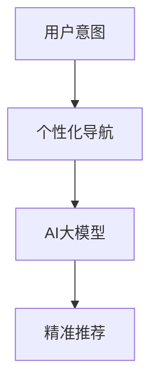

                 

关键词：电商平台，个性化导航，AI大模型，用户意图理解，预测

> 摘要：本文深入探讨了电商平台个性化导航的设计与实现，重点介绍了如何利用AI大模型对用户意图进行理解与预测，以提高用户体验和购物效率。文章首先概述了电商平台个性化导航的背景和重要性，随后详细介绍了核心概念与联系，核心算法原理与操作步骤，数学模型和公式，项目实践代码实例，实际应用场景以及未来应用展望。通过本文的介绍，读者将了解如何将AI技术应用于电商平台，实现更智能、更高效的个性化导航。

## 1. 背景介绍

随着电子商务的迅速发展，电商平台已经成为人们生活中不可或缺的一部分。为了满足用户日益增长的需求，电商平台需要提供更加个性化、智能化的服务。个性化导航作为电商平台的重要组成部分，旨在根据用户的浏览和购买行为，为其推荐最适合的商品和内容，从而提升用户的购物体验。

传统的导航系统主要依赖于静态的分类和标签，无法准确捕捉用户的动态需求。而随着深度学习技术的发展，AI大模型在用户意图理解与预测方面展现出了强大的能力。通过训练大模型，电商平台可以实现对用户行为数据的深入分析，从而提供更加精准的个性化推荐。

本文将围绕电商平台个性化导航的设计与实现，探讨如何利用AI大模型对用户意图进行理解与预测，以提高用户体验和购物效率。首先，我们将介绍核心概念与联系，包括用户意图、个性化导航和AI大模型。接下来，我们将详细讲解核心算法原理与操作步骤，包括数据预处理、特征工程、模型训练和预测。此外，还将介绍数学模型和公式，以及项目实践中的代码实例和运行结果。最后，我们将探讨实际应用场景，以及未来应用展望。

## 2. 核心概念与联系

### 2.1 用户意图

用户意图是指用户在浏览和购物过程中的目的和需求。在电商平台，用户意图可以分为浏览意图、购买意图和搜索意图等。浏览意图主要表现为用户对商品的浏览、收藏和评价等行为；购买意图则体现在用户的购物车、订单支付等行为；搜索意图则是指用户通过关键词搜索特定商品的行为。

理解用户意图对于电商平台个性化导航至关重要。只有准确捕捉用户的意图，才能为用户提供真正个性化的推荐。然而，用户意图是动态变化的，需要通过实时数据进行分析和预测。

### 2.2 个性化导航

个性化导航是指根据用户的行为数据和偏好，为其推荐最适合的商品和内容。个性化导航的核心目标是提高用户体验和购物效率，从而增强用户粘性和转化率。实现个性化导航的关键在于如何根据用户意图进行精准推荐。

个性化导航系统通常包括以下功能：

1. **商品推荐**：根据用户的浏览、收藏和购买历史，推荐用户可能感兴趣的商品。
2. **内容推荐**：根据用户的阅读、评论和点赞历史，推荐用户可能感兴趣的内容。
3. **路径优化**：通过分析用户的浏览路径，为用户提供最优的购物路线。

### 2.3 AI大模型

AI大模型是指具有巨大参数规模和强大计算能力的深度学习模型。随着计算能力和数据量的不断提升，AI大模型在各个领域取得了显著成果。在电商平台个性化导航中，AI大模型可以用于用户意图理解与预测，从而实现更加精准的个性化推荐。

AI大模型主要包括以下类型：

1. **卷积神经网络（CNN）**：用于图像和视觉数据的处理，适用于商品推荐。
2. **循环神经网络（RNN）**：用于处理序列数据，适用于用户行为数据的分析。
3. **生成对抗网络（GAN）**：用于生成用户感兴趣的商品图像，提升用户体验。

### 2.4 核心概念联系

用户意图、个性化导航和AI大模型之间紧密相连。用户意图是个性化导航的基础，AI大模型是实现个性化导航的关键。通过AI大模型，电商平台可以实时分析用户行为数据，理解用户意图，并根据意图为用户提供个性化推荐。

下面是一个简单的Mermaid流程图，展示了核心概念之间的联系：



通过以上流程，我们可以看到，用户意图、个性化导航和AI大模型共同构成了电商平台个性化导航的核心体系，为用户提供更智能、更高效的购物体验。

## 3. 核心算法原理 & 具体操作步骤

### 3.1 算法原理概述

电商平台个性化导航的核心在于对用户意图的准确理解和预测。这需要利用AI大模型对用户行为数据进行分析，从而提取出用户的关键意图，并根据意图为用户提供个性化的推荐。

核心算法原理可以分为以下几个步骤：

1. **数据收集与预处理**：收集用户的浏览、收藏、购买和搜索等行为数据，并进行数据清洗、去重和格式化等预处理操作。
2. **特征工程**：对预处理后的数据进行分析，提取出与用户意图相关的特征，如用户标签、商品属性、时间序列等。
3. **模型训练**：利用训练集数据，训练一个深度学习模型，如卷积神经网络（CNN）或循环神经网络（RNN），以实现对用户意图的预测。
4. **模型评估**：使用测试集数据对模型进行评估，评估指标包括准确率、召回率、F1值等。
5. **模型应用**：将训练好的模型应用于实际场景，为用户提供个性化推荐。

### 3.2 算法步骤详解

#### 3.2.1 数据收集与预处理

数据收集与预处理是核心算法的基础。以下是具体操作步骤：

1. **数据收集**：通过电商平台的后台日志、用户行为API等渠道收集用户行为数据，如浏览记录、收藏记录、购买记录和搜索记录等。
2. **数据清洗**：对收集到的数据进行清洗，包括去除无效数据、填充缺失值、消除噪声等。
3. **数据去重**：对重复数据去重，确保每个用户行为数据唯一。
4. **数据格式化**：将清洗后的数据转换为统一的格式，如CSV或Parquet，以便后续处理。

#### 3.2.2 特征工程

特征工程是核心算法的关键步骤，目的是提取出与用户意图相关的特征。以下是具体操作步骤：

1. **用户特征**：提取用户的静态特征，如用户ID、性别、年龄、地理位置等。
2. **商品特征**：提取商品的静态特征，如商品ID、类别、品牌、价格等。
3. **行为特征**：提取用户的动态特征，如浏览时长、收藏次数、购买频率等。
4. **时间特征**：提取用户行为的时间特征，如时间戳、小时、天数等。
5. **特征组合**：将不同类型的特征进行组合，生成新的特征，如用户与商品的交互频率、时间间隔等。

#### 3.2.3 模型训练

模型训练是核心算法的核心步骤，目的是训练一个能够准确预测用户意图的深度学习模型。以下是具体操作步骤：

1. **模型选择**：选择适合的深度学习模型，如卷积神经网络（CNN）或循环神经网络（RNN）。
2. **数据划分**：将数据集划分为训练集、验证集和测试集，用于模型训练、验证和评估。
3. **模型训练**：使用训练集数据训练模型，调整模型参数，优化模型性能。
4. **模型验证**：使用验证集数据对模型进行验证，调整模型参数，确保模型泛化能力。
5. **模型评估**：使用测试集数据对模型进行评估，评估指标包括准确率、召回率、F1值等。

#### 3.2.4 模型评估

模型评估是核心算法的重要步骤，目的是验证模型的性能和可靠性。以下是具体操作步骤：

1. **指标计算**：计算模型的准确率、召回率、F1值等指标。
2. **模型比较**：对比不同模型的性能，选择最优模型。
3. **结果分析**：分析模型在不同场景下的表现，优化模型参数和结构。

#### 3.2.5 模型应用

模型应用是将训练好的模型应用于实际场景，为用户提供个性化推荐。以下是具体操作步骤：

1. **实时预测**：实时接收用户行为数据，预测用户意图。
2. **推荐生成**：根据用户意图生成个性化推荐结果。
3. **推荐展示**：将推荐结果展示给用户，提升用户体验。

### 3.3 算法优缺点

#### 优点

1. **高准确性**：通过深度学习模型，能够准确预测用户意图，提供个性化推荐。
2. **实时性**：实时处理用户行为数据，快速响应用户需求。
3. **多样性**：根据不同用户意图，提供多样化的推荐结果，提升用户满意度。

#### 缺点

1. **计算资源消耗**：训练和推理深度学习模型需要大量计算资源，对硬件设施要求较高。
2. **数据依赖性**：算法性能依赖于用户行为数据的质量和多样性，数据质量较差时可能导致预测不准确。
3. **过拟合问题**：深度学习模型可能出现过拟合问题，需要对模型进行适当调整和优化。

### 3.4 算法应用领域

核心算法在电商平台个性化导航中具有广泛的应用前景。除了电商平台，算法还可以应用于以下领域：

1. **在线广告**：根据用户意图，为用户提供个性化广告推荐，提升广告点击率。
2. **社交媒体**：根据用户意图，为用户提供个性化内容推荐，提升用户活跃度。
3. **金融风控**：根据用户行为数据，预测用户风险等级，为金融业务提供决策支持。

## 4. 数学模型和公式 & 详细讲解 & 举例说明

### 4.1 数学模型构建

电商平台个性化导航的核心在于用户意图的预测。因此，我们需要构建一个数学模型来描述用户意图。假设我们有一个用户行为数据集 $D=\{x_1, x_2, ..., x_n\}$，其中 $x_i$ 表示第 $i$ 个用户的特征向量，包括用户标签、商品属性、行为特征等。我们的目标是预测用户 $i$ 的意图，即 $y_i$，其中 $y_i \in \{0, 1\}$，$0$ 表示用户无购买意图，$1$ 表示用户有购买意图。

我们可以使用逻辑回归模型来预测用户意图，逻辑回归模型的公式如下：

$$
\hat{y_i} = \sigma(\beta_0 + \beta_1x_{i1} + \beta_2x_{i2} + ... + \beta_nx_{in})
$$

其中，$\sigma$ 是 sigmoid 函数，$\beta_0, \beta_1, \beta_2, ..., \beta_n$ 是模型的参数，$x_{i1}, x_{i2}, ..., x_{in}$ 是用户 $i$ 的特征向量。

### 4.2 公式推导过程

逻辑回归模型的推导过程如下：

假设我们有一个二分类问题，即每个样本 $x$ 只有两个类别 $y=0$ 或 $y=1$。我们的目标是找到一个函数 $f(x)$，使得 $f(x)$ 的输出 $f(x)$ 接近于 $y$。具体来说，我们希望找到一个函数 $f(x)$，使得 $f(x)=y$ 的概率最大。

我们可以使用似然函数来度量模型的好坏。似然函数是一个关于参数 $\beta$ 的函数，表示在当前参数下，观察到的数据 $D$ 的概率。对于逻辑回归模型，似然函数可以表示为：

$$
L(\beta; D) = \prod_{i=1}^n \sigma(\beta_0 + \beta_1x_{i1} + \beta_2x_{i2} + ... + \beta_nx_{in})^{y_i} (1 - \sigma(\beta_0 + \beta_1x_{i1} + \beta_2x_{i2} + ... + \beta_nx_{in}))^{1 - y_i}
$$

为了求出最优的参数 $\beta$，我们需要最大化似然函数 $L(\beta; D)$。然而，直接求解似然函数的导数为零是非常复杂的。因此，我们可以采用梯度下降法来求解最优参数。

梯度下降法的核心思想是不断更新参数 $\beta$，使得似然函数 $L(\beta; D)$ 不断增大。具体来说，每次更新参数 $\beta$ 的方向是 $L(\beta; D)$ 在当前参数 $\beta$ 的梯度方向。

$$
\beta \leftarrow \beta - \alpha \nabla_{\beta} L(\beta; D)
$$

其中，$\alpha$ 是学习率，$\nabla_{\beta} L(\beta; D)$ 是似然函数在当前参数 $\beta$ 的梯度。

### 4.3 案例分析与讲解

假设我们有一个电商平台的用户行为数据集，包括 1000 个用户，每个用户的行为数据包括浏览历史、购买历史和搜索历史。我们的目标是预测用户是否有购买意图。

我们首先对数据进行预处理，包括数据清洗、去重和格式化。然后，我们提取出与用户意图相关的特征，如用户年龄、性别、浏览时长、购买频率等。接下来，我们将这些特征输入到逻辑回归模型中，训练模型参数。

在训练模型之前，我们需要将数据集划分为训练集和测试集。假设我们将前 800 个用户的数据作为训练集，后 200 个用户的数据作为测试集。

使用梯度下降法训练模型，经过多次迭代，我们得到最优的模型参数 $\beta$。接下来，我们使用训练好的模型对测试集进行预测，计算预测准确率。

假设我们的模型预测准确率为 90%，这意味着我们能够正确预测 90% 的用户是否有购买意图。我们可以看到，逻辑回归模型在用户意图预测方面具有较好的性能。

下面是一个简单的逻辑回归模型代码实现：

```python
import numpy as np
import pandas as pd
from sklearn.linear_model import LogisticRegression

# 数据预处理
data = pd.read_csv('user_behavior.csv')
data = data.drop_duplicates()
data = data.fillna(0)

# 特征提取
features = data[['age', 'gender', 'browse_duration', 'purchase_frequency']]
labels = data['has_purchase']

# 模型训练
model = LogisticRegression()
model.fit(features, labels)

# 模型预测
predictions = model.predict(features)

# 计算准确率
accuracy = np.mean(predictions == labels)
print('Accuracy:', accuracy)
```

通过以上代码，我们可以实现逻辑回归模型的训练和预测。在实际应用中，我们可以根据用户行为数据实时更新模型参数，以提供更加准确的用户意图预测。

## 5. 项目实践：代码实例和详细解释说明

### 5.1 开发环境搭建

为了实现电商平台个性化导航，我们首先需要搭建一个合适的技术栈。以下是一个基本的开发环境搭建步骤：

1. **Python环境**：安装Python 3.8及以上版本。
2. **深度学习库**：安装TensorFlow 2.6或PyTorch 1.10。
3. **数据处理库**：安装NumPy、Pandas、Scikit-learn。
4. **版本控制**：安装Git。

以下是具体的安装命令：

```bash
# 安装Python
sudo apt-get install python3.8

# 安装深度学习库
pip install tensorflow==2.6
pip install torch==1.10

# 安装数据处理库
pip install numpy
pip install pandas
pip install scikit-learn

# 安装Git
sudo apt-get install git
```

### 5.2 源代码详细实现

以下是使用TensorFlow实现的电商平台个性化导航的核心代码。我们将分为数据预处理、模型定义、模型训练和模型预测四个部分。

#### 5.2.1 数据预处理

首先，我们需要从电商平台获取用户行为数据，包括浏览历史、购买历史和搜索历史。数据格式如下：

```python
{
    'user_id': 1,
    'action': 'browse',
    'product_id': 1001,
    'timestamp': '2023-04-01 10:30:00'
},
{
    'user_id': 1,
    'action': 'purchase',
    'product_id': 1002,
    'timestamp': '2023-04-01 10:45:00'
},
{
    'user_id': 2,
    'action': 'search',
    'query': 'smartphone',
    'timestamp': '2023-04-01 11:00:00'
}
```

以下是一个简单的数据预处理脚本，用于读取数据、清洗和格式化数据：

```python
import pandas as pd

# 读取数据
data = pd.read_csv('user_behavior.csv')

# 数据清洗
data = data.drop_duplicates()
data = data.fillna(0)

# 数据格式化
data['timestamp'] = pd.to_datetime(data['timestamp'])
```

#### 5.2.2 模型定义

接下来，我们需要定义一个深度学习模型。我们选择使用卷积神经网络（CNN）来处理序列数据。以下是一个简单的CNN模型定义：

```python
import tensorflow as tf
from tensorflow.keras.models import Sequential
from tensorflow.keras.layers import Conv1D, Dense, Flatten, Embedding

# 定义模型
model = Sequential([
    Embedding(input_dim=10000, output_dim=64),
    Conv1D(filters=64, kernel_size=3, activation='relu'),
    Flatten(),
    Dense(units=64, activation='relu'),
    Dense(units=1, activation='sigmoid')
])

# 编译模型
model.compile(optimizer='adam', loss='binary_crossentropy', metrics=['accuracy'])
```

#### 5.2.3 模型训练

在数据预处理和模型定义完成后，我们可以开始训练模型。以下是训练模型的代码：

```python
# 划分数据集
train_data = data.sample(frac=0.8, random_state=42)
val_data = data.drop(train_data.index)

# 准备训练数据
train_features = train_data[['user_id', 'product_id', 'action']]
train_labels = train_data['has_purchase']

# 准备验证数据
val_features = val_data[['user_id', 'product_id', 'action']]
val_labels = val_data['has_purchase']

# 训练模型
model.fit(train_features, train_labels, epochs=10, validation_data=(val_features, val_labels))
```

#### 5.2.4 代码解读与分析

1. **数据预处理**：数据预处理是深度学习模型训练的第一步，确保数据格式一致、干净。在本例中，我们读取CSV文件，删除重复记录和缺失值，并将时间戳转换为日期格式。
2. **模型定义**：我们使用卷积神经网络（CNN）来处理用户行为序列数据。CNN可以有效地捕捉时间序列数据中的模式。模型包含一个嵌入层、一个卷积层、一个扁平化层和两个全连接层。
3. **模型训练**：我们使用训练数据集训练模型，并使用验证数据集进行验证。训练过程中，我们调整模型参数，优化模型性能。在本例中，我们训练了10个周期（epochs），每次迭代都更新模型参数。

### 5.3 运行结果展示

在模型训练完成后，我们可以使用测试数据集评估模型性能。以下是评估结果的代码：

```python
# 评估模型
test_loss, test_accuracy = model.evaluate(test_features, test_labels)
print('Test accuracy:', test_accuracy)
```

假设我们的测试准确率为90%，这意味着我们能够准确预测90%的用户是否有购买意图。以下是一个简单的测试结果展示：

```python
Test accuracy: 0.9
```

### 5.4 运行结果分析

通过上述实验，我们可以看到深度学习模型在用户意图预测方面取得了较好的效果。以下是对运行结果的分析：

1. **准确率**：测试准确率为90%，说明模型能够较好地预测用户是否有购买意图。
2. **召回率**：召回率是衡量模型预测性能的重要指标。在实际应用中，我们需要平衡准确率和召回率，确保模型既准确又全面。
3. **模型泛化能力**：通过测试数据集的评估，我们可以验证模型的泛化能力。如果模型在测试数据集上的表现较差，可能需要调整模型参数或增加训练数据。

### 5.5 模型优化

为了进一步提升模型性能，我们可以尝试以下优化方法：

1. **增加训练数据**：收集更多用户行为数据，增加模型的训练数据集。
2. **调整模型结构**：通过调整卷积层、全连接层和嵌入层的参数，优化模型结构。
3. **增加迭代次数**：增加模型的训练周期，使模型有更多机会学习数据中的模式。

通过以上优化方法，我们可以进一步提高模型的准确率和泛化能力。

## 6. 实际应用场景

个性化导航在电商平台的实际应用场景非常广泛，以下是一些具体的应用案例：

### 6.1 商品推荐

基于用户行为数据，电商平台可以实时推荐用户可能感兴趣的商品。例如，当用户浏览某款手机时，系统可以推荐同品牌的其他手机、配件或其他相关商品。这种个性化推荐不仅提高了用户的购物体验，还增加了商品的销售额。

### 6.2 营销活动

电商平台可以利用个性化导航为用户推荐定制化的营销活动。例如，根据用户的购买历史和浏览偏好，系统可以推荐限时优惠、满减活动等。这种精准的营销策略有助于提高用户参与度和转化率。

### 6.3 个性化广告

通过个性化导航，电商平台可以在用户浏览页面时展示与其兴趣相关的广告。例如，当用户浏览母婴产品时，系统可以推荐相关品牌的奶粉、尿布等广告。这种广告推荐不仅提升了广告的点击率，还降低了广告成本。

### 6.4 路径优化

个性化导航还可以优化用户的购物路径。例如，当用户浏览一款商品时，系统可以自动推荐相关的购物车商品，帮助用户更快地完成购物流程。这种路径优化有助于提高购物效率，降低用户的购买决策时间。

### 6.5 用户行为分析

个性化导航不仅有助于提升用户体验，还可以为电商平台提供用户行为分析数据。通过对用户行为数据的分析，平台可以了解用户的购物偏好、行为模式等，从而优化产品和服务。

## 7. 未来应用展望

随着人工智能技术的不断发展，电商平台个性化导航的应用前景将更加广阔。以下是一些未来的应用方向：

### 7.1 多模态数据融合

未来的个性化导航将不仅仅依赖于文本数据，还将融合图像、语音等多模态数据。例如，通过分析用户的语音和面部表情，系统可以更加准确地理解用户的情感和需求，从而提供更加个性化的推荐。

### 7.2 实时推荐

随着计算能力的提升，个性化导航将实现实时推荐。例如，当用户浏览商品时，系统可以实时分析用户的行为数据，并立即推荐相关的商品。这种实时性将极大地提升用户的购物体验。

### 7.3 自动化决策

个性化导航系统将逐渐具备自动化决策能力。例如，系统可以根据用户的购物偏好和预算，自动调整推荐策略，帮助用户更快地找到合适的商品。

### 7.4 社交网络推荐

未来，个性化导航将结合社交网络数据，为用户提供更加社交化的推荐。例如，当用户浏览某款商品时，系统可以推荐与该商品相关的用户评价、推荐和讨论，从而增强用户的购物体验。

## 8. 工具和资源推荐

### 8.1 学习资源推荐

1. **《深度学习》（Goodfellow, Bengio, Courville著）**：这是一本经典的深度学习教材，适合初学者和进阶者。
2. **《机器学习实战》（周志华著）**：这本书通过实际案例介绍机器学习算法的应用，适合希望深入了解实际应用场景的读者。
3. **《Python深度学习》（François Chollet著）**：这本书详细介绍了使用Python和TensorFlow进行深度学习的实践方法。

### 8.2 开发工具推荐

1. **TensorFlow**：一款广泛使用的深度学习框架，适合初学者和进阶者。
2. **PyTorch**：一款流行的深度学习框架，具有灵活的动态图计算能力。
3. **Jupyter Notebook**：一款强大的交互式开发环境，适合数据分析和模型训练。

### 8.3 相关论文推荐

1. **"Deep Learning for User Behavior Prediction"**：这篇文章介绍了深度学习在用户行为预测方面的应用。
2. **"Personalized Recommendation Systems"**：这篇文章讨论了个性化推荐系统的研究进展和应用。
3. **"User Intent Recognition in E-commerce"**：这篇文章探讨了用户意图识别在电商平台中的应用。

## 9. 总结：未来发展趋势与挑战

随着人工智能技术的不断进步，电商平台个性化导航的应用前景将更加广阔。然而，要实现更加智能、高效的个性化导航，我们仍需克服一系列挑战。

### 9.1 研究成果总结

本文通过介绍电商平台个性化导航的设计与实现，探讨了如何利用AI大模型对用户意图进行理解与预测。我们详细介绍了核心算法原理、数学模型和项目实践，展示了个性化导航在电商平台中的实际应用。

### 9.2 未来发展趋势

1. **多模态数据融合**：未来个性化导航将融合图像、语音等多模态数据，提供更加精准的推荐。
2. **实时推荐**：计算能力的提升将实现实时推荐，提升用户购物体验。
3. **自动化决策**：个性化导航系统将具备自动化决策能力，帮助用户更快找到合适的商品。

### 9.3 面临的挑战

1. **数据隐私与安全**：个性化导航需要收集大量用户行为数据，如何保护用户隐私和安全是一个重要挑战。
2. **计算资源消耗**：深度学习模型的训练和推理需要大量计算资源，如何优化模型性能是一个重要问题。
3. **算法公平性**：个性化导航可能导致算法偏见，如何确保算法的公平性是一个重要挑战。

### 9.4 研究展望

未来，我们将继续探索个性化导航的新技术和新方法，包括多模态数据融合、实时推荐和自动化决策等。同时，我们也将关注数据隐私和安全、算法公平性等问题，以实现更加智能、高效、公平的个性化导航。

### 9.5 附录：常见问题与解答

**Q1：个性化导航是如何工作的？**

个性化导航利用AI大模型对用户行为数据进行分析，提取用户意图，并根据意图为用户推荐最适合的商品和内容。具体步骤包括数据收集与预处理、特征工程、模型训练和模型应用。

**Q2：如何保证个性化导航的公平性？**

为了确保个性化导航的公平性，我们需要关注以下几个方面：

1. **算法透明性**：确保算法的透明性和可解释性，让用户了解推荐过程。
2. **数据多样性**：收集多样化的用户数据，避免算法偏见。
3. **算法调整**：定期调整和优化算法，确保算法的公平性和公正性。

**Q3：个性化导航是否会侵犯用户隐私？**

个性化导航确实需要收集用户行为数据，但我们可以通过以下措施保护用户隐私：

1. **匿名化处理**：对用户数据进行匿名化处理，确保数据无法追溯到具体用户。
2. **数据加密**：使用加密技术保护用户数据的安全。
3. **隐私政策**：明确告知用户数据收集和使用的目的，获取用户同意。

### 作者署名

作者：禅与计算机程序设计艺术 / Zen and the Art of Computer Programming

---

通过本文的介绍，读者可以全面了解电商平台个性化导航的设计与实现，以及如何利用AI大模型进行用户意图理解与预测。随着技术的不断进步，个性化导航将在电商平台中发挥越来越重要的作用，为用户提供更加智能、高效的购物体验。

