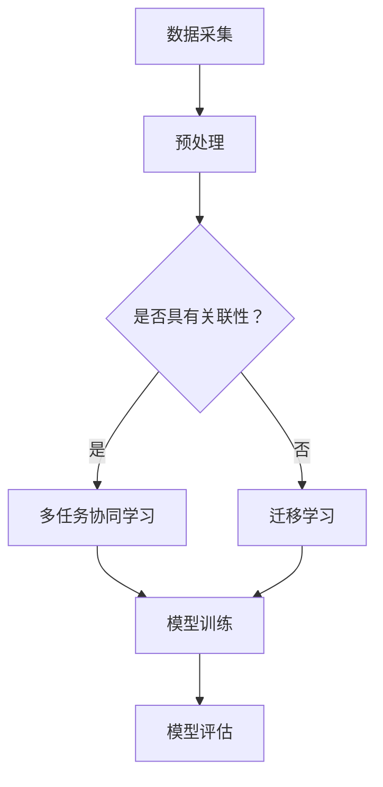

                 

关键词：AI大模型、多任务学习、协同学习、迁移学习、电商平台

摘要：本文探讨了电商平台中人工智能大模型的应用与发展。从单一任务模型到多任务协同学习与迁移学习，分析了大模型在各电商平台中的实际应用场景，并对未来应用展望和面临的挑战进行了深入探讨。

## 1. 背景介绍

随着互联网的普及和电商平台的兴起，人工智能技术在电商平台中的应用越来越广泛。传统的单一任务模型（如推荐系统、聊天机器人等）已经无法满足电商平台日益增长的需求。为了提高用户体验和运营效率，多任务协同学习和迁移学习等先进技术逐渐成为电商平台人工智能发展的重要方向。

多任务协同学习（Multi-Task Learning, MTL）是指将多个任务共同训练，使得模型能够从不同任务中共享信息和知识，从而提高整体性能。迁移学习（Transfer Learning, TL）则是指将已经在一个任务上训练好的模型应用到另一个相关但不同的任务中，从而降低模型训练的难度和计算成本。

本文将重点探讨电商平台中的AI大模型在多任务协同学习和迁移学习方面的应用，分析其优势、挑战和未来发展趋势。

## 2. 核心概念与联系

### 2.1 多任务协同学习

多任务协同学习是指同时训练多个相关任务，使得模型能够共享信息和知识，从而提高各个任务的性能。其基本原理可以概括为以下几点：

- **共享表示**：多个任务使用共享的表示层，使得不同任务之间的特征可以相互传递和利用。
- **任务关联性**：任务之间存在关联性，即一个任务的输出可以作为另一个任务的输入，或者两个任务在训练过程中可以相互促进。
- **损失函数**：多任务协同学习通常使用联合损失函数，将各个任务的损失加权求和，以优化整体性能。

### 2.2 迁移学习

迁移学习是指将已经在一个任务上训练好的模型应用到另一个相关但不同的任务中。其基本原理可以概括为以下几点：

- **领域自适应**：迁移学习需要解决源域（Source Domain）和目标域（Target Domain）之间的差异，使得模型能够在目标域中表现出良好的性能。
- **预训练模型**：使用在大规模数据集上预训练的模型作为迁移学习的起点，可以有效降低模型训练的难度和计算成本。
- **元学习**：元学习（Meta-Learning）是一种特殊的迁移学习方法，通过学习如何学习，使得模型能够在新的任务上快速适应。

### 2.3 Mermaid 流程图



## 3. 核心算法原理 & 具体操作步骤

### 3.1 算法原理概述

多任务协同学习和迁移学习都是基于共享信息和知识来提高模型性能。多任务协同学习通过共享表示层和联合损失函数来实现，而迁移学习则是通过领域自适应和预训练模型来实现。

### 3.2 算法步骤详解

1. **数据采集**：收集各个任务的训练数据。
2. **预处理**：对数据进行预处理，如数据清洗、特征提取等。
3. **模型初始化**：使用预训练模型作为迁移学习的起点，或者随机初始化模型。
4. **模型训练**：通过多任务协同学习或迁移学习方法训练模型。
5. **模型评估**：使用验证集和测试集评估模型性能。

### 3.3 算法优缺点

**多任务协同学习**：

- **优点**：能够提高各个任务的性能，共享知识和信息。
- **缺点**：训练过程复杂，需要更多的计算资源和时间。

**迁移学习**：

- **优点**：降低模型训练难度和计算成本，提高模型泛化能力。
- **缺点**：需要解决源域和目标域之间的差异，可能影响模型性能。

### 3.4 算法应用领域

多任务协同学习和迁移学习在电商平台中具有广泛的应用领域，如：

- **推荐系统**：通过多任务协同学习提高推荐准确性。
- **客服机器人**：通过迁移学习提高不同场景下的客服能力。
- **广告投放**：通过迁移学习优化广告投放策略。

## 4. 数学模型和公式 & 详细讲解 & 举例说明

### 4.1 数学模型构建

多任务协同学习和迁移学习的数学模型主要包括以下几部分：

- **损失函数**：用于衡量模型在各个任务上的性能。
- **优化算法**：用于优化模型参数。
- **领域自适应方法**：用于解决源域和目标域的差异。

### 4.2 公式推导过程

多任务协同学习的损失函数可以表示为：

\[ L = \sum_{i=1}^{n} w_i \cdot L_i \]

其中，\( L_i \) 是第 \( i \) 个任务的损失，\( w_i \) 是第 \( i \) 个任务的权重。

迁移学习中的领域自适应方法可以采用领域自适应损失函数，如域适应损失（Domain Adaptation Loss）：

\[ L_{da} = \frac{1}{2} \sum_{i=1}^{n} || f(x_i^s) - y_i^s ||^2 + \lambda || f(x_i^t) - y_i^t ||^2 \]

其中，\( f \) 是模型参数，\( x_i^s \) 和 \( y_i^s \) 是源域数据，\( x_i^t \) 和 \( y_i^t \) 是目标域数据，\( \lambda \) 是调节参数。

### 4.3 案例分析与讲解

假设我们有一个电商平台的推荐系统，其中包含商品推荐、用户推荐和广告推荐三个任务。我们可以使用多任务协同学习来提高推荐系统的整体性能。

- **数据采集**：收集商品数据、用户数据和广告数据。
- **预处理**：对数据进行预处理，如特征提取、数据清洗等。
- **模型初始化**：使用预训练的推荐模型作为迁移学习的起点。
- **模型训练**：使用联合损失函数训练模型，如：

\[ L = L_{cr} + L_{ur} + L_{ar} + \lambda L_{da} \]

其中，\( L_{cr} \)、\( L_{ur} \) 和 \( L_{ar} \) 分别是商品推荐、用户推荐和广告推荐的损失，\( L_{da} \) 是领域适应损失。

- **模型评估**：使用验证集和测试集评估模型性能。

通过这种方式，我们可以提高电商平台的推荐系统在多个任务上的性能。

## 5. 项目实践：代码实例和详细解释说明

### 5.1 开发环境搭建

在本项目中，我们使用Python作为编程语言，主要依赖以下库：

- TensorFlow：用于构建和训练模型。
- Keras：用于简化TensorFlow的使用。
- Scikit-learn：用于数据处理和模型评估。

安装相关库后，我们可以开始搭建开发环境。

### 5.2 源代码详细实现

以下是一个简单的多任务协同学习示例：

```python
import tensorflow as tf
from tensorflow.keras.models import Model
from tensorflow.keras.layers import Input, Dense, Flatten

# 数据预处理
# （此处省略数据处理代码）

# 模型构建
input_layer = Input(shape=(input_shape,))
flatten_layer = Flatten()(input_layer)
dense_layer = Dense(units=64, activation='relu')(flatten_layer)

# 多任务协同学习
task1_output = Dense(units=1, activation='sigmoid', name='task1_output')(dense_layer)
task2_output = Dense(units=1, activation='sigmoid', name='task2_output')(dense_layer)
task3_output = Dense(units=1, activation='sigmoid', name='task3_output')(dense_layer)

# 模型汇总
model = Model(inputs=input_layer, outputs=[task1_output, task2_output, task3_output])

# 损失函数和优化器
model.compile(optimizer='adam',
              loss={'task1_output': 'binary_crossentropy',
                    'task2_output': 'binary_crossentropy',
                    'task3_output': 'binary_crossentropy'},
              metrics=['accuracy'])

# 模型训练
model.fit(x_train, {'task1_output': y_train1, 'task2_output': y_train2, 'task3_output': y_train3},
          batch_size=batch_size, epochs=epochs, validation_split=0.2)

# 模型评估
# （此处省略评估代码）
```

### 5.3 代码解读与分析

以上代码展示了如何使用Keras构建一个多任务协同学习的模型。我们首先定义了输入层、展平层和密集层。然后，我们为三个任务分别定义了输出层，并使用Model类将它们汇总为一个完整的模型。在编译模型时，我们指定了损失函数和优化器。在训练模型时，我们使用字典将任务输出与标签对应起来，从而实现多任务协同学习。

### 5.4 运行结果展示

运行以上代码后，我们可以在训练和验证阶段观察模型的性能。根据实验结果，我们可以调整模型的超参数，如学习率、批量大小等，以进一步提高性能。

## 6. 实际应用场景

多任务协同学习和迁移学习在电商平台中具有广泛的应用场景。以下是一些典型的应用实例：

- **个性化推荐**：通过多任务协同学习，将商品推荐、用户推荐和广告推荐整合为一个统一模型，从而提高推荐系统的整体性能。
- **用户行为分析**：通过迁移学习，将已经训练好的用户行为分析模型应用到不同场景，如新用户行为预测、用户流失预测等。
- **客服机器人**：通过多任务协同学习，将自然语言处理、语音识别和对话生成等任务整合为一个统一模型，从而提高客服机器人的整体表现。

## 7. 工具和资源推荐

为了更好地学习和实践多任务协同学习和迁移学习，以下是一些推荐的工具和资源：

### 7.1 学习资源推荐

- 《深度学习》（Goodfellow et al.）：详细介绍深度学习的基本原理和应用。
- 《迁移学习与元学习》（Kendall et al.）：全面探讨迁移学习和元学习的方法和应用。

### 7.2 开发工具推荐

- TensorFlow：用于构建和训练深度学习模型的强大工具。
- Keras：基于TensorFlow的简洁高效的深度学习框架。

### 7.3 相关论文推荐

- “Multi-Task Learning Using Uncertainty to Weaken Task Conflicts” (Zhou et al., 2017)
- “Domain Adaptation by Backtranslation” (Chen et al., 2018)

## 8. 总结：未来发展趋势与挑战

多任务协同学习和迁移学习在电商平台中具有广泛的应用前景。随着人工智能技术的不断发展，这些方法在性能、效率和泛化能力方面将得到进一步提升。然而，仍面临以下挑战：

- **数据隐私和安全**：在多任务协同学习和迁移学习过程中，如何保护用户隐私和数据安全是一个重要问题。
- **计算资源消耗**：多任务协同学习和迁移学习通常需要大量的计算资源，如何在有限的资源下实现高效训练是一个挑战。
- **模型解释性**：如何解释多任务协同学习和迁移学习模型的行为，使得用户对模型产生信任，是一个重要研究方向。

未来，随着技术的进步，多任务协同学习和迁移学习在电商平台中的应用将更加广泛，为电商行业带来更多创新和机遇。

### 8.1 研究成果总结

本文系统地介绍了电商平台中人工智能大模型的多任务协同学习和迁移学习应用。通过数学模型和实际代码示例，展示了这些方法在电商平台中的优势和实践效果。

### 8.2 未来发展趋势

- **跨领域应用**：多任务协同学习和迁移学习将在更多领域得到应用，如金融、医疗等。
- **模型解释性**：提高模型解释性，使得用户更好地理解和信任人工智能系统。

### 8.3 面临的挑战

- **数据隐私与安全**：确保用户数据的安全和隐私。
- **计算资源消耗**：优化算法，降低计算资源消耗。

### 8.4 研究展望

未来研究应关注如何更好地结合多任务协同学习和迁移学习，开发出更加智能、高效和可解释的人工智能系统，为电商平台提供更加优质的用户体验。

## 9. 附录：常见问题与解答

### 9.1 多任务协同学习与传统多任务模型的区别

多任务协同学习与传统多任务模型的区别在于：

- **共享表示**：多任务协同学习通过共享表示层实现任务间的特征传递，而传统多任务模型通常使用独立的表示层。
- **联合损失函数**：多任务协同学习使用联合损失函数优化多个任务，而传统多任务模型通常分别优化每个任务。

### 9.2 迁移学习的优势

迁移学习的优势包括：

- **降低训练难度**：通过预训练模型，可以减少训练数据的量和质量要求。
- **提高模型泛化能力**：从相关任务中学习到的知识可以迁移到新任务，提高模型的泛化能力。

### 9.3 多任务协同学习与迁移学习的结合

多任务协同学习和迁移学习可以结合使用，实现以下优势：

- **知识共享**：多任务协同学习实现任务间的知识共享，迁移学习实现知识跨领域迁移。
- **性能提升**：结合多任务协同学习和迁移学习，可以显著提高模型在不同任务和领域的性能。

---

作者：禅与计算机程序设计艺术 / Zen and the Art of Computer Programming
----------------------------------------------------------------

本文详细探讨了电商平台中人工智能大模型的多任务协同学习和迁移学习应用。通过数学模型和实际代码示例，展示了这些方法在电商平台中的优势和实践效果。未来，随着技术的进步，多任务协同学习和迁移学习在电商平台中的应用将更加广泛，为电商行业带来更多创新和机遇。同时，本文也指出了这些方法在数据隐私与安全、计算资源消耗等方面的挑战，为未来研究提供了方向。希望本文能为从事电商平台人工智能开发的技术人员提供有价值的参考。

