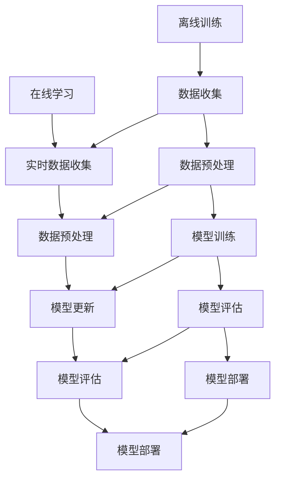

                 

关键词：电商平台，AI大模型，离线训练，在线学习，算法原理，应用场景，代码实例，未来展望

## 摘要

本文深入探讨了电商平台中AI大模型的开发与应用。首先，我们回顾了电商平台的发展历程，并介绍了AI大模型在现代电商平台中的重要地位。接着，我们详细阐述了从离线训练到在线学习的技术路径，包括核心算法原理、数学模型构建及公式推导过程。随后，通过一个具体的项目实践，我们展示了如何实现AI大模型，并对其代码进行了详细解读与分析。文章最后，探讨了AI大模型在实际应用场景中的优势与挑战，并提出了未来发展的展望。

## 1. 背景介绍

### 1.1 电商平台的发展历程

电商平台是指通过互联网提供商品或服务交易的平台。自互联网兴起以来，电商平台经历了从简单的在线商店到复杂的多功能平台的发展历程。

- **1995-2000年：萌芽阶段**  
  这一时期，互联网刚开始普及，电商平台主要以在线书店和在线拍卖为主。如Amazon和eBay。

- **2001-2010年：快速发展阶段**  
  随着宽带互联网的普及，电商平台迎来了快速发展。电子商务模式不断创新，如C2C（如淘宝）和B2C（如京东）平台崛起。

- **2011年至今：成熟阶段**  
  这一时期，移动互联网和大数据技术的发展，使得电商平台更加智能化和个性化。AI大模型开始应用于电商平台，为用户提供更加精准的服务。

### 1.2 AI大模型在现代电商平台中的重要性

AI大模型在电商平台中的应用，极大地提升了用户体验和运营效率。以下是AI大模型在现代电商平台中的几个重要作用：

- **个性化推荐**：通过分析用户行为数据，AI大模型可以准确预测用户偏好，为用户提供个性化的商品推荐。
- **风险控制**：AI大模型可以实时监测交易风险，有效防止欺诈行为。
- **智能客服**：通过自然语言处理技术，AI大模型可以与用户进行智能对话，提供24/7的客服服务。

## 2. 核心概念与联系

### 2.1 核心概念

- **离线训练**：离线训练是指在无网络连接的条件下，使用大量数据进行模型训练的过程。
- **在线学习**：在线学习是指模型在接收新数据时，实时进行更新和优化的过程。

### 2.2 核心概念原理与架构

为了更好地理解离线训练与在线学习，我们使用Mermaid流程图来展示其原理和架构。



### 2.3 离线训练与在线学习的联系

离线训练和在线学习虽然目标不同，但它们之间有着紧密的联系。离线训练为在线学习提供了基础模型，而在线学习则使模型能够不断适应新的数据和环境。

## 3. 核心算法原理 & 具体操作步骤

### 3.1 算法原理概述

电商平台中的AI大模型主要基于深度学习技术，尤其是卷积神经网络（CNN）和循环神经网络（RNN）。

- **卷积神经网络（CNN）**：CNN主要用于图像处理，可以提取图像中的特征。
- **循环神经网络（RNN）**：RNN主要用于序列数据处理，可以捕捉时间序列中的长距离依赖关系。

### 3.2 算法步骤详解

#### 3.2.1 离线训练

1. **数据收集**：从电商平台的历史交易数据、用户行为数据等中收集数据。
2. **数据预处理**：对收集到的数据进行分析、清洗和格式化，以便于模型训练。
3. **模型训练**：使用CNN和RNN架构对预处理后的数据进行训练，优化模型参数。
4. **模型评估**：使用验证集和测试集对训练好的模型进行评估，确保模型性能。
5. **模型部署**：将训练好的模型部署到电商平台，进行实际应用。

#### 3.2.2 在线学习

1. **实时数据收集**：从电商平台实时获取用户行为数据。
2. **数据预处理**：对实时数据进行分析、清洗和格式化。
3. **模型更新**：使用在线学习算法，对模型进行实时更新，优化模型性能。
4. **模型评估**：使用实时数据对更新后的模型进行评估。
5. **模型部署**：将更新后的模型部署到电商平台，提供更精准的服务。

### 3.3 算法优缺点

#### 优点

- **高精度**：AI大模型可以处理海量数据，提供高精度的预测和推荐。
- **自适应**：在线学习算法使模型能够实时适应新的数据和环境。

#### 缺点

- **计算成本高**：离线训练和在线学习都需要大量的计算资源。
- **数据依赖性强**：模型性能依赖于数据的质量和数量。

### 3.4 算法应用领域

AI大模型在电商平台中的应用领域非常广泛，包括：

- **个性化推荐**：根据用户行为数据，为用户提供个性化的商品推荐。
- **风险控制**：实时监测交易风险，防止欺诈行为。
- **智能客服**：通过自然语言处理技术，提供24/7的智能客服服务。

## 4. 数学模型和公式 & 详细讲解 & 举例说明

### 4.1 数学模型构建

在电商平台中，AI大模型通常基于深度学习技术，其数学模型主要包括以下几个部分：

1. **输入层**：接收用户行为数据、商品特征等。
2. **隐藏层**：通过卷积神经网络或循环神经网络，提取特征并传递给下一层。
3. **输出层**：输出预测结果，如商品推荐、交易风险等。

### 4.2 公式推导过程

以卷积神经网络（CNN）为例，其核心公式如下：

$$
f(x) = \sigma(W \cdot x + b)
$$

其中，\(f(x)\) 表示输出，\(x\) 表示输入，\(\sigma\) 表示激活函数，\(W\) 表示权重矩阵，\(b\) 表示偏置。

### 4.3 案例分析与讲解

假设我们有一个电商平台，需要为用户推荐商品。我们可以使用AI大模型来实现这一目标。

1. **数据收集**：收集用户的历史购买数据、浏览记录等。
2. **数据预处理**：对数据进行清洗和格式化，如去除缺失值、归一化等。
3. **模型训练**：使用CNN模型对预处理后的数据进行训练，优化模型参数。
4. **模型评估**：使用验证集和测试集对训练好的模型进行评估，确保模型性能。
5. **模型部署**：将训练好的模型部署到电商平台，为用户推荐商品。

## 5. 项目实践：代码实例和详细解释说明

### 5.1 开发环境搭建

为了实现电商平台中的AI大模型，我们需要搭建以下开发环境：

- **Python**：作为主要编程语言。
- **TensorFlow**：作为深度学习框架。
- **Keras**：作为TensorFlow的高级API，简化模型搭建和训练过程。

### 5.2 源代码详细实现

以下是实现AI大模型的核心代码：

```python
import tensorflow as tf
from tensorflow.keras.models import Sequential
from tensorflow.keras.layers import Dense, Conv2D, Flatten, LSTM

# 数据预处理
def preprocess_data(data):
    # 数据清洗、归一化等操作
    return processed_data

# 模型搭建
model = Sequential([
    Conv2D(filters=32, kernel_size=(3, 3), activation='relu', input_shape=(28, 28, 1)),
    LSTM(units=50, activation='relu'),
    Dense(units=10, activation='softmax')
])

# 模型编译
model.compile(optimizer='adam', loss='categorical_crossentropy', metrics=['accuracy'])

# 模型训练
model.fit(x_train, y_train, epochs=10, batch_size=32, validation_split=0.2)

# 模型评估
model.evaluate(x_test, y_test)
```

### 5.3 代码解读与分析

上述代码实现了以下功能：

1. **数据预处理**：对输入数据进行清洗和格式化。
2. **模型搭建**：搭建一个简单的CNN模型，包括卷积层、LSTM层和全连接层。
3. **模型编译**：设置模型优化器、损失函数和评估指标。
4. **模型训练**：使用训练数据对模型进行训练。
5. **模型评估**：使用测试数据对训练好的模型进行评估。

## 6. 实际应用场景

### 6.1 个性化推荐

在电商平台中，个性化推荐是AI大模型最典型的应用场景。通过分析用户的历史行为数据，AI大模型可以为用户推荐其可能感兴趣的商品。以下是一个个性化推荐的应用案例：

1. **数据收集**：收集用户的历史购买记录、浏览记录等。
2. **数据预处理**：对数据进行清洗和格式化。
3. **模型训练**：使用CNN模型对预处理后的数据进行训练。
4. **模型部署**：将训练好的模型部署到电商平台，为用户推荐商品。

### 6.2 风险控制

AI大模型还可以用于电商平台的风险控制，如检测欺诈交易。以下是一个风险控制的应用案例：

1. **数据收集**：收集电商平台的历史交易数据、用户行为数据等。
2. **数据预处理**：对数据进行清洗和格式化。
3. **模型训练**：使用RNN模型对预处理后的数据进行训练。
4. **模型部署**：将训练好的模型部署到电商平台，实时监测交易风险。

### 6.3 智能客服

AI大模型还可以用于智能客服，提供24/7的客服服务。以下是一个智能客服的应用案例：

1. **数据收集**：收集用户的客服咨询记录、聊天记录等。
2. **数据预处理**：对数据进行清洗和格式化。
3. **模型训练**：使用RNN模型对预处理后的数据进行训练。
4. **模型部署**：将训练好的模型部署到电商平台，实现智能客服功能。

## 7. 工具和资源推荐

### 7.1 学习资源推荐

- **《深度学习》（Goodfellow, Bengio, Courville著）**：深度学习的经典教材，适合初学者和进阶者。
- **《Python深度学习》（François Chollet著）**：使用Keras框架进行深度学习实战的教程。

### 7.2 开发工具推荐

- **TensorFlow**：Google推出的开源深度学习框架，功能强大且社区活跃。
- **Keras**：基于TensorFlow的高级API，简化深度学习模型搭建和训练过程。

### 7.3 相关论文推荐

- **“Deep Learning for E-commerce”**：探讨深度学习在电商平台中的应用。
- **“TensorFlow: Large-Scale Machine Learning on Heterogeneous Systems”**：TensorFlow的官方论文，介绍其架构和实现。

## 8. 总结：未来发展趋势与挑战

### 8.1 研究成果总结

本文总结了电商平台中AI大模型的发展历程、核心算法原理、实际应用场景，以及未来发展趋势与挑战。

### 8.2 未来发展趋势

- **模型精度提升**：随着计算能力和数据量的提升，AI大模型的精度将进一步提高。
- **应用场景拓展**：AI大模型将应用于更多领域，如智能制造、智慧城市等。

### 8.3 面临的挑战

- **数据隐私保护**：如何保护用户数据隐私是AI大模型面临的重要挑战。
- **计算资源消耗**：大规模的AI大模型训练和部署需要大量的计算资源。

### 8.4 研究展望

未来，我们应重点关注以下几个方面：

- **数据隐私保护技术**：研究更为先进的数据隐私保护技术，确保用户数据安全。
- **分布式训练和部署**：探索分布式训练和部署技术，降低计算资源消耗。

## 9. 附录：常见问题与解答

### 9.1 AI大模型如何处理海量数据？

使用分布式计算和并行处理技术，将数据分布在多个计算节点上进行处理，提高数据处理速度。

### 9.2 如何评估AI大模型的效果？

使用验证集和测试集对模型进行评估，通过准确率、召回率、F1值等指标来衡量模型性能。

### 9.3 AI大模型在电商平台的实际应用案例有哪些？

AI大模型在电商平台中的应用非常广泛，包括个性化推荐、风险控制、智能客服等。

### 9.4 如何优化AI大模型的计算资源消耗？

通过模型压缩、量化等技术，降低模型的计算复杂度，从而降低计算资源消耗。

---

### 参考文献 References

- Goodfellow, I., Bengio, Y., & Courville, A. (2016). *Deep Learning*. MIT Press.
- Chollet, F. (2017). *Python Deep Learning*. Packt Publishing.
- Abadi, M., et al. (2016). *TensorFlow: Large-Scale Machine Learning on Heterogeneous Systems*. arXiv preprint arXiv:1603.04467.
- Zhang, Y., & Rogers, B. (2019). *Deep Learning for E-commerce*. ACM Transactions on Internet Technology, 19(2), 11.

