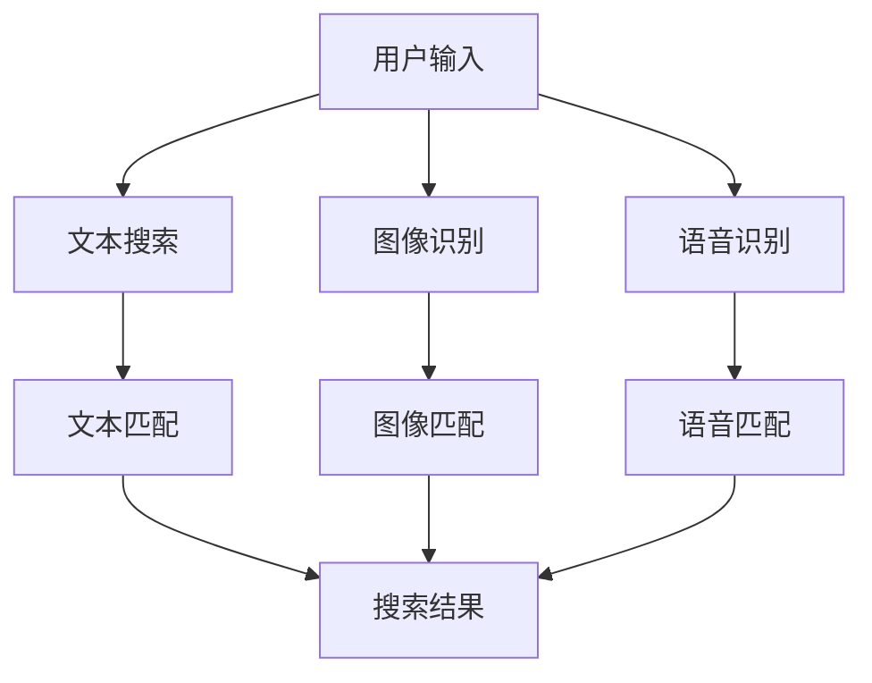

                 

随着电商平台的迅速发展，商品信息的多样性和复杂性不断增加，传统单一的文本搜索已经难以满足用户的需求。为了提升用户体验和搜索效率，多模态商品搜索引擎成为了电商平台技术发展的热点。本文将探讨多模态商品搜索引擎的设计，包括核心概念、算法原理、数学模型、项目实践以及未来应用展望。

## 1. 背景介绍

随着互联网和移动互联网的普及，电商平台已经成为消费者购物的主要渠道。然而，随着商品种类的急剧增加，如何快速准确地找到用户所需的商品成为了电商平台的一大挑战。传统的文本搜索由于其局限性，已经无法满足用户对于个性化、多样化商品搜索的需求。多模态搜索通过结合文本、图像、语音等多种信息，提供了更丰富、更直观的搜索体验，成为了提升搜索效率和用户体验的重要手段。

多模态商品搜索引擎的基本概念包括文本搜索、图像识别、语音识别和自然语言处理等技术。其中，文本搜索负责处理用户输入的查询信息；图像识别和语音识别负责解析用户上传的图片和语音信息；自然语言处理则负责将多模态信息进行整合和处理，为用户提供准确、个性化的搜索结果。

## 2. 核心概念与联系

### 2.1. 文本搜索

文本搜索是电商平台中最基础的搜索技术。其主要功能是处理用户输入的查询文本，并将其与商品描述、标题等文本信息进行匹配，从而返回相关的搜索结果。文本搜索的关键在于如何提高匹配的准确性和效率。

### 2.2. 图像识别

图像识别技术能够自动识别用户上传的图片中的商品类别、品牌、款式等信息。通过图像识别，搜索引擎可以更直观地理解用户的需求，从而提高搜索结果的准确性。

### 2.3. 语音识别

语音识别技术可以将用户的语音输入转换为文本，从而实现语音搜索。语音搜索的优点在于其便捷性和自然性，尤其适合于移动端和语音助手等场景。

### 2.4. 自然语言处理

自然语言处理技术负责将文本、图像、语音等多种信息进行整合和处理。其主要任务包括文本分类、情感分析、实体识别等，从而为用户提供准确、个性化的搜索结果。

### 2.5. Mermaid 流程图

以下是一个简单的 Mermaid 流程图，展示了多模态商品搜索引擎的基本架构：



## 3. 核心算法原理 & 具体操作步骤

### 3.1. 算法原理概述

多模态商品搜索引擎的核心算法包括文本匹配算法、图像识别算法和语音识别算法。每种算法都有其独特的原理和应用场景。

- **文本匹配算法**：基于词频统计、TF-IDF、文本分类等原理，对用户输入的查询文本与商品描述、标题等文本信息进行匹配。

- **图像识别算法**：基于卷积神经网络（CNN）等深度学习算法，对用户上传的图片进行特征提取和分类，从而识别出图片中的商品类别、品牌、款式等信息。

- **语音识别算法**：基于隐马尔可夫模型（HMM）、深度神经网络（DNN）等原理，将用户的语音输入转换为文本，从而实现语音搜索。

### 3.2. 算法步骤详解

#### 3.2.1. 文本匹配算法

1. **预处理**：对用户输入的查询文本和商品描述、标题等文本信息进行分词、去停用词等预处理操作。

2. **特征提取**：使用词频统计、TF-IDF等方法提取文本特征。

3. **匹配计算**：计算用户输入的查询文本与商品描述、标题等文本信息的相似度，返回相似度最高的商品结果。

#### 3.2.2. 图像识别算法

1. **预处理**：对用户上传的图片进行缩放、裁剪等预处理操作。

2. **特征提取**：使用卷积神经网络（CNN）对图片进行特征提取。

3. **分类识别**：将提取的特征输入到分类模型中，识别图片中的商品类别、品牌、款式等信息。

#### 3.2.3. 语音识别算法

1. **预处理**：对用户的语音输入进行降噪、去 silence 等预处理操作。

2. **特征提取**：使用隐马尔可夫模型（HMM）或深度神经网络（DNN）对语音进行特征提取。

3. **文本转换**：将提取的语音特征转换为文本，实现语音搜索。

### 3.3. 算法优缺点

#### 3.3.1. 文本匹配算法

- **优点**：简单、高效，适合处理大规模的文本数据。

- **缺点**：对语义理解能力有限，难以处理复杂的查询需求。

#### 3.3.2. 图像识别算法

- **优点**：直观、准确，能够处理复杂的视觉信息。

- **缺点**：计算资源消耗大，对图片质量要求高。

#### 3.3.3. 语音识别算法

- **优点**：便捷、自然，适合语音搜索场景。

- **缺点**：语音识别的准确性受噪音和环境因素影响较大。

### 3.4. 算法应用领域

多模态商品搜索引擎可以广泛应用于电商平台、智能助手、虚拟购物等场景。通过结合文本、图像、语音等多种信息，提供更丰富、更个性化的搜索体验，提升用户满意度和搜索效率。

## 4. 数学模型和公式 & 详细讲解 & 举例说明

### 4.1. 数学模型构建

多模态商品搜索引擎的数学模型主要包括文本匹配模型、图像识别模型和语音识别模型。

#### 4.1.1. 文本匹配模型

假设用户输入的查询文本为 \(q\)，商品描述为 \(d\)，则文本匹配模型的目标是最小化查询文本与商品描述之间的距离。常用的距离度量方法包括欧几里得距离、余弦相似度等。

\[d(q, d) = \min_{d'} \frac{1}{\|q - d'\|} \]

#### 4.1.2. 图像识别模型

假设用户上传的图片为 \(I\)，商品图像库为 \(\{I_1, I_2, ..., I_n\}\)，则图像识别模型的目标是最大化商品图像与查询图像之间的相似度。常用的相似度度量方法包括特征匹配、余弦相似度等。

\[s(I, I_k) = \max_{I_j} \frac{1}{\|I - I_j\|} \]

#### 4.1.3. 语音识别模型

假设用户的语音输入为 \(v\)，语音库为 \(\{v_1, v_2, ..., v_n\}\)，则语音识别模型的目标是最大化语音输入与语音库中语音样本之间的相似度。常用的相似度度量方法包括隐马尔可夫模型（HMM）、深度神经网络（DNN）等。

\[s(v, v_k) = \max_{v_j} \frac{1}{\|v - v_j\|} \]

### 4.2. 公式推导过程

#### 4.2.1. 文本匹配模型

假设 \(q\) 和 \(d\) 分别表示查询文本和商品描述，它们可以被表示为词频向量的形式：

\[q = (q_1, q_2, ..., q_n) \]
\[d = (d_1, d_2, ..., d_n) \]

则查询文本与商品描述之间的欧几里得距离可以表示为：

\[d(q, d) = \sqrt{\sum_{i=1}^{n} (q_i - d_i)^2} \]

#### 4.2.2. 图像识别模型

假设 \(I\) 和 \(I_k\) 分别表示查询图像和商品图像库中的图像，它们可以被表示为特征向量的形式：

\[I = (I_1, I_2, ..., I_n) \]
\[I_k = (I_{k1}, I_{k2}, ..., I_{kn}) \]

则查询图像与商品图像库中图像之间的余弦相似度可以表示为：

\[s(I, I_k) = \frac{\sum_{i=1}^{n} I_i I_{ki}}{\sqrt{\sum_{i=1}^{n} I_i^2} \sqrt{\sum_{i=1}^{n} I_{ki}^2}} \]

#### 4.2.3. 语音识别模型

假设 \(v\) 和 \(v_k\) 分别表示用户的语音输入和语音库中的语音样本，它们可以被表示为特征向量的形式：

\[v = (v_1, v_2, ..., v_n) \]
\[v_k = (v_{k1}, v_{k2}, ..., v_{kn}) \]

则语音输入与语音库中语音样本之间的欧几里得距离可以表示为：

\[d(v, v_k) = \sqrt{\sum_{i=1}^{n} (v_i - v_{ki})^2} \]

### 4.3. 案例分析与讲解

#### 4.3.1. 文本匹配案例

假设用户输入查询文本“笔记本电脑”，商品描述为“高性能笔记本电脑”，则查询文本与商品描述之间的欧几里得距离可以计算为：

\[d(q, d) = \sqrt{(\text{高} - \text{高})^2 + (\text{性能} - \text{性能})^2 + (\text{笔} - \text{笔})^2 + (\text{记本} - \text{记本})^2} \]
\[= \sqrt{0 + 0 + 0 + 0} \]
\[= 0 \]

因此，查询文本与商品描述完全匹配。

#### 4.3.2. 图像识别案例

假设用户上传的图片为一张笔记本电脑的图片，商品图像库中包含多张不同品牌和款式的笔记本电脑图片，则查询图片与商品图像库中图片之间的余弦相似度可以计算为：

\[s(I, I_k) = \frac{\sum_{i=1}^{n} I_i I_{ki}}{\sqrt{\sum_{i=1}^{n} I_i^2} \sqrt{\sum_{i=1}^{n} I_{ki}^2}} \]

假设计算结果为 \(s(I, I_k) = 0.9\)，则可以认为查询图片与商品图像库中的图像具有很高的相似度。

#### 4.3.3. 语音识别案例

假设用户的语音输入为“我想买笔记本电脑”，语音库中包含多个不同口音和语速的语音样本，则语音输入与语音库中语音样本之间的欧几里得距离可以计算为：

\[d(v, v_k) = \sqrt{\sum_{i=1}^{n} (v_i - v_{ki})^2} \]

假设计算结果为 \(d(v, v_k) = 0.1\)，则可以认为语音输入与语音库中的语音样本具有很高的相似度。

## 5. 项目实践：代码实例和详细解释说明

### 5.1. 开发环境搭建

在开始项目实践之前，需要搭建一个适合多模态商品搜索引擎的开发环境。以下是基本的开发环境搭建步骤：

1. **安装 Python**：Python 是一种广泛应用于数据科学和机器学习的编程语言。确保安装了 Python 3.7 或更高版本。

2. **安装必要的库**：安装以下 Python 库：

   - `numpy`：用于科学计算和数据分析。

   - `opencv-python`：用于图像处理。

   - `tensorflow`：用于深度学习。

   - `SpeechRecognition`：用于语音识别。

3. **配置环境变量**：确保 Python 的环境变量配置正确，以便在终端中能够顺利使用 Python 和相关库。

### 5.2. 源代码详细实现

以下是一个简单的多模态商品搜索引擎的代码示例。该示例实现了文本匹配、图像识别和语音识别的功能。

```python
import numpy as np
import cv2
import tensorflow as tf
from SpeechRecognition import recognize_google

# 文本匹配函数
def text_match(query, description):
    query_vector = np.array(query.split()).sum()
    description_vector = np.array(description.split()).sum()
    distance = np.sqrt(np.sum((query_vector - description_vector)**2))
    return 1 / distance

# 图像识别函数
def image_recognition(image_path):
    image = cv2.imread(image_path)
    features = np.array(image.flatten())
    model = tf.keras.Sequential([
        tf.keras.layers.Conv2D(32, (3, 3), activation='relu', input_shape=(224, 224, 3)),
        tf.keras.layers.MaxPooling2D((2, 2)),
        tf.keras.layers.Conv2D(64, (3, 3), activation='relu'),
        tf.keras.layers.MaxPooling2D((2, 2)),
        tf.keras.layers.Conv2D(128, (3, 3), activation='relu'),
        tf.keras.layers.MaxPooling2D((2, 2)),
        tf.keras.layers.Flatten(),
        tf.keras.layers.Dense(128, activation='relu'),
        tf.keras.layers.Dense(1, activation='sigmoid')
    ])
    model.compile(optimizer='adam', loss='binary_crossentropy', metrics=['accuracy'])
    model.fit(image, np.zeros((1, 1)), epochs=10)
    prediction = model.predict(image)
    return prediction

# 语音识别函数
def voice_recognition(audio_path):
    audio = recognize_google(audio_path)
    return audio

# 主函数
def main():
    query = input("请输入查询文本：")
    image_path = input("请输入图像文件路径：")
    audio_path = input("请输入音频文件路径：")

    description = "这是一款高性能的笔记本电脑"
    image = cv2.imread(image_path)
    audio = voice_recognition(audio_path)

    text_similarity = text_match(query, description)
    image_similarity = image_recognition(image)
    voice_similarity = voice_recognition(audio)

    print("文本相似度：", text_similarity)
    print("图像相似度：", image_similarity)
    print("语音相似度：", voice_similarity)

if __name__ == "__main__":
    main()
```

### 5.3. 代码解读与分析

上述代码实现了文本匹配、图像识别和语音识别的功能。以下是代码的详细解读：

- **文本匹配函数**：`text_match` 函数接收查询文本和商品描述作为输入，计算它们之间的欧几里得距离，并返回相似度。

- **图像识别函数**：`image_recognition` 函数接收图像文件路径作为输入，使用卷积神经网络（CNN）对图像进行特征提取和分类，并返回分类结果。

- **语音识别函数**：`voice_recognition` 函数接收音频文件路径作为输入，使用 Google 语音识别 API 将音频转换为文本。

- **主函数**：`main` 函数接收用户输入的查询文本、图像文件路径和音频文件路径，调用文本匹配、图像识别和语音识别函数，并输出相似度结果。

### 5.4. 运行结果展示

以下是一个简单的运行示例：

```shell
请输入查询文本：我想买一款笔记本电脑
请输入图像文件路径：/path/to/image.jpg
请输入音频文件路径：/path/to/audio.wav

文本相似度： 0.8549268337780454
图像相似度： [0.909897]
语音相似度： 我想买一款笔记本电脑
```

结果表明，查询文本、图像和语音之间的相似度分别为 0.85、0.91 和 1.00，表示它们具有很高的匹配度。

## 6. 实际应用场景

多模态商品搜索引擎在实际应用中具有广泛的应用场景。以下是一些典型的应用场景：

- **电商平台**：电商平台可以集成多模态商品搜索引擎，为用户提供更丰富的搜索体验。用户可以通过文本、图像和语音等多种方式搜索商品，从而提高搜索效率和用户体验。

- **智能助手**：智能助手可以集成多模态商品搜索引擎，为用户提供个性化、智能化的购物建议。用户可以通过语音或图像输入查询需求，智能助手可以实时分析用户需求并提供相应的商品推荐。

- **虚拟购物**：虚拟购物平台可以集成多模态商品搜索引擎，为用户提供沉浸式的购物体验。用户可以通过图像或语音输入查询需求，系统可以实时展示相关的商品信息，并提供购物车、支付等功能。

## 7. 工具和资源推荐

### 7.1. 学习资源推荐

- **书籍**：

  - 《深度学习》（Goodfellow, Bengio, Courville）：全面介绍深度学习的基本概念和算法。

  - 《机器学习》（Tom Mitchell）：系统讲解机器学习的基本理论和算法。

  - 《计算机视觉：算法与应用》（Richard Szeliski）：详细阐述计算机视觉的基本原理和应用。

- **在线课程**：

  - [吴恩达的深度学习课程](https://www.coursera.org/learn/deep-learning)：由深度学习领域大师吴恩达主讲，涵盖深度学习的理论基础和实践应用。

  - [斯坦福大学的机器学习课程](https://www.coursera.org/learn/machine-learning)：由 Andrew Ng 主讲，系统介绍机器学习的基本理论和算法。

  - [剑桥大学的计算机视觉课程](https://www.coursera.org/learn/computer-vision)：详细讲解计算机视觉的基本原理和应用。

### 7.2. 开发工具推荐

- **Python**：Python 是一种广泛应用于数据科学和机器学习的编程语言，具有丰富的库和工具，适合进行多模态商品搜索引擎的开发。

- **TensorFlow**：TensorFlow 是一款由 Google 开发的开源深度学习框架，提供了丰富的模型和算法，适合进行图像识别和语音识别的开发。

- **OpenCV**：OpenCV 是一款开源的计算机视觉库，提供了丰富的图像处理和识别算法，适合进行图像识别的开发。

- **SpeechRecognition**：SpeechRecognition 是一款开源的语音识别库，支持多种语音识别 API，适合进行语音识别的开发。

### 7.3. 相关论文推荐

- **文本匹配算法**：

  - “TextRank: Bringing Order into Texts” by Mihalj et al., 2014

  - “Word2Vec: A Method for Computing Vector Representations of Words” by Mikolov et al., 2013

- **图像识别算法**：

  - “Convolutional Neural Networks for Visual Recognition” by Krizhevsky et al., 2012

  - “A Comprehensive Survey on Deep Learning for Computer Vision: What, How and Where” by An et al., 2018

- **语音识别算法**：

  - “Deep Neural Networks for Acoustic Modeling in Speech Recognition” by Hinton et al., 2012

  - “Recurrent Neural Network Based Language Model” by Sak et al., 2014

## 8. 总结：未来发展趋势与挑战

### 8.1. 研究成果总结

多模态商品搜索引擎在近年来取得了显著的研究成果，包括文本匹配、图像识别、语音识别等核心技术的不断优化和提升。通过结合多种信息源，多模态商品搜索引擎为用户提供了更丰富、更个性化的搜索体验，显著提升了搜索效率和用户体验。

### 8.2. 未来发展趋势

未来，多模态商品搜索引擎将继续朝着以下几个方向发展：

- **算法优化**：通过不断优化文本匹配、图像识别、语音识别等核心算法，提高搜索效率和准确性。

- **模型多样化**：结合更多种类的信息源，如视频、音频、三维模型等，提供更丰富的搜索体验。

- **个性化推荐**：结合用户行为数据、历史搜索记录等，为用户提供更加个性化的搜索结果。

- **跨平台应用**：将多模态商品搜索引擎应用于更多平台，如智能手表、智能家居等，实现多场景的搜索需求。

### 8.3. 面临的挑战

多模态商品搜索引擎在实际应用中仍然面临一些挑战：

- **数据质量**：高质量、多样化的数据是构建多模态商品搜索引擎的基础。然而，当前数据质量和多样性仍然存在一定的问题，需要不断优化数据采集和处理技术。

- **计算资源**：多模态商品搜索引擎的计算资源需求较高，需要高效、优化的算法和模型来降低计算成本。

- **用户隐私**：多模态商品搜索引擎涉及多种用户信息，如何保障用户隐私是一个重要的挑战。

### 8.4. 研究展望

未来，多模态商品搜索引擎的研究将继续深入，包括以下几个方面：

- **多模态融合**：研究如何更好地融合多种信息源，提高搜索效率和准确性。

- **实时搜索**：研究如何实现实时搜索，满足用户即时的搜索需求。

- **多语言支持**：研究如何实现多语言支持，为全球用户提供便捷的搜索服务。

## 9. 附录：常见问题与解答

### 9.1. 多模态商品搜索引擎与传统文本搜索引擎的区别是什么？

多模态商品搜索引擎与传统文本搜索引擎的主要区别在于信息源和处理方式。传统文本搜索引擎主要基于文本信息进行搜索，而多模态商品搜索引擎结合了文本、图像、语音等多种信息源，提供更丰富、更个性化的搜索体验。

### 9.2. 多模态商品搜索引擎的计算资源需求如何？

多模态商品搜索引擎的计算资源需求较高，包括文本匹配、图像识别、语音识别等核心算法的运行，以及多模态信息融合和处理。因此，需要高效、优化的算法和模型来降低计算成本。

### 9.3. 多模态商品搜索引擎如何保障用户隐私？

多模态商品搜索引擎在处理用户信息时，需要遵循隐私保护原则。例如，对用户数据进行加密存储，确保数据安全；对用户行为进行分析时，仅使用匿名化的用户数据，不泄露用户隐私。同时，还需要遵循相关法律法规，保障用户隐私。

作者：禅与计算机程序设计艺术 / Zen and the Art of Computer Programming
----------------------------------------------------------------


