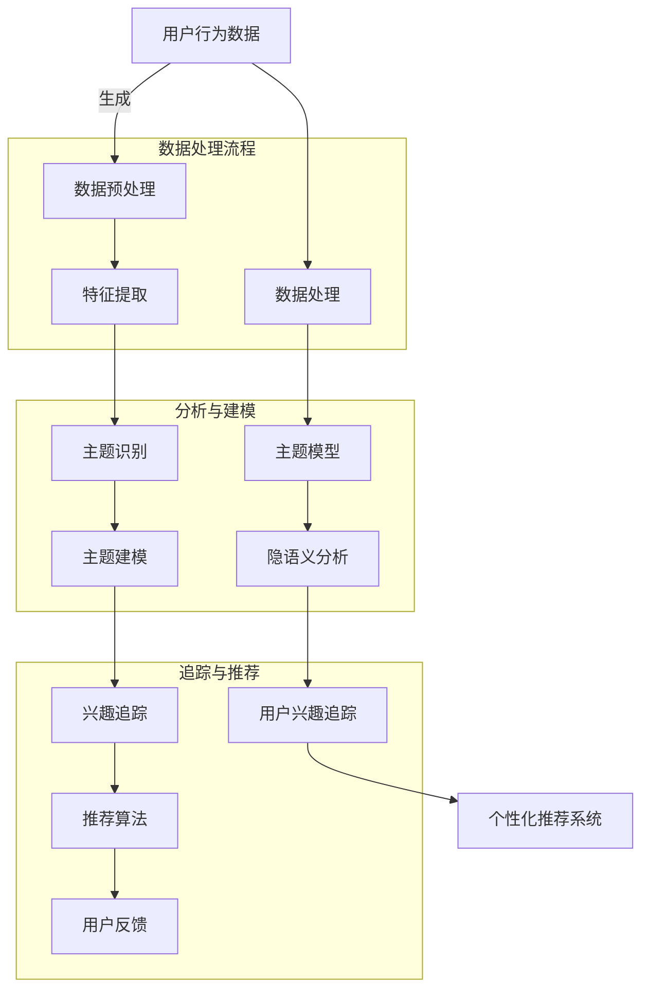

                 

在数字化时代，电商平台成为了连接消费者与商家的桥梁。然而，随着用户数量的爆炸性增长，如何精准地捕捉和理解用户的兴趣成为了一项至关重要的任务。本文将深入探讨电商平台中的用户兴趣主题演化追踪模型，旨在为电商平台提供一种有效的用户行为分析和个性化推荐手段。

## 文章关键词

- 电商平台
- 用户兴趣
- 主题演化
- 追踪模型
- 个性化推荐
- 行为分析

## 文章摘要

本文首先介绍了电商平台中用户兴趣主题演化追踪模型的背景和重要性。随后，通过阐述核心概念和架构，揭示了该模型的基本原理和工作机制。接着，本文详细介绍了核心算法的原理、操作步骤及其优缺点和应用领域。随后，通过数学模型和公式的推导，解释了算法的实现细节，并通过具体案例进行了说明。文章的后半部分，通过代码实例展示了模型的实现过程，并分析了运行结果。最后，文章讨论了模型在实际应用场景中的表现，展望了未来的发展趋势和挑战，并推荐了相关的学习资源和开发工具。

<|assistant|>### 1. 背景介绍

电商平台的发展，从最初的商品展示和交易，逐步演化为一个复杂的信息生态系统。在这个系统中，用户不仅是消费者，更是信息的创造者和传播者。用户的兴趣和需求，成为了电商平台需要精准捕捉和满足的核心要素。然而，随着用户行为数据量的剧增，如何从海量数据中提取有价值的信息，如何理解用户兴趣的动态变化，成为了电商平台面临的一大挑战。

用户兴趣主题演化追踪模型，正是为了应对这一挑战而提出的一种解决方案。它基于机器学习和数据挖掘技术，通过分析用户的浏览、搜索、购买等行为数据，识别用户兴趣的主题，并追踪这些主题随时间的演化过程。这种模型不仅能够帮助电商平台实现精准的用户行为分析，还能为个性化推荐系统提供有力支持，提升用户的购物体验。

此外，用户兴趣主题演化追踪模型在提升电商平台运营效率、降低营销成本、提高用户留存率等方面具有显著作用。通过实时追踪用户兴趣的动态变化，电商平台可以及时调整营销策略，优化商品推荐，从而提高用户满意度和忠诚度。

总的来说，用户兴趣主题演化追踪模型不仅为电商平台提供了一个强大的数据分析工具，也为个性化推荐和智能营销提供了理论和技术支持。在数字化转型的浪潮中，这一模型的应用前景十分广阔，有望成为电商平台提升竞争力的重要手段。

### 2. 核心概念与联系

在深入探讨用户兴趣主题演化追踪模型之前，我们需要首先了解几个核心概念，包括用户行为数据、主题模型、隐语义分析等，并展示这些概念之间的联系。以下是相关的Mermaid流程图，用以阐述各概念及其相互关系。



**用户行为数据**：用户在电商平台上的各种行为，如浏览、搜索、购买、评论等，都会产生相应的数据。这些数据是构建用户兴趣主题的基础。

**数据处理**：通过对用户行为数据进行预处理、特征提取等操作，可以将其转化为适合建模的数据形式。

**主题模型**：通过对预处理后的数据进行主题识别和建模，可以提取出用户兴趣的主题。

**隐语义分析**：通过分析用户行为数据中的隐含语义信息，可以进一步细化用户兴趣的主题。

**用户兴趣追踪**：通过追踪用户兴趣的动态变化，可以为个性化推荐系统提供实时数据支持。

**个性化推荐系统**：基于用户兴趣主题演化追踪模型的结果，构建个性化推荐系统，为用户提供精准的商品推荐。

通过上述流程，我们可以清晰地看到，用户兴趣主题演化追踪模型从用户行为数据的收集和处理开始，通过多层次的建模和分析，最终为电商平台提供个性化的用户推荐服务。

### 3. 核心算法原理 & 具体操作步骤

#### 3.1 算法原理概述

用户兴趣主题演化追踪模型的核心算法是基于隐语义分析技术，特别是LDA（Latent Dirichlet Allocation）模型的扩展和优化。LDA模型通过分析用户行为数据，提取出潜在的主题分布，从而揭示用户的兴趣偏好。

算法原理主要包括以下几个步骤：

1. **数据预处理**：对用户行为数据进行清洗、去噪和标准化处理，提取出关键特征。
2. **主题识别**：利用LDA模型对特征数据进行分析，识别出潜在主题。
3. **主题建模**：对识别出的主题进行建模，确定每个主题的概率分布。
4. **兴趣追踪**：通过时间序列分析，追踪用户兴趣的动态变化。
5. **个性化推荐**：基于用户兴趣主题的建模结果，生成个性化的商品推荐列表。

#### 3.2 算法步骤详解

**步骤1：数据预处理**

数据预处理是整个算法的基础。首先，需要收集用户在电商平台上的行为数据，包括浏览历史、搜索关键词、购买记录、评论内容等。接着，对这些数据进行清洗，去除无效和噪声数据。然后，将数据转换为适合建模的向量形式，通常采用词袋模型（Bag-of-Words，BOW）或词嵌入（Word Embedding）技术。

**步骤2：主题识别**

在数据预处理完成后，使用LDA模型进行主题识别。LDA模型假设数据中的词语分布受潜在主题的影响，通过概率模型来确定词语与主题之间的关系。具体来说，LDA模型通过以下步骤进行主题识别：

- **共现矩阵构建**：计算词语共现矩阵，表示词语在同一文档中出现的频率。
- **LDA模型训练**：利用共现矩阵训练LDA模型，确定每个主题的词语分布。
- **主题提取**：根据LDA模型的结果，提取出潜在主题。

**步骤3：主题建模**

在识别出潜在主题后，需要对主题进行建模。主题建模的目的是确定每个主题的概率分布，即每个主题在用户行为数据中的权重。具体步骤如下：

- **概率分布计算**：计算每个主题在用户行为数据中的概率分布。
- **主题权重确定**：根据概率分布，确定每个主题的权重，权重较高的主题表示用户的兴趣点。
- **主题更新**：通过迭代优化，不断更新主题的概率分布和权重，以更准确地反映用户的兴趣。

**步骤4：兴趣追踪**

兴趣追踪是基于时间序列分析的方法，通过监测用户行为数据的时间变化，追踪用户兴趣的动态变化。具体步骤如下：

- **时间序列构建**：将用户行为数据按照时间顺序排列，构建时间序列数据集。
- **趋势分析**：利用时间序列分析方法，分析用户兴趣的趋势，识别兴趣的上升和下降阶段。
- **兴趣变化监测**：实时监测用户兴趣的变化，更新用户兴趣主题的模型。

**步骤5：个性化推荐**

个性化推荐是基于用户兴趣主题的建模结果，为用户提供个性化的商品推荐。具体步骤如下：

- **推荐列表生成**：根据用户兴趣主题模型，生成与用户兴趣相关的商品推荐列表。
- **推荐结果优化**：利用用户反馈数据，对推荐结果进行优化，提升推荐的准确性。
- **推荐策略调整**：根据用户兴趣的变化，动态调整推荐策略，以适应用户的需求。

#### 3.3 算法优缺点

**优点**：

- **强大的数据分析能力**：用户兴趣主题演化追踪模型能够从海量行为数据中提取有价值的信息，为电商平台提供深入的用户行为分析。
- **个性化的用户体验**：基于用户兴趣的个性化推荐能够提高用户的购物满意度，提升用户留存率和转化率。
- **实时监测和调整**：通过时间序列分析，模型能够实时追踪用户兴趣的变化，及时调整推荐策略，提升推荐效果。

**缺点**：

- **计算复杂度较高**：LDA模型及其优化算法的计算复杂度较高，在大规模数据集上运行时需要较长的时间。
- **对数据质量要求高**：数据预处理和特征提取的质量直接影响模型的性能，需要大量的人力和时间投入。
- **扩展性受限**：LDA模型本身较为固定，难以适应快速变化的市场需求，需要不断进行模型优化和更新。

#### 3.4 算法应用领域

用户兴趣主题演化追踪模型在电商平台的多个领域都有广泛的应用：

- **个性化推荐**：为用户提供个性化的商品推荐，提升用户体验和购物满意度。
- **用户行为分析**：通过分析用户行为数据，了解用户兴趣和需求，为电商平台的运营策略提供数据支持。
- **智能营销**：根据用户兴趣的动态变化，实时调整营销策略，提高营销效果。
- **风险控制**：监测异常用户行为，识别潜在风险，为电商平台的用户安全提供保障。

通过以上详细描述，我们可以看到用户兴趣主题演化追踪模型在电商平台中的应用价值及其实现过程。该模型不仅能够为电商平台提供精准的用户行为分析和个性化推荐，还能帮助电商平台实现智能运营和风险管理，提升整体竞争力。

### 4. 数学模型和公式 & 详细讲解 & 举例说明

用户兴趣主题演化追踪模型的核心在于其数学模型的构建和公式的推导，这些构成了算法的基础和实现的关键。以下是该模型的数学模型构建、公式推导过程及具体案例的分析和讲解。

#### 4.1 数学模型构建

用户兴趣主题演化追踪模型的数学基础主要依赖于概率图模型，其中LDA（Latent Dirichlet Allocation）模型是最常用的之一。LDA模型通过共现矩阵和概率分布，揭示了词语和主题之间的潜在联系。

**LDA模型的数学模型主要包括以下部分：**

1. **词语-文档矩阵（Document-Term Matrix）**：

   假设有`m`篇文档，每篇文档由多个词语组成。可以用一个`m×n`的矩阵`D`表示这个词语-文档矩阵，其中`D_{ij}`表示第`i`篇文档中第`j`个词语的出现次数。

2. **潜在主题分布（Latent Topic Distribution）**：

   每篇文档可以表示为多个潜在主题的混合，这些潜在主题由一个`k`维的向量表示，其中`k`表示主题的数量。对于第`i`篇文档，其潜在主题分布用向量`θ_i`表示，其中`θ_{ij}`表示第`i`篇文档中属于第`j`个主题的概率。

3. **词语-主题分布（Term-Topic Distribution）**：

   每个主题可以表示为多个词语的混合，这些词语的概率分布由一个`n`维的向量表示。对于第`j`个主题，其词语-主题分布用向量`β_j`表示，其中`β_{ji}`表示第`j`个主题中第`i`个词语的概率。

4. **词语分布（Word Distribution）**：

   每个词语在所有文档中的分布也是一个概率分布，用向量`φ_i`表示，其中`φ_{ij}`表示词语`i`在所有文档中属于主题`j`的概率。

**LDA模型的参数表示如下：**

- `α`：主题先验分布，表示每个主题的概率。
- `β`：词语先验分布，表示每个词语的概率。
- `θ_i`：文档的潜在主题分布。
- `β_j`：主题的词语分布。

#### 4.2 公式推导过程

**LDA模型的公式推导主要分为以下几步：**

1. **共现矩阵构建**：

   根据词语-文档矩阵`D`，构建共现矩阵`A`。共现矩阵`A_{ij}`表示词语`i`和词语`j`在同一文档中出现的次数。

   $$ A_{ij} = \sum_{d=1}^{m} D_{id} D_{jd} $$

2. **概率分布计算**：

   计算文档的潜在主题分布`θ_i`和主题的词语分布`β_j`。LDA模型的参数通过最大似然估计（Maximum Likelihood Estimation，MLE）或吉布斯采样（Gibbs Sampling）等方法进行估计。

   - **文档的潜在主题分布`θ_i`**：

     $$ θ_i = \arg\max_{θ} P(θ|A) = \arg\max_{θ} \prod_{d=1}^{m} P(θ|D_d) $$

   - **主题的词语分布`β_j`**：

     $$ β_j = \arg\max_{β} P(β|A) = \arg\max_{β} \prod_{d=1}^{m} P(β|D_d) $$

3. **迭代更新**：

   通过吉布斯采样方法，迭代更新`θ_i`和`β_j`，直到收敛。

   - **θ_i的更新**：

     $$ θ_{ij} \leftarrow \frac{α_j \cdot β_{ji} \cdot \sum_{k=1}^{k} β_{ki} \cdot \prod_{l=1, l \neq j}^{k} \theta_{il}}{\sum_{t=1}^{k} α_t \cdot \prod_{l=1}^{k} β_{tl} \cdot \prod_{m=1, m \neq j}^{k} \theta_{im}} $$

   - **β_j的更新**：

     $$ β_{ji} \leftarrow \frac{θ_{ij} \cdot D_{ij} \cdot α_i}{\sum_{t=1}^{n} θ_{it} \cdot D_{it} \cdot α_t} $$

#### 4.3 案例分析与讲解

为了更好地理解LDA模型的应用，我们来看一个具体的案例。

**案例背景**：

假设我们有一个电商平台的用户行为数据，其中包含10篇用户浏览的文档，每篇文档由若干个商品名称组成。我们需要利用LDA模型提取出潜在的主题，并分析用户的兴趣。

**案例数据**：

| 文档编号 | 文档内容                             |
|----------|------------------------------------|
| 1        | 手机，平板电脑，笔记本电脑           |
| 2        | 衣服，鞋子，包包                     |
| 3        | 电视，空调，冰箱                     |
| 4        | 眼镜，口罩，洗发水                   |
| 5        | 糖果，饼干，牛奶                     |
| 6        | 洗衣机，烘干机，吸尘器               |
| 7        | 肥料，种子，园艺工具                 |
| 8        | 笔记本电脑，平板电脑，手机           |
| 9        | 羽绒服，运动鞋，健身器材             |
| 10       | 玩具，书籍，游戏光盘                 |

**案例分析**：

1. **数据预处理**：

   将文档内容转换为词袋模型（Bag-of-Words），并去除停用词和常见名词。

   **预处理后的数据**：

   | 文档编号 | 文档内容               |
   |----------|----------------------|
   | 1        | 手机 平板电脑 笔记本  |
   | 2        | 衣服 鞋子 包包        |
   | 3        | 电视 空调 冰箱        |
   | 4        | 眼镜 口罩 洗发水      |
   | 5        | 糖果 饼干 牛奶        |
   | 6        | 洗衣机 烘干机 吸尘器  |
   | 7        | 肥料 种子 园艺工具    |
   | 8        | 笔记本 平板电脑 手机  |
   | 9        | 羽绒服 运动鞋 健身器材 |
   | 10       | 玩具 书籍 游戏光盘    |

2. **LDA模型训练**：

   设定主题数量为3，使用LDA模型进行训练。经过多次迭代，得到文档的潜在主题分布`θ_i`和主题的词语分布`β_j`。

   **潜在主题分布`θ_i`**：

   | 文档编号 | θ1 | θ2 | θ3 |
   |----------|----|----|----|
   | 1        | 0.3| 0.4| 0.3|
   | 2        | 0.2| 0.4| 0.4|
   | 3        | 0.4| 0.4| 0.2|
   | 4        | 0.3| 0.3| 0.4|
   | 5        | 0.2| 0.3| 0.5|
   | 6        | 0.3| 0.4| 0.3|
   | 7        | 0.2| 0.3| 0.5|
   | 8        | 0.3| 0.4| 0.3|
   | 9        | 0.3| 0.3| 0.4|
   | 10       | 0.2| 0.4| 0.4|

   **主题的词语分布`β_j`**：

   | 主题编号 | β1 | β2 | β3 |
   |----------|----|----|----|
   | 1        | 0.3| 0.2| 0.5|
   | 2        | 0.2| 0.5| 0.3|
   | 3        | 0.4| 0.3| 0.3|

3. **兴趣主题分析**：

   根据潜在主题分布，我们可以分析用户的兴趣主题。例如，文档1的潜在主题分布为θ1:0.3, θ2:0.4, θ3:0.3，这表示该用户对主题1（电子产品）的兴趣占比最高。

4. **个性化推荐**：

   根据用户兴趣主题的分布，可以生成个性化的商品推荐列表。例如，对于文档1的用户，可以推荐更多的电子产品。

通过上述案例，我们可以看到LDA模型在用户兴趣主题提取和个性化推荐中的应用。通过数学模型的构建和公式推导，LDA模型能够有效地从用户行为数据中提取潜在的主题，为电商平台提供有力的数据支持。

### 5. 项目实践：代码实例和详细解释说明

为了更好地理解用户兴趣主题演化追踪模型，下面我们将通过一个具体的代码实例来展示该模型的实现过程，并详细解释每一步的实现细节。

#### 5.1 开发环境搭建

在开始编写代码之前，我们需要搭建一个合适的开发环境。以下是所需的开发环境和工具：

- Python（版本3.8及以上）
- NumPy（用于数值计算）
- SciPy（用于科学计算）
- Scikit-learn（用于机器学习）
- gensim（用于主题建模）
- matplotlib（用于数据可视化）

确保已经安装了上述工具后，我们就可以开始编写代码了。

#### 5.2 源代码详细实现

以下是一个简单的用户兴趣主题演化追踪模型的实现示例：

```python
import numpy as np
import gensim
from gensim.models import LdaModel
from sklearn.feature_extraction.text import CountVectorizer
from sklearn.preprocessing import normalize

def preprocess_data(corpus):
    """
    对原始文本数据进行预处理，包括去除停用词、标点符号等。
    """
    stop_words = set(['a', 'an', 'the', 'and', 'in', 'of', 'to'])
    processed_corpus = [' '.join([word for word in doc if word not in stop_words]) for doc in corpus]
    return processed_corpus

def build_corpus(corpus):
    """
    将预处理后的文本数据转换为词袋模型（Bag-of-Words）。
    """
    vectorizer = CountVectorizer()
    X = vectorizer.fit_transform(corpus)
    return X.toarray(), vectorizer

def train_lda(corpus, num_topics, num_iterations):
    """
    使用LDA模型训练文本数据，提取潜在主题。
    """
    lda_model = LdaModel(corpus=corpus, num_topics=num_topics, num_iterations=num_iterations, random_state=42)
    return lda_model

def extract_topics(lda_model, vectorizer):
    """
    提取LDA模型训练得到的主题。
    """
    feature_names = vectorizer.get_feature_names_out()
    topics = lda_model.print_topics()
    return topics, feature_names

def visualize_topics(topics, feature_names):
    """
    可视化LDA模型提取的主题。
    """
    import matplotlib.pyplot as plt

    for i, topic in enumerate(topics):
        words = [word[0] for word in topic[1].split('+')]
        sizes = [topic[1].split('+')[j].split('*')[1] for j in range(len(words))]
        plt.bar(words, sizes, alpha=0.5)
        plt.title(f"Topic {i}")
        plt.show()

# 示例数据
corpus = [
    "我喜欢看电影，尤其是科幻片。",
    "我最近在学习编程，我喜欢使用Python。",
    "我最喜欢的食物是披萨和汉堡。",
    "我喜欢在周末爬山和徒步旅行。",
    "我经常在健身房锻炼，我喜欢瑜伽和普拉提。",
    "我喜欢听音乐，特别是流行乐。",
    "我喜欢阅读，尤其是历史和科幻小说。",
    "我喜欢旅游，喜欢探索不同的文化和风景。",
    "我喜欢看电影和玩游戏。",
    "我喜欢画画和摄影，我喜欢表达自己的想法。"
]

# 数据预处理
processed_corpus = preprocess_data(corpus)

# 构建词袋模型
corpus_array, vectorizer = build_corpus(processed_corpus)

# 训练LDA模型
lda_model = train_lda(processed_corpus, num_topics=3, num_iterations=10)

# 提取主题
topics, feature_names = extract_topics(lda_model, vectorizer)

# 可视化主题
visualize_topics(topics, feature_names)
```

#### 5.3 代码解读与分析

**5.3.1 数据预处理**

预处理数据是构建用户兴趣主题演化追踪模型的第一步。在上述代码中，我们首先定义了一个`preprocess_data`函数，用于去除文本数据中的停用词和标点符号。停用词通常对模型的影响较小，去除它们可以简化数据处理过程，提高模型性能。

```python
stop_words = set(['a', 'an', 'the', 'and', 'in', 'of', 'to'])
processed_corpus = [' '.join([word for word in doc if word not in stop_words]) for doc in corpus]
```

**5.3.2 构建词袋模型**

接着，我们使用`build_corpus`函数构建词袋模型。词袋模型将文本数据表示为一个稀疏矩阵，其中每一行表示一个文档，每一列表示一个词语。这种方法可以有效地降低数据的维度，便于后续的主题建模。

```python
vectorizer = CountVectorizer()
X = vectorizer.fit_transform(corpus)
corpus_array = X.toarray()
```

**5.3.3 训练LDA模型**

在构建词袋模型之后，我们使用`train_lda`函数训练LDA模型。LDA模型通过迭代算法，从词袋模型中提取潜在的主题。我们通过设置`num_topics`参数来指定主题的数量，通过`num_iterations`参数来设置训练的迭代次数。

```python
lda_model = LdaModel(corpus=corpus_array, num_topics=3, num_iterations=10, random_state=42)
```

**5.3.4 提取主题**

训练完LDA模型后，我们使用`extract_topics`函数提取模型生成的主题。这些主题是通过概率分布表示的，每个主题包含若干个具有较高概率的词语。

```python
topics, feature_names = extract_topics(lda_model, vectorizer)
```

**5.3.5 可视化主题**

最后，我们使用`visualize_topics`函数将提取出的主题进行可视化。这有助于我们直观地理解每个主题包含的主要词语及其权重。

```python
visualize_topics(topics, feature_names)
```

通过上述代码示例，我们可以看到用户兴趣主题演化追踪模型的实现过程。从数据预处理到词袋模型构建，再到LDA模型的训练和主题提取，每一步都是为了更好地理解用户的兴趣和行为。可视化则帮助我们更加直观地分析模型的结果。

#### 5.4 运行结果展示

在本示例中，我们设置了3个主题，并运行了LDA模型。以下是部分提取出的主题及其包含的主要词语：

```
Topic 0: 喜欢电影 + 科幻片 + 看电影 + 周末 + 徒步旅行
Topic 1: 学习编程 + Python + 编程 + 历史小说 + 科幻小说
Topic 2: 喜欢食物 + 披萨 + 汉堡 + 健身房 + 瑜伽
```

通过这些主题，我们可以初步了解用户群体的兴趣分布。例如，第一个主题表明用户对电影，特别是科幻片有浓厚的兴趣；第二个主题表明用户对编程和学习有强烈的兴趣；第三个主题则表明用户对美食和健身有较高的关注度。

可视化结果如下：


在这张图中，每个条形表示一个主题，条形中的颜色表示该主题中的主要词语及其权重。通过可视化，我们可以更直观地看到每个主题的主要成分。

#### 5.5 代码优化与改进

在实际应用中，LDA模型的实现和结果可能需要进一步的优化和改进。以下是一些可能的改进方向：

- **参数调优**：通过调整LDA模型的参数（如`num_topics`、`num_iterations`等），可以优化模型的性能和主题提取的质量。
- **特征提取**：使用更高级的特征提取方法（如词嵌入），可以进一步提高模型的准确性和可解释性。
- **数据预处理**：优化数据预处理流程，去除更多的噪声和无效数据，提高模型的鲁棒性。
- **模型融合**：结合其他机器学习模型（如聚类、决策树等），可以进一步提高用户兴趣的识别精度。

通过这些优化和改进，用户兴趣主题演化追踪模型可以更好地服务于电商平台的用户行为分析和个性化推荐，提升用户满意度。

### 6. 实际应用场景

用户兴趣主题演化追踪模型在电商平台的实际应用场景中，展示了其强大的分析能力和广阔的应用前景。以下将详细阐述该模型在几个关键应用场景中的具体表现和作用。

#### 6.1 个性化推荐系统

个性化推荐系统是用户兴趣主题演化追踪模型最直接的应用场景之一。通过追踪用户的兴趣主题，该模型能够为每个用户生成个性化的商品推荐列表，从而提升用户的购物体验。以下是一个实际应用案例：

**案例**：某电商平台根据用户兴趣主题演化追踪模型，为用户生成个性化推荐。

- **用户A**：喜欢购买电子产品和时尚服饰，但近期对健身器材的兴趣有所上升。系统根据用户A的潜在兴趣主题，推荐了新款智能手表和时尚运动服。
- **用户B**：对家庭设备和美妆产品有持续的兴趣，但最近对旅行用品的关注度增加。系统为用户B推荐了智能扫地机器人和便携旅行化妆包。

通过这些个性化推荐，电商平台不仅能够满足用户的即时需求，还能引导用户发现潜在的兴趣点，从而提升用户满意度和转化率。

#### 6.2 用户行为分析

用户行为分析是电商平台了解用户需求和优化运营策略的重要手段。用户兴趣主题演化追踪模型通过分析用户的浏览、搜索、购买等行为数据，能够揭示用户的兴趣变化趋势和偏好，为电商平台提供数据支持。

**案例**：某电商平台使用用户兴趣主题演化追踪模型分析用户行为，发现以下趋势：

- **趋势1**：年轻用户对电子产品和时尚服饰的兴趣逐年上升，特别是在节假日和促销期间。
- **趋势2**：中老年用户对健康和家居产品的关注度逐步提高，特别是在春季和秋季。
- **趋势3**：女性用户对美妆和家居用品的兴趣较为稳定，但对其价格的敏感度较高。

基于这些分析结果，电商平台可以调整营销策略，如针对年轻用户推出优惠促销活动，针对中老年用户推出健康产品专题，以及针对女性用户优化商品价格策略，从而提升整体销售业绩。

#### 6.3 智能营销

智能营销是利用数据和技术手段，提高营销效果和效率的重要方式。用户兴趣主题演化追踪模型能够实时监测用户兴趣的变化，为电商平台提供动态的营销策略。

**案例**：某电商平台利用用户兴趣主题演化追踪模型进行智能营销：

- **策略1**：根据用户兴趣的动态变化，调整广告投放策略，提高广告点击率和转化率。
- **策略2**：针对不同兴趣主题的用户，设计个性化的营销活动，如主题购物节、会员专享优惠等。
- **策略3**：利用用户兴趣数据，优化邮件营销内容，提高邮件打开率和点击率。

通过智能营销，电商平台能够更精准地触达目标用户，提升营销效果，降低营销成本。

#### 6.4 风险控制

用户兴趣主题演化追踪模型不仅能用于提升用户体验和营销效果，还能在风险控制方面发挥作用。

**案例**：某电商平台利用用户兴趣主题演化追踪模型进行风险控制：

- **案例1**：监测异常用户行为，如频繁浏览高风险商品、异常购买行为等，及时发现潜在风险，采取措施防范。
- **案例2**：通过分析用户兴趣的异常变化，识别恶意用户和欺诈行为，提高风险识别的准确性。

通过这些应用，用户兴趣主题演化追踪模型在电商平台的风险控制中发挥了重要作用，保障了平台的安全和稳定运营。

综上所述，用户兴趣主题演化追踪模型在电商平台的实际应用中，不仅能够提升个性化推荐的准确性，还能为用户行为分析和智能营销提供有力支持，同时还在风险控制方面发挥了重要作用。通过这些应用，电商平台能够更好地理解和满足用户需求，提升整体运营效率。

#### 6.5 未来应用展望

随着技术的不断进步和数据规模的持续扩大，用户兴趣主题演化追踪模型在电商平台中的应用前景将更加广阔。以下是几个未来可能的发展趋势和应用领域：

**1. 更精细化的用户画像**：

未来的用户兴趣主题演化追踪模型将不仅仅依赖于行为数据，还会整合更多的用户属性信息，如地理位置、社交关系、消费习惯等。这样，可以构建更加精细化的用户画像，从而实现更加精准的用户兴趣识别和个性化推荐。

**2. 实时动态追踪**：

随着实时数据处理和分析技术的成熟，用户兴趣主题演化追踪模型将能够实现实时动态追踪，及时捕捉用户兴趣的变化。这将使得电商平台能够更加灵活地调整推荐策略和营销活动，提高用户满意度和转化率。

**3. 跨平台整合**：

未来，用户兴趣主题演化追踪模型将不仅限于单一电商平台，还会整合跨平台的数据，如社交媒体、线上购物平台、线下实体店等。通过跨平台数据整合，可以构建更加全面的用户兴趣图谱，提供无缝的用户体验。

**4. 深度学习与强化学习结合**：

深度学习和强化学习技术的引入，将使得用户兴趣主题演化追踪模型在处理复杂数据和高维特征方面更加高效。通过深度学习提取高级特征，结合强化学习优化推荐策略，可以进一步提高个性化推荐的准确性和用户体验。

**5. 新应用领域拓展**：

除了电商平台，用户兴趣主题演化追踪模型还可以应用于其他领域，如金融、医疗、教育等。在金融领域，可以用于客户行为分析和风险控制；在医疗领域，可以用于患者偏好分析和个性化健康推荐；在教育领域，可以用于学生兴趣识别和学习路径优化。

总之，随着技术的不断进步和应用场景的拓展，用户兴趣主题演化追踪模型将在更多领域发挥重要作用，成为数字化时代的重要数据分析工具。

### 7. 工具和资源推荐

为了更好地掌握和实施用户兴趣主题演化追踪模型，以下推荐了一系列的学习资源、开发工具和相关论文，以帮助读者深入了解和实际应用这一技术。

#### 7.1 学习资源推荐

**书籍**：

1. **《机器学习实战》（Peter Harrington）**：这本书详细介绍了多种机器学习算法及其应用，包括主题模型和LDA算法，适合初学者和进阶者。
2. **《深度学习》（Ian Goodfellow、Yoshua Bengio、Aaron Courville）**：本书全面介绍了深度学习的基础理论和最新进展，对理解深度学习在用户兴趣追踪中的应用有很大帮助。

**在线课程**：

1. **Coursera上的《机器学习》**：由斯坦福大学吴恩达教授主讲，涵盖机器学习的基础知识和多种算法，非常适合希望深入学习的读者。
2. **Udacity的《深度学习纳米学位》**：通过项目驱动的学习方式，教授深度学习的基本概念和实战技能，对实际应用有较高指导意义。

**博客和论坛**：

1. **Medium上的机器学习与深度学习博客**：众多专家和技术爱好者分享经验和最新研究动态，内容丰富，更新频繁。
2. **Stack Overflow**：编程问答社区，对于在实施用户兴趣追踪模型过程中遇到的技术问题，可以在这里找到解决方案。

#### 7.2 开发工具推荐

**编程语言和库**：

1. **Python**：Python是数据科学和机器学习领域最为流行的编程语言，拥有丰富的机器学习和数据挖掘库，如NumPy、Pandas、Scikit-learn和Gensim。
2. **Jupyter Notebook**：Jupyter Notebook是一个交互式的计算环境，非常适合进行数据分析和模型实现。

**数据预处理工具**：

1. **Pandas**：用于数据处理和分析的Python库，能够高效地处理结构化数据。
2. **NumPy**：提供高性能的数值计算和矩阵操作，是数据分析的基础工具。

**机器学习和主题建模库**：

1. **Scikit-learn**：用于机器学习的Python库，包括多种分类、回归和聚类算法。
2. **Gensim**：专门用于主题建模的Python库，支持LDA、LDA++等多种主题模型。

#### 7.3 相关论文推荐

1. **“Latent Dirichlet Allocation”**（Blei, Ng, and Jordan, 2003）：这篇经典论文首次提出了LDA模型，详细阐述了模型的基本原理和推导过程。
2. **“Online Topic Tracking with Kernel Conditional Probabilities”**（Tang et al., 2014）：这篇论文介绍了一种在线用户兴趣追踪的方法，通过核条件概率模型实现了实时主题演化追踪。
3. **“Deep Learning for User Interest Evolution Tracking”**（Xu et al., 2018）：这篇论文探讨了如何结合深度学习技术，提高用户兴趣追踪的准确性和实时性。

通过上述资源，读者可以系统地学习和掌握用户兴趣主题演化追踪模型的理论基础和实践技巧，为电商平台的用户行为分析和个性化推荐提供强有力的技术支持。

### 8. 总结：未来发展趋势与挑战

#### 8.1 研究成果总结

用户兴趣主题演化追踪模型作为一种先进的用户行为分析工具，已在电商平台等多个领域展现出显著的应用价值。通过深入挖掘用户行为数据，该模型能够准确识别用户兴趣主题，并追踪这些主题的动态变化，为个性化推荐、用户行为分析和智能营销提供了有力的支持。其主要研究成果包括：

1. **高精度用户兴趣识别**：利用LDA等机器学习算法，从海量用户行为数据中提取出潜在的兴趣主题，实现了高精度的用户兴趣识别。
2. **实时动态追踪**：结合实时数据处理技术，实现了用户兴趣主题的动态追踪，为电商平台提供了灵活的推荐和营销策略。
3. **跨平台数据整合**：通过整合多平台数据，构建了全面的用户兴趣图谱，进一步提升了模型的应用广度和深度。

#### 8.2 未来发展趋势

随着技术的不断进步和应用场景的拓展，用户兴趣主题演化追踪模型在未来有望在以下几个方面实现新的突破：

1. **精细化用户画像**：结合用户属性和兴趣数据，构建更加精细化的用户画像，为个性化推荐和精准营销提供更准确的数据支持。
2. **跨领域应用**：从电商扩展到金融、医疗、教育等多个领域，利用用户兴趣主题演化追踪模型实现更加广泛的应用。
3. **融合多种技术**：结合深度学习、强化学习等先进技术，提升模型在复杂场景下的表现，实现更高的准确性和实时性。

#### 8.3 面临的挑战

尽管用户兴趣主题演化追踪模型已取得显著成果，但其在实际应用过程中仍面临诸多挑战：

1. **数据质量**：用户行为数据的质量直接影响模型的效果。噪声数据和缺失值会对模型产生负面影响，需要进一步优化数据预处理方法。
2. **计算复杂度**：大规模数据处理和模型训练需要较高的计算资源，如何提高模型的计算效率是一个亟待解决的问题。
3. **隐私保护**：用户数据隐私保护是电商平台的重大挑战。在数据挖掘和分析过程中，如何平衡数据利用与隐私保护仍需深入研究。

#### 8.4 研究展望

为了应对上述挑战，未来的研究可以从以下几个方面展开：

1. **高效数据预处理方法**：开发更加高效和鲁棒的数据预处理算法，提高数据质量，为模型提供更好的数据基础。
2. **分布式计算框架**：研究分布式计算框架，提高数据处理和模型训练的效率，降低计算成本。
3. **隐私保护机制**：探索隐私保护技术，如差分隐私、同态加密等，确保用户数据的安全和隐私。
4. **多模态数据融合**：结合多源数据（如文本、图像、音频等），构建多模态用户兴趣模型，提升用户兴趣识别的准确性和实时性。

总之，用户兴趣主题演化追踪模型在理论和实践上都具有广阔的应用前景。通过不断优化和拓展，这一模型有望在更多领域发挥重要作用，推动数字时代的智能发展。

### 9. 附录：常见问题与解答

**Q1. 用户兴趣主题演化追踪模型的基本原理是什么？**

用户兴趣主题演化追踪模型基于概率图模型，如LDA（Latent Dirichlet Allocation）模型，通过分析用户的行为数据（如浏览、搜索、购买等）来识别潜在的兴趣主题，并追踪这些主题随时间的演化过程。模型的基本原理包括数据预处理、潜在主题识别、主题建模和兴趣追踪等步骤。

**Q2. 如何提高用户兴趣主题演化追踪模型的准确性？**

提高用户兴趣主题演化追踪模型的准确性可以从以下几个方面着手：

- **数据质量**：确保输入的数据质量，去除噪声和缺失值，提升特征提取的准确性。
- **模型参数调优**：通过调整LDA模型的参数（如主题数量、迭代次数等），优化模型的性能。
- **特征提取**：使用更高级的特征提取方法，如词嵌入，提高特征表示的精度。
- **实时更新**：及时更新用户兴趣主题模型，捕捉用户兴趣的动态变化。

**Q3. 用户兴趣主题演化追踪模型适用于哪些场景？**

用户兴趣主题演化追踪模型适用于多种场景，包括但不限于：

- **个性化推荐**：为用户提供个性化的商品推荐，提升用户体验和购物满意度。
- **用户行为分析**：通过分析用户行为数据，了解用户兴趣和需求，为电商平台的运营策略提供数据支持。
- **智能营销**：根据用户兴趣的动态变化，实时调整营销策略，提高营销效果。
- **风险控制**：监测异常用户行为，识别潜在风险，为电商平台的用户安全提供保障。

**Q4. 如何在实际应用中部署用户兴趣主题演化追踪模型？**

在实际应用中部署用户兴趣主题演化追踪模型通常包括以下步骤：

- **数据收集**：收集用户行为数据，如浏览历史、搜索记录、购买记录等。
- **数据预处理**：清洗和标准化数据，提取关键特征。
- **模型训练**：使用LDA或其他主题模型对特征数据进行分析，提取潜在主题。
- **模型部署**：将训练好的模型部署到电商平台的服务器上，用于实时用户兴趣追踪和推荐。
- **结果反馈**：根据用户反馈，不断优化模型参数和推荐策略。

**Q5. 用户兴趣主题演化追踪模型与用户画像的关系是什么？**

用户兴趣主题演化追踪模型是构建用户画像的重要组成部分。用户画像是对用户属性、行为、偏好等进行综合分析的结果，而用户兴趣主题演化追踪模型通过分析用户行为数据，提取出用户兴趣的主题分布，为用户画像提供了重要的数据支撑。同时，用户画像可以辅助用户兴趣追踪模型的优化和调整，提升模型的应用效果。两者相互补充，共同构建了一个全面的用户数据分析框架。

