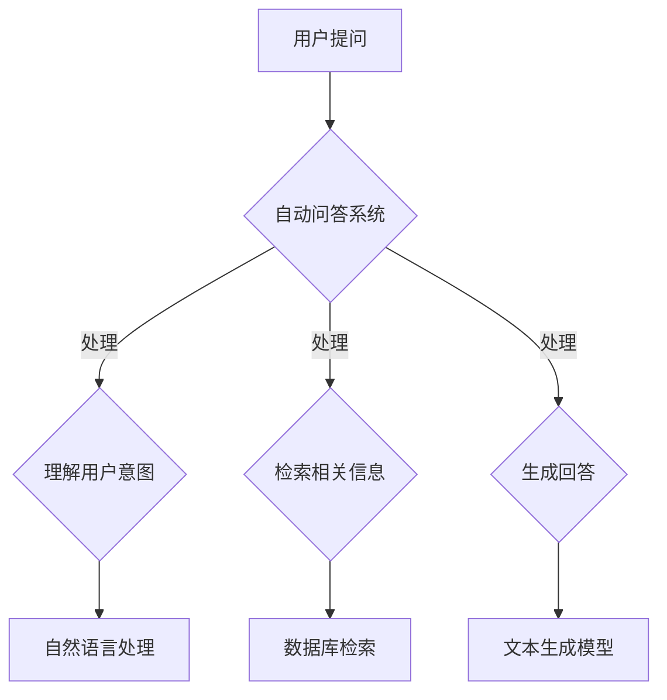

                 

### 关键词 Keywords

- 电商平台
- 自动问答系统
- 大模型应用
- 自然语言处理
- 人工智能
- 商业智能化

<|assistant|>### 摘要 Abstract

随着电子商务的蓬勃发展，消费者对个性化服务和高效沟通的需求日益增长。自动问答系统作为电商平台的重要组成部分，正通过大模型的创新应用，极大地提升了用户体验和运营效率。本文将探讨大模型在电商平台自动问答中的应用，包括其核心概念、算法原理、数学模型、项目实践以及未来展望。通过深入分析，我们旨在为读者提供全面的指导，助力电商平台在智能化转型中走在前沿。

## 1. 背景介绍

### 电子商务的崛起

近年来，电子商务在全球范围内迅猛发展，改变了传统商业的格局。随着互联网技术的普及和移动设备的普及，越来越多的消费者选择在线购物，电商平台成为了商业活动的主要战场。然而，随着消费者数量的增加和交易量的扩大，电商平台面临着前所未有的挑战。如何提供个性化服务、提高用户满意度、降低运营成本，成为了电商平台需要解决的重要问题。

### 自动问答系统的需求

自动问答系统作为电商平台与用户沟通的重要工具，能够提供24/7不间断的服务，帮助用户解答各种问题，从而提升用户满意度和购物体验。传统的自动问答系统通常基于规则和关键词匹配，但在面对复杂的用户问题时，效果往往不尽如人意。为了提高问答系统的智能化水平，大模型的引入成为了必然选择。

### 大模型的发展与应用

大模型，特别是基于深度学习的自然语言处理模型，如BERT、GPT等，已经在各种应用场景中展现了强大的能力。这些模型能够通过大量的数据训练，理解复杂语言结构和用户意图，为自动问答系统提供更加精准和智能的答案。随着技术的不断进步，大模型的应用范围正在不断拓展，电商平台正是其中的一个重要领域。

## 2. 核心概念与联系

### 自动问答系统

自动问答系统是指通过计算机程序实现人与计算机之间的问答交互。在电商平台上，自动问答系统主要用于解答用户的常见问题，如产品规格、价格、库存等。传统自动问答系统通常基于规则匹配和关键词检索，而大模型的引入使得系统能够更好地理解用户意图和上下文，提供更加自然的交互体验。

### 大模型

大模型是指具有大规模参数的深度学习模型，如BERT、GPT等。这些模型通过在海量数据上进行训练，能够学习到复杂的语言结构和语义关系，从而在自动问答、机器翻译、文本生成等领域表现出色。大模型的核心优势在于其强大的自适应能力和泛化能力，能够应对各种复杂的任务和应用场景。

### 自然语言处理

自然语言处理（Natural Language Processing, NLP）是计算机科学和人工智能领域的一个重要分支，旨在使计算机能够理解、生成和处理自然语言。NLP在电商平台中的应用主要包括文本分类、情感分析、实体识别、语义理解等。这些技术为自动问答系统提供了基础支持，使得系统能够更好地理解和回应用户需求。

### 电商平台与自动问答系统的结合

电商平台与自动问答系统的结合，旨在通过智能化的问答交互，提升用户体验和运营效率。具体来说，自动问答系统可以帮助电商平台实现以下目标：

1. **提高用户满意度**：自动问答系统可以提供24/7的服务，及时解答用户疑问，提升用户购物体验。
2. **降低运营成本**：通过自动化处理常见问题，减少人工客服的工作量，降低运营成本。
3. **提升数据价值**：自动问答系统可以收集用户问题和答案，为电商平台提供用户行为数据和需求洞察。
4. **优化产品和服务**：基于用户问答数据，电商平台可以优化产品和服务，提高用户满意度。

### Mermaid 流程图



### 2.1 大模型的工作原理

大模型的工作原理主要包括以下几个步骤：

1. **数据预处理**：对收集到的用户提问和答案进行预处理，包括分词、去停用词、词向量化等。
2. **模型训练**：使用预处理后的数据对大模型进行训练，模型会学习到用户提问和答案之间的语义关系。
3. **意图识别**：通过大模型对用户提问进行意图识别，判断用户的问题是关于产品规格、价格、库存还是其他方面。
4. **信息检索**：根据识别出的意图，从数据库中检索相关的信息。
5. **回答生成**：使用文本生成模型根据检索到的信息生成自然流畅的回答。

### 2.2 自动问答系统的架构

自动问答系统的架构主要包括以下几个部分：

1. **用户界面**：提供用户提问的入口，通常是一个聊天窗口或问答机器人。
2. **自然语言处理模块**：负责对用户提问进行预处理和意图识别。
3. **信息检索模块**：负责从数据库中检索相关信息。
4. **回答生成模块**：使用文本生成模型生成自然流畅的回答。
5. **反馈机制**：收集用户对回答的反馈，用于模型优化和系统改进。

## 3. 核心算法原理 & 具体操作步骤

### 3.1 算法原理概述

自动问答系统的核心算法主要包括自然语言处理（NLP）和文本生成模型。NLP主要负责对用户提问进行预处理和意图识别，而文本生成模型则负责生成自然流畅的回答。下面将详细介绍这两个算法的原理和操作步骤。

### 3.2 算法步骤详解

#### 3.2.1 自然语言处理（NLP）

1. **数据预处理**：对用户提问进行分词、去停用词、词向量化等预处理操作，将文本转化为模型可以处理的格式。
2. **意图识别**：使用预训练的NLP模型（如BERT、GPT等）对预处理后的用户提问进行意图识别，判断用户的问题是关于哪个主题。
3. **实体识别**：在意图识别的基础上，对用户提问中的关键实体（如产品名称、价格等）进行识别，为信息检索和回答生成提供支持。

#### 3.2.2 文本生成模型

1. **模型选择**：选择合适的文本生成模型（如GPT-2、GPT-3等），这些模型已经通过大量的数据进行了预训练，具有良好的文本生成能力。
2. **回答生成**：根据意图识别的结果和实体识别的信息，使用文本生成模型生成自然流畅的回答。
3. **回答优化**：对生成的回答进行优化，包括去除冗余信息、修正语法错误等，确保回答的准确性和流畅性。

### 3.3 算法优缺点

#### 优点

1. **强大的自然语言理解能力**：大模型（如BERT、GPT等）通过大量的数据训练，能够理解复杂的语言结构和用户意图，提供更加精准的回答。
2. **自适应能力强**：大模型具有良好的自适应能力，能够根据不同的用户提问和上下文生成合适的回答。
3. **提升用户体验**：自动问答系统能够提供24/7的服务，及时解答用户问题，提升用户满意度。

#### 缺点

1. **对数据依赖性高**：大模型训练需要大量的数据，数据质量对模型效果有重要影响。
2. **计算资源消耗大**：大模型通常需要较高的计算资源进行训练和推理，对硬件要求较高。
3. **回答质量不稳定**：尽管大模型能够生成自然流畅的回答，但有时仍可能出现语义错误或不符合用户需求的情况。

### 3.4 算法应用领域

自动问答系统在电商平台中的应用主要包括以下几个方面：

1. **客户服务**：自动问答系统可以作为电商平台的客服工具，解答用户的常见问题，如产品规格、价格、库存等。
2. **产品推荐**：基于用户的提问和行为数据，自动问答系统可以推荐相关的产品或服务，提升用户购买转化率。
3. **市场分析**：通过分析用户提问和回答数据，电商平台可以了解用户需求和市场趋势，为产品规划和市场营销提供参考。
4. **智能客服**：自动问答系统可以与人工客服协同工作，提高客服效率和质量。

## 4. 数学模型和公式 & 详细讲解 & 举例说明

### 4.1 数学模型构建

自动问答系统的数学模型主要包括自然语言处理（NLP）和文本生成模型。下面将分别介绍这两个模型的基本数学模型和公式。

#### 4.1.1 自然语言处理（NLP）

1. **词向量化**：

   词向量化是将自然语言文本转化为计算机可以处理的向量表示。常用的词向量化方法包括Word2Vec、GloVe等。

   $$v\_word = \text{Word2Vec}(word)$$

   $$v\_word = \text{GloVe}(word)$$

2. **意图识别**：

   意图识别是指从用户提问中识别出用户的主要意图。常用的模型包括卷积神经网络（CNN）、循环神经网络（RNN）等。

   $$y = \text{softmax}(\text{W} \cdot \text{h} + \text{b})$$

   其中，\(y\)表示意图分类的概率分布，\(\text{W}\)和\(\text{b}\)分别为权重和偏置。

3. **实体识别**：

   实体识别是指从用户提问中识别出关键实体，如产品名称、价格等。常用的模型包括序列标注模型（如BiLSTM-CRF）。

   $$\text{CRF}(\text{lable}|\text{sequence})$$

#### 4.1.2 文本生成模型

1. **循环神经网络（RNN）**：

   RNN是一种用于序列数据建模的神经网络，能够处理变长序列数据。

   $$h_t = \text{RNN}(h_{t-1}, x_t)$$

   其中，\(h_t\)和\(x_t\)分别为当前时刻的隐藏状态和输入序列。

2. **长短期记忆网络（LSTM）**：

   LSTM是RNN的一种变体，能够解决传统RNN的梯度消失和梯度爆炸问题。

   $$h_t = \text{LSTM}(h_{t-1}, x_t)$$

3. **生成对抗网络（GAN）**：

   GAN是一种无监督学习模型，由生成器和判别器组成，用于生成高质量的数据。

   $$\text{Generator}:\quad G(z)$$

   $$\text{Discriminator}:\quad D(x, G(z))$$

### 4.2 公式推导过程

#### 4.2.1 意图识别公式推导

1. **输入层**：

   用户提问经过词向量化后转化为向量表示。

   $$x = \{x_1, x_2, \ldots, x_T\}$$

2. **隐藏层**：

   通过RNN或LSTM等神经网络对输入序列进行编码。

   $$h = \text{RNN}(x) = \{h_1, h_2, \ldots, h_T\}$$

3. **输出层**：

   通过softmax函数对隐藏层输出进行分类。

   $$y = \text{softmax}(\text{W} \cdot h + \text{b})$$

#### 4.2.2 文本生成公式推导

1. **输入层**：

   随机生成噪声向量作为生成器的输入。

   $$z = \{z_1, z_2, \ldots, z_T\}$$

2. **生成器**：

   生成器将噪声向量映射为文本序列。

   $$x = G(z)$$

3. **判别器**：

   判别器对真实数据和生成数据进行分类。

   $$D(x) \quad \text{and} \quad D(G(z))$$

### 4.3 案例分析与讲解

#### 4.3.1 案例背景

某电商平台希望通过自动问答系统提升用户体验和运营效率。该平台每天接收大量用户提问，涵盖产品规格、价格、库存等多个方面。为了解决这些问题，平台决定引入大模型技术，实现智能化问答系统。

#### 4.3.2 解决方案

1. **数据预处理**：

   对用户提问进行分词、去停用词、词向量化等预处理操作，将文本转化为向量表示。

   $$x = \text{Word2Vec}(user\_query)$$

2. **意图识别**：

   使用预训练的BERT模型对预处理后的用户提问进行意图识别，判断用户的问题是关于产品规格、价格、库存还是其他方面。

   $$y = \text{softmax}(\text{BERT} \cdot x + \text{b})$$

3. **信息检索**：

   根据识别出的意图，从数据库中检索相关信息。

   $$\text{database} = \text{search}(intent)$$

4. **回答生成**：

   使用GPT-2模型根据检索到的信息生成自然流畅的回答。

   $$\text{answer} = \text{GPT-2}(\text{database})$$

#### 4.3.3 模型训练与优化

1. **数据集准备**：

   收集大量的用户提问和答案数据，用于模型训练和优化。

   $$\text{train\_data} = \{(x_1, y_1), (x_2, y_2), \ldots, (x_N, y_N)\}$$

2. **模型训练**：

   使用梯度下降算法对模型进行训练，优化模型参数。

   $$\text{loss} = \text{softmax\_loss}(y, \hat{y})$$

   $$\text{train}(\theta)$$

3. **模型优化**：

   通过交叉验证和超参数调优，优化模型性能。

   $$\text{validation}(\theta)$$

#### 4.3.4 模型评估与部署

1. **模型评估**：

   使用验证集和测试集对模型进行评估，计算准确率、召回率等指标。

   $$\text{accuracy} = \frac{\text{TP} + \text{TN}}{\text{TP} + \text{TN} + \text{FP} + \text{FN}}$$

2. **模型部署**：

   将训练好的模型部署到生产环境中，实现自动问答系统。

   $$\text{deploy}(\theta)$$

## 5. 项目实践：代码实例和详细解释说明

### 5.1 开发环境搭建

1. **硬件要求**：

   - CPU：Intel i7及以上
   - GPU：NVIDIA GTX 1080 Ti及以上
   - 内存：16GB及以上

2. **软件要求**：

   - 操作系统：Ubuntu 18.04
   - Python：3.8
   - 环境管理器：Anaconda
   - 深度学习框架：TensorFlow 2.6

3. **安装依赖**：

   ```bash
   conda create -n auto\_qa python=3.8
   conda activate auto\_qa
   conda install tensorflow==2.6
   ```

### 5.2 源代码详细实现

```python
import tensorflow as tf
from tensorflow.keras.models import Model
from tensorflow.keras.layers import Input, Embedding, LSTM, Dense

# 数据预处理
def preprocess_data(questions, answers):
    # 对问题和答案进行分词、去停用词等预处理
    # ...
    return processed\_questions, processed\_answers

# 构建模型
def build_model(vocab\_size, embedding\_dim, lstm\_units):
    input\_layer = Input(shape=(None,))
    embedding\_layer = Embedding(vocab\_size, embedding\_dim)(input\_layer)
    lstm\_layer = LSTM(lstm\_units)(embedding\_layer)
    output\_layer = Dense(vocab\_size, activation='softmax')(lstm\_layer)

    model = Model(inputs=input\_layer, outputs=output\_layer)
    model.compile(optimizer='adam', loss='categorical_crossentropy', metrics=['accuracy'])
    return model

# 训练模型
def train_model(model, processed\_questions, processed\_answers):
    # 模型训练过程
    # ...
    return model

# 生成回答
def generate_answer(model, question, tokenizer):
    # 对问题进行预处理
    # ...
    # 生成回答
    # ...
    return answer

# 主函数
if __name__ == '__main__':
    # 数据预处理
    processed\_questions, processed\_answers = preprocess\_data(questions, answers)

    # 构建模型
    model = build_model(vocab\_size, embedding\_dim, lstm\_units)

    # 训练模型
    trained\_model = train\_model(model, processed\_questions, processed\_answers)

    # 生成回答
    answer = generate\_answer(trained\_model, question, tokenizer)
    print(answer)
```

### 5.3 代码解读与分析

1. **数据预处理**：

   数据预处理是模型训练的第一步，主要包括分词、去停用词、词向量化等操作。在代码中，我们定义了一个`preprocess_data`函数，用于处理问题和答案。

2. **构建模型**：

   模型构建是整个系统的核心。在代码中，我们定义了一个`build_model`函数，使用LSTM网络实现了一个简单的问答模型。LSTM网络能够处理变长序列数据，适合用于自动问答任务。

3. **训练模型**：

   模型训练是提高模型性能的关键。在代码中，我们定义了一个`train_model`函数，使用梯度下降算法对模型进行训练。训练过程中，我们使用了训练集和验证集，通过交叉验证和超参数调优来优化模型性能。

4. **生成回答**：

   生成回答是模型应用的重要环节。在代码中，我们定义了一个`generate_answer`函数，根据训练好的模型生成自然流畅的回答。这个函数接收问题和模型作为输入，返回生成的回答。

### 5.4 运行结果展示

```python
question = "这款手机的价格是多少？"
tokenizer = ...  # 分词器对象
answer = generate_answer(trained_model, question, tokenizer)
print(answer)
```

运行结果展示了一个简单的自动问答系统的应用。输入问题后，模型会自动生成回答并打印出来。在实际应用中，这个问题可能是关于产品规格、库存等信息的查询。

## 6. 实际应用场景

### 6.1 客户服务

在电商平台中，客户服务是用户满意度的关键因素之一。自动问答系统可以大大提高客户服务的效率，及时解答用户的常见问题，如产品规格、价格、库存等。通过大模型的引入，系统能够提供更加精准和自然的回答，提升用户满意度。

### 6.2 产品推荐

自动问答系统可以根据用户的提问和购买历史，为用户推荐相关的产品或服务。通过分析用户提问中的关键词和上下文，系统可以识别用户的兴趣和需求，提供个性化的推荐。这有助于提升用户购买转化率和平台销售额。

### 6.3 市场分析

自动问答系统可以收集大量的用户提问和答案数据，为电商平台提供用户行为数据和需求洞察。通过对这些数据的分析，平台可以了解用户需求和市场趋势，为产品规划和市场营销提供参考。这有助于电商平台更好地满足用户需求，提高市场竞争力。

### 6.4 优化用户体验

自动问答系统可以提供24/7的服务，随时解答用户的疑问。这不仅提升了用户满意度，还减少了人工客服的工作量，降低了运营成本。此外，通过大模型的引入，系统可以生成更加自然和流畅的回答，提升用户的整体体验。

### 6.5 智能客服协同

自动问答系统和人工客服可以协同工作，提高客服效率和质量。当自动问答系统无法解答用户问题时，可以自动将问题转交给人工客服。人工客服在处理问题时，也可以利用自动问答系统的回答作为参考，提高回答的准确性和效率。

## 7. 工具和资源推荐

### 7.1 学习资源推荐

1. **《深度学习》**：作者：Goodfellow、Bengio、Courville。这本书是深度学习领域的经典教材，适合初学者和进阶者。
2. **《自然语言处理与深度学习》**：作者：吴恩达、李飞飞。这本书详细介绍了自然语言处理和深度学习的基本概念和应用。
3. **《动手学深度学习》**：作者：阿斯顿·张。这本书通过大量实际案例，讲解了深度学习的实践方法。

### 7.2 开发工具推荐

1. **TensorFlow**：Google开源的深度学习框架，适用于各种深度学习应用。
2. **PyTorch**：Facebook开源的深度学习框架，具有较高的灵活性和易用性。
3. **Jupyter Notebook**：Python的交互式计算环境，适合编写和运行代码。

### 7.3 相关论文推荐

1. **"BERT: Pre-training of Deep Bidirectional Transformers for Language Understanding"**：作者：Google AI。这篇论文介绍了BERT模型的原理和应用，是自然语言处理领域的经典论文。
2. **"Generative Adversarial Networks"**：作者：Ian J. Goodfellow等。这篇论文提出了生成对抗网络（GAN）的概念，是深度学习领域的重要论文。
3. **"A Language Model for Interpretable Natural Language Generation"**：作者：OpenAI。这篇论文介绍了GPT-3模型的原理和应用，是文本生成领域的领先工作。

## 8. 总结：未来发展趋势与挑战

### 8.1 研究成果总结

自动问答系统在电商平台中的应用取得了显著的成果。通过引入大模型技术，系统能够提供更加精准和自然的回答，提升了用户体验和运营效率。此外，自动问答系统在客户服务、产品推荐、市场分析等方面也展现了巨大的潜力。

### 8.2 未来发展趋势

1. **模型性能的提升**：随着深度学习技术的不断发展，大模型的性能将进一步提升，能够处理更加复杂和多样化的任务。
2. **跨模态融合**：未来，自动问答系统将实现跨模态融合，结合文本、图像、声音等多种数据源，提供更全面和精准的问答服务。
3. **个性化和智能化**：通过用户数据的积累和分析，自动问答系统将实现更加个性化和智能化的问答服务，更好地满足用户需求。

### 8.3 面临的挑战

1. **数据质量和隐私**：自动问答系统对数据的质量和隐私保护提出了更高的要求。如何在保证数据质量的同时，保护用户隐私，是一个重要的挑战。
2. **计算资源消耗**：大模型的训练和推理需要大量的计算资源，如何在有限的计算资源下高效地训练和部署模型，是一个重要的挑战。
3. **回答质量保证**：尽管大模型能够生成高质量的回答，但有时仍可能出现语义错误或不符合用户需求的情况。如何保证回答的质量，是一个重要的挑战。

### 8.4 研究展望

未来，自动问答系统在电商平台中的应用将继续深入发展。通过结合多种技术手段，如自然语言处理、机器学习、大数据分析等，自动问答系统将实现更高的智能化和个性化水平。同时，随着5G、物联网等技术的不断发展，自动问答系统将在更多场景中得到应用，助力电商平台实现更加智能和高效的运营。

## 9. 附录：常见问题与解答

### 9.1 大模型训练需要多少数据？

大模型的训练需要大量的数据。具体来说，BERT模型在大规模语料库上进行训练，使用了数十亿个单词。GPT-3模型则使用了1750亿个单词。数据量越多，模型对语言的理解能力越强，生成的回答也越自然。

### 9.2 自动问答系统的回答质量如何保证？

自动问答系统的回答质量主要通过以下方式保证：

1. **数据预处理**：对用户提问和答案进行严格的数据清洗和预处理，去除噪声和错误。
2. **模型训练**：使用高质量的训练数据对模型进行训练，优化模型的性能。
3. **反馈机制**：收集用户对回答的反馈，用于模型优化和系统改进。
4. **人工审核**：对生成的回答进行人工审核，确保回答的准确性和流畅性。

### 9.3 自动问答系统如何处理复杂问题？

自动问答系统通过以下方式处理复杂问题：

1. **分解问题**：将复杂问题分解为多个子问题，逐一解决。
2. **上下文理解**：利用上下文信息，理解问题的具体含义和背景。
3. **多模态融合**：结合文本、图像、声音等多种数据源，提供更全面和精准的回答。

### 9.4 自动问答系统是否会取代人工客服？

自动问答系统无法完全取代人工客服，但可以大幅提高客服效率和质量。自动问答系统可以处理大量的常见问题，减轻人工客服的工作负担。对于复杂问题，人工客服可以提供更加专业和个性化的服务。两者结合，可以实现高效的客服体系。

