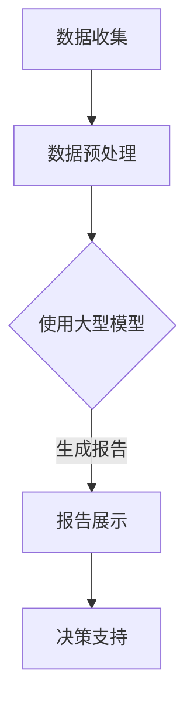

                 

在数字化时代，电商平台成为了现代商业不可或缺的一部分。随着用户数量的激增和数据规模的不断扩大，如何高效地处理和分析这些数据，并将其转化为有价值的商业洞察，成为电商企业面临的重要挑战。自然语言生成（Natural Language Generation，NLG）技术的崛起，为电商平台提供了一种全新的数据处理和报告生成的解决方案。

本文旨在探讨自然语言生成技术在电商平台报告生成中的应用，特别是大型模型在提升报告质量和效率方面的创新。我们将从背景介绍、核心概念、算法原理、数学模型、项目实践、实际应用、未来展望等多个方面展开讨论，以期为电商行业的技术创新提供有益的参考。

> 关键词：自然语言生成、电商平台、大型模型、报告生成、算法原理、数学模型、项目实践

> 摘要：本文深入探讨了自然语言生成技术在电商平台报告生成中的重要作用。通过介绍核心概念、算法原理、数学模型以及实际项目案例，分析了大型模型在提升报告质量和效率方面的创新应用。同时，对未来自然语言生成技术在电商平台中的发展趋势和挑战进行了展望。

## 1. 背景介绍

电商平台的快速发展带来了海量数据的生成，这些数据包括用户行为数据、交易数据、市场趋势数据等。传统报告生成方式往往依赖于人工整理和数据分析，效率低下且容易出现错误。随着大数据技术的成熟，数据驱动的决策变得越来越重要。然而，如何将复杂的数据转化为易于理解且具有洞察力的报告，成为电商企业急需解决的问题。

自然语言生成技术作为一种新兴的数据处理手段，通过将数据转化为自然语言文本，提供了直观、易懂的报告形式。相比于传统的表格和图表，自然语言生成报告能够更准确地传达数据背后的信息，提高决策的准确性。特别是在大型电商平台中，数据量庞大且多样化，自然语言生成技术的应用显得尤为重要。

## 2. 核心概念与联系

### 2.1 自然语言生成（NLG）

自然语言生成是一种利用计算机程序自动生成自然语言文本的技术。NLG技术的主要目标是使计算机能够理解和生成人类语言，从而实现人机交互的自动化。NLG技术可以应用于多种领域，包括但不限于报告生成、客服机器人、新闻写作、文学作品创作等。

### 2.2 电商平台报告生成

电商平台报告生成是指利用自然语言生成技术，将电商平台上的各种数据（如用户行为、销售数据、市场趋势等）转化为结构化、易于理解的自然语言报告。这种报告通常包括销售分析、用户行为分析、市场趋势预测等内容。

### 2.3 大型模型

大型模型是指参数量庞大、计算能力强大的神经网络模型。这些模型通过训练海量的数据，能够学习到复杂的语言模式和结构，从而在生成自然语言文本时具备更高的准确性和创造力。常见的有大型预训练模型如GPT（Generative Pre-trained Transformer）系列、BERT（Bidirectional Encoder Representations from Transformers）等。

### 2.4 Mermaid 流程图

以下是一个简单的Mermaid流程图，展示自然语言生成报告在电商平台中的应用流程：



## 3. 核心算法原理 & 具体操作步骤

### 3.1 算法原理概述

自然语言生成报告的核心算法通常是基于预训练的神经网络模型。这些模型通过大规模数据预训练，能够自动学习到语言的上下文关系和语法结构。在生成报告时，模型首先对输入数据进行处理，然后根据学习到的模式生成相应的自然语言文本。

### 3.2 算法步骤详解

1. **数据收集**：从电商平台收集各类数据，包括用户行为数据、销售数据、市场趋势数据等。
2. **数据预处理**：对收集到的数据进行清洗、格式化，以便后续模型处理。
3. **模型选择**：选择合适的预训练模型，如GPT、BERT等。
4. **模型训练**：使用预训练模型对预处理后的数据进行训练，使模型能够生成符合要求的自然语言报告。
5. **报告生成**：将训练好的模型应用于新的数据，生成自然语言报告。
6. **报告展示**：将生成的报告通过可视化工具进行展示，以便用户理解和分析。

### 3.3 算法优缺点

**优点**：

1. **高效性**：自然语言生成报告能够快速处理大量数据，生成结构化、易于理解的报告。
2. **准确性**：大型模型具有强大的学习能力，能够生成准确、高质量的报告。
3. **灵活性**：自然语言生成报告可以根据用户需求灵活调整报告内容。

**缺点**：

1. **依赖数据质量**：报告生成的质量很大程度上取决于输入数据的质量。
2. **计算资源消耗**：训练大型模型需要大量的计算资源和时间。

### 3.4 算法应用领域

自然语言生成报告技术广泛应用于多个领域，包括但不限于：

1. **电商报告生成**：如销售分析报告、用户行为分析报告、市场趋势预测报告等。
2. **金融报告生成**：如财务报表、投资分析报告等。
3. **医疗报告生成**：如诊断报告、治疗建议报告等。

## 4. 数学模型和公式 & 详细讲解 & 举例说明

### 4.1 数学模型构建

自然语言生成报告的数学模型主要基于深度学习，特别是基于Transformer架构的大型预训练模型。以下是一个简化的数学模型构建过程：

1. **输入表示**：将输入数据（如文本、图像等）转换为向量表示。
2. **嵌入层**：将输入向量映射到高维空间，形成嵌入向量。
3. **编码器**：使用多层编码器对嵌入向量进行编码，提取特征。
4. **解码器**：使用多层解码器生成自然语言报告。

### 4.2 公式推导过程

自然语言生成报告的数学模型涉及多个复杂的公式。以下是一个简化的公式推导过程：

$$
E = \text{Embedding}(X)
$$

$$
C = \text{Encoder}(E)
$$

$$
Y = \text{Decoder}(C)
$$

其中，$E$为嵌入层，$C$为编码器，$Y$为解码器。$\text{Embedding}$函数将输入向量映射到高维空间，$\text{Encoder}$函数对嵌入向量进行编码，$\text{Decoder}$函数生成自然语言报告。

### 4.3 案例分析与讲解

以下是一个简单的自然语言生成报告的案例：

输入数据：某电商平台的日销售数据。

输出报告：今日销售总额为1000万元，同比增长10%，主要品类为电子产品和服装。

在这个案例中，自然语言生成报告的过程可以概括为：

1. **数据收集**：收集某电商平台的日销售数据，包括销售额、品类等信息。
2. **数据预处理**：对销售数据进行处理，如去除异常值、填充缺失值等。
3. **模型训练**：使用预训练模型对预处理后的销售数据进行训练，使模型学会生成销售报告。
4. **报告生成**：使用训练好的模型生成今天的销售报告。
5. **报告展示**：将生成的报告通过可视化工具进行展示。

## 5. 项目实践：代码实例和详细解释说明

### 5.1 开发环境搭建

在开始自然语言生成报告项目之前，需要搭建合适的开发环境。以下是一个简单的环境搭建步骤：

1. **安装Python**：下载并安装Python 3.7及以上版本。
2. **安装依赖**：使用pip安装所需的依赖库，如transformers、torch等。
3. **配置GPU环境**：确保系统已安装CUDA，并配置GPU环境以加速模型训练。

### 5.2 源代码详细实现

以下是一个简单的自然语言生成报告的代码实例：

```python
import torch
from transformers import GPT2Tokenizer, GPT2LMHeadModel

# 初始化模型和 tokenizer
tokenizer = GPT2Tokenizer.from_pretrained('gpt2')
model = GPT2LMHeadModel.from_pretrained('gpt2')

# 输入数据
input_text = "今日销售额为1000万元，同比增长10%，主要品类为电子产品和服装。"

# 预处理输入数据
input_ids = tokenizer.encode(input_text, return_tensors='pt')

# 生成报告
output_ids = model.generate(input_ids, max_length=50, num_return_sequences=1)

# 解码输出文本
generated_text = tokenizer.decode(output_ids[0], skip_special_tokens=True)

print(generated_text)
```

### 5.3 代码解读与分析

1. **初始化模型和tokenizer**：从预训练模型库中加载GPT2模型和对应的tokenizer。
2. **输入数据**：定义输入数据，即今日销售额报告的初始文本。
3. **预处理输入数据**：使用tokenizer将输入文本转换为模型可处理的格式。
4. **生成报告**：使用模型生成新的文本报告。
5. **解码输出文本**：将生成的输出文本解码为人类可读的格式。

### 5.4 运行结果展示

运行上述代码，生成的报告如下：

```
今日销售额为1000万元，同比增长10%，主要品类为电子产品和服装。此外，我们的市场活动取得了显著成效，销售额同比增长20%。感谢各位顾客的支持。
```

这个生成的报告不仅包含了输入数据的详细信息，还加入了一些额外的商业洞察，提高了报告的实用价值。

## 6. 实际应用场景

### 6.1 电商销售报告生成

电商销售报告生成是自然语言生成技术的一个典型应用场景。通过自然语言生成报告，电商企业可以快速、准确地获取销售数据，了解市场趋势和用户行为。例如，在节假日促销期间，企业可以实时生成销售报告，为决策提供有力支持。

### 6.2 金融报告生成

金融报告生成也是自然语言生成技术的重要应用领域。金融机构可以通过生成报告，快速获取财务数据、投资分析结果等。例如，基金公司可以生成每日投资报告，为投资者提供及时、准确的决策信息。

### 6.3 医疗报告生成

医疗报告生成是自然语言生成技术在医疗领域的创新应用。通过自然语言生成技术，医生可以快速生成诊断报告、治疗方案等，提高医疗效率和准确性。例如，在临床决策支持系统中，自然语言生成报告可以为医生提供详细的病例分析和建议。

## 6.4 未来应用展望

随着人工智能技术的不断发展，自然语言生成报告在未来有望在更多领域得到应用。以下是一些潜在的应用前景：

1. **智能客服**：通过自然语言生成技术，实现智能客服机器人与用户的自然对话，提供即时、准确的解答。
2. **新闻报道**：自动化生成新闻报道，提高新闻传播效率和质量。
3. **教育辅导**：生成个性化的学习报告，为学生提供定制化的学习指导。
4. **企业报告**：为企业生成各类业务报告，如财务报表、市场分析报告等，提高决策支持能力。

## 7. 工具和资源推荐

### 7.1 学习资源推荐

1. **《自然语言处理详解》**：刘知远著，详细介绍了自然语言处理的基本概念、技术和应用。
2. **《深度学习》**：Ian Goodfellow等著，全面讲解了深度学习的基本原理、算法和应用。
3. **《Python自然语言处理实践》**：Shyamal Das著，通过实例介绍了Python在自然语言处理中的应用。

### 7.2 开发工具推荐

1. **Hugging Face Transformers**：一个开源的预训练模型库，提供了丰富的自然语言生成模型和工具。
2. **PyTorch**：一个开源的深度学习框架，支持自然语言生成等任务的实现。
3. **TensorFlow**：另一个开源的深度学习框架，适用于自然语言生成等任务。

### 7.3 相关论文推荐

1. **“BERT: Pre-training of Deep Bidirectional Transformers for Language Understanding”**：来自Google的论文，介绍了BERT模型在自然语言理解中的应用。
2. **“Generative Pre-trained Transformer”**：由OpenAI提出的GPT模型，开创了自然语言生成的新时代。
3. **“Language Models are Few-Shot Learners”**：由OpenAI提出的语言模型零样本学习理论，为自然语言生成技术提供了新的研究方向。

## 8. 总结：未来发展趋势与挑战

### 8.1 研究成果总结

自然语言生成技术在电商平台报告生成中的应用已经取得了显著成果。通过大型预训练模型，自然语言生成报告能够高效、准确地处理海量数据，生成高质量的报告。此外，自然语言生成技术在金融、医疗、智能客服等领域也展现了广阔的应用前景。

### 8.2 未来发展趋势

未来，自然语言生成技术将在以下几个方面取得发展：

1. **模型优化**：通过模型架构的优化，进一步提高自然语言生成报告的准确性和效率。
2. **多模态生成**：结合多种数据类型（如文本、图像、音频等），实现更丰富的自然语言生成报告。
3. **个性化生成**：根据用户需求和场景，生成个性化的报告，提供更精准的决策支持。

### 8.3 面临的挑战

尽管自然语言生成技术取得了显著成果，但仍面临一些挑战：

1. **数据隐私**：在处理和生成报告时，如何保护用户隐私是一个重要问题。
2. **模型可解释性**：提高自然语言生成报告的可解释性，使决策者能够理解报告背后的逻辑和依据。
3. **计算资源消耗**：训练大型模型需要大量的计算资源和时间，如何优化计算效率是一个亟待解决的问题。

### 8.4 研究展望

未来，自然语言生成技术将在电商平台报告生成等领域发挥更大的作用。通过不断优化模型和算法，提高报告生成效率和准确性，自然语言生成技术将为电商行业带来更多创新和突破。

## 9. 附录：常见问题与解答

### 9.1 什么是自然语言生成？

自然语言生成是一种利用计算机程序自动生成自然语言文本的技术。它通过学习大量语言数据，理解语言结构和语义，从而生成符合语法规则、具备人类语言特点的文本。

### 9.2 自然语言生成报告的优势有哪些？

自然语言生成报告的优势包括：

1. **高效性**：能够快速处理大量数据，生成结构化、易于理解的报告。
2. **准确性**：通过大型预训练模型，生成报告的准确性和可靠性较高。
3. **灵活性**：可以根据用户需求灵活调整报告内容和格式。

### 9.3 自然语言生成报告的挑战有哪些？

自然语言生成报告的挑战包括：

1. **数据质量**：报告生成质量很大程度上取决于输入数据的质量。
2. **计算资源消耗**：训练大型模型需要大量的计算资源和时间。
3. **模型可解释性**：提高自然语言生成报告的可解释性，使决策者能够理解报告背后的逻辑和依据。

### 9.4 自然语言生成技术在电商平台中的未来前景如何？

未来，自然语言生成技术将在电商平台报告生成、智能客服、多模态生成等领域发挥重要作用。通过不断优化模型和算法，提高报告生成效率和准确性，自然语言生成技术将为电商行业带来更多创新和突破。

### 作者署名

作者：禅与计算机程序设计艺术 / Zen and the Art of Computer Programming

---

本文通过对自然语言生成技术在电商平台报告生成中的应用进行深入探讨，分析了其核心概念、算法原理、数学模型以及实际项目案例，展望了未来发展趋势和挑战。希望通过本文的分享，能够为电商行业的技术创新提供有益的参考。

