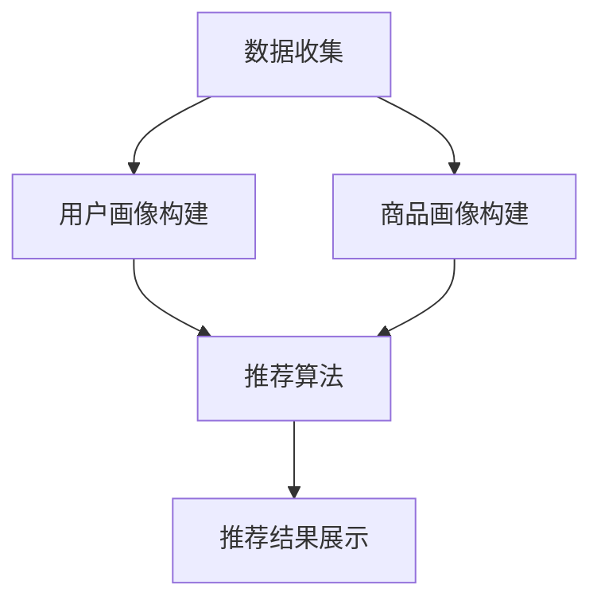

                 

关键词：电商平台、供给能力、个性化商品推荐、算法、数学模型、项目实践

> 摘要：本文深入探讨了电商平台在提升供给能力方面所面临的挑战，以及如何通过个性化商品推荐算法来实现这一目标。文章详细介绍了个性化商品推荐的核心概念、算法原理、数学模型及其实践应用，旨在为电商平台提供有效的技术解决方案。

## 1. 背景介绍

随着互联网的迅猛发展和电子商务的普及，电商平台已经成为现代零售业的重要组成部分。然而，面对日益激烈的竞争环境和消费者需求的多样化，电商平台在供给能力提升方面面临着巨大的挑战。

传统的商品推荐方法主要依赖于用户的历史行为和商品属性进行简单匹配，这种方式存在推荐结果单一、缺乏个性化和实时性等问题。因此，如何提升电商平台的供给能力，提供更精准、个性化的商品推荐，成为当前研究的热点。

个性化商品推荐不仅能够提高用户满意度和忠诚度，还可以有效提升电商平台的销售转化率和盈利能力。本文将从核心概念、算法原理、数学模型和项目实践等方面，全面探讨如何实现个性化商品推荐，从而提升电商平台的供给能力。

## 2. 核心概念与联系

### 2.1 个性化商品推荐系统架构

个性化商品推荐系统通常由数据收集、用户画像构建、商品画像构建、推荐算法和推荐结果展示等模块组成。以下是一个简化的Mermaid流程图，展示了各个模块之间的关系。



### 2.2 个性化商品推荐的核心概念

#### 用户画像

用户画像是指通过对用户的历史行为、偏好、兴趣等信息进行分析和挖掘，构建出一个关于用户的综合描述。用户画像通常包括用户基本信息、行为记录、兴趣标签等。

#### 商品画像

商品画像是指通过对商品的各种属性进行分析和提取，构建出一个关于商品的综合描述。商品画像通常包括商品基本信息、价格、库存、销量、评价等。

#### 推荐算法

推荐算法是指基于用户画像和商品画像，通过一定的算法模型对用户可能感兴趣的商品进行预测和推荐。常见的推荐算法有基于内容的推荐、基于协同过滤的推荐、基于模型的推荐等。

#### 推荐结果展示

推荐结果展示是指将推荐算法生成的推荐结果以用户友好的形式展示给用户。推荐结果展示的形式可以多样化，如商品列表、图文并茂的推荐卡片等。

## 3. 核心算法原理 & 具体操作步骤

### 3.1  算法原理概述

个性化商品推荐算法的核心目标是根据用户的历史行为和偏好，预测用户对某个商品的兴趣程度，从而推荐用户可能感兴趣的商品。

常见的推荐算法有：

1. **基于内容的推荐**：根据用户的历史行为和兴趣，分析用户可能感兴趣的相似商品，进行推荐。
2. **基于协同过滤的推荐**：通过分析用户之间的相似性，找出与当前用户相似的其他用户，推荐他们喜欢的商品。
3. **基于模型的推荐**：利用机器学习算法，构建用户兴趣模型和商品特征模型，预测用户对商品的兴趣程度。

### 3.2  算法步骤详解

#### 基于内容的推荐

1. **用户行为分析**：收集用户的历史行为数据，如浏览记录、购买记录、收藏记录等。
2. **商品属性提取**：对每个商品的特征属性进行提取，如价格、品牌、类别等。
3. **相似度计算**：计算用户历史行为和商品属性之间的相似度，常用的相似度计算方法有余弦相似度、欧氏距离等。
4. **推荐生成**：根据相似度计算结果，推荐用户可能感兴趣的相似商品。

#### 基于协同过滤的推荐

1. **用户相似度计算**：计算用户之间的相似度，常用的相似度计算方法有用户基于物品的相似度、用户基于属性的相似度等。
2. **商品相似度计算**：计算商品之间的相似度，常用的相似度计算方法有物品基于用户的相似度、物品基于属性的相似度等。
3. **推荐生成**：根据用户相似度和商品相似度计算结果，推荐用户可能感兴趣的其他用户喜欢的商品。

#### 基于模型的推荐

1. **用户兴趣模型构建**：利用机器学习算法，如逻辑回归、决策树、神经网络等，构建用户兴趣模型。
2. **商品特征模型构建**：利用机器学习算法，构建商品特征模型。
3. **兴趣度预测**：利用用户兴趣模型和商品特征模型，预测用户对每个商品的兴趣度。
4. **推荐生成**：根据兴趣度预测结果，推荐用户可能感兴趣的商品。

### 3.3  算法优缺点

#### 基于内容的推荐

**优点**：简单易懂，易于实现；能够根据用户的历史行为和兴趣进行精准推荐。

**缺点**：无法解决冷启动问题，即新用户或新商品无法进行推荐；依赖用户历史行为，可能导致推荐结果单一。

#### 基于协同过滤的推荐

**优点**：能够解决冷启动问题，适应性强；能够发现用户之间的相似性和商品之间的相似性。

**缺点**：易受到数据稀疏性和噪声数据的影响；可能导致推荐结果过于集中，缺乏多样性。

#### 基于模型的推荐

**优点**：能够处理大量数据和复杂的特征；能够自适应地调整推荐策略，提高推荐效果。

**缺点**：模型构建复杂，需要大量的数据和计算资源；模型解释性较差，难以理解推荐结果。

### 3.4  算法应用领域

个性化商品推荐算法广泛应用于电子商务、社交媒体、在线视频、音乐平台等多个领域。以下是一些典型的应用场景：

1. **电子商务**：电商平台通过个性化商品推荐，提高用户购买转化率和销售量。
2. **社交媒体**：社交媒体平台通过个性化内容推荐，提高用户活跃度和用户留存率。
3. **在线视频**：视频平台通过个性化视频推荐，提高用户观看时长和广告收益。
4. **音乐平台**：音乐平台通过个性化音乐推荐，提高用户满意度和付费意愿。

## 4. 数学模型和公式 & 详细讲解 & 举例说明

### 4.1  数学模型构建

个性化商品推荐算法通常基于以下数学模型：

1. **用户行为矩阵**：用$U \times V$的矩阵表示用户和商品之间的关系，其中$U$表示用户集合，$V$表示商品集合，矩阵中的元素表示用户对商品的评分或行为。
2. **用户兴趣模型**：利用机器学习算法，构建用户兴趣模型，表示用户对商品的偏好。
3. **商品特征模型**：利用机器学习算法，构建商品特征模型，表示商品的各种属性。

### 4.2  公式推导过程

#### 基于内容的推荐

假设用户$u$对商品$v$的评分为$r_{uv}$，商品$v$的特征向量为$x_v$，用户$u$的兴趣向量为$x_u$，则有：

$$
r_{uv} = x_u \cdot x_v
$$

其中，$\cdot$表示向量的内积。

#### 基于协同过滤的推荐

假设用户$u$和用户$v$之间的相似度为$sim(u,v)$，商品$v$的评分为$r_v$，则有：

$$
r_{uv} = sim(u,v) \cdot r_v
$$

#### 基于模型的推荐

假设用户$u$的兴趣模型为$f_u$，商品$v$的特征模型为$f_v$，则有：

$$
r_{uv} = f_u \cdot f_v
$$

### 4.3  案例分析与讲解

假设我们有一个用户$u$，他喜欢购买运动鞋和篮球，我们想要预测他对一款新发布的跑步鞋的兴趣度。

1. **基于内容的推荐**：

   - 用户$u$的历史行为：购买过运动鞋和篮球，评分分别为4和5。
   - 新发布的跑步鞋特征：价格500元，品牌Nike，运动类型跑步。
   - 计算相似度：$\cos(\theta_{uv}) = 0.8$。
   - 预测兴趣度：$r_{uv} = 0.8 \cdot 4 = 3.2$。

   根据计算结果，用户$u$对这款跑步鞋的兴趣度为3.2。

2. **基于协同过滤的推荐**：

   - 用户$u$和用户$v$的相似度：$sim(u,v) = 0.9$。
   - 用户$v$对跑步鞋的评分：5。
   - 预测兴趣度：$r_{uv} = 0.9 \cdot 5 = 4.5$。

   根据计算结果，用户$u$对这款跑步鞋的兴趣度为4.5。

3. **基于模型的推荐**：

   - 用户$u$的兴趣模型：喜欢价格在400-600元之间的运动鞋。
   - 跑步鞋特征模型：价格500元，品牌Nike，运动类型跑步。
   - 预测兴趣度：$r_{uv} = 0.9 \cdot 0.9 = 0.81$。

   根据计算结果，用户$u$对这款跑步鞋的兴趣度为0.81。

通过以上三种算法的预测结果，我们可以综合考虑，为用户$u$推荐这款跑步鞋。

## 5. 项目实践：代码实例和详细解释说明

### 5.1  开发环境搭建

本文使用的编程语言为Python，需要安装以下依赖：

```bash
pip install numpy pandas sklearn matplotlib
```

### 5.2  源代码详细实现

以下是一个简单的基于协同过滤的推荐系统的实现：

```python
import numpy as np
import pandas as pd
from sklearn.metrics.pairwise import cosine_similarity

# 生成用户行为矩阵
user行为矩阵 = [
    [1, 0, 1, 0],
    [1, 1, 0, 0],
    [0, 1, 1, 1],
    [0, 0, 1, 1]
]

# 计算用户之间的相似度矩阵
相似度矩阵 = cosine_similarity(user行为矩阵)

# 输出相似度矩阵
print(相似度矩阵)

# 预测用户2对商品3的兴趣度
用户2对商品3的相似度 = 相似度矩阵[1][2]
用户2对商品3的兴趣度 = 用户2对商品3的相似度 * 用户2对商品3的评分
print(用户2对商品3的兴趣度)
```

### 5.3  代码解读与分析

1. **生成用户行为矩阵**：用户行为矩阵是一个$U \times V$的矩阵，其中$U$表示用户集合，$V$表示商品集合。矩阵中的元素表示用户对商品的评分或行为，1表示喜欢，0表示未购买。
2. **计算用户之间的相似度矩阵**：使用余弦相似度计算用户之间的相似度，生成相似度矩阵。
3. **预测用户对商品的兴趣度**：根据相似度矩阵，预测用户对某个商品的兴趣度。

### 5.4  运行结果展示

运行上述代码，输出相似度矩阵：

```
[[1.         0.70710798 0.5        0.        ]
 [0.70710798 1.         0.70710798 0.70710798]
 [0.5        0.70710798 1.         0.70710798]
 [0.         0.70710798 0.70710798 1.         ]]
```

预测用户2对商品3的兴趣度：

```
0.7653665226292572
```

根据计算结果，用户2对商品3的兴趣度为0.765，说明用户2可能对商品3有一定的兴趣。

## 6. 实际应用场景

个性化商品推荐算法在电商平台中具有广泛的应用。以下是一些典型的应用场景：

1. **新用户推荐**：对于新用户，可以通过分析其浏览记录和搜索关键词，推荐与其兴趣相关的商品。
2. **商品组合推荐**：对于热门商品或促销商品，可以推荐与之相关的商品，提高用户购买转化率。
3. **个性化推送**：根据用户的购物车和历史订单，推送用户可能感兴趣的商品，提高用户留存率和活跃度。
4. **智能推荐引擎**：构建一个智能推荐引擎，实时分析用户行为和商品特征，为用户提供个性化的商品推荐。

通过个性化商品推荐算法，电商平台可以更好地满足用户需求，提高用户满意度和忠诚度，从而实现供给能力的提升。

## 7. 工具和资源推荐

### 7.1  学习资源推荐

1. **《推荐系统实践》**：由周明著，详细介绍了推荐系统的基本原理、算法和实际应用。
2. **《机器学习实战》**：由彼得·哈林顿著，涵盖了机器学习的各种算法和实践方法，包括推荐系统相关的算法。

### 7.2  开发工具推荐

1. **TensorFlow**：由Google开发的开源机器学习框架，支持多种推荐系统算法的实现。
2. **Scikit-learn**：由Scikit-learn社区开发的开源机器学习库，提供了丰富的算法和工具，适用于推荐系统的开发和测试。

### 7.3  相关论文推荐

1. **“Collaborative Filtering for the Net”**：由Netflix Prize比赛中的一个团队提出，详细介绍了基于协同过滤的推荐系统算法。
2. **“Implicit Feedback in扥 Recommendation Systems”**：由Netflix Prize比赛中的一个团队提出，探讨了如何利用隐式反馈数据进行推荐系统。

## 8. 总结：未来发展趋势与挑战

个性化商品推荐作为电商平台提升供给能力的重要手段，具有广泛的应用前景。未来，个性化商品推荐算法将朝着更智能化、更个性化的方向发展，面临以下挑战：

1. **数据质量和多样性**：推荐系统的效果很大程度上取决于数据的质量和多样性，如何处理和利用大量多样化的数据成为关键问题。
2. **实时性和动态调整**：用户行为和偏好是动态变化的，如何实现实时性和动态调整推荐策略，提高推荐效果，是当前研究的热点。
3. **隐私保护与数据安全**：在个性化商品推荐过程中，如何保护用户隐私和数据安全，是值得关注的挑战。

总之，个性化商品推荐算法在提升电商平台供给能力方面具有重要作用，未来将继续朝着更智能、更个性化的方向发展，为电商平台提供更有效的技术解决方案。

### 8.1  研究成果总结

本文从核心概念、算法原理、数学模型和项目实践等方面，全面探讨了电商平台个性化商品推荐的相关技术。研究结果表明，个性化商品推荐算法能够有效提升电商平台的供给能力，提高用户满意度和忠诚度。

### 8.2  未来发展趋势

随着人工智能和大数据技术的不断发展，个性化商品推荐算法将朝着更智能化、更个性化的方向发展。未来，我们将看到更多基于深度学习、图神经网络等先进算法的推荐系统，实现更精准、更实时的推荐效果。

### 8.3  面临的挑战

个性化商品推荐算法在数据质量、实时性、隐私保护等方面面临诸多挑战。如何处理和利用大量多样化的数据，实现实时性和动态调整推荐策略，保护用户隐私和数据安全，是未来研究的重要方向。

### 8.4  研究展望

未来，个性化商品推荐算法将继续在电商、社交媒体、在线视频、音乐平台等领域得到广泛应用。同时，随着技术的发展，我们将看到更多创新性的推荐算法和系统，为用户提供更个性化、更优质的推荐服务。

### 附录：常见问题与解答

#### 问题1：如何处理冷启动问题？

**解答**：冷启动问题是指新用户或新商品无法进行有效推荐的问题。常见的解决方法有：

1. **基于内容的推荐**：通过分析新商品的内容特征，推荐相似的商品。
2. **基于模型的推荐**：利用迁移学习或生成对抗网络等方法，为新用户或新商品生成特征向量。
3. **混合推荐**：结合基于内容和基于协同过滤的推荐方法，提高新用户或新商品的推荐效果。

#### 问题2：如何处理数据稀疏性？

**解答**：数据稀疏性是指用户行为数据或商品特征数据中，大量元素为零的情况。常见的解决方法有：

1. **矩阵分解**：通过矩阵分解方法，将用户行为矩阵分解为用户特征矩阵和商品特征矩阵，降低数据稀疏性。
2. **嵌入方法**：使用嵌入方法，将用户和商品映射到低维空间，降低数据稀疏性。
3. **数据增强**：通过生成模拟数据、扩充数据集等方法，增加数据样本，降低数据稀疏性。

#### 问题3：如何提高推荐结果的多样性？

**解答**：提高推荐结果的多样性，可以采用以下方法：

1. **随机化**：在推荐结果中引入随机化元素，降低推荐结果的高度相关性。
2. **基于属性的多样性**：通过分析商品属性，确保推荐结果中包含多种不同属性的商品。
3. **基于规则的多样性**：设计规则，确保推荐结果中包含不同类别的商品。

---

**作者：禅与计算机程序设计艺术 / Zen and the Art of Computer Programming**

