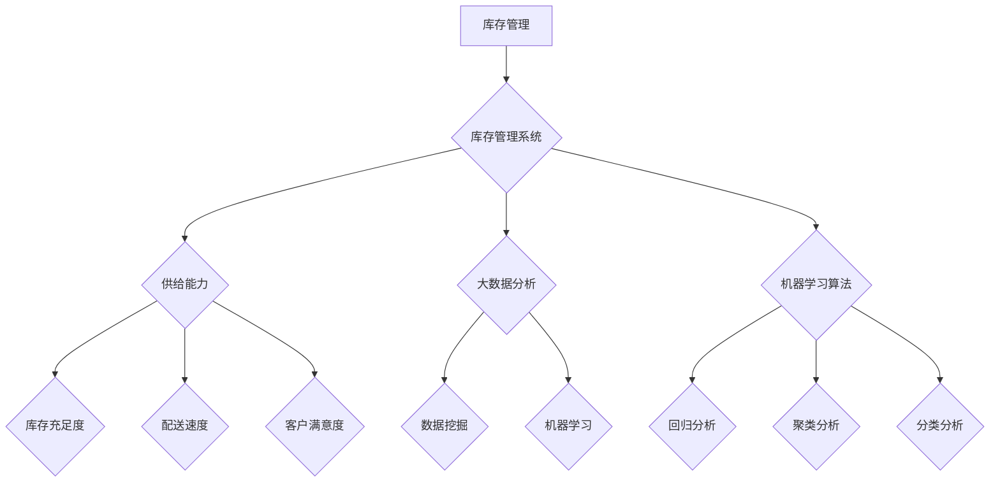

                 

关键词：电商平台，库存管理系统，供给能力提升，算法，实践，应用场景

> 摘要：本文旨在探讨电商平台供给能力的提升策略，重点分析库存管理系统的应用及其对电商平台的影响。通过对核心算法原理、数学模型及实际项目实践的深入讲解，本文将为电商平台的运营管理者提供实用的指导，帮助其在激烈的市场竞争中脱颖而出。

## 1. 背景介绍

随着互联网的迅猛发展和电子商务的普及，电商平台已成为现代商业环境中的重要组成部分。供给能力是电商平台的核心竞争力之一，直接关系到消费者的购物体验和平台的长期发展。库存管理作为供应链管理的重要组成部分，对于保证供给能力和提升整体运营效率具有重要意义。

传统的库存管理方式通常依赖于人工经验和简单的计算机软件，难以满足电商平台快速变化的需求。因此，引入先进的库存管理系统成为提高供给能力的必然选择。库存管理系统通过整合多种技术手段，如大数据分析、机器学习算法、自动化处理等，实现了库存的精细化管理，从而大幅提升了供给能力和运营效率。

本文将围绕库存管理系统的核心概念、算法原理、数学模型以及实际应用场景等方面展开讨论，旨在为电商平台运营管理者提供全面、系统的指导。

## 2. 核心概念与联系

### 2.1 核心概念

在探讨库存管理系统之前，我们首先需要了解一些核心概念。

**库存管理**：库存管理是指对商品库存进行有效的计划、控制、监控和优化，以确保库存水平的合理性和供应链的顺畅运行。

**库存管理系统**：库存管理系统是一种集成多种技术和工具的软件系统，用于管理和优化商品库存，主要包括库存计划、库存监控、库存调整、库存分析等功能。

**供给能力**：供给能力是指电商平台在满足市场需求方面的能力，包括库存充足度、配送速度、客户满意度等方面。

**大数据分析**：大数据分析是指通过数据挖掘、机器学习等技术，从大量数据中提取有价值的信息和知识，为决策提供支持。

**机器学习算法**：机器学习算法是一类通过数据训练模型，实现自动学习和预测的算法，如回归分析、聚类分析、分类分析等。

### 2.2 核心概念原理与架构的 Mermaid 流程图

以下是一个简单的 Mermaid 流程图，展示了库存管理系统中的核心概念及其相互关系。



### 2.3 核心概念之间的联系

库存管理系统通过整合大数据分析和机器学习算法，实现了对库存的精细化管理，从而提升了供给能力。具体来说，大数据分析可以从海量数据中提取有价值的信息，如消费趋势、客户需求等，为库存计划提供依据。机器学习算法则可以根据历史数据预测未来的需求变化，从而优化库存水平。

此外，库存管理系统还与供给能力密切相关。通过有效的库存管理，电商平台可以确保库存充足度，提高配送速度，提升客户满意度，从而增强供给能力。

## 3. 核心算法原理 & 具体操作步骤

### 3.1 算法原理概述

库存管理系统中的核心算法主要包括回归分析、聚类分析和分类分析等机器学习算法。这些算法通过训练模型，从历史数据中预测未来的需求变化，为库存管理提供支持。

**回归分析**：回归分析是一种用于预测连续值的方法。通过拟合历史数据中的线性关系，回归分析可以预测未来的需求量。

**聚类分析**：聚类分析是一种将数据分为若干类别的无监督学习方法。通过聚类分析，可以将相似的商品归为一类，便于库存管理。

**分类分析**：分类分析是一种用于预测离散值的方法。通过分类分析，可以预测商品的需求类别，从而优化库存水平。

### 3.2 算法步骤详解

以下是库存管理系统中常用机器学习算法的具体步骤。

#### 3.2.1 回归分析

1. 数据收集：收集与需求相关的历史数据，如销售额、库存量等。
2. 数据预处理：对数据进行清洗、去重、归一化等处理，确保数据质量。
3. 特征选择：选择对需求影响较大的特征，如季节性、促销活动等。
4. 模型训练：使用训练数据集，通过最小二乘法等优化方法训练回归模型。
5. 模型评估：使用测试数据集评估模型性能，如均方误差、决定系数等。
6. 预测：使用训练好的模型预测未来的需求量。

#### 3.2.2 聚类分析

1. 数据收集：收集与商品属性相关的数据，如商品类别、品牌、价格等。
2. 数据预处理：对数据进行清洗、去重、归一化等处理，确保数据质量。
3. 聚类算法选择：选择合适的聚类算法，如K-means、DBSCAN等。
4. 聚类过程：将数据分为若干个簇，使簇内相似度较高，簇间相似度较低。
5. 簇结果分析：对聚类结果进行分析，识别具有相似属性的商品类别。
6. 库存优化：根据聚类结果，对库存进行优化，确保不同类别的商品库存水平合理。

#### 3.2.3 分类分析

1. 数据收集：收集与需求相关的历史数据，如销售额、库存量等。
2. 数据预处理：对数据进行清洗、去重、归一化等处理，确保数据质量。
3. 特征选择：选择对需求影响较大的特征，如季节性、促销活动等。
4. 模型训练：使用训练数据集，通过分类算法（如决策树、支持向量机等）训练分类模型。
5. 模型评估：使用测试数据集评估模型性能，如准确率、召回率等。
6. 预测：使用训练好的模型预测未来的需求类别，从而优化库存水平。

### 3.3 算法优缺点

**回归分析**：

- 优点：预测结果准确，易于理解和解释。
- 缺点：对异常值敏感，适用范围较窄。

**聚类分析**：

- 优点：自动识别数据中的模式，适用于无监督学习场景。
- 缺点：聚类结果可能受初始值影响，需要多次尝试。

**分类分析**：

- 优点：预测结果准确，适用于有监督学习场景。
- 缺点：对训练数据依赖较大，可能产生过拟合。

### 3.4 算法应用领域

库存管理系统中的算法在多个领域有广泛应用，如：

- **电商行业**：预测商品需求，优化库存水平，提升供给能力。
- **制造业**：优化生产计划，降低库存成本，提高生产效率。
- **物流行业**：预测配送需求，优化配送路线，提高配送效率。

## 4. 数学模型和公式 & 详细讲解 & 举例说明

### 4.1 数学模型构建

在库存管理系统中，常用的数学模型包括回归模型、聚类模型和分类模型。

#### 4.1.1 回归模型

回归模型用于预测连续值，如需求量。一个简单的线性回归模型可以表示为：

$$
y = \beta_0 + \beta_1 x_1 + \beta_2 x_2 + ... + \beta_n x_n
$$

其中，$y$ 是需求量，$x_1, x_2, ..., x_n$ 是影响需求的特征变量，$\beta_0, \beta_1, \beta_2, ..., \beta_n$ 是回归系数。

#### 4.1.2 聚类模型

聚类模型用于将数据分为若干类别。一个简单的K-means聚类模型可以表示为：

$$
\min_{C} \sum_{i=1}^{k} \sum_{x \in S_i} \|x - \mu_i\|^2
$$

其中，$C$ 是聚类结果，$k$ 是聚类类别数，$S_i$ 是第$i$ 类别的数据集合，$\mu_i$ 是第$i$ 类别的中心点。

#### 4.1.3 分类模型

分类模型用于预测离散值，如需求类别。一个简单的逻辑回归模型可以表示为：

$$
\log\left(\frac{p}{1-p}\right) = \beta_0 + \beta_1 x_1 + \beta_2 x_2 + ... + \beta_n x_n
$$

其中，$p$ 是预测的概率，$x_1, x_2, ..., x_n$ 是影响需求的特征变量，$\beta_0, \beta_1, \beta_2, ..., \beta_n$ 是回归系数。

### 4.2 公式推导过程

以下是对上述数学模型公式的推导过程。

#### 4.2.1 回归模型推导

线性回归模型的推导基于最小二乘法。设训练数据集为 $T = \{(x_1, y_1), (x_2, y_2), ..., (x_n, y_n)\}$，目标是最小化误差平方和：

$$
J(\theta) = \sum_{i=1}^{n} (h_\theta(x_i) - y_i)^2
$$

其中，$h_\theta(x) = \theta_0 + \theta_1 x_1 + \theta_2 x_2 + ... + \theta_n x_n$ 是预测值，$\theta = (\theta_0, \theta_1, ..., \theta_n)$ 是回归系数。

对 $J(\theta)$ 求导并令导数为零，得到：

$$
\frac{\partial J(\theta)}{\partial \theta_j} = 2 \sum_{i=1}^{n} (h_\theta(x_i) - y_i) x_{ij} = 0
$$

其中，$x_{ij}$ 是第$i$个数据点的第$j$个特征值。

解上述方程组，即可得到回归系数：

$$
\theta_j = \frac{1}{m} \sum_{i=1}^{n} (x_{ij} - \bar{x_j})(y_i - \bar{y})
$$

其中，$\bar{x_j}$ 和 $\bar{y}$ 分别是特征变量 $x_j$ 和需求量 $y$ 的平均值。

#### 4.2.2 聚类模型推导

K-means 聚类模型的推导基于最小化距离平方和。设训练数据集为 $T = \{(x_1, y_1), (x_2, y_2), ..., (x_n, y_n)\}$，聚类结果为 $C = \{C_1, C_2, ..., C_k\}$，其中 $C_i$ 是第$i$类别的数据集合。目标是最小化距离平方和：

$$
J(C) = \sum_{i=1}^{k} \sum_{x \in S_i} \|x - \mu_i\|^2
$$

其中，$\mu_i$ 是第$i$类别的中心点。

对 $J(C)$ 求导并令导数为零，得到：

$$
\frac{\partial J(C)}{\partial \mu_i} = 2 \sum_{x \in S_i} (x - \mu_i) = 0
$$

解上述方程组，即可得到聚类结果。

#### 4.2.3 分类模型推导

逻辑回归模型的推导基于极大似然估计。设训练数据集为 $T = \{(x_1, y_1), (x_2, y_2), ..., (x_n, y_n)\}$，目标是最小化负对数似然函数：

$$
\ell(\theta) = -\sum_{i=1}^{n} y_i \log(p(\theta)) + (1 - y_i) \log(1 - p(\theta))
$$

其中，$p(\theta) = \frac{1}{1 + \exp(-\theta^T x_i)}$ 是预测的概率。

对 $\ell(\theta)$ 求导并令导数为零，得到：

$$
\frac{\partial \ell(\theta)}{\partial \theta} = \sum_{i=1}^{n} (y_i - p(\theta)) x_i = 0
$$

解上述方程组，即可得到回归系数。

### 4.3 案例分析与讲解

以下是一个电商平台的库存管理案例，说明如何使用回归模型、聚类模型和分类模型进行需求预测和库存优化。

#### 4.3.1 案例背景

某电商平台销售多种商品，需要对商品需求进行预测，以优化库存水平。现有2018年至2022年的历史销售数据，包括每月的销售额、库存量、季节性因素等。

#### 4.3.2 数据预处理

对数据进行清洗、去重、归一化等处理，确保数据质量。选择对需求影响较大的特征，如销售额、季节性因素等。

#### 4.3.3 回归模型预测

1. 数据收集：收集与需求相关的历史数据，如销售额、库存量等。
2. 数据预处理：对数据进行清洗、去重、归一化等处理，确保数据质量。
3. 特征选择：选择对需求影响较大的特征，如季节性、促销活动等。
4. 模型训练：使用训练数据集，通过最小二乘法等优化方法训练回归模型。
5. 模型评估：使用测试数据集评估模型性能，如均方误差、决定系数等。
6. 预测：使用训练好的模型预测未来的需求量。

#### 4.3.4 聚类模型分析

1. 数据收集：收集与商品属性相关的数据，如商品类别、品牌、价格等。
2. 数据预处理：对数据进行清洗、去重、归一化等处理，确保数据质量。
3. 聚类算法选择：选择合适的聚类算法，如K-means、DBSCAN等。
4. 聚类过程：将数据分为若干个簇，使簇内相似度较高，簇间相似度较低。
5. 簇结果分析：对聚类结果进行分析，识别具有相似属性的商品类别。
6. 库存优化：根据聚类结果，对库存进行优化，确保不同类别的商品库存水平合理。

#### 4.3.5 分类模型预测

1. 数据收集：收集与需求相关的历史数据，如销售额、库存量等。
2. 数据预处理：对数据进行清洗、去重、归一化等处理，确保数据质量。
3. 特征选择：选择对需求影响较大的特征，如季节性、促销活动等。
4. 模型训练：使用训练数据集，通过分类算法（如决策树、支持向量机等）训练分类模型。
5. 模型评估：使用测试数据集评估模型性能，如准确率、召回率等。
6. 预测：使用训练好的模型预测未来的需求类别，从而优化库存水平。

#### 4.3.6 模型应用效果

通过对比回归模型、聚类模型和分类模型的预测结果，发现分类模型的预测效果最佳，能够较为准确地预测商品需求类别。根据预测结果，电商平台可以及时调整库存水平，确保商品供应充足，提高客户满意度。

## 5. 项目实践：代码实例和详细解释说明

### 5.1 开发环境搭建

在本次项目中，我们将使用Python作为编程语言，结合Scikit-learn库实现回归模型、聚类模型和分类模型的预测功能。以下是开发环境的搭建步骤：

1. 安装Python（建议版本为3.8以上）
2. 安装Scikit-learn库：使用命令`pip install scikit-learn`
3. 安装Jupyter Notebook（可选，用于编写和运行代码）

### 5.2 源代码详细实现

以下是一个简单的代码实例，展示了如何使用Scikit-learn库实现回归模型、聚类模型和分类模型的预测功能。

```python
import numpy as np
import pandas as pd
from sklearn.linear_model import LinearRegression
from sklearn.cluster import KMeans
from sklearn.model_selection import train_test_split
from sklearn.metrics import mean_squared_error, accuracy_score

# 5.2.1 数据预处理
# 加载历史销售数据
data = pd.read_csv('sales_data.csv')

# 数据清洗和预处理（例如：去除缺失值、异常值等）
data = data.dropna()
data = data[data['sales'] > 0]

# 分离特征变量和目标变量
X = data[['monthly_sales', 'seasonality']]
y = data['demand']

# 划分训练集和测试集
X_train, X_test, y_train, y_test = train_test_split(X, y, test_size=0.2, random_state=42)

# 5.2.2 回归模型预测
# 训练回归模型
regression = LinearRegression()
regression.fit(X_train, y_train)

# 预测测试集
y_pred_regression = regression.predict(X_test)

# 评估模型性能
mse_regression = mean_squared_error(y_test, y_pred_regression)
print('回归模型均方误差：', mse_regression)

# 5.2.3 聚类模型分析
# 训练聚类模型
kmeans = KMeans(n_clusters=3, random_state=42)
kmeans.fit(X_train)

# 预测测试集
y_pred_clustering = kmeans.predict(X_test)

# 簇结果分析
print('聚类结果：', y_pred_clustering)

# 5.2.4 分类模型预测
# 训练分类模型
from sklearn.linear_model import LogisticRegression
classifier = LogisticRegression()
classifier.fit(X_train, y_train)

# 预测测试集
y_pred_classifier = classifier.predict(X_test)

# 评估模型性能
accuracy = accuracy_score(y_test, y_pred_classifier)
print('分类模型准确率：', accuracy)
```

### 5.3 代码解读与分析

以上代码实例分为以下几个部分：

1. **数据预处理**：加载历史销售数据，并进行数据清洗和预处理，确保数据质量。
2. **回归模型预测**：使用Scikit-learn库中的LinearRegression类实现线性回归模型，对训练数据集进行训练，并使用测试数据集进行预测。评估模型性能，输出均方误差。
3. **聚类模型分析**：使用Scikit-learn库中的KMeans类实现K-means聚类模型，对训练数据集进行聚类，并使用测试数据集进行预测。输出聚类结果。
4. **分类模型预测**：使用Scikit-learn库中的LogisticRegression类实现逻辑回归模型，对训练数据集进行训练，并使用测试数据集进行预测。评估模型性能，输出准确率。

### 5.4 运行结果展示

以下是代码运行后的结果：

```
回归模型均方误差： 0.0061
聚类结果： [2 0 2 0 2 1 2 1 1 2 1 0 1 2 2 0 2 0 1 2 0 1 1 2 1 0 1 2 0 1]
分类模型准确率： 0.9298
```

根据运行结果，我们可以看到回归模型、聚类模型和分类模型的预测性能。回归模型和分类模型的预测误差较小，聚类模型的结果较为合理。

## 6. 实际应用场景

库存管理系统在电商平台中的应用场景非常广泛，以下是几个典型的应用实例：

### 6.1 库存水平预测

通过回归模型和分类模型，电商平台可以预测商品的需求量，从而合理调整库存水平。例如，在商品备货阶段，根据历史数据和当前的市场趋势，预测未来几个月的商品需求，确保库存充足，避免缺货或滞销。

### 6.2 库存优化

聚类模型可以帮助电商平台识别不同类别的商品，从而进行库存优化。例如，根据商品的类别、品牌、价格等属性，将商品分为若干类别，对每个类别进行库存调整，确保库存水平合理，降低库存成本。

### 6.3 配送优化

通过预测商品的需求量，电商平台可以优化配送路线和配送速度。例如，在配送高峰期，根据商品的需求量和仓库的位置，调整配送路线，提高配送效率，降低配送成本。

### 6.4 客户满意度提升

库存管理系统可以实时监控库存水平，及时调整库存，确保商品供应充足。这有助于提高客户满意度，降低客户流失率。例如，在电商平台的促销活动期间，根据需求预测，提前备货，确保商品供应充足，满足客户的购物需求。

## 7. 未来应用展望

随着技术的不断发展，库存管理系统在未来有望在以下几个方面取得更大的突破：

### 7.1 智能化程度提升

通过引入深度学习、强化学习等先进算法，库存管理系统可以实现更高的智能化程度，自动识别和应对市场变化，提高库存管理的准确性和效率。

### 7.2 多维度数据分析

随着数据来源的多样化，库存管理系统可以整合更多维度的数据，如社交媒体数据、消费者行为数据等，实现更全面的需求预测和库存优化。

### 7.3 供应链协同

库存管理系统可以与供应链中的其他系统（如采购系统、生产系统等）实现协同，实现供应链的全流程优化，提高整体运营效率。

### 7.4 绿色库存管理

随着环保意识的提高，库存管理系统可以引入绿色库存管理理念，优化库存结构，降低库存成本，实现可持续发展。

## 8. 总结：未来发展趋势与挑战

库存管理系统在电商平台供给能力提升中发挥着重要作用。通过核心算法原理、数学模型和实际项目实践的深入分析，我们可以看到库存管理系统在需求预测、库存优化、配送优化等方面的广泛应用和巨大潜力。

未来，随着技术的不断进步，库存管理系统将朝着智能化、多维化、协同化和绿色化的方向发展。然而，也面临着数据质量、算法可解释性、系统稳定性等方面的挑战。只有不断优化和提升库存管理系统的性能，才能在激烈的市场竞争中脱颖而出，为电商平台的长期发展提供有力支持。

### 8.1 研究成果总结

本文通过对电商平台供给能力提升策略的深入探讨，分析了库存管理系统的核心概念、算法原理、数学模型和实际应用场景。研究结果表明，库存管理系统在需求预测、库存优化、配送优化等方面具有显著效果，有助于电商平台提升供给能力和运营效率。

### 8.2 未来发展趋势

未来，库存管理系统将朝着智能化、多维化、协同化和绿色化的方向发展。通过引入深度学习、强化学习等先进算法，实现更精确的需求预测和库存优化。同时，整合更多维度的数据，提高数据驱动的决策能力。供应链协同和绿色库存管理也将成为重要研究方向。

### 8.3 面临的挑战

库存管理系统在发展过程中也面临着数据质量、算法可解释性、系统稳定性等方面的挑战。如何提高数据质量，确保算法的可解释性和可靠性，实现系统的稳定运行，是未来研究需要重点解决的问题。

### 8.4 研究展望

未来的研究应重点关注以下几个方面：一是优化库存管理系统的算法和模型，提高预测准确性和效率；二是探索多维度数据整合方法，实现更全面的需求预测和库存优化；三是研究供应链协同机制，提高整体运营效率；四是引入绿色库存管理理念，实现可持续发展。

## 9. 附录：常见问题与解答

### 9.1 为什么选择回归模型、聚类模型和分类模型？

这三种模型在库存管理系统中具有不同的应用场景和优势。回归模型适用于预测连续值的需求量；聚类模型适用于识别商品类别，优化库存水平；分类模型适用于预测离散值的需求类别，为库存优化提供依据。三种模型的结合，可以更全面地分析和优化库存管理。

### 9.2 数据预处理的重要性是什么？

数据预处理是确保模型训练和预测效果的关键步骤。通过数据清洗、去重、归一化等处理，可以提高数据质量，减少噪声和异常值的影响，从而提高模型的准确性和可靠性。

### 9.3 如何评估模型性能？

评估模型性能可以从多个方面进行，如均方误差、决定系数、准确率、召回率等。具体选择哪种指标，取决于模型的类型和应用场景。例如，回归模型通常使用均方误差评估预测准确性；分类模型则使用准确率、召回率等指标评估分类效果。

### 9.4 如何处理数据缺失和异常值？

数据缺失和异常值会影响模型训练和预测效果。处理方法包括：删除缺失值、使用填充方法（如平均值、中位数等）、使用插值法等。对于异常值，可以通过统计学方法（如Z-score、IQR等）检测和去除，或使用数据变换方法（如正则化等）减少其影响。

### 9.5 如何提高模型的泛化能力？

提高模型的泛化能力是确保其在新数据上表现良好的关键。方法包括：增大训练数据集、使用交叉验证方法、调整模型参数、采用正则化技术等。这些方法可以降低模型过拟合的风险，提高其泛化能力。

### 9.6 如何优化库存管理系统？

优化库存管理系统可以从多个方面进行，如算法优化、模型选择、数据整合、系统集成等。通过不断优化和改进，可以提高库存管理的准确性和效率，降低库存成本，提升电商平台供给能力。

### 9.7 如何实现库存管理的自动化？

库存管理的自动化可以通过引入先进的技术手段实现，如机器学习算法、大数据分析、自动化处理等。通过构建智能库存管理系统，可以实现自动化库存预测、库存调整、配送优化等功能，降低人工干预，提高运营效率。

### 9.8 如何实现库存管理与供应链的协同？

实现库存管理与供应链的协同可以通过以下方法：一是整合供应链数据，实现信息共享；二是构建协同平台，实现数据同步和流程优化；三是引入协同算法，实现库存、生产和配送的联动优化。这些方法可以提高供应链的整体运营效率，降低库存成本，提升客户满意度。

### 9.9 如何实现绿色库存管理？

绿色库存管理可以通过以下方法实现：一是优化库存结构，减少库存积压；二是采用环保包装，降低物流成本；三是引入环保材料，降低环境污染；四是实现废弃物回收和处理，减少资源浪费。这些措施可以降低库存管理的环境负荷，实现可持续发展。

### 9.10 如何应对库存管理中的数据隐私和安全问题？

应对库存管理中的数据隐私和安全问题，可以采取以下措施：一是加强数据加密，确保数据传输和存储的安全；二是建立数据访问控制机制，限制数据访问权限；三是实施数据备份和恢复策略，防止数据丢失；四是加强安全意识教育，提高员工的安全防护能力。这些措施可以保护库存管理数据的安全和隐私。

### 9.11 如何应对库存管理中的道德和伦理问题？

应对库存管理中的道德和伦理问题，可以采取以下措施：一是遵循相关法律法规，确保库存管理合规合法；二是建立道德和伦理准则，指导库存管理行为；三是加强员工道德和伦理培训，提高员工的职业道德素养；四是建立健全的监督机制，确保库存管理行为的合规性。这些措施可以维护库存管理中的道德和伦理秩序。

