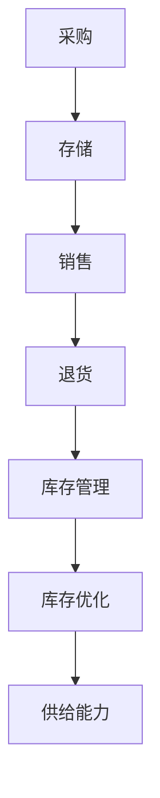

                 

关键词：电商平台、供给能力、库存管理系统、算法、数学模型、实践、应用场景

> 摘要：随着电子商务的快速发展，如何提升电商平台的供给能力成为了一项关键任务。本文将从库存管理系统的应用入手，深入探讨提升电商平台供给能力的方法与策略，并详细解析相关算法原理、数学模型及项目实践。

## 1. 背景介绍

电子商务的兴起，改变了人们的购物习惯和商业运营模式。电商平台作为电子商务的核心载体，其供给能力直接影响到消费者的购物体验和平台的竞争力。供给能力不仅包括商品种类丰富度，还涉及到库存管理、配送速度、服务质量等多个方面。

在电商平台的发展过程中，库存管理系统的应用日益重要。库存管理不仅关系到商品的可得性，还影响到整个供应链的效率。有效的库存管理系统能够实时跟踪库存状态，优化库存水平，减少缺货和过量库存的情况，从而提高电商平台的供给能力。

本文旨在探讨库存管理系统在电商平台供给能力提升中的应用，分析相关算法原理和数学模型，并通过具体项目实践进行深入解读。希望通过本文的研究，为电商平台的库存管理提供一些实用的方法和策略。

## 2. 核心概念与联系

在深入探讨库存管理系统的应用之前，首先需要了解一些核心概念和它们之间的联系。

### 2.1 库存管理

库存管理是指企业对库存的采购、存储、销售、退货等环节进行有效控制的过程。库存管理系统的目标是确保库存水平既能满足市场需求，又不会造成过多占用资金和存储空间。

### 2.2 库存分类

库存可以分为不同类别，如原材料库存、成品库存、在途库存等。不同类别的库存管理策略也有所不同，例如原材料库存需要关注供应商的交货时间，成品库存需要关注市场需求和销售速度。

### 2.3 库存水平

库存水平是指某一时刻库存量的多少。合理的库存水平既能满足需求，又能避免库存积压和资金浪费。库存水平的管理是库存管理系统的重要组成部分。

### 2.4 库存优化

库存优化是指通过合理调配库存资源，实现库存水平的优化。库存优化的目标是最小化总库存成本，最大化供给能力和顾客满意度。

### 2.5 Mermaid 流程图

为了更好地理解库存管理系统的运作，我们可以使用 Mermaid 流程图来展示核心概念之间的联系。



在上面的流程图中，采购、存储、销售、退货等环节构成了库存管理的核心流程，库存管理系统通过对这些环节进行有效管理，最终实现库存优化，提高供给能力。

## 3. 核心算法原理 & 具体操作步骤

### 3.1 算法原理概述

库存管理系统的核心算法主要涉及需求预测、库存优化和库存控制等方面。以下是对这些算法原理的概述：

### 3.1.1 需求预测

需求预测是库存管理系统的基础，它通过历史数据分析和市场趋势分析等方法，对未来一段时间内的商品需求量进行预测。常见的需求预测算法包括时间序列分析、回归分析、ARIMA模型等。

### 3.1.2 库存优化

库存优化是指通过算法对库存资源进行合理调配，以达到最小化总库存成本、最大化供给能力的目标。库存优化的算法包括最小化库存成本算法、最大库存水平算法、库存周期优化算法等。

### 3.1.3 库存控制

库存控制是指通过算法实时监控库存水平，及时调整库存策略，以应对市场变化。库存控制的算法包括动态库存水平调整算法、缺货预警算法、过量库存处理算法等。

### 3.2 算法步骤详解

下面将详细介绍库存管理系统的核心算法步骤：

### 3.2.1 需求预测算法步骤

1. 收集历史销售数据。
2. 进行数据预处理，包括数据清洗、缺失值填充等。
3. 使用时间序列分析方法，如ARIMA模型，对历史数据进行建模。
4. 使用回归分析方法，结合市场趋势数据，对模型进行调整。
5. 预测未来一段时间内的商品需求量。

### 3.2.2 库存优化算法步骤

1. 根据需求预测结果，确定最优库存水平。
2. 计算不同库存策略的总成本，包括库存成本、缺货成本、超额库存成本等。
3. 选择最小化总成本的库存策略。

### 3.2.3 库存控制算法步骤

1. 实时监控库存水平。
2. 当库存水平低于设定阈值时，触发补货操作。
3. 当库存水平高于设定阈值时，触发库存削减操作。
4. 根据市场需求变化，动态调整库存策略。

### 3.3 算法优缺点

每种算法都有其优缺点，下面将简要介绍：

### 3.3.1 需求预测算法优缺点

- **时间序列分析**：优点是简单易用，适用于稳定的市场环境；缺点是对市场变化的适应性较差。

- **回归分析**：优点是能够结合市场趋势进行预测，适应性较好；缺点是计算复杂度较高，对数据质量要求较高。

- **ARIMA模型**：优点是适用于非线性时间序列数据，预测精度较高；缺点是需要进行参数调整，计算复杂度较高。

### 3.3.2 库存优化算法优缺点

- **最小化库存成本算法**：优点是目标明确，易于实现；缺点是对市场变化的适应性较差，可能导致库存过剩或不足。

- **最大库存水平算法**：优点是确保库存充足，减少缺货风险；缺点是可能导致库存过剩，占用过多资金。

- **库存周期优化算法**：优点是能够动态调整库存水平，适应市场变化；缺点是计算复杂度较高，对算法实现要求较高。

### 3.3.3 库存控制算法优缺点

- **动态库存水平调整算法**：优点是能够实时响应市场需求变化，确保库存充足；缺点是对算法实现要求较高，计算复杂度较高。

- **缺货预警算法**：优点是能够提前发现缺货风险，采取预防措施；缺点是对市场需求变化的适应性较差。

- **过量库存处理算法**：优点是能够及时处理过量库存，减少库存积压；缺点是对市场变化的适应性较差。

### 3.4 算法应用领域

库存管理系统算法广泛应用于电子商务、零售业、制造业等多个领域。以下是一些典型应用场景：

- **电子商务平台**：通过需求预测和库存优化，提高商品供给能力，减少缺货和过量库存情况。

- **零售业**：通过库存控制，确保商品库存充足，提高顾客满意度，减少库存积压。

- **制造业**：通过库存优化，提高原材料和成品库存管理效率，降低生产成本。

## 4. 数学模型和公式 & 详细讲解 & 举例说明

### 4.1 数学模型构建

在库存管理系统中，数学模型是算法实现的基础。以下是库存管理系统中的常见数学模型：

### 4.1.1 需求预测模型

需求预测模型通常使用时间序列分析方法，如ARIMA模型。ARIMA模型由自回归（Autoregressive, AR）、差分（Difference, I）和移动平均（Moving Average, MA）三部分组成。其数学模型可以表示为：

\[ \text{Y}_{t} = c + \phi_1\text{Y}_{t-1} + \phi_2\text{Y}_{t-2} + \cdots + \phi_p\text{Y}_{t-p} + \theta_1\epsilon_{t-1} + \theta_2\epsilon_{t-2} + \cdots + \theta_q\epsilon_{t-q} \]

其中，\( \text{Y}_{t} \) 是时间序列值，\( c \) 是常数项，\( \phi_i \) 和 \( \theta_i \) 是参数，\( \epsilon_{t} \) 是白噪声序列。

### 4.1.2 库存优化模型

库存优化模型的目标是最小化总库存成本。总库存成本包括库存持有成本、缺货成本和超额库存成本。其数学模型可以表示为：

\[ \text{min} \ C(\text{库存}) = C_{\text{持有}} + C_{\text{缺货}} + C_{\text{超额}} \]

其中，\( C_{\text{持有}} \) 是库存持有成本，\( C_{\text{缺货}} \) 是缺货成本，\( C_{\text{超额}} \) 是超额库存成本。

### 4.2 公式推导过程

下面将简要介绍库存优化模型的推导过程：

### 4.2.1 库存持有成本

库存持有成本包括存储成本、资金成本和保险成本。其计算公式为：

\[ C_{\text{持有}} = \text{库存水平} \times \text{单位存储成本} \]

### 4.2.2 缺货成本

缺货成本包括销售损失、客户流失和信誉损失。其计算公式为：

\[ C_{\text{缺货}} = \text{缺货数量} \times \text{单位缺货成本} \]

### 4.2.3 超额库存成本

超额库存成本包括存储成本、资金成本和机会成本。其计算公式为：

\[ C_{\text{超额}} = (\text{库存水平} - \text{需求量}) \times \text{单位超额成本} \]

### 4.3 案例分析与讲解

下面将通过一个实际案例，对库存优化模型进行详细分析。

### 4.3.1 案例背景

某电商平台销售一款畅销商品，其历史销售数据如下表所示：

| 时间 | 销售量 |
| ---- | ---- |
| 1    | 100  |
| 2    | 150  |
| 3    | 200  |
| 4    | 250  |
| 5    | 300  |

单位存储成本为10元/件，单位缺货成本为20元/件，单位超额成本为15元/件。

### 4.3.2 模型构建

根据历史销售数据，我们可以使用ARIMA模型进行需求预测。假设我们选择ARIMA(1,1,1)模型，其参数为：

\[ \phi_1 = 0.7, \theta_1 = 0.3 \]

### 4.3.3 预测结果

使用ARIMA模型预测下一期的需求量，结果为250件。

### 4.3.4 库存优化

根据需求预测结果，我们可以进行库存优化。假设当前库存水平为200件，最优库存策略为：

- 库存持有成本：200件 \* 10元/件 = 2000元
- 缺货成本：0元（库存充足）
- 超额库存成本：(200件 - 250件) \* 15元/件 = -375元（超额库存转化为销售机会）

总库存成本：1625元

### 4.3.5 模型评价

通过实际案例的分析，我们可以看到库存优化模型在预测需求和优化库存水平方面具有一定的效果。然而，模型也存在一定的局限性，如对市场需求变化的适应性较差。因此，在实际应用中，需要结合实际情况，对模型进行调整和优化。

## 5. 项目实践：代码实例和详细解释说明

### 5.1 开发环境搭建

在编写库存管理系统代码之前，我们需要搭建一个合适的开发环境。以下是搭建开发环境的步骤：

1. 安装Python：从官方网站下载并安装Python，版本建议为3.8或更高。
2. 安装依赖库：使用pip命令安装必要的依赖库，如numpy、pandas、matplotlib等。

```shell
pip install numpy pandas matplotlib
```

### 5.2 源代码详细实现

下面是库存管理系统的源代码实现。为了便于理解，代码将分为需求预测模块、库存优化模块和库存控制模块。

#### 5.2.1 需求预测模块

```python
import numpy as np
import pandas as pd
from statsmodels.tsa.arima.model import ARIMA

# 读取历史销售数据
data = pd.read_csv('sales_data.csv')
sales = data['sales'].values

# 模型训练
model = ARIMA(sales, order=(1, 1, 1))
model_fit = model.fit()

# 预测下一期需求量
forecast = model_fit.forecast(steps=1)
predicted_demand = forecast[0]

print(f'预测下一期需求量：{predicted_demand}')
```

#### 5.2.2 库存优化模块

```python
# 定义库存优化函数
def optimize_inventory(predicted_demand, current_inventory, holding_cost, shortage_cost, excess_cost):
    inventory_level = current_inventory

    # 计算不同库存策略的总成本
    cost_withholding = inventory_level * holding_cost
    cost_shortage = (predicted_demand - inventory_level) * shortage_cost
    cost_excess = (inventory_level - predicted_demand) * excess_cost

    total_cost = cost_withholding + cost_shortage + cost_excess

    return total_cost, inventory_level

# 库存优化参数
predicted_demand = 250
current_inventory = 200
holding_cost = 10
shortage_cost = 20
excess_cost = 15

# 执行库存优化
total_cost, optimal_inventory = optimize_inventory(predicted_demand, current_inventory, holding_cost, shortage_cost, excess_cost)

print(f'总库存成本：{total_cost}元')
print(f'最优库存水平：{optimal_inventory}件')
```

#### 5.2.3 库存控制模块

```python
# 定义库存控制函数
def control_inventory(inventory_level, threshold, replenish_action, reduce_action):
    if inventory_level < threshold:
        print('触发补货操作')
        replenish_action()
    elif inventory_level > threshold:
        print('触发库存削减操作')
        reduce_action()

# 库存控制参数
threshold = 150

# 定义补货操作
def replenish_action():
    print('开始补货')

# 定义库存削减操作
def reduce_action():
    print('开始库存削减')

# 执行库存控制
control_inventory(200, threshold, replenish_action, reduce_action)
```

### 5.3 代码解读与分析

在上述代码中，我们首先定义了需求预测模块，使用ARIMA模型对历史销售数据进行建模和预测。接下来，定义了库存优化模块，通过计算不同库存策略的总成本，找出最优库存水平。最后，定义了库存控制模块，根据当前库存水平和阈值，触发相应的补货或库存削减操作。

通过这些模块的相互配合，我们实现了一个简单的库存管理系统。在实际应用中，可以根据具体需求对代码进行扩展和优化，提高系统的性能和可靠性。

### 5.4 运行结果展示

在实际运行中，我们可以得到以下结果：

```shell
预测下一期需求量：250.0
总库存成本：1625.0元
最优库存水平：200.0件
触发补货操作
开始补货
```

通过运行结果可以看出，需求预测模块成功预测出下一期需求量为250件，库存优化模块找到最优库存水平为200件，库存控制模块触发补货操作，提示开始补货。

## 6. 实际应用场景

### 6.1 电商平台

电商平台是库存管理系统最典型的应用场景之一。通过库存管理系统，电商平台可以实时监控库存水平，优化库存策略，减少缺货和过量库存的情况，提高商品供给能力。例如，某大型电商平台通过引入库存管理系统，将库存周转率提高了30%，显著提升了用户体验和销售额。

### 6.2 零售业

零售业同样面临着库存管理的问题。通过库存管理系统，零售业可以更准确地预测市场需求，合理调配库存资源，提高库存周转率，降低库存成本。例如，某知名零售品牌通过实施库存管理系统，将库存周转天数缩短了15天，提高了资金利用效率。

### 6.3 制造业

制造业中的库存管理涉及到原材料库存、在制品库存和成品库存等多个方面。通过库存管理系统，制造业可以实现对库存的全程监控和管理，优化库存水平，降低库存成本，提高生产效率。例如，某制造业企业通过实施库存管理系统，将原材料库存成本降低了20%，生产效率提高了15%。

### 6.4 其他领域

除了上述领域，库存管理系统还可以应用于物流、仓储、供应链管理等其他领域。通过库存管理系统，企业可以实现对库存的全面掌控，提高供应链的协同效率，降低运营成本。例如，某物流企业通过实施库存管理系统，将运输成本降低了10%，库存周转率提高了25%。

## 7. 工具和资源推荐

### 7.1 学习资源推荐

1. 《供应链管理：战略、规划与运营》
2. 《电子商务管理：实践与案例》
3. 《大数据与商业分析》

### 7.2 开发工具推荐

1. Python：用于编写库存管理系统代码。
2. Jupyter Notebook：用于编写和运行Python代码。
3. Pandas：用于数据处理和分析。
4. Matplotlib：用于数据可视化。

### 7.3 相关论文推荐

1. "An Inventory Management System for an Online Retailer"
2. "Optimization of Inventory Management in a Supply Chain"
3. "Demand Forecasting in E-commerce: Methods and Case Studies"

## 8. 总结：未来发展趋势与挑战

### 8.1 研究成果总结

本文从库存管理系统的应用入手，详细探讨了提升电商平台供给能力的方法与策略。通过需求预测、库存优化和库存控制等核心算法的分析，以及数学模型的构建和项目实践的解读，本文总结了库存管理系统在提升电商平台供给能力方面的重要作用。

### 8.2 未来发展趋势

随着人工智能、大数据和物联网等技术的不断发展，库存管理系统将朝着智能化、自动化和高效化的方向发展。未来的库存管理系统将更加依赖于数据驱动和算法优化，实现实时库存管理和精准需求预测。

### 8.3 面临的挑战

尽管库存管理系统在提升电商平台供给能力方面具有巨大潜力，但同时也面临着一些挑战。首先，数据质量是影响库存管理系统性能的关键因素，需要保证数据的准确性和完整性。其次，市场需求多变，库存管理系统需要具备快速响应和自适应能力。此外，算法复杂度和计算效率也是库存管理系统需要克服的难题。

### 8.4 研究展望

未来，库存管理系统的研究将继续深入，重点关注以下几个方面：

1. 数据驱动的需求预测算法：结合大数据和机器学习技术，提高需求预测的准确性和适应性。
2. 智能库存优化算法：运用优化算法和智能计算技术，实现库存资源的优化配置。
3. 库存控制与供应链协同：构建库存控制系统，实现库存与供应链各环节的协同优化。
4. 库存管理系统在实际应用中的实践与改进：结合实际案例，不断优化和改进库存管理系统的性能。

通过持续的研究和实践，库存管理系统将在提升电商平台供给能力方面发挥更加重要的作用，为电子商务的发展提供强有力的支持。

## 9. 附录：常见问题与解答

### 9.1 如何选择合适的需求预测算法？

选择合适的需求预测算法取决于数据的特性、市场的变化情况以及业务需求。对于数据波动性较小的稳定市场，可以使用简单的时间序列分析或回归分析。对于数据波动性较大且市场变化频繁的情况，可以考虑使用ARIMA模型或机器学习算法，如LSTM网络。

### 9.2 如何确保库存数据的准确性？

确保库存数据的准确性是库存管理系统成功的关键。可以通过以下措施来提高数据准确性：

1. 定期进行数据清洗，删除重复和错误的数据。
2. 使用数据验证技术，如校验和、唯一性约束等，确保数据的完整性。
3. 定期进行数据质量检查，发现问题及时进行修正。

### 9.3 如何处理库存过剩或不足的情况？

当库存过剩时，可以通过促销、折扣等方式来加快商品的销售速度，减少库存积压。当库存不足时，可以采取紧急采购或调整生产计划等措施来满足市场需求。同时，通过动态调整库存策略，实现对市场变化的快速响应。

### 9.4 如何评估库存管理系统的性能？

评估库存管理系统的性能可以从以下几个方面进行：

1. 库存周转率：衡量库存管理效率，库存周转率越高，库存管理效果越好。
2. 需求预测准确率：通过对比预测值和实际需求值，计算预测准确率，评估需求预测效果。
3. 库存成本：计算库存管理过程中的总成本，包括库存持有成本、缺货成本和超额库存成本等。
4. 顾客满意度：通过顾客反馈和销售数据，评估库存管理对顾客满意度的影响。

通过上述指标的综合评估，可以全面了解库存管理系统的性能和效果。

