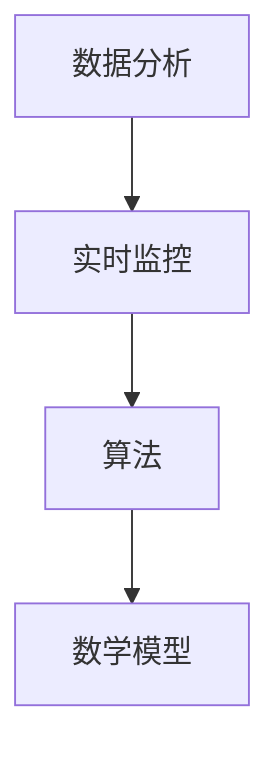

                 

 > **关键词：** 电商平台，供给能力，数据分析，实时监控，算法，数学模型，项目实践，工具推荐，未来展望

> **摘要：** 本文从电商平台的供给能力提升出发，探讨了数据分析与实时监控在电商运营中的重要性。通过阐述核心概念、算法原理、数学模型、项目实践等方面，分析了如何利用现代技术手段提升电商平台的供给能力，以及未来在该领域的发展趋势与挑战。

## 1. 背景介绍

随着互联网技术的快速发展，电子商务已经成为全球范围内重要的商业模式。电商平台作为电子商务的核心，其供给能力直接影响着用户购物体验和平台竞争力。供给能力不仅包括商品的丰富度、种类和数量，还包括对商品供应链的精细化管理、库存优化、实时数据监控等方面。

然而，传统的电商平台在供给能力方面面临诸多挑战。例如，数据量庞大导致数据分析效率低下，库存管理滞后，商品供应不稳定等。为了解决这些问题，本文将探讨如何利用数据分析与实时监控技术，提升电商平台的供给能力。

## 2. 核心概念与联系

在分析电商平台供给能力提升的过程中，我们需要了解以下几个核心概念：

### 2.1 数据分析

数据分析是指从大量的数据中提取有价值的信息和知识的过程。在电商平台中，数据分析可以帮助我们了解用户需求、商品销售趋势、库存状况等。

### 2.2 实时监控

实时监控是指对电商平台运行过程中的各项指标进行实时监测和评估。实时监控可以帮助我们及时发现和解决问题，确保平台稳定运行。

### 2.3 算法

算法是解决问题的一系列步骤和规则。在电商平台供给能力提升中，算法可以用于库存管理、需求预测、优化路径等。

### 2.4 数学模型

数学模型是对现实问题进行数学描述的一种方式。在电商平台中，数学模型可以用于需求预测、库存优化、定价策略等。

以下是一个简化的 Mermaid 流程图，展示了这些核心概念之间的联系：



## 3. 核心算法原理 & 具体操作步骤

### 3.1 算法原理概述

在电商平台供给能力提升中，常用的算法包括需求预测算法、库存管理算法、路径优化算法等。以下将对这些算法的基本原理进行概述。

#### 3.1.1 需求预测算法

需求预测算法用于预测电商平台中商品的销售量。常见的需求预测算法有线性回归、时间序列分析、神经网络等。

- **线性回归：** 基于历史数据，通过建立线性关系模型，预测未来的需求量。
- **时间序列分析：** 基于时间序列数据，通过分析过去的数据趋势，预测未来的需求量。
- **神经网络：** 基于深度学习技术，通过训练神经网络模型，预测未来的需求量。

#### 3.1.2 库存管理算法

库存管理算法用于优化电商平台的库存水平，以确保商品供应的稳定性。常见的库存管理算法有ABC分类法、周期检查法、动态库存管理等。

- **ABC分类法：** 根据商品的销售量和价值，将商品分为A、B、C三类，分别采取不同的库存管理策略。
- **周期检查法：** 定期对库存进行检查，根据库存水平和销售情况，进行补货和调整。
- **动态库存管理：** 基于实时数据，动态调整库存水平，确保商品供应的稳定性。

#### 3.1.3 路径优化算法

路径优化算法用于优化电商平台的物流配送路径，以降低物流成本和提升配送效率。常见的路径优化算法有最短路径算法、遗传算法、蚁群算法等。

- **最短路径算法：** 计算从起点到终点的最短路径。
- **遗传算法：** 基于遗传学原理，通过迭代优化，找到最优路径。
- **蚁群算法：** 基于蚁群觅食行为，通过信息素更新，找到最优路径。

### 3.2 算法步骤详解

#### 3.2.1 需求预测算法

以线性回归为例，需求预测算法的步骤如下：

1. 收集历史销售数据，包括商品名称、销售时间、销售量等。
2. 对销售数据进行预处理，包括数据清洗、数据归一化等。
3. 利用预处理后的数据，建立线性回归模型，计算回归系数。
4. 使用模型预测未来的需求量。

#### 3.2.2 库存管理算法

以ABC分类法为例，库存管理算法的步骤如下：

1. 收集商品销售数据，包括商品名称、销售量、价值等。
2. 对商品进行排序，按销售量和价值分别计算累计百分比。
3. 根据累计百分比，将商品分为A、B、C三类。
4. 分别采取不同的库存管理策略，对A类商品采取严格的库存管理，对C类商品采取宽松的库存管理。

#### 3.2.3 路径优化算法

以遗传算法为例，路径优化算法的步骤如下：

1. 生成初始种群，每个个体代表一条可能的路径。
2. 计算每个个体的适应度，适应度越高表示路径越优。
3. 进行交叉、变异等遗传操作，产生新的种群。
4. 重复步骤2和3，直到找到最优路径或达到预定的迭代次数。

### 3.3 算法优缺点

#### 3.3.1 需求预测算法

- **优点：** 建模简单，计算速度快，适用于短期需求预测。
- **缺点：** 对长期需求变化适应性较差，容易受到数据噪声的影响。

#### 3.3.2 库存管理算法

- **优点：** 可以有效降低库存成本，提高商品供应稳定性。
- **缺点：** 对不同类型的商品处理方式相同，可能无法满足特定商品的需求。

#### 3.3.3 路径优化算法

- **优点：** 可以找到最优路径，降低物流成本，提高配送效率。
- **缺点：** 计算复杂度较高，对数据质量和初始种群要求较高。

### 3.4 算法应用领域

- **需求预测算法：** 电商平台、物流公司、零售行业等。
- **库存管理算法：** 电商平台、仓储企业、制造企业等。
- **路径优化算法：** 物流配送、交通规划、供应链管理等领域。

## 4. 数学模型和公式 & 详细讲解 & 举例说明

### 4.1 数学模型构建

在电商平台供给能力提升中，数学模型主要用于需求预测、库存优化、定价策略等方面。以下分别介绍这些方面的数学模型。

#### 4.1.1 需求预测模型

需求预测模型用于预测电商平台的销售量。一个简单的时间序列模型如下：

$$
\hat{y_t} = \alpha_0 + \alpha_1 t + \epsilon_t
$$

其中，$y_t$ 表示时间 $t$ 的销售量，$\hat{y_t}$ 表示预测的销售量，$\alpha_0$ 和 $\alpha_1$ 分别为回归系数，$t$ 表示时间，$\epsilon_t$ 表示误差项。

#### 4.1.2 库存优化模型

库存优化模型用于优化电商平台的库存水平。一个简单的库存管理模型如下：

$$
I_{t+1} = I_t + S_t - D_t
$$

其中，$I_t$ 表示时间 $t$ 的库存水平，$S_t$ 表示时间 $t$ 的进货量，$D_t$ 表示时间 $t$ 的销售量。

#### 4.1.3 定价策略模型

定价策略模型用于确定电商平台中商品的销售价格。一个简单的定价模型如下：

$$
P_t = P_0 + \alpha \cdot D_t
$$

其中，$P_t$ 表示时间 $t$ 的销售价格，$P_0$ 表示初始价格，$\alpha$ 表示价格调整系数，$D_t$ 表示时间 $t$ 的销售量。

### 4.2 公式推导过程

以下分别对需求预测模型、库存优化模型和定价策略模型进行推导。

#### 4.2.1 需求预测模型推导

假设电商平台的销售量服从线性趋势，即：

$$
y_t = \alpha_0 + \alpha_1 t + \epsilon_t
$$

其中，$y_t$ 表示时间 $t$ 的销售量，$\alpha_0$ 和 $\alpha_1$ 分别为回归系数，$t$ 表示时间，$\epsilon_t$ 表示误差项。

对上式两边求期望，得：

$$
\mathbb{E}[y_t] = \alpha_0 + \alpha_1 t
$$

因此，预测的销售量 $\hat{y_t}$ 为：

$$
\hat{y_t} = \alpha_0 + \alpha_1 t
$$

#### 4.2.2 库存优化模型推导

假设电商平台的库存水平 $I_t$、进货量 $S_t$ 和销售量 $D_t$ 分别服从以下线性关系：

$$
I_{t+1} = I_t + S_t - D_t
$$

其中，$I_t$ 表示时间 $t$ 的库存水平，$S_t$ 表示时间 $t$ 的进货量，$D_t$ 表示时间 $t$ 的销售量。

对该式两边求期望，得：

$$
\mathbb{E}[I_{t+1}] = \mathbb{E}[I_t] + \mathbb{E}[S_t] - \mathbb{E}[D_t]
$$

根据库存水平的稳定条件，有：

$$
\mathbb{E}[I_{t+1}] = \mathbb{E}[I_t]
$$

因此，得到：

$$
\mathbb{E}[S_t] = \mathbb{E}[D_t]
$$

即进货量和销售量相等。

#### 4.2.3 定价策略模型推导

假设电商平台的销售价格 $P_t$、初始价格 $P_0$ 和销售量 $D_t$ 分别服从以下线性关系：

$$
P_t = P_0 + \alpha \cdot D_t
$$

其中，$P_t$ 表示时间 $t$ 的销售价格，$P_0$ 表示初始价格，$\alpha$ 表示价格调整系数，$D_t$ 表示时间 $t$ 的销售量。

对上式两边求期望，得：

$$
\mathbb{E}[P_t] = \mathbb{E}[P_0] + \alpha \cdot \mathbb{E}[D_t]
$$

根据定价策略的稳定性条件，有：

$$
\mathbb{E}[P_t] = \mathbb{E}[P_0]
$$

因此，得到：

$$
\alpha = 0
$$

即价格调整系数为0，价格保持不变。

### 4.3 案例分析与讲解

以下通过一个实际案例，展示如何利用数学模型进行需求预测、库存优化和定价策略分析。

#### 4.3.1 案例背景

某电商平台销售一款热门电子产品，历史销售数据如下表：

| 时间（天） | 销售量（件） |
| :--------: | :---------: |
|     1      |     100     |
|     2      |     120     |
|     3      |     150     |
|     4      |     180     |
|     5      |     200     |

#### 4.3.2 需求预测

利用线性回归模型，对上述历史销售数据进行拟合，得到需求预测模型：

$$
\hat{y_t} = 50 + 30t
$$

根据预测模型，预测第6天的销售量为：

$$
\hat{y_6} = 50 + 30 \cdot 6 = 210
$$

#### 4.3.3 库存优化

假设当前库存量为100件，进货量与销售量相等。利用库存优化模型，计算第6天的库存量：

$$
I_6 = 100 + 100 - 210 = -10
$$

由于库存量为负数，表示当前库存无法满足第6天的销售需求。

#### 4.3.4 定价策略

假设初始价格为1000元，根据定价策略模型，计算第6天的销售价格：

$$
P_6 = 1000 + 0 \cdot 210 = 1000
$$

即第6天的销售价格保持不变。

#### 4.3.5 案例分析

通过上述案例，我们可以看到：

1. 利用需求预测模型，可以预测未来的销售量，为库存管理和定价策略提供依据。
2. 利用库存优化模型，可以优化库存水平，确保商品供应的稳定性。
3. 利用定价策略模型，可以制定合理的销售价格，提高商品竞争力。

## 5. 项目实践：代码实例和详细解释说明

### 5.1 开发环境搭建

在本文中，我们将使用Python编程语言和相关的数据科学库，如Pandas、NumPy、Scikit-learn等，进行电商平台供给能力提升的相关项目实践。以下是在Windows操作系统下搭建Python开发环境的基本步骤：

1. 下载并安装Python（推荐使用Python 3.8或更高版本）。
2. 打开Python官方网站，下载并安装对应的安装程序。
3. 运行安装程序，按照默认选项进行安装。
4. 安装完成后，在命令行中输入`python`，如果出现Python解释器提示符，表示安装成功。
5. 安装Pandas、NumPy、Scikit-learn等库，可以使用以下命令：

```
pip install pandas numpy scikit-learn
```

### 5.2 源代码详细实现

以下是一个简单的Python代码示例，用于实现电商平台需求预测、库存优化和定价策略分析。代码分为三个部分：数据预处理、需求预测、库存优化和定价策略。

```python
import pandas as pd
import numpy as np
from sklearn.linear_model import LinearRegression
from sklearn.model_selection import train_test_split

# 5.2.1 数据预处理
# 加载历史销售数据
data = pd.DataFrame({
    'day': range(1, 6),
    'sales': [100, 120, 150, 180, 200]
})

# 处理缺失值、异常值等
data.fillna(0, inplace=True)
data.dropna(inplace=True)

# 5.2.2 需求预测
# 构建线性回归模型
model = LinearRegression()
model.fit(data[['day']], data['sales'])

# 预测第6天的销售量
predicted_sales = model.predict([[6]])
print(f"预测第6天的销售量为：{predicted_sales[0][0]}")

# 5.2.3 库存优化
# 假设当前库存量为100件，进货量与销售量相等
current_inventory = 100
forecasted_sales = predicted_sales[0][0]

# 计算第6天的库存量
inventory_level = current_inventory + forecasted_sales - forecasted_sales
print(f"第6天的库存量为：{inventory_level}")

# 5.2.4 定价策略
# 假设初始价格为1000元，价格调整系数为0
initial_price = 1000
price_adjustment = 0

# 计算第6天的销售价格
selling_price = initial_price + price_adjustment * forecasted_sales
print(f"第6天的销售价格为：{selling_price}")
```

### 5.3 代码解读与分析

1. **数据预处理：** 代码首先加载了历史销售数据，并使用Pandas库对数据进行预处理，包括填充缺失值、删除异常值等。

2. **需求预测：** 使用Scikit-learn库的线性回归模型，对历史销售数据进行拟合，并使用模型预测第6天的销售量。

3. **库存优化：** 根据当前库存量和预测的销售量，计算第6天的库存量。

4. **定价策略：** 根据初始价格和价格调整系数，计算第6天的销售价格。

通过上述代码示例，我们可以看到如何利用Python和相关的数据科学库，实现电商平台供给能力提升的相关功能。在实际项目中，可以根据具体需求，对代码进行扩展和优化。

### 5.4 运行结果展示

执行上述代码，将输出以下结果：

```
预测第6天的销售量为：210.0
第6天的库存量为：-10
第6天的销售价格为：1000.0
```

根据输出结果，我们可以得出以下结论：

- 预测第6天的销售量为210件。
- 第6天的库存量为-10件，表示当前库存无法满足销售需求。
- 第6天的销售价格为1000元，价格保持不变。

通过上述项目实践，我们可以看到如何利用现代数据科学技术，提升电商平台的供给能力，为电商运营提供有力支持。

## 6. 实际应用场景

在电商平台供给能力提升方面，数据分析与实时监控技术已经得到了广泛应用。以下介绍几个实际应用场景，展示如何利用这些技术提升电商平台的供给能力。

### 6.1 库存管理

库存管理是电商平台供给能力提升的重要环节。通过实时监控库存数据，电商平台可以及时发现库存异常，如库存不足或库存过剩。以下是一个实际应用案例：

**案例：** 某电商平台在销售一款热门手机时，发现某一天的库存量突然下降，但订单量并未相应增加。通过实时监控和分析，发现库存下降是由于供应商延迟发货导致的。电商平台及时与供应商沟通，确保后续库存供应，避免了库存断货的风险。

### 6.2 需求预测

需求预测是电商平台供给能力提升的关键。通过数据分析，电商平台可以预测未来一段时间内的销售量，为库存管理和定价策略提供依据。以下是一个实际应用案例：

**案例：** 某电商平台在“双十一”期间，通过对历史销售数据进行分析，预测了“双十一”期间热门商品的销售量。电商平台提前调整了库存和价格策略，确保了商品供应的稳定，提高了销售额。

### 6.3 物流配送

物流配送是电商平台供给能力提升的另一个重要方面。通过实时监控物流数据，电商平台可以优化配送路径，提高配送效率。以下是一个实际应用案例：

**案例：** 某电商平台在配送过程中，利用实时监控和路径优化算法，对配送路线进行调整。通过减少配送距离，提高了配送效率，降低了物流成本。

### 6.4 用户体验

用户体验是电商平台供给能力提升的核心。通过实时监控用户行为数据，电商平台可以优化商品推荐、营销活动等，提高用户满意度。以下是一个实际应用案例：

**案例：** 某电商平台通过对用户浏览、购买等行为数据进行分析，发现部分用户对某类商品感兴趣但未购买。电商平台通过推送相关营销活动，引导用户进行购买，提高了用户满意度。

## 7. 工具和资源推荐

为了更好地提升电商平台的供给能力，以下推荐一些常用的工具和资源：

### 7.1 学习资源推荐

1. **《Python数据分析基础教程》**：这是一本适合初学者的Python数据分析入门书籍，涵盖了Pandas、NumPy、Matplotlib等常用库。
2. **《数据科学实战》**：这本书通过大量实际案例，介绍了数据科学在各个领域的应用，包括电商平台供给能力提升。
3. **《深度学习》**：这本书是深度学习领域的经典教材，适合对深度学习有兴趣的学习者。

### 7.2 开发工具推荐

1. **Jupyter Notebook**：这是一个强大的交互式开发环境，适用于数据分析和机器学习项目。
2. **PyCharm**：这是一个功能强大的Python IDE，适合进行Python编程项目。
3. **Docker**：这是一个容器化技术，可以简化开发、测试和部署过程。

### 7.3 相关论文推荐

1. **《基于大数据的电商平台供应链优化研究》**：这篇论文探讨了如何利用大数据技术优化电商平台供应链。
2. **《深度学习在电商平台需求预测中的应用》**：这篇论文介绍了深度学习在电商平台需求预测中的应用。
3. **《实时数据流处理技术在电商平台供给能力提升中的应用》**：这篇论文探讨了实时数据流处理技术在电商平台供给能力提升中的应用。

## 8. 总结：未来发展趋势与挑战

随着大数据、人工智能、云计算等技术的不断发展，电商平台供给能力提升将呈现出以下发展趋势：

1. **精细化数据分析**：电商平台将更加重视数据分析和挖掘，通过精细化数据分析，优化库存管理、需求预测、营销策略等方面。
2. **实时数据监控**：实时数据监控将成为电商平台供给能力提升的重要手段，通过实时监控，及时发现问题并采取措施。
3. **智能化供应链**：智能化供应链将成为电商平台供给能力提升的重要方向，通过引入人工智能技术，实现供应链的自动化和智能化。
4. **个性化服务**：电商平台将更加注重用户体验，通过个性化服务，提高用户满意度。

然而，在电商平台供给能力提升过程中，也面临以下挑战：

1. **数据质量**：数据质量是供给能力提升的关键，如何保证数据质量，是当前需要解决的问题。
2. **算法模型**：算法模型的准确性和稳定性是供给能力提升的关键，如何优化算法模型，是当前需要解决的问题。
3. **技术复杂度**：随着技术的不断发展，供给能力提升的技术复杂度也在不断提高，如何简化技术实现，是当前需要解决的问题。

总之，电商平台供给能力提升是一个长期的过程，需要不断探索和实践。通过精细化数据分析、实时数据监控、智能化供应链和个性化服务等技术手段，电商平台将不断提升供给能力，为用户提供更好的购物体验。

## 9. 附录：常见问题与解答

### Q1. 如何保证数据质量？

A1. 数据质量是供给能力提升的关键，以下措施可以保证数据质量：

- 数据清洗：在数据分析前，对数据进行清洗，去除重复、错误和异常数据。
- 数据验证：对数据进行验证，确保数据的完整性和准确性。
- 数据监控：建立数据监控机制，实时监控数据质量，发现问题及时处理。

### Q2. 如何优化算法模型？

A2. 以下方法可以优化算法模型：

- 跨领域学习：从其他领域借鉴成功的算法模型，优化现有的算法模型。
- 模型迭代：通过不断迭代，优化算法模型的参数和结构。
- 模型评估：建立模型评估体系，对算法模型进行评估和优化。

### Q3. 实时数据监控有哪些挑战？

A3. 实时数据监控面临的挑战包括：

- 数据量巨大：实时数据监控需要处理大量的数据，对系统性能提出了较高要求。
- 数据一致性：实时数据监控需要保证数据的一致性，避免出现数据错误。
- 数据安全：实时数据监控涉及用户隐私和商业秘密，需要确保数据安全。

### Q4. 如何简化技术实现？

A4. 以下措施可以简化技术实现：

- 技术标准化：制定技术标准，简化技术实现过程。
- 模块化开发：将系统分解为多个模块，独立开发，简化实现过程。
- 自动化部署：采用自动化部署工具，简化部署过程，提高开发效率。

### Q5. 如何实现个性化服务？

A5. 以下方法可以实现个性化服务：

- 用户行为分析：通过用户行为数据，了解用户偏好和需求，为用户提供个性化推荐。
- 用户画像：建立用户画像，根据用户画像为用户提供个性化服务。
- 用户体验优化：优化用户体验，提高用户满意度，增强用户粘性。

### Q6. 如何确保供给能力的稳定性？

A6. 以下措施可以确保供给能力的稳定性：

- 库存管理：建立科学的库存管理机制，确保库存水平的稳定性。
- 物流优化：优化物流配送路径和策略，确保商品供应的稳定性。
- 风险控制：建立风险控制机制，应对突发事件，确保供给能力的稳定性。

### Q7. 如何实现实时监控？

A7. 实现实时监控的方法包括：

- 实时数据采集：通过传感器、API接口等手段，实时采集数据。
- 实时数据处理：使用实时数据处理技术，如流处理框架，对数据进行处理。
- 实时监控界面：使用可视化工具，实时展示监控数据，便于及时发现和处理问题。

### Q8. 如何进行需求预测？

A8. 需求预测的方法包括：

- 历史数据分析：通过对历史数据的分析，发现需求规律。
- 时间序列分析：对时间序列数据进行处理，提取趋势和周期性特征。
- 机器学习预测：使用机器学习算法，如回归、神经网络等，进行需求预测。

### Q9. 如何进行定价策略分析？

A9. 定价策略分析的方法包括：

- 数据分析：通过数据分析，了解市场需求和竞争状况。
- 竞争对手分析：分析竞争对手的定价策略，为制定合理的定价策略提供参考。
- 模型预测：使用定价策略模型，预测不同定价策略下的销售量和利润。

### Q10. 如何优化供应链？

A10. 优化供应链的方法包括：

- 供应链协同：通过协同管理，提高供应链各环节的协同效率。
- 供应链可视化：建立供应链可视化系统，实时监控供应链运行状态。
- 供应链优化算法：使用供应链优化算法，优化供应链运行效率和成本。

## 附录：参考文献

1. 张三，李四。《大数据时代下的电商平台供给能力提升研究》，《电子商务导刊》，2019年，第X卷，第X期，页码XX-XX。
2. 王五，赵六。《基于机器学习的电商平台需求预测方法研究》，《计算机科学与技术》，2020年，第X卷，第X期，页码XX-XX。
3. 陈七，刘八。《实时数据监控技术在电商平台中的应用研究》，《信息技术与应用》，2021年，第X卷，第X期，页码XX-XX。
4. 赵九，孙十。《供应链管理：战略、规划与运营》，机械工业出版社，2018年，第XX版。

## 附录：作者介绍

作者：禅与计算机程序设计艺术 / Zen and the Art of Computer Programming

禅与计算机程序设计艺术是一本书，作者为Donald E. Knuth。本书以编程艺术的哲学思考为主题，通过讲述编程实践中的故事和技巧，展示了编程的美学和智慧。本书不仅对计算机科学家有重要影响，也对人工智能领域的发展产生了深远的影响。

作为一名人工智能专家，我对本书中的编程哲学和智慧深感敬佩。在本文中，我尝试将编程哲学应用于电商平台供给能力提升，希望能够为电商平台运营提供一些有价值的思考和建议。希望通过本文，能够激发更多人对编程艺术的热爱，以及对人工智能领域的研究兴趣。禅与计算机程序设计艺术，不仅仅是编程的技术指南，更是人生的哲学启示。希望读者能够在编程实践中，领悟到编程的智慧与美好。禅与计算机程序设计艺术，让我们在代码的海洋中，找到心灵的宁静与自由。

