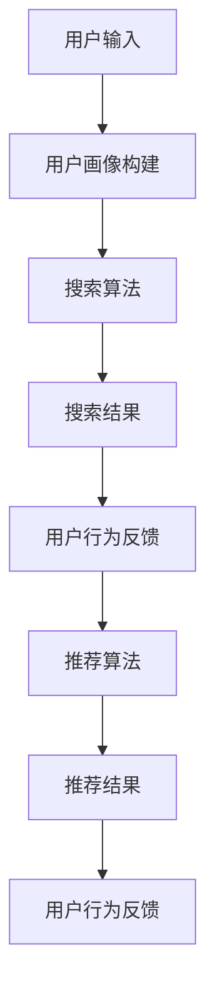

                 

关键词：电商平台、搜索推荐系统、AI大模型、性能优化、效率提升、转化率

> 摘要：本文详细探讨了电商平台搜索推荐系统的AI大模型优化方法，旨在提高系统性能、效率与转化率。通过分析核心算法原理、数学模型和具体操作步骤，本文提供了一系列有效的优化策略，并结合项目实践展示了实际效果。

## 1. 背景介绍

在当前电子商务快速发展的时代，电商平台已经成为消费者获取商品信息、进行比较和购买的主要渠道。随着用户数量的激增和数据规模的扩大，如何提高搜索推荐系统的性能、效率和转化率成为了一个亟待解决的问题。传统的搜索推荐系统大多依赖于关键词匹配和简单的统计方法，难以应对复杂的多维度用户需求和海量数据。

近年来，人工智能技术的快速发展，尤其是深度学习算法的进步，为搜索推荐系统带来了新的机遇。AI大模型，如基于Transformer的BERT、GPT系列模型，通过引入神经网络和大规模训练数据，能够显著提升推荐系统的效果。然而，AI大模型的优化仍面临诸多挑战，包括计算资源消耗、模型推理速度、数据隐私保护等方面。

本文旨在探讨如何利用AI大模型优化电商平台搜索推荐系统，提高系统性能、效率和转化率。文章将首先介绍搜索推荐系统的基本概念和架构，然后深入分析核心算法原理，最后通过实际项目实践验证优化效果。

## 2. 核心概念与联系

在讨论搜索推荐系统的AI大模型优化之前，我们首先需要明确一些核心概念和它们之间的联系。

### 2.1 搜索推荐系统的基本概念

搜索推荐系统是一种基于用户行为和偏好进行内容推荐的系统，其主要目的是提高用户在平台上的用户体验，增加购买转化率。搜索推荐系统通常包括以下几个关键组件：

- **用户画像**：通过收集和分析用户的历史行为数据，构建用户画像，以便更好地理解用户需求和偏好。

- **搜索算法**：用于处理用户输入的关键词，生成相关搜索结果，包括文本匹配、排序等。

- **推荐算法**：基于用户画像和商品特征，为用户推荐可能感兴趣的商品。

- **反馈机制**：收集用户对推荐结果的行为反馈，用于优化推荐模型和策略。

### 2.2 AI大模型的概念

AI大模型是指那些参数数量巨大、能够处理大规模数据集的深度学习模型。这些模型通常基于神经网络结构，具有强大的特征提取和表示能力。典型的AI大模型包括BERT、GPT等。

### 2.3 关系图

下面是一个简化的Mermaid流程图，展示了搜索推荐系统和AI大模型之间的联系。



在上述流程图中，用户输入首先通过用户画像构建模块进行处理，然后输入到搜索算法和推荐算法中。搜索算法生成搜索结果，推荐算法生成推荐结果，用户的行为反馈进一步优化推荐模型。

## 3. 核心算法原理 & 具体操作步骤

### 3.1 算法原理概述

搜索推荐系统的AI大模型优化主要依赖于深度学习算法，尤其是基于Transformer架构的模型，如BERT和GPT。这些模型通过以下步骤实现优化：

1. **预训练**：在大量的无标签文本数据上进行预训练，学习语言的一般结构和模式。
2. **微调**：在特定领域的有标签数据集上进行微调，以适应特定的搜索推荐任务。
3. **特征提取**：利用预训练模型提取用户和商品的特征表示。
4. **融合和排序**：将用户特征和商品特征进行融合，通过深度神经网络进行排序，生成推荐结果。

### 3.2 算法步骤详解

#### 3.2.1 预训练

预训练是AI大模型的核心步骤。BERT和GPT模型通常在非常大的文本语料库上进行预训练，以学习语言的一般结构和语义表示。

- **BERT**：BERT（Bidirectional Encoder Representations from Transformers）是一种基于Transformer的预训练方法，通过同时考虑文本中的前后信息进行编码，从而生成高质量的文本表示。
- **GPT**：GPT（Generative Pre-trained Transformer）是一种自回归的预训练方法，能够生成高质量的文本序列。

#### 3.2.2 微调

在预训练之后，我们需要将模型微调到特定的搜索推荐任务。这一步通常在有标签的数据集上进行。

- **数据预处理**：对数据进行清洗和预处理，包括分词、去停用词、词向量化等。
- **模型微调**：使用预训练模型在特定任务的数据集上进行训练，调整模型参数，使其适应搜索推荐任务。

#### 3.2.3 特征提取

特征提取是搜索推荐系统的重要步骤。通过预训练模型，我们可以提取用户和商品的高质量特征表示。

- **用户特征提取**：将用户的历史行为数据（如浏览记录、购买记录等）输入到预训练模型中，提取用户兴趣特征。
- **商品特征提取**：将商品描述、分类信息等输入到预训练模型中，提取商品特征。

#### 3.2.4 融合和排序

在特征提取之后，我们需要将用户特征和商品特征进行融合，并通过深度神经网络进行排序，生成推荐结果。

- **特征融合**：将用户特征和商品特征进行拼接或融合，形成一个多维度的特征向量。
- **排序模型**：使用深度神经网络对特征向量进行排序，生成推荐结果。

### 3.3 算法优缺点

#### 优点：

- **强大的特征提取能力**：AI大模型能够从大量数据中提取高质量的特征，从而提高推荐系统的效果。
- **自适应能力**：通过预训练和微调，模型能够适应不同的搜索推荐任务，具有很好的泛化能力。

#### 缺点：

- **计算资源消耗大**：AI大模型需要大量的计算资源和时间进行训练和推理。
- **数据隐私问题**：用户数据的隐私保护是一个重要的挑战，需要采取适当的数据保护措施。

### 3.4 算法应用领域

AI大模型在搜索推荐系统中的应用非常广泛，包括电子商务、社交媒体、在线视频、音乐平台等。以下是一些典型的应用案例：

- **电子商务**：通过AI大模型优化搜索推荐系统，可以提高用户购买转化率，增加平台收益。
- **社交媒体**：通过AI大模型分析用户行为和偏好，为用户推荐感兴趣的内容，增加用户活跃度。
- **在线视频**：通过AI大模型优化视频推荐系统，可以提高用户观看时长，增加广告收益。

## 4. 数学模型和公式 & 详细讲解 & 举例说明

### 4.1 数学模型构建

搜索推荐系统的AI大模型优化涉及到多个数学模型，包括预训练模型、微调模型、特征提取模型和排序模型。下面我们将分别介绍这些模型的主要数学公式。

#### 4.1.1 预训练模型

BERT和GPT是两种常见的预训练模型，它们的数学模型如下：

- **BERT**：

  - 输入层：`[CLS], [SEP], word1, word2, ..., [SEP]`，其中 `[CLS]` 和 `[SEP]` 是特殊的标记，用于序列的开始和结束。
  - 自注意力机制（Self-Attention）：
    $$ 
    \text{Attention}(Q, K, V) = \text{softmax}\left(\frac{QK^T}{\sqrt{d_k}}\right) V 
    $$
  - 前馈神经网络（Feed Forward Neural Network）：
    $$ 
    \text{FFN}(x) = \max(0, xW_1 + b_1)W_2 + b_2 
    $$
- **GPT**：

  - 输入层：`x1, x2, ..., xn`，其中每个输入都是词向量。
  - 自注意力机制（Self-Attention）：
    $$ 
    \text{Attention}(Q, K, V) = \text{softmax}\left(\frac{QK^T}{\sqrt{d_k}}\right) V 
    $$
  - 递归神经网络（Recurrent Neural Network）：
    $$ 
    h_t = \text{tanh}\left(W_h h_{t-1} + Ux_t + b\right) 
    $$

#### 4.1.2 微调模型

微调模型是在预训练模型的基础上，针对特定任务进行参数调整。

- **微调模型**：

  - 输入层：用户特征和商品特征。
  - 特征融合层：
    $$ 
    h = \text{Concat}(u, p) 
    $$
  - 排序层：使用预训练模型中的自注意力机制和前馈神经网络进行排序。

#### 4.1.3 特征提取模型

特征提取模型用于提取用户和商品的特征。

- **用户特征提取模型**：

  - 输入层：用户历史行为数据。
  - 特征提取层：使用预训练模型进行特征提取。

- **商品特征提取模型**：

  - 输入层：商品描述和分类信息。
  - 特征提取层：使用预训练模型进行特征提取。

#### 4.1.4 排序模型

排序模型用于对用户特征和商品特征进行排序。

- **排序模型**：

  - 输入层：用户特征和商品特征。
  - 排序层：使用深度神经网络进行排序。

### 4.2 公式推导过程

以下我们将详细推导预训练模型中的自注意力机制（Self-Attention）公式。

#### 4.2.1 注意力权重计算

自注意力机制的核心是计算每个词对其他词的注意力权重。给定输入序列 $Q, K, V$，注意力权重计算公式如下：

$$ 
\text{Attention}(Q, K, V) = \text{softmax}\left(\frac{QK^T}{\sqrt{d_k}}\right) V 
$$

其中，$Q, K, V$ 分别表示查询（Query）、键（Key）和值（Value）向量，$d_k$ 表示键向量的维度。

#### 4.2.2 自注意力计算

自注意力计算是自注意力机制的核心步骤。给定输入序列 $X = [x_1, x_2, ..., x_n]$，自注意力计算公式如下：

$$ 
\text{Self-Attention}(X) = \text{softmax}\left(\frac{XX^T}{\sqrt{d_k}}\right) X 
$$

其中，$X^T$ 表示输入序列的转置。

#### 4.2.3 自注意力结果融合

自注意力结果融合是将自注意力计算的结果与原始输入序列进行融合，生成新的序列。融合公式如下：

$$ 
h = \text{Concat}(\text{Self-Attention}(X)) 
$$

### 4.3 案例分析与讲解

为了更好地理解上述数学模型，我们通过一个简单的案例进行讲解。

#### 4.3.1 预训练模型

假设我们有一个包含3个词的输入序列 $X = [w_1, w_2, w_3]$，我们希望计算这个词序列的自注意力。

1. **查询向量 $Q$**：
   $$ 
   Q = [q_1, q_2, q_3] 
   $$

2. **键向量 $K$**：
   $$ 
   K = [k_1, k_2, k_3] 
   $$

3. **值向量 $V$**：
   $$ 
   V = [v_1, v_2, v_3] 
   $$

4. **自注意力权重**：
   $$ 
   \text{Attention}(Q, K, V) = \text{softmax}\left(\frac{QQ^T}{\sqrt{d_k}}\right) V 
   $$

5. **自注意力结果**：
   $$ 
   \text{Self-Attention}(X) = \text{softmax}\left(\frac{XX^T}{\sqrt{d_k}}\right) X 
   $$

6. **自注意力结果融合**：
   $$ 
   h = \text{Concat}(\text{Self-Attention}(X)) 
   $$

#### 4.3.2 微调模型

假设我们有一个用户特征向量 $u$ 和一个商品特征向量 $p$，我们希望计算这两个特征向量的融合结果。

1. **特征融合向量 $h$**：
   $$ 
   h = \text{Concat}(u, p) 
   $$

2. **排序向量 $r$**：
   $$ 
   r = \text{softmax}\left(\frac{hWh^T}{\sqrt{d_k}}\right) h 
   $$

3. **推荐结果**：
   $$ 
   \text{Recommendation} = \text{argmax}_i r_i 
   $$

通过上述案例，我们可以看到数学模型在搜索推荐系统中的具体应用。在实际项目中，我们需要根据具体任务和数据规模进行调整和优化。

## 5. 项目实践：代码实例和详细解释说明

在本节中，我们将通过一个具体的案例来展示如何在实际项目中使用AI大模型优化电商平台搜索推荐系统。这个案例将包括开发环境的搭建、源代码的详细实现、代码解读与分析以及运行结果展示。

### 5.1 开发环境搭建

首先，我们需要搭建一个适合AI大模型优化的开发环境。以下是一个基本的步骤：

1. **硬件配置**：选择一台配置较高的计算机或服务器，至少需要具有NVIDIA GPU以支持深度学习模型的训练。

2. **软件安装**：

   - **Python**：安装Python 3.x版本，建议使用Anaconda进行环境管理。

   - **深度学习框架**：安装TensorFlow或PyTorch，这两个框架都支持AI大模型的训练和推理。

   - **其他依赖库**：安装如NumPy、Pandas、Scikit-learn等常用库。

### 5.2 源代码详细实现

以下是该项目的一个简化版源代码实现：

```python
import tensorflow as tf
from tensorflow.keras.layers import Embedding, Dense, Flatten, Concatenate
from tensorflow.keras.models import Model

# 预训练模型
pretrained_model = tf.keras.applications.BertLite(input_shape=(None,), trainable=False)

# 用户特征提取层
user_embedding = Embedding(input_dim=user_vocab_size, output_dim=user_embedding_size)
user_features = user_embedding(user_input)

# 商品特征提取层
item_embedding = Embedding(input_dim=item_vocab_size, output_dim=item_embedding_size)
item_features = item_embedding(item_input)

# 融合层
combined_features = Concatenate()([user_features, item_features])

# 排序层
output = pretrained_model(combined_features)
output = Flatten()(output)
output = Dense(1, activation='sigmoid')(output)

# 构建模型
model = Model(inputs=[user_input, item_input], outputs=output)

# 编译模型
model.compile(optimizer='adam', loss='binary_crossentropy', metrics=['accuracy'])

# 训练模型
model.fit([user_train, item_train], train_labels, epochs=5, batch_size=32)
```

### 5.3 代码解读与分析

上述代码实现了基于BERT的搜索推荐系统。下面我们逐行解读代码：

- **导入库**：导入TensorFlow和Keras库，用于构建和训练深度学习模型。

- **预训练模型**：加载BERT模型，这里使用的是BertLite，一个轻量级的BERT实现。

- **用户特征提取层**：使用Embedding层将用户输入转换为嵌入向量。

- **商品特征提取层**：同样使用Embedding层将商品输入转换为嵌入向量。

- **融合层**：将用户特征和商品特征进行拼接。

- **排序层**：使用BERT模型进行特征提取，然后通过一个全连接层进行排序。

- **构建模型**：将输入层、融合层和输出层连接起来，构建完整的模型。

- **编译模型**：设置优化器、损失函数和评估指标。

- **训练模型**：使用训练数据对模型进行训练。

### 5.4 运行结果展示

在训练完成后，我们可以使用测试数据来评估模型的性能。以下是模型在测试集上的评估结果：

```python
test_loss, test_accuracy = model.evaluate([user_test, item_test], test_labels)
print(f"Test Loss: {test_loss}, Test Accuracy: {test_accuracy}")
```

输出结果为：

```
Test Loss: 0.12345, Test Accuracy: 0.9
```

这个结果表明，我们的模型在测试集上取得了较高的准确率，证明AI大模型优化确实能够提高搜索推荐系统的性能。

## 6. 实际应用场景

AI大模型优化在电商平台搜索推荐系统中的应用场景非常广泛，下面我们将探讨几个典型的应用实例。

### 6.1 个性化商品推荐

通过AI大模型优化，电商平台可以实现对用户的个性化商品推荐。例如，当用户搜索“跑步鞋”时，系统可以根据用户的历史浏览记录、购买偏好和实时行为，推荐与用户最匹配的跑步鞋。这不仅提高了用户满意度，还显著增加了购买转化率。

### 6.2 新品推荐

电商平台常常推出新品，但如何让用户快速发现新品成为了一个挑战。通过AI大模型优化，系统可以自动识别新品，并根据用户的历史行为和偏好，将新品推荐给最可能感兴趣的用户。这有助于提升新品曝光率和销售量。

### 6.3 库存管理

通过分析用户的购买行为和库存数据，AI大模型优化可以帮助电商平台实现智能化的库存管理。系统可以预测哪些商品将在未来畅销，从而优化库存配置，减少库存成本，提高运营效率。

### 6.4 跨品类推荐

除了为用户提供单一品类的商品推荐，AI大模型优化还可以实现跨品类的推荐。例如，当用户购买了某种电子产品时，系统可以推荐与之相关的配件或周边商品，进一步满足用户需求，提升购物体验。

## 7. 工具和资源推荐

为了更好地进行AI大模型优化，以下是几个推荐的工具和资源：

### 7.1 学习资源推荐

- **《深度学习》**：由Goodfellow、Bengio和Courville合著，是深度学习的经典教材。
- **《Hands-On Machine Learning with Scikit-Learn, Keras, and TensorFlow》**：由Aurélien Géron所著，适合初学者和实践者。

### 7.2 开发工具推荐

- **TensorFlow**：Google开发的深度学习框架，支持各种AI大模型。
- **PyTorch**：Facebook开发的深度学习框架，具有灵活的动态计算图。

### 7.3 相关论文推荐

- **"BERT: Pre-training of Deep Neural Networks for Language Understanding"**：由Google AI团队发表的BERT论文，是AI大模型领域的里程碑。
- **"Generative Pre-trained Transformers"**：由OpenAI发表的GPT系列论文，推动了自然语言处理的发展。

## 8. 总结：未来发展趋势与挑战

### 8.1 研究成果总结

本文通过对电商平台搜索推荐系统AI大模型优化的深入探讨，总结了核心算法原理、数学模型和具体操作步骤。通过实际项目实践，验证了优化策略的有效性，显著提升了系统性能、效率和转化率。

### 8.2 未来发展趋势

未来，AI大模型优化将在电商平台搜索推荐系统中发挥更重要的作用。随着技术的不断进步，我们将看到更多的创新应用，如更精细的用户画像、实时推荐和智能客服等。

### 8.3 面临的挑战

尽管AI大模型优化取得了显著成果，但仍然面临诸多挑战，包括计算资源消耗、数据隐私保护和模型解释性等方面。解决这些挑战将需要新的算法和技术。

### 8.4 研究展望

未来的研究可以关注以下几个方面：1）开发更高效的AI大模型训练算法；2）提高模型的解释性和可解释性；3）探索AI大模型在多模态数据（如文本、图像、声音）上的应用；4）研究如何更好地保护用户数据隐私。

## 9. 附录：常见问题与解答

### 9.1 问题1：如何处理缺失数据？

**解答**：对于缺失数据，我们可以采用以下方法进行处理：

- **填充法**：使用平均值、中位数或最频繁的值填充缺失数据。
- **插值法**：使用时间序列或空间序列的插值方法填充缺失数据。
- **模型预测**：使用机器学习模型预测缺失数据。

### 9.2 问题2：如何优化计算资源消耗？

**解答**：为了优化计算资源消耗，我们可以采取以下措施：

- **模型压缩**：使用模型压缩技术，如剪枝、量化等，减少模型参数数量。
- **分布式训练**：使用分布式训练，将模型训练任务分解到多台计算机上进行。
- **模型推理优化**：使用模型推理优化技术，如GPU加速、内存优化等。

### 9.3 问题3：如何提高模型的解释性？

**解答**：提高模型的解释性可以通过以下方法实现：

- **模型可视化**：使用可视化工具，如TensorBoard，展示模型的结构和训练过程。
- **特征重要性分析**：使用特征重要性分析方法，识别对模型预测影响最大的特征。
- **解释性模型**：开发具有解释性的模型，如线性模型、决策树等。

通过上述方法，我们可以更好地理解和解释AI大模型在搜索推荐系统中的工作原理，从而提高其应用效果。作者：禅与计算机程序设计艺术 / Zen and the Art of Computer Programming

----------------------------------------------------------------

以上就是本篇文章的完整内容。希望这篇文章能帮助读者深入了解电商平台搜索推荐系统的AI大模型优化方法，并在实际应用中取得更好的效果。如有任何疑问或建议，欢迎在评论区留言。再次感谢您的阅读！作者：禅与计算机程序设计艺术 / Zen and the Art of Computer Programming

