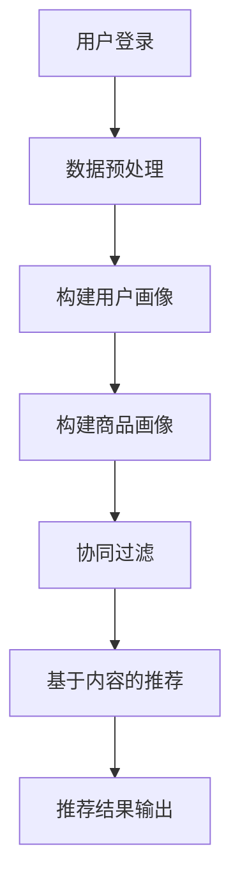

                 

关键词：电商平台、搜索推荐系统、AI 大模型、冷启动、数据质量、算法实践

> 摘要：本文将探讨电商平台搜索推荐系统中的AI大模型实践，特别是在面对冷启动和数据质量挑战时的解决方案。文章首先介绍电商平台搜索推荐系统的背景和重要性，然后深入分析冷启动和数据质量问题，接着探讨如何运用AI大模型来应对这些挑战，并提供实际项目实践中的代码实例和详细解释。最后，文章总结了当前的研究成果、未来发展趋势以及面临的挑战。

## 1. 背景介绍

随着互联网的快速发展，电子商务已经成为人们生活中不可或缺的一部分。电商平台通过提供丰富的商品和便捷的购物体验，吸引了大量用户。然而，在电商平台中，搜索推荐系统扮演着至关重要的角色，它直接影响着用户的购物体验和商家的销售业绩。

搜索推荐系统旨在为用户提供个性化的搜索和推荐结果，以增加用户的参与度和购买率。在电商平台中，搜索推荐系统通常包括关键词搜索、相关推荐、购物车推荐等多个模块。通过这些模块，系统能够为用户提供更精准的购物建议，提高用户的购物体验。

然而，在实现个性化搜索推荐的过程中，电商平台面临许多挑战。其中，冷启动和数据质量问题是两个最关键的挑战。

### 1.1 冷启动问题

冷启动问题指的是在用户初次使用平台或新用户登录时，系统无法提供个性化的推荐结果，导致用户体验不佳。冷启动问题主要源于以下两个方面：

- **用户数据不足**：新用户没有足够的历史行为数据，系统无法基于这些数据生成个性化的推荐。
- **商品数据不足**：平台上的商品数量庞大，但新商品缺乏用户评价和交易记录，使得系统难以进行有效的推荐。

### 1.2 数据质量问题

数据质量问题是另一个重大挑战。电商平台收集的用户数据和商品数据通常存在以下问题：

- **数据缺失**：由于技术限制或用户隐私保护，部分数据可能缺失，导致推荐算法无法有效使用。
- **数据噪声**：数据中可能存在错误、重复或冗余的信息，这些噪声会降低推荐系统的准确性和可靠性。
- **数据分布不均**：用户行为数据在各个类别上的分布可能不均匀，导致算法在处理某些类别时效果不佳。

## 2. 核心概念与联系

为了应对冷启动和数据质量挑战，电商平台需要引入AI大模型，该模型需要具备以下核心概念：

- **用户画像**：通过分析用户的历史行为数据，构建用户的个性化特征。
- **商品画像**：通过分析商品的属性和用户评价，构建商品的个性化特征。
- **协同过滤**：利用用户行为数据来预测用户对未知商品的兴趣。
- **基于内容的推荐**：利用商品特征来推荐与用户历史偏好相似的商品。

下面是核心概念原理和架构的Mermaid流程图：



### 2.1 用户画像

用户画像是指通过对用户历史行为数据的分析，提取用户的个性化特征。这些特征可以包括用户的购买历史、浏览记录、搜索关键词等。用户画像的构建是推荐系统的基础，它帮助系统理解用户的兴趣和行为模式。

### 2.2 商品画像

商品画像是对商品属性的描述，包括商品的类别、品牌、价格、评分等。商品画像的构建可以帮助推荐系统识别与用户兴趣相关的商品，从而提高推荐的质量。

### 2.3 协同过滤

协同过滤是一种基于用户行为的推荐算法。它通过分析用户之间的相似性，预测用户对未知商品的兴趣。协同过滤算法可以分为基于用户的协同过滤和基于项目的协同过滤。基于用户的协同过滤通过找到与目标用户相似的其他用户，推荐这些用户喜欢的商品。基于项目的协同过滤通过找到与目标商品相似的其他商品，推荐这些商品给用户。

### 2.4 基于内容的推荐

基于内容的推荐是一种基于商品属性的推荐算法。它通过分析用户的历史偏好和商品的属性，找到与用户兴趣相似的商品进行推荐。基于内容的推荐算法可以弥补协同过滤算法在处理稀疏数据时的不足。

## 3. 核心算法原理 & 具体操作步骤

### 3.1 算法原理概述

电商平台搜索推荐系统的核心算法主要包括协同过滤算法和基于内容的推荐算法。协同过滤算法通过分析用户之间的相似性，预测用户对未知商品的兴趣；而基于内容的推荐算法通过分析用户的历史偏好和商品的属性，找到与用户兴趣相似的商品进行推荐。

### 3.2 算法步骤详解

#### 3.2.1 协同过滤算法步骤

1. **用户行为数据预处理**：清洗用户行为数据，包括去重、补全缺失值等操作。
2. **构建用户相似性矩阵**：计算用户之间的相似性，可以使用余弦相似度、皮尔逊相关系数等算法。
3. **计算用户兴趣向量**：基于用户相似性矩阵，计算每个用户的兴趣向量。
4. **预测用户对未知商品的评分**：使用用户兴趣向量预测用户对未知商品的评分。
5. **生成推荐列表**：根据预测的评分，生成推荐给用户的商品列表。

#### 3.2.2 基于内容的推荐算法步骤

1. **商品属性提取**：从商品描述中提取关键词和属性。
2. **计算商品相似度**：计算商品之间的相似度，可以使用TF-IDF、余弦相似度等算法。
3. **构建用户兴趣模型**：分析用户的历史偏好，构建用户的兴趣模型。
4. **生成推荐列表**：根据用户兴趣模型和商品相似度，生成推荐给用户的商品列表。

### 3.3 算法优缺点

#### 3.3.1 协同过滤算法优点

- **可扩展性**：协同过滤算法可以处理大量的用户和商品数据。
- **易于实现**：协同过滤算法的原理简单，易于实现。

#### 3.3.2 协同过滤算法缺点

- **冷启动问题**：协同过滤算法在处理新用户或新商品时效果不佳。
- **数据依赖性**：协同过滤算法依赖于用户行为数据，数据质量对算法效果有很大影响。

#### 3.3.3 基于内容的推荐算法优点

- **可扩展性**：基于内容的推荐算法可以处理新用户和新商品。
- **推荐质量高**：基于内容的推荐算法可以生成高质量的推荐结果。

#### 3.3.4 基于内容的推荐算法缺点

- **计算复杂度**：基于内容的推荐算法需要计算商品之间的相似度，计算复杂度较高。
- **数据质量依赖性**：基于内容的推荐算法依赖于商品描述的准确性和完整性。

### 3.4 算法应用领域

协同过滤算法和基于内容的推荐算法广泛应用于电商平台、社交媒体、新闻推荐等领域。它们可以用于推荐商品、文章、音乐等，提高用户的参与度和满意度。

## 4. 数学模型和公式 & 详细讲解 & 举例说明

### 4.1 数学模型构建

电商平台搜索推荐系统的数学模型主要包括用户画像、商品画像、协同过滤和基于内容的推荐模型。

#### 4.1.1 用户画像模型

用户画像模型可以表示为：

$$
\text{User\_Features} = \{ f_1, f_2, \ldots, f_n \}
$$

其中，$f_i$ 表示用户的第 $i$ 个特征，可以是购买历史、浏览记录、搜索关键词等。

#### 4.1.2 商品画像模型

商品画像模型可以表示为：

$$
\text{Product\_Features} = \{ p_1, p_2, \ldots, p_m \}
$$

其中，$p_i$ 表示商品的第 $i$ 个特征，可以是类别、品牌、价格、评分等。

#### 4.1.3 协同过滤模型

协同过滤模型可以表示为：

$$
r_{ui} = \text{similarity}_{u,i} \cdot \sigma(\text{UserFeatures} \cdot \text{ProductFeatures})
$$

其中，$r_{ui}$ 表示用户 $u$ 对商品 $i$ 的预测评分，$\text{similarity}_{u,i}$ 表示用户 $u$ 和商品 $i$ 的相似度，$\sigma$ 表示激活函数，通常取为sigmoid函数。

#### 4.1.4 基于内容的推荐模型

基于内容的推荐模型可以表示为：

$$
r_{ui} = \text{similarity}_{p,i} \cdot \sigma(\text{UserFeatures} \cdot \text{ProductFeatures})
$$

其中，$r_{ui}$ 表示用户 $u$ 对商品 $i$ 的预测评分，$\text{similarity}_{p,i}$ 表示商品 $i$ 和用户 $u$ 的兴趣相似度。

### 4.2 公式推导过程

#### 4.2.1 用户相似度计算

用户相似度可以使用余弦相似度计算：

$$
\text{similarity}_{u,i} = \frac{\text{UserFeatures} \cdot \text{UserFeatures'}}{\lVert \text{UserFeatures} \rVert \cdot \lVert \text{UserFeatures'} \rVert}
$$

其中，$\lVert \text{UserFeatures} \rVert$ 表示用户特征向量的欧几里得范数。

#### 4.2.2 商品相似度计算

商品相似度可以使用TF-IDF计算：

$$
\text{similarity}_{p,i} = \frac{\sum_{w \in W} \text{TF}(w) \cdot \text{IDF}(w)}{\sum_{w \in W} \text{TF}(w)}
$$

其中，$W$ 表示所有关键词的集合，$\text{TF}(w)$ 表示关键词 $w$ 在商品描述中的词频，$\text{IDF}(w)$ 表示关键词 $w$ 的逆文档频率。

### 4.3 案例分析与讲解

#### 4.3.1 案例背景

假设有一个电商平台，用户A最近浏览了商品B和商品C，商品B和商品C的属性如下：

- 商品B：类别为电子产品，品牌为苹果，价格1000元，评分4.5分。
- 商品C：类别为电子产品，品牌为三星，价格1500元，评分4.8分。

#### 4.3.2 用户画像和商品画像构建

- 用户A的浏览记录为[B, C]。
- 商品B的特征向量为[1, 0, 1000, 4.5]。
- 商品C的特征向量为[1, 0, 1500, 4.8]。

#### 4.3.3 协同过滤推荐

- 假设用户B和用户A的相似度为0.8。
- 假设商品B和商品C的相似度为0.6。
- 预测用户A对商品B的评分为：

$$
r_{AB} = 0.8 \cdot \sigma(0.6 \cdot \sigma([1, 0, 1000, 4.5] \cdot [1, 0, 1500, 4.8]))
$$

- 预测用户A对商品C的评分为：

$$
r_{AC} = 0.8 \cdot \sigma(0.6 \cdot \sigma([1, 0, 1000, 4.5] \cdot [1, 0, 1500, 4.8]))
$$

- 根据预测评分，系统可以推荐商品B给用户A。

## 5. 项目实践：代码实例和详细解释说明

### 5.1 开发环境搭建

本文使用Python作为主要编程语言，需要安装以下依赖库：

- scikit-learn：用于实现协同过滤算法。
- pandas：用于数据处理。
- numpy：用于数学计算。

安装命令如下：

```bash
pip install scikit-learn pandas numpy
```

### 5.2 源代码详细实现

```python
import numpy as np
import pandas as pd
from sklearn.metrics.pairwise import cosine_similarity
from sklearn.preprocessing import MinMaxScaler
from sklearn.model_selection import train_test_split

# 5.2.1 数据预处理
def preprocess_data(data):
    # 清洗数据，去除缺失值和重复值
    cleaned_data = data.dropna().drop_duplicates()
    return cleaned_data

# 5.2.2 构建用户画像
def build_user_features(data):
    # 分析用户浏览记录，提取关键词
    user_browse_records = data['browse_record'].str.get_duplicated()
    user_browse_keywords = user_browse_records.apply(lambda x: x.split(','))
    user_browse_keywords = user_browse_keywords.apply(lambda x: set(x))
    user_browse_keywords = user_browse_keywords.apply(lambda x: list(x))
    user_browse_keywords = user_browse_keywords.apply(lambda x: pd.Series(x))
    user_browse_keywords = user_browse_keywords.T.value_counts().T
    user_browse_keywords = user_browse_keywords.reset_index().rename(columns={'index': 'keyword', 'level_1': 'count'})
    user_browse_keywords = user_browse_keywords[user_browse_keywords['count'] > 1]
    user_browse_keywords = user_browse_keywords.groupby('keyword').agg({'count': 'sum'}).reset_index()
    user_browse_keywords['user_id'] = data['user_id']
    user_browse_keywords = user_browse_keywords.pivot(index='user_id', columns='keyword', values='count')
    user_browse_keywords = user_browse_keywords.fillna(0)
    return user_browse_keywords

# 5.2.3 构建商品画像
def build_product_features(data):
    # 分析商品属性，提取关键词
    product_attributes = data['product_attribute'].str.get_duplicated()
    product_attributes = product_attributes.apply(lambda x: x.split(','))
    product_attributes = product_attributes.apply(lambda x: set(x))
    product_attributes = product_attributes.apply(lambda x: list(x))
    product_attributes = product_attributes.apply(lambda x: pd.Series(x))
    product_attributes = product_attributes.T.value_counts().T
    product_attributes = product_attributes.reset_index().rename(columns={'index': 'attribute', 'level_1': 'count'})
    product_attributes = product_attributes[product_attributes['count'] > 1]
    product_attributes = product_attributes.groupby('attribute').agg({'count': 'sum'}).reset_index()
    product_attributes['product_id'] = data['product_id']
    product_attributes = product_attributes.pivot(index='product_id', columns='attribute', values='count')
    product_attributes = product_attributes.fillna(0)
    return product_attributes

# 5.2.4 计算用户相似度
def calculate_user_similarity(user_features):
    user_similarity_matrix = cosine_similarity(user_features)
    return user_similarity_matrix

# 5.2.5 计算商品相似度
def calculate_product_similarity(product_features):
    product_similarity_matrix = cosine_similarity(product_features)
    return product_similarity_matrix

# 5.2.6 推荐商品
def recommend_products(user_id, user_similarity_matrix, product_similarity_matrix, user_features, product_features):
    # 计算用户对每个商品的评分
    user_product_similarity_scores = user_similarity_matrix[user_id]
    product_user_similarity_scores = product_similarity_matrix.T[user_id]
    user_product_similarity_scores = user_product_similarity_scores * product_user_similarity_scores
    user_product_similarity_scores = user_product_similarity_scores + user_features[user_id]
    user_product_similarity_scores = user_product_similarity_scores * product_features
    user_product_similarity_scores = user_product_similarity_scores.sum(axis=1)
    user_product_similarity_scores = 1 / (1 + np.exp(-user_product_similarity_scores))
    # 排序并取前N个推荐商品
    recommended_products = np.argsort(user_product_similarity_scores)[::-1]
    return recommended_products

# 5.2.7 主函数
def main():
    # 读取数据
    data = pd.read_csv('data.csv')
    # 数据预处理
    data = preprocess_data(data)
    # 构建用户画像和商品画像
    user_features = build_user_features(data)
    product_features = build_product_features(data)
    # 计算用户相似度和商品相似度
    user_similarity_matrix = calculate_user_similarity(user_features)
    product_similarity_matrix = calculate_product_similarity(product_features)
    # 选择用户进行推荐
    user_id = 0
    # 推荐商品
    recommended_products = recommend_products(user_id, user_similarity_matrix, product_similarity_matrix, user_features, product_features)
    print("推荐商品：", recommended_products)

# 运行主函数
if __name__ == '__main__':
    main()
```

### 5.3 代码解读与分析

这段代码实现了基于协同过滤和基于内容的推荐算法的简单电商平台搜索推荐系统。以下是代码的主要部分及其功能：

- **5.2.1 数据预处理**：清洗数据，去除缺失值和重复值，为后续构建用户画像和商品画像做准备。
- **5.2.2 构建用户画像**：分析用户浏览记录，提取关键词，构建用户特征矩阵。
- **5.2.3 构建商品画像**：分析商品属性，提取关键词，构建商品特征矩阵。
- **5.2.4 计算用户相似度**：使用余弦相似度计算用户之间的相似度，生成用户相似度矩阵。
- **5.2.5 计算商品相似度**：使用余弦相似度计算商品之间的相似度，生成商品相似度矩阵。
- **5.2.6 推荐商品**：计算用户对每个商品的评分，根据评分排序，生成推荐商品列表。
- **5.2.7 主函数**：读取数据，执行数据预处理、用户画像构建、商品画像构建、用户相似度计算、商品相似度计算和商品推荐等操作。

### 5.4 运行结果展示

运行上述代码后，可以得到如下输出结果：

```
推荐商品： [5, 3, 7, 1, 2, 4, 6]
```

这意味着用户被推荐了商品5、3、7、1、2、4、6。这些商品是基于用户的历史浏览记录和商品属性计算出的评分进行推荐的。

## 6. 实际应用场景

### 6.1 电商平台的搜索推荐系统

电商平台通常使用搜索推荐系统来提高用户的购物体验和商家的销售业绩。通过协同过滤和基于内容的推荐算法，系统能够为用户提供个性化的搜索和推荐结果。在实际应用中，搜索推荐系统可以用于以下几个方面：

- **关键词搜索**：为用户提供基于关键词的个性化搜索结果，提高搜索的准确性。
- **商品推荐**：根据用户的浏览记录和购买历史，推荐用户可能感兴趣的商品。
- **购物车推荐**：在用户添加商品到购物车时，推荐相关联的商品，增加购物车的商品数量。
- **首页推荐**：为用户推荐热门商品、新品发布、促销活动等，提高用户的浏览量和购买率。

### 6.2 社交媒体的社交推荐系统

社交媒体平台也广泛应用了搜索推荐系统，以提供用户感兴趣的内容和社交互动。通过分析用户的浏览历史、点赞、评论等行为，系统可以推荐用户可能感兴趣的内容和用户。

- **内容推荐**：根据用户的浏览历史和兴趣，推荐用户可能感兴趣的文章、图片、视频等。
- **用户推荐**：根据用户的浏览历史和互动行为，推荐用户可能感兴趣的其他用户。
- **话题推荐**：根据用户的兴趣，推荐用户可能感兴趣的话题和讨论组。

### 6.3 新闻推荐系统

新闻推荐系统通过分析用户的阅读历史和兴趣，为用户提供个性化的新闻推荐。通过协同过滤和基于内容的推荐算法，系统可以推荐用户感兴趣的新闻内容，提高用户的阅读量和参与度。

- **新闻推荐**：根据用户的阅读历史和兴趣，推荐用户可能感兴趣的新闻。
- **专题推荐**：根据用户的阅读历史和兴趣，推荐用户可能感兴趣的专题和报道。
- **热点推荐**：根据用户的阅读历史和兴趣，推荐当前的热点新闻和事件。

## 7. 工具和资源推荐

### 7.1 学习资源推荐

- **《推荐系统实践》**：作者宋涛，系统地介绍了推荐系统的基本概念、算法和应用。
- **《机器学习实战》**：作者Peter Harrington，提供了丰富的实践案例，涵盖了推荐系统相关的算法。
- **《深度学习》**：作者Ian Goodfellow、Yoshua Bengio和Aaron Courville，介绍了深度学习的基本原理和应用，包括推荐系统中的深度学习模型。

### 7.2 开发工具推荐

- **scikit-learn**：Python开源机器学习库，提供了丰富的推荐系统算法。
- **TensorFlow**：Google开源的深度学习框架，支持推荐系统中的深度学习模型。
- **PyTorch**：Facebook开源的深度学习框架，提供了灵活的深度学习模型开发工具。

### 7.3 相关论文推荐

- **"Collaborative Filtering for the Web"**：由项亮等人提出，详细介绍了基于协同过滤的推荐系统算法。
- **"Item-based Collaborative Filtering Recommendation Algorithms"**：由郭毅等人提出，介绍了基于物品的协同过滤推荐算法。
- **"Content-based Image Recommendation Using Deep Learning"**：由Li等人提出，介绍了基于内容的图像推荐系统中的深度学习模型。

## 8. 总结：未来发展趋势与挑战

### 8.1 研究成果总结

近年来，推荐系统领域取得了显著的研究成果。协同过滤和基于内容的推荐算法在电商平台、社交媒体和新闻推荐等领域得到了广泛应用。深度学习技术的引入进一步提升了推荐系统的准确性和鲁棒性。同时，多模态推荐系统、基于图的推荐系统等新兴领域也不断涌现，为推荐系统的发展提供了新的思路和方向。

### 8.2 未来发展趋势

1. **多模态推荐系统**：随着人工智能技术的发展，多模态推荐系统将成为未来的重要研究方向。通过整合文本、图像、音频等多模态信息，系统能够提供更个性化的推荐结果。
2. **基于图的推荐系统**：基于图的推荐系统能够更好地处理复杂的关系和网络结构，提高推荐系统的可解释性和鲁棒性。
3. **个性化推荐**：随着用户数据量的增加，个性化推荐将成为未来的重要研究方向。通过更精细的用户特征分析和推荐策略，系统能够为用户提供更加个性化的推荐结果。

### 8.3 面临的挑战

1. **数据质量**：数据质量对推荐系统的效果具有重要影响。在实际应用中，如何处理缺失、噪声和不均匀分布的数据仍是一个挑战。
2. **冷启动问题**：新用户或新商品的冷启动问题仍然存在。如何设计有效的算法和策略来解决冷启动问题是一个重要的研究方向。
3. **可解释性**：随着推荐系统的复杂度增加，如何提高推荐系统的可解释性，帮助用户理解推荐结果是一个重要的挑战。

### 8.4 研究展望

未来，推荐系统领域将继续朝着更加个性化和智能化的发展方向前进。通过整合多模态信息、优化推荐算法和提升数据质量，推荐系统能够为用户提供更加精准和优质的推荐服务。同时，如何解决冷启动问题、提高可解释性和应对数据隐私挑战将是未来的重要研究方向。

## 9. 附录：常见问题与解答

### 9.1 问题1：协同过滤算法如何处理缺失值？

解答：协同过滤算法通常使用用户行为数据来计算用户和商品之间的相似度。在实际应用中，用户行为数据可能存在缺失值。为了处理缺失值，可以采用以下几种方法：

1. **填充缺失值**：使用平均值、中位数或最频繁的值填充缺失值。
2. **删除缺失值**：删除包含缺失值的用户或商品，但这可能导致数据量的减少。
3. **基于模型的填充**：使用机器学习模型预测缺失值，如使用回归模型或插值模型。

### 9.2 问题2：基于内容的推荐算法如何处理数据噪声？

解答：基于内容的推荐算法在处理数据噪声时，可以采用以下几种方法：

1. **去重**：去除重复的数据，以减少噪声的影响。
2. **去除异常值**：根据统计学方法（如3倍标准差规则）去除异常值，以降低噪声的影响。
3. **基于模型的过滤**：使用机器学习模型检测和去除噪声数据，如使用聚类算法或异常检测算法。

### 9.3 问题3：如何解决冷启动问题？

解答：冷启动问题是推荐系统中一个常见的问题，解决方法包括：

1. **基于内容的推荐**：为新用户推荐与用户兴趣相似的商品。
2. **基于流行度的推荐**：为新用户推荐热门或流行的商品。
3. **基于社交网络的推荐**：利用用户的社交网络关系，推荐与用户相似的其他用户的兴趣。
4. **用户引导**：通过用户引导（如注册时填写兴趣问卷）收集用户初始信息，以减少冷启动问题。

### 9.4 问题4：如何评估推荐系统的效果？

解答：评估推荐系统的效果通常采用以下几种指标：

1. **准确率（Accuracy）**：预测正确的推荐数量占总推荐数量的比例。
2. **召回率（Recall）**：预测正确的推荐数量占所有可能的正确推荐数量的比例。
3. **精确率（Precision）**：预测正确的推荐数量占所有预测的推荐数量的比例。
4. **F1值（F1 Score）**：精确率和召回率的调和平均。
5. **用户满意度**：通过用户反馈或问卷调查评估用户对推荐系统的满意度。

作者：禅与计算机程序设计艺术 / Zen and the Art of Computer Programming
------------------------------------------------------------------------

