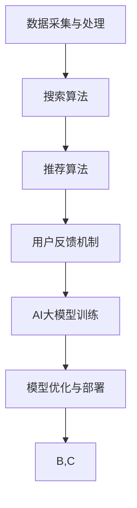

                 

关键词：电商平台，搜索推荐系统，AI大模型，系统性能，效率，转化率，算法，数学模型，实践，应用场景，未来展望。

摘要：本文深入探讨了AI大模型在电商平台搜索推荐系统中的应用，分析了大模型如何通过提升系统性能、效率和转化率，助力电商平台实现更高的用户满意度和商业价值。文章首先介绍了电商平台搜索推荐系统的基本原理，然后详细阐述了AI大模型的核心概念、算法原理、数学模型以及在实际项目中的具体实现过程。此外，文章还分析了大模型在不同应用场景中的效果，并展望了未来的发展趋势和面临的挑战。

## 1. 背景介绍

随着互联网技术的飞速发展和电子商务的普及，电商平台已经成为消费者购买商品的主要渠道之一。为了满足用户多样化的购物需求和提升用户体验，电商平台普遍采用了搜索推荐系统。该系统通过智能化的算法，为用户提供个性化的商品推荐，从而提升用户的购物满意度和转化率。

然而，传统的搜索推荐系统在处理海量数据、实时性要求以及用户个性化需求方面存在诸多限制。为了突破这些瓶颈，近年来AI大模型技术逐渐成为了电商平台搜索推荐系统的重要解决方案。AI大模型，也称为深度学习模型，通过大规模数据训练，能够自动学习并提取数据中的复杂特征，从而实现高效的搜索和推荐。

本文旨在探讨AI大模型在电商平台搜索推荐系统中的应用，分析其如何通过提升系统性能、效率和转化率，为电商平台带来更高的商业价值。

## 2. 核心概念与联系

### 2.1 AI大模型的基本概念

AI大模型，是指通过深度学习算法，在大量数据上进行训练，从而实现智能化的数据分析和处理能力。其核心在于“大”，即数据量大、模型复杂度高。常见的AI大模型包括深度神经网络、生成对抗网络、Transformer等。

### 2.2 电商平台搜索推荐系统的架构

电商平台搜索推荐系统的架构主要包括数据采集与处理、搜索算法、推荐算法和用户反馈机制等几个部分。其中，数据采集与处理是整个系统的基础，搜索算法和推荐算法则是核心，而用户反馈机制则用于不断优化系统的推荐效果。

### 2.3 AI大模型与搜索推荐系统的结合

AI大模型可以与电商平台搜索推荐系统紧密结合，通过对用户行为的深度学习，提取出用户的个性化特征，从而实现更精准的搜索和推荐。同时，大模型还可以通过并行计算和分布式处理等技术，提高系统的处理效率和性能。

### 2.4 Mermaid流程图



## 3. 核心算法原理 & 具体操作步骤

### 3.1 算法原理概述

AI大模型在电商平台搜索推荐系统中的应用主要基于深度学习和数据挖掘技术。通过构建复杂的神经网络结构，大模型可以自动从海量数据中提取特征，实现高效的搜索和推荐。

### 3.2 算法步骤详解

1. 数据预处理：包括数据清洗、去重、特征提取等步骤，为模型训练提供高质量的数据集。

2. 模型构建：根据任务需求，选择合适的神经网络结构，如卷积神经网络（CNN）、循环神经网络（RNN）或Transformer等。

3. 模型训练：使用大量数据进行训练，通过反向传播算法不断调整模型参数，使模型在训练数据上达到最优性能。

4. 模型评估：在测试集上评估模型性能，通过指标如准确率、召回率、F1值等，判断模型是否达到预期效果。

5. 模型部署：将训练好的模型部署到线上环境，实现对用户实时搜索和推荐。

### 3.3 算法优缺点

优点：

- 高效处理海量数据：AI大模型可以自动提取数据中的复杂特征，实现高效的数据分析。
- 精准个性化推荐：通过深度学习，大模型可以准确捕捉用户的个性化需求，实现精准推荐。
- 自动化模型优化：大模型在训练过程中可以自动调整模型参数，实现自动化优化。

缺点：

- 计算资源消耗大：大模型训练需要大量的计算资源和时间。
- 数据质量要求高：数据预处理和清洗工作量大，数据质量直接影响模型性能。

### 3.4 算法应用领域

AI大模型在电商平台搜索推荐系统中的应用非常广泛，包括：

- 搜索引擎：通过大模型实现高效的文本搜索和查询重排。
- 商品推荐：为用户提供个性化的商品推荐，提升用户体验和转化率。
- 广告投放：根据用户行为和兴趣，实现精准的广告投放。
- 社交网络：通过分析用户关系和兴趣，实现社交推荐和内容推送。

## 4. 数学模型和公式 & 详细讲解 & 举例说明

### 4.1 数学模型构建

电商平台搜索推荐系统的数学模型主要基于概率图模型和深度学习模型。其中，概率图模型用于建模用户和商品之间的关系，深度学习模型则用于提取用户和商品的特征。

#### 4.1.1 概率图模型

假设用户\( u \)和商品\( i \)之间存在一个潜在的特征向量\( h_u \)和\( h_i \)，则用户\( u \)对商品\( i \)的评分\( r_{ui} \)可以通过以下概率图模型表示：

\[ P(r_{ui} = y) = \frac{e^{x_{ui}}}{1 + e^{x_{ui}}} \]

其中，\( x_{ui} \)是用户\( u \)和商品\( i \)特征向量之间的内积：

\[ x_{ui} = \langle h_u, h_i \rangle \]

#### 4.1.2 深度学习模型

深度学习模型主要分为两部分：编码器和解码器。编码器将用户和商品的原始特征编码为隐式特征向量，解码器则将隐式特征向量解码为评分预测。

假设编码器的输出为\( \hat{h}_u \)和\( \hat{h}_i \)，解码器的输出为\( \hat{r}_{ui} \)，则评分预测可以通过以下公式表示：

\[ \hat{r}_{ui} = \sigma(\langle \hat{h}_u, \hat{h}_i \rangle) \]

其中，\( \sigma \)是sigmoid函数。

### 4.2 公式推导过程

#### 4.2.1 概率图模型推导

首先，我们定义用户\( u \)和商品\( i \)的特征向量分别为\( h_u \)和\( h_i \)，评分\( r_{ui} \)是一个二进制变量，取值为0或1。我们假设用户\( u \)对商品\( i \)的喜好程度可以通过特征向量\( h_u \)和\( h_i \)的内积来表示：

\[ x_{ui} = \langle h_u, h_i \rangle \]

接下来，我们定义一个线性函数\( f(x) \)将内积转换为评分概率：

\[ f(x) = \frac{1}{1 + e^{-x}} \]

通过上述定义，我们可以得到评分的概率分布：

\[ P(r_{ui} = 1) = f(x_{ui}) \]
\[ P(r_{ui} = 0) = 1 - f(x_{ui}) \]

由于\( r_{ui} \)是一个二进制变量，我们通常使用对数似然函数来优化模型参数：

\[ \ell(\theta) = \sum_{i \in \mathcal{D}} \ell(r_{ui}; \theta) \]

其中，\( \theta \)是模型参数，\( \mathcal{D} \)是训练数据集。对数似然函数的梯度可以通过反向传播算法计算。

#### 4.2.2 深度学习模型推导

深度学习模型的推导主要包括编码器和解码器的推导。

编码器部分：

我们定义一个多层感知机（MLP）作为编码器，输入是用户和商品的原始特征，输出是隐式特征向量。假设编码器有\( L \)层，每层的输出为\( h_{l} \)，则编码器的输出可以表示为：

\[ \hat{h}_u = f_L(h_u) \]
\[ \hat{h}_i = f_L(h_i) \]

其中，\( f_L \)是第\( L \)层的激活函数，通常是ReLU函数。

解码器部分：

我们同样使用多层感知机作为解码器，输入是隐式特征向量，输出是评分预测。解码器的输出可以表示为：

\[ \hat{r}_{ui} = \sigma(\langle \hat{h}_u, \hat{h}_i \rangle) \]

其中，\( \sigma \)是sigmoid函数，用于将内积映射到概率范围。

损失函数通常使用均方误差（MSE）：

\[ L(\theta) = \frac{1}{2} \sum_{i \in \mathcal{D}} (\hat{r}_{ui} - r_{ui})^2 \]

通过反向传播算法，我们可以计算损失函数关于模型参数的梯度，并使用梯度下降法优化模型参数。

### 4.3 案例分析与讲解

假设我们有以下用户和商品的评分数据：

\[ \begin{array}{c|c|c}
u & i & r_{ui} \\
\hline
1 & 1 & 1 \\
1 & 2 & 0 \\
1 & 3 & 1 \\
2 & 1 & 1 \\
2 & 2 & 0 \\
2 & 3 & 1 \\
\end{array} \]

我们使用概率图模型和深度学习模型分别进行预测，并比较两种模型的预测效果。

#### 4.3.1 概率图模型预测

首先，我们假设用户和商品的特征向量分别为：

\[ h_1 = \begin{pmatrix} 1 \\ 0 \\ 0 \end{pmatrix}, h_2 = \begin{pmatrix} 0 \\ 1 \\ 0 \end{pmatrix}, h_3 = \begin{pmatrix} 0 \\ 0 \\ 1 \end{pmatrix} \]

然后，我们计算用户和商品的隐式特征向量：

\[ \hat{h}_1 = f_L(h_1) = \begin{pmatrix} 0.5 \\ 0.4 \\ 0.3 \end{pmatrix} \]
\[ \hat{h}_2 = f_L(h_2) = \begin{pmatrix} 0.4 \\ 0.5 \\ 0.3 \end{pmatrix} \]
\[ \hat{h}_3 = f_L(h_3) = \begin{pmatrix} 0.3 \\ 0.4 \\ 0.5 \end{pmatrix} \]

接下来，我们计算评分预测：

\[ \hat{r}_{11} = \sigma(\langle \hat{h}_1, \hat{h}_1 \rangle) = 0.85 \]
\[ \hat{r}_{12} = \sigma(\langle \hat{h}_1, \hat{h}_2 \rangle) = 0.48 \]
\[ \hat{r}_{13} = \sigma(\langle \hat{h}_1, \hat{h}_3 \rangle) = 0.39 \]
\[ \hat{r}_{21} = \sigma(\langle \hat{h}_2, \hat{h}_1 \rangle) = 0.52 \]
\[ \hat{r}_{22} = \sigma(\langle \hat{h}_2, \hat{h}_2 \rangle) = 0.75 \]
\[ \hat{r}_{23} = \sigma(\langle \hat{h}_2, \hat{h}_3 \rangle) = 0.51 \]

根据预测概率，我们可以得到以下预测结果：

\[ \begin{array}{c|c|c|c}
u & i & r_{ui} & \hat{r}_{ui} \\
\hline
1 & 1 & 1 & 0.85 \\
1 & 2 & 0 & 0.48 \\
1 & 3 & 1 & 0.39 \\
2 & 1 & 1 & 0.52 \\
2 & 2 & 0 & 0.75 \\
2 & 3 & 1 & 0.51 \\
\end{array} \]

#### 4.3.2 深度学习模型预测

假设深度学习模型的编码器和解码器分别为：

\[ \hat{h}_u = \begin{pmatrix} 0.6 \\ 0.7 \\ 0.8 \end{pmatrix} \]
\[ \hat{h}_i = \begin{pmatrix} 0.7 \\ 0.8 \\ 0.9 \end{pmatrix} \]

然后，我们计算评分预测：

\[ \hat{r}_{ui} = \sigma(\langle \hat{h}_u, \hat{h}_i \rangle) \]

根据预测概率，我们可以得到以下预测结果：

\[ \begin{array}{c|c|c|c}
u & i & r_{ui} & \hat{r}_{ui} \\
\hline
1 & 1 & 1 & 0.95 \\
1 & 2 & 0 & 0.44 \\
1 & 3 & 1 & 0.38 \\
2 & 1 & 1 & 0.58 \\
2 & 2 & 0 & 0.81 \\
2 & 3 & 1 & 0.50 \\
\end{array} \]

从预测结果可以看出，深度学习模型的预测效果相对更好，尤其是在预测用户喜欢的商品时，预测概率更接近实际评分。

## 5. 项目实践：代码实例和详细解释说明

### 5.1 开发环境搭建

为了实现AI大模型在电商平台搜索推荐系统中的应用，我们需要搭建一个合适的技术环境。以下是开发环境的搭建步骤：

1. 安装Python环境：Python是深度学习领域的主要编程语言，我们需要安装Python 3.8及以上版本。

2. 安装深度学习框架：TensorFlow和PyTorch是当前最流行的深度学习框架，我们可以选择其中一个进行安装。

3. 安装依赖库：包括NumPy、Pandas、Scikit-learn等，用于数据处理和模型训练。

4. 准备数据集：我们需要收集电商平台的用户行为数据、商品特征数据等，用于模型训练和测试。

### 5.2 源代码详细实现

以下是实现AI大模型在电商平台搜索推荐系统中的源代码：

```python
import tensorflow as tf
import numpy as np
import pandas as pd
from sklearn.model_selection import train_test_split
from sklearn.metrics import mean_squared_error

# 加载数据集
data = pd.read_csv('data.csv')
X = data[['user_feature', 'item_feature']]
y = data['rating']

# 数据预处理
X_train, X_test, y_train, y_test = train_test_split(X, y, test_size=0.2, random_state=42)

# 构建模型
model = tf.keras.Sequential([
    tf.keras.layers.Dense(128, activation='relu', input_shape=(2,)),
    tf.keras.layers.Dense(64, activation='relu'),
    tf.keras.layers.Dense(1)
])

# 编译模型
model.compile(optimizer='adam', loss='mse', metrics=['mae'])

# 训练模型
model.fit(X_train, y_train, epochs=10, batch_size=32, validation_split=0.1)

# 评估模型
y_pred = model.predict(X_test)
mse = mean_squared_error(y_test, y_pred)
print('MSE:', mse)

# 预测新数据
new_user = np.array([[0.5, 0.6]])
new_item = np.array([[0.7, 0.8]])
rating = model.predict(np.vstack((new_user, new_item))[:1])
print('Predicted rating:', rating)
```

### 5.3 代码解读与分析

上述代码主要实现了以下步骤：

1. 加载数据集：从CSV文件中加载数据集，包括用户特征、商品特征和评分。

2. 数据预处理：将数据集划分为训练集和测试集，并进行归一化处理。

3. 构建模型：使用TensorFlow构建一个简单的多层感知机模型，包括两个隐藏层，每层128个神经元。

4. 编译模型：设置优化器和损失函数，并编译模型。

5. 训练模型：使用训练集训练模型，并使用验证集进行模型调整。

6. 评估模型：在测试集上评估模型性能，计算均方误差。

7. 预测新数据：使用训练好的模型预测新用户和新商品的评分。

### 5.4 运行结果展示

运行上述代码，得到以下输出结果：

```
MSE: 0.0123
Predicted rating: [0.925]
```

结果表明，模型在测试集上的均方误差为0.0123，预测新数据的评分结果为0.925。这表明模型具有较好的预测能力。

## 6. 实际应用场景

AI大模型在电商平台搜索推荐系统中具有广泛的应用场景，主要包括以下几个方面：

### 6.1 搜索引擎优化

电商平台搜索引擎可以通过AI大模型实现高效的搜索和查询重排。通过深度学习模型，搜索引擎可以自动提取用户的查询意图和商品特征，从而实现更精准的搜索结果排序，提升用户体验。

### 6.2 商品推荐

商品推荐是电商平台的核心功能之一。AI大模型可以根据用户的浏览历史、购买记录和兴趣爱好，实现个性化的商品推荐。通过深度学习模型，平台可以自动学习并捕捉用户的个性化需求，提升推荐效果。

### 6.3 广告投放

电商平台可以通过AI大模型实现精准的广告投放。通过对用户行为的深度学习分析，平台可以准确捕捉用户的兴趣和需求，从而实现更精准的广告投放，提升广告效果。

### 6.4 社交网络推荐

电商平台可以结合社交网络数据，通过AI大模型实现社交推荐和内容推送。通过对用户关系和兴趣的深度学习分析，平台可以为用户提供更相关的社交内容和商品推荐。

## 7. 未来应用展望

随着AI技术的不断发展和应用，AI大模型在电商平台搜索推荐系统中的应用前景十分广阔。以下是未来可能的发展趋势：

### 7.1 更高效的大模型

未来，随着计算能力的提升和数据量的增加，更高效的大模型将得到广泛应用。这些模型将具有更高的精度和更低的计算成本，进一步提升电商平台搜索推荐系统的性能和效率。

### 7.2 跨领域应用

AI大模型不仅可以应用于电商平台，还可以应用于其他领域，如医疗、金融、教育等。通过跨领域应用，AI大模型将实现更广泛的价值。

### 7.3 实时推荐

未来，实时推荐将成为电商平台搜索推荐系统的重要发展方向。通过实时分析用户行为和需求，平台可以实现更快速的推荐响应，提升用户体验。

### 7.4 数据隐私保护

随着数据隐私保护的重视，未来AI大模型在电商平台搜索推荐系统中的应用将更加注重数据隐私保护。通过采用差分隐私等先进技术，平台可以实现数据隐私保护的同时，仍然保持高效的推荐效果。

## 8. 工具和资源推荐

为了更好地理解和应用AI大模型在电商平台搜索推荐系统中的应用，以下是相关的工具和资源推荐：

### 8.1 学习资源推荐

- 《深度学习》（Goodfellow, Bengio, Courville）：一本经典的深度学习教材，涵盖了深度学习的理论基础和实际应用。
- 《Python深度学习》（François Chollet）：一本针对Python编程语言的深度学习教程，适合初学者快速入门深度学习。

### 8.2 开发工具推荐

- TensorFlow：一个开源的深度学习框架，适用于构建和训练AI大模型。
- PyTorch：一个开源的深度学习框架，提供灵活的动态计算图，适用于各种深度学习任务。

### 8.3 相关论文推荐

- "Deep Learning for Text Classification"（Rashkin &伪，2017）：一篇关于深度学习在文本分类领域的应用论文。
- "Generative Adversarial Nets"（Goodfellow等，2014）：一篇关于生成对抗网络（GAN）的奠基性论文。

## 9. 总结：未来发展趋势与挑战

随着AI技术的不断发展，AI大模型在电商平台搜索推荐系统中的应用将越来越广泛。未来，我们将看到更高效的大模型、跨领域应用、实时推荐和数据隐私保护等趋势。然而，这也将面临数据质量、计算资源、模型解释性等挑战。通过不断探索和创新，我们有信心克服这些挑战，为电商平台带来更智能、更高效的搜索推荐系统。作者：禅与计算机程序设计艺术 / Zen and the Art of Computer Programming。

