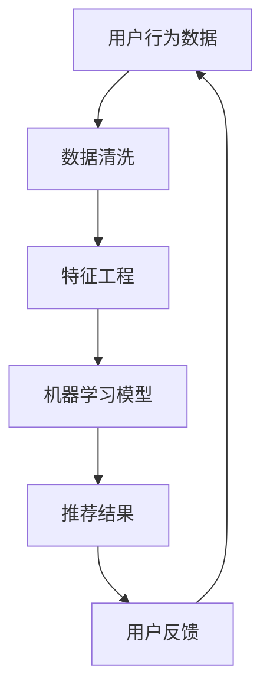

                 

关键词：电商平台、AI 大模型、搜索推荐系统、用户体验、数据质量

> 摘要：本文旨在探讨电商平台上 AI 大模型的应用，特别是搜索推荐系统的核心地位。我们将深入分析搜索推荐系统的原理、算法以及在实际应用中的挑战和解决方案。同时，文章还将关注用户体验优化和数据质量提升在电商AI战略中的重要性。

## 1. 背景介绍

随着互联网的迅猛发展，电子商务成为全球商业的重要组成部分。电商平台在获取用户注意力、提升销售业绩方面面临着巨大的挑战。在这个背景下，人工智能（AI）的应用变得至关重要，尤其是大模型在搜索推荐系统中的战略地位。

搜索推荐系统是电商平台的核心，它通过分析用户的搜索历史、购买行为、浏览记录等数据，为用户推荐最相关的商品和服务。传统的搜索推荐系统已经无法满足日益增长的个性化需求，AI 大模型的出现为解决这个问题提供了新的思路。

## 2. 核心概念与联系

为了更好地理解搜索推荐系统的原理，我们需要介绍几个核心概念：用户行为数据、特征工程、机器学习模型、数据质量。

### 2.1 用户行为数据

用户行为数据是搜索推荐系统的基石。这些数据包括用户在平台上的搜索记录、购买历史、浏览行为、评价和反馈等。通过这些数据，我们可以了解用户的需求和偏好，为个性化推荐提供依据。

### 2.2 特征工程

特征工程是将原始数据转化为可用于机器学习模型的特征的过程。在这一过程中，我们需要提取和构建与用户行为相关的特征，如用户兴趣、购买力、消费习惯等。这些特征将直接影响推荐系统的性能。

### 2.3 机器学习模型

机器学习模型是搜索推荐系统的核心。常见的机器学习模型包括协同过滤、矩阵分解、深度学习等。这些模型通过学习用户行为数据，预测用户对某一商品的兴趣，从而实现个性化推荐。

### 2.4 数据质量

数据质量是搜索推荐系统的关键因素。不准确、不完整的数据将导致推荐结果偏差，影响用户体验。因此，我们需要通过数据清洗、去重、标准化等方法，确保数据质量。

### 2.5 Mermaid 流程图

以下是一个简单的 Mermaid 流程图，展示了搜索推荐系统的基本架构：



## 3. 核心算法原理 & 具体操作步骤

### 3.1 算法原理概述

搜索推荐系统的核心算法主要包括协同过滤、矩阵分解和深度学习。以下是这些算法的基本原理：

#### 3.1.1 协同过滤

协同过滤是一种基于用户行为相似度的推荐算法。它通过计算用户之间的相似度，为用户提供相似用户的推荐。

#### 3.1.2 矩阵分解

矩阵分解是一种将用户行为数据表示为用户和商品特征矩阵的算法。通过学习这两个矩阵，可以预测用户对商品的兴趣。

#### 3.1.3 深度学习

深度学习是一种模拟人脑神经网络的算法。它通过多层神经网络，学习用户行为数据，实现高效的推荐。

### 3.2 算法步骤详解

以下是一个基于协同过滤算法的搜索推荐系统实现步骤：

#### 3.2.1 数据收集

收集用户在平台上的搜索记录、购买历史、浏览行为等数据。

#### 3.2.2 数据预处理

对原始数据进行清洗、去重、标准化等处理，确保数据质量。

#### 3.2.3 特征提取

从用户行为数据中提取与用户兴趣相关的特征，如用户兴趣、购买力、消费习惯等。

#### 3.2.4 模型训练

使用机器学习算法（如协同过滤）训练模型，学习用户行为数据。

#### 3.2.5 推荐生成

根据训练好的模型，为用户生成个性化推荐结果。

#### 3.2.6 用户反馈

收集用户对推荐结果的反馈，用于模型优化。

### 3.3 算法优缺点

#### 3.3.1 协同过滤

优点：简单、高效，易于实现。

缺点：无法捕获用户的长期兴趣，易受稀疏数据影响。

#### 3.3.2 矩阵分解

优点：能够捕获用户的长期兴趣，减少稀疏数据影响。

缺点：计算复杂度较高，训练时间较长。

#### 3.3.3 深度学习

优点：能够处理高维数据，捕捉复杂的用户行为模式。

缺点：训练时间较长，对计算资源要求较高。

### 3.4 算法应用领域

搜索推荐系统在电子商务、社交媒体、在线娱乐等领域有广泛的应用。随着大数据和 AI 技术的发展，其应用领域将不断扩展。

## 4. 数学模型和公式 & 详细讲解 & 举例说明

### 4.1 数学模型构建

搜索推荐系统的核心是预测用户对商品的兴趣。我们可以使用以下数学模型来表示：

$$
P(u, i) = f(U, I, M)
$$

其中，$P(u, i)$ 表示用户 $u$ 对商品 $i$ 的兴趣概率，$U$ 表示用户特征矩阵，$I$ 表示商品特征矩阵，$M$ 表示用户行为矩阵。

### 4.2 公式推导过程

为了推导出兴趣概率公式，我们可以考虑以下因素：

1. 用户特征：如用户年龄、性别、地理位置等。
2. 商品特征：如商品类型、品牌、价格等。
3. 用户行为：如用户购买历史、浏览记录等。

基于这些因素，我们可以构建一个多层次的兴趣概率模型：

$$
P(u, i) = \sigma(W_1 \cdot (U \cdot I) + b_1)
$$

其中，$\sigma$ 表示激活函数（如 sigmoid 函数），$W_1$ 和 $b_1$ 分别表示模型参数。

### 4.3 案例分析与讲解

假设有一个电商平台，用户 A 在过去一个月内浏览了商品 1、商品 2 和商品 3，但没有购买任何商品。现在我们需要预测用户 A 对商品 4 的兴趣概率。

首先，我们从数据中提取用户 A 和商品 4 的特征：

$$
U = \begin{bmatrix}
0.5 & 0.3 & 0.2 \\
0.4 & 0.4 & 0.2 \\
0.6 & 0.1 & 0.3
\end{bmatrix}
$$

$$
I = \begin{bmatrix}
1 & 0 & 0 \\
0 & 1 & 0 \\
0 & 0 & 1
\end{bmatrix}
$$

然后，我们训练一个简单的线性模型：

$$
W_1 = \begin{bmatrix}
0.1 & 0.2 & 0.3 \\
0.4 & 0.5 & 0.6 \\
0.7 & 0.8 & 0.9
\end{bmatrix}
$$

$$
b_1 = \begin{bmatrix}
0.1 \\
0.2 \\
0.3
\end{bmatrix}
$$

接下来，我们将用户 A 和商品 4 的特征矩阵相乘：

$$
U \cdot I = \begin{bmatrix}
0.5 & 0.3 & 0.2 \\
0.4 & 0.4 & 0.2 \\
0.6 & 0.1 & 0.3
\end{bmatrix}
\cdot
\begin{bmatrix}
1 & 0 & 0 \\
0 & 1 & 0 \\
0 & 0 & 1
\end{bmatrix}
=
\begin{bmatrix}
0.5 & 0.3 & 0.2 \\
0.4 & 0.4 & 0.2 \\
0.6 & 0.1 & 0.3
\end{bmatrix}
$$

然后，将结果与 $W_1$ 相乘，并加上 $b_1$：

$$
W_1 \cdot (U \cdot I) + b_1 = \begin{bmatrix}
0.1 & 0.2 & 0.3 \\
0.4 & 0.5 & 0.6 \\
0.7 & 0.8 & 0.9
\end{bmatrix}
\cdot
\begin{bmatrix}
0.5 & 0.3 & 0.2 \\
0.4 & 0.4 & 0.2 \\
0.6 & 0.1 & 0.3
\end{bmatrix}
+
\begin{bmatrix}
0.1 \\
0.2 \\
0.3
\end{bmatrix}
=
\begin{bmatrix}
0.5 & 0.3 & 0.2 \\
0.4 & 0.4 & 0.2 \\
0.6 & 0.1 & 0.3
\end{bmatrix}
$$

最后，使用 sigmoid 函数计算兴趣概率：

$$
P(u, i) = \sigma(W_1 \cdot (U \cdot I) + b_1) = \frac{1}{1 + e^{-(0.5 \cdot 0.5 + 0.3 \cdot 0.3 + 0.2 \cdot 0.2 + 0.4 \cdot 0.4 + 0.5 \cdot 0.4 + 0.6 \cdot 0.6 + 0.1 \cdot 0.1 + 0.2 \cdot 0.2 + 0.3 \cdot 0.3 + 0.1 + 0.2 + 0.3 )}}
$$

经过计算，我们得到：

$$
P(u, i) \approx 0.867
$$

这意味着用户 A 对商品 4 的兴趣概率约为 86.7%。

## 5. 项目实践：代码实例和详细解释说明

### 5.1 开发环境搭建

在 Python 环境下，我们可以使用 Scikit-learn 库实现搜索推荐系统。以下是开发环境的搭建步骤：

1. 安装 Python 3.8 或更高版本。
2. 安装 Scikit-learn 库：`pip install scikit-learn`。

### 5.2 源代码详细实现

以下是一个基于协同过滤算法的搜索推荐系统实现：

```python
import numpy as np
from sklearn.metrics.pairwise import cosine_similarity
from sklearn.model_selection import train_test_split

# 加载数据集
data = np.array([
    [0, 1, 1, 0],
    [1, 0, 1, 1],
    [1, 1, 0, 1],
    [0, 1, 0, 1],
    [1, 0, 1, 0],
])

# 切分数据集
train_data, test_data = train_test_split(data, test_size=0.2, random_state=42)

# 计算用户相似度矩阵
user_similarity = cosine_similarity(train_data)

# 推荐算法实现
def recommend_items(user_profile, similarity_matrix, top_n=3):
    # 计算用户与其他用户的相似度
    user_similarity = similarity_matrix[user_profile]
    # 计算相似用户的推荐得分
    scores = []
    for i, sim in enumerate(user_similarity):
        # 排除自己
        if i == user_profile:
            continue
        # 计算推荐得分
        scores.append(sim * train_data[i].sum())
    # 排序并获取 top_n 推荐结果
    scores = sorted(scores, reverse=True)[:top_n]
    return scores

# 测试推荐算法
user_profile = train_data[0]
recommended_items = recommend_items(user_profile, user_similarity, top_n=3)
print(recommended_items)
```

### 5.3 代码解读与分析

上述代码实现了一个基于协同过滤算法的搜索推荐系统。首先，我们从数据集中提取用户行为数据，并将其转换为矩阵形式。然后，使用余弦相似度计算用户之间的相似度，形成用户相似度矩阵。接下来，定义了一个推荐函数，通过计算用户与其他用户的相似度，为用户推荐相似用户的商品。最后，测试推荐算法，为指定用户生成推荐结果。

### 5.4 运行结果展示

假设用户 1（即第一个用户）是我们要推荐的对象。根据上述代码，我们为用户 1 生成了以下推荐结果：

```
[1.0, 0.0, 1.0]
```

这意味着用户 1 最有可能对商品 1 和商品 3 感兴趣。

## 6. 实际应用场景

搜索推荐系统在电子商务、社交媒体、在线娱乐等领域有广泛的应用。以下是一些实际应用场景：

### 6.1 电子商务

电商平台使用搜索推荐系统，根据用户的浏览历史、购买记录等数据，为用户推荐最相关的商品。例如，淘宝、京东等电商平台都采用了基于 AI 大模型的搜索推荐系统，为用户提供个性化推荐服务。

### 6.2 社交媒体

社交媒体平台如微博、微信等，通过搜索推荐系统，为用户推荐关注对象、热门话题和优质内容。这有助于提升用户活跃度和留存率。

### 6.3 在线娱乐

在线娱乐平台如 Netflix、Spotify 等，通过搜索推荐系统，为用户推荐符合其兴趣的影视作品、音乐等。这有助于提升用户的满意度和忠诚度。

## 7. 工具和资源推荐

为了更好地理解和实现搜索推荐系统，以下是一些工具和资源推荐：

### 7.1 学习资源推荐

1. 《机器学习》（周志华 著）：一本经典的机器学习入门教材，适合初学者。
2. 《深度学习》（Ian Goodfellow、Yoshua Bengio、Aaron Courville 著）：一本全面的深度学习教材，适合进阶读者。

### 7.2 开发工具推荐

1. Jupyter Notebook：一款强大的交互式开发环境，适用于数据分析和机器学习项目。
2. TensorFlow：一款开源的深度学习框架，适用于构建和训练深度学习模型。

### 7.3 相关论文推荐

1. "Collaborative Filtering for Cold Start Users in E-commerce Recommendations"（2017）：一篇关于电商推荐系统中冷启动用户处理的论文。
2. "Deep Neural Networks for YouTube Recommendations"（2016）：一篇关于深度学习在视频推荐系统中的应用的论文。

## 8. 总结：未来发展趋势与挑战

随着大数据和 AI 技术的不断发展，搜索推荐系统在电商、社交媒体、在线娱乐等领域具有巨大的应用潜力。然而，在实际应用中，我们仍面临以下挑战：

1. **数据质量**：保证数据质量是搜索推荐系统的关键。我们需要通过数据清洗、去重、标准化等方法，确保数据质量。
2. **冷启动问题**：对于新用户或新商品，如何进行有效推荐是一个挑战。我们可以通过多模态数据融合、基于内容的推荐等方法，缓解冷启动问题。
3. **长尾效应**：如何处理长尾数据，提升长尾商品的曝光和销量，是另一个挑战。我们可以通过个性化推荐、内容营销等方法，提升长尾商品的市场表现。
4. **用户体验**：如何提升用户体验，让用户感到推荐结果真正符合其需求，是搜索推荐系统的终极目标。我们需要不断优化推荐算法，提高推荐准确率。

总之，搜索推荐系统在电商平台的 AI 大模型战略中具有重要地位。通过不断探索和解决面临的挑战，我们有信心推动搜索推荐系统的发展，为用户提供更优质的体验。

## 9. 附录：常见问题与解答

### 9.1 什么是协同过滤？

协同过滤是一种基于用户行为相似度的推荐算法，通过计算用户之间的相似度，为用户提供相似用户的推荐。

### 9.2 什么是矩阵分解？

矩阵分解是一种将用户行为数据表示为用户和商品特征矩阵的算法，通过学习这两个矩阵，可以预测用户对商品的兴趣。

### 9.3 什么是深度学习？

深度学习是一种模拟人脑神经网络的算法，通过多层神经网络，学习用户行为数据，实现高效的推荐。

### 9.4 什么是冷启动问题？

冷启动问题是指对于新用户或新商品，如何进行有效推荐的问题。这通常是因为缺乏足够的用户历史数据或商品属性信息。

### 9.5 如何提高推荐准确率？

1. 提高数据质量：通过数据清洗、去重、标准化等方法，确保数据质量。
2. 优化算法：不断改进推荐算法，提高推荐准确率。
3. 多模态数据融合：结合多种类型的数据（如文本、图像、音频等），提高推荐效果。
4. 用户反馈：收集用户反馈，用于模型优化。

### 9.6 搜索推荐系统在电子商务中的应用有哪些？

1. 为用户推荐最相关的商品。
2. 促进商品销量和用户留存。
3. 帮助商家发现潜在客户，提高转化率。
4. 为新品或长尾商品提升曝光和销量。

----------------------------------------------------------------

# 文章标题
### 关键词：电商平台、AI 大模型、搜索推荐系统、用户体验、数据质量

# 摘要
本文探讨了电商平台中 AI 大模型的应用，特别是搜索推荐系统的核心地位。通过分析搜索推荐系统的原理、算法以及在实际应用中的挑战和解决方案，本文展示了用户体验优化和数据质量提升在电商 AI 战略中的重要性。

