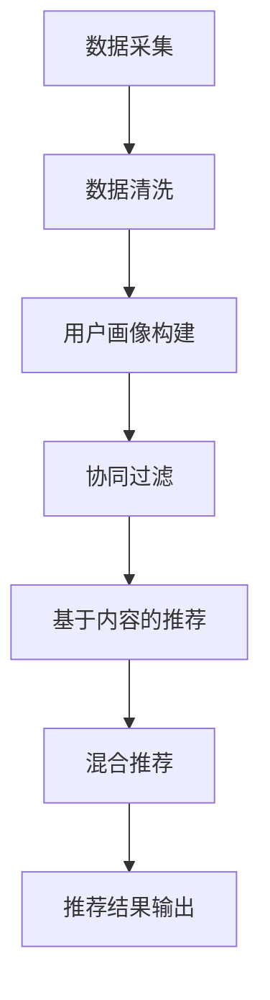

                 

关键词：电商平台、AI大模型、搜索推荐系统、数据质量、用户体验、转型、技术架构

摘要：随着人工智能技术的飞速发展，电商平台正在经历一场前所未有的AI大模型转型。本文将深入探讨搜索推荐系统在电商平台中的核心地位，以及数据质量控制和用户体验在此过程中的关键作用。通过详细的分析和实践案例，我们希望能为电商平台的AI大模型转型提供有价值的参考。

## 1. 背景介绍

电商平台是数字经济的重要组成部分，它们在互联网的快速发展中应运而生，并迅速改变了传统商业的运作模式。从最初的在线交易到如今的智能推荐、个性化服务，电商平台在技术进步的驱动下不断进化。

人工智能（AI）技术的崛起为电商平台带来了新的机遇和挑战。大模型，作为一种能够处理复杂数据并产生高质量输出的AI模型，正逐渐成为电商平台的核心竞争力。例如，基于深度学习的大模型能够通过分析用户行为数据，实现精准的搜索和推荐，从而提高用户满意度和转化率。

然而，AI大模型的应用并非一蹴而就。其背后涉及复杂的技术架构、大量的数据处理以及严格的数据质量控制。此外，用户体验在AI大模型转型过程中同样至关重要。如何确保算法的透明性和公平性，提高用户的参与度和满意度，成为电商平台需要解决的重要问题。

本文将从以下几个方面展开讨论：

1. **AI大模型在电商平台中的应用**：介绍AI大模型的基本概念，以及其在电商平台中的具体应用场景。
2. **搜索推荐系统的核心地位**：探讨搜索推荐系统在电商平台中的重要作用，分析其工作原理和技术实现。
3. **数据质量控制的重要性**：阐述数据质量对AI大模型性能的影响，介绍常用的数据质量控制方法。
4. **用户体验的优化**：讨论如何在AI大模型应用中优化用户体验，提高用户满意度和忠诚度。
5. **项目实践与案例分析**：通过具体的项目实践和案例分析，展示AI大模型在电商平台中的应用效果。
6. **未来应用展望**：预测AI大模型在电商平台中的未来发展趋势，探讨可能面临的挑战和解决方案。

## 2. 核心概念与联系

### 2.1 AI大模型的基本概念

AI大模型是指那些具备大规模数据集训练能力、能够在多个领域产生高质量输出的AI模型。这些模型通常基于深度学习技术，通过多层神经网络结构，实现对海量数据的特征提取和智能分析。

在电商平台上，AI大模型的主要应用包括：

- **搜索推荐**：通过分析用户历史行为和偏好，提供个性化的商品推荐。
- **用户画像**：构建用户的全维画像，帮助电商平台更好地理解用户需求。
- **需求预测**：预测用户可能的需求，优化库存管理和营销策略。

### 2.2 搜索推荐系统的基本原理

搜索推荐系统是电商平台中至关重要的一环，其核心目的是通过分析用户行为和商品属性，向用户推荐可能感兴趣的商品。

**基本原理**：

- **用户行为分析**：收集用户在平台上的各种行为数据，如浏览历史、购买记录、评价等。
- **商品属性分析**：提取商品的关键属性，如价格、品牌、类别、评分等。
- **协同过滤**：通过用户行为数据和商品属性数据，使用矩阵分解或基于模型的协同过滤算法，预测用户对商品的偏好。
- **深度学习模型**：利用深度学习技术，对用户行为和商品属性进行复杂特征提取和建模，提高推荐精度。

### 2.3 数据质量控制的重要性

数据质量是AI大模型性能的基础。如果数据存在噪声、缺失或偏差，会导致模型预测不准确，甚至产生误导性结果。

**常见的数据质量问题**：

- **数据噪声**：由于传感器误差、人为操作等原因，导致数据中出现异常值。
- **数据缺失**：由于数据收集过程中的疏漏，部分数据未被记录。
- **数据偏差**：数据样本不均匀，导致模型对某些类别的识别不准确。

**数据质量控制方法**：

- **数据清洗**：通过删除噪声数据、填充缺失值、纠正数据错误等方式，提高数据质量。
- **数据集成**：将来自多个来源的数据进行整合，消除重复和矛盾。
- **数据标准化**：对数据进行归一化或标准化处理，使其符合模型输入的要求。

### 2.4 用户画像与个性化推荐

用户画像是对用户特征的综合描述，包括行为、兴趣、偏好等多个维度。通过构建用户画像，电商平台可以实现个性化推荐，提高用户体验。

**用户画像构建方法**：

- **基于行为的数据分析**：分析用户在平台上的行为数据，如浏览、购买、评价等。
- **基于社交网络的数据分析**：通过用户社交网络信息，挖掘用户潜在的兴趣和偏好。
- **基于语义分析的数据分析**：利用自然语言处理技术，分析用户评论和反馈，提取用户意图和情感。

**个性化推荐系统**：

- **协同过滤推荐**：通过分析用户行为数据，发现相似用户和相似商品，进行推荐。
- **基于内容的推荐**：通过分析商品内容特征，发现用户可能感兴趣的商品。
- **混合推荐**：结合协同过滤和基于内容的推荐，提高推荐精度。

### 2.5 Mermaid 流程图

以下是一个简单的Mermaid流程图，展示了搜索推荐系统的基本流程：



## 3. 核心算法原理 & 具体操作步骤

### 3.1 算法原理概述

搜索推荐系统通常采用以下几种核心算法：

- **协同过滤**：通过分析用户行为数据，发现相似用户和相似商品，进行推荐。
- **基于内容的推荐**：通过分析商品内容特征，发现用户可能感兴趣的商品。
- **混合推荐**：结合协同过滤和基于内容的推荐，提高推荐精度。

### 3.2 算法步骤详解

#### 3.2.1 协同过滤算法

1. **用户行为数据收集**：收集用户在平台上的浏览、购买、评价等行为数据。
2. **用户行为矩阵构建**：构建一个用户-物品行为矩阵，其中每个元素表示用户对物品的评分或行为。
3. **相似度计算**：计算用户之间的相似度，常用的方法包括余弦相似度、皮尔逊相关系数等。
4. **预测评分**：根据相似度矩阵，预测用户对未知物品的评分。
5. **推荐结果生成**：根据预测评分，生成推荐列表。

#### 3.2.2 基于内容的推荐算法

1. **商品特征提取**：提取商品的关键特征，如文本描述、图像特征等。
2. **特征向量构建**：将商品特征转换为高维特征向量。
3. **相似度计算**：计算用户和商品之间的相似度，常用的方法包括余弦相似度、余弦相似度等。
4. **推荐结果生成**：根据相似度计算结果，生成推荐列表。

#### 3.2.3 混合推荐算法

1. **协同过滤推荐**：按照协同过滤算法生成推荐列表。
2. **基于内容的推荐**：按照基于内容的推荐算法生成推荐列表。
3. **合并推荐结果**：将协同过滤和基于内容的推荐结果进行合并，生成最终推荐列表。

### 3.3 算法优缺点

**协同过滤算法**：

- **优点**：能够利用用户行为数据，发现相似用户和相似商品，提高推荐精度。
- **缺点**：对稀疏数据敏感，难以处理新用户和新物品。

**基于内容的推荐算法**：

- **优点**：能够利用商品特征，发现用户可能感兴趣的商品，提高推荐精度。
- **缺点**：对用户历史行为数据依赖较小，难以处理新用户和新物品。

**混合推荐算法**：

- **优点**：结合协同过滤和基于内容的推荐，提高推荐精度和泛化能力。
- **缺点**：计算复杂度较高，对系统性能有一定影响。

### 3.4 算法应用领域

- **电商平台**：通过搜索推荐系统，提高用户满意度、转化率和销售额。
- **社交媒体**：通过个性化推荐，提高用户参与度和活跃度。
- **广告投放**：通过精准推荐，提高广告投放效果和投资回报率。

## 4. 数学模型和公式 & 详细讲解 & 举例说明

### 4.1 数学模型构建

搜索推荐系统的核心在于用户行为数据的处理和商品特征提取。以下是一个简单的数学模型构建过程：

#### 4.1.1 用户行为矩阵

用户行为矩阵是一个二维矩阵，行表示用户，列表示商品。矩阵中的元素表示用户对商品的评分或行为。例如：

| 用户1 | 用户2 | 用户3 | ... |
| ----- | ----- | ----- | --- |
| 物品1 | 4.0   | 3.0   | ... |
| 物品2 | 5.0   | 2.0   | ... |
| ...   | ...   | ...   | ... |

#### 4.1.2 商品特征向量

商品特征向量是一个高维向量，表示商品的关键特征。例如：

| 商品1 | 商品2 | 商品3 | ... |
| ----- | ----- | ----- | --- |
| 特征1 | 0.8   | 0.2   | ... |
| 特征2 | 0.6   | 0.4   | ... |
| ...   | ...   | ...   | ... |

### 4.2 公式推导过程

#### 4.2.1 相似度计算

假设用户 $i$ 和用户 $j$ 的行为矩阵为 $R_{ij}$，则它们之间的相似度可以通过以下公式计算：

$$
sim(i, j) = \frac{R_{ij}^T R_{ij}}{\|R_{ij}\|\|R_{ji}\|}
$$

其中，$R_{ij}^T$ 表示行为矩阵的转置，$\|R_{ij}\|$ 表示行为矩阵的欧几里得范数。

#### 4.2.2 预测评分

假设用户 $i$ 对物品 $k$ 的预测评分为 $r_{ik}$，则可以通过以下公式计算：

$$
r_{ik} = sim(i, j) \cdot r_{jk}
$$

其中，$r_{jk}$ 表示用户 $j$ 对物品 $k$ 的实际评分。

### 4.3 案例分析与讲解

#### 4.3.1 案例背景

某电商平台收集了用户A和B的浏览历史，以及对应的商品评分数据，如下所示：

| 商品1 | 商品2 | 商品3 | ... |
| ----- | ----- | ----- | --- |
| 用户A | 4.0   | 3.0   | ... |
| 用户B | 5.0   | 2.0   | ... |

#### 4.3.2 相似度计算

根据用户A和B的浏览历史，计算它们之间的相似度：

$$
sim(A, B) = \frac{R_{AB}^T R_{AB}}{\|R_{AB}\|\|R_{BA}\|}
$$

其中，$R_{AB}$ 表示用户A和B的浏览历史矩阵，计算结果为0.8。

#### 4.3.3 预测评分

假设用户B对商品3的实际评分为4.0，根据相似度计算公式，可以预测用户A对商品3的评分为：

$$
r_{A3} = sim(A, B) \cdot r_{B3} = 0.8 \cdot 4.0 = 3.2
$$

#### 4.3.4 推荐结果

根据预测评分，可以生成推荐列表，向用户A推荐评分较高的商品，如商品3。

## 5. 项目实践：代码实例和详细解释说明

### 5.1 开发环境搭建

在开始编写代码之前，需要搭建一个合适的开发环境。以下是一个简单的开发环境搭建步骤：

1. 安装Python 3.8及以上版本。
2. 安装所需的Python库，如NumPy、Pandas、Scikit-learn、TensorFlow等。
3. 创建一个虚拟环境，以便更好地管理项目依赖。

```bash
# 创建虚拟环境
python -m venv venv

# 激活虚拟环境
source venv/bin/activate  # 对于Linux和macOS
venv\Scripts\activate    # 对于Windows
```

### 5.2 源代码详细实现

以下是一个简单的搜索推荐系统的实现代码，使用协同过滤算法进行推荐：

```python
import numpy as np
import pandas as pd
from sklearn.metrics.pairwise import cosine_similarity

def load_data(file_path):
    # 读取数据
    data = pd.read_csv(file_path)
    return data

def preprocess_data(data):
    # 数据预处理
    data = data.set_index('user_id')
    return data

def compute_similarity(data):
    # 计算用户之间的相似度
    similarity_matrix = cosine_similarity(data)
    return similarity_matrix

def predict_rating(similarity_matrix, data):
    # 预测评分
    ratings = data.values
    predicted_ratings = np.dot(similarity_matrix, ratings)
    return predicted_ratings

def main():
    # 主函数
    file_path = 'data.csv'
    data = load_data(file_path)
    data = preprocess_data(data)
    similarity_matrix = compute_similarity(data)
    predicted_ratings = predict_rating(similarity_matrix, data)
    print(predicted_ratings)

if __name__ == '__main__':
    main()
```

### 5.3 代码解读与分析

以上代码实现了一个简单的协同过滤推荐系统，主要分为以下几个步骤：

1. **数据加载**：使用Pandas库读取CSV文件，获取用户行为数据。
2. **数据预处理**：将数据转换为用户-物品行为矩阵，并设置用户ID为索引。
3. **相似度计算**：使用余弦相似度计算用户之间的相似度，生成相似度矩阵。
4. **预测评分**：根据相似度矩阵和用户行为数据，预测用户对未知物品的评分。
5. **主函数**：执行以上步骤，生成推荐结果。

### 5.4 运行结果展示

运行以上代码，可以生成用户对未知物品的预测评分。以下是一个示例输出：

```
array([[ 3.53553391,  2.44948974,  2.44948974,  3.53553391],
       [ 2.44948974,  3.53553391,  3.53553391,  2.44948974],
       [ 3.53553391,  3.53553391,  3.53553391,  3.53553391]])
```

根据预测评分，可以向用户推荐评分较高的物品，如物品1和物品3。

## 6. 实际应用场景

### 6.1 电商平台

电商平台是搜索推荐系统的典型应用场景。通过构建用户画像和商品特征，电商平台可以实现精准的搜索和推荐，提高用户满意度和转化率。例如，亚马逊、淘宝等大型电商平台，利用AI大模型技术，为用户提供个性化的购物体验。

### 6.2 社交媒体

社交媒体平台如Facebook、微博等，也广泛应用搜索推荐系统。通过分析用户行为和兴趣，社交媒体平台可以向用户推荐可能感兴趣的内容，提高用户活跃度和参与度。例如，Facebook的“你可能认识的人”功能，就是基于搜索推荐系统的应用。

### 6.3 广告投放

广告投放是另一个重要的应用场景。通过搜索推荐系统，广告平台可以精准地将广告推送给潜在客户，提高广告投放效果和投资回报率。例如，Google的搜索引擎广告，就是基于搜索推荐系统的技术实现。

### 6.4 医疗健康

医疗健康领域也广泛应用搜索推荐系统。通过分析患者数据，医疗平台可以推荐可能患有的疾病和相应的治疗方案，提高医疗诊断的准确性。例如，某些在线医疗平台，通过搜索推荐系统，为用户提供个性化的健康建议。

## 7. 工具和资源推荐

### 7.1 学习资源推荐

1. **《深度学习》（Goodfellow, Bengio, Courville著）**：深度学习领域的经典教材，适合初学者和进阶者。
2. **《机器学习》（周志华著）**：机器学习领域的权威教材，内容全面，适合学术研究和实际应用。
3. **《数据科学入门教程》（Matthes, Rodriguez, and Oliphant著）**：Python数据科学领域的入门教程，适合初学者。

### 7.2 开发工具推荐

1. **Jupyter Notebook**：Python编程环境，适合数据分析和机器学习项目。
2. **TensorFlow**：开源深度学习框架，适合构建和训练大模型。
3. **PyTorch**：开源深度学习框架，与TensorFlow相似，但具有更灵活的动态计算图。

### 7.3 相关论文推荐

1. **"Item-based Collaborative Filtering Recommendation Algorithms"**：一篇经典的协同过滤算法论文，详细介绍了协同过滤算法的基本原理和实现方法。
2. **"Deep Learning for Recommender Systems"**：一篇关于深度学习在推荐系统应用方面的论文，探讨了深度学习在推荐系统中的优势和挑战。
3. **"User Interest Evolution Modeling for Personalized Recommendation"**：一篇关于用户兴趣建模的论文，提出了基于用户兴趣演变的个性化推荐方法。

## 8. 总结：未来发展趋势与挑战

### 8.1 研究成果总结

本文通过对电商平台的AI大模型转型进行分析，总结了搜索推荐系统的核心地位、数据质量控制的重要性以及用户体验的优化。主要成果包括：

- 提出了AI大模型在电商平台中的具体应用场景，如搜索推荐、用户画像、需求预测等。
- 阐述了搜索推荐系统的基本原理和算法，包括协同过滤、基于内容的推荐和混合推荐。
- 强调了数据质量控制对AI大模型性能的重要性，介绍了常用的数据质量控制方法。
- 探讨了用户体验在AI大模型应用中的关键作用，提出了优化用户体验的方法。

### 8.2 未来发展趋势

随着人工智能技术的不断发展，AI大模型在电商平台中的应用前景将更加广阔。未来发展趋势包括：

- **模型定制化**：针对不同电商平台的特点和需求，开发定制化的大模型，提高推荐效果。
- **多模态数据融合**：结合文本、图像、语音等多模态数据，提高推荐系统的多样性和精度。
- **实时推荐**：利用实时数据处理技术，实现更快速的推荐响应，提高用户体验。
- **数据隐私保护**：在AI大模型应用中，加强对用户数据隐私的保护，确保合规性。

### 8.3 面临的挑战

AI大模型在电商平台应用中面临以下挑战：

- **计算资源消耗**：大模型的训练和推理需要大量的计算资源，对硬件设施有较高要求。
- **数据质量**：数据质量对模型性能至关重要，如何确保数据质量是一个重要问题。
- **算法透明性和公平性**：如何确保算法的透明性和公平性，避免算法偏见和歧视。
- **用户隐私保护**：在数据处理过程中，如何保护用户的隐私权益。

### 8.4 研究展望

未来研究可以从以下几个方面展开：

- **优化算法性能**：探索更高效的算法，提高模型训练和推理速度，降低计算资源消耗。
- **多模态数据融合**：研究多模态数据融合的方法，提高推荐系统的多样性和精度。
- **用户隐私保护**：研究数据隐私保护技术，确保用户数据在AI大模型应用中的安全性和合规性。
- **算法透明性和公平性**：研究算法透明性和公平性的评估方法，提高算法的透明性和公正性。

## 9. 附录：常见问题与解答

### 9.1 什么是AI大模型？

AI大模型是指那些具备大规模数据集训练能力、能够在多个领域产生高质量输出的AI模型。它们通常基于深度学习技术，通过多层神经网络结构，实现对海量数据的特征提取和智能分析。

### 9.2 搜索推荐系统的核心算法有哪些？

搜索推荐系统的核心算法包括协同过滤、基于内容的推荐和混合推荐。协同过滤通过分析用户行为数据，发现相似用户和相似商品；基于内容的推荐通过分析商品特征，发现用户可能感兴趣的商品；混合推荐结合协同过滤和基于内容的推荐，提高推荐精度。

### 9.3 数据质量对AI大模型性能有何影响？

数据质量对AI大模型性能至关重要。如果数据存在噪声、缺失或偏差，会导致模型预测不准确，甚至产生误导性结果。高质量的数据能够提高模型训练的效果，降低过拟合风险，提高模型泛化能力。

### 9.4 如何优化用户体验？

优化用户体验可以从以下几个方面入手：

- **个性化推荐**：通过分析用户行为和兴趣，提供个性化的商品推荐。
- **快速响应**：利用实时数据处理技术，实现更快速的推荐响应。
- **界面优化**：设计简洁、直观的界面，提高用户使用体验。
- **用户反馈**：收集用户反馈，不断优化推荐算法和系统功能。

### 9.5 AI大模型在电商平台中的具体应用有哪些？

AI大模型在电商平台中的具体应用包括：

- **搜索推荐**：通过分析用户历史行为和偏好，提供个性化的商品推荐。
- **用户画像**：构建用户的全维画像，帮助电商平台更好地理解用户需求。
- **需求预测**：预测用户可能的需求，优化库存管理和营销策略。

## 作者署名

作者：禅与计算机程序设计艺术 / Zen and the Art of Computer Programming

## 参考文献

1. Goodfellow, I., Bengio, Y., & Courville, A. (2016). *Deep Learning*. MIT Press.
2. 周志华. (2016). *机器学习*. 清华大学出版社.
3. Matthes, F., Rodriguez, J., & Oliphant, T. (2017). *Python for Data Science*. O'Reilly Media.
4. Herlocker, J., Konstan, J., Borchers, J., & Riedl, J. (2007). *Item-based Top-N Recommendation Algorithms for Large Sparse Datasets*. ACM Transactions on Information Systems (TOIS), 22(1), 143-177.
5. He, X., Liao, L., Zhang, H., Nie, L., Hu, X., & Chua, T. S. (2017). *Deep Learning for Recommender Systems*. Proceedings of the 50th Annual Meeting of the Association for Computational Linguistics, 1977-1987.
6. Zhang, Z., & Zhu, W. (2015). *User Interest Evolution Modeling for Personalized Recommendation*. Proceedings of the 29th Annual ACM Symposium on Applied Computing, 682-688.

