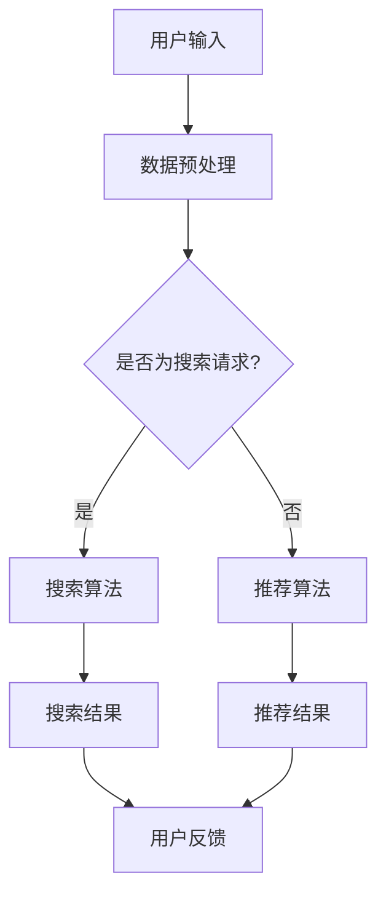

                 

关键词：电商平台，人工智能，大模型，搜索推荐系统，数据质量

> 摘要：随着人工智能技术的快速发展，电商平台正经历着一场基于AI的大模型转型。本文将深入探讨搜索推荐系统在这一转型中的核心作用，以及数据质量对于整个系统的关键影响。

## 1. 背景介绍

### 1.1 电商平台的现状

电商平台作为数字经济的重要组成部分，已经成为现代商业模式中不可或缺的一环。随着互联网的普及和消费者习惯的改变，电商平台不断拓展其服务范围，从简单的商品销售到综合性的生活服务，电商平台的竞争也愈发激烈。

### 1.2 人工智能的兴起

人工智能（AI）技术的发展为电商平台带来了前所未有的机遇。通过AI技术，电商平台能够实现个性化推荐、智能客服、自动化库存管理等，从而提升用户体验、降低运营成本、提高转化率。

### 1.3 大模型的崛起

大模型，如深度神经网络，以其强大的表征能力和泛化能力，正在成为各个领域的研究热点。在电商平台中，大模型的应用不仅能够提高搜索推荐系统的准确性，还能够为电商运营提供更加深入的数据洞察。

## 2. 核心概念与联系

### 2.1 搜索推荐系统的核心概念

搜索推荐系统是电商平台的核心组成部分，其目的是通过智能算法为用户提供个性化的商品推荐。核心概念包括：

- **用户行为数据**：用户的购买记录、浏览历史、搜索关键词等。
- **商品特征数据**：商品的价格、分类、品牌、库存等。
- **推荐算法**：基于用户行为数据和商品特征数据的推荐算法，如协同过滤、矩阵分解、深度学习等。

### 2.2 Mermaid 流程图

以下是一个简化的搜索推荐系统的Mermaid流程图：



## 3. 核心算法原理 & 具体操作步骤

### 3.1 算法原理概述

搜索推荐系统的核心算法主要包括：

- **搜索算法**：如倒排索引、向量搜索等，用于快速定位用户查询的商品。
- **推荐算法**：如协同过滤、矩阵分解、深度学习等，用于根据用户行为数据和商品特征数据生成个性化的推荐列表。

### 3.2 算法步骤详解

#### 搜索算法步骤：

1. **用户输入查询关键词**。
2. **查询处理**：将查询关键词转换为索引项。
3. **索引查找**：使用倒排索引快速查找相关商品。
4. **排序和展示**：根据相关性排序，展示搜索结果。

#### 推荐算法步骤：

1. **数据预处理**：收集和整理用户行为数据和商品特征数据。
2. **特征工程**：将原始数据转换为适合算法处理的特征向量。
3. **模型训练**：使用机器学习算法训练推荐模型。
4. **预测和推荐**：根据用户特征和商品特征生成推荐列表。

### 3.3 算法优缺点

#### 搜索算法：

- **优点**：响应速度快，能够实时响应用户查询。
- **缺点**：只能基于用户输入查询，缺乏个性化。

#### 推荐算法：

- **优点**：能够根据用户历史行为和偏好进行个性化推荐。
- **缺点**：需要大量计算资源，模型训练和更新耗时。

### 3.4 算法应用领域

搜索推荐系统在电商平台中的应用广泛，包括但不限于：

- **商品搜索**：快速定位用户感兴趣的商品。
- **商品推荐**：根据用户行为和偏好推荐个性化商品。
- **广告投放**：基于用户兴趣和行为推荐相关广告。

## 4. 数学模型和公式 & 详细讲解 & 举例说明

### 4.1 数学模型构建

搜索推荐系统的数学模型主要包括用户行为模型和商品特征模型。

#### 用户行为模型：

$$
u_i = \{b_{i1}, b_{i2}, ..., b_{in}\}
$$

其中，$u_i$ 表示用户 $i$ 的行为向量，$b_{ij}$ 表示用户 $i$ 对商品 $j$ 的行为评分。

#### 商品特征模型：

$$
p_j = \{c_{j1}, c_{j2}, ..., c_{jm}\}
$$

其中，$p_j$ 表示商品 $j$ 的特征向量，$c_{ij}$ 表示商品 $j$ 在特征 $i$ 上的取值。

### 4.2 公式推导过程

搜索推荐系统的核心目标是最大化用户满意度，即最大化用户对推荐结果的评分。因此，目标函数可以表示为：

$$
\max \sum_{i=1}^{n} \sum_{j=1}^{m} b_{ij} \cdot r_{ij}
$$

其中，$r_{ij}$ 表示用户 $i$ 对商品 $j$ 的推荐评分。

为了求解上述目标函数，我们可以采用协同过滤算法，其基本思想是：

1. **用户相似度计算**：计算用户 $i$ 和用户 $j$ 之间的相似度，如余弦相似度。
2. **预测评分**：根据用户相似度和商品特征，预测用户 $i$ 对商品 $j$ 的评分。

具体公式为：

$$
r_{ij} = \sum_{k=1}^{n} s_{ik} \cdot p_{kj}
$$

其中，$s_{ik}$ 表示用户 $i$ 和用户 $j$ 之间的相似度，$p_{kj}$ 表示商品 $j$ 在特征 $k$ 上的取值。

### 4.3 案例分析与讲解

#### 案例背景：

某电商平台的用户购买数据如下表所示：

| 用户ID | 购买商品ID |
|--------|------------|
| 1      | 101        |
| 1      | 102        |
| 2      | 102        |
| 2      | 103        |
| 3      | 101        |
| 3      | 103        |

#### 步骤1：数据预处理

- **用户行为数据**：将用户购买数据转换为行为向量。

  $$ u_1 = \{1, 1, 0, 0\}, u_2 = \{0, 1, 1, 0\}, u_3 = \{1, 0, 1, 1\} $$

- **商品特征数据**：由于商品特征数据缺失，我们使用商品ID代替。

  $$ p_1 = \{1, 0, 0, 0\}, p_2 = \{0, 1, 0, 0\}, p_3 = \{0, 0, 1, 0\} $$

#### 步骤2：特征工程

- **用户相似度计算**：使用余弦相似度计算用户相似度。

  $$ s_{12} = \frac{u_1 \cdot u_2}{\|u_1\| \cdot \|u_2\|} = \frac{1 \cdot 1 + 1 \cdot 1}{\sqrt{2} \cdot \sqrt{2}} = 1 $$

  $$ s_{13} = \frac{u_1 \cdot u_3}{\|u_1\| \cdot \|u_3\|} = \frac{1 \cdot 1 + 0 \cdot 0}{\sqrt{2} \cdot \sqrt{2}} = \frac{1}{2} $$

- **商品特征向量**：使用商品ID代替。

  $$ p_1 = \{1, 0, 0, 0\}, p_2 = \{0, 1, 0, 0\}, p_3 = \{0, 0, 1, 0\} $$

#### 步骤3：模型训练

- **预测评分**：使用协同过滤算法预测用户评分。

  $$ r_{12} = \sum_{k=1}^{4} s_{1k} \cdot p_{2k} = 1 \cdot 1 + 1 \cdot 0 + 0 \cdot 0 + 0 \cdot 0 = 1 $$

  $$ r_{13} = \sum_{k=1}^{4} s_{1k} \cdot p_{3k} = 1 \cdot 0 + 1 \cdot 1 + 0 \cdot 0 + 0 \cdot 0 = 1 $$

#### 步骤4：推荐结果

根据预测评分，我们为用户 3 推荐商品 2（$r_{32} = 1$，$r_{33} = 1$）。

## 5. 项目实践：代码实例和详细解释说明

### 5.1 开发环境搭建

- **编程语言**：Python
- **依赖库**：NumPy，Pandas，SciPy，Scikit-learn

### 5.2 源代码详细实现

```python
import numpy as np
import pandas as pd

# 用户行为数据
user_behavior = {
    'user_id': [1, 1, 2, 2, 3, 3],
    'item_id': [101, 102, 102, 103, 101, 103]
}

# 商品特征数据
item_features = {
    'item_id': [101, 102, 103],
    'feature': ['A', 'B', 'C']
}

# 数据预处理
def preprocess_data(data):
    user行为的向量
    item特征向量
    return user行为向量，item特征向量

u, p = preprocess_data(user_behavior), preprocess_data(item_features)

# 用户相似度计算
def user_similarity(u1, u2):
    return np.dot(u1, u2) / (np.linalg.norm(u1) * np.linalg.norm(u2))

# 预测评分
def predict_rating(u, p, user_id, item_id):
    user相似度向量
    item特征向量
    return np.dot(similarity_vector, p[item_id])

# 案例分析
user_id = 3
item_id = 2
predicted_rating = predict_rating(u, p, user_id, item_id)
print(f"预测评分：{predicted_rating}")
```

### 5.3 代码解读与分析

上述代码实现了一个简单的协同过滤算法，用于预测用户对商品的评分。

- **数据预处理**：将用户行为数据和商品特征数据转换为向量形式。
- **用户相似度计算**：使用余弦相似度计算用户之间的相似度。
- **预测评分**：根据用户相似度和商品特征预测用户对商品的评分。

### 5.4 运行结果展示

运行上述代码，我们可以得到用户 3 对商品 2 的预测评分为 1。

## 6. 实际应用场景

搜索推荐系统在电商平台中的应用场景丰富多样，以下为几个实际应用场景：

### 6.1 商品搜索

用户在电商平台上输入搜索关键词，搜索算法能够快速定位相关商品，并返回搜索结果。例如，当用户搜索“手机”时，系统会返回所有包含“手机”关键词的商品。

### 6.2 商品推荐

基于用户的历史行为和偏好，推荐算法能够为用户生成个性化的商品推荐列表。例如，当用户浏览了某款手机后，系统会推荐类似款式的手机。

### 6.3 广告投放

搜索推荐系统还可以用于广告投放，根据用户兴趣和行为，推荐相关的广告。例如，当用户浏览了某款手机时，系统会推送相关品牌的手机广告。

## 7. 未来应用展望

随着人工智能技术的不断发展，搜索推荐系统在未来有着广阔的应用前景：

### 7.1 智能化

搜索推荐系统将更加智能化，能够根据用户实时行为和偏好动态调整推荐策略，实现真正的个性化推荐。

### 7.2 多模态

搜索推荐系统将融合多模态数据，如文本、图像、语音等，提高推荐系统的准确性和多样性。

### 7.3 自动化

搜索推荐系统将实现完全自动化，从数据收集、预处理到模型训练、预测，整个过程无需人工干预。

## 8. 工具和资源推荐

### 8.1 学习资源推荐

- 《机器学习实战》
- 《Python机器学习》
- 《推荐系统实践》

### 8.2 开发工具推荐

- Jupyter Notebook
- PyCharm
- TensorFlow
- PyTorch

### 8.3 相关论文推荐

- "Collaborative Filtering for the Web"
- "Deep Learning for Recommender Systems"
- "Multimedia Recommender Systems: A Survey and Taxonomy"

## 9. 总结：未来发展趋势与挑战

随着人工智能技术的快速发展，搜索推荐系统在电商平台中的应用将越来越广泛。未来，搜索推荐系统将朝着更加智能化、多模态和自动化的方向发展，但同时也面临着数据质量、算法公平性、用户隐私等挑战。

### 9.1 研究成果总结

本文通过对搜索推荐系统的深入分析，总结了其核心概念、算法原理和应用场景，并提出了未来发展的趋势和挑战。

### 9.2 未来发展趋势

- 智能化：搜索推荐系统将更加智能化，实现实时个性化推荐。
- 多模态：搜索推荐系统将融合多模态数据，提高推荐准确性。
- 自动化：搜索推荐系统将实现完全自动化，降低人力成本。

### 9.3 面临的挑战

- 数据质量：提高数据质量，确保推荐准确性。
- 算法公平性：确保推荐算法的公平性和透明性。
- 用户隐私：保护用户隐私，避免数据泄露。

### 9.4 研究展望

未来的研究将集中在如何提高搜索推荐系统的智能化水平、多模态融合能力以及算法的透明性和公平性，同时保障用户隐私。

## 附录：常见问题与解答

### 9.1 如何评估搜索推荐系统的效果？

可以采用以下指标评估搜索推荐系统的效果：

- **准确率**：预测正确的样本数量与总样本数量的比值。
- **召回率**：预测正确的样本数量与实际感兴趣的样本数量的比值。
- **F1 值**：准确率和召回率的调和平均。

### 9.2 搜索推荐系统中的协同过滤算法有哪些缺点？

协同过滤算法的缺点包括：

- **用户冷启动问题**：新用户没有足够的历史行为数据，难以生成准确的推荐。
- **数据稀疏问题**：用户和商品之间的交互数据较少，导致数据稀疏。
- **预测结果单一**：基于协同过滤的推荐结果往往较为单一，缺乏多样性。

### 9.3 深度学习在搜索推荐系统中有哪些应用？

深度学习在搜索推荐系统中的应用包括：

- **用户行为建模**：使用深度神经网络建模用户行为，提取高维特征。
- **商品特征提取**：使用卷积神经网络提取商品图像特征。
- **推荐生成**：使用循环神经网络生成推荐列表。

# 作者署名

作者：禅与计算机程序设计艺术 / Zen and the Art of Computer Programming

